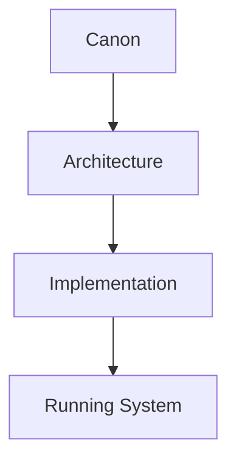
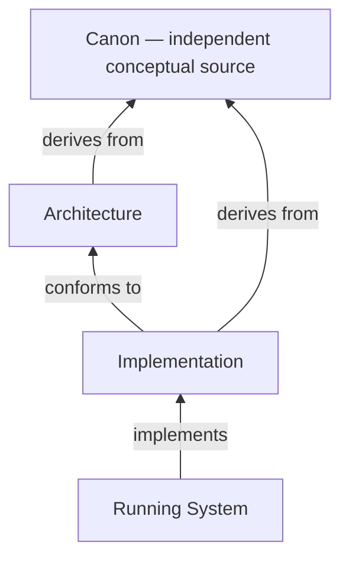

# Documentation

This repository is organized as a progression from enduring meaning to working software. Its primary documentation is divided into three conceptual layers:

For a fuller navigation guide to all documentation families, see the [Repository Map](./REPOSITORY_MAP.md).

1. **Canon** — defines what the Organizational Intelligence Platform means.
2. **Architecture** — defines how responsibilities and information are logically organized to realize the Canon.
3. **Implementation** — defines how the logical architecture is realized in working software.

Each layer answers a different class of questions and changes at a different rate. Keeping those layers separate allows technology to evolve without silently changing the platform's identity.

## Layer 1 — Canon

The [Canon](./canon/README.md) defines the permanent conceptual identity of the Organizational Intelligence Platform.

It answers questions such as:

- Why does the company exist?
- What product should exist?
- What principles guide decisions?
- What capabilities must the platform possess?
- What concepts exist in the platform universe?
- How do those concepts behave over time?
- How should intelligence think?

Canon documents change very slowly and are versioned independently under [Canon Governance](./canon/CANON_GOVERNANCE.md). They are the authoritative source of organizational meaning for every downstream document.

## Layer 2 — Architecture

The [Architecture layer](./architecture/README.md) defines how the Canon is realized through logical system design.

It answers questions such as:

- How is responsibility distributed?
- How is cognition decomposed?
- How is information represented?
- How is knowledge structured?
- How does the platform interact with the enterprise?

Architecture is implementation-independent. It defines responsibilities, boundaries, ownership, information, and interactions without selecting concrete technologies. Architecture derives from the Canon and never redefines it.

## Layer 3 — Implementation

The [Implementation layer](./implementation/README.md) defines how the architecture is realized in working software.

It answers questions such as:

- What is Version 1?
- Which services and runtime responsibilities exist?
- Which interfaces and APIs exist?
- Which storage technologies are used?
- How is the platform deployed and operated?
- How is security implemented?

Implementation decisions may evolve rapidly as technology, scale, evidence, and operational needs change. Those decisions remain constrained by the Canon and the logical Architecture.

## Documentation Dependency Rules

- Canon documents may not depend on Architecture or Implementation.
- Architecture documents may depend on the Canon only.
- Implementation documents may depend on both Canon and Architecture.
- No implementation document may redefine Canon concepts.

Within a layer, documents may reference earlier documents in the same layer. “May depend on” above describes permitted dependencies across layer boundaries: Canon is independent; Architecture cannot depend on Implementation; Implementation may depend upward on both stable layers.

Arrows point from the dependent layer to the layer it depends on. No reverse dependency is permitted.

## Repository Map

| Area | Purpose |
| --- | --- |
| [`canon/`](./canon/README.md) | Authoritative philosophy, product identity, principles, capabilities, Domain language, workflows, cognition, and Canon Governance. |
| [`architecture/`](./architecture/README.md) | Stable logical realization of the Canon through system, agent, data, knowledge, and integration architecture. |
| [`implementation/`](./implementation/README.md) | Concrete engineering scope and decisions used to build and operate the platform. |
| [`product/`](./product/README.md) | Product definitions and experience specifications derived from the Canon. |
| [`research/`](./research/README.md) | Evidence, findings, assumptions, and open questions that inform product and strategy. |
| [`strategy/`](./strategy/README.md) | Company, product, market, platform, and expansion strategy. |
| [`roadmap/`](./roadmap/README.md) | Time-bounded sequencing, milestones, dependencies, and capability-maturity targets. |
| [`hackathon/`](./hackathon/00_HACKATHON_SCOPE.md) | Practical solo-developer prototype scope, demo flow, exclusions, success criteria, and judging alignment. |

## Repository Philosophy

> The purpose of this repository is not merely to document software.

> It is to preserve the conceptual identity of the Organizational Intelligence Platform while allowing implementation to evolve independently.

The Canon preserves meaning.

Architecture preserves structure.

Implementation delivers working software.

Together they ensure that technology can evolve without losing the platform's identity.
