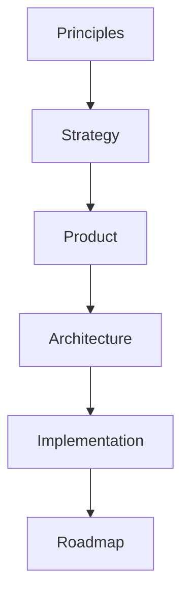
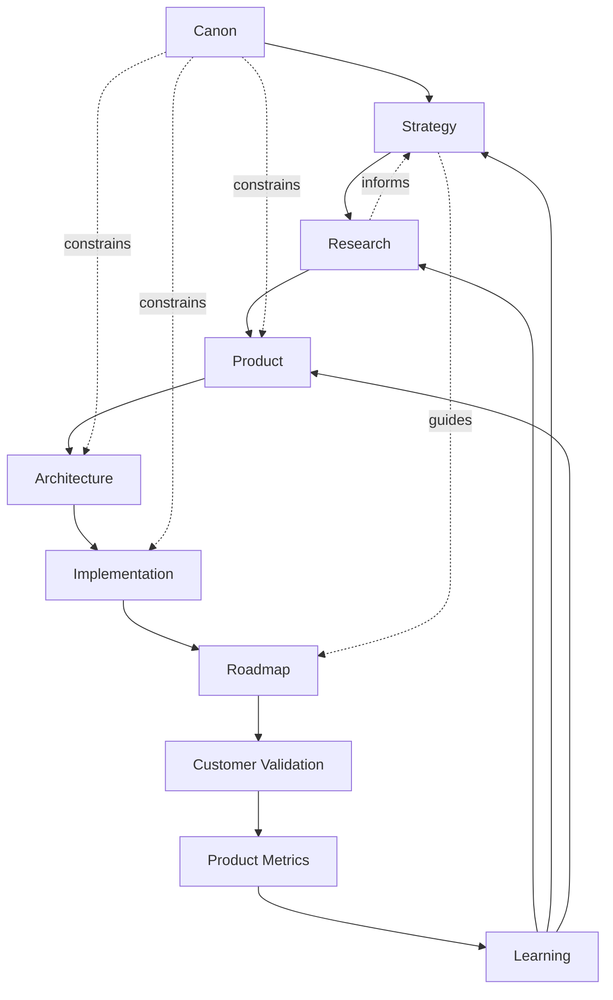
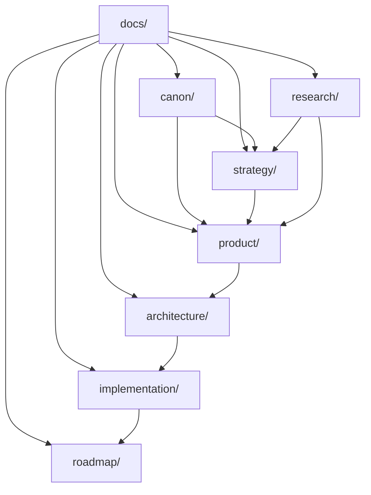
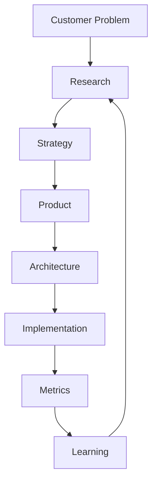
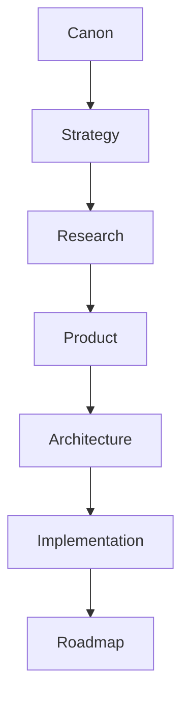
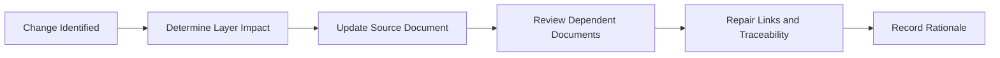
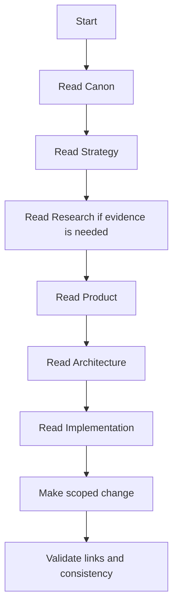

# Repository Map

## Primary Question

How is the entire repository organized, and how do its major document families depend on one another?

This document is the navigation guide for the Organizational Intelligence Platform repository.

It is not a product specification, architecture document, roadmap, or project plan.

## 1. Executive Summary

The repository is intentionally layered.

Each layer answers a different question. No layer should duplicate another. Higher layers define meaning, direction, and constraints. Lower layers translate those constraints into product, architecture, implementation, and execution decisions.

The core idea is simple:

| Layer | Primary Question |
| --- | --- |
| Canon | What must always remain true? |
| Strategy | Where are we going? |
| Research | Why do we believe this? |
| Product | What are we building? |
| Architecture | How is the platform structured? |
| Implementation | How is it actually built? |
| Roadmap | What gets built next? |

Every implementation should be traceable back to first principles.

## 2. Repository Philosophy

The repository flows from enduring principles to practical execution.

Every lower layer derives from higher layers.

Every higher layer constrains lower layers.

This prevents the platform from drifting into disconnected features, short-term implementation choices, or AI novelty without product integrity. The repository should preserve meaning while allowing execution to evolve.

## 3. Repository Dependency Diagram

The repository is not purely linear. It has a learning loop.

The Canon changes rarely. Strategy, Research, Product, Architecture, Implementation, and Roadmap evolve as evidence accumulates. Learning may update downstream documents quickly, but it should update higher-level documents only when the evidence is strong enough.

## 4. Repository Layers

## Folder Relationship Diagram

## Layer Summary

| Folder | Answers | Contains |
| --- | --- | --- |
| [`canon/`](./canon/README.md) | What must always remain true? | Vision, principles, terminology, constraints, governance, domain language, workflows, and cognitive model. |
| [`strategy/`](./strategy/README.md) | Where are we going? | Category design, positioning, ICP, go-to-market, pricing, growth, partnerships, business model, competitive strategy, and long-term vision. |
| [`research/`](./research/README.md) | Why do we believe this? | Market research, customer discovery, competitor research, AI research, technology research, regulatory research, experiments, and research backlog. |
| [`product/`](./product/README.md) | What are we building? | Product philosophy, strategy, requirements, personas, journeys, stories, workflows, information architecture, feature catalog, MVP features, metrics, and governance. |
| [`architecture/`](./architecture/README.md) | How is the platform structured? | Conceptual system, AI agent, data, knowledge representation, and integration architecture. |
| [`implementation/`](./implementation/README.md) | How is it actually built? | MVP scope, implementation architecture, technology decisions, API, storage, deployment, and security architecture. |
| [`roadmap/`](./roadmap/README.md) | What gets built next? | Phased execution, milestones, sequencing, dependencies, and capability maturity targets. |
| [`hackathon/`](./hackathon/00_HACKATHON_SCOPE.md) | What will be demonstrated now? | Practical prototype scope, demo flow, exclusions, success criteria, technical boundaries, and judging alignment. |

## Canon

Canon answers:

> What must always remain true?

It is the authoritative conceptual source of truth for the platform. It defines why the company exists, what product must exist, how decisions should be made, what capabilities matter, what concepts exist, how workflows behave, and how intelligence should think inside the platform.

Canon documents should rarely change.

## Strategy

Strategy answers:

> Where are we going?

It explains the category, market, customer focus, business model, competitive posture, growth path, partnerships, and long-term ambition.

Strategy must never contradict Canon.

## Research

Research answers:

> Why do we believe this?

It stores evidence, assumptions, market understanding, customer discovery, technology analysis, experiments, and unanswered questions.

Research continuously informs Strategy, Product, Roadmap, and future experiments.

## Product

Product answers:

> What are we building?

It translates Canon, Strategy, and Research into product philosophy, requirements, personas, user journeys, stories, workflows, information architecture, capabilities, MVP scope, metrics, and governance.

Product documents should define durable product meaning rather than temporary implementation choices.

## Architecture

Architecture answers:

> How is the platform structured?

It defines conceptual system structure, responsibility boundaries, AI agents, data, knowledge representation, and integrations.

Architecture derives from Product and Canon. It should not redefine either.

## Implementation

Implementation answers:

> How is it actually built?

It translates architecture into practical implementation guidance: scope, technology decisions, APIs, storage, deployment, and security.

Implementation may evolve faster than Canon, Strategy, Product, or Architecture.

## Roadmap

Roadmap answers:

> What gets built next?

It sequences execution based on strategy, product priorities, technical dependency, research evidence, customer validation, and capability maturity.

Roadmap should change when learning changes priorities.

## 5. Dependency Rules

| Rule | Meaning |
| --- | --- |
| Canon influences everything. | All documents must conform to the Canon's philosophy, terminology, constraints, and product identity. |
| Strategy never contradicts Canon. | Strategy may interpret the market, but it cannot redefine what the platform is. |
| Research informs every layer. | Evidence may refine assumptions, but major conceptual changes require governance. |
| Product derives from Strategy and Canon. | Product decisions should support the category, ICP, positioning, and long-term product identity. |
| Architecture implements Product. | Architecture structures responsibilities needed to realize product capabilities. |
| Implementation follows Architecture. | Implementation choices should realize architectural boundaries rather than erase them. |
| Roadmap sequences Implementation. | Roadmap decides what to build next; it should not redefine the product. |
| Metrics close the loop. | Product Metrics determine whether execution creates Organizational Intelligence and customer value. |
| Documentation preserves traceability. | Every major document should state what it derives from and what it informs. |

## 6. Decision Flow

Product and engineering decisions should move through evidence, strategy, product definition, architecture, implementation, and measurement.

## Decision Flow Table

| Stage | Decision Question |
| --- | --- |
| Customer Problem | What real problem are we solving? |
| Research | What evidence supports the problem and assumptions? |
| Strategy | Does this fit the market, category, ICP, and company direction? |
| Product | What capability, persona, journey, or workflow should change? |
| Architecture | What conceptual structure or responsibility is required? |
| Implementation | How should it be built within current constraints? |
| Metrics | How will we know whether it worked? |
| Learning | What should change based on evidence? |

## 7. Document Creation Order

The recommended creation order minimizes rework.

## Recommended Order

| Order | Layer | Why It Comes Here |
| --- | --- | --- |
| 1 | Canon | Establishes enduring meaning before decisions multiply. |
| 2 | Strategy | Defines market direction and business logic before product detail. |
| 3 | Research | Grounds decisions in evidence and identifies assumptions. |
| 4 | Product | Defines what to build after knowing purpose, market, and evidence. |
| 5 | Architecture | Structures the platform around product capabilities. |
| 6 | Implementation | Chooses practical realization after architecture is clear. |
| 7 | Roadmap | Sequences execution after scope, dependencies, and priorities are known. |

In practice, Research may begin early and continue always. The order describes dependency logic, not a one-time waterfall.

## 8. Repository Maintenance

Repository maintenance should preserve coherence.

| Practice | Guidance |
| --- | --- |
| Update higher layers first | If a change affects product meaning, strategy, or Canon, update those layers before downstream documents. |
| Propagate changes downward | When a higher-level document changes, review dependent Product, Architecture, Implementation, and Roadmap documents. |
| Preserve traceability | New documents should explicitly state their sources and dependencies. |
| Avoid duplication | Do not restate entire documents; link to the authoritative source. |
| Treat documents as Organizational Memory | The repository should preserve decisions, rationale, relationships, and evolution over time. |
| Keep links current | Internal Markdown links should be updated when files move or names change. |
| Mark obsolete documents | If a document is superseded, state where the current source of truth lives. |

## Maintenance Flow

## 9. AI Collaboration

AI assistants should use the repository hierarchy before proposing or making changes.

This applies to Codex, ChatGPT, Gemini, Claude, Perplexity, Manus, and any future AI collaborator.

## AI Collaboration Rules

| Rule | Guidance |
| --- | --- |
| Read Canon first | Understand the platform's purpose, terminology, principles, workflows, and cognitive model. |
| Understand Strategy before suggesting features | Features should support category, ICP, positioning, business model, and long-term direction. |
| Read Product before writing code | Implementation should serve product requirements, personas, journeys, workflows, information architecture, MVP scope, metrics, and governance. |
| Respect Architecture before implementation | Code and technical artifacts should preserve responsibility boundaries and conceptual structure. |
| Never contradict higher-level documents | Lower-level artifacts may extend higher-level meaning but must not redefine it. |
| Preserve repository consistency | Update indexes, links, traceability, and derived-from sections when adding documents. |
| Prefer extension over duplication | Link to authoritative documents instead of copying large sections into new files. |
| Use Product Metrics for validation | Proposed changes should identify how success or risk will be measured. |

## AI Reading Path

AI systems can contribute effectively when they follow the hierarchy. Without the hierarchy, they may produce plausible work that slowly contradicts the repository's intent.

## 10. Closing

This repository is not simply documentation.

It is the Organizational Intelligence Platform's organizational memory.

Every document exists for a specific purpose. Every layer derives from the one above it. Every implementation should be traceable back to first principles.

As the platform evolves, this structure should enable many contributors and AI systems to work together while preserving coherence, consistency, and long-term product integrity.

The repository should help the company do for itself what the platform does for customers:

- Preserve memory.
- Make decisions traceable.
- Learn from evidence.
- Govern change.
- Improve future work.

That is the point of the map.
