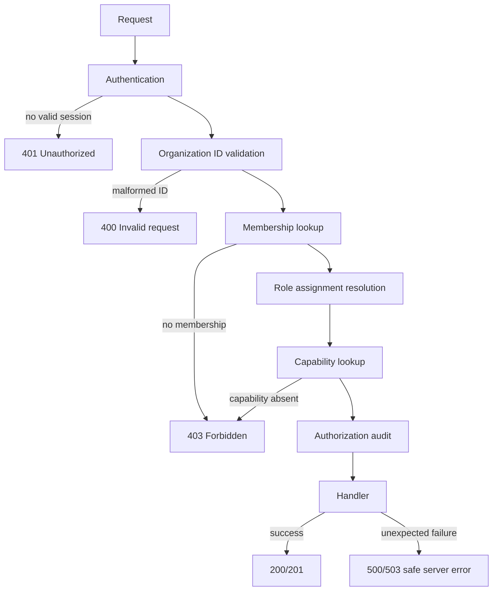

# RSS-1.1 RBAC Stabilization Report

Date: 2026-08-05

## Executive Summary

RBAC authorization is stabilized and TODO-078 passes in both a clean development server and a production server.

The observed HTTP 500 was reproduced on the existing multi-process development server. Its `.next` output was concurrently corrupted: route loading failed with `MODULE_NOT_FOUND` for `webpack-runtime.js`. The failure occurred before the route could serialize the RBAC 403 response.

The authorization layer also contained a release-hardening defect: `requireCapability` converted every exception into a 403, including database and infrastructure failures. That made genuine server failures indistinguishable from permission denials. The fix maps only typed authorization denials to 401/403 and allows unexpected failures to reach the safe 500/503 error boundary. Action authorization now follows the same rule. Session expiry comparison is normalized to epoch milliseconds and fails closed for invalid timestamps.

No RBAC capabilities, role model, Organizational Memory, Reflection, Trust, Ticket reasoning, Retrieval, DeepSeek, Certification logic, Workers, or Connectors were redesigned.

## Authorization Flow



Decision points are deterministic: authentication precedes tenancy checks; membership is required before role resolution; the durable role assignment is preferred over the legacy membership role; capability absence is a denial; audit-write failure cannot grant access; unexpected lookup or infrastructure failures are not converted into denials.

## Root Cause Analysis

### Exact failing component

The original live 500 was the Next.js development artifact loader, not the permission evaluator. Multiple Next processes shared `.next`; the server log showed missing generated webpack runtime files while loading organization routes.

The RBAC code defect found during the audit was `lib/server/authorization.ts::requireCapability`. Its catch-all handler transformed any thrown error into `AuthorizationError(FORBIDDEN)`. This was unsafe because custom route error converters could then treat the wrong error type as an application failure, while infrastructure failures were misclassified as authorization decisions.

### Resolution

- `AuthorizationServiceError` now carries a typed denial reason.
- `requireCapability` converts only `AuthorizationServiceError` into 403 and rethrows all other failures for safe 500/503 classification.
- Governed-action capability checks use the same typed-denial boundary.
- Expiry timestamps are normalized before comparison; invalid or expired timestamps fail closed.
- TODO-078 now covers anonymous, expired-session, deleted-user, removed-membership, invalid-ID, unknown-organization, malformed-request, cross-organization, missing-capability, role-change, last-owner, audit, and role-matrix cases.

## Authorization Matrix

The supported durable roles are:

| Role | Effective capability policy | Expected result |
| --- | --- | --- |
| Owner | All declared capabilities, including ownership transfer | 200/201 for permitted operations |
| Administrator | All declared capabilities except ownership transfer | 200/201 except ownership transfer, which is 403 |
| Reviewer | Organization/ticket review, knowledge promotion/version/trust, reflection, preparation/approval, read and operational inspection | 200/201 for granted operations; 403 otherwise |
| Operator | Worker and connector operations, operational reads, and action preparation | 200/201 for granted operations; 403 otherwise |
| Support Agent | Ticket submission/review/bulk preparation plus read and inspection capabilities | 200/201 for granted operations; 403 otherwise |
| Viewer | Read-only organization, ticket, knowledge, reflection, worker, connector, operations, and metrics capabilities | 200 for reads; 403 for writes/admin/approval |

TODO-078 verifies that all six durable roles exist and each has capabilities. It also verifies viewer read access, viewer denial of audit and connector installation, reviewer capability activation after role assignment, and owner-only last-owner protections.

## HTTP Verification

| Scenario | Expected | Verified |
| --- | ---: | --- |
| Anonymous organization request | 401 | Pass |
| Expired session | 401 | Pass |
| Deleted user with stale session | 401 | Pass |
| Malformed organization ID | 400 | Pass |
| Authenticated user without membership | 403 | Pass |
| Cross-organization access | 403 | Pass |
| Unknown organization for non-member | 403 without existence disclosure | Pass |
| Member without capability | 403 | Pass |
| Viewer organization read | 200 | Pass |
| Authorized role assignment | 200 | Pass |
| Last-owner demotion/removal | 409 | Pass |
| Unexpected infrastructure failure | 500/503 safe response | Code path preserved; no synthetic failure injected |

Responses expose safe error codes/messages only. Stack traces, secrets, and internal implementation details are not returned.

## Security Review

- Cross-organization access remains membership-gated and is evaluated before protected organization data is read.
- Unknown organizations return the non-member authorization response rather than disclosing existence to an authenticated non-member.
- Permission failures are audited with actor, organization, capability, decision, reason, request ID, correlation ID, and safe resource metadata.
- Audit sink failure cannot turn a denied decision into an allow.
- The TODO-078 audit assertion confirms probe secrets are absent from audit rows.
- Removed memberships and deleted users cannot continue to use an existing session for organization access.
- Multiple role assignments remain constrained by the existing one-role-per-user-per-organization model; role changes are re-evaluated on the next request.

## Regression Results

| Check | Result |
| --- | --- |
| TODO-078 RBAC probe, clean dev server | PASS |
| TODO-078 RBAC probe, production server | PASS |
| TypeScript (`tsc --noEmit`) | PASS |
| Prisma validation | PASS |
| Production build | PASS |
| TODO-067 | PASS |
| TODO-068 | PASS |
| TODO-069 | PASS |
| TODO-070 | PASS |
| TODO-080 | PASS |
| TODO-082A | PASS |
| TODO-082C | PASS |
| OIP Benchmark | 1000/1000, 100% overall, 100% critical security |
| Certification suite | REGRESSION_FAILURE at existing TODO-058B; later stages were not run |

Certification stopped on three unrelated TODO-058B failures: invoice canonical convergence, concept-assist language expectations, and email-address categorization. No RBAC assertion failed in that run.

## Remaining Limitations

The overall release gate is not clear because the existing certification suite currently stops at TODO-058B. That issue is outside RSS-1.1 RBAC scope and was not modified.

There is no separate fault-injection HTTP probe for a live database outage; the safe error behavior is verified by code-path inspection and build/type validation. Genuine infrastructure failures are intentionally preserved as server failures rather than relabeled 403 responses.

## Recommendation

```text
NOT READY
```

RBAC is ready for RSS-1.2 from a focused TODO-078 perspective, but the release recommendation remains NOT READY until the unrelated TODO-058B certification regression is resolved and the complete certification suite can finish.
