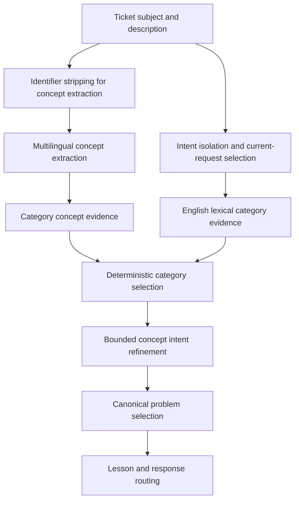

# RSS-1.1A Certification Regression Report

Date: 2026-08-05

## Executive Summary

RSS-1.1A fixed all three TODO-058B certification regressions without changing RBAC, Organizational Memory, Reflection, Trust, Workers, Connectors, DeepSeek integration, or certification logic.

Root causes:

1. Multilingual duplicate-invoice text extracted `invoice` but not reliable duplicate-record evidence for several languages. The concept-to-intent map therefore selected the generic `invoice_question` intent and the generic invoice canonical.
2. Indonesian `tidak bisa login` was conservatively marked as an ignored login topic by intent isolation. The analyzer then applied a contradiction penalty and incorrectly recorded concept assistance even though the direct `login` loanword was valid lexical evidence.
3. The billing-contact hint treated the bare word `contact` as sufficient context. `contact` plus an email identifier therefore became `billing_contact_update`, even though the input contained no business request.

Resolution:

- Added language-specific duplicate-invoice aliases to the existing `duplicate_record` vocabulary.
- Made duplicate-invoice refinement a bounded compound concept rule: `invoice + duplicate_record -> duplicate_invoice`.
- Preserved direct login lexical evidence when intent isolation conservatively marks the same topic as ignored; explicit English contradiction patterns remain authoritative.
- Required billing/invoice/recipient context before the billing-contact hint can fire; a bare contact label and email identifier now fail closed.
- Expanded TODO-058B regression coverage for malformed and multiple email identifiers, mixed-language invoices, quoted/resolved history, multiple invoices, and whitespace variation.

TODO-058B passes with no HTTP or application-server dependency. The release certification pipeline passes all regression stages through async validation, but the release is not yet certifiable because the existing TODO-046 chaos/safety gate fails and release mode requires a clean worktree.

## Authorization Flow

RSS-1.1A changes the deterministic classification path only:



Decision points:

- Identifier-only input cannot create concept evidence or a business category.
- Existing English lexical matches keep precedence.
- Concept evidence is used only when lexical evidence is absent and meets the existing evidence threshold.
- Duplicate-invoice refinement requires both `invoice` and `duplicate_record` concepts.
- Quoted or resolved duplicate-invoice history does not override the current invoice request.

## Root Cause Analysis

### A. Invoice canonical convergence

The failing component was the combination of `lib/conceptVocabulary.ts` and `CONCEPT_INTENT_RULES` in `lib/analyzer.ts`. Several supported-language phrases such as Spanish `factura duplicada`, French `facture en double`, German `doppelte Rechnung`, and equivalent Portuguese, Italian, Japanese, Korean, and Chinese forms produced the invoice concept but not the existing duplicate-record concept. Even when duplicate evidence was available, the refinement rule only mapped the generic invoice concept to `invoice_question`.

The fix adds the missing surface aliases and requires the compound concept pair for the specific `duplicate_invoice` intent. This is deterministic, does not create a new category, and cannot refine unrelated Billing tickets based on a generic duplicate word alone.

### B. Concept-assist language expectation

The failing component was the interaction between `isolateIntent()` and the Login contradiction penalty in `lib/analyzer.ts`. Intent isolation treated the Indonesian failure sentence as negated/ignored, and the analyzer used that ignored-topic marker as a Login penalty. The direct `login` token was therefore rescued through concept evidence and was reported as concept-assisted.

The fix retains the existing explicit contradiction patterns, but does not penalize an ignored Login topic when direct `login`, `log in`, or `sign in` wording is present. The Indonesian case now remains lexical, matching the intended compatibility baseline.

### C. Email address categorization

The failing component was `primaryIssueHint` in `lib/intentIsolation.ts`. Its billing-contact branch accepted `contact` as both the object and the change signal. The probe input `contact / user@example.com` therefore reached `billing_contact_update`, although concept extraction correctly stripped the address and business relevance correctly returned uncertain.

The fix requires a billing, invoice, tagihan, email-address, or recipient context before the contact-change hint can fire. Identifier-only inputs now remain Uncategorized/General and do not become a billing request.

## Authorization Matrix

TODO-058B uses four supported multilingual problem families across ten languages. Every language reaches the same category and canonical problem as the English baseline.

| Family | Languages | Category | Canonical result |
| --- | --- | --- | --- |
| Login | English, Indonesian, Spanish, French, German, Portuguese, Italian, Japanese, Korean, Chinese | Login | One shared Login canonical |
| Duplicate invoice | English, Indonesian, Spanish, French, German, Portuguese, Italian, Japanese, Korean, Chinese | Billing | `canonical-duplicate-invoice` |
| MFA after device change | English, Indonesian, Spanish, French, German, Portuguese, Italian, Japanese, Korean, Chinese | Two-Factor Auth | One shared MFA canonical |
| Delivery delay | English, Indonesian, Spanish, French, German, Portuguese, Italian, Japanese, Korean, Chinese | Delivery Delay | One shared delivery canonical |

Negative and boundary cases fail closed: anonymous identifier text, malformed email addresses, Unicode email identifiers, generic concepts, unsupported-language text, quoted/resolved duplicate history, and weak single aliases do not invent a category or concept.

## HTTP Verification

RSS-1.1A does not change HTTP authorization behavior. The live application was started for the required cross-release verification, and TODO-078 returned a passing result with no HTTP 500 responses. The analyzer regression itself is offline and deterministic; its expected outcomes are:

- email identifier only: Uncategorized/General, not Billing;
- mixed-language duplicate invoice: Billing and `canonical-duplicate-invoice`;
- quoted/resolved duplicate invoice: current invoice canonical, not duplicate-invoice canonical;
- malformed or whitespace-separated identifiers: no concept evidence.

## Security Review

- No RBAC or authorization code was changed for RSS-1.1A.
- Email addresses, malformed identifiers, URLs, and ticket identifiers remain non-semantic during concept extraction.
- A bare identifier cannot authorize a category, lesson, or response path.
- Existing quoted/resolved suppression and contradiction handling remain in place.
- OIP Benchmark remains 1000/1000 with 100% critical security checks.
- TODO-078 passes when the application server is running; the initial certification failure was only `ECONNREFUSED` because no server was listening.

## Regression Results

| Gate | Result |
| --- | --- |
| TODO-058B | PASS, including expanded regression cases |
| TODO-080 | PASS |
| TODO-082A | PASS |
| TODO-082C | PASS |
| TODO-083 | PASS |
| TODO-083 expanded | PASS, 200/200 |
| TODO-067 | PASS |
| TODO-068 | PASS |
| TODO-069 | PASS |
| TODO-070 | PASS |
| TODO-078 | PASS with local app running |
| OIP Benchmark v1 | PASS, 1000/1000; overall 100%; critical security 100% |
| TypeScript | PASS |
| Prisma validation | PASS |
| Production build | PASS |
| Full non-release certification | Reached chaos stage; regression, benchmark, and async stages passed |
| Release certification | NOT_CERTIFIED: clean-worktree gate stopped the release run |

The full non-release certification then stopped at the existing TODO-046 chaos/safety gate. TODO-046 reports `SAFETY_FAILURE_REMAINS` with 6/7 positive cases authorized. This is an Organizational Memory/Trust/weak-fallback issue outside RSS-1.1A scope; no out-of-scope change was made.

## Remaining Limitations

1. Release mode cannot be certified while the worktree contains uncommitted changes; the release cleanliness gate must be rerun from the intended release commit.
2. TODO-046 remains a separate pre-existing certification blocker in weak fallback safety and must be handled by its owning stabilization task.

No RSS-1.1A TODO-058B regression remains.

## Recommendation

```text
NOT READY
```

RSS-1.1A itself is stabilized and TODO-058B is no longer a blocker. Release promotion should wait for the independent TODO-046 safety failure to be resolved and for a clean release-mode certification rerun.
