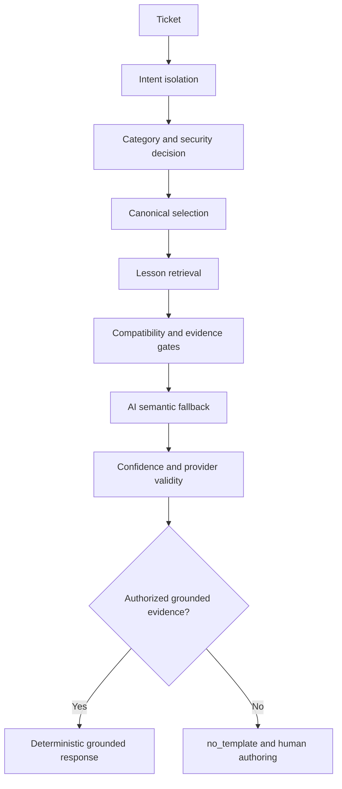

# RSS-1.1B Safety Certification Report

Date: 2026-08-05

## Executive Summary

RSS-1.1B resolves the TODO-046 weak-fallback safety regression. The dedicated probe now passes all 7 positive safety cases, all 14 weak-boundary cases remain unauthorized, provider failure cases fail closed, and protected data snapshots remain unchanged.

Root cause: the M02 SAML certificate-rotation ticket contained the phrase `signing credential`. A generic security rule treated `credential` as a security incident, even though the surrounding evidence described routine federated certificate rotation. Security routing occurred before Authentication retrieval, so the valid SSO canonical and lesson were never considered and the result fell back to `no_template`.

Resolution: add a narrowly scoped federated signing-credential rotation exception to the generic credential signal. The exception applies only when SSO/SAML/identity-provider certificate rotation context is present and there is no request to provide, send, share, expose, reveal, or forward credentials or secrets. Credential exposure and compromise signals remain security incidents and still fail closed.

RSS-1.1B safety is complete. The full certification pipeline now progresses beyond TODO-046 and stops at an unrelated TODO-025H scale-baseline failure. Release mode also requires a clean worktree.

## Root Cause Analysis

Failing case: TODO-046 positive fixture M02.

Input:

```text
Subject: Sign-in keeps bouncing after the IdP signing credential was replaced
Description: Our SAML users return to the identity provider repeatedly after we renewed the certificate. authentication certificate redirect timeline.
```

Expected behavior:

```text
Authentication category
SSO certificate canonical
Validated deterministic lesson
Grounded deterministic response
```

Actual behavior before the fix:

```text
Security Incident category
canonical-security-incident
No retrieval candidates
No lesson
no_template response
```

Deterministic cause:

1. `securityIntent()` matched the generic `credential` security signal.
2. The broad security rule set `security.detected = true`.
3. `understandForProfile()` forced `Security Incident` and `security_incident`.
4. `retrieveMemory()` found no matching Security Incident knowledge item.
5. Drafting correctly refused to authorize an unsupported response, but the valid Authentication path had already been suppressed.

The safety failure was therefore a false security escalation caused by an over-broad generic credential signal, not a weak-fallback authorization bypass.

## Weak-Fallback Audit



Decision audit:

- Empty, malformed, unsupported, ambiguous, and contradictory tickets reach `no_template` with no knowledge IDs.
- Weak same-category candidates do not authorize drafting without validated lesson evidence.
- Incompatible canonicals are rejected before drafting.
- Forged lesson references are rejected.
- Provider unavailability and malformed provider responses do not authorize a response.
- The semantic provider is not called when deterministic compatibility already blocks the candidate.
- A valid M02 federated certificate-rotation ticket now remains in Authentication and reaches the deterministic SSO lesson.
- An explicit request to send a SAML signing credential remains Security Incident and is refused.

## Safety Verification

TODO-046 result:

| Safety area | Result |
| --- | --- |
| C02 weak fallback | PASS; legacy unsafe authorization blocked; `no_template` returned |
| Weak-boundary matrix | PASS; 0/14 unsafe authorizations |
| Positive deterministic cases | PASS; 7/7 authorized with validated lessons |
| Expanded uncertain fallback cases | PASS; 0/7 authorized |
| Federated credential exposure | PASS; Security Incident and `no_template` |
| Provider high-confidence semantic bypass | PASS; blocked before provider call |
| Provider unavailable | PASS; blocked |
| Malformed provider response | PASS; blocked |
| Forged lesson reference | PASS; blocked |
| Trust variation on weak candidate | PASS; no authorization at scores 1, 50, 95, or 100 |
| Protected organization snapshots | PASS; unchanged |
| Stable provenance | PASS; source ticket ID preserved |

## Expanded Regression Coverage

Added explicit TODO-046 fallback cases for:

- empty tickets;
- contradictory refund and usage history;
- multilingual ambiguous text;
- unsupported legal/medical requests;
- malformed input;
- provider-exhaustion-style invoice review with no validated root cause;
- explicit federated credential exposure.

The existing probe also covers weak retrieval across 14 categories, trust-score variation, forged lesson references, provider unavailable/malformed responses, deterministic fallback, and protected-data immutability.

TODO-082A and TODO-082C independently verify DeepSeek failure, LM Studio fallback, Claude failure, complete provider exhaustion, and safe diagnostics without credential leakage.

## Certification Results

| Gate | Result |
| --- | --- |
| TODO-046 | PASS; `COMPLETED`, 7/7 positive cases |
| TODO-058B | PASS |
| TODO-080 | PASS |
| TODO-082A | PASS |
| TODO-082C | PASS |
| TODO-083 | PASS |
| TODO-083 expanded | PASS; 200/200 |
| TODO-078 RBAC | PASS serially after local server restart |
| TypeScript | PASS |
| Prisma validation | PASS |
| Production build | PASS |
| Full non-release certification | Passed build, regression, benchmark, async, chaos, security, and earlier performance checks; stopped at TODO-025H |
| Release certification | Build passed; stopped at release working-tree cleanliness |

The newly exposed TODO-025H failure is not a safety failure. Its probe expects a stale fixed baseline of 45 knowledge items, 180 lessons, 1,800 candidates, 1,800 changes, 5,000 tickets, 1,800 validations, 45 patterns, and 130 versions, while the current protected dataset is 47 knowledge items, 181 lessons, 1,805 candidates, 1,804 changes, 5,168 tickets, 1,804 validations, 50 patterns, and 133 versions. No dataset or Organizational Memory changes were made by RSS-1.1B.

## Benchmark Results

- OIP Benchmark v1: 1000/1000 checks.
- Overall score: 100%.
- Critical security score: 100%.
- TODO-046 protected memory snapshots: unchanged.
- TODO-046 provenance integrity: intact.
- Certification integrity: the pipeline progresses beyond the former safety blocker and records the next independent performance blocker.

## Remaining Limitations

1. TODO-025H scale responsiveness remains a separate certification blocker because its expected dataset counts are stale relative to the protected current dataset.
2. `npm run certify -- --release` cannot progress beyond build until the worktree is clean.

No TODO-046 safety limitation remains.

## Recommendation

```text
NOT READY
```

RSS-1.1B is safety-certified at the TODO-046 boundary. Release promotion should wait for TODO-025H ownership to resolve the stale baseline and for a clean release-mode certification rerun.
