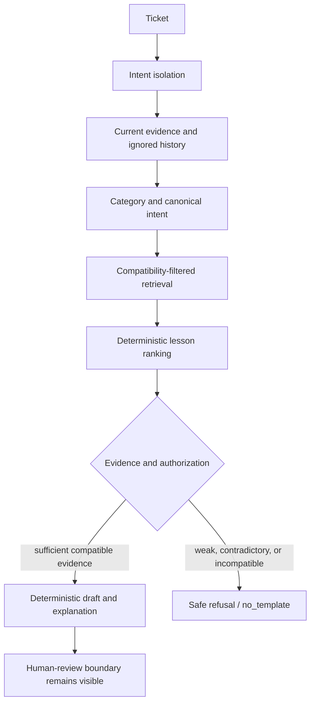

# RSS-1.1D — TODO-051 Explainability Fixture Regression Report

## Executive Summary

RSS-1.1D resolves the TODO-051 explainability regression. The unchanged fixture
`Duplicate Invoice After Seat Changes` originally selected
`demo-ki-invoice-pdf-stale-address` instead of
`demo-ki-duplicate-invoice-seat-change`. The defect was in retrieval compatibility
and lesson contradiction handling, not in the protected memory records, trust,
provider routing, or explainability presentation.

The narrow correction makes compatibility use the complete current-ticket evidence
available to retrieval, including the bare phrase `seat change`, while retaining
the existing intent-isolation boundary for quoted, resolved, and negated history.
The lesson contradiction check was aligned with the same evidence rule. A related
false-positive security classification for ordinary webhook replay wording was also
narrowed so that only sensitive webhook credentials/signatures trigger the security
route; TODO-046 and TODO-080 remained green.

The focused TODO-051 probe now passes unchanged original coverage plus the expanded
regression matrix. The explainability certification stage passes. The exact release
command remains `NOT_CERTIFIED` because the repository contains pre-existing
uncommitted release work; the non-release full run also encountered the known stale
Next development-server 500 at TODO-078, while a clean-server TODO-078 probe passed.

## Root Cause Analysis

### Unchanged reproduction

Command:

```text
npm run probe:todo051-match-explainability
```

Original failing input:

```text
Subject: Duplicate Invoice After Seat Changes
Description: Two invoice lines charge the same seat period after a seat change.
billing duplicate invoice timeline root cause 01 duplicate-invoice-seat-change.
```

Expected:

```text
Knowledge: demo-ki-duplicate-invoice-seat-change
Lesson: demo-les-duplicate-invoice-seat-change-001
Authorized: true
```

Actual before the fix:

```text
Knowledge: demo-ki-invoice-pdf-stale-address
Lesson: demo-les-invoice-pdf-stale-address-001
Authorized: false/incorrect stale-address explanation path
```

The failure was deterministic. The active-problem text used by the compatibility
gate was limited to the subject, `Duplicate Invoice After Seat Changes`. The
weighted retrieval text contained the decisive current evidence, including the
description and explicit duplicate-invoice root-cause marker, but the compatibility
gate did not use it. In addition, the lesson contradiction rule did not recognize
the natural phrase `after a seat change` as positive seat-change evidence. The
correct duplicate-invoice item was therefore excluded or made ineligible while an
unrelated Billing item remained selectable by broad lexical overlap.

Root-cause classification: **RETRIEVAL_DEFECT**.

This is not a missing-memory, trust, provider, persistence, or fixture-ID problem.
The protected records for both competing items were inspected and were internally
consistent. No mature knowledge, lesson, candidate, validation, version, or ticket
record was changed.

## Competing Knowledge Audit

| Item | Evidence and scope | Why it is or is not correct |
| --- | --- | --- |
| `demo-ki-duplicate-invoice-seat-change` | Billing; duplicate/overlapping invoice charges near a seat-change boundary; trust 95; active; provenance and version history valid | Correct match. The fixture explicitly states duplicate charges, the same seat period, and a seat change. Lesson 001 reconstructs the billing timeline before correction. |
| `demo-ki-invoice-pdf-stale-address` | Billing; invoice PDF retains old profile billing details; trust 68; active; provenance and version history valid | Incorrect for the fixture. No PDF, address, profile-update, or stale-address evidence is present in the current ticket. |

The original explanation incorrectly treated generic Billing/invoice overlap as
support for the stale-address item. After the fix, the current duplicate/seat
evidence keeps the duplicate item eligible and prevents the stale-address lesson
from being authorized without its required evidence.

## Authorization and Explainability Flow



Decision points:

1. Intent isolation identifies the active problem and keeps quoted, resolved, and
   negated history out of current-evidence authorization.
2. Category and canonical resolution establish the Billing duplicate-invoice
   context.
3. Retrieval compatibility now evaluates the full current weighted evidence rather
   than only the subject when deciding whether a seat/plan/quantity-change lesson
   is applicable.
4. Lesson selection remains deterministic and order-independent.
5. Authorization requires compatible current evidence. Weak overlap produces
   `authorized: false` and `draftSource: no_template`; it does not fabricate a
   procedure.
6. Explainability continues to expose the selected evidence, lesson evidence,
   relevance, authorization decision, and safe reason through the existing
   production explainability boundary. Provider diagnostics remain advisory and
   do not override deterministic authorization.

## Implemented Resolution

The correction is limited to four files:

- `lib/memory.ts`: compatibility checks now inspect current weighted retrieval
  evidence, including natural `seat change`/`plan change`/`quantity change` forms.
- `lib/drafting.ts`: the contradiction check recognizes the same natural evidence,
  so `after a seat change` is not incorrectly rejected as a contradiction.
- `lib/intentIsolation.ts`: ordinary operational webhook replay wording no longer
  enters the sensitive-access route. Explicit webhook signing secrets,
  credentials, signatures, and verification failures still do.
- `scripts/todo051-match-explainability-probe.cjs`: the original manual cases are
  unchanged; expanded certification cases cover competing roots, history
  isolation, weak fallback, provider fallback/disagreement, and ranking
  determinism.

No changes were made to Organizational Memory, trust, providers, RBAC, workers,
connectors, or governed actions for this task.

## Expanded Regression Coverage

The focused probe now covers:

- confirmed seat-count change → duplicate-invoice item/lesson, authorized;
- duplicate invoice without current seat evidence → safe unauthorized fallback;
- stale-address history only → safe unauthorized fallback;
- current stale-invoice-PDF evidence → stale-address item/lesson, authorized;
- quoted and resolved seat history with a current tax issue → tax-rounding item,
  authorized, with history ignored;
- competing invoice issues with explicit current priority → selected priority root;
- same-category incompatible root cause → safe fallback;
- higher lexical overlap from the wrong candidate → safe fallback;
- normal versus reversed candidate order → identical selected result;
- provider unavailable → deterministic fallback explanation;
- provider advisory disagreement → deterministic authorization retained.

All expanded cases passed. Unsafe explanations are rejected when they contain
secret-like material such as API keys, passwords, secrets, or credentials.

## Verification Results

### TODO-051 and explainability stage

```text
TODO-051 MATCH EXPLAINABILITY: PASS
Original manual cases: PASS
Expanded cases: PASS
Order-independent ranking: PASS
Provider fallback/disagreement checks: PASS
```

```text
npm run certify -- --stage=explainability
[PASS] probe:todo051-match-explainability
[PASS] probe:todo049-reporting-coherence
[PASS] probe:todo080-intent-isolation
CERTIFICATION_VERDICT=CERTIFIED_WITH_LIMITATIONS
```

### Related regression gates

The following probes passed after the fix:

| Gate | Result |
| --- | --- |
| TODO-052 canonical–lesson coherence | PASS, 181/181 lessons; 0 cross-canonical contamination; 21/21 QA |
| TODO-019 lesson ranking | PASS, including order independence |
| TODO-046 weak-fallback safety | PASS, 7/7 positive safety cases; 0/14 unsafe matrix cases; snapshots unchanged |
| TODO-058B language-neutral retrieval | PASS |
| TODO-080 intent isolation | PASS |
| TODO-083 calibration | PASS, 12/12 |
| TODO-083 expanded calibration | PASS, 200/200 |
| TODO-082A DeepSeek routing | PASS |
| TODO-082C diagnostics | PASS |
| TODO-025H scale/responsiveness | PASS; structural audit issues 0; replay deterministic |
| OIP Benchmark | PASS, 1000/1000; 100% overall; 100% critical security |
| TypeScript | PASS, `tsc --noEmit` |
| Prisma validation | PASS |
| Production build | PASS |
| TODO-078 clean-server probe | PASS |

### Full release command

The exact command was run:

```text
npm run certify -- --release
```

It passed TypeScript, Prisma schema validation, migration status, production
build, and production dependency audit. It stopped at:

```text
[FAIL] build: Release working-tree cleanliness
[STOP] critical stage 'build' failed; later stages were not run.
CERTIFICATION_VERDICT=NOT_CERTIFIED
```

The failure is release-infrastructure state, not TODO-051 behavior. The workspace
contains pre-existing RSS-1.1 through RSS-1.1C changes, reports, logs, and other
uncommitted files. No commit, tag, reset, or cleanup was performed.

A non-release full run also encountered the known stale Next development-server
HTTP 500 at TODO-078. Running TODO-078 against a clean restarted server passed.
This runner issue should be resolved before release certification is treated as a
single-command acceptance result.

## Data and Security Review

- The protected memory snapshots used by TODO-046 remained unchanged, including
  the developer-demo protected counts and digests.
- The TODO-025H structural audit reported no orphan references, duplicate IDs,
  broken foreign keys, invalid versions, or missing provenance.
- No candidate was hidden. Rejected or weak candidates remain represented by a
  safe unauthorized/no-template outcome.
- Cross-canonical and cross-domain protections remained green through TODO-052,
  TODO-046, TODO-080, and the benchmark.
- Explicit security-sensitive webhook evidence remains routed to the security
  boundary; only generic operational replay wording was declassified from the
  overly broad signal.
- Explanations do not expose stack traces, secrets, provider internals, or chain
  of thought.

## Remaining Limitations

1. Release certification cannot complete while the worktree is intentionally
   dirty. This report does not alter or clean unrelated user changes.
2. The monolithic non-release runner can reuse a stale Next development process,
   producing a transient HTTP 500 at TODO-078. Direct clean-server verification
   passes; the certification runner should own server lifecycle or enforce a
   health/restart boundary.
3. TODO-051 itself is a production pipeline probe rather than a persisted
   HTTP-backed decision workflow, so this task verifies the shared production
   retrieval/drafting/explainability path and build integrity, not a new persisted
   TODO-051 API contract.

## Final Verdict

**RETRIEVAL_DEFECT_RESOLVED**

## Recommendation

**NOT READY**

TODO-051 is no longer a code-level certification blocker. Release readiness remains
blocked only by the release worktree-cleanliness requirement and the stale
development-server orchestration issue documented above. After those release
infrastructure conditions are corrected, rerun the exact release command before
advancing to RSS-1.2.
