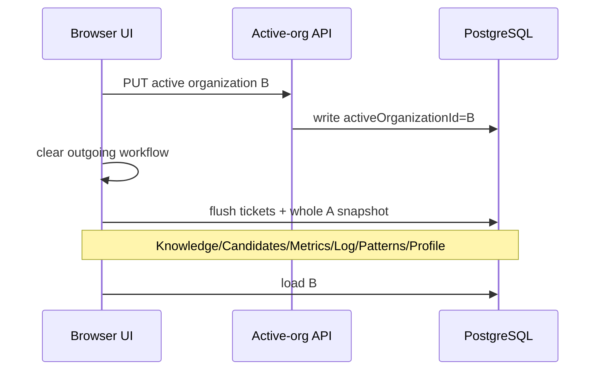
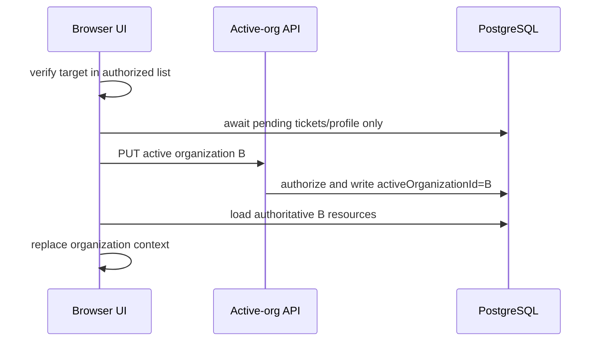

# RSS-2.1 — Switch Context Without Snapshot Flush Report

**Date:** 2026-08-09
**Scope:** post-certification development on `master`; the `v0.1.0-certified` tag was not modified.

## 1. Executive Summary

Organization switching is now a context-selection operation. It no longer replays the outgoing browser snapshot of knowledge, candidates, metrics, intelligence log, emerging patterns, or profile merely because the user is leaving an organization. The optimistic concurrency guard remains intact.

The repair also prevents the previously identified ordering hazard: explicit pending ticket/profile writes settle before the server active-organization transition. If target hydration fails after that transition, the client reloads from the server-authoritative context rather than continuing with an outgoing client context beside an incoming server context.

## 2. Final Verdict

**SWITCH_CONTEXT_STABILIZED**

## 3. RSS-2.0 Findings Addressed

- **F-01 (Critical):** removed generic switch-time whole-snapshot persistence and suppressed hydration echo writes.
- **F-02 (High):** moved explicit pending-write resolution before the active-organization transition and added deterministic hard-reload recovery after a committed transition/load failure.
- **F-09 (Informational):** preserved revision-guarded 409 responses for genuine stale KnowledgeItem writes.

## 4. Baseline

| Item | Value |
| --- | --- |
| Branch / HEAD | `master` / `4792e10ee2ef075b0d7e10287fb4ceff583b3941` |
| Certified tag | `v0.1.0-certified` dereferences to `f08692fbeb623bd50faf0cc8f1a9dd1fe48607ba` |
| Migration status | 22 migrations; schema up to date |
| Configured development active organization | FastDrop Logistics |
| Development memberships | FastDrop, Maesa, OIP Developer Demo |
| Protected integrity baseline | Developer Demo integrity probe: 47 knowledge, 1,805 candidates, 1,804 validations/memory records, 4,500 evidence rows, 5,183 tickets, 50 patterns |

The baseline and after-state Developer Demo integrity probe both reported protected state unchanged. Disposable probe fixtures were cleaned up.

## 5. Previous Switch Sequence

The whole snapshot could contain stale KnowledgeItem revision 53 while the database held revision 54. The correct 409 then blocked navigation after the active organization had already changed.

## 6. Switch-Time Write Analysis

| Resource | Before: Written on Switch | After | Reason |
| --- | --- | --- |
| KnowledgeItems | Yes | No | normal effect persists real mutations; a loaded snapshot is not pending work |
| KnowledgeCandidates | Yes | No | same |
| OrgMetrics | Yes | No | same |
| IntelligenceLog | Yes | No | same |
| EmergingPatterns | Yes | No | same |
| OrganizationProfile | Yes, unconditional | Only explicit queued profile edit | user edits now own a resource-specific save chain |
| Tickets | explicit queue drain | explicit queue drain before transition | only actual in-flight ticket writes are pending work |

The previous `persistOrganizationState` remains used by the destructive deletion path; it is not called by normal `selectOrganization`.

## 7. Pending-Write Analysis

Knowledge, candidates, metrics, logs, and patterns had only normal mutation-driven autosave effects. They had no separate switch-only buffer and are not flushed on navigation.

Tickets use `ticketSaveChains` and may have active client-to-server write work; switching awaits that chain. Profile edits now enter `profileSaveChains` directly from `changeOrganizationProfile`; switching awaits only that chain. A write failure occurs before server context transition, retaining the current UI/server organization and surfacing the resource error.

## 8. New Switch Contract

Loaded resource replacements are marked as hydration reads. The five collection effects consume this marker and do not echo server snapshots back as writes.

## 9. Implementation

- Added a profile-specific persistence chain alongside the existing ticket chain.
- Removed normal-switch calls to `persistOrganizationState`, direct profile persistence, and local organization-list persistence.
- Moved ticket/profile queue draining before the active-organization API call.
- Added authorized-list validation before any transition.
- Added hydration-write suppression for knowledge, candidates, metrics, log, and patterns.
- Added `scripts/rss-2.1-switch-context-probe.cjs` and `probe:rss-2.1-switch-context`.

No revision guard, tenant authorization, persistence authority, membership rule, seed, or organization-creation behavior was changed.

## 10. Split-Brain Prevention

Failure before the active-org API call leaves server and UI on A. A rejected API call also leaves both on A. If the API succeeds but target resource hydration fails, the server is already authoritative for B; the client immediately reloads so hydration re-enters from the durable B context. It does not claim the switch failed while continuing to display A as current.

## 11. 409 Regression

The disposable RSS-2.1 fixture created source organization A, target B, and a knowledge item at revision 1. It loaded the revision-1 browser copy, independently advanced the row to revision 2, then transitioned to B without submitting the stale item.

| Scenario | Expected | Actual | Result |
| --- | --- | --- | --- |
| stale A knowledge, switch A → B | switch succeeds; revision 2 remains | active B; source revision 2 | PASS |
| stale direct A knowledge PUT | HTTP 409 | HTTP 409 | PASS |

## 12. Concurrency Guard Preservation

`saveKnowledge` and its conditional revision update were not altered. The direct stale fixture write returned 409 after the authoritative row advanced from revision 1 to 2. The repair removes workflow misuse, not stale-write protection.

## 13. Live Organization Switching

The existing active-organization and organization-switching probes passed against the configured runtime and again against a fresh compiled `next start` server on port 3501. They cover authorized A → B, B → C equivalents, repeated selection, tenant-scoped resource loads, and rejected non-member access without changing mature organization records.

## 14. Refresh / Restart Verification

`GET /api/auth/active-organization` preserved the selected server context after transition in the probes. The RSS-2.1 and organization-switching probes also passed against a freshly started production build, confirming a fresh server reads the same durable active-organization value.

## 15. Multi-Tab Check

The bounded regression is represented by the stale-snapshot fixture: one logical client holds revision 1 while another writer advances the row to revision 2. Context selection does not write the stale copy, so it cannot corrupt the newer state. A separate tab still needs refresh to observe another tab's active-organization selection; cross-tab live synchronization remains RSS-2.6 scope.

## 16. Failure Recovery

Pending ticket/profile save failures occur before the server transition and preserve A. Target-load failure after a successful transition triggers reload from server authority B. This is intentionally a small deterministic recovery rather than automatic merging, local fallback, or a new state-management layer.

## 17. Rapid / Duplicate Switching

Existing generation checks remain in place. A late target load from a superseded selection is discarded. Selecting the already active organization remains a no-op. The new source-contract probe verifies the active transition still precedes target hydration and has no snapshot-save call sites.

## 18. Persistence Call Evidence

The RSS-2.1 probe reads the current `selectOrganization` body and fails if it finds `persistOrganizationState`, `saveKnowledge`, `saveKnowledgeCandidates`, `saveOrgMetrics`, `saveOrgLog`, `saveEmergingPatterns`, or `saveOrganizationProfile`. It also verifies hydration suppression exists. The fixture then proves the corresponding stale knowledge snapshot is not written during a switch.

## 19. Tenant Isolation

The fixture's target B returned an empty knowledge collection while source A retained the independently advanced row at revision 2. Existing membership/capability checks and organization-scoped API routes were unchanged. The active-organization and switching probes also passed their tenant isolation assertions.

## 20. Negative Controls

| Scenario | Expected | Actual | Result |
| --- | --- | --- | --- |
| Unauthorized organization | 403; active B unchanged | 403; B retained | PASS |
| Nonexistent organization | 404; active B unchanged | 404; B retained | PASS |
| Direct stale knowledge write | 409 | 409 | PASS |
| Stale source on switch | no overwrite | revision 2 retained | PASS |
| Snapshot collection methods in switch | absent | absent by source probe | PASS |
| Target tenant load | no source records | empty B collection | PASS |

## 21. Regression Results

| Scenario | Expected | Actual | Result |
| --- | --- | --- | --- |
| RSS-2.1 switch-context fixture | pass | pass | PASS |
| Active organization probe | pass | pass | PASS |
| Organization switching probe | pass | pass | PASS |
| Persistence boundary / server persistence | pass | pass | PASS |
| RSS-1.2S1 authorization | pass | pass | PASS |
| RSS-1.2S3 ticket contract | pass | pass | PASS |
| TODO-078 RBAC | pass | pass | PASS |
| Developer Demo integrity | pass with historical findings only | protected state unchanged | PASS |
| TypeScript / Prisma validation / migration status | pass | pass | PASS |
| Production build | pass | pass | PASS |
| OIP Benchmark | ≥95% / 100% security | 100% / 100% | PASS |

## 22. Data Integrity

No protected organization data was intentionally changed. The Developer Demo integrity probe reported the same protected digest before and after its verification and zero release-blocking findings. The RSS-2.1 fixture creates only disposable organizations/user/knowledge and deletes them in `finally` cleanup.

## 23. Remaining Limitations

RSS-2.1 does not implement organization creation, owner assignment, signup, first-organization onboarding, demo membership isolation, or cross-tab live active-context propagation. Those remain RSS-2.2, RSS-2.3, RSS-2.4, and RSS-2.6 work. A hard reload is the deliberately conservative recovery if target hydration fails after a committed context transition.

## 24. Recommendation

Proceed to RSS-2.2 — Organization Creation & Ownership. Retain the 409 guard and the RSS-2.1 stale-switch regression probe in the critical suite.

## 25. Final Verdict

**SWITCH_CONTEXT_STABILIZED**

Switching no longer depends on outgoing whole-snapshot persistence; stale outgoing knowledge does not block context selection; direct stale writes still receive 409; and committed transition/hydration failure has deterministic server-authoritative recovery.
