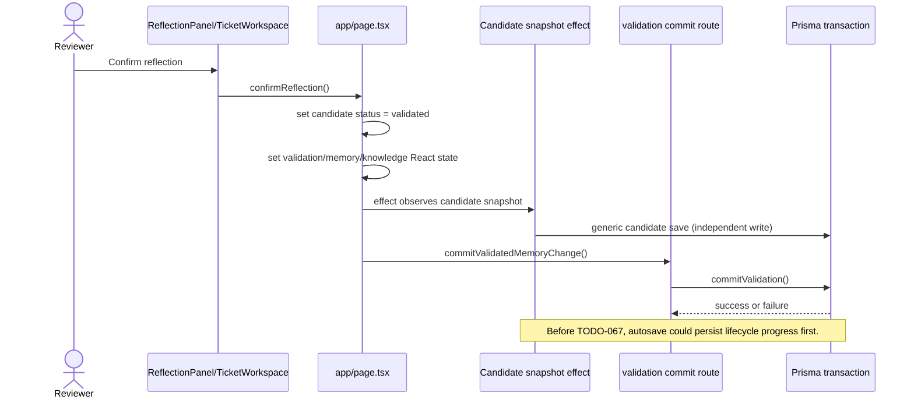

# TODO-067 Atomic Validation & Promotion Boundary Report

Audit date: 2026-08-03  
Repository: `C:\Users\Calvin\Documents\My Project\Hackathon 2`  
Scope: candidate validation, validation/memory promotion, snapshot interaction, replay, concurrency, tenant safety, local persistence, and mature-data safety.

## Verdict

`COMPLETED_WITH_LIMITATIONS`

The authoritative validation command now owns the lifecycle transition. Candidate, validation, memory-change, knowledge, and trust writes are committed through one server transaction, and the client reconciles from the committed result. Generic candidate snapshot persistence cannot create a pending-to-validated transition. The focused disposable probe passed rollback, delay, replay, concurrency, stale-revision, tenant-isolation, bypass-prevention, and local/server result-shape checks.

The verdict includes limitations documented under Remaining Findings: strict-unused TypeScript remains noisy because of existing generated-client/legacy implicit-any findings, the repository lint command is interactive with the installed Next.js version, and the current schema/flow has no separate lesson/version payload to add to this command. Generic snapshots may still update non-lifecycle fields on an already-validated candidate; they cannot create the lifecycle transition.

## Previous Unsafe Flow

The pre-change flow was traced before implementation:

The exact production path was `ReflectionPanel.handleConfirm` -> `TicketWorkspace` callback -> `app/page.tsx:confirmReflection` -> `applyValidatedMemoryChangeInternal`. Before the change, that function queued the persistence commit while immediately advancing React candidate, validation, memory-change, and knowledge state. The candidate autosave effect then called the generic candidate snapshot writer. The API route delegated to `commitValidation`, whose transaction covered the authoritative records but could be preceded by the generic snapshot write.

## Defect Reproduction

The pre-fix defect was established by the trace above and by source-level inspection of the old setter/autosave/queued-commit ordering. No failure was injected against mature data. The new disposable probe reproduces the same race boundary through production modules:

- B1 injects failure immediately after the authoritative candidate update and attempts a generic validated snapshot.
- B2 gates the authoritative command after its candidate step and attempts a snapshot while the command is delayed.
- B3 reloads the authoritative local/server state after failure and verifies the candidate remains pending.

After the fix, both bypass attempts are rejected and every injected transaction failure leaves zero validation, memory-change, knowledge, or trust rows from the failed command.

## Root Cause

The defect was not the absence of a transaction inside `commitValidation`; it was a competing lifecycle writer. The browser treated an optimistic React update as committed and the generic candidate snapshot endpoint accepted `status: validated` without requiring the validation command. A queued, non-awaited command then created a timing window in which candidate state could diverge from the authoritative audit chain.

## Atomic Command Contract

The existing `PersistenceAdapter.commitValidatedMemoryChange` port is now the explicit command boundary. Its request contains organization identity, actor context, candidate/validation/memory/knowledge identifiers, expected knowledge revision, decision and change payloads, source ticket/evidence, and an idempotency key (`validation.id`). The result contains:

- `replayed`
- committed `candidate`
- committed `validation`
- committed `memoryChange`
- committed `knowledgeItem`
- `auditSummary` with actor, source ticket, evidence, decision, trust delta, and memory-change type
- `knowledgeRevision` and `trustApplied`

Conflicts cover stale revisions, reused identities with a different request, cross-organization ownership, and an attempted generic pending-to-validated snapshot. Validation and persistence failures are surfaced as errors and do not return a committed aggregate.

## Server Transaction Changes

`lib/server/persistenceService.ts` now performs the complete command in one Prisma transaction and returns the reloaded committed aggregate. It validates organization ownership, actor context, candidate/knowledge ownership, source-ticket tenant ownership where the ticket exists, expected revision, idempotency identity, and replay linkage. Test-only hooks inject failures after candidate update, validation creation, memory-change creation, trust evidence, and knowledge update; Prisma rollback removed all partial rows in each case.

Replay returns the original aggregate without creating a second validation, memory change, trust evidence, or knowledge revision. The command remains the only authoritative path that can move a pending candidate to `validated`.

## Candidate Snapshot Bypass Prevention

Generic `saveKnowledgeCandidates` now uses a server-side lifecycle guard. A generic snapshot cannot advance a pending candidate to `validated`; it receives a structured conflict. The authoritative command calls the same upsert with an explicit internal authority flag. Snapshot cleanup also preserves candidates referenced by committed validations.

The client no longer marks a candidate validated before the command succeeds. A successful command may be reflected by the existing autosave as an idempotent already-validated snapshot, but the autosave cannot originate that transition.

## Client Reconciliation

`app/page.tsx` now tracks an in-flight validation command and disables duplicate confirmation. It awaits the command, then replaces candidate, validation, memory-change, and knowledge state from the returned committed aggregate. Errors leave the review open and display a recoverable persistence error; no success/resolved state is shown for a failed command. Replay is handled as success using the returned original aggregate.

## Failure and Rollback Results

The disposable probe injected failures at candidate, validation, memory-change, trust-evidence, and knowledge-update steps. Every case rolled back the candidate lifecycle update and left no orphan validation, memory-change, trust-evidence, or partial knowledge revision. A subsequent retry succeeded exactly once.

## Idempotency and Replay Results

Normal submission passed. Exact duplicate submission returned `replayed: true` and the same committed aggregate. Reusing the validation identity with a changed decision was rejected. Simulated lost-response replay returned the original result without a second trust application. Duplicate in-tab clicks were prevented by the client in-flight guard.

## Concurrent Reviewer Results

Two concurrent commands against one candidate produced one committed outcome and one deterministic conflict/replay result. Conflicting decisions did not last-write-win through a snapshot. Only one validation/memory-change/audit chain was present. A stale knowledge revision failed before durable lifecycle advancement and left the candidate pending.

## Authorization and Tenant Safety

The server command verifies organization ownership for candidate, knowledge, and existing source tickets, and validates replay linkage within the organization. Cross-organization payloads and replay attempts were rejected in the disposable probe. The browser cannot choose a different actor for the server-side actor context; local mode has no authenticated actor identity and records no trusted actor ID.

## Local Persistence Compatibility

`LocalStorageAdapter` now uses `commitValidatedMemoryChangeLocalStorage`, which builds the complete next state in memory, performs conflict/replay checks, and replaces the validation bundle in one final storage write. The local adapter returns the same result shape as server mode and its generic candidate save also rejects pending-to-validated transitions. Organization-scoped bundle cleanup removes the new atomic bundle key.

LocalStorage cannot provide database-grade crash durability or authenticated server actor resolution. Those are compatibility limitations, not a second lifecycle path.

## Audit and Explainability

The committed result reloads and returns exact candidate -> validation -> memory change -> knowledge links, decision, source ticket/evidence, trust delta, actor identity where server-authenticated, and replay status. The UI can reconcile and display the committed decision, change type, trust result, and replay state without exposing private chain-of-thought.

## Focused Probe Results

Command: `npm run probe:todo067-atomic-validation`

Result: PASS. Covered normal success, injected rollback, delayed commit, duplicate submission, lost-response replay, stale revision, concurrent reviewers, conflicting decisions, cross-organization rejection, candidate snapshot bypass prevention, no-orphan checks, no-duplicate-trust checks, and local/server result-shape parity. Disposable organizations were removed; a direct PostgreSQL check found no `todo067-*` leftovers.

## Regression Results

Passed: TODO-019 lesson ranking, TODO-029 trust-independent deterministic behavior, TODO-043 provenance, TODO-048 root-cause safety, TODO-050 customer context, TODO-051 explainability, TODO-052 canonical/lesson coherence, TODO-058E persisted multilingual strengthening, TODO-058F new lesson promotion, TODO-060 business inquiry, TODO-061 business learning, TODO-062D reflection safety, TODO-065 historical audit/provenance, BUG-008 retrieval and semantic, BUG-009 conflict recovery, BUG-010 provider/profile pipeline, Prisma validation, TypeScript no-emit, production build, and the new TODO-067 probe.

`npm run lint` could not produce a non-interactive result because the installed Next.js command opens its ESLint migration/configuration prompt. The strict-unused check remains failing on numerous pre-existing legacy/generated-client implicit-any findings; the TODO-067 client unused-variable findings were removed.

## Mature Data Safety

No reset, reseed, migration, manual SQL patch, or mature-data rewrite was performed. Developer Demo baseline counts remained stable after the probes: knowledge 47, candidates 1805, validations 1804, memory changes 1804, tickets 5120, trust evidence 4500, patterns 50, intelligence log 196, profile revision 33. The protected baseline check reported `protectedOrganizationsUnchanged: true`. The existing developer-demo integrity probe still reports its known TODO-065 historical-audit/reference findings; those were unchanged and are outside this task.

## Remaining Findings

- Strict-unused TypeScript hygiene is not clean repository-wide because of existing legacy/generated Prisma inference findings.
- The installed lint command is interactive and needs a separate tooling/configuration cleanup.
- Generic snapshots can still update non-lifecycle fields on an already-validated candidate; the invariant required by TODO-067 is that they cannot create the validated transition.
- The current validation flow has no separate lesson/version command payload or persisted metrics-delta resource to add to the result; the existing applicable records are included.
- Local mode cannot provide server authentication or database-grade crash durability.

## TODO-067 Status

`COMPLETED_WITH_LIMITATIONS`

The critical atomicity boundary, rollback behavior, replay behavior, concurrency checks, tenant checks, client reconciliation, and local compatibility path are implemented and verified without changing mature data.

## Commit

No commit was created. Existing user worktree changes were preserved.
