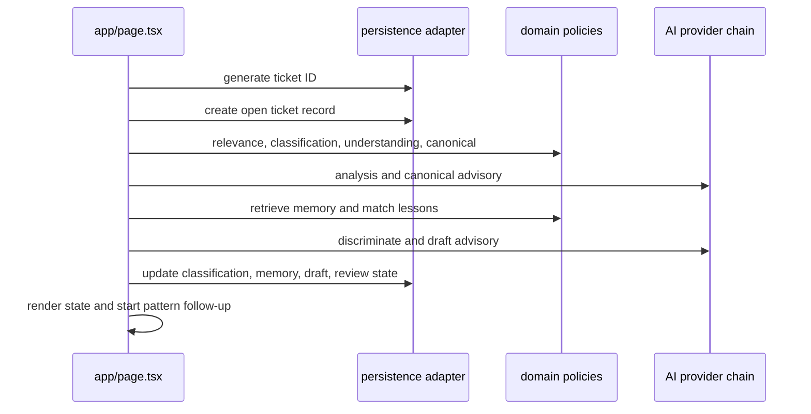

# TODO-068 Ticket Processing Application Service Report

## Verdict

COMPLETED_WITH_LIMITATIONS

The primary single-ticket submit path now runs through a reusable application service. The limitation is that the existing provider interface does not yet accept an `AbortSignal`, so cancellation is enforced at the application boundary between provider calls rather than inside an in-flight provider request. Durable background jobs remain out of scope.

## Previous Browser-Owned Flow

The old flow lived in `app/page.tsx` at `processTicketPipeline` and directly coordinated ticket ID allocation, initial record persistence, business relevance, domain classification, understanding, business inquiry routing, canonical selection, AI analysis/canonical advisory, language metadata, retrieval, lesson selection, discrimination, semantic compatibility fallback, drafting, ticket lifecycle persistence, UI state, telemetry, and pattern discovery.

## Extracted Application Boundary

Added `lib/application/tickets/processTicket.ts` with `processTicket(command, ports)`. It is React-, DOM-, navigation-, and browser-storage-independent. It owns the orchestration and returns a stable `ProcessTicketResult` or throws `ProcessTicketError` with a classified `ProcessTicketFailure`.

## Command and Result Contract

The command requires organization ID, actor context, explicit authority, request ID, optional idempotency key, intake-only ticket input, normalized organization profile, processing options, and an abort signal. The result includes the authoritative ticket record, analysis/understanding, language, relevance, domain, canonical, memory/lesson result, advisory diagnostics, draft, review state, audit summary, telemetry stage summary, replay status, and explicit follow-up intents.

## Dependency Injection and Ports

The service receives a narrow persistence port for ticket ID allocation, ticket reads/writes, and knowledge-history access, plus the existing `AIAdapter`. Domain logic is reused from analyzer, canonical, retrieval, lesson-selection, drafting, semantic-compatibility, language, and provider-chain modules.

## Explicit Organization and Actor Context

The service rejects a profile whose ID differs from `organizationId`; it never reads the active organization from React or a singleton. The UI resolves the organization resource adapter first and passes the current authenticated actor explicitly. Server ticket persistence now retains `actorId`.

## Persistence Behavior

The service awaits each lifecycle write and reports the last persisted record on failure. Local and server adapters retain the same command/result shape. Server replay metadata is carried in an internal `_processing` envelope inside the existing classification JSON, then removed by the mapper so normal classification shape remains unchanged. No Prisma schema migration, reset, reseed, mature-data rewrite, or manual SQL was used.

## Provider Behavior

The existing LM Studio → Claude fallback abstraction remains the only provider path. Disabled mode uses deterministic analyzer/retrieval/drafting behavior. Provider diagnostics are included in the result; unsafe or empty AI drafts fall back to deterministic drafts. Provider-specific branching is no longer part of the primary submit handler.

## Error and Cancellation Handling

Invalid input, tenant mismatch, persistence failure/conflict, provider timeout/unavailability/malformed output, cancellation, idempotency conflict, and unexpected failures have explicit error classes. Cancellation aborts the UI request boundary, prevents result reconciliation, and preserves the last durable ticket state. The existing request-generation guard prevents stale results from overwriting newer UI state.

## Idempotency and Replay

Idempotency is organization-scoped and payload-hash checked. Same-key/same-payload replay returns the original ticket/result without allocating a second ticket; same-key/different-payload is rejected. The service has a process-local replay cache and also persists a replay snapshot in the existing ticket JSON envelope for server reload/retry compatibility.

## UI Integration

`app/page.tsx` now constructs the command, supplies the explicit adapter/context, handles cancellation, and reconciles selected ticket, analysis, memory, advisory, draft, review, metrics, logs, and active record from the service result. The separate reuse/second-ticket workflow remains unchanged because it is outside the single-ticket scope.

## Follow-Up Work Boundary

Pattern discovery is no longer hidden fire-and-forget work in the primary command. The service returns `pattern_discovery_requested` only when no specific canonical match exists. A future durable worker can consume this intent; queue/worker construction is intentionally not included.

## Behavioral Parity Results

The service preserves deterministic relevance, classification, multilingual detection, canonical/retrieval/lesson gates, business-inquiry profile grounding, deterministic fallback, draft safety, ticket reference handling, and review-ready lifecycle state. The durable pre-discrimination candidate remains recorded while the returned result reflects any later discrimination rejection, matching the prior lifecycle semantics.

## Focused Probe Results

`npm run probe:todo068-ticket-application-service` passed coverage for English and Indonesian tickets, business inquiry routing, deterministic/no-memory drafting, duplicate submission, replay after process-local cache miss using persisted metadata, conflicting idempotency payload, cross-organization rejection, persistence failure classification, cancellation, organization isolation, and result shape.

## Regression Results

Passed: TypeScript, Prisma validation, production build, TODO-039, TODO-040, TODO-044, TODO-045, TODO-050, TODO-051, TODO-052, TODO-058, and the new TODO-068 probe.

Not rerun in this extraction pass: the full TODO-046/047/048/060/061/062C/062C1/062C retrieval/provider matrix and TODO-064/067 suites. Existing repository-wide dirty-worktree changes were preserved and not treated as part of this refactor.

## Codebase Impact

- New application-layer file: `lib/application/tickets/processTicket.ts`.
- New focused probe: `scripts/todo068-ticket-application-service-probe.cjs`.
- Page submit orchestration moved behind `processTicket`; page remains responsible for collection, loading/cancellation UI, rendering, navigation, and review editing.
- The working page is 3,997 lines versus 3,767 at the repository HEAD snapshot, but that line-count comparison includes unrelated pre-existing audit changes. The relevant submit handler is now a command/result adapter rather than a domain workflow coordinator.
- Dependency direction is UI → application service → domain policies/ports → persistence and AI adapters.

## Mature Data Safety

No reset, reseed, migration, manual SQL patch, mature-data rewrite, or memory promotion was performed. The focused probe used an in-memory disposable persistence port. Existing mature-memory fixtures were only read by the selected regression probes.

## Remaining Findings

1. Add `AbortSignal` to the AI provider contract and adapters when durable async work is introduced.
2. Move the reuse/second-ticket workflow behind a separate application command if it becomes an API/worker entry point.
3. Extract pattern discovery into the future durable background job boundary described by TODO-018.
4. Run the complete TODO-066 regression matrix and production server database probe before treating this extraction as the final async-readiness gate.

## TODO-068 Status

The primary single-ticket application boundary is complete and in use by the current UI. Follow-up work above is intentionally deferred to its owning TODOs.

## Commit

Not committed; the workspace contains pre-existing unrelated changes that were preserved.
