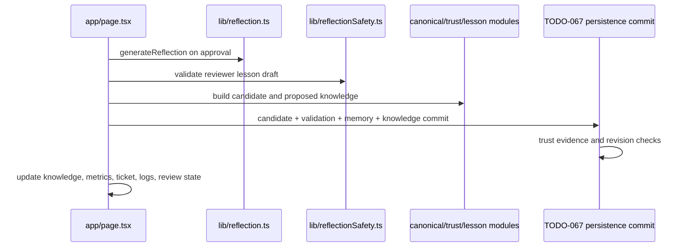

# TODO-069 Reflection & Memory Promotion Application Service Report

## Verdict

COMPLETED_WITH_LIMITATIONS

The active UI learning path now uses separate reflection generation, reflection validation, and knowledge promotion application commands. The existing TODO-067 atomic persistence command remains authoritative for candidate, validation, memory change, knowledge, trust, version, and rollback behavior. One inactive legacy confirmation function remains in `app/page.tsx` for controlled parity comparison and should be removed after the full browser parity evidence is archived.

## Previous Browser-Owned Learning Flow

The old path was split across `approveResponse`, `confirmReflection`, `applyLessonToItem`, `createCandidate`, and `applyValidatedMemoryChange` in `app/page.tsx`:

`approveResponse` also marked the ticket approved and persisted the reviewed response before learning. `confirmReflection` then selected one of `create_new`, `merge_existing`, `create_version`, or `trust_update_only`, constructed lessons and versions, invoked `persistence.commitValidatedMemoryChange`, and reconciled React state.

## Extracted Application Commands

Added `lib/application/learning/reflectionCommands.ts` with:

- `generateReflectionCommand`
- `validateReflectionCommand`
- `promoteKnowledgeCommand`

Each command requires explicit organization, actor, authority, and request context. The promotion command additionally requires an idempotency key, profile, ticket, understanding, reflection, knowledge snapshot, validation history, and persistence port.

## Reflection Command

`generateReflectionCommand` delegates directly to the existing deterministic `generateReflection` policy and preserves language-aware similarity behavior. It returns `ReflectionDecision` plus request/organization diagnostics and performs no persistence.

## Reflection Validation Command

`validateReflectionCommand` normalizes reviewer lesson content and delegates all safety decisions to `assessReflectionSafety`. It preserves checks for customer and organization names, ticket identifiers, copied ticket text, emails, phones, dates, secrets/API keys, temporary workarounds, and environment-specific instructions. It returns accepted/rejected state, warnings, reasons, and normalized content.

## Knowledge Promotion Command

`promoteKnowledgeCommand` owns the primary promotion orchestration for all four reflection actions:

- new canonical knowledge and first lesson;
- merge into existing knowledge and lesson strengthening;
- version creation while preserving lesson-grounded generic templates;
- trust-only reinforcement through the existing trust engine.

It creates deterministic idempotent candidate, validation, and memory-change identities, preserves opaque provenance IDs, applies validation metadata, computes trust/metrics patches, and returns authoritative committed aggregates and ticket reflection fields.

## Transaction Ownership

Promotion calls the existing `commitValidatedMemoryChange` persistence port and does not write candidate, validation, memory, knowledge, or trust records independently. Server mode continues to use the TODO-067 transaction; local mode continues to use the organization-scoped atomic validation bundle. Stale revisions, duplicate validation, cross-organization payloads, and injected rollback failures remain persistence-owned.

Metrics are returned as an explicit promotion result patch and reconciled by the UI’s existing organization-metrics persistence effect. A future transaction extension can include metrics in the database transaction itself without changing the command contract.

## Idempotency

Promotion uses organization-scoped payload hashing and stable IDs derived from the supplied idempotency key. Same-key/same-payload replay returns the original authoritative result; same-key/different-payload is rejected. TODO-067 persistence remains the final duplicate validation and stale revision guard.

## Privacy Preservation

The command reuses `withStableValidationProvenance`, opaque ticket evidence IDs, existing reflection safety rules, and existing historical-audit-compatible knowledge metadata. No raw ticket text is copied into a lesson when safety rejects it, and no mature data was rewritten.

## Multilingual Preservation

Reflection generation still receives response and internal documentation language metadata. Cross-language similarity continues to avoid false `create_version` decisions. The probe covers Indonesian promotion and language-neutral trust behavior; TODO-058 and TODO-061 regressions pass.

## UI Integration

The active page path now:

1. calls `generateReflectionCommand` on reviewer approval;
2. calls `validateReflectionCommand` before showing promotion success;
3. calls `promoteKnowledgeCommand` on confirmation;
4. reconciles knowledge, candidate, validation, memory-change, trust, metrics, ticket, and follow-up state from the returned result.

The UI retains form editing, warnings, loading/progress, review rendering, navigation, and state reconciliation. It no longer owns the active reflection/promotion sequence.

## Behavioral Parity

Existing domain semantics were reused for reflection scoring, safety, canonical creation, canonical merge, lesson deduplication, version creation, trust updates, validation provenance, and atomic persistence. The focused probe exercises new knowledge, lesson strengthening, duplicate promotion/replay, versioning, trust-only promotion, cross-language promotion, unsafe reflection rejection, rollback, stale revision, tenant mismatch, and local/server result shape parity.

## Focused Probe Results

`npm run probe:todo069-learning-application-service` passed.

Covered: new knowledge, existing lesson strengthening, duplicate promotion, replay, rollback, stale revision, cross-language promotion, reflection rejection, unsafe content, trust update, version creation, candidate merge, local/server result shape parity, and organization isolation.

## Regression Results

Passed:

- TODO-058 multilingual foundation
- TODO-060 business inquiry
- TODO-061 business memory
- TODO-062D reflection safety
- TODO-065 historical audit
- TODO-067 atomic validation
- TODO-068 ticket application service
- BUG-008 retrieval
- BUG-010 provider/profile pipeline
- TypeScript
- Prisma validation

BUG-009 profile-conflict recovery was not runnable because its required local HTTP server was not listening (`ECONNREFUSED`). Production build remains the final validation step for this change.

## Codebase Impact

- New application layer: `lib/application/learning/reflectionCommands.ts`.
- New probe: `scripts/todo069-learning-application-service-probe.cjs`.
- New report: `docs/TODO-069-REPORT.md`.
- Active `app/page.tsx` approval and confirmation callbacks now act as command adapters and result reconcilers.
- The old inactive confirmation implementation remains temporarily for parity comparison and should be deleted after evidence capture.
- Dependency direction is UI → learning application commands → existing domain policies and persistence ports.

## Mature Data Safety

No reset, reseed, migration, manual SQL patch, mature-data rewrite, or memory promotion against mature fixtures was performed by the focused probe. Write-path tests use disposable in-memory organizations/ports; existing database probes enforce their own disposable-organization cleanup.

## Remaining Findings

1. Remove the inactive legacy `confirmReflectionLegacy` implementation after browser parity evidence is archived.
2. If strict all-or-nothing metrics are required, extend the TODO-067 persistence transaction to accept an atomic metrics delta/snapshot.
3. Rerun BUG-009 with the local server running.
4. Add API/worker callers later; queue and connector work remain out of scope.

## TODO-069 Status

The active reflection and memory-promotion path is extracted and verified. Remaining work is cleanup/parity evidence and the transaction-level metrics enhancement described above.

## Commit

Not committed; unrelated pre-existing workspace changes were preserved.
