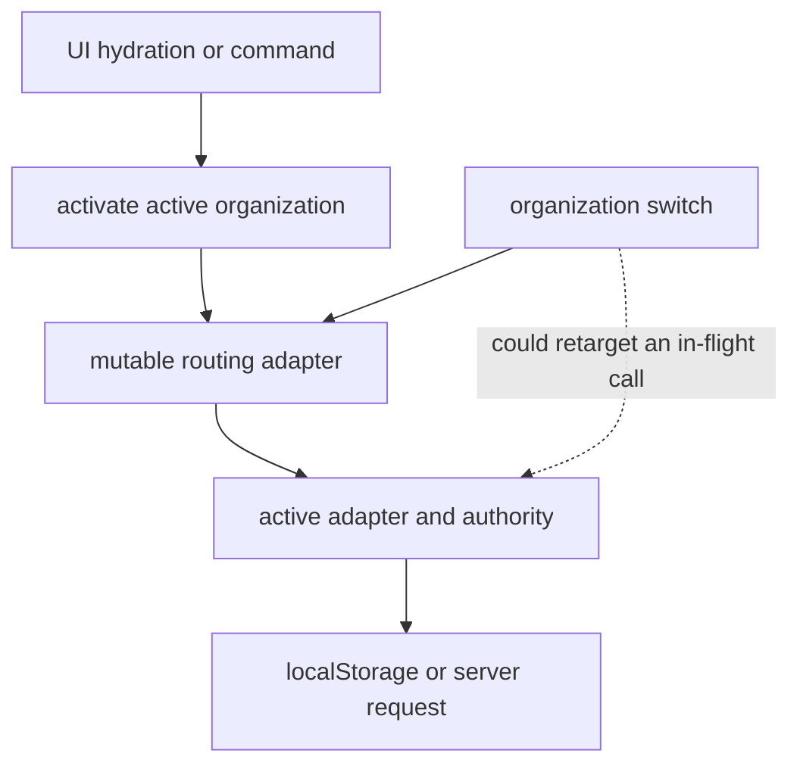

# TODO-070 Stateless Organization-Scoped Persistence Report

## Verdict

COMPLETED_WITH_LIMITATIONS

The durable persistence boundary is now explicit and operation-scoped. The legacy singleton remains only as a compatibility facade for UI shell/list state and older probes. No durable application command uses the mutable active-organization model. The remaining limitation is that the compatibility facade and legacy no-context shell methods remain available until all external callers are migrated.

## Previous Mutable Authority Model

`RoutingPersistenceAdapter` stored `activeResourceAdapter` and `currentAuthority`, selected by `activatePersistenceOrganization()`. `ServerPersistenceAdapter` stored `activeOrganizationId`; profile reads inferred that field. Organization-owned calls from the page could therefore race with an organization switch between adapter activation and an awaited read/write. Local profile persistence also used the selected-profile v1 key without an explicit organization namespace.

The durable path was:

## Root Cause and Risks

Authority and tenant selection were process/browser state rather than operation data. Concurrent work for A and B could observe the adapter selected by whichever activation completed last. The same risk affected profile recovery, ticket persistence, bulk preparation, validation commit routing, and generic resource snapshots.

## Persistence Context Contract

Added `PersistenceContext` in `lib/persistence/context.ts` with immutable:

- `organizationId`
- `actorContext`
- `authority`
- `requestId` and `correlationId`
- optional `idempotencyKey`, `expectedRevision`, and safe metadata

`createPersistenceContext()` freezes the context and rejects missing or invalid scope. `PersistenceContextError` reports safe error codes, request ID, authority, and retryability. Session payload guards reject cross-tenant `organizationId`/`orgId` claims before adapter calls.

## Organization-Scoped Session Design

Added `createPersistenceSession()` and `createPersistenceSessionForOrganization()` in `lib/persistence/index.ts`, backed by `OrganizationPersistenceSession` in `lib/persistence/session.ts`. A session binds one immutable context to one authority-selected adapter; its resource methods no longer accept a second tenant argument. A UI switch creates a new session for future work and cannot mutate an existing session.

The old `persistence` export now resolves authority from each explicit resource call and stores no active organization or current adapter. `activatePersistenceOrganization()` remains a compatibility validation call only; it no longer mutates routing state.

## Server Adapter Changes

`ServerPersistenceAdapter` no longer has `activeOrganizationId` or `rememberOrganization()`. Every resource URL is derived from the method’s explicit organization ID. Profile reads accept an explicit ID through sessions; profile writes verify the profile ID matches the explicit scope. The adapter never falls back to localStorage. Server membership and ownership checks remain enforced by the organization route and persistence service.

## Local Adapter Changes

Local resource calls already use organization-specific storage namespaces and now receive their organization through the immutable session. Explicit local profile reads/writes use `oip.organizationProfile.v2.<organizationId>`. The v1 selected-profile key remains a read-compatible/mirror path for legacy UI callers; it is not the authority for session-scoped durable commands. Reset and delete remain organization-explicit.

## Application Service Integration

TODO-068 `processTicket` now requires a persistence session context matching the command’s organization and authority. Ticket ID allocation, ticket reads, history reads, and ticket saves use session methods.

TODO-069 promotion now requires a matching session context; `GenerateReflection` and `ValidateReflection` remain persistence-free. TODO-067’s atomic `commitValidatedMemoryChange` remains the only lifecycle commit authority.

## UI Integration

Hydration, profile recovery/save, ticket persistence, ticket paging, generic resource snapshots, validation commits, bulk preparation, reset/delete, ticket processing, and reflection promotion now open explicit organization sessions. Organization list persistence remains a shell/navigation concern. The page’s generation guards continue to prevent stale results from replacing the incoming organization’s React state.

## In-Flight Organization Switch Results

Passed in the focused probe: an Organization A session continued to write/read only A while a B session was created. Live `probe:organization-switching` also passed, and the BUG-009 live profile conflict recovery probe passed.

## Concurrent Tenant Results

`probe:todo070-stateless-persistence` passed simultaneous A/B profile and ticket operations, A/B reads, cross-tenant payload rejection, and post-switch isolation. No shared IDs or local namespace bleed were observed.

## Authority Isolation Results

The focused probe used real local and server persistence adapters with an HTTP transport stub. Concurrent server A/B reads produced the correct organization URLs. Local and server sessions retained their own immutable authority, and a server session could not mutate a local session’s authority.

## Generic Resource Migration

Knowledge, candidates, validations, memory-change history, metrics, logs, patterns, tickets, bulk preparation, validation commit, reset, delete, and profiles are session-scoped for migrated callers. Organization-list persistence remains compatibility-only shell state. The legacy facade routes explicit resource IDs per call without mutable selection.

## Error and Telemetry Model

Missing context, invalid authority, and cross-tenant payloads fail through structured `PersistenceContextError`. Existing server errors remain safe and non-fallback. Session telemetry records operation, safe tenant hash, authority, request/correlation IDs, duration, and success/failure through the existing TODO-064 telemetry hook; content and secrets are not recorded.

## Legacy Caller Inventory

- Migrated: `app/page.tsx` durable organization resources, TODO-068, TODO-069.
- Compatibility-only: exported `persistence`, `activatePersistenceOrganization`, `activePersistenceMode`, shell organization-list methods, and older migration/persistence probes.
- UI navigation only: authenticated active-organization endpoint and organization list/profile selection state.
- Still unsafe: no durable application command was found using implicit mutable authority after migration.
- Deferred: removal of the compatibility facade and v1 profile mirror requires migrating external/older callers.

## Focused Probe Results

`npm run probe:todo070-stateless-persistence` — PASS.

Covered explicit A/B reads/writes, simultaneous operations, in-flight switch behavior, local/server isolation, missing-context rejection, cross-tenant rejection, profile isolation, ticket isolation, result authority reporting, and fixture cleanup.

## Regression Results

Passed:

- live `probe:organization-switching`
- live `probe:bug009-profile-conflict-recovery`
- `probe:persistence-boundary`
- `probe:server-persistence`
- `probe:todo067-atomic-validation`
- `probe:todo068-ticket-application-service`
- `probe:todo069-learning-application-service`
- `probe:todo060-business-inquiry`
- `probe:todo061-business-memory`
- `probe:todo062d-reflection`
- `probe:bug008-retrieval`
- `probe:bug008-semantic`
- `probe:todo065-historical-audit`
- TypeScript (`npx tsc --noEmit`)
- Prisma validation
- production build

Strict-unused/lint tooling remains pre-existing: `npm run lint` enters Next's interactive ESLint configuration prompt in this repository, so it was not a non-interactive verification gate.

## Codebase Impact

- Removed mutable server adapter organization state.
- Removed mutable routing authority selection.
- Added frozen persistence context and organization-scoped session.
- Updated TODO-068/TODO-069 persistence ports and callers.
- Added local organization profile v2 namespace with v1 compatibility mirror.
- Retained the singleton only as an explicit-ID compatibility facade.
- Kept UI active organization as navigation/display state, not durable command authority.
- Preserved server membership, ownership, and TODO-067 atomic lifecycle boundaries.

## Mature Data Safety

No mature organization was reset, reseeded, migrated, rewritten, or manually edited. The TODO-070 local probe used only disposable localStorage IDs and cleaned them up. Live HTTP probes used disposable auth/organization fixtures and cleaned them up. TODO-065 remained read-only against mature audit data.

## Remaining Findings

The compatibility facade still exposes legacy no-context shell profile/list methods for older callers. They are not used by migrated durable commands, but they should be removed after the deferred caller inventory is empty. Worker/job invocation can use `createPersistenceSession()` directly with serialized context.

## TODO-070 Status

Completed with the compatibility limitation documented above. The result satisfies explicit tenant scope, concurrent adapter safety, authority immutability per operation, in-flight switch safety, server/local parity, and preservation of the atomic lifecycle commit.

## Commit

No commit was created.
