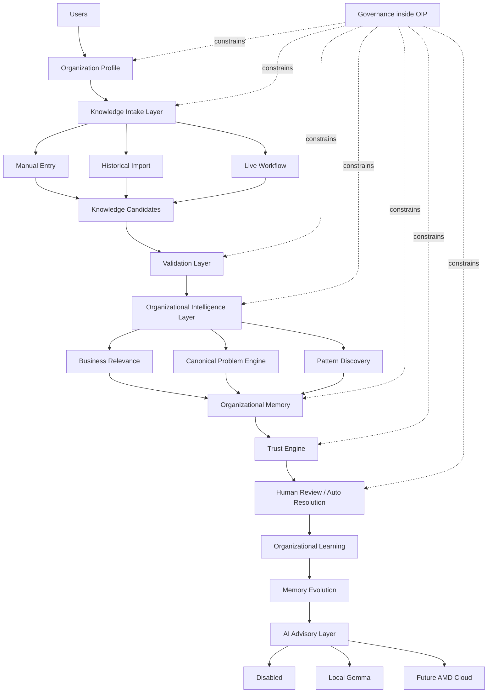
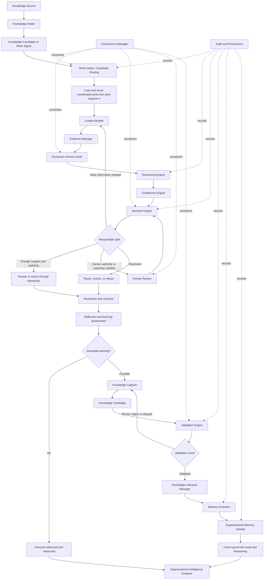
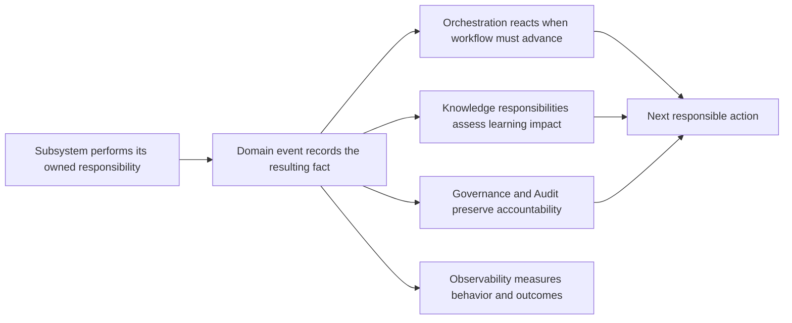
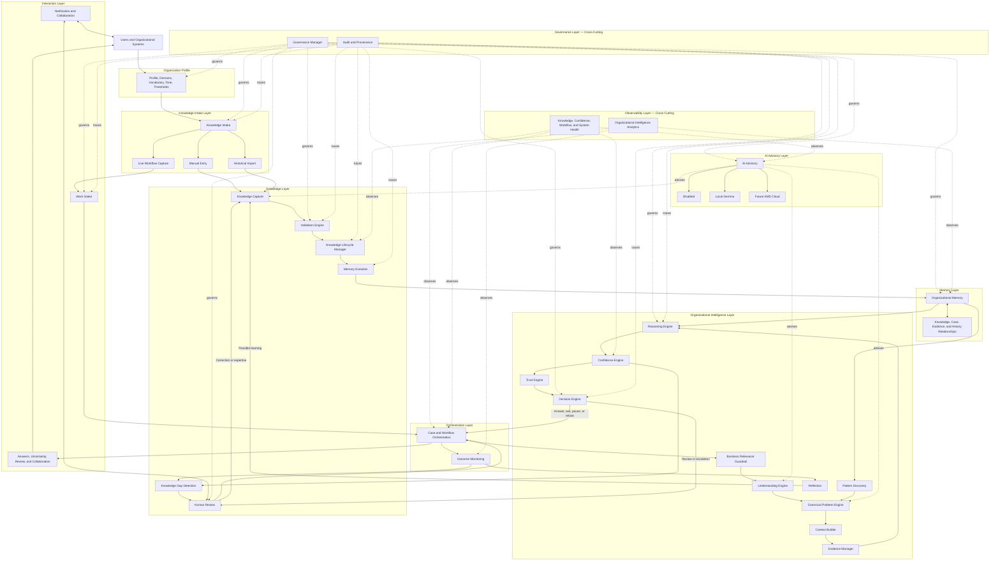

# System Architecture

## 1. Introduction

System Architecture answers one question:

> How is responsibility distributed across the platform?

This document defines the logical architecture of the Organizational Intelligence Platform. It describes the responsibilities the platform must fulfill, the boundaries that keep those responsibilities coherent, and the interactions through which organizational work becomes trusted memory and better future reasoning.

Architecture exists to preserve correctness, scalability, maintainability, trust, and evolution. It should allow the platform to grow in users, Domains, workflows, knowledge, and forms of intelligence without losing the distinctions established by the Canon.

This is not a deployment design or a selection of technologies. A logical layer or subsystem is a boundary of responsibility, not necessarily an independently deployed component. Future engineering decisions may realize these boundaries in different ways, but they must preserve their meaning and constraints.

The architecture must faithfully implement the Canon. It must not replace product principles with technical convenience, collapse domain concepts into storage artifacts, or treat generated Answers as the platform's central asset.

---

## 2. Relationship to the Canon

This architecture explicitly derives from all seven Canon documents:

| Canon Document | Contribution |
| --- | --- |
| [Founder's Thesis](../canon/00_FOUNDERS_THESIS.md) | Philosophy |
| [Product Vision](../canon/01_PRODUCT_VISION.md) | Product identity |
| [Product Principles](../canon/02_PRODUCT_PRINCIPLES.md) | Design constraints |
| [Capability Model](../canon/03_PRODUCT_CAPABILITY_MODEL.md) | Functional abilities |
| [Domain Model](../canon/04_PRODUCT_DOMAIN_MODEL.md) | Shared vocabulary |
| [Workflow Model](../canon/05_PRODUCT_WORKFLOW_MODEL.md) | Behavioral model |
| [AI Cognitive Model](../canon/06_AI_COGNITIVE_MODEL.md) | Intelligence model |
| System Architecture | Structural realization |

The Canon defines the purpose, behavior, and conceptual boundaries the system must preserve. Architecture assigns those responsibilities to logical layers and subsystems and defines permitted interactions among them.

Architecture should implement—not redefine—the Canon. When a proposed structural choice makes Provenance optional, allows reasoning to change memory directly, hides Uncertainty, or bypasses Human Review, the structure is wrong even if it appears simpler.

---

## 3. Architectural Philosophy

The platform is not an AI chatbot, ticketing system, static knowledge base, or automation engine. It may include conversational experiences, work with tickets, publish knowledge, and automate suitable actions. None of those expressions defines the architecture.

The platform is an **Organizational Intelligence Platform**. Its enduring architectural purpose is to turn meaningful organizational work into governed, contextual, evolving memory that improves future reasoning.

The architecture must therefore optimize for:

- **Organizational learning:** meaningful outcomes, Corrections, and gaps can improve future capability.
- **Knowledge integrity:** proposed learning remains distinct from trusted knowledge.
- **Traceability:** important claims, Decisions, changes, and actions retain Provenance.
- **Reasoning:** current Context and Evidence can be interpreted against applicable Organizational Memory.
- **Governance:** authority, access, consequence, and accountability constrain every relevant interaction.
- **Evolution:** knowledge, workflows, cognition, and Domain rules can change without erasing history.
- **Composability:** bounded responsibilities can cooperate without becoming inseparable.
- **Long-term maintainability:** concepts remain explicit enough to understand, test, replace, and extend.

Response speed is a useful operational outcome, not the organizing principle. The architecture must prefer a slower governed escalation over a fast unsupported Answer and prefer a validated improvement to memory over automation that teaches nothing.

---

## 4. Architectural Principles

### Separation of Concerns

Interaction, workflow coordination, cognition, knowledge stewardship, memory preservation, governance, and measurement are distinct responsibilities. Separating them prevents an interface, reasoning mechanism, or storage choice from silently becoming the product model.

### Single Responsibility

Each logical subsystem owns one coherent reason to change. The Confidence Engine changes when confidence policy evolves; the Knowledge Lifecycle Manager changes when lifecycle rules evolve. A subsystem may collaborate broadly without absorbing unrelated authority.

### Knowledge-Centric Design

The architecture treats contextual, validated, reusable knowledge as a central organizational asset. Cases and Answers matter partly because they use, test, challenge, or create knowledge. Structures should preserve the path from work to learning and from memory to future reasoning.

### Event-Oriented Learning

Meaningful changes in work and knowledge are represented as domain events. Events make outcomes, Corrections, lifecycle transitions, and gaps observable to interested responsibilities without forcing the producer to control every downstream reaction.

### Human-in-the-Loop by Design

Human Review is a first-class architectural path, not an exception added after automation. The system must be able to pause, route, explain, accept judgment, and return that judgment to the learning process.

### Trust Before Automation

Automated behavior depends on sufficiently mature memory, reasoning, Confidence, authority, and Governance. Automation is a consumer of trusted capabilities, never a substitute for them.

### Provenance Everywhere

Important information carries its origin and transformation history through intake, Reasoning, Decision, Human Review, Validation, memory change, and action. Provenance cannot be reconstructed reliably if discarded at an earlier boundary.

### Explicit Uncertainty

Missing Context, weak Evidence, conflict, staleness, unclear authority, and high consequence are represented explicitly and can alter workflow. No layer may convert material Uncertainty into hidden certainty for convenience.

### Replaceable Intelligence Components

Observation, understanding, retrieval, Reasoning, Confidence assessment, Decision support, and reflection are logical responsibilities with stable contracts of meaning. The mechanisms that fulfill them may change without changing the workflow, domain language, or authority over memory.

### Technology Independence

The architecture is expressed through responsibilities and interactions rather than products or vendors. Technical choices must conform to the logical boundaries; the logical architecture must not be rewritten around the limitations of a chosen tool.

### Governed State Change

No cognitive or interaction responsibility may unilaterally change trusted knowledge. State changes that affect organizational truth pass through explicit authority, Validation, lifecycle, Provenance, and audit responsibilities.

### Observable Learning

The architecture makes both operational behavior and organizational learning observable. It must be possible to determine whether memory became fresher, gaps closed, repeated work declined, Corrections prevented recurrence, and Confidence improved.

### Intake Convergence

Knowledge may enter through Manual Entry, Historical Import, and Live Workflow Capture, but it converges into one intelligence architecture. The platform should not create separate memory systems for different intake paths.

### Candidates Before Memory

Every intake path creates a Knowledge Candidate first. Organizational Memory contains only knowledge that has passed the required Validation, Governance, Provenance, and trust boundaries.

### AI Advisory, OIP Authority

AI is an advisory capability. It may assist understanding, categorization, drafting, enrichment, naming, and comparison, but the OIP owns decisions about trust, Validation, Governance, memory change, and organizational policy.

### Deterministic Trust

Trust is a governed system responsibility, not a model preference. Trust changes through Validation, human authority, Provenance, outcomes, and successful reuse rather than AI confidence alone.

### Governance Inside the OIP

Governance remains inside the OIP. External systems, users, imports, and AI providers may supply signals or suggestions, but authority, policy enforcement, Validation, and memory mutation are internal platform responsibilities.

### Organization-Scoped Intelligence

Organization Profile scopes every intelligence component. Relevance, supported Domains, terminology, customer tone, auto-resolution policy, trust thresholds, and AI prompting adapt through configuration rather than code changes.

### Evolution Through Reuse

Memory evolves through reuse, Corrections, Validation, and lifecycle history rather than replacement alone. New guidance should preserve the path from prior knowledge to current trusted memory.

### Reusable Intelligence Architecture

Every future organizational workflow should reuse the same intake, Validation, Organizational Intelligence, memory, trust, Governance, and learning architecture. Customer Support is the first implementation, not a separate product architecture.

---

## 5. High-Level System Context

External Users, connected systems, imported archives, and AI providers surround the OIP. They may supply signals, context, records, contributions, or advisory output. The OIP remains the system of record for Organization Profile, Governance, Validation, trust, Organizational Memory, learning, and memory evolution.

The diagram is conceptual, not a request path. Customer Support is the first implementation of Live Workflow intake, not the architecture's boundary. Knowledge Intake is universal. Organizational Intelligence is reusable. Governance remains inside the OIP rather than delegated to external systems or AI providers. The AI layer advises; the OIP decides.

---

## 6. Major Architectural Layers

### Interaction Layer

The Interaction Layer is the boundary between Users or organizational systems and platform behavior.

Responsibilities:

- Receive Work Signals and User intent.
- Preserve original input and Source identity.
- Present Answers, recommendations, Provenance, Confidence, and Uncertainty.
- Support questions, Corrections, approvals, and Human Review.
- Communicate workflow state and required next actions.
- Enforce the User-facing effects of Governance decisions.

The Interaction Layer does not reason, validate knowledge, or own workflow truth. It presents and captures behavior coordinated elsewhere.

### Organization Profile Layer

The Organization Profile Layer supplies organization-specific configuration to intelligence, workflow, Governance, and AI advisory behavior.

Responsibilities:

- Define supported Domains, issue types, products, services, and business vocabulary.
- Shape relevance decisions and intake eligibility.
- Provide terminology and customer tone used in communication and drafting.
- Define auto-resolution policy and trust thresholds.
- Scope Governance defaults, escalation expectations, and review requirements.
- Supply organization context for AI prompting without giving AI authority.
- Allow the OIP to adapt to organizations through configuration rather than code changes.

The Organization Profile influences behavior; it does not replace Governance or Validation. A profile can make a signal relevant, set a threshold, or shape a prompt, but trusted memory still requires Provenance, review, and trust.

### Knowledge Intake Layer

The Knowledge Intake Layer is the entry point for every future workflow.

Responsibilities:

- Receive organizational knowledge from Manual Entry, Historical Import, and Live Workflow Capture.
- Preserve Source identity, Context, transformation history, and Intake Provenance.
- Apply Organization Profile and Governance checks to determine relevance and permitted use.
- Produce Knowledge Candidates rather than trusted knowledge.
- Route candidates into Validation.
- Prevent archived, imported, live, or human-contributed material from bypassing trust boundaries.

No intake path bypasses Validation. Live Customer Support is the current prototype's implemented intake door; future Manual Entry and Historical Import should feed the same downstream architecture.

### Orchestration Layer

The Orchestration Layer coordinates behavioral workflows across logical responsibilities.

Responsibilities:

- Establish and advance Cases and Issues through appropriate states.
- Coordinate Context building, Evidence gathering, cognition, Human Review, Resolution, and learning assessment.
- Route work according to Confidence, authority, consequence, and Governance.
- Manage pauses, retries, escalation, review, and outcome monitoring.
- Trigger Knowledge Capture and learning workflows when meaningful.
- Ensure that required steps and boundaries are not bypassed.

Orchestration owns process, not intelligence. It determines which responsibility acts next and under what workflow conditions. It does not decide what is true, assign Confidence, validate knowledge, or generate its own reasoning.

### Validation Layer

The Validation Layer separates Knowledge Candidates from trusted Organizational Memory.

Responsibilities:

- Coordinate Human Review and appropriate Domain authority.
- Apply Governance requirements and organization policy.
- Initialize trust only when evidence, authority, and scope are sufficient.
- Verify Provenance, source quality, and transformation history.
- Perform quality checks, contradiction checks, and relevance checks.
- Define validated scope, rejected status, disputed state, or required revision.
- Prevent AI advisory output, imported archives, or repeated patterns from becoming memory directly.

Validation is the trust boundary. It does not merely approve content; it determines whether proposed knowledge can responsibly guide future work.

### Organizational Intelligence Layer

The Organizational Intelligence Layer performs the cognitive and learning responsibilities defined by the Canon and scoped by the Organization Profile.

Responsibilities:

- Apply the **Business Relevance Guardrail** to distinguish supported organizational work from out-of-scope input.
- Use the **Understanding Engine** to identify Issues, ambiguity, consequence, missing Context, and supported Domains.
- Use the **Canonical Problem Engine** to connect similar work into reusable problem structures.
- Request contextual recall from Organizational Memory.
- Reason across Evidence, applicable knowledge, exceptions, Uncertainty, and Governance.
- Use the **Trust Engine** to evaluate reliance, review requirements, and auto-resolution eligibility deterministically.
- Use **Pattern Discovery** to find repeated validated learning opportunities and emerging canonical problems.
- Support **Organizational Learning** by identifying reusable lessons, gaps, Corrections, and outcomes.
- Support **Memory Evolution** by proposing changes that still require Validation and lifecycle handling.

Organizational Intelligence is modular and reusable across intake doors and Domains. It may propose Decisions, candidates, patterns, and learning. It does not unilaterally authorize restricted actions or modify trusted Organizational Memory.

### AI Advisory Layer

The AI Advisory Layer is an optional subsystem that assists organizational reasoning but never owns organizational Decisions.

Supported provider modes:

- **Disabled:** the OIP uses deterministic Organizational Intelligence only.
- **Local LM Studio (Gemma):** local advisory generation assists understanding, drafting, enrichment, or comparison.
- **AMD Cloud:** future hosted advisory capability.

AI may assist:

- Understanding.
- Categorization.
- Canonical problem suggestion.
- Pattern naming.
- Knowledge enrichment.
- Customer drafting.

AI never:

- Changes trust.
- Updates memory.
- Approves knowledge.
- Bypasses Governance.
- Overrides organizational policy.
- Becomes the system of record for organizational truth.

The AI layer advises. The OIP decides.

### Knowledge Layer

The Knowledge Layer manages the transformation between work-derived learning and trusted reusable knowledge.

Responsibilities:

- Capture Knowledge Candidates from meaningful Cases, Corrections, outcomes, changes, and patterns.
- Preserve claims, Context, Evidence, applicability, limits, and human judgment.
- Coordinate Validation appropriate to Domain, authority, risk, and consequence.
- Manage Knowledge Lifecycle transitions.
- Detect conflict, staleness, duplication, and relationships.
- Govern how knowledge is proposed, challenged, corrected, deprecated, and replaced.
- Provide knowledge views suitable for governed retrieval.

This layer is the heart of the platform because it protects the difference between a record, a proposed lesson, and organizational truth. It makes knowledge living and accountable rather than static content.

### Governance Layer

The Governance Layer expresses and evaluates the boundaries within which all other layers operate.

Responsibilities:

- Determine permitted access, use, disclosure, contribution, review, Validation, and action.
- Represent Role, Domain authority, approval requirements, sensitivity, and risk boundaries.
- Constrain reasoning and automation according to policy and consequence.
- Support accountability, auditability, and compliance obligations.
- Preserve separation of duties where the Organization requires it.

Governance is cross-cutting. A final permission check cannot repair restricted knowledge already exposed during retrieval or unauthorized assumptions already used in Reasoning. Every layer must request and honor Governance decisions at the point they matter.

### Memory Layer

The Memory Layer preserves Organizational Memory across people, systems, Domains, and time.

Responsibilities:

- Preserve Knowledge Items and their connected Context.
- Maintain relationships among Knowledge Items, Cases, Sources, Evidence, Decisions, Corrections, and outcomes.
- Preserve versions, lifecycle history, ownership, Validation, and replacement relationships.
- Support contextual and permission-aware recall for Reasoning.
- Distinguish active trusted guidance from disputed, stale, deprecated, and historical knowledge.
- Preserve durable memory even as interaction and intelligence mechanisms change.

Memory is different from storage. Storage retains information. Memory preserves usable knowledge with Context, trust, relationships, history, and Governance intact. The Memory Layer does not decide what becomes trusted; it preserves the results of governed knowledge processes.

### Observability Layer

The Observability Layer makes platform behavior and organizational improvement measurable.

Responsibilities:

- Measure workflow progress, interruption, escalation, and outcomes.
- Measure learning events, Knowledge Gap closure, and repeated-work reduction.
- Measure Confidence behavior and calibration outcomes.
- Measure knowledge freshness, conflict, coverage, reuse, and lifecycle health.
- Measure system health and the reliability of logical responsibilities.
- Preserve enough Context to distinguish useful automation from unsafe suppression of review.
- Support audits and investigation without becoming the authority over domain truth.

Observability measures organizational improvement, not only technical performance. Fast execution with stale memory or hidden Uncertainty is not architectural success.

### Layer Responsibility Summary

| Layer | Owns | Must not own |
| --- | --- | --- |
| Interaction | Input and presentation boundary | Reasoning, Validation, workflow authority |
| Organization Profile | Organization-specific configuration and scoping | Governance authority or trusted memory |
| Knowledge Intake | Entry of organizational knowledge and candidate creation | Validation, trust, or memory mutation |
| Orchestration | Process coordination and routing | Truth, Confidence, memory content |
| Validation | Candidate-to-trusted-memory boundary | Intake capture, independent memory mutation, AI self-approval |
| Organizational Intelligence | Relevance, understanding, canonical problems, pattern discovery, deterministic trust, and learning proposals | Governance authority, trusted memory mutation |
| AI Advisory | Optional advisory suggestions and drafts | Trust, Governance, Validation, memory updates, organizational decisions |
| Knowledge | Candidate-to-trusted-knowledge processes | Raw interaction presentation, independent policy authority |
| Governance | Permission, authority, policy, and risk decisions | Domain reasoning or knowledge content |
| Memory | Durable connected Organizational Memory | Validation decisions or Answer generation |
| Observability | Evidence about behavior, learning, and health | Operational or knowledge authority |

---

## 7. Core Subsystems

Subsystems are logical units of responsibility. They are not deployment prescriptions. Inputs and outputs describe conceptual information, not technical interfaces.

### Subsystem Catalog

| Subsystem | Purpose | Core responsibilities | Inputs | Outputs | Dependencies |
| --- | --- | --- | --- | --- | --- |
| **Organization Profile** | Scope platform behavior to a specific Organization. | Define supported Domains, vocabulary, products, customer tone, thresholds, escalation expectations, and AI context. | Organization configuration, policy, supported work, vocabulary, thresholds. | Organization-scoped relevance, terminology, tone, trust threshold, and prompt context. | Governance Manager; Knowledge Intake; Organizational Intelligence. |
| **Knowledge Intake** | Convert incoming organizational knowledge into governed candidates. | Receive Manual Entry, Historical Import, and Live Workflow Capture; preserve Intake Provenance; apply initial relevance and Governance; produce Knowledge Candidates. | Human contributions, imported archives, documents, support tickets, chats, connected systems, external events. | Knowledge Candidate or rejected/restricted intake with Provenance. | Organization Profile; Governance Manager; Audit and Provenance; Validation Engine. |
| **Work Intake** | Convert live organizational activity into governed Work Signals. | Preserve Source; identify Organization and Domain; establish initial sensitivity and routing Context; reject or restrict impermissible intake. | Messages, tickets, changes, Corrections, outcomes, external events. | Normalized Work Signal with Source, time, Domain, and initial Governance Context. | Knowledge Intake; Governance Manager; Audit and Provenance; Orchestration. |
| **Business Relevance Guardrail** | Determine whether an intake or Work Signal belongs to supported organizational work. | Compare input against Organization Profile, supported Domains, out-of-scope topics, and Governance constraints. | Intake, Work Signal, Organization Profile, Domain rules. | Relevant, restricted, or out-of-scope determination with rationale. | Organization Profile; Governance Manager; Understanding Engine. |
| **Understanding Engine** | Interpret incoming work or candidates within organizational context. | Identify Issue, category, signals, ambiguity, consequence, missing Context, and likely Domain. | Work Signal or Knowledge Candidate, Organization Profile, available Context. | Understanding record, issue framing, missing-information needs, category, and detected signals. | Business Relevance Guardrail; Context Builder; Evidence Manager. |
| **Context Builder** | Establish the conditions needed to understand an Issue responsibly. | Identify relevant history, participants, policy period, state, risk, prior attempts, missing information, and ambiguity; keep observation distinct from inference. | Work Signal, Case, User intent, prior Context, permitted memory. | Context set, identified Issues, missing-information questions, consequence indicators. | Work Intake; Organizational Memory; Governance Manager; Evidence Manager. |
| **Evidence Manager** | Preserve and relate information that supports or challenges claims. | Link Evidence to Sources and claims; preserve support, contradiction, authority, freshness, and Context; distinguish Evidence from assertion. | Sources, observations, policies, records, outcomes, expert contributions. | Evidence sets, conflict indicators, quality and relevance information. | Context Builder; Audit and Provenance; Governance Manager; Organizational Memory. |
| **Organizational Memory** | Provide durable, connected, governed memory for current and future work. | Preserve Knowledge Items, history, relationships, applicability, lifecycle, Validation, ownership, Sources, and related Cases; support contextual recall. | Validated memory changes, lifecycle transitions, Provenance, governed recall requests. | Relevant memory with trust and lifecycle state; durable history; relationship views. | Knowledge Lifecycle Manager; Validation Engine; Governance Manager; Audit and Provenance. |
| **Canonical Problem Engine** | Connect recurring Issues into reusable problem structures. | Identify canonical problem candidates, merge similar cases, preserve examples, and separate problem identity from one ticket. | Understanding records, Cases, Evidence, Knowledge Items, Organization Profile. | Canonical problem, candidate merge, versioning signal, or reuse path. | Understanding Engine; Organizational Memory; Trust Engine; Validation Engine. |
| **Reasoning Engine** | Produce grounded interpretations and alternatives from current work and memory. | Compare Context, Evidence, and applicable memory; identify exceptions and assumptions; form Diagnoses, recommendations, questions, and alternatives; preserve inspectability. | Issue, Context, Evidence, governed recall, Uncertainty, Domain rules. | Reasoning record, Diagnosis, alternatives, recommendation, required questions or review. | Context Builder; Evidence Manager; Organizational Memory; Governance Manager; Confidence Engine. |
| **Confidence Engine** | Determine how strongly cognition may guide a behavior in the current Context. | Assess Evidence quality, freshness, applicability, conflict, missing Context, authority, consequence, and lifecycle state; represent Uncertainty types. | Reasoning record, Evidence, knowledge state, Context, risk, Governance requirements. | Confidence assessment, material Uncertainty, behavioral constraints, review requirements. | Reasoning Engine; Evidence Manager; Governance Manager; Organizational Memory. |
| **Trust Engine** | Deterministically evaluate memory reliance and auto-resolution eligibility. | Apply trust scores, thresholds, maturity, successful reuse, human review count, policy, and Organization Profile thresholds. | Knowledge Item, Context, outcomes, Organization Profile, Governance requirements. | Trust decision, threshold comparison, review requirement, trust delta proposal. | Organizational Memory; Validation Engine; Governance Manager; Confidence Engine. |
| **Decision Engine** | Select the next responsible cognitive or workflow behavior. | Choose among answer, draft, ask, investigate, present alternatives, request review, escalate, pause, or refuse; explain the basis and limits. | Reasoning, Confidence, Uncertainty, workflow state, authority, Governance decision. | Proposed behavior or Decision, required next action, rationale, authority requirements. | Confidence Engine; Governance Manager; Orchestration; Human Review. |
| **Human Review** | Obtain and preserve accountable human judgment. | Route to an appropriate Role; present Context, Evidence, Reasoning, Confidence, and conflict; capture approval, rejection, Correction, rationale, and escalation. | Review request, Case Context, proposed action or knowledge change, Governance requirements. | Human judgment, Correction, approval, rejection, escalation, possible Learning Event. | Orchestration; Governance Manager; Notification and Collaboration; Audit and Provenance. |
| **Knowledge Capture** | Turn meaningful work into proposed reusable learning. | Extract problem, Diagnosis, Reasoning, Resolution, Evidence, Context, applicability, limits, and human judgment; distinguish routine reuse from new learning. | Resolutions, Corrections, policy changes, reflection, repeated patterns, Knowledge Gaps. | Knowledge Candidate or determination that no reusable lesson exists. | Orchestration; Human Review; Evidence Manager; Audit and Provenance. |
| **Validation Engine** | Determine whether proposed or existing knowledge earns, retains, or loses trust. | Coordinate Evidence checks, expert authority, Human Review, contradiction checks, successful-use Evidence, risk thresholds, and Governance requirements. | Knowledge Candidate or challenged Knowledge Item, Evidence, outcomes, reviewers, policy. | Validation decision, scope, trust basis, dispute, rejection, or revalidation requirement. | Human Review; Governance Manager; Evidence Manager; Audit and Provenance; Organizational Memory. |
| **Knowledge Lifecycle Manager** | Manage how knowledge changes over time without losing history. | Control draft, proposed, validated, active, challenged, disputed, stale, deprecated, and replaced states; preserve effective Context and replacement relationships. | Validation decisions, new Evidence, policy changes, challenges, staleness signals. | Governed lifecycle transition, updated applicability, historical relationship, memory-change instruction. | Validation Engine; Governance Manager; Audit and Provenance; Organizational Memory. |
| **Pattern Discovery** | Detect repeated validated learning opportunities and emerging canonical problems. | Analyze validated knowledge, outcomes, reuse, Corrections, and repeated Issues; avoid promoting unvalidated archives or guesses. | Organizational Memory, outcomes, Knowledge Gaps, Confidence signals, trusted examples. | Emerging pattern, canonical problem suggestion, or gap signal. | Organizational Memory; Trust Engine; Validation Engine; Observability. |
| **Memory Evolution** | Apply authorized knowledge changes while preserving history. | Update memory only from validated changes; preserve versions, relationships, replacement links, prior states, and Provenance. | Validation decisions, lifecycle transitions, trust deltas, pattern promotions. | Memory change record, updated Knowledge Item, preserved history. | Validation Engine; Knowledge Lifecycle Manager; Organizational Memory; Audit and Provenance. |
| **Knowledge Gap Detection** | Reveal where Organizational Memory is missing or insufficient for real work. | Detect repeated questions, low Confidence, escalations, conflict, failed Answers, stale guidance, inaccessible knowledge, and expert dependency; establish impact and closure criteria. | Work Signals, workflow outcomes, Confidence, Corrections, reuse results, knowledge health. | Evidence-backed Knowledge Gap, priority signals, ownership need, closure assessment. | Observability; Confidence Engine; Evidence Manager; Organizational Memory; Human Review. |
| **Organizational Intelligence Analytics** | Measure whether the Organization becomes more capable over time. | Relate work, memory change, and outcomes; measure repeated-work reduction, gap closure, freshness, consistency, Confidence improvement, reuse quality, and learning. | Domain events, workflow outcomes, knowledge lifecycle changes, review and Confidence signals. | Organizational Intelligence Metrics, trends, comparisons, learning effectiveness. | Observability; Audit and Provenance; Knowledge Gap Detection; Organizational Memory. |
| **AI Advisory** | Provide optional model-assisted suggestions without owning decisions. | Assist understanding, categorization, canonical problem suggestion, pattern naming, knowledge enrichment, and drafting; preserve advisory status. | Organization Profile, Context, Evidence, permitted memory summary, provider mode. | Advisory suggestion, draft, enrichment, naming, comparison, or unavailable status. | Governance Manager; Organization Profile; Reasoning Engine; Audit and Provenance. |
| **Governance Manager** | Evaluate policy, authority, access, sensitivity, accountability, and risk boundaries. | Determine what may be observed, retrieved, reasoned over, disclosed, changed, validated, or automated; identify required Role and approval. | Organization, User, Role, Domain, Context, action, knowledge sensitivity, consequence. | Permit, restrict, require review, require approval, or refuse—with governing basis. | Organization policy and Governance Boundaries; Audit and Provenance. |
| **Audit and Provenance** | Preserve the traceable history of important information, cognition, Decisions, and change. | Connect Sources, Evidence, reasoning inputs, Confidence, human judgment, Validation, lifecycle transitions, actions, and outcomes; support inspection. | Significant events and records from every subsystem. | Provenance chain, audit history, change rationale, accountability evidence. | Governance Manager; all producing subsystems. |
| **Notification and Collaboration** | Bring the right human attention to work that requires judgment or coordination. | Notify appropriate Roles; carry Context and urgency; support handoff, review, disagreement, and resolution without losing Provenance. | Review, escalation, gap, challenge, approval, and outcome-monitoring needs. | Acknowledged assignment, collaboration result, escalation state, human contribution. | Orchestration; Human Review; Governance Manager; Work Intake. |

### Interaction Rules Among Subsystems

- Inputs must retain the Context and Provenance required by the receiving subsystem.
- Outputs are proposals or facts within the authority of the producing subsystem; they do not acquire additional authority in transit.
- A Reasoning output is not a Validation decision.
- A Human Correction is not automatically a Knowledge Item.
- A lifecycle transition is not valid without the required Validation and Governance basis.
- Observability can reveal a pattern but cannot declare organizational truth.
- Every subsystem must be replaceable within its responsibility boundary without changing Canon concepts.

---

## 8. Architectural Boundaries

Architectural boundaries prevent convenient shortcuts from becoming product drift.

External systems, imported archives, users, and AI providers sit outside the OIP. Organization Profile, Governance, trust, Validation, Organizational Memory, pattern discovery, canonical problems, learning, metrics, and memory evolution remain inside the OIP.

| Boundary | Rule |
| --- | --- |
| Outside the OIP | Users, connected systems, imported archives, and AI providers may provide inputs, context, or advice. |
| Inside the OIP | Organization Profile, Governance, trust, Organizational Memory, Validation, Pattern Discovery, Canonical Problems, learning, and metrics remain authoritative platform responsibilities. |
| Intake to Validation | Intake creates Knowledge Candidates and never creates trusted memory directly. |
| AI Advisory to OIP Decisions | AI may advise, but the OIP decides trust, policy, memory change, and automation eligibility. |

| Boundary | Rule | Why it matters |
| --- | --- | --- |
| **Reasoning → Memory** | Reasoning never modifies Organizational Memory directly. It may propose a Knowledge Candidate or challenge. | Prevents inference from becoming organizational truth. |
| **Validation → Governance** | Validation never bypasses Governance, authority, or required Human Review. | Evidence alone does not grant permission or accountability. |
| **Capture → Validation** | Knowledge Capture never validates its own output. | Separates extraction from trust. |
| **Human Review independence** | Human Review receives enough Context to evaluate cognition and is not reduced to confirming a predetermined answer. | Protects human judgment from automation bias. |
| **Memory → Answers** | The Memory Layer never generates Answers. It supplies governed, contextual recall. | Keeps storage or recall from silently performing Reasoning. |
| **Interaction → Reasoning** | The Interaction Layer never decides what is true or applicable. | Prevents interface behavior from owning cognition. |
| **Orchestration → Intelligence** | Orchestration coordinates process but does not manufacture Diagnoses, Confidence, or Decisions. | Keeps workflow rules distinct from judgment. |
| **Confidence → Authority** | High Confidence never creates organizational authority. | Likelihood and permission are different concepts. |
| **Analytics → Domain truth** | Metrics and detected patterns may trigger investigation but do not validate knowledge. | Correlation, repetition, and popularity are not truth. |
| **Governance → All layers** | Governance applies during intake, recall, Reasoning, action, learning, and memory change. | A final gate cannot undo an earlier boundary violation. |
| **Knowledge → History** | Current guidance may change, but prior state and Provenance remain preserved. | Protects auditability and understanding of earlier Decisions. |
| **Domain → Domain** | Knowledge crossing Domains must retain original Context and pass target-domain Governance and applicability checks. | Prevents unsafe generalization and authority leakage. |

These boundaries are logical even if several responsibilities are implemented together at first. Future decomposition must be possible because authority remains explicit rather than hidden in shared behavior.

---

## 9. Information Flow

The primary information flow follows the Organizational Knowledge Intake and Learning Loop while preserving separate paths for immediate work and trusted memory change.

### Immediate Work Path

The path from Knowledge Intake through Work Signal, Decision, and Resolution addresses the present Case when the intake door is live workflow capture. It may end with an Answer, question, review, escalation, restriction, or refusal. It can use existing memory without creating new knowledge.

### Learning Path

The path from candidate, outcome, and reflection through Validation, lifecycle, Memory Evolution, and memory change addresses future capability. It is intentionally separate from the immediate Answer path so that pressure to resolve a Case cannot silently lower the standard for trusted knowledge.

### Feedback Path

Memory changes influence future Reasoning through contextual, governed recall. Outcomes and metrics can challenge current assumptions, detect gaps, or trigger revalidation. They do not modify memory without the knowledge path.

---

## 10. Event Model

The architecture should be event-oriented. A domain event is a durable statement that something meaningful occurred in organizational work or knowledge. It preserves identity, Context, time, actor or authority, and Provenance appropriate to the event.

Events describe facts about completed transitions. They are different from requests or proposed actions. “Validate Knowledge” is a request; “Knowledge Validated” records that authorized Validation occurred.

### Core Event Families

| Event | Meaning | Typical interested responsibilities |
| --- | --- | --- |
| **Knowledge Intake Captured** | Potential organizational knowledge entered through Manual Entry, Historical Import, or Live Workflow Capture. | Knowledge Intake, Validation, Governance, Audit and Provenance, Observability. |
| **Knowledge Candidate Created** | Intake or learning produced proposed reusable knowledge that is not yet trusted memory. | Validation, Human Review, Knowledge Lifecycle, Audit and Provenance. |
| **Case Created** | A bounded unit of work was established. | Orchestration, Context Builder, Observability. |
| **Issue Identified** | An underlying problem or need was recognized. | Context Builder, Evidence Manager, Reasoning Engine. |
| **Evidence Added** | New information was related to a claim or Issue. | Reasoning, Confidence, Provenance, knowledge challenge detection. |
| **Human Corrected** | A human changed an Answer, Diagnosis, Reasoning result, Decision, or knowledge claim for a stated reason. | Orchestration, Knowledge Capture, Validation, analytics. |
| **Resolution Recorded** | A Case or Issue reached an outcome. | Outcome monitoring, reflection, Knowledge Capture, analytics. |
| **Knowledge Proposed** | A Knowledge Candidate entered Validation. | Validation Engine, Human Review, Provenance. |
| **Knowledge Validated** | A candidate or existing item earned a defined trust state and scope. | Lifecycle Manager, Organizational Memory, analytics. |
| **Knowledge Challenged** | New Evidence or judgment materially questioned current knowledge. | Validation, Human Review, Confidence, lifecycle. |
| **Knowledge Disputed** | A material conflict remained unresolved. | Memory, Reasoning, Human Review, Governance. |
| **Knowledge Deprecated** | Knowledge ceased to be approved for current use. | Memory, Reasoning, analytics, affected workflow owners. |
| **Knowledge Replaced** | New guidance superseded prior knowledge with a traceable relationship. | Memory, Reasoning, Provenance, analytics. |
| **Confidence Changed** | New Context, Evidence, conflict, or lifecycle state materially changed reliance. | Decision Engine, Orchestration, Human Review, analytics. |
| **Learning Event Created** | Work was recognized as a possible change to future capability. | Knowledge Capture, Validation, Knowledge Gap Detection. |
| **Knowledge Gap Detected** | Repeated work or insufficient memory established a learning need. | Human Review, collaboration, analytics, knowledge owners. |
| **Governance Restricted** | A policy, authority, sensitivity, or risk boundary changed permitted behavior. | Orchestration, Interaction, Audit, Human Review. |
| **AI Advisory Produced** | Optional AI provider returned a suggestion, draft, enrichment, or comparison without decision authority. | Reasoning, Human Review, Audit and Provenance, Observability. |

Events decouple the architecture because the producer records the fact it owns without directing all future uses. A Human Review can record a Correction without knowing how Knowledge Capture, analytics, and gap detection will each respond. New learning responsibilities can observe relevant events later without changing the subsystem that created them.

Event orientation does not mean that every technical action is an event or that an event record is Organizational Memory. Only domain-significant changes belong in this model. Events provide evidence and coordination; trusted memory still requires Context, Validation, lifecycle, and Governance.

---

## 11. Long-Term Evolution Strategy

The architecture should evolve by replacing or extending responsibilities while preserving Canon concepts and boundaries.

### New AI Models or Cognitive Mechanisms

New interpretation, retrieval, Reasoning, Confidence, or reflection mechanisms can be introduced behind their logical responsibilities. They must continue to consume governed Context and Evidence, produce inspectable outputs, represent Uncertainty, and remain unable to alter trusted memory directly.

### Additional Domains

New Domains may extend vocabulary, Evidence standards, workflow variants, Governance rules, Roles, risks, and Validation requirements. They should reuse the core concepts and learning path rather than redefine a ticket-shaped platform for every Domain.

### New Workflows

Orchestration should support new workflow definitions composed from existing responsibilities: intake, Context, Evidence, Reasoning, Confidence, Decision, Human Review, Resolution, learning, Validation, and memory. A new workflow must not duplicate or bypass these authorities.

### New Governance Rules

Governance rules should evolve independently from Interaction and Reasoning mechanisms. Changes may alter access, required review, automation eligibility, disclosure, or Validation authority while preserving an auditable reason and effective period.

### Additional Reasoning Engines

Different Domains or Issue types may require distinct forms of Reasoning. Each must operate on the same conceptual inputs and outputs, preserve Provenance, expose assumptions and Uncertainty, and defer final authority where required.

### Additional Validation Methods

Validation may later incorporate new forms of Evidence, repeated successful use, independent review, or Domain-specific approval. Methods can evolve without allowing the proposer to validate itself or bypassing Governance.

### Deployment Perspective

The current prototype implements:

- Live Customer Support Intake.
- Local Gemma through LM Studio as optional AI Advisory.
- Local Storage for prototype persistence.

Future production may add:

- Multiple intake doors, including Manual Entry and Historical Import.
- Enterprise storage that preserves Organizational Memory, Provenance, lifecycle, and relationships.
- AMD Cloud AI as an advisory provider.
- Multiple organizational integrations for approved live systems.

The architecture already supports this evolution because intake doors, AI providers, storage choices, and integrations sit behind logical responsibilities. They should not require redesigning Validation, Governance, Organizational Memory, deterministic trust, or Organizational Intelligence.

### MVP Scope Boundary

The current prototype implements only the Live Workflow intake door. The architecture intentionally supports future expansion without requiring architectural redesign.

### Evolution Rules

- Add capability through an existing boundary before inventing a new layer.
- Introduce a new subsystem only when it owns a distinct responsibility and reason to change.
- Preserve historical meaning when Domain concepts or policies evolve.
- Make migration of authority, memory, and Provenance explicit.
- Measure whether architectural change improves trust, learning, and maintainability—not only throughput.
- Treat Canon changes as exceptional and deliberate; architecture normally adapts to the Canon, not the reverse.

---

## 12. Quality Attributes

| Quality attribute | Architectural meaning | Why it matters |
| --- | --- | --- |
| **Trustworthiness** | Behavior remains grounded, governed, appropriately reviewed, and honest about limits. | Organizations will not rely on an intelligence layer that conceals risk or invents certainty. |
| **Explainability** | Important Answers, Decisions, Confidence assessments, and knowledge changes can be understood through Context, Evidence, Reasoning, authority, and Provenance. | Humans must be able to evaluate, correct, and learn from the system. |
| **Scalability** | Responsibilities continue to function as work volume, Users, Domains, Cases, knowledge, and relationships grow. | Organizational entropy grows with scale; the platform must not recreate it internally. |
| **Extensibility** | New Domains, workflows, knowledge types, review methods, and cognitive mechanisms can be added through stable boundaries. | The support wedge must not trap the long-term platform. |
| **Reliability** | Workflow state, Governance decisions, memory change, and audit history remain consistent through interruption and failure. | Lost or duplicated learning and uncertain authority erode trust. |
| **Maintainability** | Responsibilities, dependencies, and authority are explicit enough to understand and change locally. | A long-lived platform must evolve without requiring every concern to change together. |
| **Evolvability** | Knowledge rules, cognition, Governance, and Domain extensions can change while preserving history and Canon meaning. | Both organizations and AI methods will change over time. |
| **Observability** | The system reveals workflow behavior, cognitive boundaries, knowledge health, learning, and operational health. | Improvement cannot be managed if it cannot be seen or distinguished from activity. |
| **Auditability** | Significant information use, Decisions, reviews, Validations, and changes have traceable histories. | Trust, accountability, investigation, and Governance depend on durable explanation. |
| **Security** | Access, use, disclosure, contribution, and change respect Organization, Role, Domain, sensitivity, and purpose. | Correct information used outside its boundary is still an invalid outcome. |
| **Resilience** | The platform can preserve state, trust boundaries, and memory integrity when a responsibility is unavailable or produces an invalid result. | Failure should lead to safe pause, review, or recovery rather than silent corruption. |

Quality attributes can conflict. Faster automation may weaken Explainability; wider recall may weaken Security; aggressive reuse may weaken Trustworthiness. The Canon determines the priority: truth, Governance, Provenance, human authority, and durable learning take precedence over apparent convenience.

---

## 13. Architectural Anti-Patterns

| Anti-pattern | Why it violates the Canon |
| --- | --- |
| **AI directly editing memory** | Turns inference or generated content into organizational truth without independent Capture, Validation, Governance, lifecycle, or human authority. |
| **Tight coupling between UI and Reasoning** | Makes interface choices define cognition and prevents independent review, replacement, and multi-channel use. |
| **Knowledge without Provenance** | Removes the ability to assess Source, Context, authority, evidence, and change history. |
| **Hidden Confidence** | Allows material Uncertainty to disappear before action and prevents responsible routing. |
| **Stateless intelligence** | Treats each interaction as isolated and prevents accumulated experience from improving future Reasoning. |
| **Hard-coded workflows** | Makes review, escalation, Governance, and Domain evolution expensive or impossible to change coherently. |
| **Vendor-dependent architecture** | Lets one mechanism redefine stable cognitive, knowledge, or memory responsibilities. |
| **Centralized monolith of responsibility** | Combines intake, Reasoning, Governance, Validation, memory mutation, and action so that authority and failure cannot be isolated. This is a logical anti-pattern, independent of deployment shape. |
| **Automation bypassing Governance** | Treats speed or Confidence as permission and creates unauthorized outcomes. |
| **Memory treated as document storage** | Preserves content without applicability, trust, relationships, lifecycle, or connection to daily learning. |
| **Orchestration that owns truth** | Encodes one workflow path as the answer and turns coordination rules into Domain judgment. |
| **Capture that validates itself** | Makes extraction confidence or repetition sufficient for trusted knowledge. |
| **Analytics writing knowledge** | Converts patterns and correlation into truth without Evidence, Context, and authority. |
| **Events treated as current truth** | Confuses historical facts about what happened with validated, applicable guidance. |
| **Human Review as a dead end** | Resolves the immediate Case but discards the judgment that could improve future memory. |
| **Cross-Domain knowledge leakage** | Applies or reveals knowledge outside its authority, sensitivity, or validated Context. |

These designs often reduce short-term complexity by collapsing boundaries. They create long-term fragility because errors, authority, and knowledge state become impossible to separate.

---

## 14. Reference Architecture

The reference architecture shows the complete logical structure and the primary direction of responsibility. It is intended as a five-minute map for engineers entering the platform.

### How to Read the Diagram

- The **intake path** moves from Organization Profile through Knowledge Intake into Manual Entry, Historical Import, or Live Workflow Capture.
- The **work path** moves from live intake through Context, Evidence, Reasoning, Confidence, Trust, Decision, orchestration, and User-facing behavior.
- The **human path** branches to Human Review when expertise, authority, conflict, or consequence requires it.
- The **learning path** moves from outcomes, reflection, and Corrections through Capture, Validation, lifecycle, Memory Evolution, and Organizational Memory.
- The **future reasoning path** returns governed memory to the Reasoning Engine.
- The **AI advisory path** supplies optional suggestions to understanding, canonical problem, drafting, and enrichment responsibilities without owning decisions.
- **Governance and Provenance** constrain and trace responsibilities across all paths.
- **Observability** measures both system behavior and whether organizational capability improves.

---

## 15. Traceability Matrix

Every major architectural responsibility traces to the Canon. The matrix shows the primary realization; many concepts intentionally span several layers.

| Canon concept or rule | Architectural realization | Preserved architectural constraint |
| --- | --- | --- |
| Knowledge Intake | Knowledge Intake Layer and Knowledge Intake subsystem | Manual Entry, Historical Import, and Live Workflow Capture create candidates, not trusted memory. |
| Organization Profile | Organization Profile Layer and subsystem | Relevance, terminology, tone, thresholds, supported Domains, and AI context adapt by configuration rather than code change. |
| Organizational Memory | Memory Layer and Organizational Memory subsystem | Memory preserves Context, trust, relationships, history, and Governance; it is not storage alone. |
| Memory Before Automation | Separate learning path plus Decision, Confidence, Governance, and Human Review | Automated action consumes trusted capabilities and cannot substitute for them. |
| Human expertise is the source of trust | Human Review, Notification and Collaboration, Validation Engine | Human judgment is routable, contextual, preserved, and returned to learning. |
| Visible Uncertainty | Confidence Engine, Interaction Layer, Orchestration | Uncertainty changes behavior and remains visible to Users and reviewers. |
| Provenance is non-negotiable | Audit and Provenance across all layers | Sources and transformations remain traceable from Work Signal to memory and action. |
| Knowledge has a lifecycle | Knowledge Lifecycle Manager and Memory history | Challenge, dispute, staleness, deprecation, and replacement change current use without erasing history. |
| Every meaningful interaction can improve the system | Outcome Monitoring, Reflection, Knowledge Capture | Learning is assessed after work without forcing every Case to create knowledge. |
| Reduce organizational entropy | Organizational Memory, Gap Detection, lifecycle, analytics | Conflict, staleness, duplication, repeated work, and inaccessible knowledge become visible and actionable. |
| Learning over deflection | Organizational Intelligence Analytics and Observability | Success connects work, memory change, and outcomes rather than counting automation alone. |
| Support first, not final | Domain-aware boundaries and extensible workflows | Core concepts remain independent of tickets, chat, and support-only authority. |
| System earns trust over time | Governance, Confidence, Human Review, Provenance, outcome monitoring | Trust is demonstrated through transparent behavior and observed reliability. |
| Measure Organizational Intelligence | Organizational Intelligence Analytics | Repeated-work reduction, gap closure, freshness, consistency, Confidence, and learning are measurable. |
| Build for the human who comes next | Knowledge Capture, Memory relationships, explainable recall | Rationale, applicability, limits, and history remain understandable and reusable. |
| Organizational Learning Loop | Orchestration plus immediate, human, learning, and feedback paths | Resolution and learning remain connected but distinct. |
| Work Signal, Case, and Issue | Work Intake and Orchestration | Raw signals, bounded work, and underlying problems remain separate concepts. |
| Context and Evidence | Context Builder and Evidence Manager | Conditions, Sources, claims, and support are preserved rather than flattened. |
| Reasoning is not Answer generation | Reasoning Engine, Decision Engine, Interaction Layer | Cognition, behavior selection, and communication remain separate responsibilities. |
| Confidence is not Validation | Confidence Engine and Validation Engine | Contextual reliance cannot grant organizational trust to knowledge. |
| Knowledge Candidate is not Knowledge Item | Knowledge Capture, Validation, Lifecycle, Memory | Proposed learning crosses an explicit trust boundary before entering active memory. |
| AI is advisory | AI Advisory Layer | AI may suggest, enrich, draft, and compare, but cannot change trust, update memory, approve knowledge, or bypass Governance. |
| Trust is deterministic | Trust Engine, Validation Engine, Governance Manager | Trust changes through governed rules, evidence, review, Provenance, outcomes, and reuse, not model confidence alone. |
| Pattern Discovery | Pattern Discovery subsystem | Patterns improve organizational understanding from validated knowledge without promoting unvalidated material. |
| Memory Evolution | Memory Evolution and Knowledge Lifecycle Manager | Memory changes only through authorized, validated transitions that preserve history. |
| Governance is more than permission | Governance Manager | Authority, accountability, risk, Domain, purpose, and required review shape behavior. |
| AI is not the intelligence | Modular Intelligence Layer plus humans, memory, governance, workflows, Validation, and outcomes | No single cognitive component owns truth, authority, learning, or the platform identity. |
| Observe → Understand → Retrieve → Reason → Assess → Decide → Act → Reflect → Learn | Intelligence responsibilities coordinated by Orchestration | Cognitive stages remain explicit and independently evolvable. |
| Meta-cognition | Confidence Engine, Reflection, Reasoning inspection, Human Review | The system can question assumptions, similarity, freshness, authority, and its need for help. |
| Knowledge Gap | Knowledge Gap Detection and Human Review | Repeated insufficiency becomes a governed learning need rather than another isolated Case. |
| Organizational Intelligence Metrics | Analytics and Observability Layer | The architecture measures capability improvement, not merely technical or support activity. |

---

## 16. What This Document Does Not Define

This document intentionally excludes:

- Detailed deployment architecture or topology.
- Cloud infrastructure.
- Service decomposition or microservice decisions.
- API contracts or communication protocols.
- Database products, schemas, or storage engines.
- Programming languages and frameworks.
- UI implementation.
- Prompt engineering.
- LLM provider selection, procurement, tuning, or operational configuration beyond the advisory boundary.
- DevOps practices.
- CI/CD design.
- Capacity estimates and operational sizing.
- MVP scope and release sequencing.

Those subjects belong in later engineering and product documents. They must explicitly derive from the Canon and conform to the logical responsibilities, boundaries, interactions, and quality attributes defined here.

---

## 17. Closing

The Canon defines **what** the Organizational Intelligence Platform is. System Architecture defines **how responsibilities are organized** to realize that vision.

The architecture separates interaction, orchestration, cognition, knowledge stewardship, memory, Governance, and Observability so that no single mechanism can redefine organizational truth. It creates an immediate work path for responsible action, a human path for expertise and authority, a learning path for validated improvement, and a feedback path through which memory strengthens future Reasoning.

Future documents—including AI Agent Architecture, Data Architecture, Knowledge Representation, API Design, and MVP Scope—must implement this architecture without violating the Canon. They may choose concrete technologies and narrower scopes. They must preserve the distinction between proposal and truth, Confidence and Validation, memory and storage, orchestration and intelligence, and automation and authority.

The architecture succeeds when the platform can evolve for years without losing its reason for existing: to help Organizations preserve what their people learn, reason from trusted memory, recognize what they do not know, and become more capable over time.
