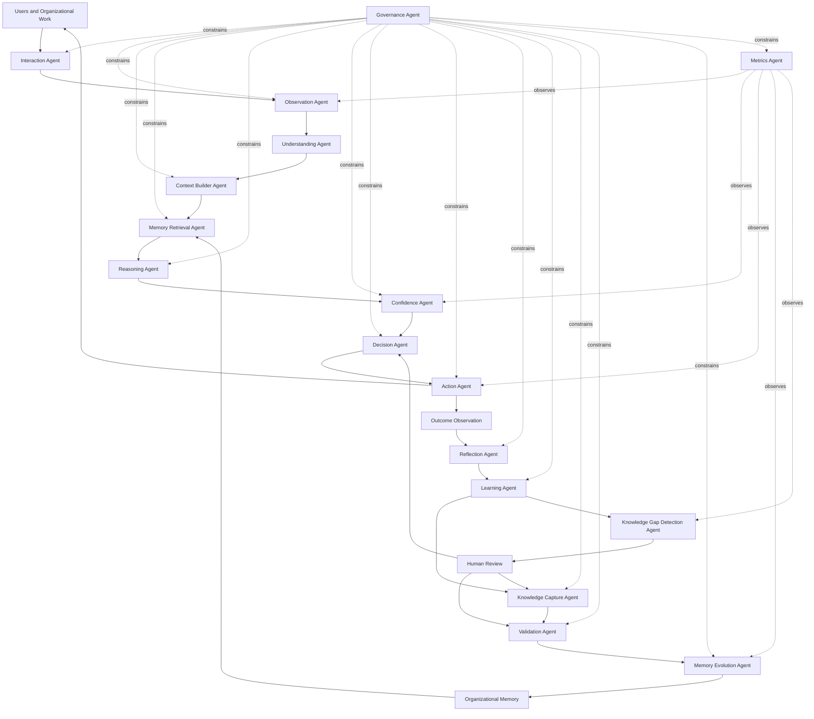
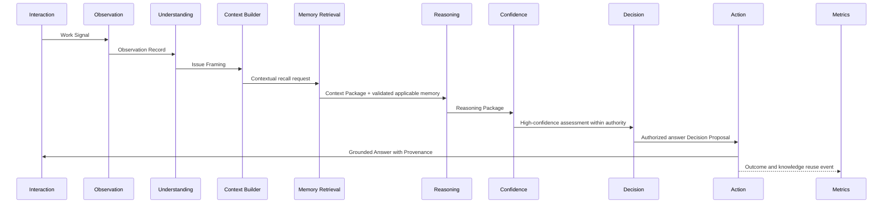
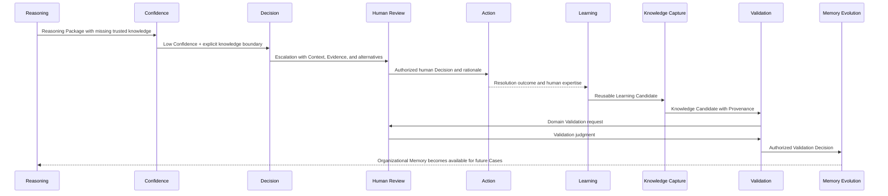
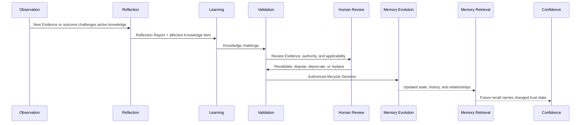
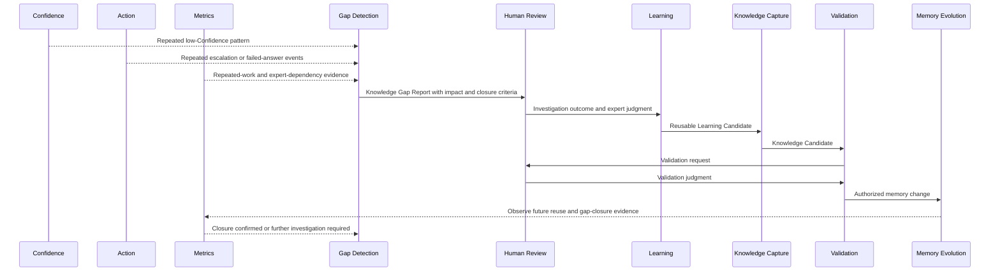
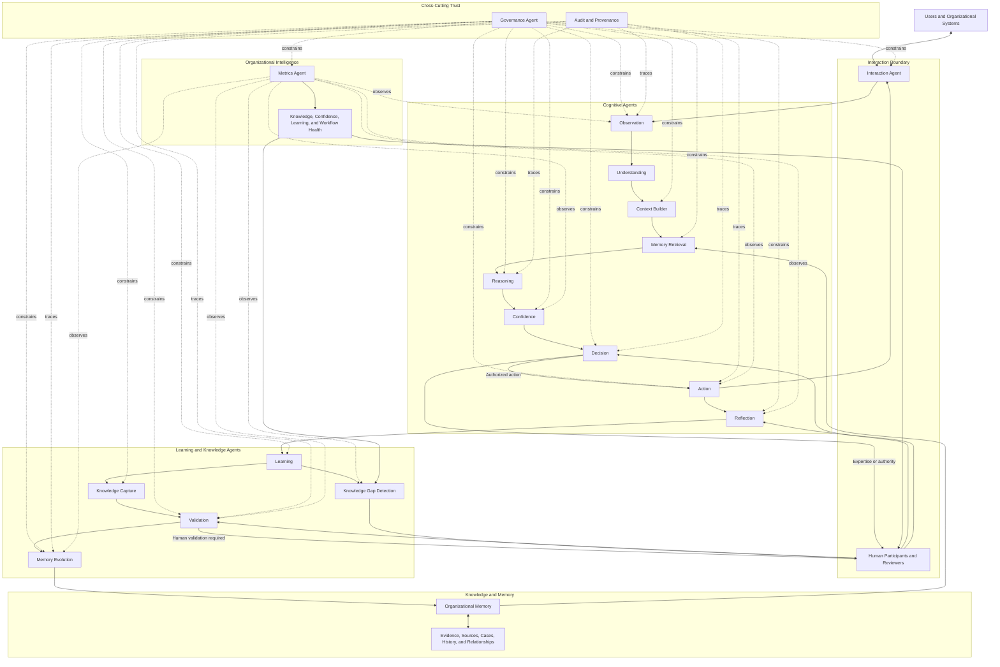

# AI Agent Architecture

## 1. Introduction

The [System Architecture](./07_SYSTEM_ARCHITECTURE.md) defined how responsibility is distributed across the Organizational Intelligence Platform. The [AI Cognitive Model](../canon/06_AI_COGNITIVE_MODEL.md) defined how intelligence should observe, understand, retrieve, reason, assess Confidence, decide, act, reflect, learn, and improve Organizational Memory.

The AI Agent Architecture defines **cognitive specialization**: which logical actors perform those responsibilities, what each actor owns, what each must never do, and how their collaboration preserves trust.

Specialization matters because no single intelligence component should own observation, interpretation, Reasoning, action, learning, Validation, Governance, and memory change. Combining those responsibilities would allow one component to produce a conclusion, judge its own certainty, approve its own learning, and rewrite the source of future truth. That is efficient only until it is wrong.

An **agent** in this document is a logical cognitive actor with a bounded purpose. It is not necessarily an AI model or an independently deployed component. A responsibility may later be fulfilled by AI, deterministic logic, retrieval, workflow control, human judgment, or a combination. The logical boundary remains stable even when its realization changes.

Agents collaborate through explicit cognitive artifacts and governed workflow transitions. They do not gain authority merely by participating in the chain. The platform's intelligence emerges from the complete system: specialized cognition, Organizational Memory, Validation, Governance, workflow, outcomes, and human expertise.

---

## 2. Relationship to Previous Documents

### Canon Traceability

Derived From:

- [Founder's Thesis](../canon/00_FOUNDERS_THESIS.md)
- [Product Vision](../canon/01_PRODUCT_VISION.md)
- [Product Principles](../canon/02_PRODUCT_PRINCIPLES.md)
- [Product Capability Model](../canon/03_PRODUCT_CAPABILITY_MODEL.md)
- [Product Domain Model](../canon/04_PRODUCT_DOMAIN_MODEL.md)
- [Product Workflow Model](../canon/05_PRODUCT_WORKFLOW_MODEL.md)
- [AI Cognitive Model](../canon/06_AI_COGNITIVE_MODEL.md)
- [System Architecture](./07_SYSTEM_ARCHITECTURE.md)

Canon Version: `v1.0.0`

| Document | Contribution |
| --- | --- |
| Founder's Thesis | Philosophy |
| Product Vision | Product identity |
| Product Principles | Decision constraints |
| Capability Model | Platform abilities |
| Domain Model | Platform vocabulary |
| Workflow Model | Behavioral flow |
| AI Cognitive Model | Cognitive behavior |
| System Architecture | Logical platform structure |
| AI Agent Architecture | Cognitive decomposition |

The Agent Architecture assigns ownership without changing meaning. Domain concepts remain authoritative. Workflow behavior remains intact. Cognitive stages remain ordered by responsibility rather than collapsed into answer generation. System Architecture boundaries—especially the separation of Reasoning, Validation, Governance, and memory change—remain binding.

---

## 3. Agent Architecture Philosophy

The platform is not one giant language model, autonomous general intelligence, a swarm of chatbots, or autonomous automation. It is a collection of specialized cognitive responsibilities collaborating within governed organizational workflows.

The architecture follows four ideas:

### Intelligence Is Distributed

No agent represents the intelligence of the platform. Observation, understanding, recall, Reasoning, Confidence, Decision, action, reflection, learning, Validation, memory evolution, metrics, and human judgment each contribute something the others cannot safely assume.

### Authority Is Constrained

Responsibility does not imply unrestricted authority. The Reasoning Agent may recommend; it cannot approve restricted action. The Learning Agent may identify a reusable lesson; it cannot validate it. The Memory Evolution Agent may apply an approved lifecycle transition; it cannot create that approval.

### Trust Is Preserved Through Separation

Each trust-changing transition crosses a visible boundary. Observation becomes interpretation only through Understanding. Retrieved memory becomes a conclusion only through Reasoning. A conclusion becomes action only through Confidence, Decision, Governance, and sometimes Human Review. Learning becomes memory only through Capture, Validation, and governed evolution.

### Collaboration Is Artifact-Based

Agents exchange explicit, inspectable cognitive artifacts rather than relying on hidden shared assumptions. A Context Package, Reasoning Package, Confidence Assessment, Decision Proposal, Reflection Report, or Knowledge Candidate preserves what the next responsibility needs and what it is allowed to conclude.

Agent specialization is not fragmentation for its own sake. The goal is a coherent mind with explicit faculties, constrained authority, inspectable handoffs, and the ability to evolve one cognitive responsibility without redefining all others.

---

## 4. High-Level Cognitive Architecture



The diagram shows cognitive responsibility, not a mandatory linear execution. An agent may return work to an earlier stage when Context is missing, Evidence conflicts, or authority is unclear. Human Review may enter before a Decision, during Validation, or after reflection. The Governance Agent constrains every stage but does not become the thinker at any stage.

The platform's Orchestration Layer coordinates when these logical actors participate. Agents do not invent their own workflows or silently bypass required stages.

---

## 5. Agent Catalog

Each agent has one primary cognitive purpose. Inputs and outputs are conceptual artifacts, not technical messages. Dependencies identify logical collaboration, not deployment dependencies.

### Interaction Agent

| Aspect | Definition |
| --- | --- |
| **Purpose** | Represent the boundary between Users, organizational work, and the cognitive system. |
| **Responsibilities** | Receive User intent and Work Signals; preserve original expression and Source; present questions, Answers, Uncertainty, review needs, and workflow state; capture feedback and Corrections. |
| **Inputs** | User communication, organizational events, Action Package, Governance constraints, review requests. |
| **Outputs** | Raw Work Signal, User intent, feedback, Correction signal, presented action, interaction outcome. |
| **Dependencies** | Observation Agent, Action Agent, Governance Agent, Human Review, workflow orchestration. |
| **Must Not Do** | Interpret the Issue, perform Reasoning, assign Confidence, choose the substantive Decision, or bypass cognitive and Governance stages. |
| **Failure Modes** | Losing original meaning; hiding Uncertainty; presenting a draft as approved; omitting Source or actor identity; turning interface defaults into Decisions. |
| **Interactions** | Sends unaltered observations to Observation; presents Action outputs; returns User reactions and Corrections to outcome observation. |

### Observation Agent

| Aspect | Definition |
| --- | --- |
| **Purpose** | Observe and organize what occurred without deciding what it means. |
| **Responsibilities** | Receive Work Signals; normalize form without erasing content; identify Source, time, Organization, Domain, and observable facts; separate direct observation from existing annotation; register initial signal completeness. |
| **Inputs** | Raw Work Signal, Case events, Human Review, Corrections, policy changes, outcomes, permitted organizational records. |
| **Outputs** | Observation Record containing preserved Source, observable content, time, Domain, and initial completeness indicators. |
| **Dependencies** | Interaction Agent, Governance Agent, Audit and Provenance responsibility, workflow orchestration. |
| **Must Not Do** | Interpret intent, diagnose, classify a claim as true, discard inconvenient observations, or create knowledge. |
| **Failure Modes** | Missing a material signal; altering meaning during normalization; confusing reported information with fact; losing Source or time Context; observing restricted information. |
| **Interactions** | Supplies Observation Records to Understanding; receives outcome signals from Action and Humans; provides observable facts to Provenance and Metrics. |

### Understanding Agent

| Aspect | Definition |
| --- | --- |
| **Purpose** | Form a bounded understanding of the Issue, ambiguity, and information needed for responsible cognition. |
| **Responsibilities** | Identify one or more Issues; distinguish signal from noise; recognize ambiguity, consequence, and likely Domain; identify missing information; separate the requested output from the underlying need. |
| **Inputs** | Observation Record, Case state, User intent, permitted Domain vocabulary. |
| **Outputs** | Issue Framing containing candidate Issues, ambiguities, material observations, missing Context, and questions requiring resolution. |
| **Dependencies** | Observation Agent, Governance Agent, Context Builder Agent, Domain Model. |
| **Must Not Do** | Make a final Diagnosis or Decision, assume missing Context, select an Answer, or declare knowledge applicable. |
| **Failure Modes** | Premature classification; collapsing multiple Issues; ignoring ambiguity; confusing symptoms with causes; framing the Issue around an available answer. |
| **Interactions** | Requests clarification through Interaction when necessary; passes Issue Framing to Context Builder; may receive revised observations. |

### Context Builder Agent

| Aspect | Definition |
| --- | --- |
| **Purpose** | Assemble the governed Context and Evidence needed for Reasoning. |
| **Responsibilities** | Establish relevant history, participants, state, policy period, risk, prior attempts, and Domain conditions; gather permitted Evidence references; identify remaining gaps; preserve Source-to-Evidence relationships. |
| **Inputs** | Issue Framing, Observation Records, permitted Case history, Evidence, Governance constraints, initial recall needs. |
| **Outputs** | Context Package containing conditions, Evidence set, Sources, missing information, consequence, and Governance Context. |
| **Dependencies** | Understanding Agent, Observation Agent, Memory Retrieval Agent, Governance Agent, Evidence management responsibility. |
| **Must Not Do** | Diagnose, weigh alternatives, decide which Answer is correct, silently fill gaps, or treat collected material as validated truth. |
| **Failure Modes** | Incomplete Context; irrelevant detail overwhelming material conditions; missing policy period; unauthorized Evidence assembly; severing Evidence from Source. |
| **Interactions** | Requests targeted observations or permitted recall; provides Context Package to Memory Retrieval and Reasoning; accepts requests for additional Context. |

### Memory Retrieval Agent

| Aspect | Definition |
| --- | --- |
| **Purpose** | Recall relevant Organizational Memory for the current Context without treating recall as truth. |
| **Responsibilities** | Retrieve applicable Knowledge Items, similar Cases, policies, exceptions, prior Decisions, Corrections, reasoning history, and lifecycle state; preserve Validation, freshness, applicability, and Provenance; make absence visible. |
| **Inputs** | Context Package, Issue Framing, governed recall scope, Domain and time conditions. |
| **Outputs** | Memory Recall Package containing potentially relevant memory, relationships, trust state, applicability, history, and known gaps. |
| **Dependencies** | Organizational Memory, Governance Agent, Context Builder Agent, Audit and Provenance responsibility. |
| **Must Not Do** | Decide relevance conclusively, choose an action, infer truth from similarity, conceal disputed or stale status, or broaden recall beyond Governance. |
| **Failure Modes** | Biased recall; surface similarity; omission of contradictory memory; stale guidance presented as active; excessive retrieval that obscures useful knowledge. |
| **Interactions** | Receives contextual recall requests; supplies recall to Reasoning; accepts refinements when Reasoning identifies material differences. |

### Reasoning Agent

| Aspect | Definition |
| --- | --- |
| **Purpose** | Connect Context, Evidence, Organizational Memory, Governance, exceptions, and Uncertainty into inspectable judgment. |
| **Responsibilities** | Evaluate Evidence; compare current and prior Cases; test applicability; identify assumptions and alternatives; form Diagnosis, recommendations, questions, and review needs; distinguish organizational knowledge from inference. |
| **Inputs** | Context Package, Memory Recall Package, Evidence, Issue Framing, Governance constraints. |
| **Outputs** | Reasoning Package containing Diagnosis, alternatives, recommendation, assumptions, supporting and conflicting Evidence, applicability, and unresolved Uncertainty. |
| **Dependencies** | Context Builder, Memory Retrieval, Governance Agent, Confidence Agent, Human Review when expertise is needed. |
| **Must Not Do** | Communicate directly to Users, modify memory, grant authority, validate knowledge, hide alternatives, or present inference as organizational truth. |
| **Failure Modes** | Hallucination; confirmation bias; over-generalization; ignored Evidence; unsupported causal inference; reasoning beyond Domain authority; unexplained conclusion. |
| **Interactions** | May request more Context or recall; passes Reasoning Package to Confidence; receives human expertise through governed review. |

### Confidence Agent

| Aspect | Definition |
| --- | --- |
| **Purpose** | Determine how strongly the Reasoning Package may guide behavior in the current Context. |
| **Responsibilities** | Assess Evidence quality, knowledge freshness, applicability, conflict, missing Context, authority, consequence, and Governance requirements; identify Uncertainty type; recommend behavioral constraints and escalation. |
| **Inputs** | Reasoning Package, Context Package, Evidence quality, memory lifecycle and Validation state, risk and authority requirements. |
| **Outputs** | Confidence Assessment containing reliance level, basis, material Uncertainty, consequence, and permitted or required behavior. |
| **Dependencies** | Reasoning Agent, Governance Agent, Memory Retrieval Agent, Context Builder, Human Review criteria. |
| **Must Not Do** | Create Evidence, improve weak Reasoning by assertion, grant authority, choose final wording, or reduce multidimensional Uncertainty to an unexplained score. |
| **Failure Modes** | Inflated Confidence; false precision; ignored conflict; failure to adjust for consequence; treating validated knowledge as universally applicable; confusing likelihood with permission. |
| **Interactions** | Challenges Reasoning when support is insufficient; sends assessment to Decision; sends repeated low-Confidence patterns to Gap Detection and Metrics. |

### Decision Agent

| Aspect | Definition |
| --- | --- |
| **Purpose** | Select the next responsible cognitive or workflow behavior. |
| **Responsibilities** | Choose among answer, draft, ask follow-up, retrieve more Evidence, present alternatives, escalate, request review, pause, or refuse; preserve the reason and required authority for the choice. |
| **Inputs** | Reasoning Package, Confidence Assessment, workflow state, Governance decision, available human Roles. |
| **Outputs** | Decision Proposal defining chosen behavior, rationale, limits, required authority, and expected outcome. |
| **Dependencies** | Confidence Agent, Governance Agent, Reasoning Agent, Human Review, Action Agent, workflow orchestration. |
| **Must Not Do** | Generate explanations independently, invent new Reasoning, override Governance, convert Confidence into authority, or change memory. |
| **Failure Modes** | Choosing an Answer because it is easiest; failing to escalate; unnecessary refusal; automation bias; mismatch between Decision and Confidence; unauthorized action. |
| **Interactions** | Routes review proposals to Humans; sends authorized Decision Proposal to Action; may return to Understanding, Context, Retrieval, or Reasoning. |

### Action Agent

| Aspect | Definition |
| --- | --- |
| **Purpose** | Execute an authorized Decision Proposal faithfully in the organizational workflow. |
| **Responsibilities** | Communicate, draft, summarize, organize, notify, ask, escalate, pause, refuse, or create workflow events as directed; preserve Provenance, approval state, Confidence, and material limits. |
| **Inputs** | Authorized Decision Proposal, Reasoning basis needed for explanation, Confidence Assessment, Governance constraints, presentation Context. |
| **Outputs** | Action Package, User-facing communication, notification, escalation, workflow event, or recorded pause/refusal. |
| **Dependencies** | Decision Agent, Interaction Agent, Governance Agent, Human Review, workflow orchestration, Audit and Provenance. |
| **Must Not Do** | Change the Decision, add unsupported claims, suppress Uncertainty, expand authority, update memory, or present a draft as validated. |
| **Failure Modes** | Execution drift; lossy explanation; omitted limits; wrong recipient; unauthorized disclosure; failure to record the action; wording that overstates Confidence. |
| **Interactions** | Delivers through Interaction; emits outcome-observation signals; notifies Humans; returns execution failure to Decision and orchestration. |

### Reflection Agent

| Aspect | Definition |
| --- | --- |
| **Purpose** | Evaluate completed work against outcomes and the quality of the cognition that produced it. |
| **Responsibilities** | Compare expectation with outcome; examine Reasoning, Confidence, Governance, memory use, Human Review, and action fidelity; identify mistakes, surprises, challenges, and possible reusable learning. |
| **Inputs** | Observation and outcome records, Context Package, Reasoning Package, Confidence Assessment, Decision Proposal, action, Human Corrections. |
| **Outputs** | Reflection Report containing cognitive assessment, confirmed or challenged assumptions, possible lesson, and need for further investigation. |
| **Dependencies** | Observation Agent, Metrics Agent, Governance Agent, Human Review, Learning Agent. |
| **Must Not Do** | Update memory, validate a lesson, rewrite the prior Reasoning, infer learning from output acceptance alone, or hide failure. |
| **Failure Modes** | Outcome blindness; hindsight bias; equating satisfaction with correctness; attributing every failure to cognition; skipping Governance review; premature lesson extraction. |
| **Interactions** | Sends Reflection Report to Learning; requests human interpretation when outcome meaning is ambiguous; sends quality signals to Metrics. |

### Learning Agent

| Aspect | Definition |
| --- | --- |
| **Purpose** | Determine whether work produced a reusable change in what the Organization can know or do. |
| **Responsibilities** | Distinguish routine reuse from learning; identify reusable lessons, repeated success or failure, outdated knowledge, conflicts, assumptions, and Knowledge Gaps; recommend Capture, challenge, investigation, or no learning. |
| **Inputs** | Reflection Report, Corrections, repeated Work Signals, outcomes, current memory, knowledge health and gap patterns. |
| **Outputs** | Learning Candidate, Knowledge Gap signal, knowledge challenge, monitoring recommendation, or explicit no-learning determination. |
| **Dependencies** | Reflection Agent, Knowledge Gap Detection Agent, Knowledge Capture Agent, Metrics Agent, Human Review. |
| **Must Not Do** | Validate knowledge, modify memory, generalize one exception without support, treat repetition as truth, or require every interaction to teach something. |
| **Failure Modes** | Overfitting; learning from bad examples; content inflation; missing a durable Correction; confusing evidence accumulation with new knowledge; novelty bias. |
| **Interactions** | Routes reusable candidates to Knowledge Capture; routes patterns to Gap Detection; requests human judgment about durability and applicability. |

### Knowledge Capture Agent

| Aspect | Definition |
| --- | --- |
| **Purpose** | Transform a Learning Candidate into a complete, reviewable Knowledge Candidate. |
| **Responsibilities** | Preserve the proposed claim, problem, Diagnosis, Reasoning, Resolution, Context, Evidence, Sources, applicability, limits, exceptions, human judgment, affected knowledge, and Provenance. |
| **Inputs** | Learning Candidate, Reflection Report, Case artifacts, Correction, Evidence, human explanation, related Knowledge Items. |
| **Outputs** | Knowledge Candidate with explicit scope, support, limits, owner need, and Validation request. |
| **Dependencies** | Learning Agent, Human Review, Governance Agent, Audit and Provenance, Validation Agent. |
| **Must Not Do** | Approve knowledge, conceal weak Evidence, remove Context to create apparent generality, overwrite an existing item, or infer authority from the source actor alone. |
| **Failure Modes** | Capturing only the final Answer; lost Provenance; vague applicability; unsupported generalization; duplicate candidate; missing exception or conflict. |
| **Interactions** | Requests clarification from Humans; sends candidate to Validation; receives requests to revise or add Evidence. |

### Validation Agent

| Aspect | Definition |
| --- | --- |
| **Purpose** | Coordinate the process through which a Knowledge Candidate or existing Knowledge Item earns, retains, loses, or changes trust. |
| **Responsibilities** | Apply Validation criteria; verify required Evidence and authority; coordinate independent Human Review; check contradiction, risk, successful use, and Governance; define validated scope or dispute. |
| **Inputs** | Knowledge Candidate or challenge, Evidence set, Source authority, Human Review, outcomes, Domain Validation rules, Governance requirements. |
| **Outputs** | Validation Decision: validate for scope, request revision, reject, dispute, require investigation, or revalidate—with rationale and authority. |
| **Dependencies** | Knowledge Capture Agent, Human Review, Governance Agent, Memory Retrieval Agent, Audit and Provenance, Memory Evolution Agent. |
| **Must Not Do** | Perform Case Diagnosis, create the candidate it approves, capture missing Evidence itself, bypass required human authority, or change memory directly. |
| **Failure Modes** | Self-validation; weak reviewer independence; approval without Evidence; popularity treated as truth; ignored contradiction; Governance bypass; unclear validated scope. |
| **Interactions** | Requests Humans or candidate revision; sends authorized Validation Decision to Memory Evolution; notifies Confidence and Gap Detection of dispute or staleness. |

### Memory Evolution Agent

| Aspect | Definition |
| --- | --- |
| **Purpose** | Apply authorized knowledge changes to Organizational Memory while preserving lifecycle, relationships, and history. |
| **Responsibilities** | Create or update Knowledge Items from valid instructions; enact draft, proposed, validated, active, challenged, disputed, stale, deprecated, and replaced transitions; maintain ownership, applicability, version history, and replacement relationships. |
| **Inputs** | Authorized Validation Decision, governed lifecycle instruction, Provenance chain, affected Knowledge Items, effective Context. |
| **Outputs** | Memory Change Record, updated Knowledge Item and relationships, preserved prior state, events for retrieval and Metrics. |
| **Dependencies** | Validation Agent, Governance Agent, Organizational Memory, Audit and Provenance, Metrics Agent. |
| **Must Not Do** | Bypass Validation, invent content, decide trust, erase history, merge conflicts silently, or communicate Answers. |
| **Failure Modes** | Applying an unauthorized change; lost history; broken replacement relationship; stale item left active; partial change creating inconsistent memory; cross-Domain leakage. |
| **Interactions** | Applies only validated instructions; informs Retrieval, Confidence, Metrics, and affected workflow owners of changed memory state. |

### Knowledge Gap Detection Agent

| Aspect | Definition |
| --- | --- |
| **Purpose** | Detect where Organizational Memory is repeatedly missing, weak, stale, conflicting, inaccessible, or insufficient. |
| **Responsibilities** | Identify repeated Uncertainty, escalations, failures, questions, Corrections, low Confidence, ineffective knowledge reuse, expert dependency, and unresolved conflict; establish impact and closure evidence. |
| **Inputs** | Work and outcome events, Confidence Assessments, Reflection Reports, Learning Candidates, memory health, escalation patterns, repeated Work Signals. |
| **Outputs** | Knowledge Gap Report with affected Issues and Domain, Evidence, consequence, frequency, ownership need, and closure criteria. |
| **Dependencies** | Learning Agent, Metrics Agent, Confidence Agent, Organizational Memory, Human Review, Governance Agent. |
| **Must Not Do** | Declare a policy answer, create knowledge from frequency alone, assign blame, close a gap because content exists, or expose restricted patterns. |
| **Failure Modes** | Alert noise; duplicate gaps; false pattern; missing low-frequency high-consequence gaps; confusing access failure with missing knowledge; premature closure. |
| **Interactions** | Routes gaps to Humans and knowledge owners; sends investigation results to Learning and Capture; receives outcome evidence from Metrics. |

### Metrics Agent

| Aspect | Definition |
| --- | --- |
| **Purpose** | Observe whether cognitive collaboration improves Organizational Intelligence over time. |
| **Responsibilities** | Measure trusted knowledge reuse, knowledge health, learning velocity, Confidence evolution, repeated-work reduction, gap closure, answer consistency, time to validated knowledge, and fragile expert dependency; preserve outcome Context. |
| **Inputs** | Workflow and domain events, Confidence Assessments, Reflection Reports, Validation Decisions, memory changes, gap state, outcomes, system health signals. |
| **Outputs** | Organizational Intelligence Metrics, trends, anomalies, evidence for investigation, and measurement limitations. |
| **Dependencies** | All event-producing agents, Organizational Memory, Governance Agent, Audit and Provenance, Knowledge Gap Detection. |
| **Must Not Do** | Validate knowledge, rank truth by popularity, optimize agents directly, infer causation without Evidence, or expose restricted data through aggregation. |
| **Failure Modes** | Vanity metrics; missing Context; Goodhart effects; false causation; hidden quality trade-offs; aggregation that conceals risk; expert contribution mistaken for dependency failure. |
| **Interactions** | Supplies patterns to Reflection and Gap Detection; reports outcomes to Humans; never commands cognitive behavior solely from a metric. |

### Governance Agent

| Aspect | Definition |
| --- | --- |
| **Purpose** | Constrain every cognitive responsibility according to organizational authority, permission, risk, accountability, and policy. |
| **Responsibilities** | Evaluate what may be observed, recalled, reasoned over, disclosed, acted upon, reviewed, captured, validated, learned, and measured; identify required Role, approval, and audit obligations; enforce separation of duties. |
| **Inputs** | Organization, User, Role, Domain, Context, requested action, knowledge sensitivity, consequence, policy, Provenance completeness. |
| **Outputs** | Governance Decision: permit, restrict, require review, require approval, limit disclosure, or refuse—with governing basis and audit requirement. |
| **Dependencies** | Organizational Governance Boundaries, Human authority, Audit and Provenance, every governed agent. |
| **Must Not Do** | Perform Reasoning, generate Answers, decide Domain truth, validate knowledge on subject matter, infer permission from Confidence, or become a universal workflow controller. |
| **Failure Modes** | Over-permission; over-restriction; policy drift; inconsistent authority; boundary checked too late; missing purpose limitation; unaudited exception. |
| **Interactions** | Supervises every stage by responding to contextual Governance questions; receives events for audit; routes authority needs to Humans. |

The Governance Agent is unique because it is cross-cutting. It does not sit at the end of the chain and approve completed cognition. It constrains what each agent may observe and do before the responsibility is exercised. It owns Governance interpretation, not cognitive or organizational truth.

---

## 6. Human Collaboration

Humans are not external to the agent architecture. They are first-class participants in cognition, authority, Validation, and learning. The architecture exists to preserve and scale their expertise, not to design it away.

Humans contribute what specialized agents cannot independently own:

- Domain judgment developed through experience.
- Organizational authority and accountability.
- Interpretation of nuance, intent, consequence, and exception.
- Resolution of conflicts that Evidence alone cannot settle.
- Correction of cognition and communication.
- Validation of knowledge where human authority is required.
- Definition of Governance Boundaries and acceptable risk.

### Human and Validation Agent

The Validation Agent coordinates criteria and presents the Knowledge Candidate, Evidence, conflict, scope, and Governance requirement. An appropriately authorized human approves, rejects, disputes, narrows, or requests revision. The agent preserves the rationale and authority; it does not reduce human participation to confirming a recommendation.

### Human and Reflection Agent

Humans explain why an outcome occurred, whether a Correction was factual or stylistic, and which assumption failed. The Reflection Agent structures that input alongside the original Reasoning and outcome. It does not reinterpret human disagreement as model error or truth without Context.

### Human and Learning Agent

Humans judge whether a lesson is durable, exceptional, or too dependent on unstated Context. The Learning Agent helps identify patterns and possible reuse. It does not decide that repeated human behavior is correct merely because it is frequent.

### Human and Decision Agent

When authority, consequence, novelty, or conflict requires Human Review, the Decision Agent routes a clear proposal with Evidence, alternatives, Confidence, Uncertainty, and the required authority. The human may choose a different action and should be able to explain why.

### Human and Knowledge Capture Agent

Humans supply rationale, applicability, limits, exceptions, and tacit expertise that cannot be recovered from the final Answer alone. The Capture Agent preserves that judgment in a candidate without granting it automatic trust.

### Ultimate Authority for Organizational Truth

Humans remain the ultimate authority for organizational truth through governed Roles and Validation processes. This does not mean any human statement is automatically true. Authority is contextual, Domain-specific, evidence-aware, and accountable. The architecture preserves both human centrality and disciplined Validation.

Human Review is a normal cognitive state. A successful system does not minimize it indiscriminately. It directs human attention to the places where expertise, authority, conflict resolution, or new learning matters most—and ensures that the resulting judgment improves future capability.

---

## 7. Agent Collaboration Patterns

### Known Case



Existing validated knowledge is recalled and tested for applicability. No Knowledge Candidate is created merely because the known guidance was used. Metrics may record successful reuse and outcome Evidence.

### Unknown Case and Escalation



The agents make Uncertainty visible instead of filling the gap with plausible language. Human expertise resolves the immediate Case and enters memory only after Capture and Validation.

### Human Correction

```mermaid
sequenceDiagram
    participant I as Interaction
    participant H as Human
    participant A as Action
    participant R as Reflection
    participant L as Learning
    participant K as Knowledge Capture
    participant V as Validation
    participant E as Memory Evolution
    participant M as Metrics

    A->>I: Proposed or delivered output
    H->>I: Correction with reason
    I->>R: Correction + original cognitive artifacts
    R->>L: Reflection Report identifies failed assumption
    alt Situational edit only
        L-->>M: No reusable learning; retain outcome
    else Reusable lesson
        L->>K: Learning Candidate
        K->>V: Knowledge Candidate or challenge
        V->>H: Review affected knowledge and scope
        H->>V: Validation judgment
        V->>E: Approved create, update, dispute, or replace
        E-->>M: Memory change and recurrence measure
    end
```

The Correction changes the immediate output first. Only a reusable, validated lesson changes memory. The architecture preserves the reason for the Correction, not just the edited wording.

### Knowledge Evolution



Old knowledge remains in history. Retrieval and Confidence immediately respect the new lifecycle state and scope.

### Knowledge Gap Discovery



A gap closes through demonstrated future capability, not because content was created. Metrics and outcomes provide closure Evidence; Gap Detection does not validate the answer to the gap.

Governance constrains every sequence even when not drawn as a participant. Each agent checks the relevant Governance decision before observing, recalling, reasoning, disclosing, validating, learning, or changing memory.

---

## 8. Agent Communication Principles

Agents communicate through structured cognitive artifacts. Structure means that the artifact has a defined conceptual purpose, required Context, explicit Provenance, and a limited interpretation. It does not prescribe a technical format.

### Cognitive Artifact Catalog

| Artifact | Primary producer | Primary consumers | Required meaning |
| --- | --- | --- | --- |
| **Observation Record** | Observation Agent | Understanding, Context Builder, Provenance, Metrics | What was observed, from which Source, when, in which Domain, and what remains unobserved. |
| **Issue Framing** | Understanding Agent | Context Builder, Interaction | Candidate Issues, ambiguity, material signals, consequence, and missing information. |
| **Context Package** | Context Builder Agent | Memory Retrieval, Reasoning, Human Review | Conditions, Evidence, Sources, policy period, history, risk, missing Context, and Governance scope. |
| **Memory Recall Package** | Memory Retrieval Agent | Reasoning, Human Review | Potentially relevant memory with applicability, lifecycle, Validation, history, conflict, and Provenance intact. |
| **Reasoning Package** | Reasoning Agent | Confidence, Decision, Human Review, Reflection | Diagnosis, alternatives, recommendation, assumptions, Evidence, exceptions, applicability, and unresolved Uncertainty. |
| **Confidence Assessment** | Confidence Agent | Decision, Interaction, Human Review, Metrics | Reliance level and basis, Uncertainty type, conflict, consequence, authority, and behavioral constraints. |
| **Decision Proposal** | Decision Agent | Action, Human Review, Orchestration | Proposed next behavior, rationale, required authority, limits, and expected outcome. |
| **Action Package** | Action Agent | Interaction, outcome observation, Audit | Faithful execution, communication, recipients, approval state, Provenance, and material limits. |
| **Reflection Report** | Reflection Agent | Learning, Human Review, Metrics | Outcome comparison, cognitive quality, confirmed or challenged assumptions, and possible learning. |
| **Learning Candidate** | Learning Agent | Knowledge Capture, Gap Detection, Human Review | Proposed reusable lesson or gap, durability rationale, supporting pattern, and uncertainty. |
| **Knowledge Candidate** | Knowledge Capture Agent | Validation, Human Review | Proposed knowledge with Context, Evidence, Sources, applicability, limits, owner need, and full Provenance. |
| **Validation Request** | Knowledge Capture or Validation Agent | Human Review, Domain authority | Candidate, required criteria, Evidence, conflict, scope, risk, and authority needed. |
| **Validation Decision** | Validation Agent with authorized Human input | Memory Evolution, Audit, Confidence | Trust outcome, validated scope, rationale, authority, restrictions, and lifecycle implication. |
| **Memory Change Record** | Memory Evolution Agent | Retrieval, Metrics, Audit, affected workflows | Applied change, prior state, new state, effective Context, relationships, and authorization. |
| **Knowledge Gap Report** | Knowledge Gap Detection Agent | Human Review, Learning, Metrics, knowledge owners | Affected Issues, Evidence, frequency, consequence, expert dependency, owner need, and closure criteria. |

### Communication Rules

1. Artifacts preserve the distinction between observation, interpretation, recommendation, authority, and truth.
2. Every consequential artifact carries sufficient Provenance for its consumer to inspect the basis.
3. Material Uncertainty is carried forward; it does not disappear at a handoff.
4. The producer states what the artifact means and what it does not authorize.
5. The consumer may challenge or return an incomplete artifact rather than filling gaps silently.
6. Corrections create new traceable artifacts; they do not erase the original cognitive history.
7. Governance determines which fields, Sources, and conclusions a consumer may receive or use.
8. Artifacts should be stable across replacement of an agent's internal realization.

### Avoid Direct Shared Mutable State

Agents should not coordinate by silently reading and rewriting a common mutable cognitive state. That pattern obscures who introduced a claim, changed Confidence, removed an exception, or authorized an action. It also allows one agent to exceed its authority through a shared object.

The authoritative state belongs to the appropriate platform responsibility: Case state to orchestration, trust state to Validation and lifecycle, Organizational Memory to the Memory Layer, Governance policy to Governance, and audit history to Provenance. Agents contribute explicit artifacts and request governed transitions.

---

## 9. Agent Boundaries

| Boundary | Rule | Integrity protected |
| --- | --- | --- |
| **Interaction** | Interaction never bypasses Understanding, Reasoning, Confidence, Decision, or Governance to produce a substantive Answer. | Interface convenience cannot become cognitive authority. |
| **Observation** | Observation never interprets, diagnoses, or creates knowledge. | Facts and reports remain distinguishable from inference. |
| **Understanding** | Understanding frames the Issue but never makes the final Decision. | Early categorization does not predetermine the outcome. |
| **Context** | Context Builder assembles conditions and Evidence but never reasons to a conclusion. | Context remains reusable and inspectable rather than biased toward one answer. |
| **Retrieval** | Retrieval never decides truth, applicability, or action. | Recall remains input to Reasoning, not a hidden Decision. |
| **Reasoning** | Reasoning never communicates directly to Users or updates memory. | Generated judgment cannot bypass Confidence, Governance, Human Review, or Validation. |
| **Confidence** | Confidence never creates Evidence, authority, or permission. | Certainty remains calibrated and distinct from Governance. |
| **Decision** | Decision never invents new explanation or Reasoning. | Behavior selection remains accountable to the supplied basis. |
| **Action** | Action never changes the Decision or cognitive basis it executes. | Execution cannot silently expand claims or authority. |
| **Reflection** | Reflection never changes memory. | Outcome interpretation remains a learning proposal. |
| **Learning** | Learning never validates its own lesson. | Proposed improvement remains distinct from trusted knowledge. |
| **Capture** | Knowledge Capture never approves the candidate it creates. | Extraction remains independent from trust. |
| **Validation** | Validation never creates missing Evidence or perform Case Reasoning. | Trust decisions remain based on supplied Evidence and proper authority. |
| **Memory Evolution** | Memory Evolution never bypasses Validation or erase history. | Organizational Memory remains trustworthy and auditable. |
| **Gap Detection** | Gap Detection never declares the answer to a gap. | Patterns create investigation, not truth. |
| **Metrics** | Metrics never optimize cognition or validate knowledge directly. | Measurement remains evidence rather than control or authority. |
| **Governance** | Governance never generates Answers, performs Domain Reasoning, or validates subject matter. | Policy and authority remain distinct from truth. |
| **Human Review** | Human Review is independent and receives the Context needed to disagree. | Humans remain genuine sources of judgment, not approval theater. |

Boundaries do not prohibit collaboration. They make collaboration trustworthy by requiring every responsibility to contribute through its proper authority.

---

## 10. Agent Failure Modes

| Failure | Detection signals | Recovery |
| --- | --- | --- |
| **Observation misses a signal** | Later Correction, contradictory outcome, missing Source, unexplained Context gap. | Reopen observation; add the missed Source; mark downstream artifacts incomplete; repeat affected cognition. |
| **Observation interprets prematurely** | Observation Record contains Diagnosis or unsupported labels. | Separate observed content from inference; return interpretation to Understanding or Reasoning. |
| **Understanding frames the wrong Issue** | Repeated follow-up, irrelevant recall, User rejection, unresolved actual need. | Reframe the Case, split Issues when necessary, and rebuild Context. |
| **Context is incomplete** | Missing policy period, participant, state, risk, prior attempt, or authority. | Ask targeted questions, gather permitted Evidence, and invalidate conclusions that depended on assumed Context. |
| **Retrieval is biased or incomplete** | Only confirming memory returned; contradictory or historical guidance discovered later. | Broaden contextual recall within Governance, include conflict and lifecycle, and rerun Reasoning. |
| **Reasoning hallucinates** | Claim lacks Source or Evidence; conclusion not derivable from artifacts; Human Correction. | Withhold action, expose unsupported claim, require revised Reasoning, and reflect on recurrence. |
| **Reasoning over-generalizes** | Knowledge applied outside validated scope or material Case differences ignored. | Restore applicability conditions, compare differences, reduce Confidence, and seek review. |
| **Confidence is inflated** | High-confidence failure, ignored conflict, repeated Corrections, consequence mismatch. | Reassess dimensions separately, require Human Review, and monitor calibration over similar Cases. |
| **Decision selects unsafe autonomy** | Action exceeds authority or contradicts Confidence constraints. | Stop execution, route to Human Review, audit why constraints were ignored, and correct Decision policy. |
| **Action drifts from Decision** | Output adds claims, removes limits, or reaches wrong recipient. | Retract or correct action, restore approved content and recipient, and record execution failure. |
| **Reflection misses failure** | Repeated error despite negative outcomes; accepted output treated as correct. | Include downstream evidence and human interpretation; reopen reflection and learning assessment. |
| **Learning overfits** | One exceptional event becomes broad lesson; candidate scope exceeds Evidence. | Narrow or reject candidate, seek repeated or independent Evidence, and preserve exception Context. |
| **Bad examples become learning** | Frequent but unauthorized or unsuccessful behavior proposed as knowledge. | Require outcome and authority checks; challenge the pattern; route to Validation and Human Review. |
| **Validation is bypassed** | Memory change lacks Validation Decision, authority, or Provenance. | Reject or quarantine change, restore prior trusted state, audit breach, and run proper Validation. |
| **Validation becomes approval theater** | Reviewer lacks independence, Evidence, Context, or ability to reject. | Reassign appropriate Role, present full artifacts, and repeat review with explicit rationale. |
| **Memory evolution corrupts history** | Prior state unavailable, replacement link missing, disputed item still active. | Restore traceable prior state, reconcile lifecycle relationships, and notify dependent cognition. |
| **Gap detection creates noise** | Many duplicate, low-impact, or unactionable gaps. | Consolidate by Issue and cause, require Evidence and closure criteria, prioritize by consequence. |
| **Metrics create perverse incentives** | Automation rises while quality, review, or memory health falls. | Expose trade-offs, remove isolated targets, and reconnect metrics to outcomes and learning. |
| **Governance is ignored** | Restricted recall, unauthorized disclosure, missing approval, unaudited exception. | Stop affected workflow, contain exposure, route to authorized Role, preserve audit, and reassess all derived artifacts. |
| **Agent disagreement is hidden** | One conclusion appears despite unresolved contradictory artifacts. | Preserve alternatives, lower Confidence, escalate conflict, and prevent false consensus. |

Recovery follows four rules:

1. Protect the User and Organization before preserving workflow speed.
2. Invalidate or challenge downstream artifacts that depended on the failed stage.
3. Preserve the failure and recovery in Provenance.
4. Determine whether the failure is situational or a Learning Event requiring a durable change.

---

## 11. Agent Evolution Strategy

Agents may evolve independently when their purpose, artifact boundary, authority, and Canon meaning remain stable.

### Multiple Reasoning Agents

The platform may introduce several Reasoning Agents for different forms of analysis, alternative hypotheses, or independent challenge. Their outputs should use the same Reasoning Package semantics and remain subject to Confidence, Governance, Human Review, and Decision. An ensemble does not grant itself authority through agreement.

### Domain-Specific Agents

Customer Support, HR, IT, Finance, Legal, Healthcare Operations, Manufacturing, Government, and Education may require specialized Understanding, Context, Reasoning, Validation, and Governance behavior. Domain-specific agents extend core responsibilities; they do not redefine Case, Evidence, Confidence, Validation, or Organizational Memory.

### Specialized Healthcare, Financial, and Legal Cognition

High-consequence Domains may add stricter Evidence standards, required human Roles, restricted actions, narrower validated scope, and specialized alternatives. Specialization must increase discipline, not create a shortcut around the common cognitive cycle.

### Planning Agents

Planning may become a specialized form of Reasoning that proposes sequences, dependencies, alternatives, and expected outcomes. Plans remain Decision Proposals until appropriate authority approves them. Planning never becomes execution authority by itself.

### Simulation Agents

Simulation may compare possible outcomes or test assumptions. A simulated result is Evidence about a model of possibilities, not an observed outcome or organizational truth. Its assumptions and limits remain explicit.

### Independent Challenge Agents

The architecture may add agents whose purpose is to find contradictory Evidence, alternative Diagnoses, unsafe assumptions, or Governance risk. They improve meta-cognition but do not veto or approve outside defined authority.

### Evolution Rules

- Add a new agent only when it owns a distinct cognitive responsibility or Domain specialization.
- Preserve existing cognitive artifacts or version their meaning explicitly under Canon governance.
- Keep authority narrower than capability.
- Do not split agents so finely that Provenance and accountability become unintelligible.
- Do not combine agents when the combination would allow self-approval or hidden state change.
- Evaluate new agents by trust, cognitive quality, human usefulness, and organizational learning—not output volume.
- Allow old and new realizations to coexist during evaluation without creating two meanings for the same artifact.
- Treat any change to core cognitive meaning or authority as a Canon-governed architectural change.

The architecture should support new agents without redesigning cognition because stable responsibilities define the extension points. New capabilities join the collaboration; they do not replace the learning system with a new center of intelligence.

---

## 12. Reference Agent Architecture



### Reading the Reference Architecture

- The **cognitive path** moves from observation through action. Each stage owns one form of judgment.
- The **human path** enters wherever expertise, authority, Correction, or Validation is required.
- The **learning path** begins after reflection and crosses Capture and Validation before memory changes.
- The **memory feedback path** gives future Reasoning governed access to accumulated organizational learning.
- The **gap path** turns repeated insufficiency into explicit human and organizational improvement work.
- The **Governance path** constrains every stage; the **Provenance path** makes important cognition and change traceable.
- The **Metrics path** observes outcomes and health without becoming cognitive authority.

Workflow orchestration coordinates these interactions according to the Product Workflow Model. It is intentionally outside the set of cognitive agents because process ownership and intelligence remain separate in the System Architecture.

---

## 13. Traceability Matrix

| Canon concept or architectural responsibility | Primary owner | Collaborators and constraints |
| --- | --- | --- |
| Work Signal | Interaction Agent, Observation Agent | Governance, Provenance, Orchestration |
| Observation | Observation Agent | Interaction, Metrics, Governance |
| Understanding | Understanding Agent | Observation, Context Builder, Domain vocabulary |
| Issue | Understanding Agent | Context Builder, Human clarification |
| Context | Context Builder Agent | Observation, Evidence, Governance, Memory Retrieval |
| Evidence and Source | Context Builder with Evidence responsibility | Observation, Provenance, Human contributors |
| Organizational Memory recall | Memory Retrieval Agent | Memory Layer, Governance, Context Builder |
| Organizational Memory evolution | Memory Evolution Agent | Validation, Governance, Provenance; never direct Reasoning |
| Reasoning | Reasoning Agent | Retrieval, Context, Evidence, Governance, Human expertise |
| Diagnosis and alternatives | Reasoning Agent | Confidence and Human Review qualify use |
| Confidence and Uncertainty | Confidence Agent | Reasoning, Governance, Context, Metrics |
| Decision behavior | Decision Agent | Confidence, Governance, Human authority, Orchestration |
| Answer or action | Action Agent | Decision, Interaction, Governance, Provenance |
| Observe Outcome | Observation Agent and Reflection Agent | Action, Humans, Metrics |
| Reflection | Reflection Agent | Outcome Evidence, Human interpretation, Learning |
| Learning | Learning Agent | Reflection, Humans, Gap Detection; cannot validate |
| Knowledge Candidate | Knowledge Capture Agent | Learning, Humans, Evidence, Provenance |
| Validation | Validation Agent | Authorized Humans, Governance, Evidence, Provenance |
| Human Review | Human participants coordinated with Decision or Validation | Independent judgment, appropriate Role and Context |
| Knowledge Lifecycle | Memory Evolution Agent | Validation Decision, Governance, preserved history |
| Provenance | Every producing agent; Audit and Provenance preserves | Governance requires completeness and access control |
| Knowledge Gap | Knowledge Gap Detection Agent | Confidence, Learning, Metrics, Humans, Memory health |
| Organizational Intelligence Metrics | Metrics Agent | All event producers, Governance, outcome Context |
| Meta-cognition | Reasoning, Confidence, Reflection | Human Review, independent challenge, Governance |
| Trust Before Automation | Confidence, Decision, Governance, Human Review | Action executes only an authorized proposal |
| Human expertise as source of trust | Human participants | Reflection, Learning, Capture, Validation, Decision |
| Memory Before Automation | Retrieval, Reasoning, Confidence, Decision | Validated memory and Governance precede autonomous action |
| AI is not the intelligence | Entire agent system | Humans, memory, Validation, Governance, workflows, outcomes |

Ownership in this matrix is cognitive ownership, not exclusive control over a Domain concept. A Case remains authoritative in workflow orchestration; Organizational Memory remains authoritative in the Memory Layer; Governance policy remains authoritative in organizational Governance. Agents operate within those system boundaries.

---

## 14. What This Document Does Not Define

This document intentionally excludes:

- Prompts or prompt engineering.
- LLM or model selection.
- Model routing.
- Agent orchestration frameworks.
- APIs or communication protocols.
- Infrastructure and deployment.
- Vector databases or retrieval products.
- Implementation code.
- Programming languages and libraries.
- Vendor-specific agent concepts.
- Runtime topology or service boundaries.
- Performance sizing.

Those choices belong in future engineering documents. They must target Canon Version `v1.0.0`, derive explicitly from the relevant Canon and architecture documents, and preserve the responsibilities, artifacts, collaboration patterns, authority, and boundaries defined here.

---

## 15. Closing

The AI Cognitive Model defined how intelligence thinks. The AI Agent Architecture defines how those cognitive responsibilities are distributed among collaborating logical actors.

Observation preserves what happened. Understanding frames the Issue. Context Builder assembles the conditions and Evidence. Memory Retrieval recalls organizational learning. Reasoning forms inspectable judgment. Confidence determines responsible reliance. Decision selects behavior. Action executes faithfully. Reflection examines outcomes. Learning identifies possible improvement. Knowledge Capture makes that improvement reviewable. Validation establishes trust. Memory Evolution preserves authorized change. Gap Detection reveals what the Organization still needs to learn. Metrics determine whether future capability improved. Governance constrains them all.

Future implementation should preserve these logical responsibilities regardless of technology. An agent may change its internal realization, divide into specialized variants, or be combined operationally with another responsibility. It must not acquire authority that collapses a Canon boundary.

The platform's intelligence emerges from collaboration among specialized agents governed by Organizational Memory, Validation, Governance, workflow, outcomes, and human expertise. No single AI model is the intelligence.

The system is.
