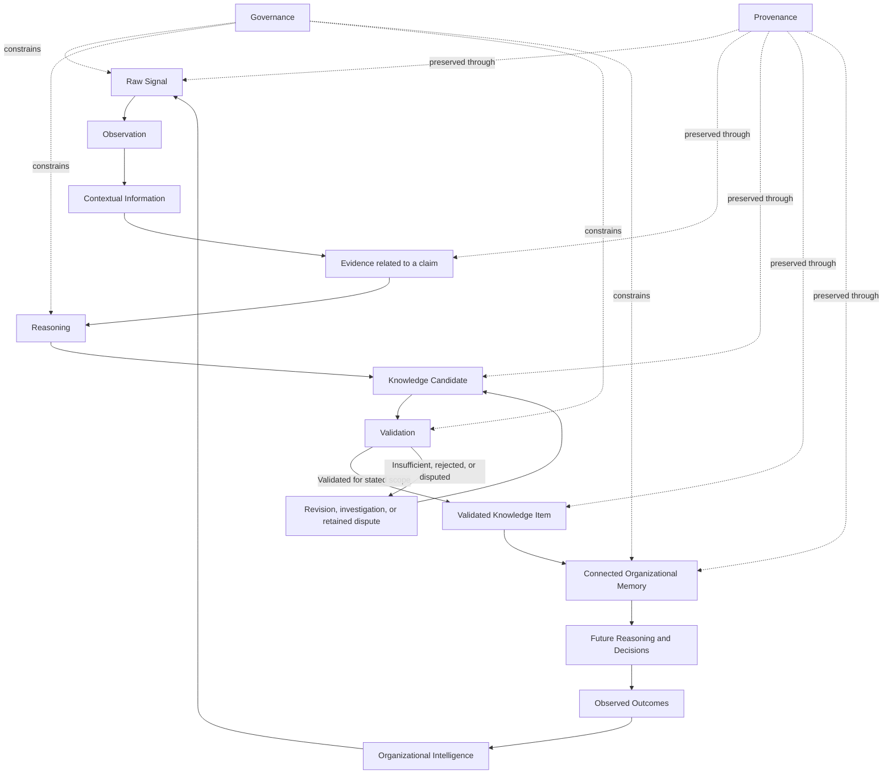
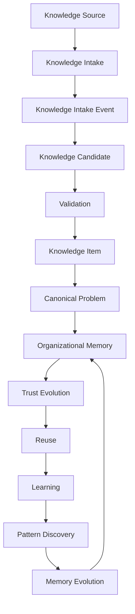
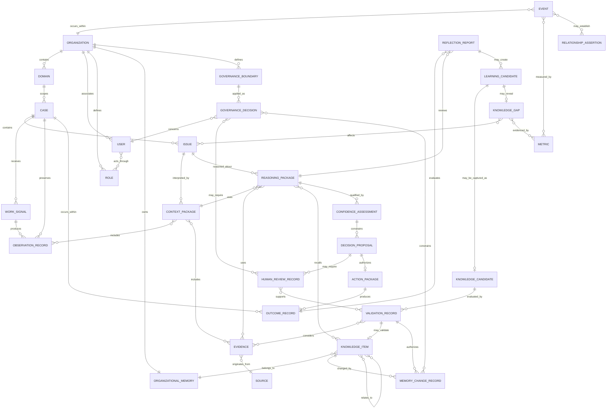
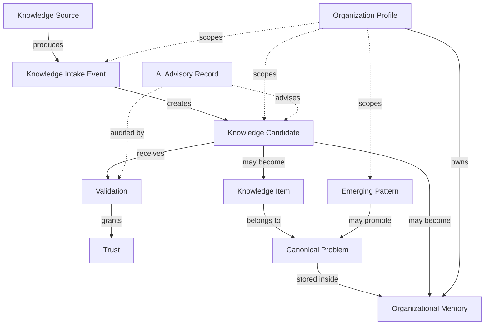
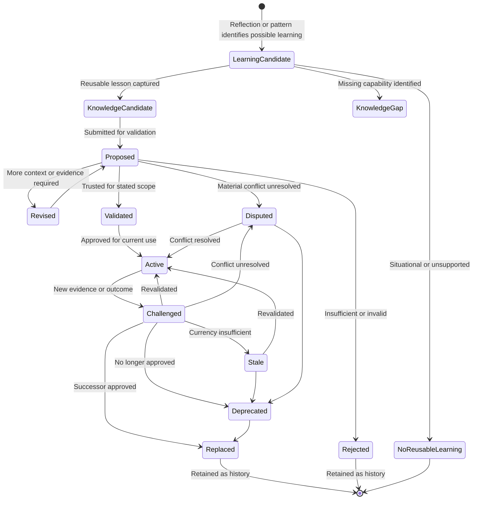
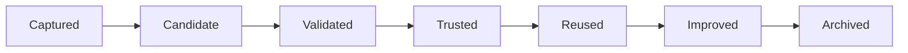
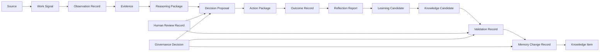
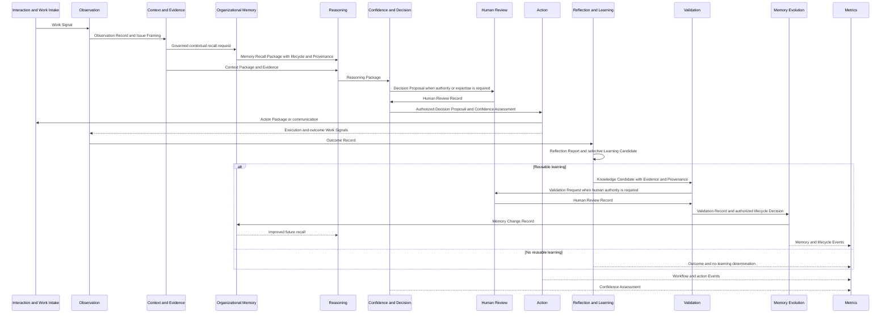
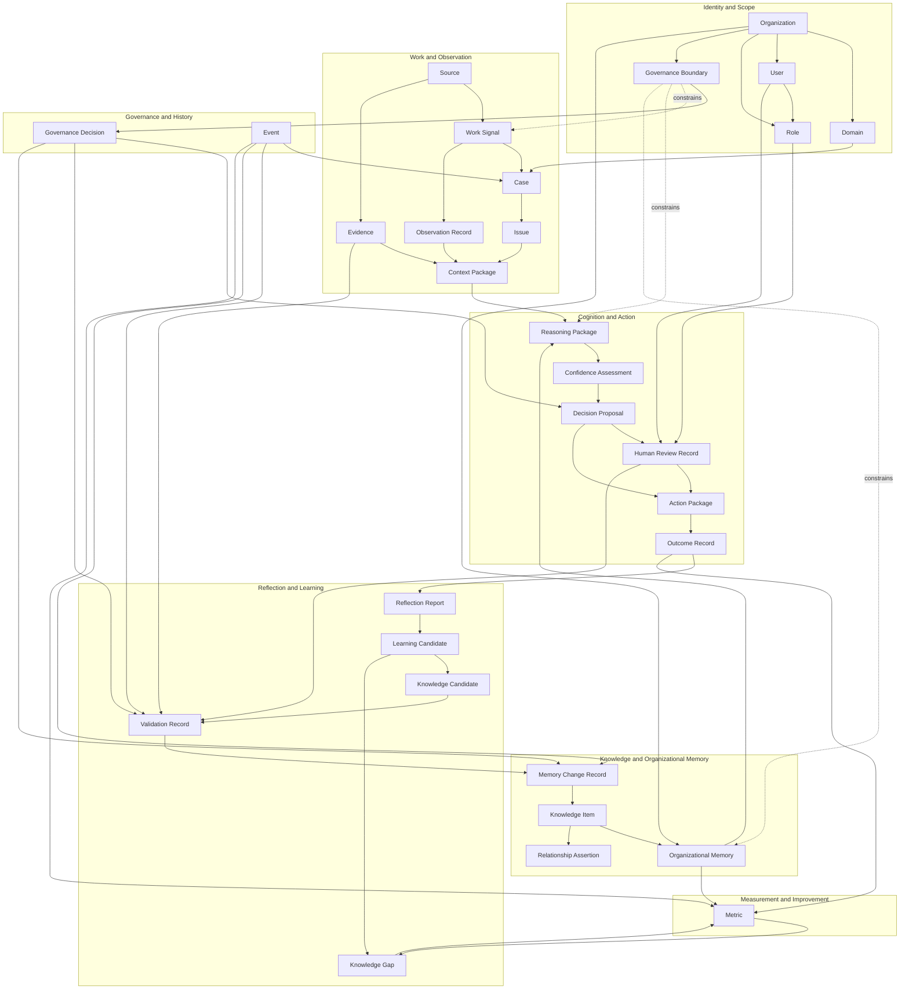
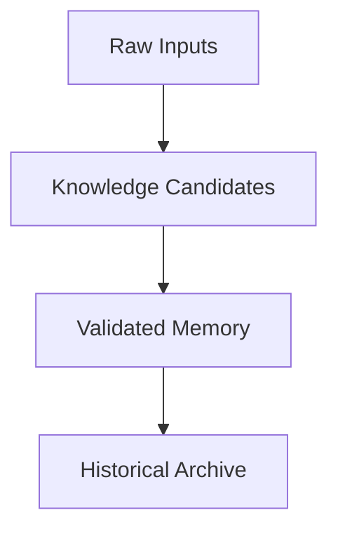

# Data Architecture

## 1. Introduction

The Data Architecture defines the logical information model of the Organizational Intelligence Platform. It specifies the information objects the platform must represent, the relationships that give them meaning, their lifecycle and ownership, and the integrity rules that preserve organizational truth.

Data is not merely stored. It represents what an Organization observed, understood, considered, decided, learned, validated, and remembers. Losing Context, Provenance, authority, lifecycle, or relationships can preserve the words while destroying their organizational meaning.

The platform distinguishes four levels:

```text
Data

↓

Information

↓

Knowledge

↓

Organizational Memory
```

- **Data** is a recorded signal, value, statement, event, or artifact before its significance is established.
- **Information** is data interpreted within enough Context to answer what it describes, where it came from, and why it may matter.
- **Knowledge** is information understood, supported, and trusted enough to guide action within stated conditions.
- **Organizational Memory** is connected knowledge preserved across people, systems, and time with Context, trust, Provenance, lifecycle, and Governance intact.

Each level builds on the previous one without erasing it. Organizational Memory remains traceable to Knowledge Items, Validation, Evidence, Sources, work, and human judgment. The architecture must preserve that chain so future Reasoning can understand not only *what* the Organization believes, but *why*, *where it applies*, *who authorized it*, and *how it changed*.

This is a logical architecture. It defines meaning and integrity, not physical persistence or transmission.

---

## 2. Relationship to Previous Documents

### Canon Traceability

Derived From:

- [Founder's Thesis](../canon/00_FOUNDERS_THESIS.md)
- [Product Vision](../canon/01_PRODUCT_VISION.md)
- [Product Principles](../canon/02_PRODUCT_PRINCIPLES.md)
- [Product Capability Model](../canon/03_PRODUCT_CAPABILITY_MODEL.md)
- [Product Domain Model](../canon/04_PRODUCT_DOMAIN_MODEL.md)
- [Product Workflow Model](../canon/05_PRODUCT_WORKFLOW_MODEL.md)
- [AI Cognitive Model](../canon/06_AI_COGNITIVE_MODEL.md)
- [System Architecture](./07_SYSTEM_ARCHITECTURE.md)
- [AI Agent Architecture](./08_AI_AGENT_ARCHITECTURE.md)

Canon Version: `v1.0.0`

| Document | Contribution |
| --- | --- |
| Canon | Meaning |
| System Architecture | Responsibility |
| AI Agent Architecture | Cognitive ownership |
| Data Architecture | Information representation |

The Canon defines the authoritative concepts and distinctions. System Architecture identifies the responsibilities that create, use, govern, validate, preserve, and measure information. AI Agent Architecture identifies the logical cognitive owners of artifacts. Data Architecture ensures that every Canon concept, cognitive artifact, workflow transition, Governance Decision, and Learning Event has a coherent representation.

The information model implements those documents; it does not rename or reinterpret them. A Case remains distinct from an Issue. A Source remains distinct from Evidence. Confidence remains distinct from Validation. An Answer remains distinct from Knowledge. Storage remains distinct from Organizational Memory.

---

## 3. Data Architecture Philosophy

### Information Is Explicit

Material meaning should not depend on hidden convention. Claims, assumptions, lifecycle state, authority, applicability, Uncertainty, and relationships should be represented explicitly enough to inspect and govern.

### Provenance Is Preserved

Every consequential object should retain where it came from, who or what created it, what it was based on, how it changed, and which authority approved it. Provenance is part of meaning, not optional metadata.

### Every Meaningful State Is Traceable

The platform should be able to reconstruct the conceptual progression from Work Signal to Observation, Reasoning, Decision, Action, outcome, reflection, learning, Validation, and memory change. Current state should not erase how that state was reached.

### Knowledge Evolves

Knowledge is not permanent text. It can be drafted, proposed, validated, activated, challenged, disputed, become stale, be deprecated, or be replaced. The information model must preserve both current standing and prior history.

### Memory Is Not Storage

Storage answers whether information persists. Organizational Memory requires connected, contextual, permission-aware, trusted, historically intelligible knowledge that can support future Reasoning.

### Validation Determines Trust

Capture, repetition, retrieval, Confidence, or authorship alone does not make a claim trusted knowledge. Validation Records and their authority define why a Knowledge Candidate may become or change a Knowledge Item.

### Relationships Are First-Class

Meaning often resides between objects: Evidence supports a claim; a Source originates Evidence; a Correction challenges Reasoning; a Knowledge Item replaces another; a Metric measures an outcome. Relationships require identity, type, Context, Provenance, and sometimes lifecycle of their own.

### Data Supports Reasoning

Information should preserve the distinctions Reasoning needs: fact versus report, current versus historical, support versus contradiction, general rule versus exception, validated scope versus current applicability, and confidence versus authority.

### Organizational Learning Persists

Learning is more than a transient improvement in one response. Meaningful Corrections, Reflection Reports, Learning Candidates, Validation Decisions, Knowledge Gaps, and Memory Changes should remain traceable so the Organization can understand how capability improved.

### Ownership and Stewardship Are Distinct

The Organization owns its Organizational Memory. Agents and subsystems are stewards or authoritative producers of particular information objects. Stewardship grants bounded responsibility to create or change an object; it does not transfer organizational ownership or bypass Governance.

### History Is Additive

Corrections and changes add a new authoritative understanding while preserving what was previously observed, proposed, decided, or trusted. Current views may supersede prior views, but historical facts should not be rewritten into a cleaner story.

---

## 4. Information Hierarchy

The information hierarchy describes increasing interpretation, trust, connectedness, and organizational usefulness. It is not a claim that every object follows one linear path or that Evidence is inherently “higher” than Information.



### Raw Signal → Observation

A Work Signal is preserved as received. Observation identifies what can be stated about it without yet deciding what it means. Source and time remain intact.

### Observation → Information

Context connects the observation to an Organization, Domain, Case, Issue, participants, state, policy period, and purpose. The signal becomes interpretable without becoming true merely through interpretation.

### Information → Evidence

Information becomes Evidence when related to a claim, Diagnosis, Decision, or Knowledge Candidate as support, contradiction, qualification, or explanation. Evidence retains its Source and Context.

### Evidence → Reasoning

Reasoning combines Evidence with Context, Organizational Memory, applicability, exceptions, Governance, and Uncertainty. It produces inspectable cognitive artifacts rather than immediate truth.

### Reasoning → Knowledge Candidate

When reflection identifies a reusable lesson, the relevant Reasoning, outcome, human judgment, Evidence, limits, and applicability are captured as a proposal.

### Knowledge Candidate → Validated Knowledge

Validation determines whether the proposal earns trust for a stated scope. Rejection, dispute, or revision remains part of history and may produce further investigation.

### Validated Knowledge → Organizational Memory

A Knowledge Item becomes part of a connected body of organizational understanding. Relationships, lifecycle, ownership, history, and Governance allow future Reasoning to use it responsibly.

### Organizational Memory → Organizational Intelligence

Memory supports better future Reasoning. Outcomes, Corrections, gap closure, consistency, and reduced repeated work show whether the Organization became more capable. Organizational Intelligence is an outcome of the whole learning system, not a single information object.

### Knowledge Intake to Organizational Memory

The hierarchy above describes how a single signal matures into trusted knowledge. The platform also represents a complementary intake-oriented flow that follows organizational knowledge from the moment it enters the platform through a governed intake door until it becomes refined Organizational Memory.



This flow distinguishes raw organizational inputs, Knowledge Candidates, validated knowledge, Organizational Memory, and organizational learning as separate maturity stages rather than a single store.

Data becomes progressively more trusted as it moves through this flow. A Knowledge Source carries no organizational trust on arrival. A Knowledge Intake Event records only that capture occurred. A Knowledge Candidate is a proposal, not truth. Validation moves a candidate toward a Knowledge Item, and only validated Knowledge Items and the Canonical Problems that organize them belong to Organizational Memory. Trust then continues to evolve through Reuse, Learning, Pattern Discovery, and authorized Memory Evolution. Ingestion increases volume; only Validation and use increase trust.

---

## 5. Core Information Objects

Attributes below are conceptual characteristics, not fields. Lifecycle describes meaningful state changes, not a prescribed workflow implementation.

### Organization

| Aspect | Definition |
| --- | --- |
| **Purpose** | Identify the organizational owner of memory, Governance, Users, Roles, Domains, and trust boundaries. |
| **Attributes** | Identity, name, purpose, active Domains, Governance posture, ownership and accountability Context. |
| **Relationships** | Contains Domains; associates Users and Roles; owns Organizational Memory; defines Governance Boundaries. |
| **Lifecycle** | Established, active, changed, reorganized, or retired while historical ownership remains traceable. |
| **Ownership** | The Organization is self-owning through its accountable human authority. Platform agents are custodians only. |
| **Integrity Rules** | Every Case, Knowledge Item, Governance Decision, and memory change resolves to exactly one owning Organization; cross-Organization use requires an explicit governed relationship. |

### User

| Aspect | Definition |
| --- | --- |
| **Purpose** | Represent a human actor who contributes to, reviews, governs, consumes, or benefits from organizational knowledge. |
| **Attributes** | Identity, internal or external relationship, Organization association, active Roles, Domain Context, status. |
| **Relationships** | Participates in Cases and Human Reviews; acts through Roles; creates or receives artifacts; may author Sources and Decisions. |
| **Lifecycle** | Invited or recognized, active, Role changed, inactive, or historical participant. |
| **Ownership** | Identity is governed by the Organization or relationship owner; the User remains author of their contributions. |
| **Integrity Rules** | User identity does not imply authority; every consequential action references the Role and Context under which the User acted. |

### Role

| Aspect | Definition |
| --- | --- |
| **Purpose** | Represent bounded authority and expected responsibility in the platform. |
| **Attributes** | Name, Organization, Domain scope, permitted actions, Validation authority, review authority, sensitivity access, effective period. |
| **Relationships** | Assigned to Users; evaluated by Governance; referenced by Human Review, Validation Record, and Decision Proposal. |
| **Lifecycle** | Proposed, active, changed, suspended, or retired with historical assignments preserved. |
| **Ownership** | Defined and governed by the Organization. |
| **Integrity Rules** | Role is not job title; authority is effective only within its Domain, purpose, time, and Governance scope. |

### Domain

| Aspect | Definition |
| --- | --- |
| **Purpose** | Identify a bounded area of organizational knowledge and work with its own vocabulary, authority, risk, Evidence, and Validation standards. |
| **Attributes** | Identity, Organization, vocabulary, risk profile, Evidence standards, applicable Roles, Governance rules. |
| **Relationships** | Contains Cases, Knowledge Items, gaps, metrics, and Domain-specific extensions; may relate to other Domains through governed mappings. |
| **Lifecycle** | Defined, active, extended, combined, divided, or retired without erasing historical Context. |
| **Ownership** | Owned by the Organization and stewarded by authorized Domain leaders. |
| **Integrity Rules** | Domain-specific concepts may extend but not redefine Canon concepts; cross-Domain transfer preserves Source Domain and requires target applicability and Governance checks. |

### Governance Boundary

| Aspect | Definition |
| --- | --- |
| **Purpose** | Represent the rule-defined boundary on access, use, disclosure, change, Validation, learning, measurement, or action. |
| **Attributes** | Organization, Domain, purpose, affected Roles and information, permitted or prohibited actions, risk, approval requirement, effective period, rationale. |
| **Relationships** | Evaluated to produce Governance Decisions; constrains every information object and transition; references policy Sources and authority. |
| **Lifecycle** | Proposed, approved, active, amended, superseded, or retired with effective history. |
| **Ownership** | Owned by the Organization; stewarded by authorized Governance roles. |
| **Integrity Rules** | A boundary is not inferred from absence; changes require authority and Provenance; historical decisions use the boundary effective at that time. |

### Case

| Aspect | Definition |
| --- | --- |
| **Purpose** | Represent a bounded unit of organizational work around one or more problems, questions, requests, incidents, or Decision needs. |
| **Attributes** | Identity, Organization, Domain, participants, current state, priority, risk, opened and resolved times, outcome, learning potential. |
| **Relationships** | Receives Work Signals; contains Issues, Observations, Context, Evidence, Reasoning, Decisions, Actions, outcomes, reflections, and learning. |
| **Lifecycle** | Created, active, waiting, escalated, resolved, reopened, or closed; individual Issues may have different states. |
| **Ownership** | Owned by the Organization; stewarded by workflow orchestration and accountable Users. |
| **Integrity Rules** | Case is not Issue; closing a Case does not imply every Issue is resolved or learning occurred; history and participants remain traceable. |

### Work Signal

| Aspect | Definition |
| --- | --- |
| **Purpose** | Preserve an original event or artifact that may reveal a knowledge need, use, gap, change, or learning opportunity. |
| **Attributes** | Identity, Source, observed time, received time, original content or reference, Organization, Domain if known, sensitivity, signal type. |
| **Relationships** | May create or update a Case; produces Observation Records; may reveal Knowledge Gaps or trigger Knowledge Lifecycle review. |
| **Lifecycle** | Received, governed, associated, observed, or rejected from use; the original remains historically stable. |
| **Ownership** | Owned by the Organization or originating party according to Governance; stewarded by Work Intake and Observation. |
| **Integrity Rules** | Original meaning and Source cannot be silently altered; normalization creates a derived Observation rather than replacing the signal. |

### Observation Record

| Aspect | Definition |
| --- | --- |
| **Purpose** | Represent what was observed from one or more Work Signals without prematurely interpreting it. |
| **Attributes** | Identity, observable statement, Source references, time, Organization, Domain, completeness, observer, Governance scope, direct-versus-reported status. |
| **Relationships** | Derived from Work Signals; associated with Case and Issue; included in Context; may become Evidence for a claim. |
| **Lifecycle** | Recorded, corrected through a linked superseding observation, contextualized, or historically retained. |
| **Ownership** | Authoritatively produced by the Observation Agent; organizationally owned by the Case's Organization. |
| **Integrity Rules** | Must distinguish direct observation, report, and annotation; correction does not erase the original; cannot contain an unmarked Diagnosis. |

### Issue

| Aspect | Definition |
| --- | --- |
| **Purpose** | Represent the underlying problem, question, Uncertainty, or need being addressed within a Case. |
| **Attributes** | Identity, description, Domain, state, consequence, risk, ambiguity, related issue type, resolution criteria. |
| **Relationships** | Belongs to a Case; interpreted through Context and Evidence; may have Diagnosis, Decision, Resolution, Knowledge Gap, and related Knowledge Items. |
| **Lifecycle** | Identified, clarified, active, waiting, resolved, reopened, or determined not to be an Issue. |
| **Ownership** | Owned by the Organization; framed by Understanding and stewarded through Case workflow. |
| **Integrity Rules** | Multiple Issues may exist in one Case; Issue state cannot be inferred solely from Case state; changes preserve prior framing and rationale. |

### Context Package

| Aspect | Definition |
| --- | --- |
| **Purpose** | Assemble the conditions required to interpret an Issue and prepare responsible Reasoning. |
| **Attributes** | Identity, Case and Issue scope, participants, history, time, geography, policy version, state, risk, prior attempts, missing Context, Governance scope. |
| **Relationships** | Includes Observation Records, Evidence references, Source links, relevant Domain conditions, and recall request; used by Reasoning and Human Review. |
| **Lifecycle** | Assembled, revised, completed for a purpose, challenged, or superseded as new Context appears. |
| **Ownership** | Authoritatively produced by Context Builder; owned within the Case by the Organization. |
| **Integrity Rules** | Must declare missing information and effective time; cannot silently infer absent facts; each included Evidence retains Source and Governance. |

### Evidence

| Aspect | Definition |
| --- | --- |
| **Purpose** | Represent how information supports, challenges, qualifies, or explains a claim, Diagnosis, Decision, or Knowledge Item. |
| **Attributes** | Identity, referenced information, relationship to claim, support type, strength, relevance, freshness, authority, Context, limitations. |
| **Relationships** | Originates from Source; used by Reasoning, Validation, and Reflection; may conflict with other Evidence; supports or challenges explicit claims. |
| **Lifecycle** | Proposed, accepted for consideration, challenged, superseded, or retained as historical Evidence; relevance may change with Context. |
| **Ownership** | Organizationally owned with the Case or knowledge process; stewarded by Evidence responsibility and reviewed by authorized Humans. |
| **Integrity Rules** | Cannot exist without Source; must identify the claim and nature of support; Source authority does not automatically establish sufficiency. |

### Source

| Aspect | Definition |
| --- | --- |
| **Purpose** | Identify the origin of information used by the platform or a human. |
| **Attributes** | Identity, origin type, author or originating system, Organization, Domain, created time, effective period, authority, sensitivity, current location or reference. |
| **Relationships** | Originates Work Signals and Evidence; cited by Reasoning, Knowledge Candidates, Validation Records, and Provenance chains. |
| **Lifecycle** | Available, changed, superseded, unavailable, or historically preserved; source versions remain distinguishable. |
| **Ownership** | Owned by its originating authority; use is governed by the consuming Organization. |
| **Integrity Rules** | Source identity and version cannot be fabricated; Source is not Evidence until related to a claim; unavailable Sources do not lose historical identity. |

### Organizational Memory

| Aspect | Definition |
| --- | --- |
| **Purpose** | Represent the connected body of contextual, governed knowledge preserved across people, systems, Domains, and time. |
| **Attributes** | Owning Organization, Domains, current trusted knowledge view, Canonical Problem structure, historical knowledge, relationship network, reuse history, learning history, Governance scope, memory health. |
| **Relationships** | Contains Knowledge Items, Canonical Problems, Validation and Memory Change history, Sources, related Cases, Corrections, reuse history, learning history, lifecycle states, and relationships; owned by an Organization Profile; supports future Reasoning. |
| **Lifecycle** | Continuously evolves through authorized additive changes; may gain, challenge, deprecate, replace, or reconnect knowledge. |
| **Ownership** | Owned by the Organization. Memory Evolution is the authorized steward of validated changes, not the owner. |
| **Integrity Rules** | No direct cognitive write; every trust-affecting change requires Governance, Validation, Provenance, and preserved history; current and historical views remain distinct. |

### Knowledge Item

| Aspect | Definition |
| --- | --- |
| **Purpose** | Represent reusable organizational knowledge that earned a defined level of trust and can guide work under stated conditions. |
| **Attributes** | Identity, claim or lesson, Domain, applicability, limits, exceptions, Evidence, Sources, owner, Validation state, lifecycle state, effective period, trust basis. |
| **Relationships** | Belongs to Organizational Memory; derived from Knowledge Candidate; supported by Validation Records; related to Cases and other Knowledge Items; may replace or challenge another item. |
| **Lifecycle** | Validated, active, challenged, disputed, stale, deprecated, or replaced; prior states remain historical. |
| **Ownership** | Owned by the Organization; stewarded by knowledge owners and Memory Evolution under Governance. |
| **Integrity Rules** | Cannot become active without valid Validation; applicability and limits are mandatory; changing trust or lifecycle requires a new Validation or authorized lifecycle basis. |

### Knowledge Candidate

| Aspect | Definition |
| --- | --- |
| **Purpose** | Represent a proposed reusable lesson that has not yet earned organizational trust. |
| **Attributes** | Identity, proposed claim, problem, Diagnosis, Reasoning, outcome, Domain, applicability, limits, Evidence, Sources, human judgment, proposer, Uncertainty, intake origin, validation state, AI Advisory suggestions, confidence indication, review history. |
| **Relationships** | Derived from Learning Candidate, Case, Correction, policy change, or pattern; references affected Knowledge Items; evaluated through Validation Records. |
| **Lifecycle** | Draft, proposed, under review, revised, validated, rejected, disputed, withdrawn, or retained historically. |
| **Ownership** | Organizationally owned; authoritatively produced by Knowledge Capture and stewarded by a designated knowledge owner. |
| **Integrity Rules** | Candidate must remain distinguishable from Knowledge Item; cannot be used as active truth unless Governance explicitly allows provisional use and its status remains visible. |

### Reasoning Package

| Aspect | Definition |
| --- | --- |
| **Purpose** | Represent inspectable Reasoning for a specific Issue and Context. |
| **Attributes** | Identity, Issue, Context Package, Diagnosis, alternatives, recommendation, assumptions, supporting and conflicting Evidence, recalled knowledge, exceptions, Uncertainty, created time. |
| **Relationships** | Uses Context, Evidence, and Knowledge Items; qualified by Confidence Assessment; informs Decision Proposal and Reflection Report. |
| **Lifecycle** | Drafted, completed for assessment, challenged, corrected, superseded, or retained as historical cognition. |
| **Ownership** | Authoritatively produced by Reasoning Agent; owned by the Organization within the Case. |
| **Integrity Rules** | Must cite Evidence and recalled memory; inference is labeled; cannot change memory; later Correction links rather than overwrites original Reasoning. |

### Confidence Assessment

| Aspect | Definition |
| --- | --- |
| **Purpose** | Represent how strongly a Reasoning Package may guide behavior in a specific Context. |
| **Attributes** | Identity, Reasoning reference, Evidence quality, freshness, applicability, conflict, missing Context, authority, consequence, Uncertainty types, recommended behavior, assessment time. |
| **Relationships** | Qualifies Reasoning and Decision Proposal; informed by Governance and memory state; observed by Metrics and Reflection. |
| **Lifecycle** | Assessed, revised after new Evidence, superseded, or evaluated against outcome. |
| **Ownership** | Authoritatively produced by Confidence Agent; organizationally owned within the Case. |
| **Integrity Rules** | Cannot exist without Reasoning and Context; must preserve multidimensional basis; cannot grant authority or Validation; change creates history rather than silent replacement. |

### Decision Proposal

| Aspect | Definition |
| --- | --- |
| **Purpose** | Represent the proposed next responsible behavior: answer, draft, ask, investigate, escalate, review, pause, or refuse. |
| **Attributes** | Identity, proposed behavior, Reasoning reference, Confidence reference, rationale, required authority, Governance Decision, limits, expected outcome, status. |
| **Relationships** | Derived from Reasoning and Confidence; may require Human Review; if authorized, produces Action Package; may be rejected or superseded. |
| **Lifecycle** | Proposed, under review, authorized, rejected, withdrawn, superseded, or executed. |
| **Ownership** | Authoritatively produced by Decision Agent; final organizational authority belongs to the permitted Role or governed automation policy. |
| **Integrity Rules** | Must not add Reasoning absent from its package; execution requires applicable Governance and authority; proposal is not proof that an action occurred. |

### Action Package

| Aspect | Definition |
| --- | --- |
| **Purpose** | Represent the faithful execution of an authorized Decision Proposal. |
| **Attributes** | Identity, Decision reference, action type, communication or operation, recipients, actor, authorization, material limits, executed time, status, execution result. |
| **Relationships** | Executes Decision Proposal; may contain an Answer; produces Events and Outcome Record; presented through Interaction; reviewed in Reflection. |
| **Lifecycle** | Prepared, authorized, executed, failed, cancelled, corrected, or superseded. |
| **Ownership** | Authoritatively produced by Action Agent or authorized Human; owned by the Organization within the Case. |
| **Integrity Rules** | Must preserve Decision meaning and limits; cannot introduce unsupported claims; execution status is distinct from successful outcome. |

### Outcome Record

| Aspect | Definition |
| --- | --- |
| **Purpose** | Represent what occurred after an action or Decision, including downstream effect and response. |
| **Attributes** | Identity, Case and Issue, action reference, observed result, observer, time, success criteria, response, contradiction, follow-up, limitations. |
| **Relationships** | Derived from Observations after Action; used by Reflection, Metrics, Validation, and gap detection; may reopen Case or challenge knowledge. |
| **Lifecycle** | Observed, supplemented, corrected by linked record, interpreted, or superseded as later effects appear. |
| **Ownership** | Organizationally owned; authoritatively recorded by Observation responsibility and accountable Humans. |
| **Integrity Rules** | Output delivery is not success; absent complaint is not proof; observed result remains distinct from interpretation; later effects link to earlier outcome. |

### Reflection Report

| Aspect | Definition |
| --- | --- |
| **Purpose** | Represent evaluation of completed cognition against observed outcomes. |
| **Attributes** | Identity, Case, Reasoning, Confidence, Decision, Action, Outcome, Governance review, confirmed and challenged assumptions, possible lesson, limitations. |
| **Relationships** | References the complete cognitive chain; produces Learning Candidate or no-learning determination; informs Metrics and Human Review. |
| **Lifecycle** | Drafted, reviewed, finalized, challenged, or supplemented by later outcome. |
| **Ownership** | Authoritatively produced by Reflection Agent; organizationally owned within learning history. |
| **Integrity Rules** | Must reference Outcome; cannot change memory; hindsight is distinguished from information available at Decision time. |

### Learning Candidate

| Aspect | Definition |
| --- | --- |
| **Purpose** | Represent a possible reusable improvement identified through reflection, repeated work, Correction, or change. |
| **Attributes** | Identity, proposed lesson or gap, Reflection references, supporting pattern, Domain, durability rationale, applicability hypothesis, Uncertainty, next recommended learning action. |
| **Relationships** | Derived from Reflection Reports, Corrections, patterns, or Knowledge Gaps; may become Knowledge Candidate, challenge, investigation, or no-learning conclusion. |
| **Lifecycle** | Identified, investigated, accepted for capture, rejected as nonreusable, monitored, or superseded. |
| **Ownership** | Authoritatively produced by Learning Agent; stewarded by Humans or knowledge owners. |
| **Integrity Rules** | Cannot change memory or claim Validation; not every interaction creates one; repeated behavior is not sufficient proof of correctness. |

### Human Review Record

| Aspect | Definition |
| --- | --- |
| **Purpose** | Represent accountable human judgment applied to work, cognition, Governance, or knowledge. |
| **Attributes** | Identity, reviewer, Role, Domain, reviewed object, judgment, rationale, Evidence considered, authority, conditions, time, disagreement. |
| **Relationships** | May approve, reject, correct, clarify, dispute, escalate, or validate Decision Proposal, Reasoning, Knowledge Candidate, or lifecycle change. |
| **Lifecycle** | Requested, assigned, completed, superseded by authorized later review, appealed, or retained historically. |
| **Ownership** | Authored by the reviewing User; governed and owned by the Organization. |
| **Integrity Rules** | Reviewer Role and Context are mandatory; review cannot be anonymous; original reviewed artifact remains; approval scope cannot exceed reviewer authority. |

### Validation Record

| Aspect | Definition |
| --- | --- |
| **Purpose** | Represent the history and basis through which knowledge earns, retains, loses, or changes trust. |
| **Attributes** | Identity, candidate or item, result, validated scope, criteria, Evidence, Human Reviews, Domain, risk, Governance Decision, authority, rationale, time. |
| **Relationships** | Evaluates Knowledge Candidate or Knowledge Item; authorizes or denies lifecycle transition; references Sources, Evidence, reviews, and prior Validation Records. |
| **Lifecycle** | Requested, in review, completed, superseded by later Validation, or reopened due to challenge. |
| **Ownership** | Authoritatively produced by Validation Agent with applicable human authority; organizationally owned. |
| **Integrity Rules** | Never overwrites prior Validation; result cannot exceed Evidence or authority; proposer and validator separation follows Governance; scope is explicit. |

### Memory Change Record

| Aspect | Definition |
| --- | --- |
| **Purpose** | Represent an authorized change to Organizational Memory and its before-and-after meaning. |
| **Attributes** | Identity, affected Knowledge Items and relationships, prior state, new state, change type, effective Context, Validation Record, Governance Decision, actor, time, rationale. |
| **Relationships** | Applies Validation and lifecycle Decisions to Organizational Memory; emits Events; informs Retrieval, Confidence, Metrics, and affected workflows. |
| **Lifecycle** | Authorized, applied, verified, corrected by a later change, or retained historically. |
| **Ownership** | Authoritatively produced by Memory Evolution Agent; the Organization owns the changed memory. |
| **Integrity Rules** | Requires valid authorization; cannot erase prior state; partial changes cannot leave memory logically inconsistent; replacement relationships are explicit. |

### Knowledge Gap

| Aspect | Definition |
| --- | --- |
| **Purpose** | Represent an area where Organizational Memory is missing, weak, stale, conflicting, inaccessible, or repeatedly insufficient. |
| **Attributes** | Identity, Organization, Domain, affected Issues, gap type, Evidence, frequency, consequence, expert dependency, workaround, owner, priority, closure criteria. |
| **Relationships** | Detected from Work Signals, Confidence, escalations, failures, Corrections, Metrics, and memory health; may generate investigation and Learning Candidate. |
| **Lifecycle** | Detected, confirmed, prioritized, assigned, investigating, addressed, closure under observation, closed, or reopened. |
| **Ownership** | Owned by the Organization; authoritatively detected and assessed by Gap Detection with human stewardship. |
| **Integrity Rules** | Must have Evidence and closure criteria; content creation alone does not close it; duplicates should be related or consolidated without losing history. |

### Governance Decision

| Aspect | Definition |
| --- | --- |
| **Purpose** | Represent the contextual application of Governance Boundaries to a requested information use or action. |
| **Attributes** | Identity, request, Organization, User, Role, Domain, purpose, affected objects, decision, governing boundary, risk, required review, limits, rationale, effective time. |
| **Relationships** | Constrains Observation, Retrieval, Reasoning, Decision, Action, Human Review, Capture, Validation, Memory Change, and Metrics. |
| **Lifecycle** | Requested, decided, expired, superseded, exceptionally overridden by authorized review, or retained for audit. |
| **Ownership** | Authoritatively produced by Governance responsibility under organizational policy. |
| **Integrity Rules** | Confidence cannot substitute for permission; Decision is purpose- and Context-specific; exceptions require authority and Provenance; later policy does not rewrite historical basis. |

### Metric

| Aspect | Definition |
| --- | --- |
| **Purpose** | Represent a measured aspect of organizational capability, knowledge health, workflow, cognition, outcome, or system health. |
| **Attributes** | Identity, definition, scope, Domain, period or observation time, value, unit, population, Evidence basis, exclusions, uncertainty, interpretation limits, owner. |
| **Relationships** | Derived from Events and object state; may support Reflection and Gap Detection; relates work, memory change, and outcome where possible. |
| **Lifecycle** | Defined, observed, revised by corrected source data, superseded by improved definition, or retired with history. |
| **Ownership** | Authoritatively produced by Metrics Agent under organizational measurement governance. |
| **Integrity Rules** | Metric definition and scope are inseparable from value; cannot validate truth or prove causality alone; restricted data remains governed in aggregation. |

### Event

| Aspect | Definition |
| --- | --- |
| **Purpose** | Represent that a meaningful state transition or organizational fact occurred. |
| **Attributes** | Identity, event type, subject, prior and resulting state where applicable, actor, authority, time, Organization, Domain, Context, cause, Provenance, Governance scope. |
| **Relationships** | Refers to one or more changed objects; may cause workflow reaction, learning assessment, measurement, notification, or audit review. |
| **Lifecycle** | Recorded and immutable as a historical assertion; a correction or reversal is represented by a new related Event. |
| **Ownership** | Authoritatively produced by the responsibility that owns the completed transition; organizationally owned. |
| **Integrity Rules** | Event records completed facts, not requests; identity is unique; historical content is not mutated; actor, time, subject, and Provenance are required. |

### Relationship Assertion

| Aspect | Definition |
| --- | --- |
| **Purpose** | Represent a meaningful, typed connection between information objects as a first-class assertion. |
| **Attributes** | Identity, relationship type, source object, target object, direction, Context, applicability, Evidence, creator, authority, lifecycle, time, Provenance. |
| **Relationships** | Connects any permitted objects, including support, contradiction, derivation, replacement, similarity, applicability, containment, and authorship. |
| **Lifecycle** | Proposed, active, challenged, superseded, removed from current use, or retained historically. |
| **Ownership** | Owned by the Organization; stewarded by the responsibility authorized for the relationship type. |
| **Integrity Rules** | Endpoints must exist and be governed; relationship meaning is explicit; similarity never implies equivalence; removal from current use does not erase history. |

### Organizational Knowledge and Intake Objects

The following objects represent how organizational knowledge is captured, scoped, organized, observed, and advised across its full lifecycle. They extend the core model without redefining it: a Knowledge Intake Event remains distinct from a Work Signal, a Canonical Problem remains distinct from a Case, and an AI Advisory Record remains distinct from a Knowledge Item.

#### Knowledge Intake Event

| Aspect | Definition |
| --- | --- |
| **Purpose** | Represent one governed occurrence of organizational knowledge entering the platform through a specific intake door. |
| **Attributes** | Identity, Knowledge Source, intake door, Organization, contributor, observed and received time, Provenance, raw content or reference, sensitivity, intake type. |
| **Relationships** | Produced by a Knowledge Source; preserves one or more Work Signals or raw artifacts; may create one or more Knowledge Candidates; scoped by an Organization Profile. |
| **Lifecycle** | Received, governed, associated, accepted for candidacy, or rejected from use; the recorded intake occurrence remains historically stable. |
| **Ownership** | Owned by the receiving Organization under Governance; authoritatively recorded by Knowledge Intake. |
| **Integrity Rules** | Represents capture, not Validation; original raw content and Source are not silently altered; an intake occurrence never becomes trusted knowledge by the act of intake alone. |

A Knowledge Intake Event records that knowledge was captured. It does not assert that the captured content is correct, reusable, or trusted.

#### Knowledge Candidate

The Knowledge Candidate object defined above is the proposal that intake produces. In the intake model it additionally carries its intake origin, AI Advisory suggestions, a confidence indication, a validation state, and review history. A Knowledge Candidate is temporary until validated: it remains a proposal, distinguishable from a Knowledge Item, until a Validation Record grants it trust.

#### Canonical Problem

| Aspect | Definition |
| --- | --- |
| **Purpose** | Represent a recurring organizational problem as a durable concept that organizes related knowledge, rather than an individual ticket or Case. |
| **Attributes** | Identity, title, summary, category, trust standing, versions, example tickets or Cases, reusable guidance, customer-facing template, applicability, lifecycle state. |
| **Relationships** | Groups related Knowledge Items and example Cases; belongs to Organizational Memory; scoped by an Organization Profile; may be promoted from an Emerging Pattern; related to other Canonical Problems. |
| **Lifecycle** | Proposed, active, refined through new versions, challenged, deprecated, or replaced; prior versions remain historical. |
| **Ownership** | Owned by the Organization; stewarded by knowledge owners and Memory Evolution under Governance. |
| **Integrity Rules** | A Canonical Problem is an organizational concept, not a Case; its trust derives from validated Knowledge Items, not from frequency alone; version history and applicability are preserved. |

Canonical Problems are organizational concepts rather than individual tickets. They give Organizational Memory a stable structure that many Cases and Knowledge Items can connect to.

#### Organizational Memory

The Organizational Memory object defined above contains only validated knowledge. In the intake model it explicitly holds Knowledge Items, the Canonical Problems that organize them, trust standing, reuse history, Provenance, and learning history. Captured inputs and unvalidated Knowledge Candidates are not part of Organizational Memory; they enter it only through Validation and an authorized Memory Change.

#### Emerging Pattern

| Aspect | Definition |
| --- | --- |
| **Purpose** | Represent a repeated organizational observation that may indicate an unrecognized Canonical Problem but has not yet earned trust. |
| **Attributes** | Identity, summary, keywords, tags, confidence, times seen, examples, suggested Canonical Problem, status. |
| **Relationships** | Detected from Knowledge Intake Events, Cases, and Knowledge Candidates; scoped by an Organization Profile; may promote to a Canonical Problem; informs Knowledge Gaps and Metrics. |
| **Lifecycle** | Observed, accumulating evidence, candidate for promotion, promoted, merged, dismissed, or retained historically. |
| **Ownership** | Owned by the Organization; authoritatively produced by Pattern Discovery with human stewardship. |
| **Integrity Rules** | An Emerging Pattern is an observation, not trusted knowledge; promotion to a Canonical Problem requires authorized review; frequency is evidence of recurrence, not of correctness. |

Emerging Patterns represent organizational observations rather than trusted knowledge. They surface what may be worth recognizing, not what the Organization already believes.

#### Organization Profile

| Aspect | Definition |
| --- | --- |
| **Purpose** | Represent the durable identity, scope, vocabulary, and trust configuration of an Organization that all of its knowledge objects belong to. |
| **Attributes** | Identity, Organization, industry, products, services, supported Domains, vocabulary, policies, support boundaries, tone, trust configuration, effective period. |
| **Relationships** | Owns Organizational Memory, Canonical Problems, Emerging Patterns, and AI Advisory history; scopes Knowledge Intake Events and Knowledge Candidates; refines Domain vocabulary and Governance Boundaries. |
| **Lifecycle** | Established, active, refined, reorganized, or retired while historical scope remains traceable. |
| **Ownership** | Owned and governed by the Organization. |
| **Integrity Rules** | Every reusable knowledge object resolves to exactly one Organization Profile; profile scope is explicit; trust configuration constrains but never substitutes for Validation. |

Every knowledge object belongs to an Organization Profile. The profile is the tenancy and meaning boundary for all organizational knowledge.

#### AI Advisory Record

| Aspect | Definition |
| --- | --- |
| **Purpose** | Represent an AI-produced suggestion and its human disposition as auditable information that is never itself Organizational Memory. |
| **Attributes** | Identity, provider, prompt or model version, suggestion, confidence, human agreement, accepted or rejected disposition, related object, timestamp, Provenance. |
| **Relationships** | Associated with a Knowledge Candidate, Reasoning Package, Canonical Problem, or response draft; referenced by Human Review and Validation; preserved as Provenance and audit information. |
| **Lifecycle** | Generated, presented, accepted, rejected, or superseded; the record of the suggestion remains historically stable. |
| **Ownership** | Organizationally owned as audit information; authoritatively produced by the AI responsibility under Governance. |
| **Integrity Rules** | An AI Advisory Record is audit information, not trusted knowledge; it never directly creates or changes Organizational Memory, trust, or Metrics; acceptance is a human act recorded explicitly. |

AI Advisory Records are audit information. They preserve what AI suggested and what a human decided. They are not Organizational Memory.

---

## 6. Relationship Model

The relationship model shows how logical objects derive meaning from one another. Cardinalities describe the conceptual norm; Domain extensions may add constrained relationships without changing core meaning.



Key interpretations:

- A Case may contain multiple Issues, and each Issue may have several Context or Reasoning revisions.
- Evidence always originates from a Source and has meaning through its relationship to a claim.
- Reasoning may use many Knowledge Items; recall does not transfer Validation authority to the Reasoning Package.
- A Decision Proposal may never be executed, while one authorized proposal normally produces at most one logical Action Package; corrected or retried actions are separately related.
- Reflection may produce no Learning Candidate. Learning may produce a Knowledge Candidate, Knowledge Gap, challenge, or no memory change.
- A Knowledge Candidate may have many Validation Records over time. A valid result may create or update a Knowledge Item.
- Organizational Memory contains connected Knowledge Items and history; it is not a single document.
- Relationship Assertions may express connections not shown directly, while preserving type, Context, and Provenance.

### Organizational Knowledge and Intake Relationships

The intake and organizational-knowledge objects connect the moment of capture to refined Organizational Memory while preserving the trust path.



Key interpretations:

- A Knowledge Source produces Knowledge Intake Events; one intake occurrence may yield several Knowledge Candidates.
- A Knowledge Candidate receives Validation and the Trust it grants; only a validated Candidate may become a Knowledge Item and part of Organizational Memory.
- A Knowledge Item belongs to a Canonical Problem, and Canonical Problems are stored inside Organizational Memory as its organizing structure.
- An Emerging Pattern may promote to a Canonical Problem through authorized review; promotion does not bypass Validation of the underlying knowledge.
- An Organization Profile owns Organizational Memory and scopes every intake, candidate, pattern, and AI Advisory Record beneath it.
- An AI Advisory Record advises a Knowledge Candidate and is preserved as audit information considered during Validation; it never becomes Organizational Memory.

---

## 7. Information Lifecycle

Lifecycle represents meaningful change while preserving history. State names below are conceptual; not every object must pass through every state.

### Work and Cognition Lifecycle


- **Case:** created → active → waiting or escalated → resolved → reopened or closed.
- **Issue:** identified → clarified → active → waiting → resolved or reopened.
- **Context Package:** assembled → revised → completed for purpose → challenged or superseded.
- **Reasoning Package:** drafted → assessed → challenged, corrected, or superseded; never rewritten as if the earlier reasoning did not occur.
- **Confidence Assessment:** assessed → revised after new Evidence → compared with outcome → superseded.
- **Decision Proposal:** proposed → reviewed if required → authorized, rejected, withdrawn, or revised → executed or expired.
- **Action Package:** prepared → authorized → executed, failed, cancelled, corrected, or superseded.
- **Outcome Record:** observed → supplemented as effects emerge → corrected through a new linked record → interpreted.
- **Reflection Report:** drafted → reviewed → finalized → supplemented or challenged by later outcome.

### Learning and Knowledge Lifecycle



The canonical Knowledge Lifecycle states remain draft, proposed, validated, active, challenged, disputed, stale, deprecated, and replaced. “Retained as history” is not a trust state. It describes the preservation requirement after current use ends.

### Validation Lifecycle

Validation request → Evidence and authority review → Human Review where required → validate, revise, reject, dispute, or investigate → later revalidation when challenged. Each completed Validation produces a new Validation Record linked to prior records.

### Memory Change Lifecycle

Authorized → applied → verified for logical consistency → observed by Retrieval and Metrics. If the application was wrong, a new corrective Memory Change Record restores or changes the current state while preserving the original event.

### Knowledge Gap Lifecycle

Detected → confirmed → prioritized → assigned → investigated → addressed → observed against closure criteria → closed or reopened. A gap is closed by demonstrated capability, not by creating content.

### Governance Lifecycle

Governance Boundary proposed → authorized → active for an effective period → amended or superseded → historically retained. Each requested use produces a contextual Governance Decision under the boundary effective at that time.

### Event Lifecycle

An Event is recorded after a meaningful transition and remains immutable as a historical assertion. A correction, reversal, or superseding interpretation produces a new linked Event.

### Data Maturity Lifecycle

Beyond the lifecycle of any single object, organizational knowledge passes through stages of increasing trust. This maturity describes how trusted a piece of knowledge is, not whether it is persisted.



- **Captured:** raw organizational input has entered through a Knowledge Intake Event but carries no trust.
- **Candidate:** the input is proposed as reusable knowledge and awaits Validation.
- **Validated:** Validation has granted trust for a stated scope.
- **Trusted:** the Knowledge Item and its Canonical Problem are active in Organizational Memory.
- **Reused:** the knowledge has guided later work, accumulating reuse history.
- **Improved:** Reflection, Learning, and Pattern Discovery refine the knowledge through authorized Memory Evolution.
- **Archived:** the knowledge is retained as history when it is deprecated or replaced.

Trust evolves independently from data persistence. Captured data may be stored indefinitely without ever becoming trusted, and archived knowledge remains persisted long after it ceases to be trusted for current use. Persistence answers whether information is kept; maturity answers how much trust it currently carries.

---

## 8. Ownership Model

Ownership has three distinct meanings:

1. **Organizational ownership:** which Organization owns and is accountable for the information.
2. **Authoritative production:** which agent or subsystem may create the object's canonical form.
3. **Stewardship:** which Role or responsibility may propose or apply changes under Governance.

These meanings must not be collapsed. Memory Evolution can apply an authorized memory change, but the Organization owns Organizational Memory. A User authors a Human Review, but the Organization governs its use.

| Information object | Organizational owner | Authoritative producer or steward | Change authority |
| --- | --- | --- | --- |
| Organization | The Organization | Accountable organizational authority | Authorized governance leadership |
| User and Role | Organization or relationship owner | Identity and Governance responsibility | Authorized administrators under policy |
| Domain | Organization | Domain authority | Authorized Domain and Governance Roles |
| Governance Boundary | Organization | Governance responsibility | Authorized Governance Role |
| Work Signal | Originating party and receiving Organization as governed | Work Intake | Original is not edited; association and use are governed |
| Observation Record | Organization | Observation Agent | Superseding observation with Provenance |
| Case and Issue | Organization | Workflow orchestration with accountable Users | Authorized workflow actors |
| Context Package | Organization | Context Builder Agent | Context Builder through new revision |
| Evidence | Organization or Source owner as governed | Evidence responsibility and human contributors | Challenge or qualify; Source is not rewritten |
| Reasoning Package | Organization | Reasoning Agent | New corrected or superseding package |
| Confidence Assessment | Organization | Confidence Agent | New assessment after changed basis |
| Decision Proposal | Organization | Decision Agent | Authorized Human or Decision process may approve, reject, or revise behavior |
| Action Package | Organization | Action Agent or authorized Human | Corrective action creates a related package |
| Outcome Record | Organization | Observation responsibility and accountable Humans | New linked observation or correction |
| Reflection Report | Organization | Reflection Agent | Supplemented or challenged through linked report |
| Learning Candidate | Organization | Learning Agent | Human and learning stewardship |
| Knowledge Candidate | Organization | Knowledge Capture Agent | Revised by Capture with reviewer input |
| Human Review Record | Organization | Reviewing User | Only superseded or appealed by authorized later review |
| Validation Record | Organization | Validation Agent with required Human authority | New Validation; history is never overwritten |
| Knowledge Item | Organization | Knowledge owners; Memory Evolution applies changes | Requires Validation and Governance |
| Organizational Memory | Organization | Memory Layer; Memory Evolution stewards authorized change | Only governed, validated change path |
| Knowledge Gap | Organization | Knowledge Gap Detection with human owner | Gap owner advances state; closure requires Evidence |
| Governance Decision | Organization | Governance responsibility | Superseded only by a new authorized decision |
| Metric | Organization | Metrics Agent and measurement owner | Revised through corrected Evidence or definition history |
| Event | Organization | Responsibility that owns completed transition | Immutable; correction is a new Event |
| Relationship Assertion | Organization | Authorized responsibility for relationship type | New state or superseding assertion with Provenance |

Ownership does not grant unrestricted access. Every read and change remains subject to Role, Domain, purpose, sensitivity, risk, and Governance Boundary.

---

## 9. Integrity Rules

### Identity and Scope

1. Every meaningful object has stable identity within its owning Organization.
2. Every Case, Knowledge Item, Governance Decision, Event, and Metric identifies its Organization and Domain where applicable.
3. Cross-Organization and cross-Domain relationships are explicit and governed.
4. Identity remains stable across revisions; changed meaning creates a revision, lifecycle transition, or related object rather than silent identity reuse.

### Source and Evidence

5. Evidence cannot exist without at least one Source.
6. A Source is not Evidence until its relationship to a claim is explicit.
7. Evidence identifies whether it supports, challenges, qualifies, or explains a claim.
8. Evidence preserves Source version, effective time, Context, authority, and limitations.
9. Conflicting Evidence remains represented until resolved; conflict is not flattened into one assertion.

### Observation and Context

10. Observation distinguishes direct fact, reported statement, and annotation.
11. Context declares material missing information and effective time.
12. Derived interpretation does not overwrite original Work Signal or Observation.
13. A Case may contain multiple Issues; Case state does not determine every Issue state.

### Reasoning and Confidence

14. Every Reasoning Package references the Context, Evidence, and Organizational Memory it used.
15. Assumptions and inference are distinguishable from observed facts and validated knowledge.
16. Confidence Assessment cannot exist without the Reasoning Package and Context it qualifies.
17. Confidence preserves its basis across Evidence quality, freshness, applicability, conflict, authority, and consequence.
18. Confidence never grants Governance authority or Knowledge Validation.
19. A later Correction links to prior Reasoning and Confidence rather than rewriting them.

### Decision, Action, and Outcome

20. Decision Proposal references Reasoning, Confidence, and applicable Governance Decision.
21. Authorization is distinct from proposal; execution is distinct from authorization; outcome is distinct from execution.
22. Action Package cannot add claims unsupported by its authorized Decision and Reasoning.
23. Reflection references at least one Outcome Record and the cognition it evaluates.
24. User acceptance or absence of complaint is not by itself proof of correctness.

### Learning and Knowledge

25. Learning Candidate references Reflection, repeated pattern, Correction, or other explicit learning basis.
26. Knowledge Candidate remains distinct from Knowledge Item.
27. Knowledge Candidate preserves applicability, limits, Evidence, Source, human judgment, and Provenance.
28. Knowledge Capture never supplies its own Validation authority.
29. A Knowledge Item cannot become active without a valid Validation Record and Governance basis.
30. Every Knowledge Item preserves the candidate or prior item from which it evolved.
31. Knowledge Lifecycle changes preserve prior state, effective time, rationale, and authority.
32. Deprecated, disputed, stale, and replaced knowledge is excluded from current trusted use according to policy but remains historically accessible where governed.
33. Duplicate organizational truth is not silently created; candidates are compared with existing memory and explicitly related, merged through Validation, or kept distinct with rationale.

### Validation and Memory

34. Validation never overwrites prior Validation history.
35. Validation result cannot exceed the reviewer authority, Evidence, or stated scope.
36. Memory changes require an authorized Validation or lifecycle Decision.
37. Reasoning, Learning, Capture, and Metrics cannot change Organizational Memory directly.
38. Memory Change Record preserves before state, after state, Validation, Governance, actor, time, and affected relationships.
39. Replacement always identifies both predecessor and successor.
40. Partial memory changes must not leave a Knowledge Item, lifecycle state, or relationship network logically inconsistent.

### Governance and Human Authority

41. Every consequential human action identifies User, Role, Domain, purpose, time, and authority.
42. Permission, authority, subject-matter truth, and Confidence remain distinct.
43. Governance applies to observation, retrieval, Reasoning, disclosure, capture, learning, Validation, memory change, metrics, and cross-Domain use.
44. A correct fact used outside its Governance Boundary remains an invalid platform outcome.
45. Governance exceptions create explicit decisions with rationale and audit history.

### Events, Metrics, and Relationships

46. Events are immutable historical assertions; corrections and reversals are new related Events.
47. Events describe completed facts, not commands or proposals.
48. Metrics preserve definition, scope, Evidence basis, exclusions, and uncertainty with each value.
49. Metrics cannot validate knowledge or establish causality alone.
50. Relationship Assertions identify both endpoints, type, direction, Context, Provenance, and current lifecycle.
51. Similarity never implies equivalence or applicability.
52. Deleting a current relationship view does not erase its historical existence.

---

## 10. Provenance Model

Provenance is the connected history of origin, transformation, authority, and change. It allows a future reader or cognitive process to answer:

- Who or what created this object?
- When was it created, observed, effective, and changed?
- Why was it created or changed?
- Which Sources and Evidence support it?
- Which Context and assumptions shaped it?
- Which Role and authority approved or challenged it?
- What was its Validation and lifecycle state at the time?
- Which prior and resulting objects are related?
- Which Governance Boundary controlled its use?

### Provenance Components

| Component | Meaning |
| --- | --- |
| **Origin** | Original Source, Work Signal, actor, and Organization. |
| **Derivation** | Objects and transformations from which the current object was produced. |
| **Cognitive basis** | Context, Evidence, recalled memory, Reasoning, Confidence, and assumptions. |
| **Authority** | User, Role, automated policy, Governance Decision, and scope of authority. |
| **Validation** | Criteria, reviewers, Evidence, result, scope, and relationship to prior Validation. |
| **Change history** | Prior state, new state, rationale, effective time, lifecycle, and Memory Change Record. |
| **Usage history** | Cases, Decisions, Actions, outcomes, Corrections, and Metrics associated with use. |
| **Relationship history** | Connections created, challenged, superseded, or removed from current use. |



Nothing important should become anonymous. When confidentiality or safety limits what a User may see, the system should preserve full governed Provenance while presenting only the permitted explanation. Redaction of presentation is not destruction of traceability.

Provenance is not a single text field or citation. It is a traversable network of objects and typed relationships that preserves the chain from origin to current organizational meaning.

### Intake and Reusable Knowledge Provenance

Every reusable knowledge object preserves Provenance from the moment of intake through every transformation that produced its current form. In addition to the components above, organizational knowledge derived through intake preserves:

| Component | Meaning |
| --- | --- |
| **Original Source** | The Knowledge Source and raw content from which the knowledge originated. |
| **Contributor** | The human or system that contributed the intake. |
| **Intake door** | The governed intake door and Knowledge Intake Event through which the content entered. |
| **Transformation history** | How raw content became a Knowledge Candidate, Knowledge Item, and Canonical Problem. |
| **Validation history** | The Validation Records that granted, changed, or withdrew trust. |
| **AI assistance history** | The AI Advisory Records that suggested summaries, tags, guidance, drafts, or canonical structure. |
| **Approval history** | The Human Review Records and authority that approved each consequential change. |

No organizational knowledge should lose traceability. A Canonical Problem in Organizational Memory must remain traceable back through its Knowledge Items, Validation, AI assistance, and approvals to the original Knowledge Intake Event and Source.

---

## 11. Event Model

An **Event** records that a meaningful state transition or organizational fact occurred. Events preserve organizational history, enable workflow coordination, support learning and Metrics, and make change auditable.

| Event | Subject and meaning |
| --- | --- |
| **Case Created** | A bounded unit of work was established. |
| **Issue Identified** | A problem, question, Uncertainty, or need was framed within a Case. |
| **Observation Recorded** | An observable fact or report was preserved from a Work Signal. |
| **Evidence Added** | Information was related to a claim as support, contradiction, qualification, or explanation. |
| **Context Revised** | Material Context or missing information changed. |
| **Reasoning Generated** | A Reasoning Package was completed for assessment. |
| **Confidence Assessed** | Contextual reliance and behavioral constraints were recorded. |
| **Decision Proposed** | A next responsible behavior was proposed. |
| **Human Review Completed** | An authorized human judgment, Correction, approval, rejection, or escalation occurred. |
| **Action Executed** | An authorized action was carried out. |
| **Action Failed or Corrected** | Execution failed or required a traceable corrective action. |
| **Outcome Observed** | A result or downstream effect became observable. |
| **Reflection Created** | Cognition was evaluated against outcome and Governance. |
| **Learning Proposed** | A possible reusable lesson, challenge, or gap was identified. |
| **Knowledge Captured** | A complete Knowledge Candidate entered the knowledge process. |
| **Knowledge Validated** | A candidate or item earned a defined trust state and scope. |
| **Knowledge Rejected or Disputed** | Validation found insufficient support or unresolved conflict. |
| **Memory Updated** | An authorized change was applied to Organizational Memory. |
| **Knowledge Challenged** | New Evidence or judgment materially questioned current knowledge. |
| **Knowledge Deprecated** | Knowledge ceased to be approved for current use. |
| **Knowledge Replaced** | New guidance superseded prior knowledge with history intact. |
| **Knowledge Gap Detected** | Evidence established an area of repeated organizational insufficiency. |
| **Knowledge Gap Closed or Reopened** | Closure criteria were met or later outcomes disproved closure. |
| **Governance Restricted** | A boundary changed what could be observed, used, disclosed, or done. |
| **Metric Recorded** | A measurement was observed under a defined scope and basis. |

### Event Integrity

- The producer owns only events for transitions within its responsibility.
- An Event records what occurred, not what should occur.
- The Event identifies subject, actor, authority, time, Organization, Domain, cause, and related objects.
- Events are immutable; correction or reversal creates a new linked Event.
- Event presence does not establish current truth. “Knowledge Validated” records a historical Validation; current lifecycle and later events determine present use.
- Events may trigger workflow, learning, Governance, notification, or measurement reactions without granting those consumers authority over the original object.

---

## 12. Information Flow

The primary information flow follows the cognitive and learning cycle. It preserves both immediate work and the separate trust path into memory.



### Information Movement Rules

- Handoffs transmit explicit artifacts rather than shared hidden state.
- Each consumer receives only the information permitted for its purpose.
- Provenance and Uncertainty travel with the object; they are not re-created downstream.
- A consumer may request revision when required Context or integrity is missing.
- The immediate path to Action and the learning path to memory remain separate.
- Outcome Evidence flows back into Reflection and Metrics; it does not directly rewrite knowledge.
- Future Reasoning receives current trusted memory together with historical and disputed Context when governed and relevant.

---

## 13. Cross-Cutting Information

Cross-cutting information gives every object enough identity, Context, authority, and history to participate safely in the platform.

| Concept | Why it is universal |
| --- | --- |
| **Identity** | Objects and relationships must remain distinguishable across revision, reuse, correction, and history. |
| **Version or revision** | Current meaning must be separated from prior expression without losing lineage. Not every revision changes trust or Canon meaning. |
| **Timestamp and effective period** | Observation time, creation time, change time, and period of applicability can differ materially. |
| **Organization** | Ownership, Governance, and memory scope originate from an Organization. |
| **Domain** | Vocabulary, Evidence standards, authority, risk, and Validation vary by bounded area of work. |
| **Ownership** | Accountability and authority to steward change must be explicit. |
| **Creator and actor** | Authorship, automation, and human judgment should never become anonymous. |
| **Provenance** | Every important object needs origin, derivation, authority, and change history. |
| **Governance Scope** | Access, use, disclosure, learning, measurement, and change depend on purpose and boundary. |
| **Lifecycle state** | The meaning of an object includes whether it is proposed, current, challenged, completed, superseded, or historical. |
| **Relationships** | Containment, derivation, support, contradiction, similarity, replacement, and use connect information into understanding. |
| **Applicability** | A true or validated claim may not apply to the present Context. |
| **Authority** | The ability to observe, recommend, decide, validate, or change is Role- and Context-specific. |
| **Trust or Validation state** | Stored information does not carry equal organizational trust. |
| **Confidence and Uncertainty** | Contextual reliance and known limits influence behavior and interpretation. |
| **Sensitivity** | Information may require restricted observation, recall, disclosure, learning, or measurement. |
| **Rationale** | Important Decisions, reviews, Validations, and changes need an understandable reason. |
| **Outcome relationship** | Claims and cognition should remain testable against what happened after use. |

Universal does not mean identical on every object. A Work Signal has Source and sensitivity but no Validation state. A Knowledge Item requires applicability and Validation. An Event requires actor, time, and subject. The rule is that each object carries every cross-cutting concept material to its meaning.

---

## 14. Data Anti-Patterns

| Anti-pattern | Why it violates the Canon |
| --- | --- |
| **Knowledge without Provenance** | Removes the ability to understand origin, Evidence, authority, scope, and change history. |
| **Evidence without Source** | Makes support unverifiable and confuses assertion with proof. |
| **Source treated as Evidence automatically** | Assumes origin alone establishes relevance or truth. |
| **Memory without lifecycle** | Allows stale, disputed, or replaced guidance to appear current. |
| **Mutable Events** | Rewrites organizational history and destroys auditability. |
| **Reasoning without Evidence** | Produces conclusions that cannot be inspected, corrected, or trusted. |
| **Confidence without basis** | Turns certainty into an unexplained label rather than a behavioral constraint. |
| **Learning without Reflection** | Converts isolated activity or outcome into a lesson without examining what occurred. |
| **Learning without Validation** | Allows proposed patterns to become organizational truth directly. |
| **Validation replacing history** | Makes current approval impossible to distinguish from prior dispute, rejection, or scope. |
| **Duplicate organizational truth** | Creates competing active claims without explicit conflict, scope, or relationship. |
| **Hidden relationships** | Preserves objects but loses derivation, contradiction, replacement, applicability, and use. |
| **Case equals ticket** | Traps the model in support and prevents a Case from representing broader organizational work. |
| **Case equals Issue** | Prevents multiple problems, Diagnoses, Decisions, and Resolutions from being modeled coherently. |
| **Answer stored as Knowledge** | Treats situational communication as reusable validated truth. |
| **Confidence equals Validation** | Lets contextual likelihood grant organizational trust to knowledge. |
| **Permission equals authority** | Allows access to imply the right to decide, validate, or disclose. |
| **Current view erases past state** | Prevents understanding of earlier Decisions and how knowledge evolved. |
| **Metrics without definition or Context** | Makes values easy to optimize and impossible to interpret responsibly. |
| **Events treated as truth** | Confuses a historical fact that something occurred with current validated applicability. |
| **Agent owns organizational memory** | Transfers organizational truth to a cognitive component rather than the Organization and governed memory process. |
| **Shared mutable cognitive state** | Obscures which responsibility introduced, changed, or authorized information. |
| **Cross-Domain relationship without Governance** | Leaks authority, sensitivity, or meaning across boundaries. |
| **Deletion as correction** | Removes Evidence of error and prevents future learning from understanding what changed. |

---

## 15. Reference Information Model

The reference model combines the work, cognition, learning, memory, Governance, and measurement views into one conceptual map.



### Five-Minute Reading Guide

1. **Identity and Scope** determine whose information it is, which Domain gives it meaning, who acts, and which boundaries apply.
2. **Work and Observation** preserve original signals, Cases, Issues, Context, Sources, and Evidence.
3. **Cognition and Action** represent Reasoning, Confidence, proposed behavior, human judgment, execution, and outcome separately.
4. **Reflection and Learning** determine whether an outcome suggests reusable learning or a Knowledge Gap.
5. **Knowledge and Memory** require Validation and an authorized Memory Change before a Knowledge Item affects Organizational Memory.
6. **Governance and History** constrain every path and preserve completed transitions through Events.
7. **Measurement and Improvement** relate work, outcomes, gaps, and memory without becoming authority over truth.

---

## 16. Traceability Matrix

| Canon concept or responsibility | Logical information representation |
| --- | --- |
| Organization | Organization object and ownership references on governed objects |
| User | User object, creator, actor, reviewer, and participant relationships |
| Role | Role object and authority Context on Human Review, Validation, Decision, and Governance |
| Domain | Domain object and Domain scope on Cases, knowledge, gaps, and rules |
| Work Signal | Work Signal |
| Case | Case |
| Issue | Issue |
| Context | Context Package plus effective Context on related objects |
| Evidence | Evidence |
| Source | Source |
| Diagnosis | Component of Reasoning Package linked to Issue and Evidence |
| Reasoning | Reasoning Package |
| Confidence | Confidence Assessment |
| Uncertainty | Types and basis within Context Package, Reasoning Package, and Confidence Assessment |
| Decision | Decision Proposal plus authorization and Human Review Record |
| Answer | Communication component of an authorized Action Package |
| Resolution | Case and Issue state plus Action Package and Outcome Record |
| Human Review | Human Review Record |
| Correction | Related Human Review, corrected object, superseding artifact, and Correction Event |
| Reflection | Reflection Report |
| Learning | Learning Candidate and Learning Event |
| Knowledge Candidate | Knowledge Candidate |
| Validation | Validation Record |
| Knowledge Item | Knowledge Item |
| Knowledge Lifecycle | Lifecycle state, Validation Records, Events, and Memory Change Records |
| Organizational Memory | Organizational Memory object and connected knowledge network |
| Provenance | Source, typed derivation relationships, actor, authority, Validation, and change history across objects |
| Governance Boundary | Governance Boundary |
| Governance | Governance Decision linked to boundary, purpose, actor, and affected objects |
| Knowledge Gap | Knowledge Gap and Knowledge Gap Report content |
| Learning Event | Event linked to Reflection, Learning Candidate, Correction, or gap |
| Organizational Intelligence Metric | Metric linked to Events, outcomes, memory state, and gaps |
| Organizational Intelligence | Combined evidence from Metrics, Organizational Memory, Knowledge Items, outcomes, and learning history |
| Knowledge Flywheel | Relationships connecting Work Signal → outcome → Reflection → Learning → Validation → Memory → future Reasoning |
| Visible Uncertainty | Confidence Assessment, explicit missing Context, conflict, stale state, and Governance limits |
| Trust Before Automation | Decision Proposal requires Reasoning, Confidence, Governance, and Human Review where applicable |
| Memory Before Automation | Organizational Memory recall precedes Reasoning; memory change requires Validation |
| AI is not the intelligence | Information is owned by the Organization and distributed across human, cognitive, Governance, memory, and outcome objects |
| Event-oriented learning | Immutable Event and typed relationships to changed objects and consumers |
| Agent cognitive artifacts | Observation Record, Issue Framing content, Context Package, Memory recall relationships, Reasoning Package, Confidence Assessment, Decision Proposal, Action Package, Reflection Report, Learning Candidate, Knowledge Candidate, Validation Record, Memory Change Record, and Knowledge Gap |

The representation may use a distinct object or a governed component of a larger logical artifact. The requirement is that the concept remains explicit, traceable, and unable to collapse into a different Canon concept.

---

## 17. Data Governance Tiers

Organizational knowledge is governed in tiers of increasing trust. Each tier is treated differently, and movement between tiers requires authority and Provenance.



- **Raw Inputs** are captured Knowledge Intake Events and their raw content. They are preserved but never treated as trusted knowledge.
- **Knowledge Candidates** are proposals under review. They may be used provisionally only when Governance explicitly allows it and their status remains visible.
- **Validated Memory** contains only Knowledge Items and Canonical Problems that earned trust through Validation.
- **Historical Archive** preserves deprecated, replaced, and superseded knowledge for traceability and learning.

Raw imported data is never treated as trusted knowledge automatically. Ingestion places content in the Raw Inputs tier; only Validation can move knowledge into Validated Memory, and only an authorized lifecycle Decision moves it into the Historical Archive.

---

## 18. AI Data Boundary

The platform separates what AI may produce from what only governed, human-authorized processes may produce. AI participates in cognition and suggestion; it does not own organizational truth.

AI may generate:

- Summaries.
- Tags and classification.
- Reusable guidance drafts.
- Response drafts.
- Canonical Problem suggestions.

AI may not directly create:

- Trusted memory.
- Trust updates.
- Governance Decisions.
- Organizational Metrics.

All AI outputs remain advisory until accepted. Every AI suggestion is preserved as an AI Advisory Record and becomes consequential only when an authorized human accepts it through Human Review and, where trust is affected, Validation. AI may inform Organizational Memory; it may never write to it directly.

---

## 19. Multi-Tenant Data Perspective

Organizational knowledge is scoped to the Organization that owns it. The platform represents multiple Organizations without allowing their knowledge to mix.

Every Organization has its own:

- Organization Profile.
- Organizational Memory.
- Canonical Problems.
- Trust standing and trust configuration.
- Emerging Patterns.
- AI Advisory history.

Data must remain isolated between Organizations. Cross-Organization use is never implicit; it requires an explicit, governed relationship, and even then each object retains its owning Organization Profile and Provenance. Trust, patterns, and memory learned by one Organization do not silently become available to another.

---

## 20. Data Architectural Principles

These principles summarize how the information model preserves trust as organizational knowledge moves from intake to refined memory.

1. Knowledge becomes more trustworthy through Validation rather than ingestion.
2. Every reusable knowledge object preserves Provenance.
3. Canonical Problems organize Organizational Memory.
4. Emerging Patterns represent observations, not trusted knowledge.
5. AI outputs remain advisory until accepted.
6. Organization Profiles scope all organizational data.
7. Trust evolves independently from storage.
8. Memory is continuously refined rather than replaced.

---

## 21. What This Document Does Not Define

This document intentionally excludes:

- Physical databases or persistence products.
- SQL or NoSQL schemas.
- Tables, columns, indexes, or keys.
- Storage engines or cloud storage.
- Object-relational models or implementation classes.
- APIs or communication protocols.
- Serialization formats.
- Indexing, caching, partitioning, or replication strategies.
- Data pipelines and infrastructure topology.
- Vendor-specific knowledge or retrieval products.
- Physical retention mechanisms.
- Implementation code.

Those decisions belong in implementation architecture. They must target Canon Version `v1.0.0`, declare their direct derivations, and implement this logical information model without redefining object meaning, ownership, lifecycle, relationships, integrity, or Provenance.

---

## 22. Closing

The Canon defines meaning. System Architecture defines responsibility. AI Agent Architecture defines cognitive ownership. Data Architecture defines the logical representation of organizational knowledge as it moves through those responsibilities.

The information model preserves the complete path from Work Signal to Observation, Context, Evidence, Reasoning, Decision, Action, outcome, Reflection, Learning, Validation, Knowledge Item, Organizational Memory, and future Reasoning. It also preserves the authority, Governance, lifecycle, relationships, and Provenance that make that path trustworthy.

Future physical schemas, APIs, storage systems, and persistence layers should implement this model rather than redefine it. They may represent one logical object in several physical structures or combine several objects for a particular read experience. They must not collapse the distinctions between Source and Evidence, Case and Issue, Answer and Knowledge, Confidence and Validation, proposal and authority, current truth and historical record, or storage and memory.

The purpose of the Data Architecture is not to store data.

Its purpose is to preserve organizational understanding across time.
