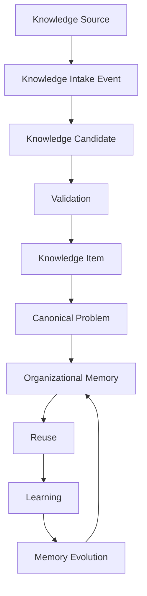
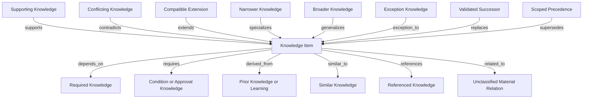
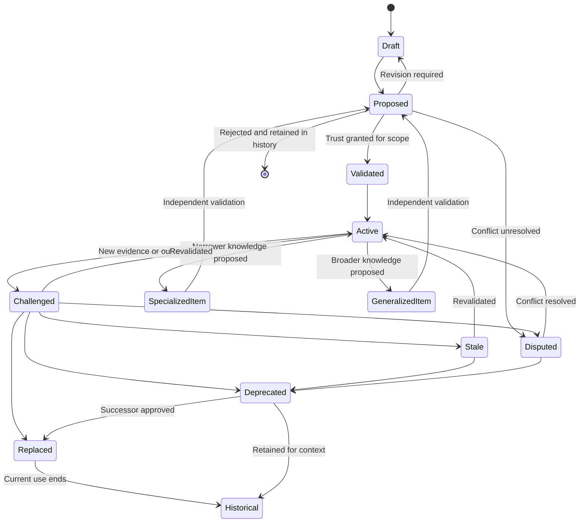
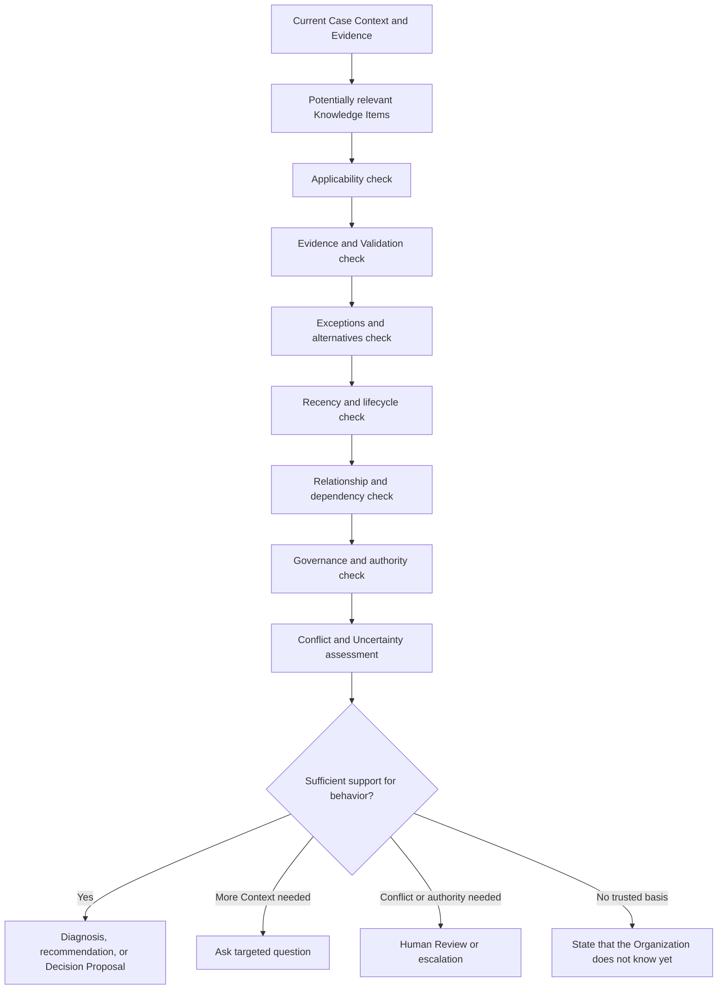
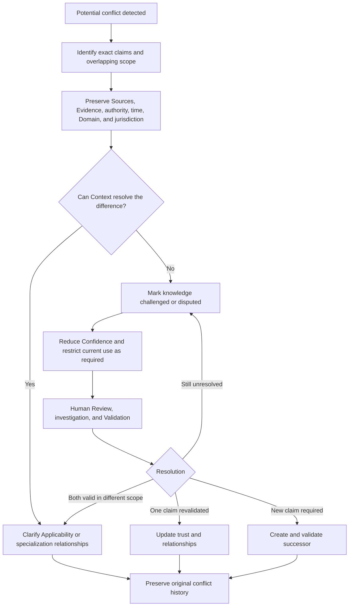
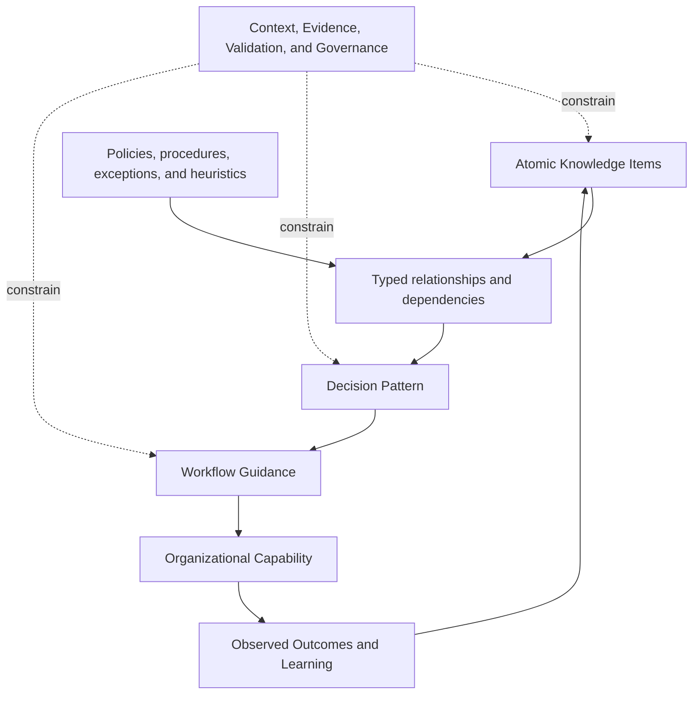
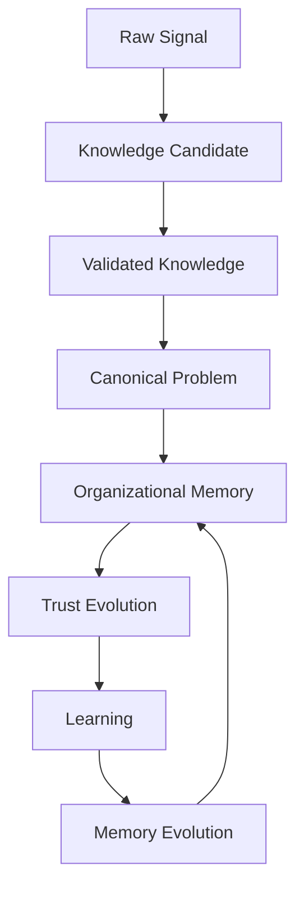
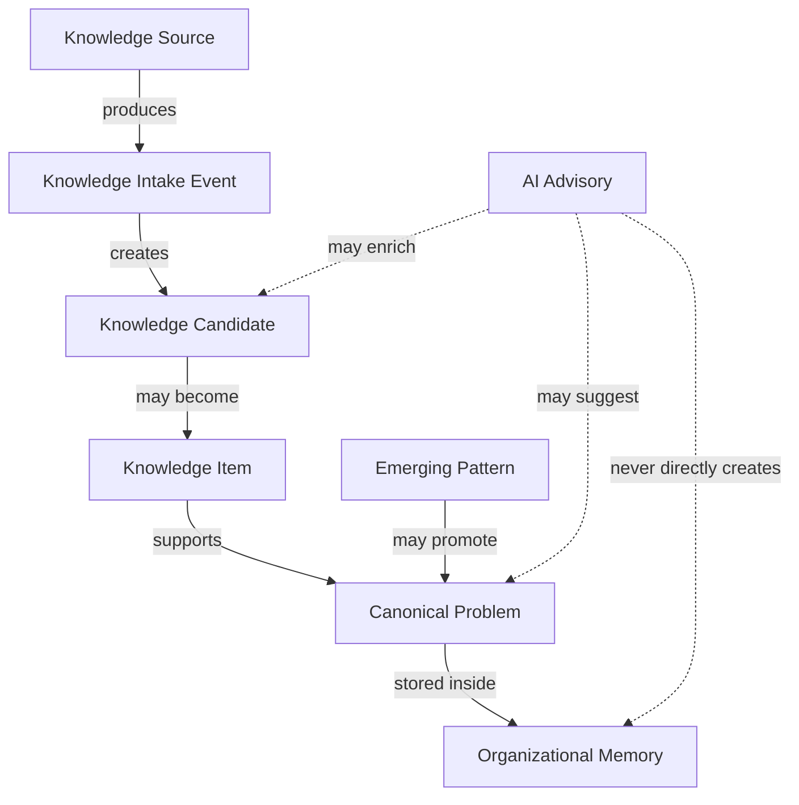

# Knowledge Representation Model

## 1. Introduction

The Knowledge Representation Model defines how organizational understanding should be expressed so that people and intelligence can interpret, validate, govern, apply, challenge, evolve, and explain it.

The platform distinguishes four forms:

```text
Documents

↓

Information

↓

Knowledge

↓

Organizational Memory
```

- A **Document** is an artifact that contains statements, records, explanations, or instructions. It is a Source, not knowledge by default.
- **Information** is content interpreted with enough Context to understand what it describes, where it came from, and why it may matter.
- **Knowledge** is information structured, supported, and validated enough to guide action within stated conditions.
- **Organizational Memory** is connected knowledge preserved across people, systems, Domains, and time with Context, trust, Provenance, Governance, relationships, and lifecycle intact.

Storing documents does not create Organizational Intelligence. A document may be stale, contradictory, unauthoritative, too broad, inaccessible, or valid only under conditions that are no longer visible. Search may recover its words without recovering their meaning.

Knowledge requires explicit semantic structure. The platform must understand the claim being made, the problem it addresses, the conditions in which it applies, the Evidence and authority behind it, its exceptions and conflicts, its current lifecycle state, and its relationship to other knowledge.

The platform reasons over knowledge—not documents. Documents remain important Sources and Evidence. They do not become Organizational Memory merely because they are stored or retrieved.

### Knowledge Representation Across Its Lifecycle

The four forms above describe increasing structure and trust. The platform also represents knowledge as it evolves through its full lifecycle, from a raw organizational signal to continuously refined Organizational Memory. Representation is not a single fixed structure; it changes as Confidence, Validation, and organizational understanding increase.



Across this lifecycle the platform distinguishes six representational forms:

- **Raw organizational information** — signals as received, with unknown trust.
- **Knowledge Candidates** — structured proposals of potentially reusable knowledge.
- **Validated knowledge** — Knowledge Items that earned trust through Governance.
- **Canonical organizational knowledge** — Canonical Problems that organize related Knowledge Items into durable organizational understanding.
- **Trusted Organizational Memory** — the connected body of validated, governed knowledge.
- **Organizational learning** — the patterns, reuse, and Memory Evolution through which understanding continuously improves.

Knowledge representation changes as Confidence, Validation, and organizational understanding increase. The same underlying information is represented differently when it is an unvalidated signal, a proposed candidate, a validated item, a canonical concept, and trusted memory. Representation reflects the conceptual evolution of knowledge, not merely where it is stored. Section 17 makes these representational stages explicit.

---

## 2. Relationship to Previous Documents

### Canon Traceability

Derived From:

- [Founder's Thesis](../canon/00_FOUNDERS_THESIS.md)
- [Product Vision](../canon/01_PRODUCT_VISION.md)
- [Product Principles](../canon/02_PRODUCT_PRINCIPLES.md)
- [Product Capability Model](../canon/03_PRODUCT_CAPABILITY_MODEL.md)
- [Product Domain Model](../canon/04_PRODUCT_DOMAIN_MODEL.md)
- [Product Workflow Model](../canon/05_PRODUCT_WORKFLOW_MODEL.md)
- [AI Cognitive Model](../canon/06_AI_COGNITIVE_MODEL.md)
- [System Architecture](./07_SYSTEM_ARCHITECTURE.md)
- [AI Agent Architecture](./08_AI_AGENT_ARCHITECTURE.md)
- [Data Architecture](./09_DATA_ARCHITECTURE.md)

Canon Version: `v1.0.0`

| Document | Contribution |
| --- | --- |
| Canon | Meaning |
| System Architecture | Responsibility |
| AI Agent Architecture | Cognitive ownership |
| Data Architecture | Information objects |
| Knowledge Representation | Internal semantic structure |

Data Architecture defines the logical containers and relationships through which information flows. Knowledge Representation defines the semantic contents of Knowledge Candidates and Knowledge Items and the rules by which those contents can be understood and used.

This document does not create a second Domain Model. It makes the Canon's definition of Knowledge Item precise enough for future Reasoning, Validation, memory, Governance, and explanation. The meaning of Evidence, Source, Context, Confidence, Validation, Provenance, and lifecycle remains the meaning established by the Canon.

---

## 3. Philosophy of Knowledge Representation

### Knowledge Is Structured

Knowledge is not an undifferentiated block of prose. Its claim, scope, Evidence, assumptions, exceptions, authority, and history must remain distinguishable. Prose may present knowledge to a human, but presentation is not the authoritative semantic structure.

### Meaning Is Explicit

The platform should not infer material meaning from title, placement, wording, or convention alone. Intent, problem, applicability, relationships, and lifecycle should be represented directly enough to inspect.

### Claims Are Distinguishable from Evidence

A claim says what the Organization proposes or accepts as true or useful within a scope. Evidence explains what supports, challenges, qualifies, or limits that claim. A Source originates information. None of these concepts should collapse into another.

### Truth and Applicability Are Contextual

Context does not make truth arbitrary. It identifies the conditions under which a claim is supported and may responsibly guide action. A policy can be valid for one jurisdiction and invalid for another. A technical Diagnosis can be correct for one product version and wrong for the next.

### Applicability Is Mandatory

A Knowledge Item without applicability conditions invites over-generalization. Every item must state where, when, for whom, and under what conditions it may be used, including known exclusions.

### Provenance Is Inseparable from Knowledge

Knowledge must retain its Sources, derivation, Evidence, reviewers, authority, Validation, changes, and use history. Removing Provenance turns an organizational lesson into an anonymous assertion.

### Knowledge Evolves

Knowledge can be challenged by new Evidence, narrowed, specialized, generalized through a separately validated item, become stale, be deprecated, or be replaced. Evolution preserves history rather than editing the past into apparent consistency.

### Contradictions Are Preserved

Competing claims and Evidence remain explicit until the Organization resolves their scope, authority, or truth. Fluent synthesis must not create false consensus.

### Exceptions Are Explicit

Exceptions are knowledge about when a general claim does not apply or requires different treatment. They are not inconvenient footnotes. An exception should be related to the claim it constrains and carry its own Evidence, authority, and scope.

### Organizational Knowledge Is Explainable

A person should be able to understand what a Knowledge Item means, why it is trusted, where it applies, what could make it wrong, which alternatives exist, and how it changed. Explainability is a property of the representation, not a summary added afterward.

### Validation and Confidence Remain Distinct

Validation grants organizational trust to a Knowledge Item for a defined scope. Confidence expresses how strongly that item and other Evidence may guide a specific Case. A validated item does not carry universal Confidence.

---

## 4. What Is a Knowledge Item?

A **Knowledge Item** is a governed semantic representation of validated organizational understanding within a defined scope.

It may express a fact, rule, policy interpretation, procedure, exception, Diagnosis pattern, Decision pattern, heuristic, warning, rationale, or reusable lesson. Its form depends on what must be understood and applied, but its semantic obligations remain stable.

A Knowledge Item is not:

- A paragraph.
- An Answer to one User.
- A document.
- A prompt.
- A wiki page.
- A retrieved passage.
- A frequent pattern by itself.
- An unreviewed human opinion.
- A model-generated summary.

Any of those may be a Source, presentation, input, Evidence, or Knowledge Candidate. None is trusted reusable knowledge merely by existing.

A Knowledge Item must answer at least these questions:

1. What is the Organization claiming or teaching?
2. Which problem, intent, or Decision does it address?
3. In which Context does it apply?
4. Which preconditions and assumptions must hold?
5. What Evidence supports or challenges it?
6. Which exceptions and alternatives are known?
7. Why was it validated, by whom, and under what authority?
8. Which Governance constraints control its use?
9. What is its current lifecycle state?
10. How does it relate to other knowledge and its own history?
11. What has happened when it was used?

The semantic structure is authoritative. A human-readable article, Answer, explanation, checklist, or other presentation may be generated from one or more Knowledge Items, but should not redefine them.

---

## 5. Internal Structure of a Knowledge Item

The components below form the logical semantic structure. Not every type of knowledge requires the same amount of detail, but omission of a component should mean it is not material or not yet known—not that its meaning is hidden inside prose.

| Component | Purpose | Meaning and relationships | Why it exists |
| --- | --- | --- | --- |
| **Core Claim** | State the organizational understanding that may guide action. | The claim may be declarative, normative, procedural, diagnostic, or cautionary. It is supported or challenged by Evidence and bounded by Applicability. | Reasoning must know exactly what is being asserted rather than infer a claim from a document. |
| **Intent** | State what the Knowledge Item helps a person or cognitive process accomplish. | Connects the Core Claim to a question, Decision, explanation, procedure, or risk it serves. | Similar claims can serve different purposes; intent guides responsible recall and presentation. |
| **Problem Addressed** | Identify the Issue, recurring need, gap, or failure the item resolves. | Relates the item to Domain concepts, Case patterns, Knowledge Gaps, and user needs. | Knowledge without a clear problem becomes content that is difficult to retrieve or evaluate. |
| **Context** | Describe the conditions that give the claim meaning. | Includes Organization, Domain, time, jurisdiction, product, segment, risk, state, and relevant history. It is the basis for Applicability. | Superficially similar Cases can require different knowledge when Context differs. |
| **Applicability** | Define the scope in which the item may guide work. | States included conditions, excluded conditions, effective period, supported use, and intended audience or Role. | Prevents a validated claim from being treated as universal truth. |
| **Preconditions** | Identify conditions that must be established before application. | May reference required facts, prior steps, approvals, states, Evidence, or related Knowledge Items. | A correct rule applied before its prerequisites are met can produce a wrong Decision. |
| **Assumptions** | Make unproven or contextual premises visible. | Each assumption may be supported, monitored, challenged, or converted into a precondition or Evidence. | Hidden assumptions are a common source of over-generalization and false certainty. |
| **Supporting Evidence** | Explain what supports the Core Claim. | Connects explicit Evidence relationships to Sources, Cases, outcomes, policies, expert judgment, and Validation. | Trust must be inspectable and cannot rest on assertion alone. |
| **Conflicting Evidence** | Preserve credible information that challenges or limits the claim. | Identifies competing Sources, outcomes, or interpretations and their Context and authority. | Hiding conflict creates false confidence and prevents knowledge from evolving responsibly. |
| **Exceptions** | State cases in which the general claim does not apply or requires different treatment. | Each exception identifies triggering conditions, alternative guidance, authority, Evidence, and relationship to the parent claim. | Exceptions preserve expert nuance and prevent consistency from becoming rigidity. |
| **Alternative Interpretations** | Represent other plausible meanings, Diagnoses, or applications. | Relates competing interpretations to Evidence, Context, Confidence, and conditions that distinguish them. | Reasoning needs alternatives to resist confirmation bias and premature closure. |
| **Reasoning Summary** | Explain why the claim follows from Evidence and organizational understanding. | Summarizes the validated rationale, material inferences, alternatives considered, and boundary of conclusion. It links to fuller Reasoning history. | Future Humans must understand why the item exists, not only what it says. |
| **Validation** | State how and why the item earned its current trust. | References Validation Records, criteria, scope, reviewers, authority, Evidence, result, and effective period. | Capture, authorship, retrieval, and Confidence do not grant organizational trust. |
| **Authority** | Identify who or what is authorized to establish, approve, interpret, or apply the knowledge. | Connects Users, Roles, Domain authority, policy, separation of duties, and scope. | Subject-matter truth, access permission, and Decision authority are different. |
| **Governance Constraints** | Define limits on access, use, disclosure, learning, automation, and change. | References Governance Boundaries and contextual Governance Decisions. | Correct knowledge used outside its boundary remains an invalid outcome. |
| **Confidence History** | Preserve how contextual reliance changed through use. | Connects Confidence Assessments to Cases, Context, outcomes, Corrections, and lifecycle changes. It is history, not a universal confidence score. | Shows calibration and recurring uncertainty without confusing Confidence with Validation. |
| **Lifecycle** | Express the item's current standing and prior states. | Includes validated, active, challenged, disputed, stale, deprecated, and replaced states with rationale and effective time. | Current use must reflect knowledge evolution without erasing history. |
| **Related Knowledge** | Connect the item to supporting, conflicting, dependent, broader, narrower, similar, and exception knowledge. | Uses typed semantic relationships with scope and Provenance. | Organizational Memory is a connected understanding, not a folder of isolated articles. |
| **Replacement History** | Preserve what this item replaces and what later replaces it. | Identifies predecessor, successor, overlap, effective time, unchanged scope, and unresolved historical applicability. | Prevents old guidance from appearing current while retaining the basis for earlier Decisions. |
| **Provenance** | Preserve origin, derivation, authorship, transformation, review, and change. | Connects Sources, Work Signals, Cases, Corrections, Learning Candidates, Knowledge Candidates, Validation, and Memory Changes. | Nothing important should become anonymous or impossible to audit. |
| **Usage History** | Record governed applications and observed outcomes. | Relates Cases, Reasoning, Decisions, Answers, Corrections, escalations, and successful or failed outcomes. | Real use tests usefulness, reveals gaps, and may challenge applicability; frequency alone does not establish truth. |
| **Metrics** | Summarize evidence about health, use, and learning value. | May include freshness signals, reuse, outcome consistency, correction rate, gap impact, and review burden with definitions and limitations. | Helps maintain knowledge and measure learning without turning popularity into authority. |

### Required Semantic Minimum

A Knowledge Item cannot be active unless it has:

- A clear Core Claim.
- An identified Domain and owning Organization.
- Applicability and known exclusions.
- Supporting Evidence and Sources appropriate to the claim.
- Validation, authority, and Governance basis.
- Lifecycle and Provenance.
- Explicit relationships to any knowledge it contradicts, replaces, or depends on.

Other components may be explicitly empty or unknown when not material. Unknown assumptions, exceptions, and conflicting Evidence should remain visible rather than silently omitted.

---

## 6. Knowledge Relationships

Knowledge relationships are typed semantic assertions. They state how two Knowledge Items or an item and another object are connected. Every relationship has direction, Context, applicability, Provenance, current standing, and—when material—Evidence and authority.

| Relationship | Semantic meaning | Integrity requirement |
| --- | --- | --- |
| **supports** | The source item provides Evidence or rationale that strengthens the target claim. | Support does not automatically validate the target; scope and nature of support are explicit. |
| **contradicts** | The source and target make materially incompatible claims within an overlapping scope. | The overlap and conflicting propositions are identified; neither is silently deleted. |
| **extends** | The source adds compatible coverage, detail, consequences, or use beyond the target. | The original meaning remains intact; extension cannot alter the target's claim. |
| **replaces** | The source is the governed lifecycle successor to the target. | Validation, effective time, scope of replacement, and retained history are required. |
| **specializes** | The source narrows a broader target claim for a more specific Context. | The narrower Context and changed conditions are explicit; specialization requires its own Validation. |
| **generalizes** | The source proposes a broader claim derived from narrower knowledge. | Broader applicability requires independent Evidence and Validation; it cannot inherit trust automatically. |
| **depends_on** | The source cannot be interpreted or applied without the target. | The dependency type and required target state are explicit. |
| **derived_from** | The source's meaning or claim was produced in part from the target. | Derivation preserves the transformation, relevant components, and Provenance. |
| **similar_to** | The items share relevant characteristics without asserting equivalence or applicability. | Similarity dimensions and limits are explicit; Reasoning must still test Context. |
| **supersedes** | The source takes precedence over the target within a stated overlapping scope, which may be narrower than full replacement. | Precedence, overlap, effective time, and authority are explicit; a full lifecycle successor uses `replaces`. |
| **exception_to** | The source identifies conditions under which the target does not apply or requires different treatment. | Trigger conditions and alternative guidance are explicit and governed. |
| **requires** | Applying the source requires a condition, approval, Evidence, procedure, or knowledge expressed by the target. | Requirement satisfaction must be testable in the current Context. |
| **references** | The source cites the target for explanation or Context without inheriting its claim. | Reference is not Evidence, dependency, or endorsement unless separately related. |
| **related_to** | A material relationship exists that is not yet represented by a more precise type. | Use sparingly; the rationale is required and should be refined when meaning becomes known. |



### Relationship Rules

- Relationship direction matters. If A specializes B, B generalizes A only when the inverse is explicitly valid.
- Relationships do not transfer Validation automatically.
- A relationship may be challenged or superseded without changing the identity of either Knowledge Item.
- Contradiction can arise from claim, scope, time, jurisdiction, authority, or Evidence; the type of contradiction should be stated.
- Similarity is a recall aid, not proof of applicability.
- Replacement and supersession require organizational authority; recency alone does not create precedence.
- Cycles are permitted only when semantically coherent. Circular support or dependency should be made visible rather than treated as independent confirmation.

---

## 7. Knowledge Granularity

Granularity determines how much meaning belongs in one Knowledge Item. The correct unit is the smallest independently understandable and governable piece of knowledge that can preserve its claim, scope, Evidence, Validation, lifecycle, and relationships.

An item is too broad when its parts have different applicability, Evidence, authorities, exceptions, or lifecycle. It is too narrow when it cannot be understood or used without reconstructing a larger claim from many fragments whose relationships are implicit.

### Atomic Knowledge

Atomic knowledge expresses one independently valid claim, condition, exception, step, or rationale. It can be validated, challenged, related, and evolved without requiring unrelated claims to change.

Atomic does not mean one sentence. It means one coherent semantic obligation.

### Composite Knowledge

Composite knowledge coordinates several explicit Knowledge Items into a larger unit whose order or combination matters. The composite preserves its component relationships and does not hide several claims inside one prose block.

### Knowledge Forms

| Form | Representation guidance |
| --- | --- |
| **Fact** | One contextual claim with Source, Evidence, effective time, and applicability. |
| **Rule** | Condition → conclusion or required behavior, including exceptions and authority. |
| **Policy** | A governed set of rules, rationale, authority, jurisdiction, effective period, and exceptions. Component rules should remain identifiable. |
| **Procedure** | Ordered or conditional steps with preconditions, required Roles, decision points, outcomes, and failure paths. Each independently changing step may be a related item. |
| **Heuristic** | A useful but non-guaranteed judgment pattern with Evidence, limits, Confidence expectations, and escalation conditions. |
| **Best practice** | Recommended behavior supported by outcomes or expertise, with purpose, alternatives, applicability, and consequence of deviation. |
| **Exception** | A specific departure from a general item, linked through `exception_to`, with trigger, authority, alternative guidance, and scope. |
| **Diagnosis pattern** | Observations and Evidence that support a likely interpretation, competing Diagnoses, discriminating questions, and Confidence limits. |
| **Decision pattern** | Context, alternatives, Evidence, authority, trade-offs, and conditions that support a class of Decisions. It is not an automatic Decision. |
| **Anti-pattern** | A recognizable behavior or structure to avoid, including why it fails, signals, consequence, and corrective guidance. |
| **Explanation** | A causal or conceptual account with claims, Evidence, assumptions, alternatives, and intended audience. |
| **Warning** | A high-consequence condition, triggering Evidence, affected scope, required behavior, and authority. |

### Granularity Tests

Before treating content as one Knowledge Item, ask:

1. Can the Core Claim be stated without “and” joining independently testable claims?
2. Do all parts share the same Applicability, Evidence, authority, and lifecycle?
3. Could one part be challenged or replaced while the rest remains valid?
4. Can a future person understand the item without unstated related knowledge?
5. Would dividing the item clarify Reasoning, or merely create fragments?
6. Can exceptions be related explicitly rather than buried inside the claim?
7. Does the item have one accountable knowledge owner and Validation scope?

Granularity matters because retrieval, Reasoning, Validation, Governance, lifecycle, and Metrics operate on the unit of knowledge. Poor granularity spreads a small change across an entire article or forces Reasoning to assemble meaning from disconnected fragments.

---

## 8. Knowledge Lifecycle

The Canon's trust lifecycle remains authoritative:

```text
Draft → Proposed → Validated → Active → Challenged →
Disputed / Stale / Deprecated / Replaced
```

This section adds semantic detail without changing those states.

### Canonical States

| State | Semantic meaning |
| --- | --- |
| **Draft** | The proposed structure is incomplete and not ready for organizational reliance. |
| **Proposed** | A Knowledge Candidate has entered Validation with stated Sources, scope, and purpose. |
| **Validated** | The claim earned organizational trust for a defined scope and under a recorded authority. |
| **Active** | The validated item is approved for current use within its Applicability and Governance constraints. |
| **Challenged** | New Evidence, outcome, Correction, or judgment materially questions the item. Current use is reassessed. |
| **Disputed** | Credible conflict remains unresolved. Competing claims, Evidence, and authority remain explicit. |
| **Stale** | Currency is insufficient to retain prior reliance even though the claim is not proven false. |
| **Deprecated** | The item is no longer approved for current use. |
| **Replaced** | A validated successor governs a stated scope; the predecessor remains historical. |

### Candidate, Specialized, Generalized, and Historical

These terms describe semantic roles or transformations, not additional trust states:

- **Candidate** refers to a Knowledge Candidate before it becomes a Knowledge Item. Its lifecycle includes draft and proposed.
- **Specialized** knowledge is a separately identifiable item linked through `specializes`. It requires its own Evidence and Validation and may be active while the broader item remains active.
- **Generalized** knowledge is a separately validated broader item linked through `generalizes`. Trust does not flow upward automatically from several narrow items.
- **Historical** describes retained knowledge that is no longer current—such as deprecated or replaced items. It is a governed usage classification, not a claim that the knowledge was archived or erased.



### Transition Requirements

Every trust-affecting transition preserves:

- The previous and resulting state.
- The triggering Evidence or Governance change.
- The effective time and Context.
- The Validation Record and authority.
- Any changed Applicability, exception, or relationship.
- Effects on dependent or related Knowledge Items.
- The Memory Change Record and Provenance.

A content edit is not necessarily a lifecycle change. A wording correction can preserve the same claim and Validation. A semantic change creates a new candidate or requires revalidation according to its impact.

---

## 9. Knowledge Context

Every Knowledge Item is contextual. Context defines the conditions under which meaning, Validation, authority, and applicability hold.

| Context dimension | Semantic role |
| --- | --- |
| **Organization** | Identifies whose knowledge, policy, authority, and memory the item belongs to. |
| **Domain** | Establishes vocabulary, Evidence standards, Roles, risk, and Validation expectations. |
| **Time** | Defines effective period, product or policy era, and freshness. Creation time and applicability time are different. |
| **Jurisdiction** | Limits legal, regulatory, contractual, or policy applicability to the relevant authority. |
| **Product or service** | Identifies the offering, version, configuration, behavior, or operating condition to which the claim applies. |
| **Customer or User segment** | Distinguishes plans, contracts, eligibility, needs, or risk profiles when material and governed. |
| **Risk level** | Changes required Evidence, review, authority, Confidence, and permitted automation. |
| **Authority scope** | Defines who may interpret, approve, apply, override, or change the item. |
| **Applicable conditions** | States the facts, states, preconditions, and triggers that must hold. |
| **Excluded conditions** | States known situations in which the item must not be applied. |
| **Purpose** | Limits use to the intent for which the knowledge was validated. |
| **Channel or operational setting** | Captures material differences in how a rule or procedure applies without treating presentation alone as meaning. |

### Context Rules

- Context is part of the Knowledge Item's meaning, not optional tagging.
- Missing Context lowers Confidence and may prevent responsible application.
- Context from a Source does not automatically remain valid after policy, product, jurisdiction, or organizational change.
- Cross-Domain use requires both Source-Domain meaning and target-Domain applicability and Governance.
- A broader Context requires additional Evidence and Validation; it cannot be inferred from repeated narrow use alone.
- Context may include sensitive information that is represented and reasoned over only within its Governance Boundary.

Without Context, similarity becomes dangerous. Two Cases may share words but differ in policy period, authority, jurisdiction, risk, or product version. Conversely, differently worded Cases may share the same applicable knowledge.

---

## 10. Reasoning over Knowledge

Reasoning uses Knowledge Items as governed, contextual inputs. It does not treat retrieval as a conclusion.



Reasoning should evaluate:

- **Applicability:** Does the current Context satisfy the item's conditions and avoid its exclusions?
- **Evidence:** Is the supporting Evidence relevant, sufficient, and connected to credible Sources?
- **Validation:** What trust was granted, for which scope, by which authority, and when?
- **Exceptions:** Does an exception or specialized item govern this Case?
- **Authority:** Is the item authoritative for this Domain and Decision, and does the actor have authority to apply it?
- **Recency:** Is the item current enough, and did any later Evidence or policy change challenge it?
- **Relationships:** Which dependencies, broader or narrower items, contradictions, replacements, and alternatives affect interpretation?
- **Governance:** May the knowledge be observed, used, disclosed, or acted upon for this purpose?
- **Conflicts:** Do competing claims or Evidence require comparison or Human Review?
- **Confidence:** How strongly can the complete evidence set guide this behavior in this specific Case?

### Why Retrieval Is Insufficient

Retrieval answers which items may be relevant. It does not establish that:

- The item applies.
- Its Evidence is sufficient.
- It is current or active.
- No exception or contradiction controls the Case.
- The User may access or act on it.
- The item has authority for this Domain.
- The consequence permits autonomous behavior.

Reasoning must preserve the path from retrieved items to conclusion. When no supported conclusion exists, the correct result is a question, escalation, review, or explicit Uncertainty—not a fluent synthesis.

---

## 11. Contradictions and Uncertainty

Contradiction is a relationship to understand, not a defect to hide. The platform should represent competing knowledge at the level where the conflict actually exists.

### Forms of Conflict

| Conflict form | Representation |
| --- | --- |
| **Conflicting claims** | Identify the incompatible propositions and their overlapping scope. |
| **Alternative interpretations** | Preserve different explanations that fit current Evidence and state what would distinguish them. |
| **Competing Evidence** | Link Evidence to the claims it supports or challenges, including quality and limits. |
| **Different authorities** | Preserve each authority, Domain, scope, hierarchy, and effective period rather than selecting by title alone. |
| **Jurisdiction differences** | Represent each claim as applicable to its jurisdiction; apparent contradiction may resolve through scope. |
| **Temporal differences** | Preserve which claim applied during which period and whether a replacement relationship exists. |
| **Domain differences** | Keep Domain-specific meaning distinct; cross-Domain similarity does not imply conflict or equivalence. |
| **Outcome differences** | Relate successful and failed uses to the Context that may explain the difference. |

### Uncertainty Representation

Uncertainty may attach to:

- The truth or completeness of the Core Claim.
- Applicability to the present Context.
- Evidence quality or Source authority.
- Missing preconditions or assumptions.
- Interpretation of an exception.
- Current lifecycle or freshness.
- Which authority governs.
- Consequence of a wrong application.

Each uncertainty should identify its type, basis, affected component, consequence, and what could reduce it. An unexplained confidence score is insufficient.

### Conflict Workflow



The platform must never silently delete contradiction, choose the newest item automatically, average incompatible claims, or present one answer without explaining material unresolved conflict.

---

## 12. Knowledge Composition

Organizational understanding emerges by composing validated Knowledge Items through explicit relationships. Composition does not merge all content into a larger opaque item.



### Composition Levels

1. **Atomic Knowledge Items** express independently governable facts, rules, conditions, exceptions, procedures, and rationales.
2. **Relationship networks** state support, contradiction, dependency, specialization, exception, and replacement.
3. **Decision Patterns** coordinate relevant items into a repeatable way of evaluating a class of Cases. They preserve alternatives, authority, and escalation rather than becoming automatic Decisions.
4. **Workflow Guidance** composes Decision Patterns, procedures, Roles, Governance, and lifecycle into guidance for organizational work.
5. **Organizational Capability** emerges when people and the platform can apply, review, learn from, and improve that guidance reliably.

### Composition Rules

- Every component retains its identity, lifecycle, Validation, Applicability, and Provenance.
- The composite has its own purpose, scope, relationships, and Validation where it makes a new claim.
- Failure of one component should identify affected composites and dependent knowledge.
- Exceptions and conflicts are carried into the composite; they are not lost for simplicity.
- Composition does not transfer authority across Domains or Roles.
- A workflow can use several Knowledge Items without becoming a Knowledge Item itself; behavioral and semantic objects remain distinct.

Composition makes knowledge compound because improved components can strengthen many Decisions and workflows. It also makes change impact visible because dependencies identify what must be reconsidered when an item is challenged.

---

## 13. Knowledge Quality

Knowledge quality is multidimensional. No single score should conceal the reason an item is strong or weak.

| Dimension | Meaning | Evidence of quality |
| --- | --- | --- |
| **Correctness** | The Core Claim is supported and survives credible challenge within its scope. | Strong relevant Evidence, authoritative review, successful outcomes, absence or resolution of material contradiction. |
| **Completeness** | The item contains enough meaning for its purpose, including conditions, limits, exceptions, and rationale. | Required components present; missing knowledge and open questions explicit. |
| **Applicability** | Scope is precise enough to determine when the item should and should not guide work. | Clear Context, preconditions, exclusions, effective period, and Domain. |
| **Freshness** | Currency is sufficient for the rate of change and consequence of the knowledge. | Recent review or outcome Evidence, current Sources, no unresolved change signals. |
| **Consistency** | The item aligns with related active knowledge or makes conflicts explicit. | Relationship checks, resolved contradictions, coherent terminology and scope. |
| **Traceability** | Origin, Evidence, derivation, authority, Validation, and change can be followed. | Complete Provenance chain and preserved history. |
| **Explainability** | A person can understand what the item means, why it is trusted, and where its limits lie. | Clear claim, Reasoning Summary, Evidence, alternatives, exceptions, and rationale. |
| **Governance** | Access, use, disclosure, authority, and change comply with organizational boundaries. | Applicable Governance Decisions, Roles, sensitivity, and auditability. |
| **Validation Strength** | Trust is supported by Evidence and authority appropriate to Domain and consequence. | Independent review where required, clear scope, criteria, and revalidation history. |
| **Reuse Frequency** | The item is used across applicable work. | Governed usage history with Context. Frequency is a signal of utility, not correctness. |
| **Outcome Quality** | Applications tend to produce intended trustworthy outcomes. | Resolution, consistency, Correction, escalation, and downstream-impact Evidence. |
| **Learning Value** | Use of the item reveals improvements, closes gaps, or frees expertise for harder work. | Reduced repeated work, better future Confidence, gap closure, useful Corrections, and new validated learning. |
| **Maintainability** | Owners can understand impact, review change, and evolve the item without losing coherence. | Clear granularity, ownership, dependencies, lifecycle, and relationship network. |

### Quality Rules

- Quality is assessed relative to purpose, Domain, risk, and consequence.
- High reuse cannot compensate for weak Evidence or stale knowledge.
- Correctness without Applicability can still produce wrong Decisions.
- Freshness is not recency alone; older stable knowledge may be current, while recent content may be unvalidated.
- Validation Strength does not eliminate contextual Uncertainty.
- Metrics should expose dimensions separately and preserve their definitions and limitations.

Quality signals can trigger review, challenge, revalidation, gap detection, or deprecation. They do not modify the Knowledge Item directly.

---

## 14. Knowledge Anti-Patterns

| Anti-pattern | Why it violates the Canon |
| --- | --- |
| **Knowledge without Evidence** | Makes trust impossible to inspect and turns assertion into organizational truth. |
| **Knowledge without Applicability** | Encourages a valid claim to be used in invalid Contexts. |
| **Knowledge without Provenance** | Erases Source, derivation, authority, Validation, and change history. |
| **Hidden assumptions** | Allows Reasoning to rely on premises that cannot be tested or challenged. |
| **Over-generalization** | Extends scope beyond Evidence and Validation, often by confusing repeated narrow use with universal truth. |
| **Implicit exceptions** | Traps nuance in expert memory and produces rigid, inconsistent application. |
| **Document equals knowledge** | Treats presentation and storage as understanding, trust, and current applicability. |
| **Answer equals truth** | Turns situational communication into reusable guidance without Capture or Validation. |
| **Deleted history** | Makes earlier Decisions, Errors, and evolution impossible to understand or audit. |
| **Unexamined single Source treated as sufficient authority** | Confuses origin with Evidence and may ignore Context, conflict, or the difference between policy authority and factual support. A legitimately authoritative Source still requires explicit scope. |
| **Newest item wins** | Treats recency as authority and bypasses Validation, effective period, and replacement relationships. |
| **Popularity equals correctness** | Learns repeated mistakes and turns usage into truth. |
| **Confidence stored as a permanent item property** | Confuses contextual reliance with Validation and ignores Case-specific Evidence and consequence. |
| **Generic `related_to` everywhere** | Hides the semantic relationships Reasoning needs and prevents impact analysis. |
| **Composite knowledge with hidden claims** | Forces unrelated claims to share lifecycle, Evidence, and authority. |
| **Fragmentation without composition** | Creates tiny pieces that cannot be understood without reconstructing unstated relationships. |
| **Contradiction flattened into synthesis** | Hides unresolved disagreement and creates false consensus. |
| **Exception copied as a new general rule** | Removes the condition that made the exception valid. |
| **Specialization inherits trust automatically** | Assumes a narrower claim is valid without independent Evidence and Validation. |
| **Generalization by accumulation** | Assumes several examples prove a broad rule without testing boundary conditions. |
| **Governance as presentation only** | Allows restricted knowledge to shape recall or Reasoning before a final access check. |
| **Replacement without predecessor link** | Makes old guidance appear merely missing and destroys historical explanation. |

---

## 15. Reference Knowledge Model

The reference model shows the complete internal semantic structure of a Knowledge Item and its major relationships.

```mermaid
flowchart TB
    KI["Knowledge Item"]

    subgraph MEANING["Meaning"]
        CC["Core Claim"]
        IN["Intent"]
        PA["Problem Addressed"]
        RS["Reasoning Summary"]
    end

    subgraph SCOPE["Context and Scope"]
        CT["Context"]
        AP["Applicability"]
        PC["Preconditions"]
        AS["Assumptions"]
        EX["Exceptions"]
        AI["Alternative Interpretations"]
    end

    subgraph SUPPORT["Support and Trust"]
        SE["Supporting Evidence"]
        CE["Conflicting Evidence"]
        VA["Validation"]
        AU["Authority"]
        GC["Governance Constraints"]
        CH["Confidence History"]
    end

    subgraph EVOLUTION["Evolution and Memory"]
        LC["Lifecycle"]
        RK["Related Knowledge"]
        RH["Replacement History"]
        PR["Provenance"]
        UH["Usage History"]
        MT["Metrics"]
    end

    CC --> KI
    IN --> KI
    PA --> KI
    RS --> KI
    CT --> AP
    AP --> KI
    PC --> AP
    AS --> RS
    EX --> AP
    AI --> RS
    SE --> VA
    CE --> VA
    VA --> KI
    AU --> VA
    GC -. constrains .-> KI
    CH --> KI
    LC --> KI
    RK --> KI
    RH --> LC
    PR --> KI
    UH --> CH
    UH --> MT
    MT --> LC

    subgraph RELATIONSHIPS["Semantic Relationship Network"]
        SUP["supports"]
        CON["contradicts"]
        EXT["extends"]
        REP["replaces / supersedes"]
        SG["specializes / generalizes"]
        DEP["depends_on / requires"]
        EXR["exception_to"]
        DER["derived_from"]
        SIM["similar_to / references / related_to"]
    end

    RK --> SUP
    RK --> CON
    RK --> EXT
    RK --> REP
    RK --> SG
    RK --> DEP
    RK --> EXR
    RK --> DER
    RK --> SIM

    ORG["Owning Organization and Domain"] --> CT
    SRC["Sources"] --> SE
    SRC --> CE
    HUM["Human Expertise and Review"] --> VA
    MEM["Organizational Memory"] <--> KI
    CASES["Cases, Decisions, and Outcomes"] --> UH
```



### Reading the Model

- **Meaning** states what the Organization understands and why it matters.
- **Context and Scope** prevent the claim from being applied beyond its Evidence and Validation.
- **Support and Trust** preserve why the item may be relied upon and which constraints remain.
- **Evolution and Memory** show how the item changed, relates to work, and contributes to Organizational Memory.
- **Semantic relationships** connect one item to the broader network needed for Reasoning and impact analysis.
- **Organization, Sources, Humans, Cases, and outcomes** ground the item in real authority and experience.

No presentation of a Knowledge Item is complete if it removes a material component needed to understand trust, applicability, or conflict. A simplified view may omit detail for a User, but the authoritative representation retains it.

---

## 16. Traceability Matrix

| Canon concept | Representation component |
| --- | --- |
| Knowledge | Knowledge Item with explicit semantic components |
| Shared Knowledge | Governed Knowledge Item available beyond its original creator within authorized scope |
| Organizational Memory | Connected network of Knowledge Items, history, Sources, Validation, relationships, and use |
| Human Expertise | Authority, Human Review, Reasoning Summary, Exceptions, Assumptions, and Provenance |
| Information | Sources and contextual content before Validation as knowledge |
| Case and Issue | Problem Addressed, Usage History, Provenance, and Domain relationships |
| Context | Context component and Applicability conditions |
| Evidence | Supporting Evidence and Conflicting Evidence |
| Source | Provenance and Evidence origin |
| Diagnosis | Core Claim or Reasoning Summary for diagnostic knowledge, linked to observations and alternatives |
| Reasoning | Reasoning Summary, Evidence, Assumptions, Alternatives, and related reasoning history |
| Decision | Intent, Preconditions, Authority, Decision Pattern composition, and Usage History |
| Answer | A presentation derived from applicable knowledge; not a Knowledge Item by itself |
| Knowledge Candidate | Draft or proposed semantic structure before Validation |
| Validation | Validation component, Validation Records, authority, criteria, scope, and effective time |
| Confidence | Confidence History plus Case-specific Confidence Assessment outside the item |
| Uncertainty | Conflicting Evidence, Alternative Interpretations, Assumptions, gaps, and lifecycle challenge |
| Human Review | Validation, Authority, Provenance, and change rationale |
| Correction | Provenance, Usage History, changed Evidence, challenge, and replacement relationships |
| Learning Event | `derived_from`, Provenance, Usage History, and transition from candidate to validated knowledge |
| Knowledge Gap | Problem Addressed, missing or weak components, Metrics, and related Learning Candidates |
| Knowledge Lifecycle | Lifecycle and Replacement History |
| Provenance | Provenance component and typed derivation network |
| Governance Boundary | Governance Constraints, Authority, Context, and permitted purpose |
| Organizational Intelligence Metric | Metrics and Usage History linked to outcomes and learning |
| Visible Uncertainty | Conflicting Evidence, Assumptions, Alternatives, Confidence History, and lifecycle state |
| Memory Before Automation | Applicability, Validation, Governance, and Reasoning checks precede use in action |
| Knowledge Flywheel | Usage History → Reflection and Learning → Candidate → Validation → Memory → future use |
| Build for the human who comes next | Core Claim, Reasoning Summary, Applicability, Exceptions, Provenance, and explanation |
| AI is not the intelligence | Knowledge remains owned by the Organization and grounded in Humans, Evidence, Governance, Validation, memory, and outcomes |
| Knowledge evolution | Lifecycle, conflicting Evidence, semantic relationships, Replacement History, and Validation |
| Cross-Domain expansion | Domain Context, target applicability, governed relationships, and independent Validation |

Every Canon concept may appear in several components because meaning is relational. The representation should preserve those connections without allowing one component—such as text, Evidence, Confidence, or authority—to stand in for the whole Knowledge Item.

---

## 17. Knowledge Representation Stages

Knowledge is represented differently at each stage of its evolution. Each stage carries its own structure, trust expectation, and obligations. The stages below make the lifecycle introduced in Section 1 explicit. They describe how knowledge is represented, not where it is stored.



This is the primary mental model for how knowledge is represented inside the platform. Representation becomes more structured and more trusted from raw signal to refined memory, while Provenance is preserved at every stage. An Emerging Pattern (Stage 6) runs alongside this path as an organizational hypothesis that may promote into a Canonical Problem.

### Stage 1 — Raw Organizational Signal

A Raw Organizational Signal is information as it enters the platform, before interpretation or trust. It is the representational form of a Source or Work Signal.

Represents:

- Tickets.
- Documents.
- Chats.
- Conversations.
- Imported archives.
- API events.
- Human observations.

Characteristics:

- Unstructured.
- Incomplete.
- Unknown trust.
- Source preserved.

A Raw Signal is never trusted knowledge. Its only representational guarantee is that its Source and original content are preserved for later interpretation.

### Stage 2 — Knowledge Candidate

A **Knowledge Candidate** is a structured representation of potentially reusable organizational knowledge. It organizes a Raw Signal enough to be evaluated, but it has not earned trust.

Suggested representation:

- Candidate identity.
- Organization.
- Intake source.
- Intake door.
- Contributor.
- Summary.
- Category.
- Tags.
- Provenance.
- AI Advisory suggestions.
- Validation state.
- Confidence.

Knowledge Candidates are proposals, not trusted knowledge. They remain distinguishable from Knowledge Items until Validation grants trust.

### Stage 3 — Validated Knowledge Item

A **Validated Knowledge Item** is a reusable organizational knowledge object approved through Governance. Its full internal semantic structure is defined in Sections 4 and 5; the representation below highlights what becomes durable once trust is granted.

Suggested representation:

- Title.
- Summary.
- Internal guidance.
- Customer guidance.
- Trust.
- Reusable reasoning.
- Provenance.
- Validation history.

Validated knowledge becomes eligible for Organizational Memory. Eligibility is not membership: an item enters Organizational Memory through an authorized Memory Change, and may be organized under a Canonical Problem.

### Stage 4 — Canonical Problem

A **Canonical Problem** represents a recurring organizational problem as a durable concept rather than an individual incident. It organizes the knowledge that resolves a class of Cases.

Represents:

- Organizational problem.
- Reusable Diagnosis.
- Internal reasoning.
- Customer response template.
- Resolution workflow.
- Versions.
- Examples.
- Trust.
- Lifecycle.

Multiple Knowledge Items may reinforce one Canonical Problem. Canonical Problems represent organizational understanding rather than individual incidents; their trust derives from the validated Knowledge Items that support them, not from how often the underlying incident recurs.

### Stage 5 — Organizational Memory

**Organizational Memory** is the connected body of trusted, governed knowledge. As a representation, it holds only what has been validated.

Represents:

- Trusted canonical knowledge.
- Reusable guidance.
- Learning history.
- Trust evolution.
- Pattern links.
- Provenance.

Only validated knowledge becomes Organizational Memory. Raw Signals, Knowledge Candidates, and Emerging Patterns are represented elsewhere until Validation and an authorized Memory Change admit them.

### Stage 6 — Emerging Pattern

An **Emerging Pattern** represents a repeated organizational observation that may indicate an unrecognized Canonical Problem.

Represents:

- Repeated observations.
- Confidence.
- Evidence.
- Examples.
- Suggested Canonical Problem.
- Promotion status.

Emerging Patterns represent organizational hypotheses. They are not trusted memory. A pattern earns standing only through authorized promotion to a Canonical Problem and Validation of the underlying knowledge.

---

## 18. Representation Relationships

The representational stages connect through explicit relationships that preserve the path from capture to refined memory.



Key interpretations:

- A Knowledge Source produces Knowledge Intake Events, which create Knowledge Candidates; a Candidate may become a Knowledge Item only through Validation.
- A Knowledge Item supports a Canonical Problem, and Canonical Problems are stored inside Organizational Memory as its organizing structure.
- An Emerging Pattern may promote to a Canonical Problem through authorized review; promotion does not bypass Validation of the underlying knowledge.
- AI Advisory may enrich a Knowledge Candidate and may suggest a Canonical Problem, but it never directly creates Organizational Memory.

---

## 19. Knowledge Provenance Representation

Provenance is part of how knowledge is represented at every stage, not metadata added afterward. The Provenance component defined in Section 5 is preserved across the full lifecycle so that any trusted item can be traced back to its origin.

Across its lifecycle, knowledge preserves:

- Source.
- Intake door.
- Contributor.
- Organization.
- Timestamps.
- Transformations.
- AI assistance.
- Review history.
- Approval history.

Knowledge without Provenance cannot become trusted organizational memory. A Canonical Problem in Organizational Memory must remain traceable through its Knowledge Items, Validation, AI assistance, and approvals to the original Knowledge Intake Event and Source.

---

## 20. Trust Representation

Trust is represented separately from the knowledge it qualifies. A Knowledge Item, Canonical Problem, or Organizational Memory entry retains a stable identity while its trust changes through Validation, use, and outcome. This separation extends the Canon distinction between Validation and Confidence (Section 3).

Knowledge representation includes trust concepts such as:

- **Initial trust** — the standing a Knowledge Candidate carries on intake, typically none.
- **Validation trust** — the trust granted for a defined scope through Governance.
- **Reuse trust** — trust adjusted as the knowledge guides later work.
- **Success history** — the record of outcomes when the knowledge was applied.
- **Trust evolution** — how trust strengthened, weakened, or was withdrawn over time.

Trust changes over time without changing the identity of the knowledge object. A Knowledge Item that is challenged, revalidated, or deprecated remains the same item with the same Provenance; only its represented trust and lifecycle state change.

---

## 21. Organization Context Representation

Every knowledge object belongs to an Organization Profile. The profile is the representational scope within which a claim has meaning, trust, and applicability.

An Organization Profile influences:

- Terminology.
- Supported Domains.
- Customer tone.
- Relevance.
- Governance.
- Trust policy.

Representation is organization-specific. The same ticket may have different representations under different organizations: a Knowledge Candidate derived from it could be summarized in different vocabulary, mapped to different Canonical Problems, governed by different policy, and held to a different trust standard. Knowledge is never represented as organization-neutral truth.

---

## 22. AI Advisory Representation

AI participates in knowledge representation as an advisor, not an author. **AI Advisory** is a distinct representation that records what AI suggested and is preserved as Provenance.

AI may generate:

- Summaries.
- Tags.
- Canonical suggestions.
- Enrichment.
- Customer drafts.

These remain advisory representations. They do not become Organizational Memory until accepted through Validation. An AI Advisory may enrich a Knowledge Candidate or suggest a Canonical Problem, but acceptance is a governed human act, and the advisory record is retained whether the suggestion was accepted or rejected.

---

## 23. Representation Principles

These principles summarize how the model preserves meaning and trust as knowledge is represented across its lifecycle.

1. Knowledge evolves through Validation rather than ingestion.
2. Every knowledge object preserves Provenance.
3. Canonical Problems represent organizational understanding.
4. Organizational Memory contains only validated knowledge.
5. Emerging Patterns represent observations, not truth.
6. AI suggestions are advisory representations.
7. Trust evolves independently of representation.
8. Representation is organization-specific.
9. Multiple incidents may reinforce one Canonical Problem.
10. Organizational knowledge continuously evolves rather than being replaced.

---

## 24. What This Document Does Not Define

This document intentionally excludes:

- Embeddings or vector search.
- Chunking strategies.
- Retrieval algorithms.
- LLM prompts or model behavior.
- Graph database technologies.
- RDF, OWL, or other representation syntaxes.
- SQL or physical schemas.
- JSON or serialization formats.
- Storage engines.
- APIs and communication protocols.
- Implementation classes or code.
- Indexing, ranking, and caching.
- User-interface presentation.

Those decisions belong in future engineering documents. They must target Canon Version `v1.0.0`, declare their derivations, and preserve this semantic model rather than redefine knowledge around the limits of a particular technology.

---

## 25. Closing

Data Architecture defines what information exists. Knowledge Representation defines how organizational understanding is structured.

A Knowledge Item is not text retrieved from a document. It is a governed semantic representation of validated understanding: a claim with purpose, Context, Applicability, Evidence, assumptions, exceptions, alternatives, Reasoning, authority, Validation, Governance, lifecycle, relationships, Provenance, and use history.

Future retrieval systems, Reasoning engines, memory systems, and AI models should operate on this representation rather than inventing their own interpretation of knowledge. They may present, recall, compare, compose, or apply Knowledge Items. They must preserve the distinctions that make those items trustworthy.

The goal is not to store information.

The goal is to preserve meaning.
