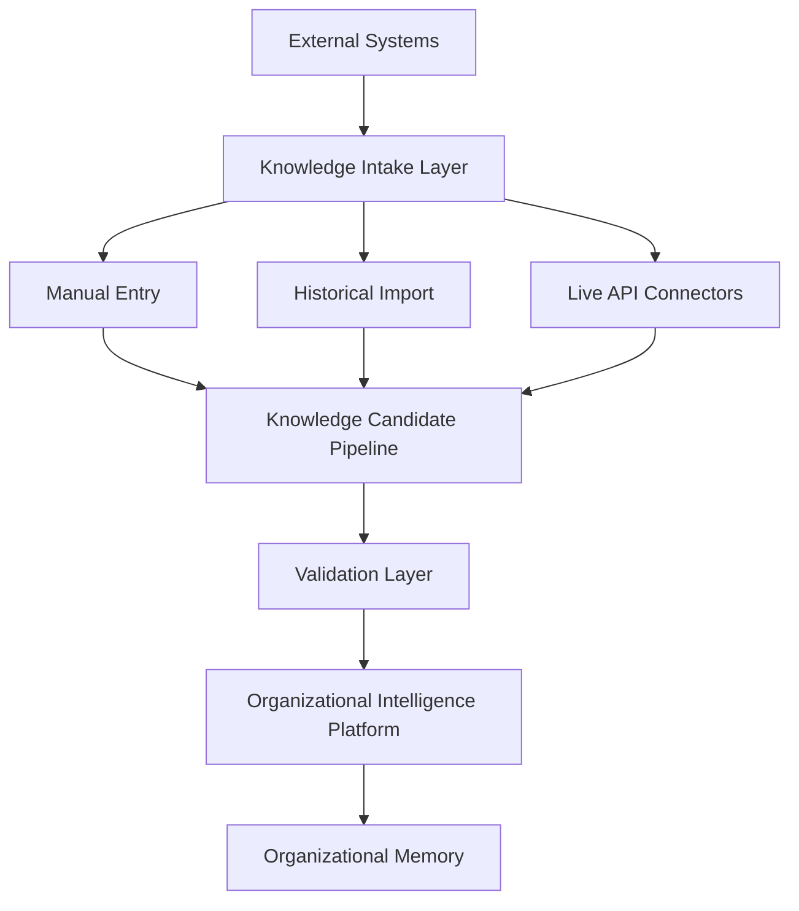
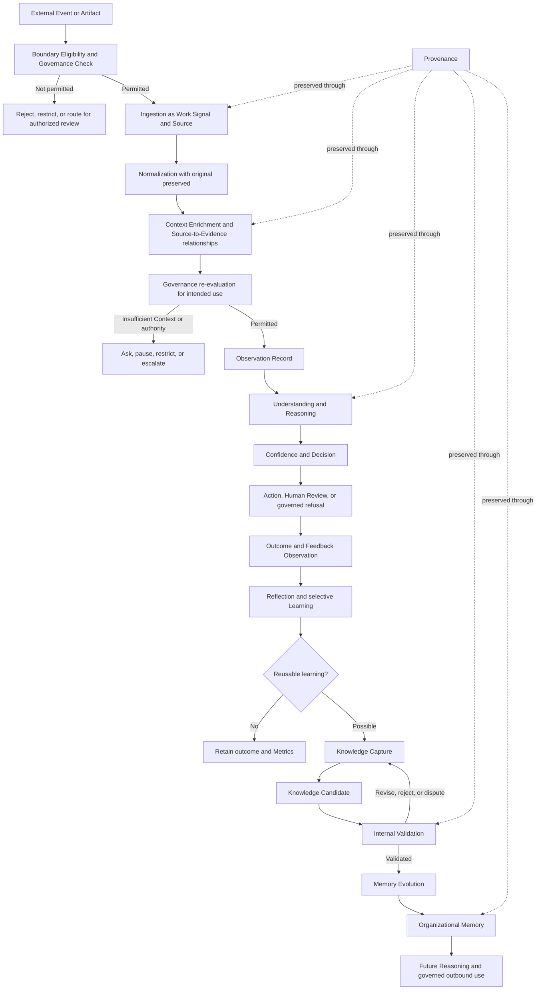
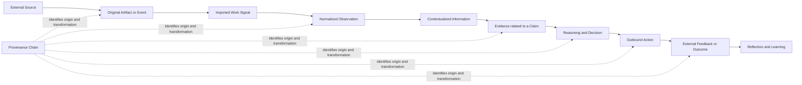
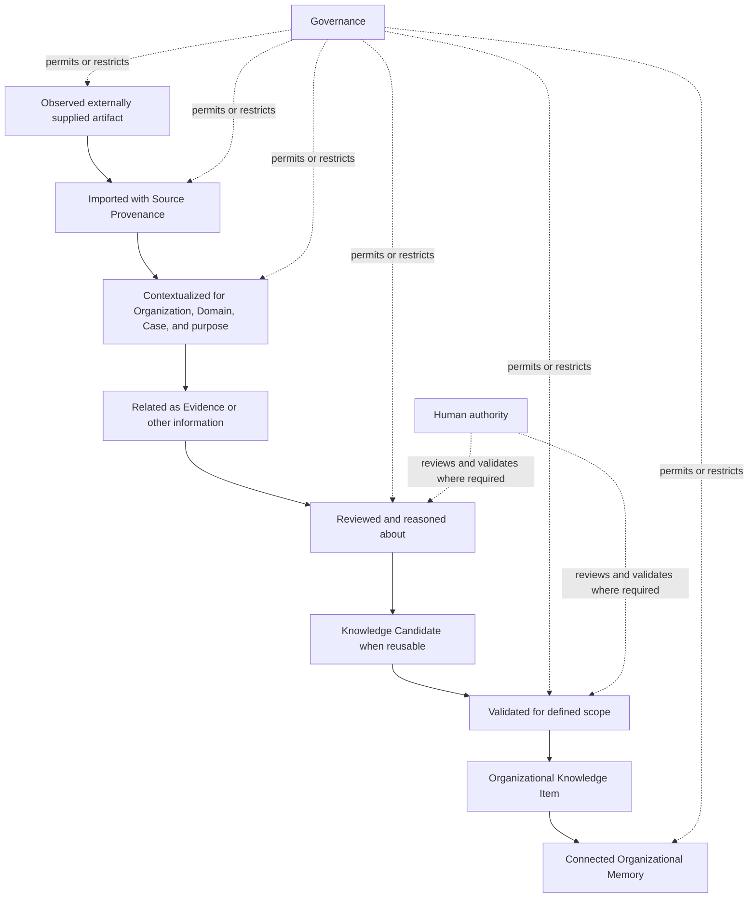
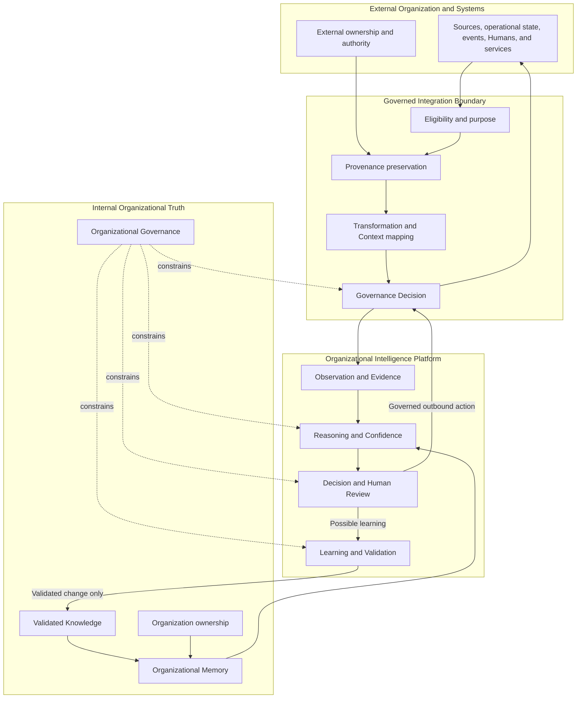
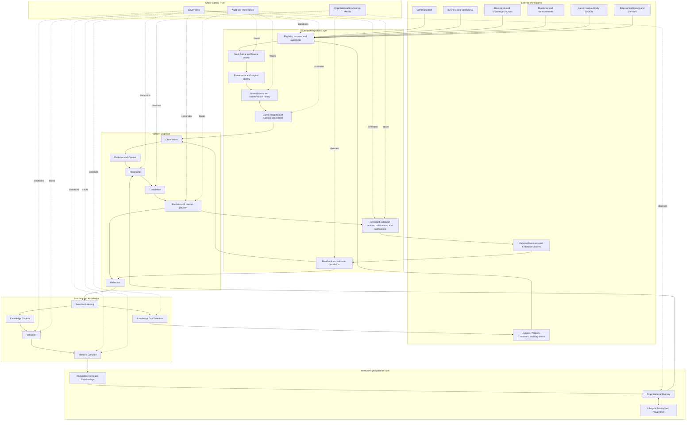
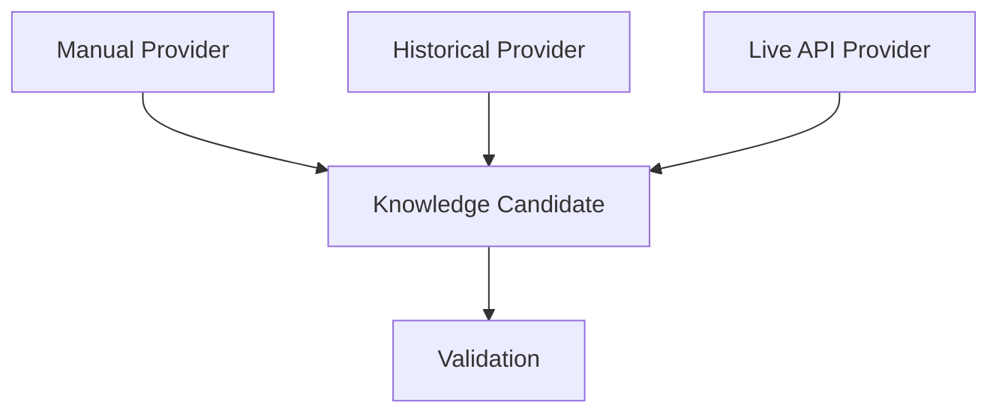
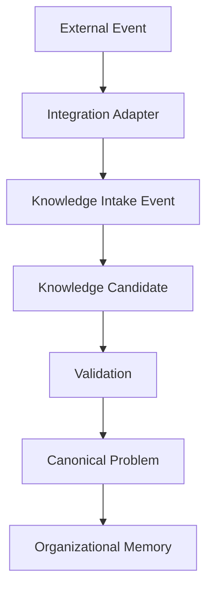
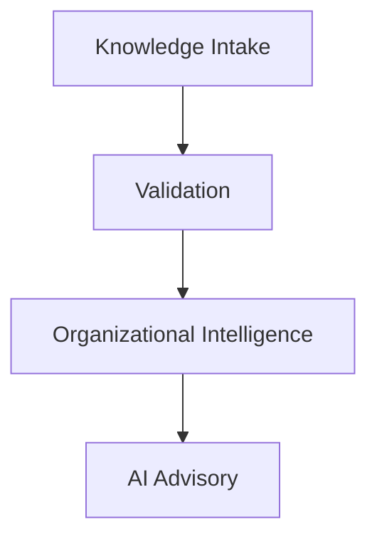

# Integration Architecture

## 1. Introduction

Organizations already operate through many systems. Communication, business operations, documentation, monitoring, identity, finance, customer service, and human collaboration all produce information that may matter to organizational work.

The Organizational Intelligence Platform integrates that information into governed organizational understanding. It does not replace every operational system or declare one of them to be the truth of the Organization.

Integration is not synchronization. Synchronization attempts to make selected state agree across systems. Integration is **governed participation**: an external participant contributes Work Signals, Sources, Evidence, Context, events, requests, or feedback to a workflow whose meaning, authority, Validation, and learning remain controlled by the Organization.

The Integration Architecture defines:

- Which external participants may contribute or receive information.
- Which information may cross each boundary.
- How ownership and Provenance survive the crossing.
- How external information earns trust and becomes useful.
- How Governance constrains every interaction.
- How outcomes and feedback return to organizational learning.
- How integrations can evolve without redefining the platform.

An integrated artifact can be important, authoritative within a limited operational scope, and still not be a Knowledge Item. The platform preserves the artifact as a Source, interprets it in Context, relates it as Evidence, applies Governance, and uses the Canon's learning and Validation paths before it changes Organizational Memory.

### High-Level Integration Architecture

Integrations are not isolated connectors. Each integration is a standardized **Knowledge Intake Provider** that contributes organizational knowledge into a single shared intelligence pipeline. Every provider stops at the Knowledge Candidate boundary; the platform owns relevance, Validation, trust, Governance, Canonical Problems, memory, and learning beyond it.

Integrations stop at the Knowledge Candidate boundary. The Organizational Intelligence Platform owns everything after that. No integration—manual, historical, or live—writes directly into Organizational Memory; every integration produces Knowledge Candidates that must pass Validation. This separates four concerns:

- **External Systems** generate events, expose APIs, and export records.
- **Knowledge Intake** normalizes external information into Knowledge Candidates with Provenance.
- **Organizational Intelligence** owns relevance, Validation, trust, Canonical Problems, memory, learning, and Pattern Discovery.
- **AI Advisory** assists the platform after intake and never bypasses Validation or writes memory.

---

## 2. Relationship to Previous Documents

### Canon Traceability

Derived From:

- [Founder's Thesis](../canon/00_FOUNDERS_THESIS.md)
- [Product Vision](../canon/01_PRODUCT_VISION.md)
- [Product Principles](../canon/02_PRODUCT_PRINCIPLES.md)
- [Product Capability Model](../canon/03_PRODUCT_CAPABILITY_MODEL.md)
- [Product Domain Model](../canon/04_PRODUCT_DOMAIN_MODEL.md)
- [Product Workflow Model](../canon/05_PRODUCT_WORKFLOW_MODEL.md)
- [AI Cognitive Model](../canon/06_AI_COGNITIVE_MODEL.md)
- [System Architecture](./07_SYSTEM_ARCHITECTURE.md)
- [AI Agent Architecture](./08_AI_AGENT_ARCHITECTURE.md)
- [Data Architecture](./09_DATA_ARCHITECTURE.md)
- [Knowledge Representation Model](./10_KNOWLEDGE_REPRESENTATION_MODEL.md)

Canon Version: `v1.0.0`

| Document | Contribution |
| --- | --- |
| Canon | Meaning |
| System Architecture | Responsibility |
| AI Agent Architecture | Cognitive collaboration |
| Data Architecture | Information objects |
| Knowledge Representation | Semantic meaning |
| Integration Architecture | External interaction model |

Integration never redefines the Canon. It provides external signals and participation to responsibilities already defined by the platform. An external ticket may become a Work Signal and Case; it does not redefine Case. An external document may become a Source; it does not redefine Knowledge. An external approval may become Human Evidence of authority; it does not bypass Governance or Validation.

The logical Integration Layer described here is a boundary responsibility that collaborates with Work Intake, Interaction, Orchestration, Governance, Audit and Provenance, and the cognitive and knowledge layers. It is not a new owner of organizational truth.

---

## 3. Integration Philosophy

### External Systems Are Sources, Not Truth

An external system can be the authoritative Source for a limited fact within its operational responsibility—for example, that a payment failed or a package was marked delivered. The platform still determines how that fact relates to a Case, what Evidence it provides, which Context applies, and what the Organization should conclude or do.

### Provenance Is Never Lost

Boundary crossing must preserve Source system, original identity, author, time, authority, original meaning, transformation, and Governance. A normalized representation never replaces the original artifact or conceals how it changed.

### Organizational Memory Is Never Overwritten

No external write, copied article, synchronized field, external AI output, or partner update may directly alter Organizational Memory. External information may create a Work Signal, Evidence, Learning Candidate, Knowledge Candidate, or challenge. Memory changes only through internal Governance, Validation, lifecycle, and Provenance.

### Integration Preserves Ownership

The originating party retains authorship and any source ownership that applies. The Organization owns its Cases, Knowledge Items, Decisions, and Organizational Memory. Copying or transforming information does not silently transfer authority or ownership.

### Trust Is Earned Through Validation

Import, review, frequency, and operational authority do not automatically grant reusable organizational trust. The platform distinguishes a trustworthy operational fact from a validated organizational interpretation of that fact.

### Every External Interaction Is Traceable

Inbound artifacts, outbound Decisions, publications, notifications, transformations, failures, retries, corrections, and feedback should remain connected through Provenance. A future reviewer should understand what crossed the boundary, why, under whose authority, and with what result.

### Human Authority Remains Final

Humans participate through governed Roles. Subject-matter experts, managers, compliance officers, reviewers, and other authorized people can interpret, correct, approve, dispute, and validate according to their Domain and authority. Integration should bring them into the workflow rather than treat them as exceptional endpoints.

### Integrations Are Replaceable

The platform should depend on stable categories, information objects, and semantic obligations rather than a particular external product's terminology or behavior. Replacing one external system should not redefine Work Signal, Source, Evidence, Case, or Knowledge.

### Vendor Independence Is a Design Goal

External identifiers and concepts remain mapped to Canon concepts rather than becoming Canon concepts themselves. Vendor-specific state may be preserved for Provenance while the platform maintains its own stable meaning.

### Organizational Learning Is Internal

External systems contribute experience, Evidence, feedback, and outcomes. The Organization determines what becomes a Learning Event, Knowledge Candidate, validated Knowledge Item, and Organizational Memory.

### Governance Is Continuous

Governance applies before intake, during transformation and Context enrichment, during Reasoning, before outbound action, during feedback collection, and throughout learning. A final boundary check cannot undo prohibited information use earlier in the workflow.

---

## 4. Categories of External Systems

Categories describe the organizational role of an external participant, not a product type. One system may participate in several categories, each with different trust and Governance.

| Category | Typical contribution | Boundary considerations |
| --- | --- | --- |
| **Communication Systems** | Messages, conversations, attachments, participants, delivery and response events. | Preserve original wording, sender, recipients, time, channel Context, consent, and sensitivity; communication is not validated knowledge. |
| **Business Systems** | Customer, order, account, contract, transaction, entitlement, and operational status. | Operational facts may be authoritative within defined scope; interpretation and Decision authority remain governed internally. |
| **Knowledge Systems** | Documents, articles, policies, procedures, comments, versions, and publication history. | Treat content as Sources and possible Evidence; preserve authorship, version, status, and authority; do not equate publication with current Validation. |
| **Operational Systems** | Work orders, inventory, logistics, service state, incidents, process transitions, and outcomes. | Effective time, state ownership, correction history, and operational authority are essential. |
| **Monitoring Systems** | Measurements, alerts, anomalies, thresholds, sensor observations, and health signals. | An alert is an observation, not a Diagnosis; measurement quality, calibration, time, and false-positive Context matter. |
| **Identity Systems** | Identity assertions, group or employment relationships, and authentication Context. | Identity assertion does not grant platform Role, Domain authority, or Validation rights automatically; Governance maps identity to authority. |
| **Human Experts** | Judgment, explanation, Correction, exception knowledge, review, and approval. | Role, Domain, authority, rationale, Evidence, and accountability must be explicit; human input is central but still contextual. |
| **External AI Systems** | Suggested classifications, summaries, predictions, extracted information, or recommendations. | Preserve model or service origin and transformation; output remains an external assertion and never bypasses internal Reasoning, Confidence, Governance, or Validation. |
| **Third-Party Services** | Specialized assessments, reference information, verification, risk signals, or operational actions. | Purpose limitation, Source authority, uncertainty, contractual boundary, and downstream use must remain visible. |
| **Partners** | Shared Cases, fulfillment state, referrals, Decisions within delegated scope, Evidence, and feedback. | Organizational boundaries, delegated authority, shared ownership, permitted disclosure, and conflict resolution are explicit. |
| **Regulators and Standards Authorities** | Rules, official interpretations, notices, decisions, and effective dates. | The external Source may carry formal authority; the Organization still governs interpretation, applicability, implementation, and lifecycle in its memory. |
| **Customers** | Questions, descriptions, preferences, consent, Evidence, Corrections, and outcome feedback. | Customer statements are important Work Signals and may be Evidence; identity, privacy, intent, and Context govern use. |
| **Suppliers** | Product information, availability, incidents, quality evidence, commitments, and changes. | Supplier authority is limited to its scope; claims, effective periods, verification, and dependency impact remain explicit. |

Category does not determine trust by itself. Trust depends on the specific Source, claim, Context, authority, Evidence quality, Governance, and intended use.

---

## 5. Integration Boundaries

The integration boundary defines what external participants may contribute, request, or receive and which internal responsibilities remain nondelegable.

### External Systems May Provide

| Contribution | Internal interpretation |
| --- | --- |
| **Work Signals** | Original events or artifacts that may create or update Cases, reveal gaps, or trigger learning. |
| **Sources** | Origins of imported information, retaining identity, authority, version, time, and ownership. |
| **Evidence** | Information related to a claim as support, contradiction, qualification, or explanation after internal Context is established. |
| **Context** | Customer, account, product, policy, time, location, state, and prior activity relevant to an Issue. |
| **External Events** | Statements that something occurred in an external operational system. They become internal observations and may produce domain events after governed interpretation. |
| **Documents** | Source artifacts containing possible claims, policies, procedures, explanations, or history. |
| **Policies and rules** | External authoritative or advisory material with Source, jurisdiction, effective period, and authority. |
| **Metrics and measurements** | Observed values with definition, scope, time, population, uncertainty, and Source. |
| **Notifications** | Signals that attention or workflow participation is requested. |
| **Human input** | Questions, judgment, Corrections, reviews, approvals, and explanations tied to identity and Role. |
| **Feedback and outcomes** | Reactions, downstream effects, success, failure, contradiction, and recurrence. |

### External Systems Must Never Directly Create

| Protected object or authority | Why it remains internal |
| --- | --- |
| **Validated Knowledge** | Reusable organizational trust requires internal Evidence, scope, authority, Human Review where required, and Validation. |
| **Organizational Memory** | Memory is owned by the Organization and changes only through governed Capture, Validation, lifecycle, and Memory Evolution. |
| **Governance Decisions** | External policy may be a Source, but contextual permission, authority, risk, and accountability are evaluated by organizational Governance. |
| **Validation Records** | Validation records internal criteria, reviewers, authority, scope, and trust decision; an external approval may be Evidence within that process. |
| **Canonical Concepts** | Integration maps external terminology to the Canon; it does not redefine Case, Issue, Evidence, Knowledge, Confidence, or other concepts. |
| **Internal Confidence** | An external confidence value is a Source attribute or Evidence, not the platform's contextual Confidence Assessment. |
| **Final organizational authority** | Authority derives from organizational Role, Domain, purpose, and Governance, not from an external system's ability to send an action. |

### Boundary Rules

1. Every inbound artifact is first represented as a Source or Work Signal before it becomes interpreted information.
2. Every transformation creates a derived representation linked to the original.
3. External identifiers remain Source identifiers and do not replace stable internal identity.
4. Inbound and outbound information is limited to the permitted purpose and recipient.
5. Operational authority is scoped. A system authoritative for delivery state is not authoritative for refund policy interpretation.
6. The platform may publish knowledge outward but remains authoritative for the governed Knowledge Item and its lifecycle.
7. State synchronization is permitted only for explicitly owned operational state and never substitutes for Governance or memory evolution.
8. Boundary failure must not silently downgrade Provenance, Validation, or Uncertainty.

---

## 6. Integration Lifecycle

The integration lifecycle connects an external occurrence to organizational work and, when meaningful, to validated learning.

### External Event → Boundary Eligibility

The platform first determines whether the Source, purpose, Organization, Domain, sensitivity, and intended use permit the interaction. Information should not be imported merely because access is technically possible.

### Ingestion → Normalization

The original artifact and identifier are preserved. Normalization makes form, time, identity, and basic structure intelligible without changing semantic authority. The normalized object is derived from—not a replacement for—the Source.

### Normalization → Context Enrichment

The platform relates permitted customer, account, product, policy, history, and Domain Context. External statements become Evidence only when related to explicit claims. Missing Context remains visible.

### Context → Observation

An Observation Record distinguishes what occurred or was reported from the platform's interpretation. Imported classifications and external AI outputs remain attributed assertions.

### Observation → Reasoning and Decision

The platform applies its cognitive cycle using current Organizational Memory, Evidence, Governance, and Confidence. External operational state informs the Decision but does not make the Decision automatically.

### Action → Outcome and Feedback

Authorized Actions may return to external systems, Humans, or Customers. Delivery, acceptance, failure, Correction, and downstream state become new Work Signals with full correlation to the original Case and Decision.

### Outcome → Learning → Memory

Reflection determines whether the integration revealed a reusable lesson, conflict, or Knowledge Gap. Any candidate follows internal Capture, Validation, lifecycle, and Memory Evolution. External repetition never becomes memory directly.

Governance is not one lifecycle stage. It is shown at boundary and intended-use checkpoints and remains active throughout every transition.

---

## 7. Integration Patterns

Patterns describe stable semantic interactions. They do not prescribe a protocol or transport.

| Pattern | Direction | Purpose | Required boundaries |
| --- | --- | --- | --- |
| **Inbound Information** | External → Platform | Contribute messages, records, documents, state, measurements, or other Work Signals. | Preserve Source and original meaning; establish purpose and Governance; normalize without granting trust. |
| **Outbound Decision** | Platform → External | Communicate or enact an authorized Decision in an operational system or human workflow. | Require Reasoning, Confidence, Governance, and authority; preserve Decision and Action Provenance; observe outcome. |
| **Human Collaboration** | Bidirectional | Request Context, expertise, review, approval, Correction, conflict resolution, or Validation. | Verify identity and Role; provide sufficient Context; preserve rationale and independent judgment. |
| **Knowledge Publishing** | Platform → External | Present validated Knowledge Items through documents, guidance, or operational experiences. | Publish only permitted current scope and version; retain canonical internal ownership; propagate challenge, deprecation, or replacement status. |
| **Event Subscription** | External → Platform | Observe selected external occurrences that may matter to Cases, knowledge, or outcomes. | Treat event as a Source assertion; preserve identity, time, ordering Context, and missing-event uncertainty. |
| **Event Publication** | Platform → External | Notify interested participants that an internal domain transition occurred. | Publish only authorized facts and permitted detail; event does not expose hidden Reasoning or sensitive knowledge by default. |
| **Workflow Participation** | Bidirectional | Allow an external participant to complete an assigned step, supply Evidence, or receive work state. | Internal orchestration owns workflow truth; participant authority and expected artifact are explicit. |
| **Reference Query** | Bidirectional | Request a current external fact or permitted state needed for Context. | Record query purpose, Source response, effective time, authority, and failure; response is not reusable knowledge automatically. |
| **Evidence Submission** | External → Platform | Submit information intended to support, challenge, or qualify a claim. | Preserve Source and claim relationship; Validation determines sufficiency; submitter authority remains scoped. |
| **Feedback Collection** | External → Platform | Observe User reaction, success, failure, correction, recurrence, and downstream effect. | Feedback remains Outcome Evidence requiring interpretation; sentiment or acceptance is not proof of correctness. |
| **State Synchronization** | Bidirectional or directed | Keep explicitly selected operational state aligned where one owner is defined. | Define source of operational authority per state; preserve conflicts and correction history; exclude Knowledge trust, Validation, Governance, and memory state. |
| **Notification** | Platform → External | Bring the right participant's attention to review, escalation, gap, conflict, or change. | Include only permitted Context; notification does not transfer Decision authority; response returns through governed workflow. |
| **Knowledge Challenge** | External → Platform | Report that published or applied knowledge may be wrong, stale, incomplete, or inapplicable. | Create a challenge or Work Signal, not direct modification; preserve challenger, Evidence, Context, and affected item. |
| **Outcome Confirmation** | External → Platform | Confirm that a physical, financial, operational, or human outcome occurred. | Preserve Source authority and time; distinguish confirmation from interpretation of success. |

### Pattern Composition

A Case may combine several patterns. An inbound customer message creates a Work Signal; a Reference Query adds operational Context; an Outbound Decision requests an action; an Outcome Confirmation reports completion; Feedback Collection reveals failure; a Knowledge Challenge begins learning.

Composition must preserve one Provenance chain. Each pattern contributes an artifact or event with bounded authority. No combination of patterns bypasses the internal Validation path.

---

## 8. External Sources and Provenance

Provenance must cross the integration boundary intact. Every imported artifact should preserve:

| Provenance element | Meaning |
| --- | --- |
| **Source System** | The external organizational participant or system that originated or supplied the artifact. |
| **Original Identifier** | The identity assigned by the Source, preserved alongside stable internal identity. |
| **Creation Time** | When the artifact or event was created at the Source. |
| **Effective Time** | When the represented fact, policy, state, or measurement applied. This may differ from creation and import time. |
| **Author or Actor** | The human, organization, device, process, or external intelligence that produced the content or event. |
| **Authority** | The Source's authority for the specific claim or state, including scope and limitations. |
| **Original Representation** | The content or stable reference as supplied, before normalization or interpretation. |
| **Transformation History** | Every normalization, mapping, enrichment, extraction, redaction, correction, or derived assertion. |
| **Import Time** | When the platform received and recognized the artifact. |
| **Integration Identity** | Which governed external relationship and purpose permitted the exchange. |
| **Governance Status** | Applicable sensitivity, permitted uses, restrictions, retention obligations, and required review. |
| **Validation Status** | Whether the artifact is merely imported, reviewed as Evidence, or involved in validated knowledge. Import itself grants no Validation. |
| **Relationship to Cases** | Which Cases, Issues, Context Packages, Evidence, Decisions, outcomes, or Knowledge Candidates used the artifact. |
| **Correlation History** | Which outbound actions, feedback, corrections, and later external events relate to it. |

### Transformation Rules

- Original and transformed representations remain linked and distinguishable.
- A transformation states what changed, why, by whom or what, and with what loss or uncertainty.
- Extracted claims remain derived assertions and point back to exact Source Context.
- Redaction limits presentation but should preserve a governed link to full Provenance where permitted.
- Failed or partial imports remain observable; absence created by integration failure must not be mistaken for absence in the Source.
- Source corrections create linked updates rather than rewriting what the platform previously observed.

Provenance is mandatory because integrated information often travels far from its origin. Without it, an operational status can be mistaken for policy, an old document for current guidance, a prediction for fact, or a partner assertion for organizational authority.

---

## 9. Trust Model

Trust across an integration boundary is earned through explicit transitions. The following terms describe different dimensions and stages; they are not a single score.

| Trust term | Meaning | What it does not mean |
| --- | --- | --- |
| **Observed** | The platform preserved that an external artifact, event, or statement was encountered. | The represented claim is true. |
| **Imported** | The artifact crossed a permitted boundary and retained Source Provenance. | It is understood, applicable, or reviewed. |
| **Contextualized** | The artifact is related to Organization, Domain, Case, Issue, time, and intended use. | It is sufficient Evidence. |
| **Reviewed** | An authorized human or responsibility examined the information for a stated purpose. | It is universally approved or validated knowledge. |
| **Validated** | A claim or Knowledge Candidate earned organizational trust for a defined scope using appropriate Evidence and authority. | Every use in every Case has high Confidence. |
| **Governed** | A specific use, disclosure, transformation, or change is permitted under Governance. | The content is true. Governance constrains every stage rather than appearing only after Validation. |
| **Organizational Knowledge** | Validated reusable understanding exists as a Knowledge Item with Context, authority, lifecycle, relationships, and Provenance. | The external Source becomes owner of Organizational Memory. |

### Trust Rules

- Trust attaches to a claim, Source, scope, and use—not to an external system universally.
- A Source may be authoritative for one operational fact and irrelevant to another.
- Imported external confidence remains an attribute of the external assertion; the platform performs its own Confidence Assessment.
- Review and Validation preserve reviewer Role, Evidence, rationale, Domain, and effective time.
- Governance can prohibit use of true information; permission and truth remain separate.
- Trust can decrease when Sources change, Evidence conflicts, knowledge becomes stale, or outcomes challenge prior understanding.

---

## 10. Event Integration

An external event is a Source assertion that something occurred outside the platform. An internal domain Event records that the platform observed or completed a meaningful transition under its own concepts and Governance.

The translation preserves both identities. The external event is never overwritten by the internal interpretation.

| External occurrence | Internal representation | Possible internal Event after interpretation |
| --- | --- | --- |
| **Email Received** | Work Signal and Source with sender, recipients, time, content, and channel Context. | Observation Recorded; Case Created or Updated; Issue Identified. |
| **Ticket Created** | Work Signal referencing external work identity and state. | Case Created when the platform establishes a bounded unit of work. |
| **Customer Replied** | New Work Signal related to Case and prior outbound Action. | Observation Recorded; Context Revised; Outcome Observed. |
| **Package Delivered** | External operational state assertion with Source authority and effective time. | Evidence Added; Outcome Observed; Resolution Recorded if workflow criteria are met. |
| **Payment Failed** | Operational event and possible Evidence with reason and account Context. | Observation Recorded; Issue Identified; Confidence Changed or escalation triggered. |
| **Policy Updated** | Versioned Source document or policy event with authority and effective period. | Knowledge Challenged; Validation Requested; Governance Boundary Changed where applicable. |
| **Sensor Triggered** | Measurement or alert with Source, calibration Context, time, and threshold. | Observation Recorded; Evidence Added; Case Created when organizational work is warranted. |
| **Human Submitted Correction** | Human input with identity, Role, rationale, corrected object, and Evidence. | Human Corrected; Reflection Created; Learning Event Created when reusable. |
| **Partner Completed Action** | External outcome assertion related to authorized outbound Decision. | Outcome Observed; Resolution Recorded after internal criteria are evaluated. |
| **External AI Suggested Classification** | Attributed derived assertion with external confidence and Source Context. | Observation Recorded; no internal classification or Decision Event until platform Understanding and Reasoning occur. |

### Event Translation Rules

1. Preserve the external event type and payload identity for Provenance.
2. Map meaning to Canon concepts without adopting external terminology as authoritative.
3. Distinguish Source creation time, occurrence time, receipt time, and internal Event time.
4. Treat missing, duplicate, delayed, reordered, corrected, or conflicting external events as explicit uncertainty.
5. Do not infer a completed internal transition merely because an external state changed.
6. Publish internal Events outward only within Governance and without exposing restricted cognitive artifacts.
7. Correlate outbound Actions with later external events so outcomes and learning remain traceable.

Events decouple participation: an external system reports what it owns, while internal responsibilities determine how the occurrence affects Cases, Decisions, knowledge, and learning.

---

## 11. Human Collaboration

Humans are authoritative participants in integrated workflows, not external exceptions. Integration should make their identity, Context, Evidence, Role, authority, and rationale visible enough for responsible collaboration.

| Human participant | Typical contribution | Required representation |
| --- | --- | --- |
| **Subject-Matter Expert** | Diagnosis, nuance, exception, interpretation, or reusable lesson. | Human Review Record, Domain Role, Evidence considered, rationale, scope, and authority. |
| **Customer Support Agent** | Case Context, Answer, Correction, escalation, outcome, and frontline learning. | Case participation, Action or Correction, Reflection input, and possible Learning Candidate. |
| **Manager** | Approval, exception authority, quality judgment, escalation resolution, and policy intent. | Role-specific Decision or Human Review with limits and rationale. |
| **Compliance Officer** | Governance interpretation, restriction, approval requirement, and audit judgment. | Governance Decision or authoritative review tied to boundary, purpose, and effective period. |
| **Reviewer** | Independent assessment of Reasoning, Decision, or Knowledge Candidate. | Review request, complete Context, decision, rationale, Evidence, and independence as required. |
| **Validator** | Grants, narrows, disputes, or rejects knowledge trust within Domain authority. | Human Review linked to Validation Record, scope, criteria, and authority. |
| **Auditor** | Examines whether Provenance, Governance, authority, and process were preserved. | Governed read of history and an audit finding; audit access does not grant power to change Domain truth. |
| **Customer** | Question, intent, consent, Evidence, Correction, and outcome feedback. | User identity or relationship, Work Signal, Context, consent, and feedback Provenance. |

### Human Collaboration Rules

- Verify the Role for the specific action, not only identity or job title.
- Present sufficient Context, Evidence, Reasoning, Confidence, and alternatives for genuine judgment.
- Allow Humans to disagree, revise, request more information, or decline authority.
- Preserve human rationale, not only approval status.
- Distinguish one-Case judgment from reusable organizational knowledge.
- Route reusable expertise through Learning, Capture, and Validation.
- Do not expose sensitive information merely because a reviewer participates in another Domain.
- Make interruption purposeful: involve Humans where expertise, authority, consequence, conflict, or learning requires them.

Human collaboration integrations should reduce repeated requests for the same expertise by turning meaningful judgment into governed memory—without treating Humans as rubber stamps.

---

## 12. Organizational Boundaries

Organizational knowledge remains owned by the Organization even when Sources, workflows, Humans, and Actions cross system and organizational boundaries.

### Boundary Principles

- External ownership of a Source remains visible after import.
- The receiving Organization owns its interpretation, Decisions, Knowledge Items, and Organizational Memory.
- Shared or partner workflows define which Organization owns each state, Decision, and knowledge claim.
- Delegated authority is explicit, narrow, revocable, and governed.
- Knowledge copied outward remains a publication of the internal item, not a transfer of canonical ownership unless an explicit organizational agreement says otherwise.
- Cross-Organization learning requires permission for both Source use and derived knowledge; derived insight must not reveal restricted Source content.
- Governance determines whether information may cross, how it may be transformed, who may receive it, and whether feedback may be learned from.

The platform sits above operational systems as an intelligence layer, not above organizational authority. It does not claim ownership of the Organization's knowledge. It provides the governed structure through which that knowledge can be preserved and compounded.

---

## 13. Integration Anti-Patterns

| Anti-pattern | Why it violates the Canon |
| --- | --- |
| **CRM equals truth** | Treats one operational system's records as complete organizational understanding and ignores Context, Evidence, conflict, and Validation. |
| **Help desk equals Case model** | Lets external ticket structure redefine the broader Canon concept of Case and Issue. |
| **Vendor lock-in at the semantic boundary** | Makes external identifiers, states, or terminology the platform's conceptual model and prevents replaceability. |
| **Lost Provenance** | Makes imported facts, transformations, authority, and later Decisions impossible to trace. |
| **Direct memory updates** | Allows external content or state to bypass Capture, Validation, lifecycle, Governance, and history. |
| **External AI bypasses Validation** | Turns generated or predicted output into organizational truth without internal Evidence, Confidence, authority, or review. |
| **Synchronization replaces Governance** | Assumes matching fields imply permitted, correct, or authoritative state. |
| **Knowledge copied without ownership** | Loses who owns, validates, updates, restricts, and withdraws the knowledge. |
| **Untrusted automation** | Lets inbound state trigger consequential action without internal Reasoning, Confidence, authority, and Governance. |
| **Hidden transformations** | Prevents a reviewer from understanding how original content became a claim, classification, metric, or Action. |
| **Duplicate authority** | Allows multiple systems to claim ownership of the same state without explicit conflict and precedence rules. |
| **External identifiers become internal identity** | Couples organizational history to one replaceable Source and creates collision or loss during change. |
| **Latest external value wins** | Erases correction history, effective time, conflict, and Source authority. |
| **Import everything because access exists** | Ignores purpose limitation, privacy, sensitivity, noise, and Governance. |
| **Outbound publication without lifecycle** | Leaves stale or replaced guidance active in external channels. |
| **Feedback equals truth** | Treats acceptance, sentiment, or repetition as proof rather than Outcome Evidence requiring interpretation. |
| **Integration failure appears as no data** | Makes unavailable, delayed, or partial Sources look like negative facts and produces false Reasoning. |
| **Human approval without Role Context** | Treats identity or title as authority and creates ungoverned validation. |
| **Partner workflow without ownership boundaries** | Makes Cases, Decisions, corrections, and knowledge changes impossible to attribute or govern. |
| **One global trust score per external system** | Ignores that authority and reliability vary by claim, Domain, time, Context, and intended use. |

---

## 14. Reference Integration Model

### Reading the Reference Model

1. **External participants** contribute operational information, Humans, authority Sources, and outcomes.
2. The **Integration Layer** establishes eligibility, purpose, ownership, Provenance, normalization, and Canon mapping before information enters cognition.
3. **Platform cognition** observes, contextualizes, reasons, assesses Confidence, and selects a governed Decision.
4. **Outbound integration** executes or publishes only authorized behavior and correlates feedback to the original Case and Decision.
5. **Reflection and learning** determine whether integrated work produced a reusable lesson or gap.
6. **Validation and Memory Evolution** are the only path by which external experience can change Organizational Memory.
7. **Governance, Audit, and Metrics** constrain and observe every path without becoming Domain truth.

The diagram intentionally separates External Knowledge Sources from internal Knowledge Items. Information may flow in both directions; organizational truth has one governed internal lifecycle.

---

## 15. Traceability Matrix

| Canon concept or architectural rule | Integration realization |
| --- | --- |
| Organization | Owning boundary for Cases, Decisions, Knowledge Items, Governance, and memory |
| Domain | Canon mapping, Domain-specific authority, Evidence standards, and boundary rules |
| User and Role | External identity assertion mapped to governed internal User and contextual Role |
| Work Signal | Imported external event or artifact with Source Provenance |
| Case | Internal bounded work that may reference but is not defined by an external ticket |
| Issue | Internal problem framing derived through Understanding, not external category alone |
| Context | Governed enrichment from permitted external facts, history, and operational state |
| Source | External system, Human, partner, authority, document, measurement, or service |
| Evidence | Imported information explicitly related to a claim within Context |
| Observation | Internal record of what the external Source reported or what was observed |
| Reasoning | Internal cognition over Evidence, Context, Organizational Memory, and Governance |
| Confidence | Internal assessment; external confidence remains attributed Evidence |
| Decision | Internal Decision Proposal and authority; outbound action is a separate execution |
| Answer and Action | Governed outbound integration with Provenance and material limits |
| Outcome | Correlated external feedback, operational change, or human response |
| Human Review | Collaborative integration with identity, Role, Context, rationale, and authority |
| Learning Event | Internal reflection on integrated work and outcomes |
| Knowledge Candidate | Internal Capture of a reusable lesson from external and internal Evidence |
| Validation | Internal workflow with appropriate human and Domain authority |
| Knowledge Item | Internally validated semantic representation; may be published outward |
| Organizational Memory | Internal only; owned by the Organization and changed through Memory Evolution |
| Knowledge Lifecycle | Outbound publications track active, challenged, stale, deprecated, and replaced state |
| Provenance | Source metadata, original identity, transformation history, authority, import, use, and correlation |
| Governance Boundary | Integration eligibility, purpose, permitted use, disclosure, transformation, and learning |
| Governance Decision | Internal contextual evaluation; external policy is a Source, not the decision itself |
| Knowledge Gap | Repeated integration failures, missing Context, low Confidence, conflict, or external dependency patterns |
| Knowledge Flywheel | External work → internal Reasoning → outbound Action → feedback → learning → Validation → memory → better future work |
| Visible Uncertainty | Partial, delayed, conflicting, missing, or low-authority external information remains explicit |
| Memory Before Automation | External state cannot trigger trusted automation without memory, Reasoning, Confidence, authority, and Governance |
| Human expertise as source of trust | Human collaboration and Validation preserve expert judgment and rationale |
| Support first, not final | Category-based integration model works across communication, operations, finance, HR, legal, healthcare, manufacturing, and other Domains |
| Event-oriented learning | External events translate into internal domain Events with both identities preserved |
| Vendor independence | Stable Canon mapping and internal identity keep external terminology replaceable |
| AI is not the intelligence | External or internal AI contributes bounded artifacts; system intelligence includes Humans, memory, Validation, Governance, workflow, and outcomes |

Every integration responsibility traces to an existing Canon concept or architectural boundary. Integration creates no independent route to truth.

---

## 16. Knowledge Intake Providers

Section 4 categorizes external systems by their organizational role. This section categorizes them by how knowledge enters the platform. Every integration—regardless of vendor—belongs to one of three intake categories, and every category produces Knowledge Candidates rather than trusted memory.

### Manual Provider

Captures expertise that exists only in people's experience.

Examples:

- Subject-Matter Experts.
- Managers.
- Team Leads.
- Internal Contributors.

A Manual Provider lets an authorized person contribute a lesson, exception, or interpretation directly. The contribution becomes a Knowledge Candidate with the contributor's identity, Role, and rationale preserved as Provenance.

### Historical Provider

Recovers organizational knowledge that already exists but has not yet been validated by the platform.

Examples:

- PDF archives.
- Word documents.
- Knowledge bases.
- Wiki exports.
- CSV exports.
- Legacy databases.

Imported content becomes Knowledge Candidates. It never becomes trusted memory automatically. A historical document is a Source: it may be stale, superseded, or wrong, so it enters the same Validation path as any other candidate.

### Live API Provider

Captures work while Context is still fresh.

Examples:

- Zendesk.
- Freshdesk.
- Jira Service Management.
- Salesforce.
- HubSpot.
- Slack.
- Microsoft Teams.
- Gmail.
- Google Workspace.
- Internal ERP systems.
- Internal CRM systems.

A Live API Provider observes ongoing operational work and turns relevant events into Knowledge Candidates close to the moment they occur. This is the current MVP direction, focused on live customer support work.

---

## 17. Knowledge Intake Flow

Every Knowledge Intake Provider follows the same downstream intelligence pipeline. The provider differs only at the point of capture; once an external occurrence becomes a Knowledge Intake Event, the path to Organizational Memory is identical. This is the provider-agnostic spine of the full governed lifecycle in Section 6.

- **External Event** — an occurrence, record, or contribution from any provider category.
- **Integration Adapter** — normalizes the external form into a common representation while preserving the original and its Provenance.
- **Knowledge Intake Event** — records that a governed capture occurred through a specific intake door.
- **Knowledge Candidate** — the structured proposal derived from intake.
- **Validation** — grants or withholds organizational trust for a defined scope.
- **Canonical Problem** — organizes validated knowledge into durable organizational understanding.
- **Organizational Memory** — the connected body of trusted, governed knowledge.

Because every integration converges on this single pipeline, adding a new provider does not add a new intelligence engine. It adds a new way to reach the same Knowledge Candidate boundary.

---

## 18. Integration Responsibility Boundary

Section 5 defines what may cross the boundary. This section makes the division of responsibility explicit so that new connectors know where their responsibility ends.

External systems are responsible for:

- Generating events.
- Exposing APIs.
- Exporting records.

The Organizational Intelligence Platform is responsible for:

- Relevance.
- Validation.
- Trust.
- Governance.
- Canonical Problems.
- Memory.
- Learning.
- Pattern Discovery.

This boundary is explicit and non-negotiable. An external system is never responsible for deciding what is relevant, what is trusted, or what becomes memory; the platform is never dependent on an external system to perform those responsibilities. The boundary is the Knowledge Candidate: external systems deliver up to it, and the platform owns everything beyond it.

---

## 19. Organization Profile and Integration Scope

Every integration is scoped by an Organization Profile. The same connector is not a single fixed behavior; it is configured and constrained by the Organization it serves.

An Organization Profile determines:

- Enabled integrations.
- Supported Domains.
- Business vocabulary.
- Governance policies.
- Relevance rules.
- Supported issue categories.

The same connector may behave differently for different organizations. A Live API Provider connected to the same external product may capture different events, map them to different Domains and issue categories, apply different Governance, and judge relevance differently depending on the Organization Profile. Integration behavior is therefore organization-specific, consistent with the organization-scoped representation defined in the Knowledge Representation Model.

---

## 20. AI Integration Position

AI providers are not Knowledge Intake Providers. They do not contribute organizational knowledge across the boundary; they assist the platform after knowledge has been captured.

AI may assist with:

- Understanding.
- Categorization.
- Canonical suggestions.
- Enrichment.
- Customer drafting.

AI never:

- Imports knowledge.
- Bypasses Validation.
- Updates memory directly.
- Overrides Governance.

An AI provider is an advisory service that operates inside the platform's cognition, not an external system that writes across the integration boundary. Its outputs are advisory representations preserved as Provenance and become consequential only when accepted through Validation, consistent with the AI data boundary in the Data Architecture.

---

## 21. Connector Principles

These principles summarize how any integration should behave as a Knowledge Intake Provider.

1. Every integration creates Knowledge Candidates.
2. Integrations never write directly into Organizational Memory.
3. Every integration preserves Provenance.
4. Integration adapters normalize external data before Validation.
5. Organization Profile determines connector behavior.
6. AI providers are advisory services, not system integrations.
7. All integrations converge into one Organizational Intelligence pipeline.
8. New integrations should reuse existing Validation, trust, memory, and learning components.

---

## 22. Integration Roadmap

### Future Knowledge Intake Providers

The provider model is designed to expand across many knowledge sources without changing the intelligence pipeline. Future connector categories include:

- Customer Support.
- HR Systems.
- ITSM Platforms.
- ERP.
- CRM.
- Legal Systems.
- Manufacturing Systems.
- Clinical Systems.
- IoT Events.
- Email.
- Chat Platforms.
- Documentation Platforms.

These are different knowledge sources, not different intelligence engines. Each becomes another Knowledge Intake Provider feeding the same Knowledge Candidate pipeline, Validation, Canonical Problems, memory, and learning.

### Current MVP Scope

The current prototype focuses on:

- Live Customer Support Workflow.
- Local Organizational Memory.
- Local AI Advisory.

Future releases expand the number of Knowledge Intake Providers without changing the Organizational Intelligence architecture.

---

## 23. What This Document Does Not Define

This document intentionally excludes:

- API specifications or endpoints.
- REST, GraphQL, gRPC, or other interface styles.
- MCP servers.
- OAuth or authentication protocols.
- Transport and streaming protocols.
- Message queues, topics, or brokers.
- Webhooks and callback mechanisms.
- SDKs and client libraries.
- Integration frameworks or vendor products.
- Field-level payload schemas and serialization.
- Retry, batching, and throughput implementation.
- Deployment topology and infrastructure.
- Network security implementation.
- Connector-specific configuration.

Those choices belong in future implementation documents. They must target Canon Version `v1.0.0`, declare their direct derivations, and preserve this architecture's ownership, Provenance, trust transitions, Governance, event meaning, and memory boundary.

---

## 24. Closing

The Organizational Intelligence Platform is not another isolated enterprise application. It is the organizational intelligence layer that sits above and across existing systems.

Existing systems continue performing operational work. Communication systems carry conversations. Business systems maintain transactions and state. Monitoring systems observe operations. Knowledge systems publish documents. Humans exercise expertise and authority.

The platform transforms that operational information into organizational understanding. It preserves Sources, builds Context, relates Evidence, reasons from Organizational Memory, exposes Uncertainty, coordinates human judgment, observes outcomes, and turns validated learning into stronger future capability.

Integrations allow information to enter and leave the platform. They never redefine organizational truth. External systems do not write Organizational Memory, grant themselves Validation, or replace Governance. They participate through explicit, traceable, replaceable boundaries.

The Canon remains authoritative. The Organization owns its knowledge. The platform preserves and compounds that knowledge across every integrated system.
