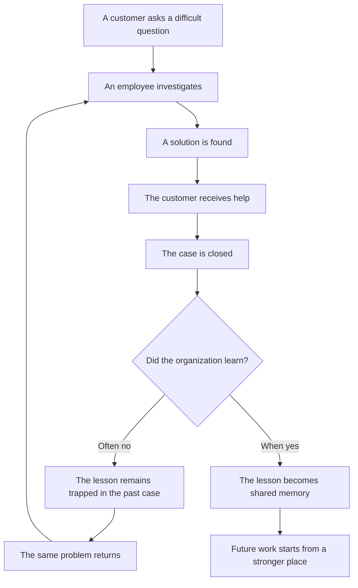
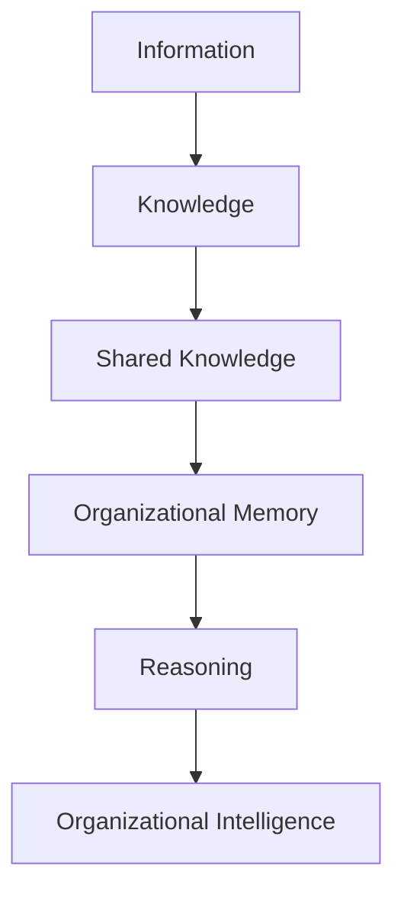
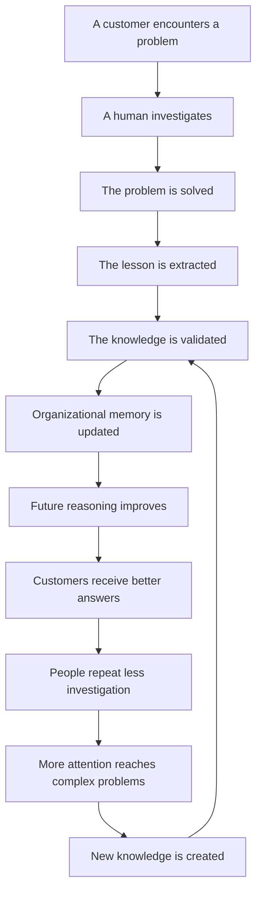
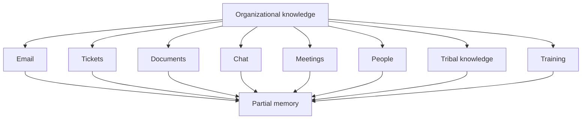
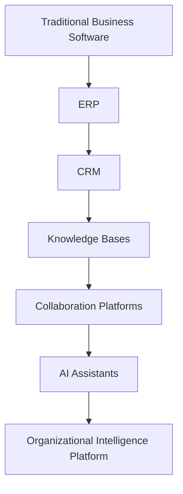

# Founder's Thesis

## Why This Company Deserves To Exist

Every company is an accumulation of what its people have learned.

The products, processes, decisions, exceptions, habits, language, judgment, and customer understanding inside an organization are not created all at once. They are earned slowly. They are built through difficult questions, mistakes, escalations, conversations, investigations, and repeated attempts to understand reality more clearly.

Most of this knowledge is expensive to create.

Very little of it is treated as an asset.

Companies measure revenue, expenses, churn, satisfaction, speed, volume, conversion, and retention. They measure what moves through the business. They measure what customers do. They measure what employees produce. But they rarely measure what the organization learns, what it forgets, or how much human expertise disappears before it can strengthen the company.

This is the problem we exist to solve.

We are beginning with customer support because support is where organizational forgetting is most visible. A customer asks a question. An employee investigates. A solution is found. A response is sent. The ticket is closed. The work disappears into an archive. The same question returns later, and the organization begins again.

This pattern is so common that most companies no longer notice it.

They call it support volume.

We call it the cost of forgetting.

> The hidden cost is not that customers ask questions.  
> The hidden cost is that companies keep paying to rediscover answers they once possessed.

The company we are building is not fundamentally a customer support company. It is a company about organizational memory, human expertise, and the belief that knowledge should compound.

Customer support is the first proving ground. The mission is larger.

We believe organizations deserve software that remembers what their people worked so hard to learn.

---

## Never Let Knowledge Become a Lost Archive

There is one belief beneath every chapter of this thesis:

> Organizations should never lose knowledge simply because work has finished, people leave, or information becomes buried inside disconnected systems.

Left alone, knowledge does not stay knowledge. It decays. It scatters into tickets, emails, chats, documents, and the private memory of the people who did the work. Each of these places was built to move information, not to preserve understanding. A closed ticket does not remember why the answer was correct. An old email does not know it has gone out of date. A departed employee's judgment does not transfer to whoever takes their place.

Given enough time, this is what happens to every organization that does not fight it: their knowledge becomes an archive. Searchable, perhaps. Storable, certainly. But no longer alive. No longer trusted. No longer useful to the person who needs it next.

We refuse to accept that outcome.

The purpose of the Organizational Intelligence Platform is to continuously capture what an organization learns, validate it before it is trusted, and preserve it before it becomes organizational entropy — before a ticket closes into silence, before an email disappears into a thread no one reopens, before an expert walks out the door with knowledge no one wrote down.

A lost archive is a company that used to know something.

A living memory is a company that still does.

---

## 1. The World Has Misunderstood Customer Support

Customer support is usually described as a communication function.

This is understandable. The visible object is a message. A customer writes in. A company replies. The system appears to be about routing, responding, resolving, and closing.

For decades, support software has largely followed that framing. It has helped companies receive messages, assign them, prioritize them, reply to them, and report on them. This was useful work. It made support more organized. It helped teams handle volume. It made accountability clearer.

But it also shaped the industry's imagination.

If support is understood primarily as communication, then the natural goal is faster communication. Shorter response times. More efficient replies. More deflection. More automation at the point of contact.

Those goals are not wrong. But they are incomplete.

A customer question is rarely just a request for words. It is often a sign that something inside the organization is hard to understand, hard to find, inconsistently explained, or not yet captured as shared knowledge.

When customers ask the same question repeatedly, the company does not merely have a messaging problem. It has a knowledge problem.

When two agents give different answers, the company does not merely have a training problem. It has a knowledge consistency problem.

When a new employee needs months to become effective, the company does not merely have an onboarding problem. It has a knowledge transfer problem.

When an experienced employee leaves and the team suddenly feels less capable, the company does not merely have a staffing problem. It has a memory problem.

Support is where this becomes visible because support receives the questions the organization has not made easy enough to answer.

### The Symptom and the Cause

| What Companies See | What Is Often Happening Underneath |
|---|---|
| Customers keep asking the same question | The answer exists but has not become reusable knowledge |
| Agents escalate common cases | Critical expertise is trapped in a few people |
| Response time is slow | Trusted knowledge is hard to locate |
| Answers are inconsistent | The organization has multiple unofficial truths |
| New agents struggle | Learning is carried through interruption, not memory |
| Help content becomes stale | Knowledge is not connected to daily work |
| Support costs rise | The company repeatedly pays for the same learning |

The visible surface is communication.

The deeper structure is knowledge.

### Chapter Summary

Customer support has been treated as a messaging problem because messages are what teams can see and count. But the recurring pain inside support comes from something deeper: the organization does not preserve, update, and distribute what it learns. Support is not the mission. It is the clearest doorway into the real mission.

---

## 2. The Founder's Realization

The realization was simple enough to be easy to miss:

Every day, support agents solve difficult problems.

They diagnose unexpected behavior. They explain confusing policies. They translate product complexity into human language. They discover edge cases. They calm customers. They identify unclear documentation. They learn which answers work, which answers fail, and which internal assumptions do not survive contact with reality.

Then the case closes.

The company may keep the record, but it often loses the lesson.

The distinction matters.

A record is evidence that something happened. A lesson is knowledge that changes what the organization can do next.

Most support systems are good at keeping records. Few are good at turning records into lessons.

This is the structural failure.

The agent's work improves the outcome for one customer, but not always the capability of the organization. The next agent may repeat the same investigation. The next manager may ask the same question. The next employee may learn the same nuance through trial and error. The next customer may wait while the company reconstructs what it once knew.

The problem is not that people fail to care. In most companies, support teams care deeply. They are often the people closest to customer reality. They see what breaks. They hear confusion before product teams see it in metrics. They absorb the emotional cost of organizational ambiguity.

The problem is that their learning has nowhere durable to go.

Slack threads disappear beneath new conversations. Emails become impossible to search with confidence. Meetings create alignment for the people in the room and ambiguity for everyone outside it. Ticket histories contain valuable traces but rarely become structured organizational memory. Documentation exists, but it often lags behind what the team has learned in practice.

This is not a small inefficiency.

It is a repeated loss of human intelligence.

> A company can hire brilliant people and still become forgetful if it has no way to preserve what they learn.

### The Archive Illusion

Many organizations believe they remember because they store things.

They have old tickets, old documents, old messages, old recordings, old spreadsheets, and old decisions. The information exists somewhere. In theory, it can be found.

But storage is not memory.

Memory requires that the right knowledge can be found, trusted, understood, and applied when it matters. An archive that nobody can use is not memory. It is sediment.

The founder's realization is that companies are surrounded by evidence of what they once learned, yet still behave as if they are learning many things for the first time.

That gap is the opportunity.

### Chapter Summary

Support teams generate knowledge every day, but most organizations only preserve the artifacts of work, not the reusable lessons. The company exists because this loss is systematic. The archive is not enough. Organizations need memory.

---

## 3. Organizational Entropy: The Cost of Forgetting

Every growing organization experiences organizational entropy: the natural tendency of its knowledge to become fragmented, outdated, inconsistent, inaccessible, and eventually forgotten.

This is not evidence of bad employees or poor management. It is a consequence of growth, complexity, scale, and time. More people create more knowledge in more places. Products change. Policies evolve. Exceptions multiply. Context separates from decisions. What was once obvious to a small team becomes ambiguous to a larger one.

Entropy appears as contradictory documentation, tribal knowledge, outdated procedures, duplicated investigations, policy drift, repeated mistakes, and slow onboarding. Each symptom looks local. Together, they reveal a general law of organizational life: without continuous effort, shared understanding decays.

Organizational entropy cannot be eliminated. The work is to reduce it—to preserve what matters, validate what remains true, reconcile what conflicts, and evolve knowledge as reality changes.

Organizations are comfortable measuring visible costs.

They measure payroll, software spend, customer acquisition, infrastructure, office space, refunds, discounts, and churn. These numbers fit into dashboards and budgets. They can be assigned to departments. They feel real because they have labels.

Forgetting is harder to measure.

It hides inside ordinary work.

It appears when a new employee asks a question someone answered last year. It appears when a manager rewrites an explanation that already existed in an old thread. It appears when a customer receives the wrong answer because the correct answer was known by someone who left. It appears when an agent spends twenty minutes reconstructing context from past tickets. It appears when a policy exception is remembered by one person and forgotten by everyone else.

No invoice arrives for these moments.

But the company pays.

### What Companies Measure

Companies commonly measure:

- Revenue.
- Expenses.
- Customer satisfaction.
- Ticket volume.
- First response time.
- Resolution time.
- Agent productivity.
- Deflection rate.
- Employee headcount.
- Training completion.

These metrics are useful. They describe activity and performance. But they rarely answer the questions that matter most to organizational memory:

- How much valuable knowledge disappeared this month?
- How much expertise left when employees resigned?
- How many problems were solved for the second, tenth, or hundredth time?
- How much money was spent rediscovering knowledge the company once possessed?
- Which lessons from customer interactions changed how the organization works?
- Which known answers are now outdated, contradicted, or impossible to trust?

These questions are not exotic. They are basic questions about whether the organization is becoming smarter.

### The Cost Is Paid in Many Currencies

The cost of forgetting is not one line item. It appears across the company.

| Currency | How Forgetting Consumes It |
|---|---|
| Time | Employees repeat investigations that should have become reusable knowledge |
| Trust | Customers receive inconsistent answers and lose confidence |
| Focus | Senior employees are interrupted to restate what the company should already know |
| Morale | Teams feel stuck solving the same problems again |
| Quality | Decisions are made from incomplete or outdated context |
| Speed | Work slows because knowledge must be reconstructed |
| Money | The company pays repeatedly for the same learning |
| Resilience | Expertise disappears when people leave |

The cost of forgetting grows with complexity because organizational entropy grows with it.

A small team can survive on memory, proximity, and constant conversation. A founder can answer the product question. A senior agent can explain the exception. A manager can remember what was decided.

But as the company grows, the informal memory system breaks. More people join. More customers arrive. More products ship. More policies emerge. More exceptions accumulate. The distance between those who know and those who need to know expands.

At that point, organizational forgetting becomes a tax on scale.

### Entropy or Compounding

Financial capital compounds when gains are reinvested. Knowledge can behave the same way: every solved problem can improve the organization's ability to solve the next one; every correction can reduce future errors; every expert judgment can strengthen the people who come after it.

But compounding is not automatic. Left alone, knowledge leaks. Preserved, validated, and returned to daily work, it becomes an appreciating asset. The contest between entropy and compounding is one of the most important differences between a company that merely operates and a company that learns.

### The Unmeasured Liability

Forgetting is an unmeasured liability.

It accumulates quietly. It does not announce itself as debt, but it behaves like debt. Each undocumented lesson, each unresolved contradiction, each piece of expertise trapped in one person's head creates future interest payments.

The interest is paid through slower work, repeated escalation, customer frustration, and fragile operations.

The longer the organization ignores it, the more expensive it becomes to move.

### Chapter Summary

Organizational entropy is inevitable, but unmanaged forgetting is not. Its cost is paid through time, trust, focus, morale, money, and resilience. The company exists to reduce entropy by helping organizations continuously preserve, validate, and evolve what they know.

---

## 4. The Central Thesis

Organizations do not become great because they know more.

They become great because they continuously learn from what they already know.

This distinction is important.

Modern organizations are not short on information. They are surrounded by information. They have documents, dashboards, messages, tickets, recordings, reports, analytics, training materials, and internal conversations. The problem is not that nothing has been written down. The problem is that information does not automatically become knowledge, and knowledge does not automatically become organizational intelligence.

Information is raw material.

Knowledge is information given context, meaning, and trust.

Organizational intelligence is the ability of an organization to make consistently better decisions because it continuously learns from accumulated experience.

### The Intelligence Ladder

Each level represents a different organizational capability.

| Level | Meaning |
|---|---|
| Information | A fact, message, record, or observation without assurance that it is understood or useful |
| Knowledge | Information given context, meaning, and enough confidence to guide action |
| Shared Knowledge | Knowledge made available and intelligible beyond the person who first acquired it |
| Organizational Memory | Shared knowledge preserved across people, systems, and time, with its context and trust intact |
| Reasoning | The ability to interpret memory, weigh relevance and uncertainty, and apply it to the situation at hand |
| Organizational Intelligence | The ability of the organization to make consistently better decisions because it continuously learns from accumulated experience |

The progression matters. Information becomes knowledge when it is understood. Knowledge becomes shared when it can travel. Shared knowledge becomes memory when it survives time and turnover. Memory supports reasoning when it can be interpreted in context. Reasoning becomes organizational intelligence when better judgment is repeatable across the organization and improves through experience.

Information alone is not intelligence because possession is not understanding. Documentation alone is not memory because a document may be stale, contradictory, or impossible to find. Memory alone is not intelligence because the past must still be interpreted against the present.

Most software helps organizations create and move information.

The deeper need is software that helps organizations climb this ladder.

### Why Knowing More Is Not Enough

A company can have thousands of documents and still be confused.

It can have years of ticket history and still repeat the same mistakes.

It can have brilliant employees and still lose expertise every time someone leaves.

It can have access to AI and still produce shallow answers if its knowledge foundation is weak.

More information does not guarantee better judgment. More records do not guarantee memory. More answers do not guarantee learning.

What matters is whether the organization can transform experience into durable capability.

### The Knowledge Flywheel

The central belief of this company is that knowledge should compound. The Knowledge Flywheel explains how.

The flywheel converts isolated effort into collective capability. A human solves a real problem. The reusable lesson is separated from the incidental details, validated, and added to organizational memory. Better memory improves future reasoning. Routine work demands less repeated investigation, leaving people more time for the difficult cases where new expertise is created. That expertise returns to the memory, and the cycle strengthens.

Without this cycle, experience produces records and the organization repeatedly pays for the same learning. With it, experience produces capability.

This means:

- A solved problem should make future problems easier.
- A correction should reduce future errors.
- A difficult customer case should strengthen the organization beyond that customer.
- A senior employee's expertise should remain useful after they move on.
- A recurring question should become a signal for improvement.
- A gap in knowledge should become visible before it becomes expensive.

Compounding knowledge is not a metaphor for documentation volume. It is a discipline of learning. The flywheel turns work that would otherwise disappear into an advantage that grows through use.

It asks whether every day of work leaves the organization more capable than it was before.

> The question is not, "How many tickets did we close?"  
> The question is, "What did we learn that should make tomorrow better?"

### Chapter Summary

The thesis is that organizational greatness depends on compounding knowledge. Companies already possess more information than they can use. The unsolved problem is moving from information to memory, from memory to reasoning, and from reasoning to intelligence—then allowing that intelligence to improve with every cycle of work.

---

## 5. Human Expertise Is the Real Asset

Human expertise is often treated as a staffing resource.

The company hires people. They do work. They answer questions. They resolve cases. They attend meetings. They create documents. Their output is measured, but the expertise beneath the output is often not preserved.

This is backwards.

The real asset is not only the labor performed. It is the judgment developed through the labor.

Experienced employees know things that are difficult to reduce to simple instructions:

- Which explanation will reassure a confused customer.
- Which policy exception is reasonable.
- Which issue is a symptom of a deeper product problem.
- Which internal answer is technically correct but practically unhelpful.
- Which customer concern deserves escalation.
- Which historical decision still shapes current behavior.
- Which phrase causes confusion.
- Which workaround is safe.

This knowledge is built through contact with reality.

It is also fragile.

### The Fragility of Expertise

Human expertise disappears in ordinary ways:

- People resign.
- Teams reorganize.
- Managers change.
- Old decisions lose their context.
- Documents become outdated.
- New employees reinterpret policy.
- Senior employees become bottlenecks.
- Repeated explanations exhaust the people who know.

No one intends for knowledge to disappear. It happens because the organization lacks a durable memory system.

When expertise lives only inside people, the company is dependent on proximity. To know something, you must know who knows it. To learn something, you must interrupt the right person. To preserve something, someone must decide to document it after the fact.

This does not scale.

### Expertise Is Not the Opposite of AI

Some companies approach AI as a way to remove people from work.

We believe this misses the most important opportunity.

AI should preserve human expertise before attempting to automate outcomes. It should help make expert knowledge durable, searchable, teachable, and improvable. It should help organizations carry forward the hard-won judgment of their people.

The purpose is not to make the human invisible.

The purpose is to prevent human learning from disappearing.

> The best use of AI is not to pretend expertise is unnecessary.  
> It is to help expertise survive time, scale, and turnover.

### Why This Matters Morally and Economically

There is an economic argument. Losing expertise is expensive. Relearning is slow. Repeated work increases cost. Inconsistent answers reduce trust.

There is also a human argument.

People want their work to matter. When an employee solves a difficult problem and the organization forgets the lesson, something valuable is lost. The work helped one moment but did not change the future. The same burden returns to someone else.

A better system honors work by allowing it to improve what comes next.

### Chapter Summary

Human expertise is the source of organizational intelligence. The company's purpose is not to erase expertise, but to preserve and amplify it. A company that cannot retain what its people learn will always be more fragile than it appears.

---

## 6. The Founder's Beliefs

The company is defined by a set of beliefs. These are not slogans. They are constraints on how we think.

### Customer Support Is a Knowledge Problem Disguised as a Communication Problem

Support begins as a message, but the work behind the message is knowledge work.

The agent must understand the customer's situation, locate relevant context, determine what is true, decide what applies, explain it clearly, and often update the organization's understanding of the issue.

If support were only communication, the problem would be solved by faster replies.

But every support leader knows speed alone is not enough. A fast wrong answer creates more work. A fast vague answer creates frustration. A fast inconsistent answer damages trust.

The company begins with support because the disguise is thin. Look closely enough at the message, and the knowledge problem appears.

### Every Solved Problem Is an Investment

A solved problem should have residual value.

When a team investigates a difficult question, finds a reliable answer, and communicates it well, the organization has made an investment. It has spent time and judgment to create knowledge.

If that knowledge is not preserved, the investment is wasted after one use.

Our work is based on the belief that solved problems should keep paying returns.

### Knowledge Should Compound

Knowledge compounds when past learning reduces future effort and improves future judgment.

This does not happen automatically. It requires a system that treats each interaction as a possible contribution to shared memory.

The organization should become easier to operate over time, not harder. Customers should benefit from everything the company has already learned. New employees should inherit accumulated wisdom instead of starting from institutional amnesia.

### Human Expertise Is the Source of Organizational Intelligence

Organizations do not think in the abstract. People think, decide, explain, interpret, correct, and notice.

Organizational intelligence begins with human expertise, then becomes durable when that expertise is preserved beyond the individual.

The product must be built with respect for the people who know the work most deeply.

### AI Should Preserve Human Expertise

AI should help convert valuable work into durable memory.

A good system should notice when a human has clarified something important. It should help capture the lesson. It should keep track of what changed. It should make the knowledge easier for others to apply.

Preservation comes before automation because automation without preservation is fragile.

### AI Should Amplify Human Expertise

Amplification means helping expertise travel.

A senior agent's judgment should help a new agent. A manager's clarification should improve future answers. A difficult case should teach the team. A customer's confusion should improve the company's explanation.

AI is valuable when it helps one person's learning become many people's capability.

### AI Should Know When It Does Not Know

An honest system is more valuable than a confident wrong one.

Support work often includes ambiguity. Knowledge may be missing. Policies may conflict. A customer's situation may not match known guidance. In these cases, the system should surface uncertainty rather than hide it.

The ability to say "we do not know yet" is not weakness. It is a condition of trust.

### Every Interaction Should Improve Tomorrow

Not every interaction contains a new lesson. Some are routine. Some are simple. But every meaningful interaction should have the possibility of improving the future.

The company should build around this question:

> What should the organization remember from this?

That question changes how support is understood. It turns a queue into a learning system.

### Organizations Should Never Lose Knowledge When Employees Leave

People will always move on. That is natural. A healthy company should not require permanent employee presence to retain essential knowledge.

When someone leaves, the organization should lose their labor, not everything they learned.

This belief is not about ownership over people. It is about respect for collective work. If the organization benefited from years of an employee's judgment, it should preserve the lessons in a way that helps future employees and customers.

### Organizational Intelligence Is More Valuable Than Automation

Automation can reduce work. Organizational intelligence improves the quality of work.

A company that only automates a weak process may become faster at being wrong. A company that improves its knowledge becomes better at deciding what should happen.

Automation is useful when it follows from understanding. It should not be the starting point.

The higher ambition is to help organizations become measurably smarter.

### Chapter Summary

The company's beliefs center on one idea: human learning should not disappear. Support is a knowledge problem, solved work should become an asset, AI should preserve and amplify expertise, and organizational intelligence matters more than shallow automation.

---

## 7. The Company's Worldview

Modern organizations do not suffer from a lack of tools.

They have tools for messages, tasks, documents, meetings, projects, analytics, training, and communication. The average company has more software than any previous generation of companies.

Yet work still feels strangely forgetful.

Important decisions vanish into meeting notes. Explanations are repeated in chat. Policy interpretations live inside long threads. Customer discoveries remain inside closed tickets. New employees search for answers and find five versions of the truth. Senior employees become living indexes for the company.

Software has made information easier to create and move. It has not always made organizations better at learning.

### Where Knowledge Fragments

Knowledge becomes scattered across:

- Email.
- Tickets.
- Documentation.
- Chat messages.
- Meetings.
- Spreadsheets.
- Training materials.
- Experienced employees.
- Tribal knowledge.
- Customer conversations.
- Manager decisions.
- Historical exceptions.

Each place contains fragments of truth. None reliably contains the whole truth.

Fragmentation creates a cruel paradox. The answer may exist, but the organization still cannot use it.

It may be in the wrong place. It may be outdated. It may be contradicted elsewhere. It may lack context. It may be known only by someone unavailable. It may be buried beneath too many similar artifacts. It may be correct but not trusted.

### The Movement of Information Is Not the Same as Learning

Most workplace software is very good at moving information:

- A message moves from customer to agent.
- A task moves from one status to another.
- A document moves from draft to published.
- A conversation moves through a channel.
- A report moves from data to dashboard.

Movement is necessary. But movement is not learning.

Learning requires the organization to notice what changed, preserve what mattered, reconcile contradictions, and make future action better.

A company can move information quickly and still learn slowly.

### The Future Standard

We believe future software should be judged not only by whether it helps people complete tasks, but by whether it helps the organization become smarter through those tasks.

This is a higher standard.

It asks:

- Did this work create knowledge?
- Did the knowledge become easier to use?
- Did it reduce future repetition?
- Did it improve future judgment?
- Did it make the organization less dependent on one person's memory?
- Did it reveal what the company does not yet understand?

This is the worldview behind the company.

Software should not merely help organizations operate. It should help them remember and learn.

### Chapter Summary

Organizations already have many systems for creating and moving information. The missing layer is learning. The company's worldview is that software should help organizations become smarter every day by turning fragmented knowledge into durable memory.

---

## 8. What This Company Is Really Building

This company is not fundamentally building customer support software.

It is building an Organizational Intelligence Platform.

An Organizational Intelligence Platform is the software layer that helps an organization preserve what it learns, reason from accumulated experience, evolve what it knows, and make that intelligence compound.

This is a distinct category, not a broader name for a help desk.

CRM systems preserve customer relationships. Help desks and ticketing systems organize requests. Knowledge bases publish documented answers. Collaboration platforms move information between people. Chatbots and AI assistants help people retrieve or produce responses. Each solves a valuable part of the problem, but none is defined by the larger responsibility: ensuring that experience becomes trusted organizational memory and that memory improves future judgment.

The category emerges from a progression in business software:

Earlier categories helped organizations record transactions, manage relationships, publish information, coordinate work, and assist individuals. The Organizational Intelligence Platform serves a different object: the organization's capacity to learn.

Customer support is the first environment because the need is urgent, frequent, and measurable. Support produces a steady stream of real questions, real confusion, real edge cases, and real resolutions. It shows the gap between what the organization knows and what it can reliably apply.

But the underlying philosophy is broader.

The product should help organizations preserve, evolve, and compound collective intelligence.

### Why Support Is the First Proving Ground

Support is uniquely suited to reveal organizational forgetting:

- Customers ask questions the company must answer.
- Repeated questions reveal missing or unclear knowledge.
- Resolved cases contain practical lessons.
- Agents depend on current, trusted context.
- Managers need consistency and visibility.
- Customer trust is directly affected by knowledge quality.

Support is where abstract organizational knowledge becomes concrete. Either the company can answer clearly, or it cannot.

### Beyond Support

The same problem exists in many domains.

| Domain | How Knowledge Loss Appears |
|---|---|
| HR | Policy interpretations and onboarding lessons disappear across teams |
| Healthcare | Operational knowledge and procedural nuance become fragmented |
| Manufacturing | Maintenance lessons, quality exceptions, and incident context are lost |
| Legal | Reasoning, precedent, and client-specific context become hard to reuse |
| Finance | Policy decisions and approval logic are repeatedly re-explained |
| Government | Public service knowledge becomes fragmented across departments |
| IT Operations | Resolved incidents do not consistently improve future troubleshooting |

The surface workflows differ. The underlying problem is the same.

Every organization has experience. Few organizations have a strong memory.

### The Platform Ambition

An Organizational Intelligence Platform should help an organization answer foundational questions:

- What have we learned?
- Where is our knowledge weak?
- Which answers are trusted?
- Which knowledge has changed?
- Which problems keep returning?
- Which expertise is trapped in individuals?
- What should tomorrow's employees inherit from today's work?

These questions belong to every function, not only support.

The platform ambition is not to become a generic system for everything. It is to become the intelligence layer for knowledge-intensive work: memory that can be trusted, reasoning grounded in experience, and learning that compounds. Support is where the category proves itself; HR, Finance, Legal, Healthcare, Manufacturing, Government, IT Operations, and other knowledge-intensive domains are where its logic can ultimately travel.

### Chapter Summary

The company starts in customer support because support exposes the knowledge problem with unusual clarity. But the long-term work is larger: establish the Organizational Intelligence Platform as the category for preserving, reasoning over, evolving, and compounding what organizations learn.

---

## 9. The Long-Term Dream

The dream is not a world where organizations are run by machines.

The dream is a world where organizations stop forgetting what humans worked hard to learn.

Imagine a company where a new employee does not begin from scratch. They inherit years of accumulated explanations, decisions, exceptions, customer lessons, and operational judgment. They can understand not only what the company says, but why it says it.

Imagine a support team where every difficult case leaves a trace that helps the next person. Not a dead transcript, but a living contribution to shared understanding.

Imagine managers who can see where the organization is confused before confusion becomes customer pain.

Imagine employees who no longer need to interrupt the same senior people for the same explanations because the organization has learned to preserve expertise respectfully.

Imagine customers who experience a company as coherent because the company actually is coherent.

Imagine software that makes organizations measurably smarter each year.

This is not a fantasy of perfect knowledge. Organizations will always be incomplete. People will always face ambiguity. Customers will always ask questions no one expected. Products will change. Policies will evolve. Mistakes will happen.

The goal is not omniscience.

The goal is learning.

> A great organization is not one that never encounters the unknown.  
> It is one that becomes stronger every time it does.

### What Changes If Knowledge Compounds

If organizational knowledge compounds, the experience of work changes:

- New employees inherit context instead of confusion.
- Experienced employees spend less time repeating themselves.
- Customers receive answers shaped by accumulated learning.
- Managers improve systems instead of chasing symptoms.
- Leaders see customer support as a source of intelligence.
- AI becomes a steward of expertise rather than a substitute for it.
- The organization becomes less fragile when people leave.

This is the world we want to build toward.

### A Believable Future

The future does not arrive as one grand transformation. It arrives through small, repeated changes in how knowledge is treated.

A solved case becomes a reusable lesson.

A repeated question becomes visible.

A stale answer is challenged.

A policy contradiction is surfaced.

A senior employee's explanation becomes available to the team.

A new employee starts with better context.

A customer receives a clearer answer because the company remembered.

Over time, these changes alter the nature of the organization. Work stops resetting so often. Learning starts to accumulate.

### Chapter Summary

The long-term dream is a world where expertise never disappears casually, every solved problem can improve future work, employees inherit accumulated knowledge, and organizations become measurably smarter through ordinary daily activity.

---

## 10. The Company We Must Become

A thesis is only useful if it constrains behavior.

If we believe human expertise is precious, we must build with humility toward experts.

If we believe knowledge should compound, we must resist designs that create short-term convenience while leaving no durable memory.

If we believe uncertainty should be visible, we must avoid systems that hide doubt behind confidence.

If we believe organizational intelligence matters more than automation, we must not measure ourselves only by how much work disappears. We must measure whether work improves the future.

### What We Must Refuse

We must refuse to build software that treats people as temporary obstacles.

We must refuse to confuse fast replies with good support.

We must refuse to treat closed tickets as the end of learning.

We must refuse to build systems that appear intelligent while making organizations more dependent on unexamined answers.

We must refuse to flatten expertise into generic responses.

We must refuse to chase novelty at the expense of trust.

### What We Must Protect

We must protect the dignity of human judgment.

We must protect the visibility of uncertainty.

We must protect the connection between real work and organizational learning.

We must protect the idea that knowledge has a lifecycle.

We must protect the long-term memory of the organization.

We must protect the customer from the consequences of internal forgetting.

### The Cultural Implication

The company itself must operate according to its thesis.

If we are building software for organizational memory, we must become a company that remembers. We must preserve our own decisions, learn from our own customers, document our own reasoning, and let our own work compound.

The product and the company cannot be separated.

Our internal culture should ask the same question our product asks:

> What did we learn that should help the next person?

### Chapter Summary

The thesis must shape the company itself. We must build with respect for expertise, visible uncertainty, durable learning, and long-term trust. A company about memory must practice memory.

---

## 11. Why Now

The problem of organizational forgetting is old.

It existed before software. It existed when knowledge lived in paper files, hallway conversations, and the memories of long-tenured employees. It persisted through email, chat, ticketing, and documentation tools.

So why can it be addressed differently now?

Because the relationship between human language and software has changed.

For most of software history, organizations had to force knowledge into rigid structures before software could help. People filled forms, wrote tags, selected categories, maintained documents, and organized information manually. These methods helped, but they placed the burden of memory on people already busy doing the work.

Now software can work more naturally with the language of daily work. It can help interpret messy conversations, surface patterns, summarize context, identify uncertainty, and assist humans in preserving what matters.

This does not remove the need for human judgment. It makes human judgment more preservable.

The timing matters because companies are becoming more complex at the same moment that employees expect faster, clearer, more reliable knowledge. Remote work has increased the cost of fragmented memory. Employee mobility has increased the cost of expertise loss. Customer expectations have increased the cost of inconsistency.

The old informal memory systems are under pressure.

The need has become harder to ignore.

### The Risk of the Moment

The same moment that creates the opportunity also creates a danger.

If companies use AI only to produce faster answers, they may accelerate shallow knowledge. They may hide uncertainty. They may separate responses from expertise. They may automate the surface while leaving the organization just as forgetful underneath.

That path will not create enduring trust.

The better path is to use AI to strengthen organizational memory first.

### Chapter Summary

The problem is old, but the moment is new. Software can now help preserve human expertise from natural language work in ways that were previously difficult. The opportunity is to build memory before pursuing automation.

---

## 12. A Shared Language: Glossary

The company needs a vocabulary precise enough to guide its products, strategy, and culture.

| Term | Definition |
|---|---|
| Information | A fact, message, record, or observation that has not yet been made useful through context and trust. |
| Knowledge | Information understood well enough to guide action. |
| Shared Knowledge | Knowledge made available and intelligible beyond the person who first acquired it. |
| Organizational Memory | Shared knowledge preserved across people, systems, and time with its context and trust intact. |
| Human Expertise | Judgment developed through experience, especially the ability to interpret context, exceptions, and uncertainty. |
| Intelligence | The ability to interpret what is known and use it to make better judgments. |
| Organizational Intelligence | The ability of an organization to make consistently better decisions because it continuously learns from accumulated experience. |
| Organizational Entropy | The natural tendency of organizational knowledge to become fragmented, outdated, inconsistent, inaccessible, and forgotten as the organization grows. |
| Organizational Learning | The process by which experience changes what the organization can understand and do in the future. |
| Knowledge Flywheel | The cycle through which work creates validated memory, memory improves future reasoning, and improved reasoning creates further knowledge. |
| Organizational Intelligence Platform | The software layer that preserves what an organization learns, supports reasoning from accumulated experience, evolves what is known, and makes intelligence compound. |

These terms describe one coherent idea: human experience can become shared memory, shared memory can support better reasoning, and better reasoning can make the whole organization more capable over time.

---

## 13. The Founder's Promise

We will build for memory before automation.

We will treat human expertise as the source of organizational intelligence, not as an inconvenience to be removed.

We will build systems that make uncertainty visible, because trust depends on knowing the boundary between what is known and what is not.

We will respect the work hidden inside support: the diagnosis, the judgment, the empathy, the clarification, the escalation, the explanation, and the lesson.

We will not confuse closing a ticket with learning from it.

We will not measure progress only by speed or volume. We will measure whether organizations become more capable because of what they have already experienced.

We will begin with customer support, but we will not be limited by the category's old assumptions.

We believe organizations deserve software that remembers what their people worked so hard to learn.

That is the promise.

And that is why this company deserves to exist.
