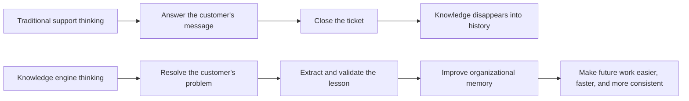
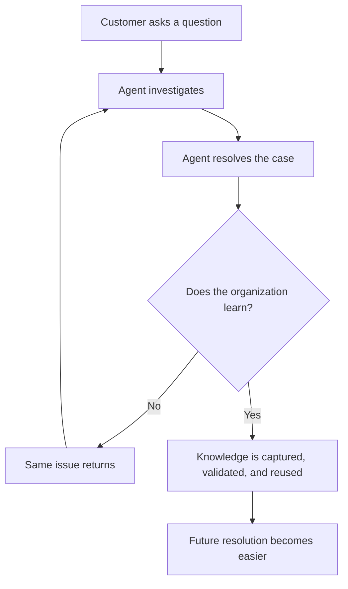
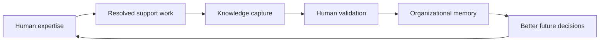
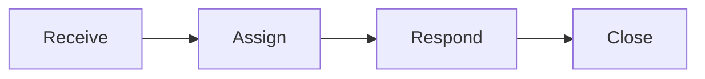
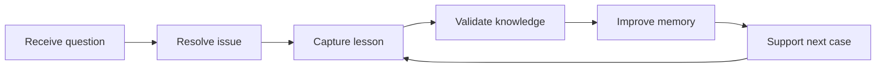
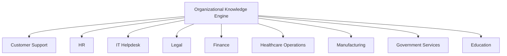
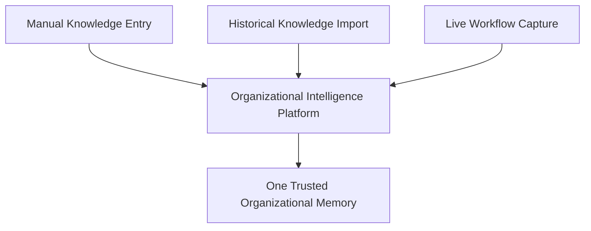

# Product Vision

## 1. Executive Summary

Most companies treat customer support as a queue of messages.

We believe this view is incomplete.

A customer question is not only a request for an answer. It is evidence that some part of the organization has knowledge that is either missing, unclear, outdated, difficult to find, or trapped inside a person's memory. Every ticket is a signal. Every resolved case is a lesson. Every repeated question is a symptom of organizational knowledge failing to circulate.

This company exists to build an AI-powered organizational knowledge engine that begins with customer support, but is not limited to customer support.

The first application is support because support is where organizational knowledge is tested every day. Customers ask questions that reveal gaps in product documentation, internal procedures, onboarding, policy clarity, operational consistency, and decision-making. Support is not merely a communication channel. It is the front line of organizational learning.

The product we are building captures the knowledge created during real support work, organizes it into a living system, helps humans reason over it, and ensures that each solved problem improves the intelligence of the entire organization.

> The enduring asset is not the message.  
> The enduring asset is the knowledge discovered while resolving the message.

Today, most support systems help teams move conversations from "open" to "closed." That is useful, but insufficient. A closed ticket should not be the end of a learning process. It should be the beginning of a stronger organizational memory.

Our vision is to make organizations better at remembering, learning, and applying their own expertise.

This matters because modern companies are increasingly complex. Products change quickly. Policies evolve. Teams become distributed. Experienced employees leave. New employees need context. Customers expect consistent answers. Managers need visibility into recurring issues. Leaders need to understand what the organization actually knows.

Without a system that preserves and evolves knowledge, companies repeatedly solve the same problems. The cost is not only slower support. The cost is institutional forgetting.

The future we are building is one where every resolved customer issue strengthens the organization:

- Customers receive clearer, more consistent answers.
- Support agents work with accumulated expertise instead of personal memory alone.
- Managers see where knowledge is weak, stale, or repeatedly misunderstood.
- New employees inherit the best thinking of previous employees.
- Leaders gain a clearer view of the organization's operational intelligence.
- AI becomes a memory and reasoning layer that amplifies human expertise instead of replacing it.

This is not a chatbot company.

This is a knowledge company.

### The Strategic Shift

### Core Thesis

Customer support is often described as a communication problem because the visible artifact is a conversation. But the deeper problem is knowledge. Teams struggle not because they cannot send messages, but because they cannot reliably preserve, locate, validate, update, and apply what the organization already knows.

The company exists to solve that deeper problem.

---

## 2. Why This Product Exists

Customer support has changed many times. Each generation improved one part of the experience while exposing a new limitation.

### The Evolution of Support

#### Face-to-Face Support

In the earliest form of support, customers spoke directly with the person who made, sold, or operated the product. Knowledge was immediate and human. The person answering often had deep context because they were close to the work itself.

This model had strengths:

- High trust.
- Rich context.
- Direct feedback.
- Strong human judgment.

But it did not scale. Knowledge lived in individual people. If the expert was unavailable, the organization became less capable. If the expert left, knowledge left with them.

#### Phone Support

Phone support allowed companies to serve customers at a distance. It improved reach and speed, but introduced a new problem: conversations became transient. Unless documented carefully, knowledge vanished as soon as the call ended.

The organization gained a communication channel, but not necessarily an institutional memory.

#### Email Support

Email made support asynchronous and more traceable. It gave teams a written record. Customers no longer had to wait on a line. Agents could handle more than one issue across time.

But email created volume. Threads became long. Context became scattered. Repeated questions were copied, forwarded, and rephrased. The archive existed, but it was not structured knowledge. It was a pile of past conversations.

#### Ticketing Systems

Ticketing systems brought order to volume. They gave teams queues, priorities, assignments, statuses, categories, and reporting.

This was a major operational advance. Support became manageable as a workflow.

But ticketing systems optimized the movement of work, not the evolution of knowledge.

They answered questions like:

- Who owns this issue?
- What is its status?
- How long has it been open?
- How many tickets did we resolve?

They did not fully answer:

- What did we learn?
- Is our knowledge now better?
- Are agents solving the same issue repeatedly?
- Which internal answers conflict?
- Which policies are unclear?
- Which customer problems reveal product or process gaps?

The ticket became a unit of work. It did not become a unit of learning.

#### Chat Support

Chat made support faster and more conversational. It matched customer expectations for immediacy. It helped companies provide real-time assistance inside digital products.

But faster communication also accelerated inconsistency. Agents had less time to research. Customers expected quick responses. Knowledge gaps became more visible. The same missing answer could appear across hundreds of conversations.

Chat improved responsiveness, but made weak knowledge systems more expensive.

#### Chatbots

Chatbots tried to automate common questions. They reduced some repetitive work and gave customers a self-service path.

But many chatbots were built around narrow scripts, static FAQs, or shallow intent matching. They often failed when customers asked nuanced questions, combined multiple issues, used unfamiliar language, or needed judgment.

They exposed a critical truth:

> Automation built on weak knowledge does not create intelligence. It only distributes weakness faster.

#### LLMs

Large language models changed expectations. For the first time, software could interpret language, summarize context, generate explanations, and reason across messy information with surprising fluency.

This created a new possibility for support: systems that can help agents and customers navigate complexity without forcing every question into a rigid script.

But LLMs also introduced a new risk. Fluency can be mistaken for knowledge. A system that sounds confident but lacks grounded organizational context can damage trust.

The challenge is not simply making AI answer more questions. The challenge is making AI preserve, refine, and apply organizational knowledge responsibly.

#### AI Agents

The next generation of AI systems will not only answer. They will assist with work, coordinate tasks, identify gaps, and help teams improve their own operating knowledge.

This requires a deeper foundation than a chatbot interface. It requires a living knowledge system with human validation, memory, reasoning boundaries, and a commitment to continuous improvement.

### The Pattern Across Generations

| Generation | What It Improved | What It Failed To Preserve |
|---|---|---|
| Face-to-face | Trust and context | Scale and continuity |
| Phone | Distance and access | Searchable institutional memory |
| Email | Written records | Structured knowledge |
| Ticketing | Workflow control | Organizational learning |
| Chat | Speed | Consistency and depth |
| Chatbots | Basic automation | Judgment and knowledge evolution |
| LLMs | Language understanding | Grounded organizational truth |
| AI agents | Task assistance | Reliable memory without a knowledge foundation |

Each generation solved a communication constraint. None fully solved the knowledge constraint.

That is why this product exists.

---

## 3. The Real Problem

The visible problem in customer support is slow answers, repeated questions, inconsistent responses, rising ticket volume, and high operational cost.

The root problem is organizational knowledge loss.

### Knowledge Fragmentation

In most companies, knowledge is scattered across:

- Closed tickets.
- Internal notes.
- Help center articles.
- Spreadsheets.
- Messaging threads.
- Individual agents' memories.
- Manager decisions.
- Product updates.
- Policy documents.
- One-off explanations.
- Training materials.

No single person sees the whole system. No single document remains fully current. No single tool understands how a resolved case should change future behavior.

Fragmentation creates friction. Agents spend time searching, asking colleagues, comparing old answers, and deciding which source to trust.

### Repeated Work

Repeated work is often normalized in support teams. A customer asks a question. An agent investigates. The agent solves it. A week later, another customer asks the same question. Another agent investigates again.

The company pays twice for the same learning.

At scale, this is not a minor inefficiency. It is a structural failure to convert experience into reusable knowledge.

### Inconsistent Answers

Inconsistent answers happen when different agents rely on different memories, documents, assumptions, or interpretations.

The customer experiences inconsistency as unreliability. The business experiences it as risk. The support team experiences it as confusion.

The cause is rarely a lack of effort. It is usually a lack of shared, current, trustworthy knowledge.

### Tribal Knowledge

Every organization has people who "just know" how things work. They know which policy has an exception, which product behavior is intentional, which customer segment needs a different explanation, and which workaround is safe.

This knowledge is valuable precisely because it is contextual. It is also fragile because it is often undocumented.

Tribal knowledge becomes dangerous when:

- Only a few people know it.
- New employees cannot access it.
- Managers cannot audit it.
- Customers depend on it indirectly.
- It disappears during turnover.

The product must respect human expertise while helping convert it into an organizational asset.

### Onboarding Costs

New support agents do not only learn tools. They learn the company's product, policies, tone, edge cases, escalation paths, customer expectations, internal vocabulary, and historical decisions.

When knowledge is fragmented, onboarding becomes apprenticeship by interruption. New agents ask senior agents for help. Senior agents lose focus. Managers repeat explanations. Customers wait.

The organization is forced to reteach itself.

### Employee Turnover

When experienced agents leave, companies lose more than capacity. They lose pattern recognition:

- Which issues are truly urgent.
- Which customers need extra care.
- Which answers have caused confusion before.
- Which internal policies are ambiguous.
- Which shortcuts are unsafe.
- Which product behaviors have historical context.

Traditional support tools preserve the ticket history, but not always the reasoning behind the resolution. They store the artifact, not the expertise.

### Slow Response Time

Slow responses are often blamed on agent performance or staffing levels. Sometimes that is correct. But in many teams, slowness comes from knowledge friction.

Agents wait because:

- They cannot find the right answer.
- They are unsure which answer is current.
- They need a manager to confirm a policy.
- They must read old tickets to reconstruct context.
- They need to ask another team for clarification.

Reducing response time requires more than faster messaging. It requires reducing the time between question and trusted knowledge.

### Knowledge Decay

Knowledge does not stay correct by default. Products change. Pricing changes. Policies change. Compliance requirements change. Internal processes change. Customer expectations change.

A knowledge base that was accurate six months ago can become a liability today.

Static documentation decays silently. The organization may not notice until a customer receives a wrong answer.

### Organizational Memory Loss

Organizational memory is the ability of a company to retain and apply what it has learned.

Most companies have memory in fragments:

- People remember.
- Documents record.
- Tickets archive.
- Managers summarize.
- Training materials simplify.

But these fragments are not enough. A healthy organizational memory must be accessible, current, trusted, and connected to real work.

### The Root Diagnosis

Customer support is not primarily a communication problem.

Communication is the surface area. Knowledge is the substrate.

| Surface Symptom | Deeper Knowledge Problem |
|---|---|
| Slow answers | Agents cannot quickly find trusted knowledge |
| Repeated questions | Resolutions do not become reusable knowledge |
| Inconsistent responses | Multiple sources conflict or remain implicit |
| High onboarding cost | Expertise is trapped in people and past cases |
| Escalation overload | Frontline teams lack accessible decision context |
| Low customer trust | The organization cannot answer consistently |
| Rising support cost | Learning is not compounding |

The opportunity is to make support knowledge compound.

---

## 4. Vision Statement

Our vision is to build the organizational memory layer for modern companies.

We imagine a future where every organization can preserve what it learns, improve what it knows, and apply its collective expertise with clarity and confidence.

Customer support is the first place this vision becomes visible because support contains the richest stream of real-world questions. But the deeper ambition is broader: to help organizations stop losing knowledge and start compounding it.

In this future:

- No resolved case disappears into an archive without improving future work.
- No employee is forced to depend only on personal memory to answer important questions.
- No customer receives a worse answer because the right knowledge existed but was hidden.
- No organization repeatedly pays to rediscover what it already learned.
- AI does not replace expertise. It carries expertise forward.

The long-term company vision is not to automate conversations. It is to make organizational knowledge durable, useful, and alive.

---

## 5. Mission Statement

Our mission is to turn everyday support interactions into a continuously improving knowledge system.

We do this by helping organizations:

- Capture valuable knowledge from real customer issues.
- Preserve the reasoning behind resolved cases.
- Organize knowledge so humans and AI can use it responsibly.
- Identify gaps, contradictions, outdated guidance, and recurring patterns.
- Support agents with trusted context at the moment of work.
- Help managers improve operations based on what customers actually ask.
- Make organizational knowledge easier to maintain over time.

The mission is practical. Every day, support teams solve real problems. The product's job is to ensure those solutions do not remain isolated events. Each solution should become part of the organization's shared intelligence.

---

## 6. Product Philosophy

The product is built on a set of philosophical commitments. These commitments should shape every future product decision, from user experience to AI behavior to business model.

### AI Should Not Replace Human Expertise

Human expertise is not an obstacle to automation. It is the source material of organizational intelligence.

Support agents understand nuance, customer emotion, product reality, business judgment, and exceptions. Managers understand policy intent, quality standards, and operational tradeoffs. Customers reveal whether the company's knowledge is actually understandable.

The product must treat human expertise as something to preserve and scale, not something to discard.

### AI Should Preserve Human Expertise

When an experienced agent resolves a difficult case, the value is not only the final response. The value includes:

- The diagnosis.
- The reasoning.
- The exception.
- The policy interpretation.
- The customer context.
- The escalation path.
- The final explanation.

A knowledge engine should help convert that expertise into reusable organizational memory.

### AI Should Scale Human Expertise

Scaling expertise does not mean making everyone identical. It means making the best available knowledge easier for everyone to access and apply.

A new agent should benefit from lessons learned by senior agents. A manager should see patterns across hundreds of cases. A customer should receive an answer informed by the organization's accumulated experience.

AI becomes valuable when it helps expertise travel.

### AI Should Continuously Improve Human Expertise

The product should not only retrieve existing knowledge. It should help teams notice when knowledge needs to change.

Examples:

- A question appears repeatedly, but no clear answer exists.
- Two agents resolve the same issue in conflicting ways.
- A help article is used often but followed by escalations.
- A policy generates repeated confusion.
- A product behavior creates avoidable tickets.

These are not just support metrics. They are knowledge signals.

### AI Should Know When It Does NOT Know

An AI system in support must have humility. A wrong confident answer is often worse than no answer.

The product should be designed around explicit uncertainty. When knowledge is missing, conflicting, stale, or insufficient, the system should say so and route the situation toward human judgment.

Knowing the boundary of knowledge is part of being intelligent.

### Human Expertise Should Never Be Discarded

Automation often fails when it treats human work as temporary scaffolding. In this product, human work is the engine of improvement.

Every correction, escalation, clarification, and resolved edge case should strengthen the system. Human intervention is not a failure of AI. It is how the knowledge system learns responsibly.

### Every Resolved Case Is an Opportunity To Learn

A ticket should not be measured only by whether it was closed. It should also be measured by whether the organization became smarter because of it.

The product should encourage a simple question after meaningful support work:

> What did this case teach us that should help the next person?

### Knowledge Should Continuously Evolve

Static knowledge systems assume that the organization knows something once and then stores it.

Modern organizations do not work that way. Knowledge is provisional. It changes with product behavior, customer needs, regulation, pricing, internal process, and market expectations.

The product must support knowledge as a living system.

### AI Should Become the Organization's Memory

Memory is not only storage. Memory includes context, retrieval, judgment, and adaptation.

The product should help the organization remember:

- What was decided.
- Why it was decided.
- Where it applies.
- When it changed.
- Who validated it.
- Which cases taught it.
- Which future situations should use it.

This kind of memory makes companies more resilient.

### The Philosophy in One Model

The loop matters. The product is not a one-way automation tool. It is a compounding learning system.

---

## 7. What We Are Building

We are building an AI Organizational Knowledge Engine.

It begins in customer support because support is where knowledge gaps become visible under pressure. But the product category is larger than support software.

### An AI Organizational Knowledge Engine

An organizational knowledge engine helps a company transform daily work into durable intelligence.

It should help teams answer questions such as:

- What do we know?
- How do we know it?
- Is it still true?
- Where did this answer come from?
- Which issues keep repeating?
- Which knowledge is missing?
- Which answers need human review?
- What did recent customer cases teach us?

The engine is not merely a search box. It is a system for preserving, organizing, reasoning over, and evolving knowledge.

### An AI Support Brain

Support teams often operate with distributed partial knowledge. One agent knows refunds. Another knows a complex product behavior. A manager knows policy exceptions. A senior teammate remembers a decision from last year.

An AI Support Brain gives the team a shared memory. It helps agents work with the organization's accumulated expertise instead of relying only on what they personally remember.

This creates value because support quality should not depend on whether the right person happens to be online.

### A Continuous Learning Support Platform

Traditional platforms treat support as a workflow:

A continuous learning platform treats support as a knowledge cycle:

The difference is fundamental. Workflow systems help teams process work. Knowledge engines help teams get smarter through work.

### Why This Is Different From a Chatbot

A chatbot's primary job is to respond.

A knowledge engine's primary job is to improve the organization's ability to know.

| Dimension | Chatbot | Organizational Knowledge Engine |
|---|---|---|
| Primary goal | Answer messages | Preserve and evolve knowledge |
| Unit of value | Individual response | Organizational learning |
| Failure mode | Wrong or shallow answer | Explicit gap, review, or escalation |
| Human role | Often bypassed | Central source of expertise |
| Knowledge model | Static or narrow | Living, validated, contextual |
| Long-term value | Deflection | Compounding intelligence |

The interface may include conversation, but the product is not defined by conversation. It is defined by what happens to knowledge after the conversation.

---

## 8. What We Are NOT Building

Clarity requires boundaries. The company should be explicit about what it is not building.

### We Are Not Building a Chatbot

A chatbot is typically optimized to hold a conversation and produce an answer. That can be useful, but it is too narrow.

The goal is not to simulate a support agent. The goal is to make the whole support organization more knowledgeable.

If the product only answers customer questions but does not improve organizational memory, it has failed the vision.

### We Are Not Building an FAQ Bot

FAQ bots assume that most knowledge can be reduced to a fixed list of common questions and answers.

This breaks down when:

- Products change frequently.
- Customers ask nuanced questions.
- Policies have exceptions.
- Answers depend on context.
- Teams need to learn from new cases.

FAQs are useful artifacts. They are not sufficient as the foundation of organizational intelligence.

### We Are Not Building a Keyword Matching System

Keyword matching can retrieve text that looks similar to a question. But support often requires intent, context, and judgment.

Two customers can use different words to describe the same issue. Two similar sentences can require different answers. A keyword system cannot reliably understand policy nuance or organizational history.

### We Are Not Building an Autoresponder

Autoresponders optimize for speed. They can acknowledge receipt, send common instructions, or reduce first-response time.

But speed without knowledge quality can create false efficiency. A fast wrong answer increases work. A fast incomplete answer creates follow-up messages. A fast generic answer erodes trust.

The product should value timely answers, but never confuse speed with intelligence.

### We Are Not Building a Canned Response System

Canned responses help agents avoid repetitive typing. They are useful for stable, simple, low-risk communication.

But they do not solve the deeper problem:

- Who decides when the response is still correct?
- Which cases should change the response?
- Which responses conflict with newer policy?
- Which responses produce customer confusion?
- Which exceptions should be documented?

Canned responses reduce typing. They do not make knowledge compound.

### We Are Not Building a Static Knowledge Base

Static knowledge bases are libraries. They depend on humans remembering to update them. They often become stale because maintenance is separate from daily work.

A living knowledge engine connects knowledge maintenance to actual support activity. It treats repeated questions, corrections, escalations, and resolved cases as signals that the knowledge system should improve.

### Why These Approaches Reach Their Limits

| Approach | Useful For | Limit |
|---|---|---|
| Chatbots | Simple conversational self-service | Can answer without improving knowledge |
| FAQ bots | Common stable questions | Weak for nuance and change |
| Keyword systems | Basic retrieval | Poor understanding of intent and context |
| Autoresponders | Immediate acknowledgement | Speed without depth |
| Canned responses | Reducing repetitive typing | Static and easily outdated |
| Static knowledge bases | Publishing known information | Maintenance is disconnected from real work |

These tools are not wrong. They are incomplete. The product may integrate with or improve parts of these workflows, but it must not be limited by their assumptions.

---

## 9. Target Users

The product creates value for multiple users because organizational knowledge affects multiple roles. Each user experiences the same root problem differently.

### Customer

Customers want clear, accurate, timely help. They do not care which internal system provides it. They care whether the company understands them and can resolve their issue.

#### Goals

- Get a correct answer.
- Avoid repeating context.
- Trust that the company understands its own product.
- Resolve the issue with minimal effort.

#### Frustrations

- Receiving different answers from different agents.
- Being redirected repeatedly.
- Getting generic replies that ignore context.
- Waiting while the company searches for its own knowledge.

#### Value Created

Customers benefit from an organization that remembers. They receive answers informed by prior cases, validated knowledge, and current policy. They experience the company as coherent instead of fragmented.

### Support Agent

Support agents operate at the intersection of customer emotion, product complexity, and operational constraints.

#### Goals

- Resolve cases accurately.
- Work faster without sacrificing quality.
- Understand unfamiliar issues.
- Avoid escalating unnecessarily.
- Learn from senior teammates.

#### Frustrations

- Searching across too many tools.
- Unsure whether an old answer is still correct.
- Asking the same internal questions repeatedly.
- Being measured on speed while lacking trusted context.
- Losing time to documentation after difficult cases.

#### Value Created

Agents gain access to shared organizational expertise at the moment they need it. They can see relevant knowledge, understand confidence boundaries, and contribute improvements when they solve something new.

### Support Manager

Support managers are responsible for quality, speed, staffing, coaching, process improvement, and customer outcomes.

#### Goals

- Maintain consistent answer quality.
- Reduce avoidable escalations.
- Improve onboarding.
- Identify recurring issues.
- Understand where the team lacks knowledge.
- Ensure policy and product changes reach frontline work.

#### Frustrations

- Hard to know which answers agents are using.
- Repeated coaching on the same topics.
- No clear view of knowledge gaps.
- Quality reviews are manual and reactive.
- Team performance depends heavily on a few senior people.

#### Value Created

Managers gain visibility into the knowledge health of the team. They can see where answers conflict, which issues repeat, where new documentation is needed, and how resolved cases improve the system.

### Knowledge Administrator

The knowledge administrator may be a dedicated role or part of support operations. This user maintains the quality of official knowledge.

#### Goals

- Keep knowledge accurate and current.
- Reduce duplication.
- Identify stale content.
- Ensure changes are reflected in support practice.
- Make knowledge easy to trust.

#### Frustrations

- Documentation updates happen after the fact.
- It is hard to know what content is used.
- Support cases reveal gaps too late.
- Multiple unofficial answers compete with official guidance.

#### Value Created

The product turns daily support activity into a knowledge maintenance signal. Instead of guessing what to update, the knowledge administrator can prioritize based on real customer questions and agent behavior.

### Operations Manager

Operations managers care about process reliability across teams.

#### Goals

- Reduce operational waste.
- Standardize recurring workflows.
- Improve handoffs.
- Understand bottlenecks.
- Make the organization less dependent on individual memory.

#### Frustrations

- Teams solve similar problems separately.
- Process changes are not consistently adopted.
- Knowledge about exceptions is scattered.
- Operational lessons disappear after incidents.

#### Value Created

Operations leaders gain a system that reveals repeated work and converts it into durable process knowledge.

### CEO and Executive Team

Executives need to understand what customers are experiencing and whether the organization is learning from those experiences.

#### Goals

- Improve customer trust.
- Reduce support cost without lowering quality.
- Identify product and process weaknesses.
- Make the organization more resilient.
- Preserve institutional knowledge as the company scales.

#### Frustrations

- Support data is often summarized as volume metrics.
- Customer pain is hidden inside tickets.
- Strategic knowledge is trapped in frontline teams.
- Scaling headcount does not automatically scale expertise.

#### Value Created

Executives gain a clearer view of organizational intelligence. They can see not only what customers ask, but what the company is learning and where it remains weak.

### Enterprise IT Team

Enterprise IT teams evaluate security, governance, reliability, integration fit, and administrative control.

#### Goals

- Ensure the product respects organizational boundaries.
- Maintain governance over sensitive knowledge.
- Support role-based access and policy requirements.
- Reduce unmanaged AI usage.
- Enable adoption without creating operational risk.

#### Frustrations

- AI tools that ignore enterprise governance.
- Knowledge scattered across unsanctioned systems.
- Lack of visibility into how employees use AI.
- Risk of inaccurate or unauthorized answers.

#### Value Created

The product gives IT a governed path for AI-assisted knowledge work. It helps the organization use AI around trusted internal knowledge rather than unmanaged fragments.

### User Value Map

| User | Primary Pain | Product Value |
|---|---|---|
| Customer | Inconsistent or slow help | Clearer answers from a more coherent organization |
| Support Agent | Knowledge friction | Trusted context at the moment of work |
| Support Manager | Quality and consistency | Visibility into gaps, conflicts, and learning |
| Knowledge Administrator | Stale documentation | Real signals for what needs maintenance |
| Operations Manager | Repeated process work | Reusable operational knowledge |
| CEO | Institutional forgetting | A company that learns as it scales |
| Enterprise IT | AI governance risk | Controlled organizational knowledge use |

---

## 10. Long-Term Vision

Customer support is the first application because it contains dense, recurring, high-value knowledge signals. But the underlying problem exists across every function of an organization.

Any team that repeatedly answers questions, resolves cases, interprets policies, performs procedures, trains new people, or makes decisions under uncertainty has the same knowledge problem.

### The 10-Year Possibility

In ten years, the product could become the shared intelligence layer across the enterprise. Not a replacement for existing systems, but a memory and reasoning layer that helps teams preserve what they learn from daily work.

### HR

HR teams answer policy questions, manage onboarding, interpret benefits, handle employee relations, and preserve procedural knowledge. Many HR questions are repeated, sensitive, and context-dependent.

A knowledge engine could help HR preserve policy interpretations, onboarding lessons, manager guidance, and employee support patterns while maintaining appropriate boundaries.

### Healthcare

Healthcare organizations depend on procedural knowledge, patient communication workflows, compliance obligations, and institutional experience. Knowledge must be accurate, current, and carefully governed.

The long-term opportunity is not to replace clinical judgment, but to help healthcare organizations preserve operational knowledge and reduce repeated administrative confusion.

### Manufacturing

Manufacturing teams depend on procedures, incident histories, quality standards, equipment knowledge, and operator experience. Much of this knowledge is learned through repetition and experience.

A knowledge engine could help preserve lessons from incidents, maintenance resolutions, quality issues, and process exceptions.

### Legal

Legal teams manage precedent, interpretation, risk judgment, client context, and internal guidance. Knowledge is often nuanced and highly dependent on jurisdiction, facts, and prior decisions.

A knowledge engine could help legal organizations preserve reasoning trails, surface relevant prior work, and maintain consistency without flattening expert judgment.

### Finance

Finance teams answer policy, reporting, procurement, expense, compliance, and planning questions. Many decisions depend on current rules and historical rationale.

A knowledge engine could reduce repeated internal questions and preserve the reasoning behind financial operations.

### Government

Government agencies serve large populations with complex policies. Citizens often struggle because rules are difficult to understand and employees must navigate many exceptions.

A knowledge engine could help agencies preserve policy interpretations, identify confusing public guidance, and improve service consistency.

### Education

Educational institutions manage student questions, administrative processes, advising, compliance, curriculum policies, and institutional history.

A knowledge engine could help preserve advising knowledge, improve student support, and reduce repeated administrative confusion.

### IT Helpdesk

IT helpdesks are a natural expansion from customer support. They handle repeated issues, troubleshooting patterns, access policies, device procedures, and escalation workflows.

A knowledge engine could convert resolved internal incidents into future guidance for employees and IT staff.

### Why Support Comes First

Support is the ideal first application because:

- The pain is frequent and measurable.
- The knowledge signals are explicit.
- The workflows already contain case histories.
- The value of consistency is immediately visible.
- The cost of repeated work is high.
- The connection between knowledge and customer trust is direct.

The first wedge is support. The enduring category is organizational knowledge.

### The Three Knowledge Intake Doors

Every domain in this vision — support, HR, legal, finance, healthcare, manufacturing, government, education, IT — produces knowledge differently. Some knowledge is spoken by an expert who has never written it down. Some knowledge already exists in old documents, archives, and forgotten records. Some knowledge is created in the middle of real work, while a problem is still being solved.

The long-term platform is built around three doors through which this knowledge can enter:

1. **Manual Knowledge Entry** — the door for expertise that lives only in a person's experience. An expert should be able to teach the organization directly, without waiting for a ticket, a document, or an accident of circumstance to surface what they already know.

2. **Historical Knowledge Import** — the door for knowledge the organization already possesses but has never fully trusted or connected. Old tickets, old documents, old decisions, and old archives hold real learning; this door lets that learning rejoin the living system instead of remaining sediment.

3. **Live Workflow Capture** — the door for knowledge created in the moment, while a case is being resolved, a policy is being interpreted, or a problem is being diagnosed. This is where knowledge is freshest, and where the organization's real work becomes the organization's real memory.

These three doors are not competing products. They are three ways into the same intelligence — the same validation, the same memory, the same reasoning. An organization should never have to wonder which system holds its truth. Whether knowledge arrives because someone spoke it, because an old archive was finally opened, or because a case was resolved this morning, it should converge into one place the whole organization can trust.

Today, the platform opens only the Live Workflow door. Customer support proves the deeper thesis because it is where knowledge is created continuously and under real pressure. But this is a beginning, not a boundary. The long-term vision is to open all three doors and unify every source of organizational knowledge — spoken, archived, and freshly created — into one trusted Organizational Memory that the entire company can rely on.

---

## 11. Success Definition

Success must be measured by whether the organization becomes more intelligent over time, not only whether individual interactions become faster.

### Outcome Metrics

| Outcome | What It Measures | Why It Matters |
|---|---|---|
| Reduced response time | Time from question to useful answer | Shows lower knowledge friction |
| Reduced resolution time | Time from issue creation to solved case | Shows better operational learning |
| Reduced onboarding time | Time for new agents to reach quality standards | Shows expertise is becoming transferable |
| Improved answer consistency | Alignment across agents and channels | Shows shared knowledge is trusted |
| Reduced escalations | Fewer cases needing senior intervention | Shows frontline knowledge is improving |
| Reduced repeated work | Fewer reinvestigations of known issues | Shows learning is compounding |
| Reduced knowledge loss | Lower dependency on individual employees | Shows memory is institutional |
| Improved customer satisfaction | Customer perception of clarity and trust | Shows knowledge quality reaches the customer |
| Lower support cost | Cost per resolved issue | Shows efficiency without sacrificing quality |
| Increased organizational intelligence | Better ability to capture, maintain, and reuse knowledge | Shows the product is fulfilling its deeper purpose |

### Knowledge Health Metrics

Traditional support metrics are necessary but incomplete. The product should also help organizations understand knowledge health.

Examples:

- Number of repeated questions without trusted answers.
- Number of resolved cases that created or improved knowledge.
- Number of conflicting answers detected.
- Number of stale knowledge items identified through real usage.
- Percentage of agent answers supported by trusted knowledge.
- Time from new issue discovery to validated guidance.
- Topics with high uncertainty or escalation rates.

These metrics help leaders see whether the organization is learning.

### Success at Different Stages

#### Early Success

The product helps agents find better answers faster and reduces repeated internal questions.

#### Team-Level Success

The support team becomes more consistent. Managers can see knowledge gaps and improve them systematically.

#### Company-Level Success

Support interactions become a source of product, policy, and operational learning. Knowledge created at the edge of the company improves decisions across the organization.

#### Long-Term Success

The organization develops a durable memory. Expertise survives turnover. Learning compounds. AI becomes a trusted partner in preserving and applying human knowledge.

---

## 12. Guiding Principles

These principles should guide every future product decision.

### 1. Knowledge Is the Core Asset

The product should always optimize for the creation, preservation, validation, and reuse of organizational knowledge.

Messages matter because they reveal knowledge needs. Tickets matter because they contain learning. Automation matters only when it strengthens the knowledge system.

### 2. Human Expertise Is the Source of Trust

The system must respect the role of human judgment. Humans create, correct, validate, and contextualize knowledge. AI should make that expertise easier to preserve and apply.

### 3. Every Interaction Should Have the Potential To Improve the System

A resolved case should not disappear. If it contains a new lesson, a clarification, an exception, or a pattern, the product should help the organization learn from it.

### 4. Uncertainty Must Be Visible

The product should clearly distinguish between known, uncertain, conflicting, outdated, and missing knowledge. A system that hides uncertainty will eventually lose trust.

### 5. Consistency Should Not Mean Rigidity

Organizations need consistent answers, but real support work contains nuance. The product should help teams understand when a standard answer applies and when judgment is required.

### 6. Knowledge Must Stay Alive

Knowledge should have a lifecycle. It can be created, used, challenged, corrected, retired, and replaced. The product should make this lifecycle natural.

### 7. Speed Is Valuable Only When Grounded in Accuracy

Fast support is good. Fast misinformation is expensive. The product should improve speed by reducing knowledge friction, not by encouraging shallow answers.

### 8. The Best System Teaches the Organization About Itself

The product should reveal patterns that humans would otherwise miss:

- Repeated confusion.
- Hidden policy gaps.
- Unclear product behavior.
- Training weaknesses.
- Documentation decay.
- Operational bottlenecks.

Support work should become a mirror for organizational learning.

### 9. AI Should Be Accountable to Organizational Truth

AI output must be grounded in what the organization actually knows, not in generic plausibility. The product should encourage traceability, review, and correction.

### 10. The Product Should Make Expertise More Democratic

Access to knowledge should not depend on knowing the right person. The product should help every authorized employee benefit from the organization's accumulated experience.

### 11. The Product Should Reduce Repeated Work

Repeated work is evidence that learning is not compounding. The product should help teams notice repetition and convert it into reusable knowledge.

### 12. The System Should Earn Trust Over Time

Trust is not created by claims. It is earned through accuracy, transparency, usefulness, and appropriate restraint. The product should become more trusted as it proves that it helps people do better work.

---

## Closing Perspective

The future of customer support will not be defined by who can generate the fastest reply.

It will be defined by which organizations can learn from every customer interaction and carry that learning forward.

The companies that win will not merely automate support. They will build durable memory. They will preserve human expertise. They will make knowledge visible, current, and useful. They will turn solved problems into compounding intelligence.

This product begins with support because support is where customers reveal what the organization does not yet know well enough.

But the larger purpose is to help organizations stop forgetting.

That is why this company deserves to exist.
