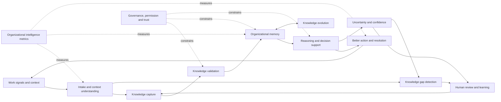
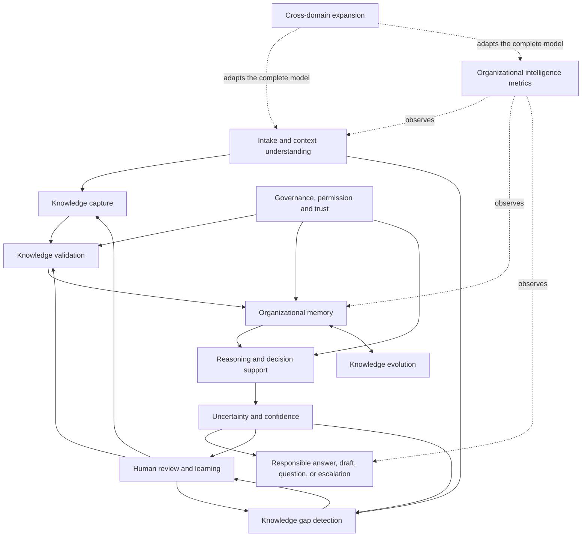

# Product Capability Model

## 1. Introduction

A capability model defines the durable abilities a product must possess to fulfill its purpose. It describes **what the platform must be able to do** before deciding how it will do it.

Capabilities are not features. A feature is a particular expression of a capability that a user can see or interact with. Features may change as workflows, interfaces, and technology change. The underlying capability should remain stable.

| Feature expression | Enduring capability |
| --- | --- |
| “Save reply as knowledge” | Knowledge Capture |
| “Show confidence badge” | Uncertainty and Confidence Representation |
| “Send for manager approval” | Human Review and Learning Loop |
| “Flag repeated unanswered topics” | Knowledge Gap Detection |

This distinction prevents the product from being defined by its current interface or its first market. A button, screen, or automated action may be replaced. The need to capture knowledge, validate it, preserve its context, reason from it, and learn from corrections will remain.

This model therefore does not specify screens, workflows in detail, or technical components. It establishes the platform abilities that future product scope, architecture, AI agent design, and roadmaps must serve.

---

## 2. Relationship to Previous Documents

| Document | Primary Question |
| --- | --- |
| Founder's Thesis | Why should this company exist? |
| Product Vision | What product must exist? |
| Product Principles | How should product decisions be made? |
| Product Capability Model | What must the platform be able to do? |

The [Founder's Thesis](./00_FOUNDERS_THESIS.md) establishes the company's reason for existing. The [Product Vision](./01_PRODUCT_VISION.md) defines the required product category. The [Product Principles](./02_PRODUCT_PRINCIPLES.md) constrain how product and engineering decisions should be made.

This document is the bridge between that philosophy and later system architecture. It translates concepts such as memory before automation, visible uncertainty, provenance, human expertise, and knowledge compounding into abilities the platform must possess. Later documents may decide how to implement or sequence these abilities, but should not remove or weaken them for convenience.

---

## 3. Capability Map Overview

The capability model contains twelve connected domains:

| Domain | Platform ability |
| --- | --- |
| 1. Intake and Context Understanding | Interpret work signals and determine what context and learning they contain. |
| 2. Knowledge Capture | Convert meaningful work into structured, reusable knowledge. |
| 3. Knowledge Validation | Determine what may be trusted, by whom, and under what conditions. |
| 4. Organizational Memory | Preserve shared knowledge across people, systems, and time with context and trust intact. |
| 5. Reasoning and Decision Support | Apply relevant organizational memory to current situations and explain its use. |
| 6. Uncertainty and Confidence Representation | Represent the limits, conflicts, age, evidence, and risk of what is known. |
| 7. Human Review and Learning Loop | Make human judgment part of correction, validation, and continuous learning. |
| 8. Knowledge Evolution | Maintain knowledge as reality changes while preserving history. |
| 9. Knowledge Gap Detection | Reveal where organizational memory is missing, weak, stale, conflicting, or insufficient. |
| 10. Organizational Intelligence Metrics | Measure whether learning is improving future capability. |
| 11. Governance, Permission and Trust | Ensure knowledge and reasoning respect organizational authority and boundaries. |
| 12. Cross-Domain Expansion | Apply the core model beyond support without weakening the first product. |

These are not independent modules. Together they form the Knowledge Flywheel:

Cross-Domain Expansion is not shown as another step in the loop. It is the ability to apply the entire loop to forms of work beyond support while preserving domain-specific boundaries, expertise, and risk.

---

## 4. Capability 1 — Intake and Context Understanding

### Definition

Intake and Context Understanding is the ability to interpret incoming organizational work signals and establish the context required for learning or action. Signals may include customer support messages, tickets, email threads, chat conversations, internal notes, resolved cases, human corrections, policy updates, and other records of work.

### What the platform must be able to do

- Normalize messy, incomplete, duplicated, or differently formatted inputs without erasing meaning.
- Identify intent, problem type, involved entities, relevant history, and the outcome being sought.
- Extract the facts, constraints, decisions, and unresolved questions that matter to the case.
- Detect urgency, consequence, sensitivity, and risk.
- Distinguish a routine application of known guidance from a meaningful learning opportunity.
- Recognize when additional context is required before the system or a human can reason responsibly.
- Preserve the relationship between interpreted context and the original source.

### Why it matters

Weak context produces weak memory and unsafe reasoning. The same words can require different answers depending on customer history, policy version, product state, jurisdiction, authority, or exception. The platform must understand enough of the situation to avoid turning superficial similarity into false equivalence.

### What it is not

- It is not merely receiving or storing messages.
- It is not keyword classification.
- It is not ticket routing.
- It is not reducing every interaction to one intent label.
- It is not claiming complete understanding when essential context is absent.

---

## 5. Capability 2 — Knowledge Capture

### Definition

Knowledge Capture is the ability to convert meaningful work and human expertise into reusable organizational knowledge. Capture separates the durable lesson from the incidental details of a single event while preserving enough context to judge when the lesson applies.

### What the platform must be able to capture

- The problem that was encountered.
- The diagnosis and the observations that supported it.
- The reasoning used to reach a conclusion.
- The resolution or decision.
- The source evidence.
- The relevant organizational and situational context.
- The conditions under which the lesson applies.
- Its known limits, risks, and exceptions.
- The human judgment involved, including disagreement or escalation.
- The relationship to earlier knowledge and similar cases.

Capturing only the final answer is insufficient. A conclusion without its rationale, evidence, applicability, and limits may be easy to repeat but impossible to trust. It also prevents a future person from adapting the knowledge when the surrounding context changes.

### Why it matters

Capture is the point at which work can become an organizational asset. Without it, the platform preserves records but loses lessons. With careless capture, it creates content volume rather than memory. The capability must therefore identify and structure what is reusable without pretending every interaction contains new knowledge.

### Customer support examples

- A billing case reveals not only the refund granted, but the policy interpretation, approval boundary, customer condition, and exception that justified it.
- A technical case preserves the observed symptoms, ruled-out causes, decisive evidence, resolution, and product versions for which the resolution is valid.
- A human correction to an AI draft captures the false assumption, the missing context, and the corrected rule—not merely the edited sentence.
- A recurring question with an existing correct answer creates a reuse signal, while a recurring question that the guidance fails to resolve creates a gap signal.

---

## 6. Capability 3 — Knowledge Validation

### Definition

Knowledge Validation is the ability to evaluate whether captured knowledge is sufficiently supported, reviewed, current, and applicable to guide action. Captured knowledge must not automatically become trusted organizational memory.

### Validation signals

The platform must support validation through a combination of:

- Human review appropriate to the subject and consequence.
- Source evidence and traceable reasoning.
- Expert approval or accountable ownership.
- Repeated successful use in applicable situations.
- Checks for contradictions with trusted knowledge.
- Confidence thresholds that reflect evidence quality and risk.
- Revalidation when new cases, policies, or outcomes challenge existing guidance.

No single signal is sufficient in every domain. Repetition does not make an incorrect practice true, and authority without evidence may not resolve a factual contradiction. Validation must preserve the basis on which trust was granted.

### Core validation states

| State | Meaning |
| --- | --- |
| Proposed | A candidate lesson exists but has not earned organizational trust. |
| Validated | Appropriate evidence and review support use within stated conditions. |
| Disputed | Credible evidence or expert judgment challenges the knowledge and requires resolution. |
| Deprecated | The knowledge should no longer guide current action, although its history remains available. |

These states are a minimum conceptual distinction, not a complete workflow. They prevent the platform from treating all stored content as equally authoritative.

### Why it matters

Validation protects trust by preventing plausible summaries, isolated outcomes, and unreviewed corrections from silently becoming organizational truth. It also makes trust inspectable: users can understand not only that knowledge is considered reliable, but why.

---

## 7. Capability 4 — Organizational Memory

### Definition

Organizational Memory is shared knowledge preserved across people, systems, and time with its context and trust intact. It is not storage. Storage answers whether a record still exists. Memory answers whether the right knowledge can be found, understood, trusted, and applied when needed.

### What the platform must preserve

- Original sources and derived knowledge.
- Change and approval history.
- Rationale and supporting evidence.
- Ownership and accountable stewardship.
- Validation state and the basis for that state.
- Applicability, limits, exceptions, and risk.
- Related cases, decisions, policies, and knowledge.
- Previous versions and the periods in which they applied.
- Superseded or deprecated guidance and what replaced it.
- Permissions and sensitivity that govern appropriate use.

### Required memory behaviors

The platform must make relevant memory discoverable without detaching it from context. It must distinguish current trusted guidance from historical evidence, connect related knowledge without flattening differences, and preserve the reasoning required by the human who comes next.

### How this differs from a static knowledge base

A static knowledge base primarily publishes documents that people must remember to maintain. Organizational Memory connects knowledge to the work that created, used, challenged, and changed it. It carries trust and lifecycle state, responds to new evidence, and supports reasoning rather than only retrieval.

---

## 8. Capability 5 — Reasoning and Decision Support

### Definition

Reasoning and Decision Support is the ability to use organizational memory to help humans and AI understand a current situation, compare evidence, evaluate applicability, and choose an appropriate next action.

### What the platform must be able to do

- Identify knowledge relevant to the actual context, not merely similar wording.
- Compare the current situation with prior cases and explain material similarities and differences.
- Apply rules, policies, and prior judgments within their stated conditions.
- Recognize exceptions, conflicting evidence, and situations requiring judgment.
- Suggest next steps and explain why they follow from trusted knowledge.
- Determine whether the appropriate behavior is to answer, draft, ask a follow-up question, seek approval, or escalate.
- Separate organizational evidence from inference and general background knowledge.
- Make its reasoning basis understandable enough to review and correct.

### Grounding requirement

Reasoning must be grounded in organizational memory, not generic plausibility. General knowledge may help interpret a question, but it must not be presented as the organization's policy, decision, experience, or truth. When organizational memory is insufficient, the system should expose the gap rather than invent an answer.

### Why it matters

Memory becomes valuable when it improves judgment. Retrieval alone can surface a relevant document yet still leave a person uncertain about whether it applies. This capability connects preserved learning to action while respecting context, authority, and uncertainty.

---

## 9. Capability 6 — Uncertainty and Confidence Representation

### Definition

Uncertainty and Confidence Representation is the ability to express what the platform knows, does not know, and cannot safely conclude. Confidence should reflect the quality, relevance, consistency, freshness, and authority of evidence as well as the risk of the action.

### What the platform must distinguish

- **Known:** applicable knowledge is supported, current, and appropriately validated.
- **Uncertain:** relevant evidence exists but does not justify a firm conclusion.
- **Missing:** the organizational memory contains no sufficient guidance.
- **Conflicting:** credible sources or judgments disagree.
- **Outdated:** available guidance may no longer reflect current reality.
- **High-risk:** the consequences require greater restraint or authority even when evidence appears strong.
- **Low-evidence:** a claim rests on weak, indirect, or isolated support.

These conditions may overlap. A high-risk case can also contain conflicting or outdated knowledge. The representation must preserve those distinctions rather than compress them into a misleading universal score.

### Why it matters

Visible uncertainty is a core product capability because fluent output can conceal weak evidence. People need to understand the boundary of organizational knowledge in order to make responsible decisions and improve it. Uncertainty is not only a warning; it is a signal for review, investigation, and learning.

### Example behaviors

| Situation | Appropriate behavior |
| --- | --- |
| High confidence, low risk, validated and applicable knowledge | Provide or permit an automated reply with sources and traceability. |
| Medium confidence or incomplete context | Prepare a draft and identify what a human should verify. |
| Low confidence or missing knowledge | Escalate, ask for context, or state that the answer is not yet known. |
| Conflicting trusted knowledge | Withhold false certainty, show the conflict, and require resolution. |

---

## 10. Capability 7 — Human Review and Learning Loop

### Definition

Human Review and Learning Loop is the ability to make human judgment an explicit part of validation, correction, escalation, and continuous improvement. Human review is not a fallback failure. It is one of the primary ways organizational intelligence is created.

### What humans must be able to do

- Approve or reject proposed answers and knowledge.
- Correct facts, reasoning, applicability, and tone where each matters.
- Refine incomplete knowledge.
- Annotate evidence, exceptions, risk, and context.
- Escalate to appropriate expertise or authority.
- Explain why AI reasoning or output was wrong.
- Distinguish a one-case correction from a reusable organizational lesson.
- Convert reusable corrections into proposed or validated future knowledge.
- See whether their corrections changed future behavior.

### How it strengthens the Knowledge Flywheel

A review should improve more than the current interaction. The platform must capture what the human knew, connect it to evidence and context, validate it appropriately, and return it to Organizational Memory. Future reasoning then starts from a stronger place. This turns human intervention from repeated rescue work into compounding organizational capability.

### Why it matters

Review without learning creates a permanent correction queue. Learning without review risks turning model inference into organizational truth. The capability must connect both: humans protect quality now and improve the system for later.

---

## 11. Capability 8 — Knowledge Evolution

### Definition

Knowledge Evolution is the ability to change organizational knowledge as products, policies, evidence, and operating conditions change, while preserving the history necessary for trust and understanding.

### Lifecycle states

The platform must support knowledge becoming:

- **Draft:** being formed and not ready for organizational reliance.
- **Proposed:** offered for validation with an identified source and purpose.
- **Validated:** supported and approved for a stated scope.
- **Active:** currently available to guide applicable work.
- **Challenged:** questioned by new evidence or expert judgment.
- **Disputed:** subject to a material unresolved conflict.
- **Stale:** insufficiently current to retain its former level of trust.
- **Deprecated:** no longer approved for current use.
- **Replaced:** superseded by newer guidance with a traceable relationship.

### How knowledge changes

Knowledge may change because of a policy update, product behavior, repeated failed application, new evidence, an expert correction, a change in authority, or the discovery of a previously hidden exception. Change should affect both the content and the confidence with which the knowledge may be used.

The platform must make challenges reviewable, propagate validated changes to future reasoning, and identify existing knowledge or decisions affected by the change.

### Why history must remain

Old knowledge should not simply disappear. Historical guidance may explain earlier decisions, reveal how learning occurred, or remain valid for cases from an earlier period. Preserving its state and replacement relationship prevents history from being mistaken for current truth while retaining institutional memory.

---

## 12. Capability 9 — Knowledge Gap Detection

### Definition

Knowledge Gap Detection is the ability to identify where organizational knowledge is missing, weak, confusing, stale, contradictory, inaccessible, or repeatedly insufficient for real work.

### What the platform must detect

- Repeated questions for which no trusted answer exists.
- Topics that repeatedly produce low-confidence reasoning.
- Frequent escalations caused by absent or unclear guidance.
- Conflicting answers across people, channels, sources, or time.
- Documentation that is retrieved but fails to resolve the issue.
- Policies that generate repeated interpretation or exception questions.
- Customer confusion patterns that reveal unclear products, processes, or communication.
- Trusted knowledge that is rarely usable, frequently corrected, or contradicted by outcomes.
- Areas where capability depends disproportionately on a small number of experts.

### Required output

A detected gap should be explainable and actionable. The platform should show the evidence for the gap, its frequency and consequence, the people or knowledge involved, and the next learning action that could close it. Detection must not become a stream of unactionable alerts.

### Why it matters

This capability turns support from a reactive queue into an organizational learning sensor. It reveals not only which customers need answers, but where the organization itself needs to learn. That is a major distinction between an Organizational Intelligence Platform and software that only routes, searches, or replies to tickets.

---

## 13. Capability 10 — Organizational Intelligence Metrics

### Definition

Organizational Intelligence Metrics is the ability to measure whether accumulated experience is improving what the organization can understand and do in the future.

### Required measures

The platform should be able to measure:

- Reduction in repeated investigations and repeated expert interruptions.
- Knowledge gaps identified, prioritized, and closed.
- Knowledge freshness and lifecycle health.
- Consistency of answers across people and channels.
- Escalation quality, including whether escalation produced reusable learning.
- Confidence improvement for recurring problem areas.
- Time from discovery of a new issue to validated knowledge.
- Reduction in fragile dependency on specific experts while preserving their contribution.
- Reuse of trusted knowledge and the outcomes of that reuse.
- The percentage of meaningful resolutions that created or improved memory.
- Whether human corrections reduce similar future errors.

### Measurement requirements

Metrics should preserve important distinctions. Reduced escalations are not automatically good if they result from unsafe automation. High reuse is not good if the reused knowledge is stale. More captured knowledge is not good if it increases noise. Measures should connect activity, knowledge quality, and outcomes rather than collapse them into a vanity score.

### Why ordinary support metrics are insufficient

Response time, resolution time, ticket volume, satisfaction, and cost remain useful. They describe operational performance, but not whether learning compounds. An organization can close tickets faster while repeating the same investigations and allowing its memory to decay. Intelligence metrics make the deeper outcome visible and manageable.

---

## 14. Capability 11 — Governance, Permission and Trust

### Definition

Governance, Permission and Trust is the ability to ensure that knowledge, reasoning, review, and learning respect organizational boundaries, authority, sensitivity, and accountability.

### What the platform must support

- Role- and responsibility-based access to knowledge and actions.
- Provenance from answers and recommendations back to their sources.
- Auditable reasoning, approvals, corrections, and changes.
- Approval history and accountable ownership.
- Permission-aware reasoning that uses only knowledge the requesting person and context are authorized to use.
- Appropriate handling of sensitive, confidential, regulated, or restricted knowledge.
- Separation between the ability to view, propose, validate, publish, apply, and retire knowledge.
- Organizational policies for where human approval is mandatory.
- Clear accountability for automated and human-supported outcomes.

### Why it matters

An intelligence layer can connect knowledge across an organization, which makes governance more important, not less. A correct answer derived from information a person should not access is not a correct product outcome. Organizations will not trust a platform that ignores boundaries, obscures responsibility, or cannot explain how knowledge changed.

Governance should constrain every relevant capability rather than exist as a final administrative step. Intake, capture, memory, reasoning, review, metrics, and expansion must all respect it.

---

## 15. Capability 12 — Cross-Domain Expansion

### Definition

Cross-Domain Expansion is the ability to apply the platform's core learning model to organizational work beyond customer support while preserving the distinct context, authority, vocabulary, risk, and expertise of each domain.

### Potential domains

The capability model should eventually apply to HR, IT Helpdesk, Legal, Finance, Healthcare Operations, Manufacturing, Government, and Education. These domains differ substantially, but each contains work that creates decisions, exceptions, corrections, and lessons that should become durable memory.

### Universal capabilities

Across domains, the platform must still support:

- Capture of meaningful experience.
- Validation appropriate to authority and consequence.
- Organizational Memory with provenance and context.
- Reasoning from trusted domain knowledge.
- Visible uncertainty and risk.
- Human review and correction.
- Knowledge evolution and history.
- Gap detection from real work.
- Metrics for learning and capability improvement.
- Governance appropriate to the domain.

### Required balance

The product should solve support deeply first. Cross-domain flexibility does not justify generic early workflows, premature expansion, or weaker support outcomes. It requires preserving category-level concepts beneath the support product so that today's feature choices do not define all knowledge as tickets, chats, or canned answers.

Expansion should occur by adapting the stable capability model to a domain, not by assuming that support terminology, authority, risk, or interaction patterns transfer unchanged.

---

## 16. Capability Dependency Model

Capabilities must be sequenced according to trust, not only user visibility.

- Reasoning depends on Organizational Memory being relevant, accessible, and trustworthy.
- Organizational Memory depends on Knowledge Capture and Knowledge Validation.
- Knowledge Capture depends on Intake and Context Understanding.
- Responsible automation depends on Reasoning, Uncertainty and Confidence, and Governance.
- Human Review strengthens Validation, Capture, Evolution, and future Reasoning.
- Knowledge Evolution depends on preserved history, provenance, and new work signals.
- Knowledge Gap Detection depends on observing intake, uncertainty, outcomes, and failed knowledge use.
- Organizational Intelligence Metrics depend on observing both work and changes to memory over time.
- Cross-Domain Expansion depends on separating the durable capability model from support-specific feature expressions.

This dependency model enforces Memory Before Automation. An automated outcome may be a feature expression, but it is trustworthy only when the underlying memory, reasoning, confidence, and governance capabilities are sufficiently mature.

---

## 17. Capability Maturity Levels

Maturity describes the quality of each capability, not the number of features associated with it.

- **Level 0 — Absent:** the platform does not meaningfully possess the capability.
- **Level 1 — Basic:** limited, mostly manual behavior exists, but context or trust is weak.
- **Level 2 — Useful:** the capability improves real work in a repeatable scope.
- **Level 3 — Trusted:** the capability is governed, explainable, and reliable enough for sustained organizational use.
- **Level 4 — Compounding:** use of the capability continuously improves memory, reasoning, and measurable future outcomes.

| Capability | Level 0 — Absent | Level 1 — Basic | Level 2 — Useful | Level 3 — Trusted | Level 4 — Compounding |
| --- | --- | --- | --- | --- | --- |
| **1. Intake and Context Understanding** | Inputs remain isolated records. | Basic fields or labels are captured manually. | Common signals are interpreted with relevant case context. | Context, risk, missing information, and learning potential are consistently distinguished and reviewable. | New work continuously improves context patterns and reveals emerging organizational change. |
| **2. Knowledge Capture** | No capture beyond closed records. | People create manual notes or final-answer summaries. | Resolved work produces structured candidates with problem, resolution, and context. | Reusable lessons preserve reasoning, evidence, limits, and human judgment. | Capture continuously improves future reasoning and makes repeated work measurably decline. |
| **3. Knowledge Validation** | Stored content is treated as equally trustworthy. | Review is informal or inconsistent. | Proposed knowledge receives source checks and defined human review. | Trust state, authority, evidence, contradiction, and approval are explicit and auditable. | Outcomes and new evidence continuously strengthen, challenge, or revalidate knowledge. |
| **4. Organizational Memory** | Information is fragmented across archives. | Some shared documents can be found. | Trusted knowledge is preserved with sources and useful context. | History, ownership, applicability, permissions, and lifecycle are intact across time. | Memory becomes more coherent and useful through every cycle of work and learning. |
| **5. Reasoning and Decision Support** | People reconstruct decisions from raw records. | The platform retrieves similar text or offers generic suggestions. | It applies relevant organizational knowledge to common contexts and explains sources. | It handles conditions, exceptions, authority, and escalation with reviewable reasoning. | Corrections and outcomes continuously improve future judgment across related work. |
| **6. Uncertainty and Confidence Representation** | Output appears equally certain. | The platform offers a broad confidence label. | Known, uncertain, missing, conflicting, and stale knowledge affect behavior. | Confidence reflects evidence, applicability, freshness, risk, and governance in an understandable way. | Uncertainty patterns reliably drive gap closure and measurable confidence improvement. |
| **7. Human Review and Learning Loop** | Human intervention leaves no reusable trace. | Humans can approve or edit isolated outputs. | Corrections and explanations become proposed learning. | Review authority, rationale, and effects on knowledge are visible and auditable. | Human judgment continuously reduces future repetition and improves system behavior. |
| **8. Knowledge Evolution** | Old content persists or disappears without history. | Updates overwrite earlier guidance manually. | Knowledge has basic states and replacement relationships. | Challenges, disputes, staleness, approvals, and history reliably control current use. | Work signals proactively reveal change and keep related knowledge coherent over time. |
| **9. Knowledge Gap Detection** | Gaps are noticed only through anecdote or failure. | People manually report missing documentation. | Repeated questions, low confidence, and escalations reveal prioritized gaps. | Gaps are evidence-backed, consequence-aware, owned, and connected to corrective work. | Gap closure measurably improves memory, confidence, and future outcomes. |
| **10. Organizational Intelligence Metrics** | Only activity or support volume is measured. | A few knowledge counts are reported. | Teams can track reuse, freshness, gaps, consistency, and repeated work. | Measures connect knowledge quality to outcomes without hiding trade-offs. | Metrics guide a continuous learning process and demonstrate growing organizational capability. |
| **11. Governance, Permission and Trust** | Knowledge use ignores boundaries and accountability. | Access and approvals are broad or manual. | Roles, provenance, permissions, and approval history cover common work. | Reasoning, lifecycle, sensitivity, and auditability consistently respect organizational policy. | Governance enables safe learning across boundaries while preserving accountability and trust. |
| **12. Cross-Domain Expansion** | Concepts are inseparable from support tickets. | Support language is relabeled for another team. | Core capabilities adapt to one adjacent domain with its own context. | Multiple domains share durable concepts while retaining distinct authority, risk, and workflows. | Learning can compound across permitted domain boundaries without flattening domain expertise. |

Maturity need not be equal across all capabilities at all times, but capability dependencies limit safe progress. For example, advanced-looking reasoning cannot be considered trusted when validation, uncertainty, or governance remains basic. Maturity claims should be based on observable behavior and outcomes, not feature availability.

---

## 18. What Capabilities Are Not in Scope Yet

This document intentionally does not define:

- User-interface screens or navigation.
- Detailed user journeys or interaction specifications.
- Database or information schemas.
- Technical architecture or infrastructure.
- Specific AI models, agent designs, or evaluation methods.
- APIs, integrations, frameworks, vendors, or cloud services.
- Security implementation details.
- Pricing or packaging.
- Go-to-market strategy.
- MVP contents, release sequencing, or implementation roadmap.
- Team structure or operating process.

Those decisions belong in later documents. They should be evaluated against this model: each implementation choice should make one or more required capabilities real without weakening the principles that justify them.

---

## 19. Closing

The capability model is the bridge between philosophy and architecture.

The Founder's Thesis defines why the company exists. The Product Vision defines what kind of product must exist. The Product Principles define how decisions should be made. The Product Capability Model defines what the platform must be able to do.

Together, these capabilities describe a system that can understand work, preserve the human learning inside it, determine what may be trusted, reason responsibly from memory, expose its limits, learn from correction, evolve with reality, reveal what the organization still needs to learn, and measure whether future work is becoming better.

The next documents should build from this model. Architecture should enable these capabilities. AI agent design should respect their dependencies. MVP scope should establish a coherent first loop rather than a collection of disconnected features. Roadmaps should move capabilities from absent or basic toward trusted and compounding.

That discipline keeps the product focused on Organizational Intelligence: not simply completing more work, but helping the organization remember, reason, learn, and become more capable over time.
