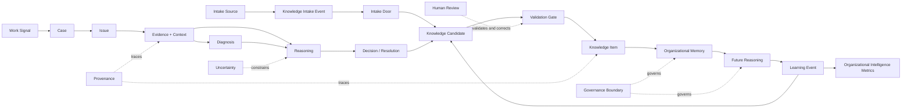
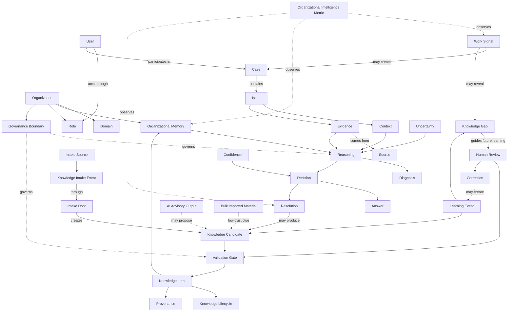

# Product Domain Model

## 1. Introduction

A domain model defines the core concepts in the product universe: the nouns the platform must understand, the relationships among them, the states they can enter, and the boundaries that govern them.

This is not a database schema, UI model, workflow specification, or technical architecture. It does not prescribe how concepts are stored, displayed, or implemented. It defines what must remain conceptually true regardless of those choices.

Domain language matters because product coherence depends on shared meaning. If founders, designers, engineers, and AI engineers use words such as *case*, *knowledge*, *memory*, *evidence*, *validation*, and *resolution* differently, they will build incompatible assumptions into product behavior. A resolved case may be mistaken for validated knowledge. A source may be treated as evidence without showing what it supports. A confidence signal may be confused with organizational approval.

The purpose of this document is to establish a ubiquitous language: one durable vocabulary for discussing product strategy, workflows, AI behavior, architecture, and future domain extensions. The model should make important distinctions explicit before technical decisions make them expensive to recover.

---

## 2. Relationship to Previous Documents

| Document | Primary Question |
| --- | --- |
| Founder's Thesis | Why should this company exist? |
| Product Vision | What product must exist? |
| Product Principles | How should product decisions be made? |
| Product Capability Model | What must the platform be able to do? |
| Product Domain Model | What concepts exist in the product universe? |

The [Founder's Thesis](./00_FOUNDERS_THESIS.md) establishes the purpose. The [Product Vision](./01_PRODUCT_VISION.md) establishes the product category. The [Product Principles](./02_PRODUCT_PRINCIPLES.md) constrain decisions. The [Product Capability Model](./03_PRODUCT_CAPABILITY_MODEL.md) defines the platform's enduring abilities.

This document bridges capability thinking and architecture. Capabilities define what the platform must do. The domain model defines what the platform must understand in order to do it. Later architecture and product designs may introduce technical or interface-specific language, but they should map back to these concepts without changing their meaning.

---

## 3. Domain Model Overview

The core model describes a learning system, not only a support workflow. An Organization receives Work Signals within Domains. Some signals become Cases containing Issues. Context and Evidence support Diagnosis and Reasoning. Decisions produce actions, Answers, and Resolutions. Knowledge may also enter through Knowledge Intake, including Manual Entry, Historical / Bulk Import, and API / Live Connection. Every intake path produces Knowledge Candidates, not trusted memory. Meaningful work may also produce Knowledge Candidates, which require Validation before they can become trusted Knowledge Items in Organizational Memory. Human Review, Corrections, Uncertainty, and Knowledge Gaps create Learning Events. Organizational Intelligence Metrics observe whether those events improve future capability.

Cross-cutting concepts—Role, Confidence, Provenance, Knowledge Lifecycle, and Governance Boundary—shape which knowledge can be trusted, used, changed, or applied.

This is a conceptual flow, not a technical sequence. Real work may enter at several points, loop backward, contain multiple issues, produce no new knowledge, or challenge knowledge already in memory.

---

## 4. Core Concept: Organization

An **Organization** is the primary owner of memory, governance, users, domains, policies, and trust boundaries within the platform. It is the unit whose ability to remember and learn the platform exists to improve.

An Organization may contain multiple Domains, such as Customer Support, HR, Finance, Legal, and IT. Knowledge may be shared across those Domains only when authority and Governance Boundaries permit it.

Important relationships:

- An Organization contains or serves Users.
- An Organization defines Roles and assigns authority through them.
- An Organization owns its Organizational Memory.
- An Organization defines Governance Boundaries.
- An Organization contains Domains and determines how they relate.

The platform serves organizations, not isolated conversations. A conversation matters because it can draw from or improve the Organization's capability over time.

---

## 5. Core Concept: User

A **User** is a human actor who interacts with, contributes to, reviews, governs, or benefits from Organizational Memory.

Users may include Customers, Support Agents, Support Managers, Knowledge Administrators, Domain Experts, Operations Managers, Executives, and IT or Governance Administrators. A User may be internal or external to the Organization. An external User may contribute evidence or receive an Answer without receiving access to internal memory.

Important relationships:

- A User belongs to, represents, or interacts with an Organization.
- A User acts through one or more Roles in a particular context.
- A User may create, review, correct, validate, govern, or consume knowledge.
- A User may participate in Cases and Human Reviews.
- A User's authority can differ by Domain, knowledge type, risk, and action.

Not all Users have equal authority over knowledge. Contribution, expertise, validation authority, and access are distinct.

---

## 6. Core Concept: Role

A **Role** expresses what a User is allowed and expected to do in the knowledge system. It connects organizational responsibility to authority inside the platform.

Roles may include Viewer, Contributor, Reviewer, Validator, Approver, Domain Expert, and Governance Administrator. These are conceptual responsibilities; an Organization may name or combine them differently.

A Role is not merely a job title. A Support Manager may be a Validator for support policy but only a Viewer of legal guidance. A Domain Expert may propose corrections without having permission to approve automation. One User may hold multiple Roles, and the same Role may carry different authority across Domains.

Role affects:

- Access to knowledge and Sources.
- Authority to validate or approve knowledge.
- Ability to change lifecycle state.
- Ability to approve automated use.
- Ability to view sensitive evidence.
- Accountability for Decisions and Human Reviews.

---

## 7. Core Concept: Domain

A **Domain** is a bounded area of organizational knowledge and work. It establishes the vocabulary, authority, evidence standards, risks, and governance rules within which knowledge is interpreted.

Examples include Customer Support, HR, IT Helpdesk, Finance, Legal, Healthcare Operations, Manufacturing, Government Services, and Education.

Domain matters because the same claim can carry different meaning and consequence in different areas. Each Domain may have:

- Distinct language and case types.
- Different authorities and validation standards.
- Different acceptable Evidence.
- Different levels of consequence and uncertainty tolerance.
- Different Governance Boundaries.
- Domain-specific extensions to the core model.

Customer Support is the first Domain, not the definition of the platform. The core model must remain meaningful when a Case is not a ticket and a User is not a support agent.

---

## 8. Core Concept: Work Signal

A **Work Signal** is an observable event or artifact that may reveal a knowledge need, knowledge use, Knowledge Gap, or learning opportunity.

Examples include a customer message, email thread, ticket, chat conversation, resolved case, human correction, repeated question, policy update, failed answer, escalation, product change, or outcome that contradicts prior expectations.

Work Signals are the raw material of organizational learning. A signal does not automatically create a Case or Knowledge Candidate. It must be interpreted in context. One signal may contribute to an existing Case; repeated signals may reveal a pattern; and a policy update may directly challenge several Knowledge Items.

A Work Signal should retain its Source and time context so that later interpretation remains traceable.

---

## 9. Core Concept: Case

A **Case** is a bounded unit of work created around a problem, question, request, incident, or decision need. It provides the working container in which people and the platform gather context, examine evidence, reason, decide, act, and observe outcomes.

In Customer Support, a Case may correspond to a ticket or conversation. Conceptually, Case is broader than either. An HR request, legal review, operational incident, or finance exception may also be a Case.

A Case may contain:

- One or more Issues.
- Context and Evidence.
- Participants and their Roles.
- Diagnosis and Reasoning.
- Decisions, Answers, and Resolutions.
- Outcomes and follow-up signals.
- Learning potential.

Cases are not valuable only because they are resolved. A Case may contain a reusable exception, expose a contradiction, disprove a prior assumption, or show that existing knowledge cannot be applied.

---

## 10. Core Concept: Issue

An **Issue** is the underlying problem, question, uncertainty, or need being addressed within a Case.

Examples include a delayed package, refund eligibility, failed onboarding, missing proof of residence, a policy exception, a system-access problem, or conflicting documentation.

A single Case may contain multiple Issues. A customer who cannot access an account may also raise an identity-verification question and a billing concern. Those Issues may require different Evidence, authorities, Decisions, and Resolutions even though they share one Case.

The distinction is fundamental:

- **Case:** the container and history of work.
- **Issue:** the problem inside that work.

Closing one Issue does not necessarily resolve the Case, and closing a Case does not prove that every Issue produced reusable learning.

---

## 11. Core Concept: Context

**Context** is the set of conditions that affects how Evidence should be interpreted and how knowledge should apply.

Context may include customer history, product version, policy version, geography, time, account status, previous attempts, risk level, customer segment, organizational state, and domain-specific rules.

Context gives a claim its boundaries. Two Cases may appear similar while requiring different Decisions because they occurred under different policies, involved different account states, or carried different consequences. Conversely, differently worded Cases may share the same Issue and applicable knowledge.

Context is not incidental metadata. It is part of the meaning of a Diagnosis, Decision, Resolution, and Knowledge Item. Removing it can turn correct knowledge into unsafe generalization.

---

## 12. Core Concept: Evidence

**Evidence** is information used to support, challenge, or explain a Diagnosis, Decision, Answer, or Knowledge Item.

Evidence may include prior Cases, policies, documentation, customer-provided information, system records, screenshots, expert comments, approval records, observed outcomes, and failed attempts.

Evidence has a relationship to a claim. It may support a claim, contradict it, limit it, or explain why it applies. The same Source can provide Evidence for several claims, and a Source is not automatically credible or sufficient merely because it exists.

The distinction from Source is essential:

- **Source:** where information came from.
- **Evidence:** how that information bears on a claim or judgment.

Evidence should remain interpretable in Context and traceable to its Source.

---

## 13. Core Concept: Source

A **Source** is the origin of information used by a human or the platform.

Examples include a customer message, internal document, previous ticket, Human Review, policy page, manager approval, system record, or audit record.

Source identity supports Provenance. It allows a person to ask who or what produced the information, when it was produced, under what authority, and whether it has changed. A source may be primary or derivative, current or historical, authoritative or informal.

A Source does not establish truth by itself. Its information becomes Evidence only in relation to a claim and Context. A manager approval may be authoritative evidence for an exception Decision but not evidence that a technical Diagnosis is correct.

---

## 14. Core Concept: Diagnosis

A **Diagnosis** is an interpretation of an Issue based on Context and Evidence. It identifies what is likely happening and why.

Examples include:

- A package delay caused by a hub backlog.
- Onboarding blocked by missing proof of residence.
- A refund request outside the applicable policy window.
- Account access blocked by a verification mismatch.

A Diagnosis should preserve the Evidence that supports it, relevant alternatives, its Confidence, and any Uncertainty. It may be revised when new Evidence appears.

Diagnosis is not Resolution. Diagnosis explains the problem. Resolution determines or records what was done about it. A correct Diagnosis may have several valid Resolutions, and a workaround may resolve immediate symptoms without establishing a complete Diagnosis.

---

## 15. Core Concept: Reasoning

**Reasoning** is the process of connecting Context, Evidence, Organizational Memory, and Uncertainty to reach or support a Diagnosis, Decision, or recommendation.

Reasoning should be:

- Grounded in traceable organizational knowledge and Evidence.
- Inspectable enough for a human to evaluate and correct.
- Bounded by what the Evidence supports.
- Aware of missing, conflicting, or stale knowledge.
- Aware of Role, authority, risk, and Governance Boundaries.

Reasoning is different from answer generation. Answer generation produces words for a User. Reasoning determines what is likely true, applicable, permitted, or appropriate to do. Fluent words without sound reasoning do not create a trustworthy Answer.

Reasoning may conclude that the correct next action is to ask for more Context, seek Human Review, or decline to make a recommendation.

---

## 16. Core Concept: Decision

A **Decision** is a selected course of action or judgment made in a Case or knowledge process.

Examples include answering a customer, asking a follow-up question, escalating, approving a refund, rejecting a request, marking knowledge as disputed, or validating new guidance.

A Decision should have:

- The Context in which it was made.
- The Evidence and Reasoning that supported it.
- The User or authority responsible for it.
- Its relationship to applicable Organizational Memory.
- Any material Uncertainty and risk.
- Provenance and an observed outcome when available.

A Decision is not always a final Resolution. A Decision to escalate moves the Case toward appropriate authority. A Decision to challenge a Knowledge Item begins a knowledge process rather than ending one.

---

## 17. Core Concept: Resolution

A **Resolution** is the outcome that addresses or closes a Case or Issue.

It may include a final Answer, action taken, completed escalation, applied workaround, approved or denied refund, closed Issue, or updated knowledge. A Case with multiple Issues may contain multiple Resolutions.

Resolution should preserve what happened, why, under whose authority, and with what outcome. A Resolution may later be shown ineffective or incomplete by a new Work Signal.

Resolution does not automatically mean learning happened. A Case may be closed through one-time effort while leaving future people to repeat the same investigation. Learning occurs only when the work changes what the Organization can know or do in the future.

---

## 18. Core Concept: Answer

An **Answer** is situational communication delivered to a User or Customer in response to a question, need, or Case.

An Answer may be automatic, drafted, reviewed, human-written, or AI-assisted. Its mode of creation does not determine its truth. An Answer should reflect applicable knowledge, Context, Confidence, authority, and the communication needs of the recipient.

Answer is not Knowledge:

- An Answer is communication for a particular situation.
- Knowledge is a reusable organizational lesson under stated conditions.

A good Answer may apply existing knowledge perfectly and create no new knowledge. A bad Answer may reveal a Knowledge Gap, faulty Reasoning, missing Context, or stale guidance. Preserving every Answer as trusted knowledge would confuse past communication with reusable truth.

---

## 19. Core Concept: Knowledge Intake

**Knowledge Intake** is the process by which potential organizational knowledge enters the platform before it becomes trusted memory.

Knowledge Intake produces candidates, not truth. Its purpose is to prevent knowledge from becoming a lost archive by giving the Organization governed ways to bring reasoning, context, historical material, and live work signals into the learning system without collapsing them into trusted Organizational Memory.

The three canonical intake doors are:

- **Manual Entry:** a human directly contributes knowledge, usually reasoning, context, or the "why" behind a decision or piece of work. It is best for knowledge that was never written down. Manual contribution may carry strong context, but it still requires Validation.
- **Historical / Bulk Import:** existing documents, archives, exported records, or legacy material are imported into the OIP. It is best for existing backlog, but enters as low-trust reference material because context may be missing.
- **API / Live Connection:** the OIP connects to approved organizational systems through scoped, permissioned APIs and captures work signals continuously. It is best for live work because context is still fresh. In Customer Support, live connection is the strongest early MVP path because support work already produces high-volume, high-context Work Signals.

An **Intake Door** is a supported mode of knowledge entry into the platform. The door affects what Context, Evidence, authority, freshness, and uncertainty are likely to accompany the intake event, but it does not determine trust by itself.

A **Knowledge Intake Event** is a particular occurrence of potential knowledge entering through an Intake Door from an Intake Source. It preserves the event's Context, Source, contributor or system, time, transformation, and validation status.

An **Intake Source** is the origin of a Knowledge Candidate, such as a person, document archive, ticketing system, support tool, chat system, connected API, or approved organizational system.

**Intake Provenance** is the traceable origin and context of an intake event, including source, contributor, system, time, transformation, and validation status. Intake Provenance is part of the broader Provenance model, but it is named separately because the path into the platform affects how a candidate should be interpreted.

No intake door creates trusted Organizational Memory directly. All three doors feed the same Validation Gate and the same memory system.

---

## 20. Core Concept: Knowledge Candidate

A **Knowledge Candidate** is a proposed unit of reusable knowledge produced by any intake door or extracted from work, but not yet validated as trusted Organizational Memory. It may come from Manual Entry, Historical / Bulk Import, API / Live Connection, a resolved Case, Correction, expert explanation, policy update, repeated pattern, pattern discovery, conflicting Answers, AI Advisory Output, or AI-assisted extraction.

A Knowledge Candidate should state what lesson is proposed, the Context and conditions in which it may apply, its Sources and Evidence, its limits, and why it is believed to be reusable.

It is not yet trusted Organizational Memory. It requires Validation appropriate to the Domain, risk, evidence, and authority involved.

Proposed knowledge must not become trusted automatically because extraction can remove nuance, one Case may be exceptional, repeated behavior may still be wrong, bulk imported content may lack living context, and AI-generated summaries may introduce unsupported claims. Candidate status makes learning possible without confusing possibility with truth.

---

## 21. Core Concept: Knowledge Item

A **Knowledge Item** is reusable organizational knowledge that has earned a defined level of trust through Validation and can guide future work under stated conditions.

A Knowledge Item should preserve:

- Its claim, lesson, procedure, or pattern.
- Context and applicability.
- Limits, exceptions, and risk.
- Evidence and Sources.
- Validation status and basis.
- Owner and responsible Domain.
- Knowledge Lifecycle state.
- Provenance and history.
- Relationships to Cases and other Knowledge Items.

A Knowledge Item is not merely an article. It may represent a rule, procedure, exception, explanation, Decision pattern, Diagnosis pattern, policy interpretation, or other reusable lesson.

Once created, a Knowledge Item can be challenged, become stale, be deprecated, or be replaced. It remains part of organizational history even when it is no longer approved for current use.

---

## 22. Core Concept: Organizational Memory

**Organizational Memory** is the connected body of contextual knowledge owned by an Organization and preserved across people, systems, and time with trust intact.

It includes active Knowledge Items and the histories, relationships, Sources, Validations, Corrections, and lifecycle states required to interpret them. Disputed, deprecated, and replaced knowledge may remain in memory as history without remaining approved guidance.

Organizational Memory is not storage. Storage preserves records. Memory makes knowledge findable, understandable, traceable, current enough to use, and bounded by Context and Governance.

Memory belongs to the Organization rather than to an individual conversation, User, or interface. Its value is realized when it improves future Reasoning while remaining open to challenge and evolution.

---

## 23. Core Concept: Validation

**Validation** is the process by which a Knowledge Candidate or Knowledge Item earns, loses, or changes organizational trust.

The **Validation Gate** is the governed boundary that determines whether a Knowledge Candidate can become trusted Organizational Memory. It may involve human review, source checking, provenance review, domain authority, contradiction checks, successful use, risk assessment, and trust scoring.

Validation may depend on:

- Human Review and Domain authority.
- Source quality and supporting Evidence.
- Successful use in applicable Cases.
- Contradiction checks and observed outcomes.
- Risk level and consequence.
- Governance requirements.
- Freshness and continued applicability.

Relevant states may include proposed, validated, disputed, stale, deprecated, and replaced. These states do not all mean the same thing: *disputed* signals unresolved conflict; *stale* signals insufficient assurance of currency; *deprecated* prohibits current reliance; and *replaced* connects prior guidance to its successor.

Validation is the boundary between candidate knowledge and trusted memory. It is not permanent approval. New Evidence, policy change, or failed reuse may change trust. The basis and authority for each change should remain part of Provenance.

---

## 24. Core Concept: Confidence

**Confidence** expresses how strongly the platform can rely on a Diagnosis, Answer, recommendation, or Knowledge Item in a specific Context.

Confidence is contextual. It should depend on:

- Strength and relevance of Evidence.
- Quality and authority of Sources.
- Validation and Knowledge Lifecycle state.
- Freshness.
- Applicability to the current Context.
- Conflicting knowledge or outcomes.
- Risk and consequence.
- Governance requirements and Decision authority.

Confidence is not simply probability. A likely interpretation may still be inappropriate to act on if consequence is high, authority is unclear, or required approval is missing. A validated Knowledge Item may have high general trust but low confidence in a Case outside its stated applicability.

Confidence should guide behavior: answer, draft, ask, review, or escalate.

---

## 25. Core Concept: Uncertainty

**Uncertainty** is the explicit recognition that available knowledge may be incomplete, conflicting, outdated, insufficient, inapplicable, or unsafe to use.

Types include:

- Missing knowledge.
- Conflicting knowledge.
- Stale knowledge.
- Insufficient Context.
- Low or indirect Evidence.
- High consequence.
- Unclear authority.

Uncertainty is not the opposite of all knowledge. A Case can contain strong Evidence and still have uncertainty about policy applicability. Different types may coexist and require different responses.

Material Uncertainty should affect Confidence and trigger an appropriate action: request Context, seek Human Review, escalate, investigate, challenge a Knowledge Item, or create a Knowledge Gap. Hiding it behind fluent language violates the product's trust model.

---

## 26. Core Concept: Human Review

**Human Review** is a human judgment event used to approve, reject, correct, clarify, validate, or escalate work or knowledge.

Human Review is not a failure mode. It is part of the learning system and a source of organizational trust. Its meaning depends on the reviewer's Role, Domain authority, Evidence, and the action being reviewed.

Human Review may affect:

- An Answer, Diagnosis, or Decision.
- A Knowledge Candidate.
- Validation or Knowledge Lifecycle state.
- Confidence and Uncertainty.
- A Correction or escalation.
- Future Reasoning.

A review should preserve the judgment, rationale, authority, and Context involved. Approval without rationale may authorize an action, but it contributes less reusable learning than an explanation of why it was correct.

---

## 27. Core Concept: Correction

A **Correction** is a change made because a prior Answer, Diagnosis, Reasoning process, Decision, or Knowledge Item was incomplete, wrong, outdated, unclear, or unsafe.

A Correction should identify what changed and why. It may correct the immediate output, challenge a Knowledge Item, alter Confidence, create a Knowledge Candidate, or change a lifecycle state.

Corrections are especially valuable because they reveal the boundary between what the system or Organization believed and what reality or expert judgment showed. They can expose missing Context, weak Evidence, a misunderstood exception, a stale policy, or faulty Reasoning.

Not every edit is a Correction, and not every Correction is reusable knowledge. When a Correction reveals a durable lesson, it should create a Learning Event and feed future Validation and Reasoning.

---

## 28. Core Concept: Learning Event

A **Learning Event** occurs when work changes what the Organization can know or do in the future.

Examples include:

- A human Correction becoming reusable knowledge.
- A repeated question revealing a missing Answer.
- A contradiction being resolved.
- Stale guidance being replaced.
- An escalation producing new validated guidance.
- A failed Answer revealing an incorrect assumption.
- A new outcome changing Confidence or applicability.

A Learning Event may create or update a Knowledge Candidate, Knowledge Item, Knowledge Gap, Validation, relationship, or metric. It should identify the before-and-after change in organizational capability.

Not every Case creates a Learning Event. Routine use of trusted knowledge may produce evidence of reuse without changing memory. Calling every closed Case “learning” would make the concept meaningless.

---

## 29. Core Concept: Knowledge Gap

A **Knowledge Gap** is an area where Organizational Memory is missing, weak, stale, conflicting, inaccessible, or insufficient for real work.

Knowledge Gaps may be detected through repeated questions, low Confidence, escalations, contradictions, failed Answers, stale documents, customer confusion, unsuccessful reuse, or excessive dependency on a small number of experts.

A Knowledge Gap should preserve the affected Domain and Issues, supporting Work Signals, consequence, frequency, current workaround, and what would constitute closure. A gap is not closed merely because content was created; trusted knowledge must become usable in the relevant work.

Knowledge Gaps are strategic signals. They show where the Organization must learn, clarify, reconcile, or distribute expertise. Across many Cases, they turn frontline work into a sensor for product, policy, process, and training weakness.

---

## 30. Core Concept: Knowledge Lifecycle

The **Knowledge Lifecycle** describes how knowledge changes state over time while retaining history.

Possible states include:

- **Draft:** being formed and not ready for reliance.
- **Proposed:** submitted as a Knowledge Candidate for Validation.
- **Validated:** trusted for a defined scope.
- **Active:** currently available to guide work.
- **Challenged:** questioned by new Evidence or judgment.
- **Disputed:** subject to unresolved material conflict.
- **Stale:** no longer sufficiently current to retain prior trust.
- **Deprecated:** not approved for current use.
- **Replaced:** superseded by traceably newer guidance.

Lifecycle matters because organizational truth changes. The platform must distinguish current guidance from historical knowledge without deleting the history that explains prior Decisions. State changes require appropriate authority, reason, and Provenance.

Lifecycle state is related to, but not identical with, Validation. Validation is the process and basis by which trust changes; lifecycle records the knowledge's current standing and use.

---

## 31. Core Concept: Provenance

**Provenance** is the traceable history of where information and knowledge came from, how they changed, who reviewed or validated them, what Evidence supports them, and when and where they apply.

Provenance may connect a Knowledge Item to Sources, Cases, Knowledge Candidates, Corrections, Human Reviews, Decisions, owners, lifecycle changes, and previous versions.

Provenance is required for trust because a claim cannot be responsibly assessed without understanding its origin and authority. It supports auditability by explaining who changed what and why. It supports governance by showing whether knowledge crossed a Domain or authority boundary appropriately.

Provenance is more than a citation. A citation identifies a Source; Provenance preserves the chain of interpretation, validation, and change between Source and current knowledge.

---

## 32. Core Concept: Governance Boundary

A **Governance Boundary** defines what knowledge can be accessed, used, changed, validated, or applied by which Users, Roles, Domains, and situations.

A boundary may reflect confidentiality, organizational policy, legal obligation, domain authority, geographic restriction, customer relationship, risk, or separation of responsibility.

Governance is not only permission. Permission answers whether an action is allowed. Governance also defines:

- Who has authority to make or validate a Decision.
- Who is accountable for the outcome.
- What Evidence or approval a risk level requires.
- Whether knowledge may cross Domains or organizational groups.
- How sensitive Sources may influence Reasoning without inappropriate disclosure.
- When automation is permitted or prohibited.

A response that is factually supported but violates a Governance Boundary is not a valid product outcome.

---

## 33. Core Concept: Organizational Intelligence Metric

An **Organizational Intelligence Metric** measures whether an Organization is becoming more capable over time because it learns from accumulated experience.

Examples include:

- Reduction in repeated work.
- Knowledge Gap closure.
- Answer consistency.
- Confidence improvement in recurring Issues.
- Knowledge freshness.
- Reduced fragile dependency on particular experts.
- Time from a new Issue to validated knowledge.
- Reuse of validated knowledge with successful outcomes.
- Corrections that prevent similar future errors.

These metrics differ from ordinary support metrics. Ticket volume, response time, resolution time, and deflection describe activity and efficiency. They do not establish that memory improved or learning compounded.

An Organizational Intelligence Metric should connect work, changes in memory, and future outcomes. It should avoid rewarding volume, capture, reuse, or automation without regard to trust and quality.

---

## 34. Key Relationships

The following relationships define the core conceptual structure. “May” is intentional: not every Work Signal becomes a Case, not every Resolution produces knowledge, and not every Correction creates a reusable lesson.

| Subject | Relationship | Object | Meaning |
| --- | --- | --- | --- |
| Organization | contains | Domain | Work and knowledge operate within bounded areas. |
| Organization | owns | Organizational Memory | Memory is an organizational asset governed by the Organization. |
| Organization | defines | Role, Governance Boundary | Authority and permitted use come from organizational rules. |
| User | acts through | Role | Authority is contextual rather than implied by identity or title alone. |
| User | participates in | Case, Human Review | Humans create, apply, challenge, and govern knowledge through work. |
| Work Signal | may create or update | Case | An observed event may require bounded work. |
| Work Signal | may reveal | Knowledge Gap, Learning Event | Patterns and outcomes can expose what the Organization needs to learn. |
| Case | contains | Issue | A unit of work can address one or more underlying problems. |
| Case | carries | Context, Evidence, Reasoning, Decision, Resolution | The work container preserves the path from problem to outcome. |
| Issue | is interpreted through | Context, Evidence | Meaning and action depend on conditions and support. |
| Evidence | comes from | Source | The origin remains traceable while its relevance is explicit. |
| Intake Source | produces | Knowledge Intake Event | Potential knowledge enters from a traceable origin. |
| Knowledge Intake Event | passes through | Intake Door | Entry occurs through Manual Entry, Historical / Bulk Import, or API / Live Connection. |
| Intake Door | creates | Knowledge Candidate | Intake creates proposed knowledge, not trusted truth. |
| Reasoning | uses | Context, Evidence, Organizational Memory | Judgment connects current facts to accumulated learning. |
| Reasoning | produces or supports | Diagnosis, Decision, Answer | Reasoning determines what is likely true or appropriate. |
| Decision | may produce | Answer, action, Resolution | A chosen judgment changes the Case or knowledge process. |
| Resolution | may produce | Knowledge Candidate | A reusable lesson may be extracted from an outcome. |
| Knowledge Candidate | passes through | Validation Gate | Proposed learning does not become trusted automatically. |
| Validated Knowledge Candidate | becomes | Knowledge Item | Sufficiently supported reusable knowledge enters memory with a defined trust state. |
| Knowledge Item | belongs to | Organizational Memory | Reusable knowledge is connected to organizational context and history. |
| Knowledge Item | has | Knowledge Lifecycle, Provenance | Current standing and change history remain explicit. |
| Bulk Imported Material | is not | Trusted Organizational Memory | Historical content enters as low-trust clues until validated. |
| AI Advisory Output | may propose | Knowledge Candidate | AI assistance may suggest learning but never directly creates trusted memory. |
| Confidence | qualifies | Diagnosis, Answer, recommendation, Knowledge Item use | Reliance depends on the specific Context. |
| Uncertainty | constrains | Reasoning, Confidence, Decision | Known limits change what the platform should do. |
| Human Review | may validate, correct, dispute, or escalate | Work or knowledge | Human judgment protects trust and supplies learning. |
| Correction | may create | Learning Event | A correction becomes learning when it changes future capability. |
| Learning Event | may create or update | Knowledge Candidate, Knowledge Item, Knowledge Gap | Learning changes what the Organization knows or must investigate. |
| Knowledge Gap | is detected from | Work Signals, low Confidence, escalation, contradiction, failed Answer | Repeated insufficiency becomes an explicit learning need. |
| Governance Boundary | governs | Access, Reasoning, Validation, application | Knowledge use must respect authority, accountability, and risk. |
| Organizational Intelligence Metric | observes | Work, memory change, outcomes | Measurement determines whether learning compounds. |

This graph is conceptual. It shows meaning and dependency, not storage structure, cardinality, or execution order.

---

## 35. Domain Integrity Rules

The following rules protect the meaning of knowledge, memory, and intake across product, workflow, architecture, and AI design:

1. No intake door creates trusted Organizational Memory directly.
2. Every intake path must preserve Provenance.
3. Bulk imported material enters as low-trust clues, not validated knowledge.
4. Manual contribution may carry strong context, but still requires Validation.
5. Live API intake captures work with the strongest available context but still produces candidates first.
6. Validation is the boundary between candidate knowledge and trusted memory.
7. AI may assist intake, classification, enrichment, and drafting, but may not promote knowledge to memory.
8. Trusted memory is reusable by humans and AI agents only after Validation.
9. Knowledge Intake must be scoped by Organization Profile and Governance.
10. The OIP should capture knowledge before it decays into disconnected archives.

---

## 36. Important Distinctions

### Case vs. Issue

**Case** is the container and history of work. **Issue** is a problem, question, uncertainty, or need inside that work. One Case may contain several Issues with different outcomes.

### Source vs. Evidence

**Source** is where information came from. **Evidence** is how that information supports, challenges, or limits a claim. A Source is not automatically sufficient Evidence.

### Answer vs. Knowledge

**Answer** is situational communication. **Knowledge** is a reusable organizational lesson under stated conditions. A good Answer may add no new knowledge; an incorrect Answer may reveal a Knowledge Gap.

### Knowledge Intake vs. Organizational Memory

**Knowledge Intake** brings potential knowledge into the platform. **Organizational Memory** contains trusted, contextual knowledge after appropriate Validation. Intake prevents knowledge loss; it does not itself establish truth.

### Knowledge Candidate vs. Knowledge Item

**Knowledge Candidate** is proposed reusable knowledge awaiting Validation. **Knowledge Item** is reusable organizational knowledge that has earned a defined trust state. Treating candidates as items would confuse possibility with memory.

### Bulk Imported Material vs. Trusted Knowledge

**Bulk Imported Material** may contain useful clues, historical records, and prior documentation. **Trusted Knowledge** requires current context, Evidence, Provenance, and Validation. Importing an archive does not make the archive organizational truth.

### Resolution vs. Learning Event

**Resolution** addresses or closes a Case or Issue. **Learning Event** changes what the Organization can know or do in the future. Resolution creates learning only when a reusable change occurs.

### Confidence vs. Validation

**Confidence** is contextual reliance on a Diagnosis, Answer, recommendation, or Knowledge Item in a particular situation. **Validation** is the process through which organizational trust is granted, changed, or removed from knowledge. Validated knowledge can still have low Confidence outside its scope.

### Organizational Memory vs. Storage

**Storage** preserves records. **Organizational Memory** preserves usable knowledge with Context, trust, Provenance, relationships, and lifecycle intact.

### User Role vs. Job Title

**Role** defines authority and responsibility inside the platform. **Job title** describes an employment position. A title does not by itself grant validation, access, or approval authority.

### Governance vs. Permission

**Permission** controls whether an action or access is allowed. **Governance** also includes authority, accountability, risk, Evidence requirements, and rules for appropriate use.

---

## 37. Domain Boundaries and Future Expansion

The first product operates in Customer Support, but support-specific terms should not dominate the core domain model.

| Support-specific expression | Core concept |
| --- | --- |
| Ticket or support conversation | Case |
| Customer message | Work Signal |
| Customer problem or request | Issue |
| Help center article | One expression of Knowledge Item |
| Agent reply | Answer |
| Manager escalation | One expression of Decision or Human Review |
| Closed ticket | One possible Case state or Resolution, not proof of learning |
| Ticketing-system or support-tool connection | One expression of API / Live Connection |

The same core concepts should later apply to HR, Legal, Finance, IT, Healthcare Operations, Manufacturing, Government, and Education. A legal matter and a support ticket are not operationally identical, but each can contain Issues, Evidence, Context, Reasoning, Decisions, Human Review, and reusable learning. Domain-specific authority, risk, Evidence, and lifecycle rules must remain distinct.

Future domain models may extend this core model with specialized concepts. They should not redefine core terms in contradictory ways. For example, a Healthcare Domain may add specialized review and Evidence concepts, while still preserving the distinction between a Case, an Issue, a Source, Evidence, a Decision, and a Knowledge Item.

Cross-Domain use must also respect Governance Boundaries. A lesson may be conceptually related across Domains without being accessible, authoritative, or safe to apply across them.

---

## 38. What This Document Does Not Define

This document does not define:

- Database schemas or storage structure.
- API contracts.
- Software object models, classes, or interfaces.
- UI screens, labels, or navigation.
- Detailed workflow steps.
- Detailed permissions or policy rules.
- AI model behavior or prompts.
- Technical architecture or infrastructure.
- MVP scope or release sequencing.
- Pricing or packaging.
- Go-to-market strategy.

Those belong in future documents. Their terminology and boundaries should map back to this model. A later data model may represent these concepts in several technical structures; a UI may combine them for ease of use; and a workflow may order them differently. None of those choices should erase the conceptual distinctions established here.

---

## 39. Closing

The Founder's Thesis defines why the company exists. The Product Vision defines what must exist. The Product Principles define how decisions should be made. The Product Capability Model defines what the platform must be able to do. The Product Domain Model defines what the platform must understand.

This language is the foundation for what comes next. Architecture should preserve these concepts and relationships. Data modeling should represent them without collapsing important distinctions. AI agent design should reason within their trust, uncertainty, Provenance, Role, and Governance boundaries. Product strategy and MVP scope should create coherent paths from Knowledge Intake and Work Signals to learning rather than disconnected features. UI design should make the distinctions understandable without changing their meaning.

Consistent language will not resolve every future decision, but it will ensure that teams are deciding about the same product universe. That is necessary for building an Organizational Intelligence Platform that can preserve human expertise, reason from trusted memory, learn from work, and become more useful over time.
