# Product Workflow Model

## 1. Introduction

The Product Domain Model defines **what exists** in the product universe. It establishes concepts such as Knowledge Intake, Intake Door, Knowledge Candidate, Work Signal, Case, Issue, Evidence, Reasoning, Decision, Knowledge Item, Human Review, Learning Event, and Organizational Memory.

The Product Workflow Model defines **how those concepts interact over time**. It describes how daily work can become a resolved outcome, how meaningful outcomes can become trusted knowledge, and how trusted knowledge can improve future work.

These workflows describe organizational learning, not software execution. They are not technical sequences, interface flows, or implementation instructions. A real workflow may pause, repeat, branch, combine several steps, or involve several people. The model preserves the meaning and trust requirements of the behavior even when a future product expresses that behavior differently.

The central question is not merely how a Case reaches Resolution. It is whether the Organization captures knowledge before it decays, handles work responsibly, recognizes what it does not know, and preserves any reusable lesson so that future work starts from a stronger place.

---

## 2. Relationship to Previous Documents

This document explicitly derives from all five foundational documents:

| Document | Primary Question |
| --- | --- |
| [Founder's Thesis](./00_FOUNDERS_THESIS.md) | Why should this company exist? |
| [Product Vision](./01_PRODUCT_VISION.md) | What product must exist? |
| [Product Principles](./02_PRODUCT_PRINCIPLES.md) | How should product decisions be made? |
| [Product Capability Model](./03_PRODUCT_CAPABILITY_MODEL.md) | What abilities must the platform possess? |
| [Product Domain Model](./04_PRODUCT_DOMAIN_MODEL.md) | What concepts exist? |
| Product Workflow Model | How do those concepts behave over time? |

The foundation constrains the workflows. Knowledge Intake creates candidates, not truth. Memory comes before automation. Human expertise remains the source of trust. Uncertainty and Provenance remain visible. Knowledge requires a lifecycle. Governance applies throughout. Learning is measured by improved future capability, not only completed activity.

---

## 3. Organizational Knowledge Intake Workflow

The Organizational Knowledge Intake Workflow is the universal workflow shared by every future knowledge source. It describes how potential knowledge enters the OIP, becomes a Knowledge Candidate, passes through Validation, and may improve Organizational Memory.

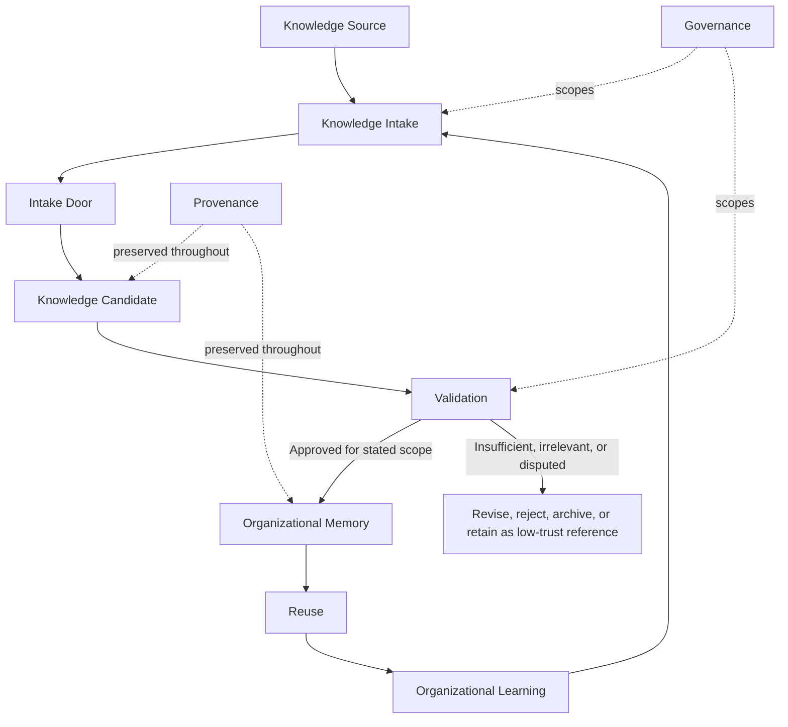

This workflow does not assume a customer support ticket. A knowledge source may be human experience, a document archive, a live ticketing system, an IT incident, an HR request, a legal matter, or another approved organizational system. The workflow is universal because every path converges on the same candidate, validation, memory, trust, reuse, and learning model.

### Door 1 — Manual Knowledge Entry

Manual Knowledge Entry captures reasoning, expertise, decisions, and operational knowledge that was never formally documented.

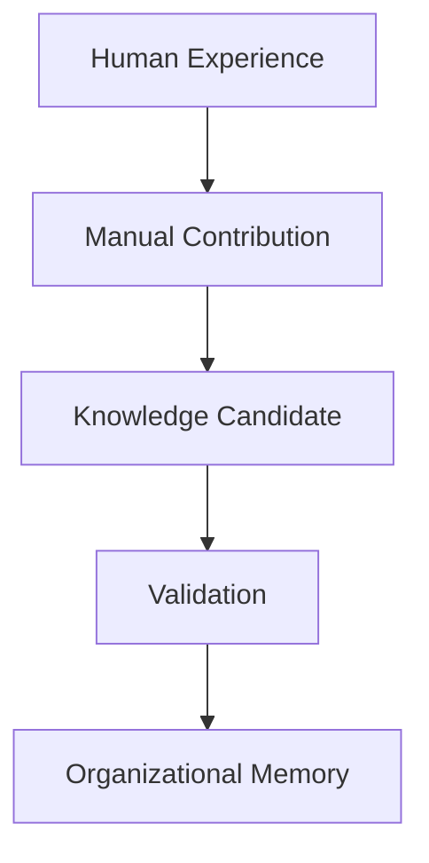

Manual contribution is valuable because important organizational knowledge often lives in judgment, explanation, exceptions, and the "why" behind work. It may arrive with strong context, but it still requires Validation before it becomes trusted memory.

### Door 2 — Historical Knowledge Import

Historical Knowledge Import brings existing documents, chats, archives, exports, and legacy material into the OIP as reference material.

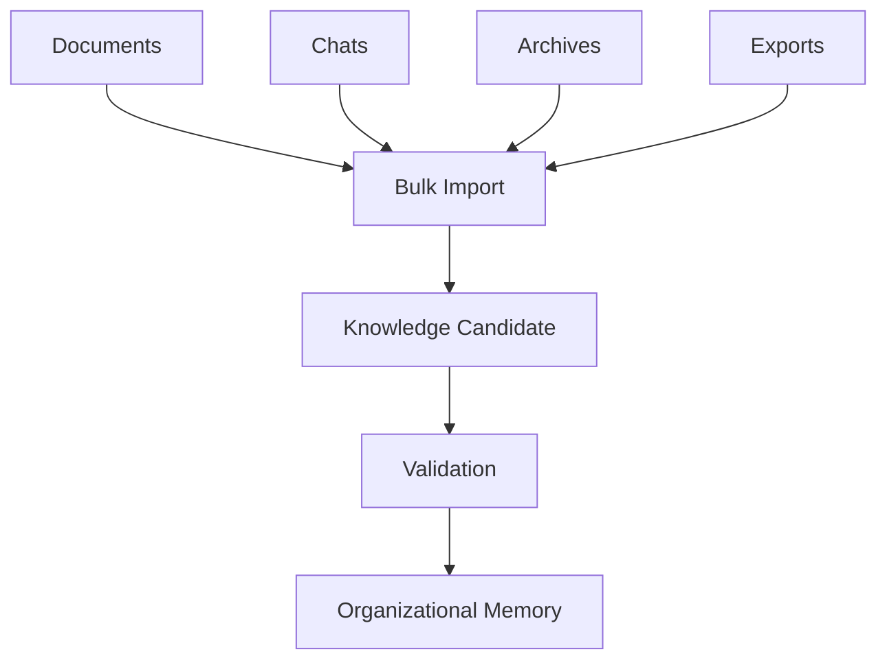

Imported material is not trusted memory automatically. It may contain useful clues, prior decisions, old procedures, or contradictory records, but its Context, authority, currency, and applicability must be established before it can guide future work.

### Door 3 — Live Workflow Capture (Current MVP)

Live Workflow Capture is the current hackathon implementation and the first production-quality intake door. It begins with live customer support work because live work provides the richest Context, freshest Evidence, and clearest path from Resolution to learning.

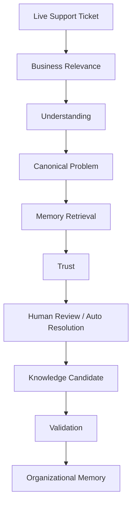

Customer Support is therefore the MVP workflow, not the boundary of the product. The architecture is intentionally designed so additional intake workflows reuse the same downstream validation, memory, trust, and learning engines.

### Workflow Convergence

Every intake door converges into one Organizational Intelligence pipeline. The product should not create parallel memory systems for manual notes, imports, live tickets, or AI-assisted suggestions.

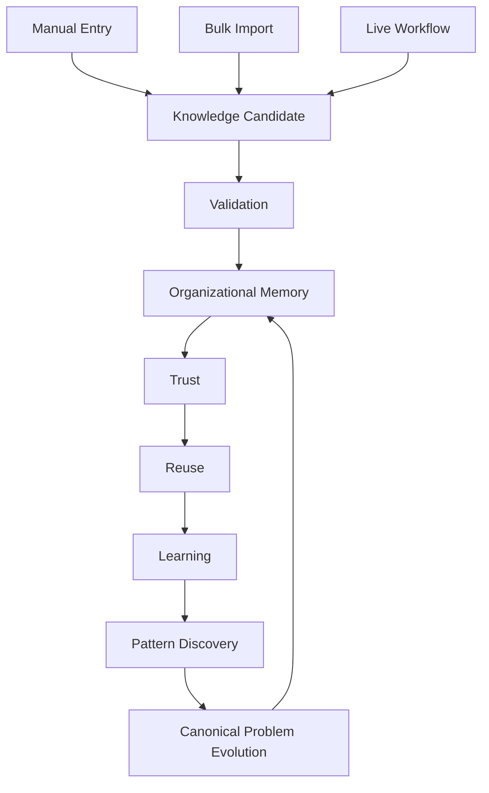

This convergence is a key architectural principle: new intake doors should feed the existing intelligence components rather than create separate knowledge silos.

### Workflow States

Knowledge may move through the following workflow states:

- **Captured:** information, experience, or work signal has entered through an intake door.
- **Candidate:** proposed reusable knowledge has been formed but not trusted.
- **Under Validation:** the candidate is being checked against Evidence, authority, Provenance, Governance, and risk.
- **Approved:** the candidate has passed the required review for a stated scope.
- **Trusted:** the approved Knowledge Item can guide future work within its boundaries.
- **Reused:** trusted memory has been applied to future work.
- **Improved:** reuse, Correction, Evidence, or outcome has changed the memory.
- **Archived:** captured or historical material remains preserved but is not approved for current reliance.

Not every captured item becomes trusted knowledge. Some material remains useful as reference, evidence, history, or a rejected candidate without becoming Organizational Memory.

### MVP Scope

The current implementation focuses on Door 3: Live Customer Support Workflow. Future releases may add Door 1 and Door 2 without changing the downstream Organizational Intelligence pipeline.

This keeps the prototype intentionally focused while preserving the platform direction: live support is the first beachhead for Knowledge Intake, not a one-off support tool.

---

## 4. Current MVP Workflow: Live Customer Support Learning Loop

The Live Customer Support Learning Loop is the current MVP expression of the Organizational Knowledge Intake Workflow. It is the complete conceptual workflow through which a live support Work Signal may improve future organizational capability.

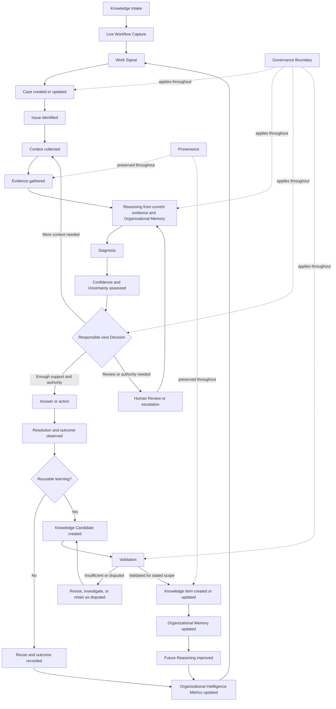

The downward line is not a guarantee that every support Work Signal completes every step. It represents the full learning opportunity for Door 3. The transitions have the following meaning.

### Knowledge Intake -> Live Workflow Capture

The workflow begins when approved live support work enters the platform as Knowledge Intake. This intake door preserves the immediate Context of the work while still treating any proposed learning as a candidate rather than trusted memory.

### Work Signal → Case created or updated

An observable event or artifact indicates a question, problem, decision need, knowledge use, or possible learning opportunity. The Organization determines whether it requires a new bounded unit of work, belongs to an existing Case, or contributes to a wider pattern.

### Case → Issue identified

The Case establishes the container; the Issue identifies the underlying problem inside it. A Case may contain multiple Issues, each requiring different Context, Evidence, and Resolution.

### Issue → Context collected

The conditions that affect meaning and applicability are established. These may include history, policy version, time, geography, account state, risk, previous attempts, or domain rules. If essential Context is missing, responsible Reasoning cannot proceed as if the Cases were complete.

### Context → Evidence gathered

Information is connected to the claims it supports or challenges. Sources remain traceable. Evidence may confirm a familiar pattern, contradict current memory, or show that the Issue is genuinely new.

### Evidence → Reasoning

The platform and humans connect current Context and Evidence to applicable Organizational Memory. Reasoning distinguishes organizational truth from inference, compares similar Cases, considers exceptions, and remains bounded by Governance.

### Reasoning → Diagnosis

A supported interpretation of what is happening and why is formed. The Diagnosis may remain provisional and may change when new Evidence appears. It is distinct from the Resolution that determines what to do.

### Diagnosis → Confidence and Uncertainty assessment

The workflow assesses whether the Diagnosis and available knowledge are sufficiently supported, current, applicable, authorized, and safe for the Decision at hand. Missing knowledge, conflict, staleness, weak Evidence, insufficient Context, unclear authority, and high consequence all change behavior.

### Confidence assessment → Decision

The next responsible action is selected. It may be to answer, act, prepare a draft, ask a follow-up question, seek approval, escalate, investigate, or withhold a conclusion. Confidence is not a decorative score; it changes the workflow.

### Decision → Answer or action

The Decision is expressed as situational communication or an authorized action. An Answer should remain traceable to the Context, Reasoning, Evidence, and knowledge that support it.

### Answer or action → Resolution and outcome

The Issue is addressed, closed, escalated to completion, or otherwise resolved. The observed outcome matters: apparent completion does not prove that the Diagnosis or Answer was correct.

### Resolution → Learning assessment

The workflow asks whether the Case contains a reusable lesson, Correction, exception, contradiction, change, or gap. Routine application of trusted knowledge may create no new knowledge. That is a valid outcome. The platform should capture learning selectively rather than convert every Case into content.

### Reusable learning → Knowledge Candidate

A proposed lesson is separated from case-specific detail while retaining its Context, Evidence, applicability, limits, human judgment, and Provenance. Candidate status makes the lesson reviewable without treating it as truth.

### Knowledge Candidate → Validation

The candidate is evaluated using appropriate Evidence, Domain authority, Human Review, contradiction checks, outcomes, risk, and Governance requirements. It may be revised, disputed, rejected, or validated for a defined scope.

### Validation → Knowledge Item → Organizational Memory

Validated reusable knowledge becomes a Knowledge Item or updates an existing one. The change preserves history, ownership, lifecycle state, Sources, and relationships. Memory is updated only with the Context and trust required for future use.

### Organizational Memory → Future Reasoning

Future Cases can begin from accumulated learning rather than starting from zero. Better memory improves retrieval, Diagnosis, Decision quality, consistency, and awareness of known limits.

### Work and memory changes → Organizational Intelligence Metrics

The Organization observes not only activity but whether repeated work declined, gaps closed, knowledge stayed current, Confidence improved, Corrections prevented recurrence, and trusted knowledge produced better outcomes.

---

## 5. Primary Workflows

The following workflows describe recurring downstream patterns after Knowledge Intake has produced work to interpret, apply, validate, or improve. In the current MVP, they are expressed through Live Customer Support. In future releases, Manual Entry and Historical Import should reuse the same patterns once they produce Knowledge Candidates, Validations, Corrections, gaps, or memory changes.

### Workflow A — Standard Known Case

This workflow applies when relevant, validated, current knowledge exists and fits the Case Context.

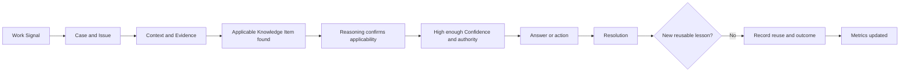

The important behavior is not that the answer is fast. It is that the answer is grounded, applicable, authorized, and traceable. The workflow still checks Context, because validated knowledge is not universally applicable.

No Knowledge Candidate is created when the Case simply confirms and applies what the Organization already knows. The successful use may strengthen evidence about usefulness, Confidence, or coverage, but it does not manufacture novelty. If the outcome later contradicts expectations, the Case can re-enter as a Work Signal that challenges the Knowledge Item.

### Workflow B — New Unknown Problem

This workflow applies when no trusted knowledge sufficiently addresses the Issue.

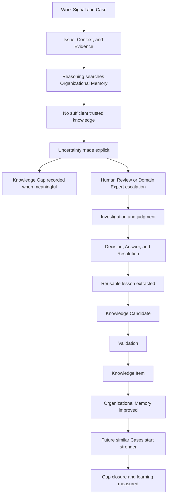

The correct behavior is not to produce a plausible Answer. The platform states what is missing and routes the Case toward the human expertise or authority needed. Human investigation resolves the immediate Issue. If it produces a durable lesson, that lesson becomes a Knowledge Candidate and must still earn Validation.

The Knowledge Gap closes only when sufficiently trusted knowledge becomes usable for the relevant future work. Creating a note or resolving one Case is not enough.

### Workflow C — Human Correction

This workflow applies when a human identifies that an AI-assisted or human-produced Answer, Diagnosis, Decision, Reasoning path, or Knowledge Item is wrong, incomplete, outdated, unclear, or unsafe.

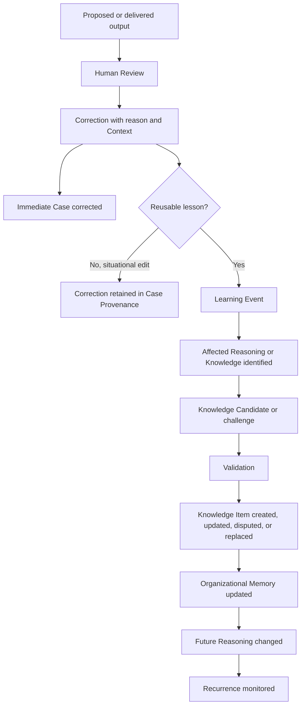

The workflow must capture more than the edited wording. It should preserve what assumption failed, what Context or Evidence was missing, why the correction is right, and where it applies. A tone improvement may remain local to the Answer. A corrected policy interpretation may challenge trusted memory and require authoritative Validation.

A Correction becomes a Learning Event only when it changes future organizational capability. The Organization should be able to see whether similar errors decline after the change.

### Workflow D — Knowledge Evolution

This workflow applies when existing knowledge is challenged by new Evidence, changed policy, failed reuse, expert judgment, or changed operating conditions.

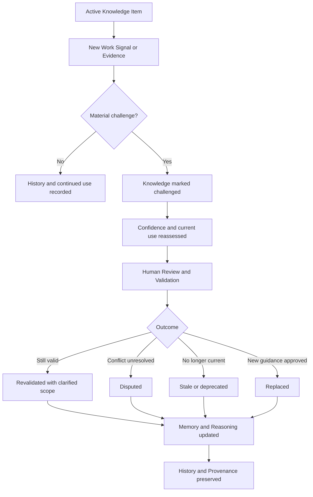

The workflow changes both current guidance and how confidently it may be used. While a material challenge remains unresolved, the platform should not continue presenting the old Knowledge Item with its former certainty.

Old knowledge does not disappear. It may explain earlier Decisions or remain applicable to historical Cases. The lifecycle change, replacement relationship, Evidence, reviewer authority, and effective Context remain preserved.

### Workflow E — Knowledge Gap Discovery

This workflow applies when patterns across work reveal that memory is repeatedly missing or insufficient.

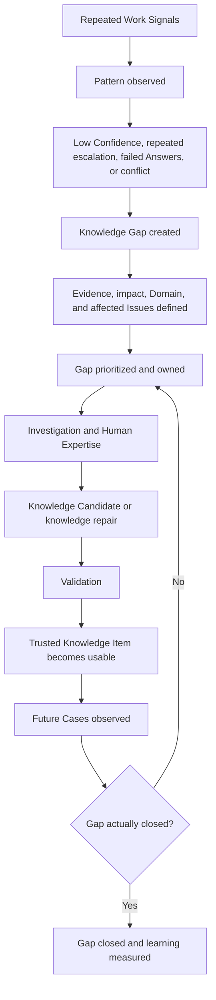

A gap is more than missing documentation. It may be weak authority, conflicting policy, inaccessible knowledge, unclear applicability, or reliance on one expert. The workflow defines the gap with supporting Work Signals and consequence, then assigns learning work appropriate to the Domain.

Closure is demonstrated through future use: Confidence improves, repeated investigation or escalation declines, Answers become more consistent, and outcomes remain trustworthy.

---

## 6. Human–AI Collaboration Model

Human and AI contributions serve different functions inside the same learning workflow. The boundary should be based on Evidence, Context, authority, consequence, and current capability—not on a general preference for maximum or minimum automation.

### What AI does

AI may help the Organization:

- Assist Knowledge Intake by classifying, organizing, and summarizing incoming material.
- Interpret and organize Work Signals.
- Identify likely Issues and missing Context.
- Find relevant Organizational Memory and similar Cases.
- Compare Evidence and identify conflicts or exceptions.
- Support grounded Reasoning and produce inspectable recommendations.
- Draft Answers or actions within known boundaries.
- Represent Confidence and Uncertainty.
- Identify possible Knowledge Candidates, Corrections, and Knowledge Gaps.
- Detect patterns across repeated work.
- Show Provenance and the basis for a recommendation.
- Apply validated Corrections to future Reasoning after appropriate approval.

AI proposes, assists, compares, and applies. Its fluency does not grant authority or turn inference into organizational truth.

### What humans do

Humans:

- Supply judgment about nuance, consequence, intent, and exceptions.
- Provide missing Context and interpret ambiguous Evidence.
- Make Decisions requiring organizational authority or accountability.
- Review uncertain, novel, sensitive, or high-risk Cases.
- Correct faulty Answers, Diagnoses, and Reasoning.
- Validate, dispute, deprecate, or replace knowledge when their Role permits.
- Explain why a conclusion or correction is right.
- Resolve conflicts that evidence alone cannot settle.
- Set Governance Boundaries and determine acceptable automation.
- Decide which lessons are durable enough to become organizational knowledge.

### What should never be automated

The platform should never automate behavior that:

- Presents unsupported inference as trusted organizational truth.
- Hides material Uncertainty or conflicting Evidence.
- Crosses a Governance Boundary because the information is technically available.
- Claims authority the acting User or system does not possess.
- Silently overwrites human-validated knowledge or erases its history.
- Treats an unvalidated Knowledge Candidate as approved guidance.
- Bypasses a Human Review explicitly required by consequence, policy, or Domain authority.
- Optimizes completion or deflection by concealing unresolved risk.

Human Review is therefore a normal workflow state, not an exception. In a known, low-risk Case it may be unnecessary. In a novel, disputed, high-consequence, or authority-sensitive Case it is the responsible path and a source of future learning.

---

## 7. Knowledge Flywheel

The Knowledge Flywheel describes the recurring relationship between daily work and organizational capability.

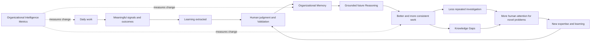

The flywheel compounds only if each transition preserves quality:

1. **Daily work produces signals.** Cases, Corrections, outcomes, policy changes, and repeated questions reveal how knowledge is used and where it fails.
2. **Meaningful work produces learning.** The durable lesson is distinguished from routine activity and case-specific detail.
3. **Learning earns trust.** Human judgment, Evidence, authority, contradiction checks, and appropriate Validation determine whether it may guide future work.
4. **Trusted learning becomes memory.** Knowledge is preserved with Context, Provenance, lifecycle state, and Governance intact.
5. **Memory improves Reasoning.** Future work draws on accumulated experience and can better recognize when prior knowledge does or does not apply.
6. **Better Reasoning improves work.** Answers become more consistent, repeated investigations decline, and people can focus on genuinely new or difficult Issues.
7. **Difficult work creates new expertise.** New human judgment returns to Validation and Organizational Memory.

The flywheel is not content accumulation. It is a cycle in which validated learning improves future outcomes and those outcomes create new evidence about what the Organization knows.

---

## 8. Failure Workflows

Failure workflows define how the platform behaves when the conditions for a trustworthy Decision are not present. They favor restraint, transparency, and learning over apparent completion.

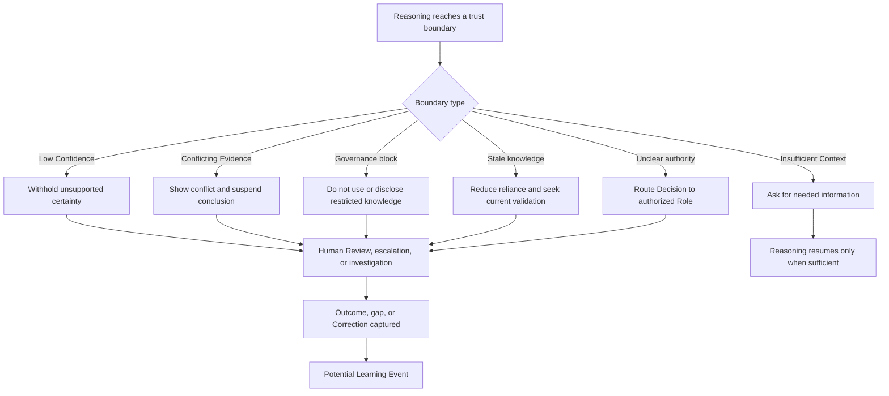

### Low Confidence

The platform states that available support is insufficient for the proposed behavior. It asks for Context, provides a reviewable draft with explicit limits, escalates, or declines to answer. If low Confidence recurs around the same Issue, it becomes evidence of a Knowledge Gap.

### Conflicting Evidence

The platform preserves the disagreement rather than synthesizing false consensus. It shows which claims conflict, their Sources, Context, authority, and freshness. The Decision moves to appropriate Human Review or investigation. Affected knowledge may become challenged or disputed until the conflict is resolved.

### Governance blocks an action

The platform does not access, reveal, apply, or learn across the prohibited boundary. It explains the constraint at the level appropriate for the User and routes the need toward an authorized Role or permitted alternative. Governance is not overridden by Confidence.

### Knowledge is stale

The platform reduces reliance on the Knowledge Item and makes its lifecycle state visible. Depending on consequence, it may use the guidance only as historical Context, require revalidation, seek newer Evidence, or escalate. Continued use does not silently restore trust.

### Authority is unclear

The platform distinguishes having information from having authority. It does not treat seniority, access, or AI Confidence as approval. The Decision is routed to a Role with defined accountability, and the resulting judgment preserves Provenance.

### Context is insufficient

The platform identifies what is missing and why it matters. It asks a targeted follow-up or pauses the Decision. It does not fill missing organizational facts with generic assumptions. Repeated missing Context may reveal a workflow or capture gap.

In every failure workflow, the immediate goal is a responsible next action. The learning goal is to determine whether the boundary was case-specific or indicates a durable gap, conflict, or need for evolved knowledge.

---

## 9. Cross-Domain Workflows

The core workflow remains conceptually stable across Domains:

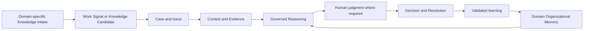

Only the Domain expression, Evidence, authority, consequence, and Governance rules change.

| Domain | Example Work Signal and Issue | Domain-specific judgment | Possible reusable learning |
| --- | --- | --- | --- |
| Customer Support | Customer asks why a refund was denied. | Apply the correct policy version, account Context, and exception authority. | Validated clarification or exception pattern. |
| HR | Employee asks whether a benefit applies. | Respect employment Context, policy authority, sensitivity, and jurisdiction. | Clarified policy applicability for future requests. |
| Finance | Expense or payment requires an exception Decision. | Evaluate evidence, approval limits, policy period, and financial risk. | Validated exception rule or recurring gap. |
| Legal | A matter raises a contractual or policy interpretation. | Require appropriate legal authority, jurisdiction, confidentiality, and consequence. | Reviewed reasoning pattern with tightly bounded applicability. |
| IT | Access or service incident is reported. | Diagnose system Context, identity, security, and escalation requirements. | Reusable Diagnosis or Resolution pattern. |
| Healthcare Operations | Operational request conflicts with current guidance. | Apply heightened privacy, authority, safety, and evidence requirements. | Validated operational procedure or identified gap; not a replacement for clinical judgment. |
| Manufacturing | Incident or quality issue appears on the floor. | Consider equipment, process version, safety, Evidence, and accountable expertise. | Updated procedure, exception, or failure pattern. |

The workflow cannot be transferred by merely renaming support terms. A ticket is one expression of Case; a customer message is one expression of Work Signal; an agent escalation is one expression of Human Review or Decision. Each Domain may extend the core workflow, but should preserve the distinctions among Context, Evidence, Reasoning, authority, Resolution, Validation, and learning.

Future organizational workflows may include HR requests, IT service desk incidents, Legal operations, Sales enablement, Manufacturing incidents, Clinical workflows, and Internal Documentation. These are not separate products. They are Domain expressions of the same Knowledge Intake Workflow, with different Evidence, authority, consequence, and Governance rules.

---

## 10. Workflow Principles

The following rules apply across all behavioral workflows:

1. **Every workflow begins with Knowledge Intake.** Work, change, correction, outcome, human experience, historical material, or a live system provides the reason to act or learn.
2. **Every intake produces a Knowledge Candidate.** Intake creates proposed knowledge, not trusted memory.
3. **Knowledge Candidates must be validated before entering Organizational Memory.** Resolution, repetition, extraction, import, or AI confidence alone does not grant organizational trust.
4. **Every workflow preserves Provenance.** The Organization should be able to understand the relevant source, Context, Evidence, Reasoning, knowledge, transformation, and authority.
5. **Trust increases through successful reuse.** Reuse and outcomes provide evidence about whether validated memory remains applicable and useful.
6. **Pattern Discovery only analyzes validated organizational knowledge.** Patterns should improve trusted memory rather than amplify unvalidated archives or guesses.
7. **AI may assist understanding and drafting but never bypasses Validation.** AI proposes, compares, summarizes, classifies, and drafts; it does not promote knowledge to memory.
8. **Organization Profile determines whether an intake is relevant.** Intake should be scoped by the Organization's Domain, vocabulary, policy, products, supported work, and Governance.
9. **Human governance remains the final authority for trusted memory.** Human expertise, Domain authority, and accountability determine what may become trusted knowledge.
10. **New intake doors reuse existing intelligence components.** Manual Entry, Historical Import, and Live Workflow Capture should converge on the same Validation, memory, trust, reuse, and learning pipeline rather than creating parallel systems.
11. **Uncertainty changes behavior.** Missing, conflicting, stale, weakly supported, or high-consequence knowledge should alter the next Decision.
12. **Resolution and learning remain distinct.** A Case can resolve without new knowledge; unresolved learning can remain after the immediate Case closes.
13. **Outcomes test what the Organization believes.** Later results may challenge a Diagnosis, Answer, Decision, or Knowledge Item and reopen learning.

---

## 11. Workflow Anti-Patterns

| Anti-pattern | Why it weakens Organizational Intelligence |
| --- | --- |
| **Answer without Reasoning** | Produces words without establishing applicability, truth, authority, or a basis for correction. |
| **Resolution without learning assessment** | Closes work without asking whether a reusable lesson, Correction, contradiction, or gap should improve the future. Not every Resolution must create knowledge, but every meaningful one should be considered. |
| **Automation without memory** | Completes activity without grounding in trusted organizational learning and can scale repeated mistakes. |
| **Knowledge without Validation** | Converts a plausible or isolated lesson into organizational truth without sufficient Evidence, authority, or review. |
| **Import as memory** | Treats historical documents, chats, exports, or archives as trusted Organizational Memory merely because they were captured. |
| **Parallel intake systems** | Creates separate memory paths for manual notes, bulk imports, and live work, preventing common Validation, trust, reuse, and learning. |
| **Confidence without Evidence** | Makes certainty performative and hides the actual boundary of knowledge. |
| **Escalation without capturing lessons** | Uses scarce expertise to rescue the current Case while ensuring the next person must ask again. |
| **Repeating identical investigations** | Signals that prior work has not become findable, trusted, applicable memory. |
| **Static knowledge that never evolves** | Allows guidance to decay while retaining the appearance of authority. |
| **Correction as a local edit only** | Fixes the visible output but fails to identify and repair the misunderstanding that caused it. |
| **Conflict flattened into one answer** | Hides disagreement and prevents the Organization from resolving competing truths. |
| **Governance checked only at the end** | Allows restricted knowledge or unauthorized judgment to shape Reasoning before the final action is reviewed. |
| **Every Case becomes knowledge** | Creates noise, weakens trust, and makes truly reusable lessons harder to find. |
| **Metrics count motion rather than learning** | Rewards tickets, content, reuse, or automation even when memory and future capability do not improve. |

These anti-patterns often produce an apparently smooth workflow. That smoothness is misleading when it removes the pauses, reviews, distinctions, and lifecycle changes required for trust.

---

## 12. Closing

The Product Workflow Model is the behavioral layer of the Organizational Intelligence Platform. The Domain Model defined the concepts. This document defines how those concepts interact to intake knowledge, resolve work responsibly, preserve human expertise, improve Organizational Memory, and create organizational learning.

The model deliberately includes both completion and restraint. A trustworthy workflow can answer from validated knowledge, but it can also ask for Context, expose conflict, respect a Governance Boundary, seek Human Review, or say that the Organization does not know yet. Those behaviors are not detours from intelligence. They are part of it.

The next Architecture, AI Agent Design, and MVP Scope documents should implement these workflows without changing their meaning. Architecture should preserve their dependencies, intake convergence, and trust boundaries. AI design should respect the distinction between intake assistance, Reasoning, Answer generation, and Validation. MVP scope should establish a coherent learning loop rather than a collection of disconnected features.

The enduring measure is whether daily work leaves the Organization more capable: able to remember what people learned, apply it with judgment, recognize its limits, and improve the next Decision.
