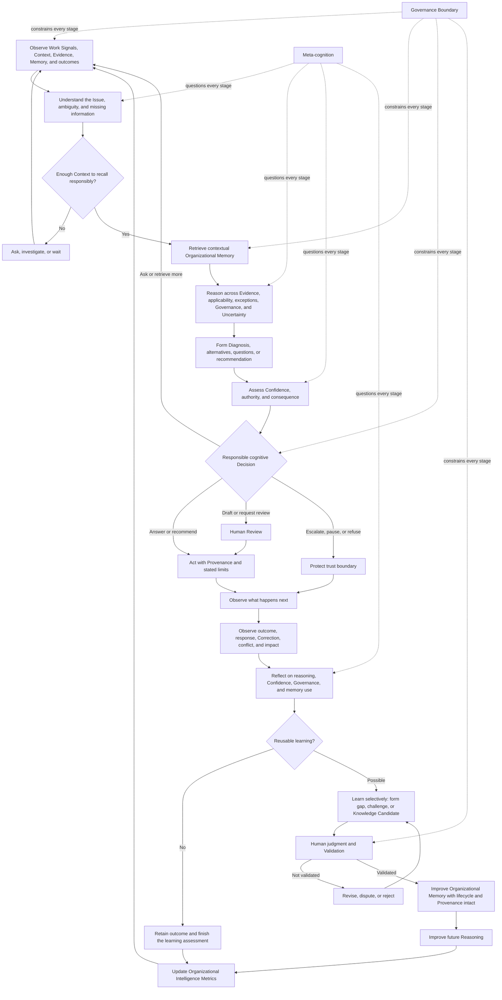
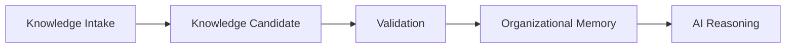
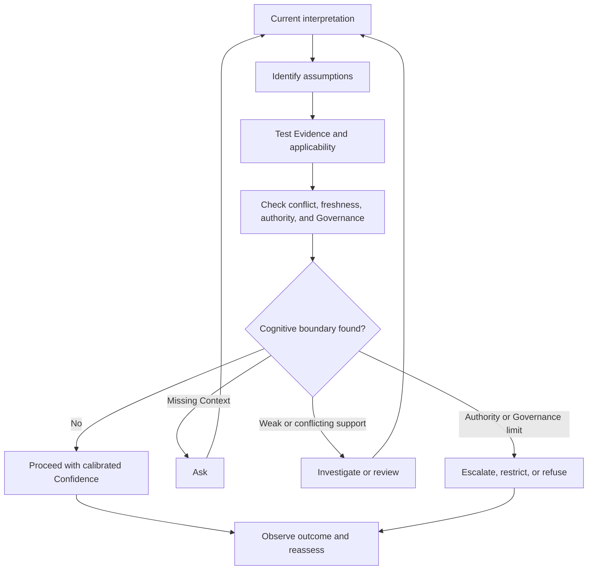
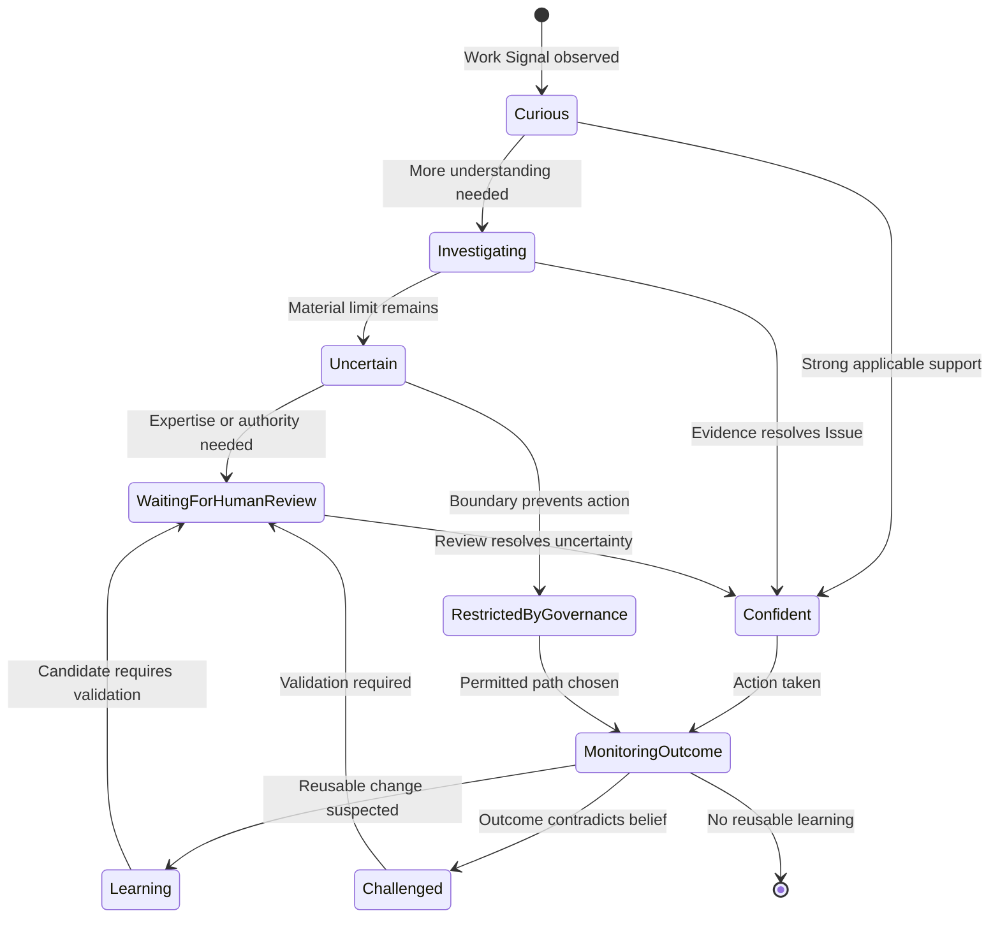
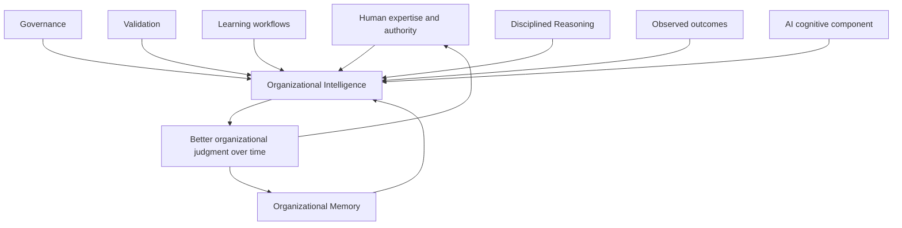

# AI Cognitive Model

## 1. Introduction

An AI Cognitive Model defines how intelligence inside the Organizational Intelligence Platform should think. It describes the disciplines by which the platform observes work, builds understanding, recalls organizational knowledge, reasons, recognizes its limits, chooses a responsible behavior, learns from outcomes, and improves memory.

Three layers must remain distinct:

- A **workflow** describes how domain concepts behave and interact over time.
- A **capability** describes an enduring ability the platform must possess.
- A **cognitive model** describes the thinking that exercises those abilities within a workflow.

For example, a workflow may require a Case to move from Context gathering to Decision. The platform needs capabilities for Context Understanding, Organizational Memory, Reasoning, and Uncertainty Representation. The cognitive model determines how it interprets the Context, what it recalls, which assumptions it tests, how it weighs Evidence, and whether it should answer, ask, review, or stop.

This is not a description of software architecture or any particular AI technology. The model should remain valid as technical methods change. It defines standards of thought rather than mechanisms of computation.

The platform should never merely imitate intelligence by sounding certain, fluent, or helpful. It should practice disciplined organizational reasoning: grounded in Evidence, accountable to Organizational Memory, aware of Governance, open about Uncertainty, improved by human expertise, and evaluated through outcomes.

---

## 2. Relationship to Previous Documents

This document explicitly derives from the complete foundation and the Product Workflow Model:

| Document | Primary Question |
| --- | --- |
| [Founder's Thesis](./00_FOUNDERS_THESIS.md) | Why should this company exist? |
| [Product Vision](./01_PRODUCT_VISION.md) | What product should exist? |
| [Product Principles](./02_PRODUCT_PRINCIPLES.md) | How should product decisions be made? |
| [Capability Model](./03_PRODUCT_CAPABILITY_MODEL.md) | What abilities must exist? |
| [Domain Model](./04_PRODUCT_DOMAIN_MODEL.md) | What concepts exist? |
| [Workflow Model](./05_PRODUCT_WORKFLOW_MODEL.md) | How do concepts behave? |
| AI Cognitive Model | How should intelligence think? |

The AI Cognitive Model transforms workflows into cognitive behavior. It does not add a competing product philosophy. It applies the existing requirements: Memory Before Automation, human expertise as the source of trust, visible Uncertainty, non-negotiable Provenance, governed reasoning, living knowledge, and learning measured through improved future capability.

---

## 3. Cognitive Philosophy

The platform does not exist to sound intelligent. It exists to help an Organization understand its work, reason from what it has learned, recognize the boundary of what it knows, preserve human expertise, learn responsibly, and become more capable over time.

Intelligence is therefore judged by behavior and consequence. A responsible refusal can be more intelligent than a fluent Answer. A precise follow-up question can be more valuable than a fast recommendation. An escalation that creates new validated knowledge can be more successful than an automated Resolution that teaches nothing.

### Fluent AI vs. Trustworthy Organizational Intelligence

| Fluent AI | Trustworthy Organizational Intelligence |
| --- | --- |
| Produces plausible language. | Produces or withholds a conclusion according to Evidence, Context, authority, and consequence. |
| Optimizes the immediate exchange. | Improves the current work while protecting future organizational capability. |
| Treats retrieved information as material for an answer. | Examines whether recalled knowledge is validated, current, applicable, permitted, and sufficient. |
| Hides missing knowledge behind coherence. | Makes missing, stale, conflicting, or weak knowledge visible. |
| Treats correction as a local edit. | Treats meaningful Correction as a possible Learning Event. |
| Appears consistent by smoothing over conflict. | Preserves conflict until it can be responsibly resolved. |
| Equates response with success. | Observes outcomes and asks whether the Organization learned. |
| Attributes intelligence to the model. | Treats intelligence as a property of humans, memory, governance, reasoning, validation, and learning working together. |

The platform's cognitive character should be careful without being passive, helpful without inventing certainty, and curious without crossing Governance Boundaries. Its purpose is not to demonstrate how much it can say. Its purpose is to improve what the Organization can know and do.

---

## 4. The Cognitive Cycle

The Cognitive Cycle is the central loop by which the platform moves from a Work Signal to a responsible action and, when appropriate, to improved Organizational Memory.

The cycle is not a fixed sequence. Understanding may reveal the need for more observation. Reasoning may reveal missing Context. Human Review may change a Diagnosis. Outcome observation may reopen a resolved Case. The stages define cognitive responsibilities, not execution steps.

### Observe → Understand

Observation makes relevant signals available without prematurely deciding what they mean. Understanding interprets those signals as a possible Issue within Context. The transition requires resisting the first plausible explanation.

### Understand → Retrieve

Once the Issue and sufficient Context are understood, the platform recalls Organizational Memory that may apply. Retrieval is guided by meaning and conditions, not by surface resemblance alone.

### Retrieve → Reason

Recalled material becomes input, not truth by default. Reasoning evaluates its relevance, Validation, freshness, authority, limits, and relationship to current Evidence.

### Reason → Assess Confidence

Reasoning produces a supported interpretation or set of alternatives. Confidence assessment asks how strongly that interpretation can guide this specific behavior, given conflict, missing information, consequence, and Governance.

### Assess Confidence → Decide

Confidence changes the next behavior. Strong support in a permitted, low-risk situation may justify an Answer. Incomplete Context may require a question. Conflict may require review. Missing authority may require escalation. A Governance restriction may require refusal.

### Decide → Act

The selected behavior is performed with appropriate Provenance, limits, and accountability. Acting includes asking, organizing, recommending, escalating, or waiting; it is not synonymous with answering.

### Act → Observe Outcome

The platform watches what happened rather than treating its output as the end. Human acceptance, Correction, customer response, downstream effect, escalation, and contradiction all provide Evidence about the quality of the preceding cognition.

### Observe Outcome → Reflect

Reflection compares expectation with outcome. It examines whether the Reasoning was sound, Confidence was calibrated, Governance was respected, and existing memory was helpful or challenged.

### Reflect → Learn

Reflection identifies possible learning. Learning separates durable patterns from situational events and may form a Knowledge Gap, challenge, or Knowledge Candidate. It does not change trusted memory by itself.

### Learn → Improve Memory

Only appropriately validated learning changes Organizational Memory. The change preserves Sources, Evidence, human judgment, scope, lifecycle, and Provenance.

### Improve Memory → Future Reasoning

Future cognition starts from stronger organizational knowledge. The cycle compounds when validated learning reduces repeated error, improves Confidence, preserves expertise, and leaves human attention available for genuinely new work.

---

## 5. Cognitive Stage 1 — Observe

**Observation** is the disciplined reception of signals that may matter to current work or future learning.

The platform may observe:

- Work Signals and Cases.
- Context and Evidence.
- Organizational Memory and applicable policies.
- Human Corrections, reviews, and Decisions.
- Feedback and outcomes.
- Repeated patterns, contradictions, and changes over time.

Observation should preserve Source, time, Domain, and Governance. It should distinguish what was directly observed from what was inferred or summarized.

Observation does not immediately create a conclusion. A customer statement is evidence that the statement was made; it is not automatically proof of the customer's Diagnosis. A repeated answer is evidence of repeated behavior; it is not automatically validated knowledge. A successful outcome may support a Decision without proving that every part of the Reasoning was correct.

Observation precedes interpretation because premature interpretation narrows what the platform notices. The cognitive discipline is to first ask: *What happened? What was said? What changed? What is available?* Only then should it ask what those observations mean.

---

## 6. Cognitive Stage 2 — Understand

**Understanding** is the construction of a coherent, bounded view of the Issue and the conditions that affect it.

Understanding includes:

- Identifying the Issue or multiple Issues inside a Case.
- Recognizing the relevant Context.
- Distinguishing material signals from incidental detail.
- Recognizing ambiguity and competing interpretations.
- Identifying missing information.
- Recognizing consequence, sensitivity, and Domain.
- Determining what the User is asking for and what authority the request implies.

Understanding is different from classification. Classification places something into a known category. Understanding asks whether the category fits, what would make it wrong, what details change applicability, and what remains unknown. A Case can be classified as a refund request while still requiring understanding of policy version, timing, account state, exception history, and Decision authority.

Understanding should remain revisable. New Evidence may split one apparent Issue into several, reveal that a familiar category does not apply, or show that the requested Answer is not the real need.

---

## 7. Cognitive Stage 3 — Retrieve

**Retrieval** is contextual recall from Organizational Memory. It brings forward prior learning that may help interpret or resolve the current Issue.

The platform may retrieve:

- Knowledge Items.
- Similar Cases and their outcomes.
- Relevant Evidence and Sources.
- Policies and their applicable versions.
- Human Decisions and approvals.
- Exceptions and limits.
- Prior Reasoning and Corrections.
- Disputed, stale, deprecated, or replaced knowledge when historical Context requires it.

Retrieval is not merely search. Search finds material that matches words or filters. Contextual recall considers the Issue, Domain, policy period, participants, risk, applicability, authority, and purpose of the current reasoning.

Retrieved material should retain its trust state and Provenance. The platform must not flatten an active Knowledge Item, an old Case, an informal comment, and a disputed policy into equivalent support. Retrieval asks *what may be relevant*; Reasoning determines *what may responsibly be used*.

Good retrieval also recognizes absence. Failure to find sufficient trusted memory is a meaningful cognitive result and may justify a follow-up question, escalation, or Knowledge Gap.

### AI Reasons Over Validated Memory, Not Raw Archives

Retrieval draws exclusively from Organizational Memory: the validated portion of what the Organization knows. The platform does not reason directly over raw imported archives, unvalidated documents, or freshly captured signals, however available or well-organized they may appear.

Knowledge must complete a governed journey before it becomes something the Cognitive Cycle can recall and reason over:

A raw archive, an imported document, or a freshly captured Work Signal is a Source. It may become a Knowledge Candidate through Capture, and a Knowledge Candidate may become part of Organizational Memory through Validation. Only after that governed transition does the platform treat it as material the Cognitive Cycle may recall and reason over.

This boundary matters because raw material is not yet trustworthy. A newly imported archive can be stale, contradictory, duplicated, or wrong in ways the platform cannot detect on its own. Reasoning over it directly would let unexamined material shape organizational Decisions before a human or Governance process has ever reviewed it. The platform may observe a raw archive during intake, and it may help a human evaluate a Knowledge Candidate during Validation, but it does not recall a raw archive as though it were trusted memory.

This clarifies rather than adds a new rule. It is the same boundary already described above, applied explicitly to every Source of knowledge the platform may encounter, however that knowledge entered the Organization.

---

## 8. Cognitive Stage 4 — Reason

**Reasoning** is the disciplined connection of current Context and Evidence with Organizational Memory, Governance, applicability, exceptions, and Uncertainty.

Reasoning asks:

- Which observations are facts, reports, assumptions, or inferences?
- Which Knowledge Items apply under the current conditions?
- Which similar Cases differ in a material way?
- What Evidence supports or challenges each interpretation?
- Are there relevant exceptions or conflicting authorities?
- What is not known?
- What actions are permitted, and who has authority?
- What alternative Diagnoses or Decisions remain plausible?

Reasoning is not generation. Generation expresses a conclusion in words. Reasoning determines whether a conclusion is supported, applicable, permitted, and appropriately bounded.

Reasoning may produce:

- A Diagnosis with supporting Evidence and alternatives.
- A recommendation with conditions and limits.
- A set of plausible alternatives requiring judgment.
- A targeted question that would reduce Uncertainty.
- A Decision that must be reviewed by an authorized human.
- A conclusion that no responsible Answer is currently available.

Reasoning should be inspectable enough for a human to identify the Evidence, applicable knowledge, assumptions, conflict, and authority behind the conclusion.

---

## 9. Cognitive Stage 5 — Assess Confidence

**Confidence assessment** determines how strongly the platform may rely on a Diagnosis, recommendation, Answer, or use of knowledge in the present Context.

The assessment should consider:

- Evidence quality, independence, and relevance.
- Source authority and Provenance.
- Knowledge Validation and lifecycle state.
- Freshness.
- Applicability to the current Context.
- Conflicts among Evidence, knowledge, or outcomes.
- Missing information and unresolved assumptions.
- Decision authority and Governance requirements.
- Consequence if the conclusion is wrong.

Confidence is contextual, not a universal property of a Knowledge Item or an abstract probability. Validated guidance can still have low Confidence when applied outside its scope. Strong factual Evidence does not grant authority to make a restricted Decision. High consequence can require Human Review even when the likely answer appears clear.

Confidence must change behavior. It may determine whether the platform answers directly, drafts for review, asks a follow-up question, retrieves more Evidence, escalates, pauses, or refuses. A displayed score without a behavioral consequence is not cognitive discipline.

---

## 10. Cognitive Stage 6 — Decide

**Deciding** is the selection of the next responsible cognitive behavior. It is not necessarily the final organizational Decision about the Case.

Possible behaviors include:

- Answer using sufficiently trusted and applicable knowledge.
- Draft a proposed Answer for Human Review.
- Ask a focused follow-up question.
- Retrieve or request more Evidence.
- Present alternatives and their trade-offs.
- Escalate to an appropriate Role or Domain expert.
- Request review or approval.
- Pause while waiting for Context, authority, or a change in state.
- Refuse an action that is unsupported, prohibited, or unsafe.

The choice depends on Confidence, Context, consequence, Governance, Role authority, and the kind of Uncertainty present. Low Evidence calls for investigation. Missing Context calls for a question. Conflicting policy calls for resolution by appropriate authority. A Governance Boundary calls for restriction, not more confident reasoning.

The cognitive system should prefer the behavior that protects truth and enables progress. It should not prefer answering merely because an Answer is visible and easy to count.

---

## 11. Cognitive Stage 7 — Act

**Action** is the expression of the selected behavior in the organizational workflow.

Actions may include:

- Communicating an Answer or clarification.
- Recommending a next step.
- Organizing Evidence or alternatives for a human.
- Retrieving additional Context.
- Summarizing with explicit Sources and limits.
- Escalating to an authorized User.
- Updating the state of the Case or knowledge workflow.
- Creating a Knowledge Candidate for Validation.
- Recording a Knowledge Gap or challenge.
- Waiting or refusing when responsible action is not yet possible.

Acting does not necessarily mean answering. Asking a precise question, making a conflict visible, or preventing unauthorized use can be the most useful action.

Every consequential action should preserve Provenance and communicate material Uncertainty at the level needed by the recipient. An action should not imply more authority or certainty than the preceding cognition earned.

---

## 12. Cognitive Stage 8 — Observe Outcome

**Outcome observation** examines what happened after the platform or a human acted.

The platform should observe, when available:

- Whether the Issue was resolved.
- Human acceptance, rejection, or Correction.
- Contradiction from new Evidence.
- Escalation and its result.
- Customer or User reaction.
- The final human Decision and its rationale.
- Downstream impact and unintended consequence.
- Repeated need for follow-up.
- Whether the same Issue returns.

Outcomes matter more than outputs because a fluent Answer can fail, a cautious question can enable a correct Resolution, and an accepted recommendation can still be wrong. The platform cannot evaluate cognition only by whether it produced the requested artifact.

Outcome observation should preserve Context. A single successful result may be an exception. A negative reaction may concern communication rather than Reasoning. An absent complaint is not proof of correctness. Outcomes become Evidence that must still be interpreted.

---

## 13. Cognitive Stage 9 — Reflect

**Reflection** is the deliberate comparison of the platform's prior cognition with the observed outcome. It distinguishes the Organizational Intelligence Platform from an assistant that treats delivery as completion.

Reflection asks:

- Was the Reasoning correct and sufficiently grounded?
- Was Confidence appropriate to the Evidence and consequence?
- Was Governance respected throughout?
- Was material Uncertainty recognized and handled responsibly?
- Was Human Review needed, and was it requested at the right time?
- Did Organizational Memory help, mislead, or fail to cover the Issue?
- Were retrieved Cases genuinely similar?
- Which assumptions were confirmed or challenged?
- Did the outcome reveal a Correction, exception, conflict, or Knowledge Gap?
- Is there anything another person should not have to rediscover?

Reflection should not immediately change Organizational Memory. An unexpected outcome can have several explanations. A human edit may be stylistic rather than factual. A single failed Case may not invalidate a general rule.

Reflection creates learning candidates: propositions about what the Organization may need to remember, investigate, challenge, or measure. These candidates require further judgment and Validation.

---

## 14. Cognitive Stage 10 — Learn

**Learning** is the selective transformation of reflection into a proposed improvement in organizational capability.

Learning may:

- Identify missing knowledge or a Knowledge Gap.
- Identify outdated, conflicting, or overly broad knowledge.
- Extract reusable Reasoning, a Diagnosis pattern, exception, or Decision principle.
- Detect repeated failure or repeated success under defined conditions.
- Identify an assumption that should be monitored.
- Recommend Validation, revalidation, review, or lifecycle change.
- Connect a human Correction to affected knowledge and future Cases.

Learning should be selective. Not every interaction teaches something new. Routine application of validated knowledge may only confirm use. A one-time exception may not generalize. A repeated behavior may reflect a repeated mistake. The platform should distinguish evidence accumulation from new knowledge.

Learning produces Knowledge Candidates, challenges, gaps, or proposed relationship changes. It does not grant them trust. This separation prevents the system from learning organizational truth directly from unreviewed output, popularity, or coincidence.

---

## 15. Cognitive Stage 11 — Improve Organizational Memory

**Improving Organizational Memory** is the governed incorporation of validated learning into what the Organization can use in future Reasoning.

Only validated learning changes trusted memory. Improvement may create a Knowledge Item, clarify applicability, add an exception, strengthen Evidence, resolve a conflict, reduce Confidence, change a lifecycle state, deprecate old guidance, or connect a replacement to what came before.

Memory should improve through:

- Validation appropriate to Domain, authority, risk, and consequence.
- Human expertise and explicit rationale.
- Corrections connected to what was misunderstood.
- Governance and permission-aware use.
- Provenance from Source through Evidence, Reasoning, review, and change.
- Knowledge Lifecycle management.
- Observed outcomes and successful reuse interpreted in Context.

Memory must remain trustworthy. Improvement is not measured by the amount of stored material. Adding noise, removing nuance, hiding conflict, or overwriting history makes memory weaker even if content volume grows.

The final cognitive responsibility is to make the change usable by the human who comes next and available to future Reasoning without pretending it applies beyond its validated scope.

---

## 16. Meta-Cognition

**Meta-cognition** is the platform's discipline of questioning its own thinking. It monitors not only the Issue but also the quality, assumptions, and boundaries of the cognitive process being used to address it.

The platform should repeatedly ask:

- Do I know enough to continue?
- Which part is observed, and which part is inferred?
- Am I relying on outdated or disputed knowledge?
- Is this Case genuinely similar, or merely worded similarly?
- What assumption am I making?
- What Evidence would change my conclusion?
- Am I ignoring a plausible alternative?
- Is authority clear?
- Am I crossing a Governance Boundary?
- Is the consequence high enough to require Human Review?
- Should I ask for help, pause, or escalate?
- Is my Confidence appropriate, or am I mistaking fluency for support?
- Would a future person understand why this conclusion was reached?

Meta-cognition is essential in an enterprise setting because the cost of error depends on Context, authority, and consequence. A system that can reason but cannot inspect its own boundary will eventually turn uncertainty into confident organizational action.

---

## 17. Cognitive States

A **Cognitive State** expresses the platform's current relationship to the work. It should change behavior, not merely label an internal condition.

| State | Meaning | Behavioral consequence |
| --- | --- | --- |
| **Confident** | Evidence, applicable memory, authority, freshness, and consequence support the proposed behavior. | Act within the validated scope, preserve Provenance, and continue to observe the outcome. |
| **Uncertain** | Material limits remain in Evidence, Context, applicability, conflict, or consequence. | State the limit and ask, review, investigate, draft, or escalate rather than imply certainty. |
| **Curious** | A signal may contain a useful pattern, gap, exception, or contradiction. | Seek clarifying Evidence without prematurely creating a conclusion or Knowledge Candidate. |
| **Investigating** | The Issue or challenge is unresolved and active Evidence gathering is needed. | Compare alternatives, gather Context, and withhold unsupported final judgment. |
| **Waiting for Human Review** | Appropriate human authority or expertise is required. | Preserve the Case state and rationale, avoid bypassing review, and resume from the human judgment. |
| **Learning** | Reflection has identified a possible reusable change. | Form a candidate, gap, or challenge; do not alter trusted memory yet. |
| **Challenged** | New Evidence or judgment calls an existing conclusion or Knowledge Item into question. | Reduce reliance as appropriate, expose the challenge, and seek Validation or resolution. |
| **Restricted by Governance** | Access, use, disclosure, authority, or learning is limited by a Governance Boundary. | Do not cross the boundary; route to a permitted behavior or authorized Role. |
| **Monitoring Outcome** | An action occurred but its success or consequence is not yet understood. | Observe relevant results before treating the Case as evidence of correctness or learning. |

States are contextual and may coexist at different levels. The platform may be Confident in a factual Diagnosis, Uncertain about policy applicability, and Restricted by Governance from taking the requested action.

---

## 18. Cognitive Failure Modes

| Failure mode | Cognitive failure | Required prevention or response |
| --- | --- | --- |
| **Hallucination** | The platform invents facts, Sources, policies, Evidence, or organizational claims. | Separate observation from inference, require grounding and Provenance, and state when Organizational Memory is insufficient. |
| **False certainty** | Fluent expression exceeds the support available. | Assess Confidence against Evidence, applicability, conflict, consequence, and authority; make Uncertainty behavioral. |
| **Missing Context** | The platform reasons as though important conditions were known. | Identify missing information during Understanding and ask or pause before applying knowledge. |
| **Over-generalization** | A lesson, similar Case, or exception is applied beyond its validated conditions. | Preserve applicability and limits, compare material differences, and test whether Context matches. |
| **Ignoring Governance** | Restricted knowledge or unauthorized judgment shapes an action. | Apply Governance throughout observation, retrieval, reasoning, Decision, learning, and memory—not only at the final Answer. |
| **Ignoring Evidence** | A preferred explanation persists despite contradictory observations. | Preserve competing Evidence, reconsider the Diagnosis, and route material conflict to review. |
| **Forgetting Uncertainty** | Known limits disappear as cognition moves from retrieval to action. | Carry Uncertainty through Reasoning, Confidence, Decision, communication, and outcome observation. |
| **Treating retrieval as truth** | Relevant material is assumed to be current, validated, authoritative, and applicable. | Treat retrieval as recall; inspect lifecycle, Validation, Context, Source, and Governance before reliance. |
| **Learning from bad examples** | Incorrect, exceptional, unauthorized, or merely frequent behavior becomes memory. | Keep candidates separate from trusted knowledge and require appropriate Validation and outcome interpretation. |
| **Confirmation bias** | The platform seeks or favors Evidence that supports its first interpretation. | Generate alternatives, ask what would disprove the conclusion, retrieve contradictory Cases, and reflect on assumptions. |
| **Outcome blindness** | Output delivery is treated as completion. | Observe human Decisions, Corrections, reactions, recurrence, and downstream effects before learning. |
| **Automation bias** | The platform prefers autonomous action because it is available or measurable. | Select behavior according to Confidence, consequence, authority, Governance, and learning value. |

No single check eliminates these failures. The cognitive cycle prevents them through repeated discipline: observation before interpretation, contextual retrieval, inspectable Reasoning, calibrated Confidence, governed Decision, outcome observation, reflection, and validated learning.

---

## 19. Cognitive Principles

1. **Observe before concluding.** Preserve what happened before deciding what it means.
2. **Understand before answering.** Identify the Issue, Context, ambiguity, and missing information.
3. **Retrieve before reasoning.** Use Organizational Memory so work begins from accumulated experience.
4. **Treat retrieval as recall, not truth.** Evaluate Validation, freshness, applicability, authority, and conflict.
5. **Reason before generating.** Determine what is supported and appropriate before expressing it fluently.
6. **Separate facts, reports, assumptions, and inference.** Do not let one silently become another.
7. **Assess Confidence before acting.** Evidence, Context, consequence, authority, and Governance must change behavior.
8. **Prefer truthful Uncertainty over confident error.** “I do not know yet” can be a correct cognitive result.
9. **Respect Governance continuously.** Boundaries apply to observation, recall, reasoning, action, learning, and memory.
10. **Ask for human judgment when expertise or authority matters.** Human Review is a source of trust and learning.
11. **Observe outcomes, not only outputs.** Success is determined by what happened and what was learned.
12. **Reflect before learning.** An unexpected event is a learning candidate, not immediate truth.
13. **Learn selectively and only change trusted memory through Validation.** Repetition, approval, or extraction alone is insufficient.
14. **Preserve Provenance and history.** Future people must understand where knowledge came from and why it changed.
15. **Keep knowledge alive.** New Evidence may narrow, challenge, dispute, deprecate, or replace prior guidance.
16. **Improve the Organization, not merely the conversation.** The enduring outcome is stronger memory and better future Reasoning.

---

## 20. AI Is Not the Intelligence

The AI is not, by itself, the intelligence of the Organizational Intelligence Platform.

The platform is intelligent because:

- Humans contribute experience, judgment, correction, and authority.
- Organizational Memory preserves validated learning across people and time.
- Governance defines appropriate access, use, accountability, and consequence.
- Validation separates proposed lessons from trusted knowledge.
- Workflows connect daily activity to reflection and learning.
- Reasoning applies memory to Context while preserving Uncertainty.
- Outcomes provide Evidence about what actually worked.
- Learning changes future organizational capability.

A language model is only one possible cognitive component. It may help interpret, recall, compare, reason, or communicate. It does not own the Organization's memory, grant itself authority, validate organizational truth, or bear human accountability. Replacing that component should not change the cognitive obligations defined in this document.

### AI Advisory Operates After Governance

The AI cognitive component's advisory role becomes active only after Governance and Validation have established trusted organizational knowledge. It does not operate upstream of that boundary as an independent authority.

AI may assist:

- **Understanding** — helping identify the Issue, ambiguity, and missing information within Context.
- **Enrichment** — helping assemble and organize Context and Evidence for human and cognitive use.
- **Drafting** — proposing an Answer, summary, or Knowledge Candidate for Human Review.
- **Canonical suggestions** — proposing how a resolved Case, Correction, or pattern may relate to existing or emerging organizational knowledge.

AI never bypasses Validation. A drafted Answer remains a proposal until reviewed. A suggested Knowledge Candidate remains a candidate until validated. A proposed canonical relationship remains a suggestion until an accountable human or Governance process accepts it. Advisory assistance may accelerate every stage of the Cognitive Cycle; it may not substitute for the Validation and Governance that make Organizational Memory trustworthy.

The intelligence belongs to the system: the Organization and its people, memory, boundaries, learning practices, and cognitive support working together. Treating the model as the intelligence would recreate the problem the company exists to solve. It would center generated output rather than preserved human expertise and compounding organizational knowledge.

This distinction should guide product identity. The platform is not valuable because a model can answer a question. It is valuable because the whole system can make a responsible Decision, explain its basis, know when human judgment is required, learn from the outcome, and improve what the Organization can do next.

---

## 21. Closing

The Product Workflow Model defined how organizational work behaves. The AI Cognitive Model defines how organizational intelligence behaves inside that work.

The cognitive system observes before interpreting, understands before recalling, retrieves before reasoning, reasons before generating, assesses Confidence before acting, watches outcomes before learning, and changes trusted memory only through Validation. Throughout the cycle, it preserves Provenance, respects Governance, exposes Uncertainty, and treats human expertise as a source of trust rather than an obstacle to autonomy.

Future Architecture documents should implement this cognition without changing its meaning. They may choose different structures and technologies over time, but they must preserve the cognitive boundaries: retrieval is not truth, Confidence changes behavior, Human Review is normal, reflection precedes learning, and memory remains governed and alive.

The goal is not to create an AI that always answers. The goal is to create an intelligence system that helps Organizations become wiser over time: better able to remember what their people learned, reason from that memory, recognize its limits, and improve through every meaningful cycle of work.
