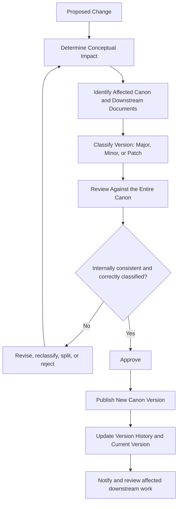

# Canon Governance

## 1. Purpose

The Canon is the authoritative conceptual source of truth for the Organizational Intelligence Platform. It preserves the platform's identity across teams, implementations, and time.

The Canon defines:

- The philosophy that explains why the company exists.
- The product identity required to make that philosophy real.
- The principles that constrain product and engineering decisions.
- The capabilities the platform must possess.
- The concepts and relationships the platform must understand.
- The workflows through which work creates organizational learning.
- The cognitive behavior expected of intelligence inside the platform.

This document governs how that conceptual specification evolves. It does not define product behavior or add a new platform capability.

The Canon should evolve much more slowly than the software built from it. Software may change every week. Architecture may change every few months. The Canon should remain stable for years. Its value comes from giving changing implementations a durable identity and a reliable set of constraints.

Stability does not mean that the Canon can never change. It means that every change is intentional, classified, traceable, internally consistent, and proportionate to its conceptual impact.

### Governing Sources

This policy derives from the complete Canon specification established by:

- [Founder's Thesis](./00_FOUNDERS_THESIS.md)
- [Product Vision](./01_PRODUCT_VISION.md)
- [Product Principles](./02_PRODUCT_PRINCIPLES.md)
- [Product Capability Model](./03_PRODUCT_CAPABILITY_MODEL.md)
- [Product Domain Model](./04_PRODUCT_DOMAIN_MODEL.md)
- [Product Workflow Model](./05_PRODUCT_WORKFLOW_MODEL.md)
- [AI Cognitive Model](./06_AI_COGNITIVE_MODEL.md)

---

## 2. Canon Version

```text
Current Canon Version

v1.0.0
```

Version `v1.0.0` is the first complete conceptual specification of the Organizational Intelligence Platform. It includes the Founder's Thesis, Product Vision, Product Principles, Product Capability Model, Product Domain Model, Product Workflow Model, and AI Cognitive Model.

Together, these documents define the complete path from purpose to cognitive behavior:

- Why the company exists.
- What product must exist.
- How decisions should be made.
- What the platform must be able to do.
- What concepts the platform must understand.
- How those concepts behave over time.
- How intelligence should think.

The governance policy itself controls the evolution of that specification. It does not change the platform meaning represented by version `v1.0.0`.

---

## 3. Semantic Versioning Policy

The Canon follows Semantic Versioning.

```text
MAJOR.MINOR.PATCH
```

The leading `v` is used when displaying or declaring a complete Canon version, as in `v1.0.0`. Version classification is based on conceptual impact, not document size, number of edited lines, or implementation effort.

### Major Version

Example: `v2.0.0`

A Major version represents a conceptual change that intentionally breaks compatibility with the preceding Canon.

Major changes include:

- Changing the Founder's Thesis.
- Redefining Organizational Intelligence or Organizational Memory.
- Changing the Product Vision or product category.
- Adding, removing, or changing a core Product Principle.
- Changing the meaning or boundary of a core Domain concept.
- Changing required Workflow behavior.
- Changing the cognitive philosophy or the authority of intelligence inside the platform.
- Making an existing Canon-aligned design conceptually invalid.

Major versions may require downstream product, architecture, AI, data, and roadmap documents to be redesigned. They should be rare, deliberate events supported by a clear explanation of why the existing conceptual foundation is no longer sufficient.

### Minor Version

Example: `v1.1.0`

A Minor version extends the Canon without changing the existing meaning or invalidating work aligned to an earlier version in the same Major line.

Minor changes include:

- Adding a new Canon document.
- Adding a new workflow that composes existing concepts consistently.
- Adding a new concept whose meaning does not alter existing concepts.
- Adding examples, diagrams, appendices, or expanded explanations that introduce substantive new coverage.
- Adding a Domain extension that preserves the core Domain Model.
- Adding a new governed validation method consistent with existing trust boundaries.

A Minor release remains backward compatible. Existing concepts retain their definitions, obligations, and relationships. New material may provide additional options or requirements for new scope, but it must not silently reinterpret existing Canon-aligned work.

### Patch Version

Example: `v1.0.1`

A Patch version improves the expression or usability of the Canon without changing conceptual meaning.

Patch changes include:

- Grammar, spelling, and typo fixes.
- Wording improvements that preserve the same interpretation.
- Clarification that removes accidental ambiguity without adding or changing an obligation.
- Formatting and table cleanup.
- Mermaid diagram improvements that preserve the same relationships.
- Broken-link repair.
- Better examples that illustrate existing meaning without extending it.
- Correcting an internal reference or inconsistent label where the intended meaning is already unambiguous.

A Patch release must never alter philosophy, conceptual meaning, responsibility, authority, required behavior, or compatibility. If a proposed “clarification” would make a previously valid interpretation invalid, it is not a Patch.

### Classification Rule

When a change appears to fit more than one category, use the highest applicable version type:

```text
Major takes precedence over Minor.
Minor takes precedence over Patch.
```

Uncertainty about classification should not be resolved by choosing the smallest version. The change should be examined for its effect on existing Canon-aligned work.

---

## 4. Compatibility Rules

Canon compatibility is conceptual, not technical. It asks whether a product, architecture, workflow, model, or implementation designed against one Canon version remains valid under another Canon version.

### Patch Compatibility

An implementation or design aligned with Canon `v1.0.x` must remain conceptually compatible with every other `v1.0.y` release.

A Patch release may improve readability or correct presentation, but it must not require a downstream design to change in order to remain Canon-aligned.

### Minor Compatibility

A design aligned with Canon `v1.0.0` should remain valid under Canon `v1.1.0` for the scope it already covers. The Minor release may add new concepts, documents, workflows, or Domain extensions. Existing definitions and responsibilities must remain intact.

New work that uses the added scope should target the newer Minor version. Existing work is not automatically required to implement new optional scope merely to remain compatible, unless the new Canon document explicitly governs a newly entered Domain or capability.

### Major Compatibility

A Major release may intentionally make prior Canon-aligned designs incomplete or invalid. Moving from `v1.x.x` to `v2.0.0` requires an explicit impact assessment and may require redesign, migration of dependent documents, or preservation of a prior Canon line for existing systems.

### Meaning of Compatibility

A downstream document or implementation is conceptually compatible when it:

- Uses Canon terms with their authoritative meanings.
- Preserves required relationships, workflows, responsibilities, and trust boundaries.
- Does not contradict Canon philosophy or principles.
- Can satisfy the obligations of the target Canon version without reinterpretation.
- Declares the Canon version against which it was designed.

Software can remain technically functional while becoming conceptually incompatible. Conversely, technical changes may be extensive while remaining fully compatible with the Canon.

---

## 5. Canon Change Classification

| Change | Version Type | Reason |
| --- | --- | --- |
| Fix a typo | Patch | Expression changes; meaning does not. |
| Repair a broken link | Patch | Navigation changes; conceptual content does not. |
| Improve a diagram without changing relationships | Patch | The same model is represented more clearly. |
| Clarify wording without changing any valid interpretation | Patch | Ambiguity is removed while obligations remain unchanged. |
| Replace an example with a clearer equivalent | Patch | Existing meaning is illustrated, not extended. |
| Add a glossary | Minor | New substantive reference material is added. |
| Add a new Canon document | Minor | The Canon gains new compatible conceptual coverage. |
| Add a new workflow composed from existing concepts | Minor | Behavior is extended without changing existing workflows. |
| Add a Domain extension that preserves the core model | Minor | New Domain meaning is introduced compatibly. |
| Add a new required capability that existing designs need not have supported | Minor or Major | Minor only if existing scope remains valid; Major if prior compliant platforms become noncompliant. |
| Rename Organizational Memory | Major | A core ubiquitous-language concept changes and downstream meaning breaks. |
| Redefine Organizational Intelligence | Major | The platform's conceptual identity changes. |
| Change the Knowledge Flywheel philosophy | Major | The central model of organizational learning changes. |
| Add, remove, or change a Product Principle | Major | Product and engineering decision constraints change. |
| Change the meaning of a Domain Model concept | Major | Existing models and designs may no longer be valid. |
| Remove Human Review from a previously required workflow | Major | A trust boundary and behavioral obligation change. |
| Allow Reasoning to change memory directly | Major | A core cognitive and architectural responsibility changes. |

The table provides defaults, not a substitute for impact analysis. A small textual edit can be Major if it changes a core meaning. A large editorial revision can be Patch if it faithfully preserves meaning.

---

## 6. Canon Change Process

Every Canon change follows the same governance flow:



### Step 1 — Propose the Change

The proposal should state:

- The problem or ambiguity being addressed.
- The exact Canon documents and concepts affected.
- The proposed before-and-after meaning.
- Why the existing Canon is insufficient.
- Known downstream documents, systems, and decisions that depend on the affected material.
- The proposed version classification and rationale.

### Step 2 — Determine Impact

Review whether the change alters philosophy, definition, authority, responsibility, workflow behavior, cognitive behavior, architectural boundary, or compatibility. Assess indirect effects across the Canon, not only the edited document.

### Step 3 — Classify the Version

Apply the Semantic Versioning Policy. Classification follows conceptual impact. If one proposal contains changes of different types, the release receives the highest type unless the changes are separated into independent releases.

### Step 4 — Review Against the Canon

The review must test internal consistency across every Canon document. It should identify duplicate definitions, terminology drift, broken traceability, conflicting requirements, and implications for downstream work.

### Step 5 — Approve

Approval confirms that:

- The change is necessary and clearly expressed.
- Its version classification is correct.
- Internal contradictions have been resolved.
- Compatibility effects are understood.
- The affected Canon documents and history will be updated together.

Major changes require exceptional scrutiny because approval intentionally changes the platform's conceptual identity or invalidates prior assumptions.

### Step 6 — Publish

Publish the complete Canon version as one coherent specification. A version must not refer ambiguously to a mixture of unpublished or partially updated Canon documents.

### Step 7 — Update History and Dependencies

Update the Current Canon Version and Version History. Identify downstream documents that remain compatible, require a newer version declaration, or must be revised.

---

## 7. Canon Integrity Rules

1. **New documents may extend the Canon but must not contradict it.** A contradictory extension is a Major change to the existing Canon, not a compatible addition.
2. **Existing concepts must not silently change meaning.** Meaning changes require explicit classification, impact analysis, and versioning.
3. **Every concept has one authoritative definition.** Other documents may provide examples or Domain-specific extensions but should link back to the defining Canon document.
4. **Every architectural responsibility traces back to the Canon.** Architecture realizes Canon commitments; it does not create an independent product philosophy.
5. **Duplicate concepts should be avoided.** A new term should not restate an existing concept under another name unless the distinction is necessary and defined.
6. **Changes should favor clarification over redefinition.** When existing meaning is sufficient, improve its expression rather than creating a competing concept.
7. **Stability is more valuable than novelty.** Newness alone is not a reason to change the Canon.
8. **Relationships matter as much as definitions.** A concept cannot be changed safely without examining its workflows, dependencies, and trust boundaries.
9. **Authority must remain explicit.** Changes may not blur the distinction between proposal, Confidence, Validation, Governance, and trusted memory.
10. **History must remain available.** Published Canon versions and their change summaries should remain identifiable after later releases.
11. **Canon versions are coherent wholes.** A version refers to a mutually consistent set of documents, not whichever files happen to be current at different times.
12. **Implementation pressure does not redefine the Canon.** If an implementation cannot satisfy the Canon, the default response is to change the implementation or explicitly propose a Canon change.
13. **Terms should remain technology-independent.** Canon definitions must outlive current mechanisms and providers.
14. **Major change must be honest.** A breaking conceptual change must not be presented as a clarification or compatible extension to avoid a version increment.

---

## 8. Traceability

Every future engineering or design document should declare both the Canon documents from which it derives and the exact Canon version it targets.

> Every future design document must explicitly state which Canon documents it derives from. Future documents may extend the Canon but must never contradict it.

At minimum, include:

```text
Derived From:

Canon Version: v1.0.0
```

The `Derived From` declaration should identify the specific Canon documents most directly governing the work. The version declaration identifies the complete conceptual specification used when the document was written.

### Example: Architecture Document

```markdown
## Canon Traceability

Derived From:

- docs/canon/02_PRODUCT_PRINCIPLES.md
- docs/canon/03_PRODUCT_CAPABILITY_MODEL.md
- docs/canon/04_PRODUCT_DOMAIN_MODEL.md
- docs/canon/05_PRODUCT_WORKFLOW_MODEL.md
- docs/canon/06_AI_COGNITIVE_MODEL.md

Canon Version: v1.0.0
```

### Example: Narrow Product Design

```markdown
## Canon Traceability

Derived From:

- docs/canon/02_PRODUCT_PRINCIPLES.md
- docs/canon/04_PRODUCT_DOMAIN_MODEL.md
- docs/canon/05_PRODUCT_WORKFLOW_MODEL.md

Canon Version: v1.0.0
```

### Traceability Rules

- Listing a Canon version does not replace listing the directly relevant Canon documents.
- A document should not claim compatibility with a Canon version it contradicts.
- When a new Canon release appears, the document should be reviewed before its version declaration is changed.
- A Patch update may usually permit a declaration update after confirming that no meaning changed.
- A Minor update requires review of newly added scope and any applicable new requirements.
- A Major update requires explicit compatibility assessment and may require redesign.
- Historical documents should retain the Canon version against which they were actually created unless they are reviewed and revised.

This traceability allows future engineers to answer, without ambiguity: *Which conceptual specification was this design or implementation intended to satisfy?*

---

## 9. Version History

| Version | Date | Summary |
| --- | --- | --- |
| 1.0.0 | 2026-06-22 | Initial release. First complete Canon including Philosophy, Vision, Principles, Capabilities, Domain Model, Workflow Model, and AI Cognitive Model. |

Future releases should add one row per published Canon version. Each summary should describe conceptual impact rather than list every edited line.

For a Major release, the summary should identify the breaking conceptual change. For a Minor release, it should identify the compatible extension. For a Patch release, it should confirm that meaning was preserved.

---

## 10. Governance Principles

- **Preserve conceptual stability.** The Canon is useful only when teams can rely on its meaning across time.
- **Prefer evolution over replacement.** Extend coherent concepts and preserve history before discarding established language.
- **Separate philosophy from implementation.** Technical constraints and preferences do not belong in the Canon unless they reveal a genuine conceptual requirement.
- **Preserve backward compatibility whenever possible.** Compatible additions should not invalidate sound existing work.
- **Treat Major versions as exceptional events.** A breaking change should reflect a genuine change in platform identity or responsibility.
- **Make change explicit.** The reason, impact, classification, and affected dependencies should be visible.
- **Keep the Canon internally coherent.** No document should be updated in isolation when its meaning affects others.
- **Serve every discipline with the same truth.** The Canon serves engineers, designers, product managers, researchers, leaders, and future AI systems equally.
- **Optimize for long-term comprehension.** A future reader should be able to understand what the platform meant, which version applied, and why it changed.

---

## 11. Closing

The Canon is intended to outlive any specific programming language, framework, AI model, cloud provider, or software architecture. Its purpose is to preserve the conceptual identity of the Organizational Intelligence Platform across years of implementation and evolution.

Software will change. Technology will change. Teams, Domains, workflows, and forms of intelligence will change. The Canon should remain the stable intellectual foundation that guides those changes.

Governance makes that stability deliberate. Semantic versioning makes conceptual compatibility visible. Traceability connects every downstream design to an explicit source of truth. Integrity rules prevent silent drift. Version history preserves the path by which the platform's identity evolves.

The goal is not to prevent change. It is to ensure that when the Canon changes, the Organization understands exactly what changed, why it changed, what remains compatible, and which future work must respond.
