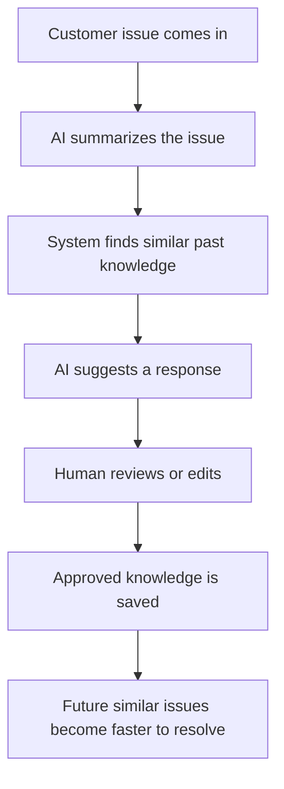
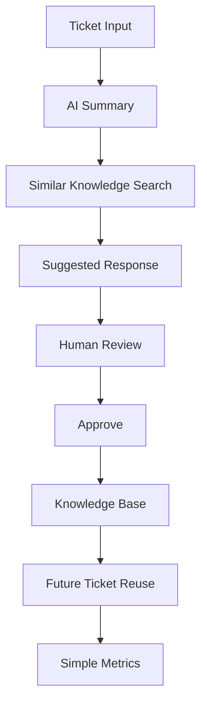
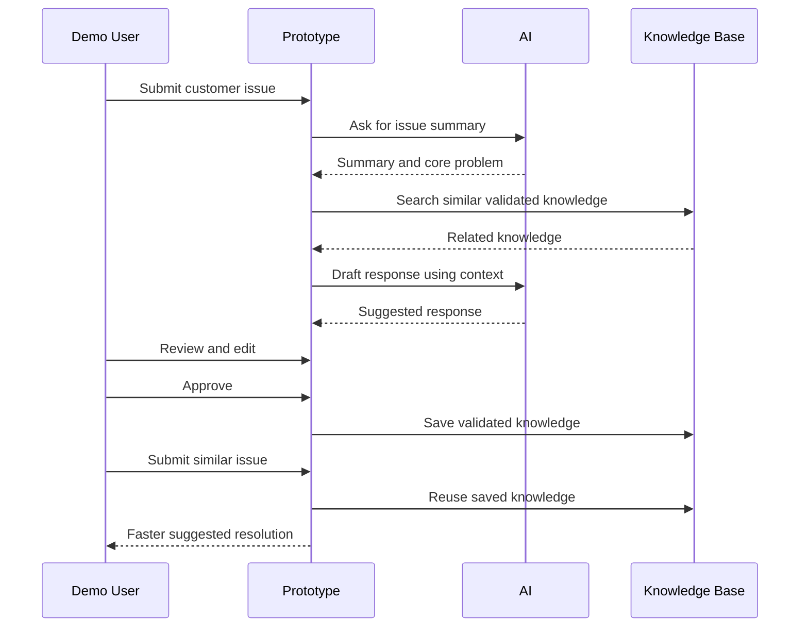
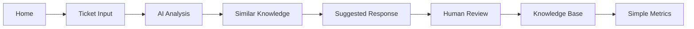
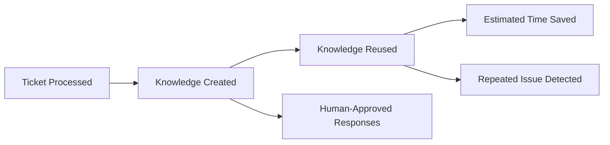
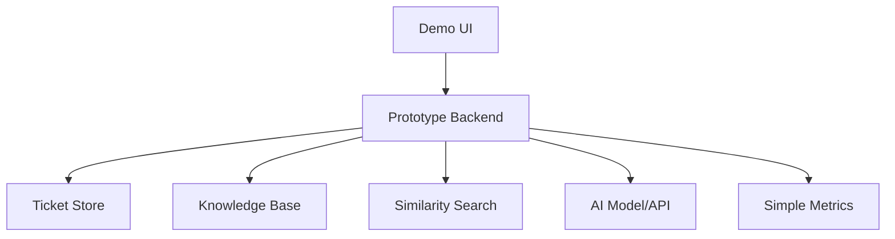

# Hackathon Scope

## Primary Question

What exactly will be built for the hackathon prototype, what will be excluded, and what must work for the demo to be successful?

This document defines the hackathon scope for the Organizational Intelligence Platform prototype.

It is written for a solo-developer hackathon project. The goal is not to build a full enterprise platform. The goal is to build a working, impressive, demo-ready prototype that proves the core idea clearly.

## 1. Executive Summary

The hackathon prototype is a focused proof of concept for the Organizational Intelligence Platform.

It should demonstrate one core loop:

The prototype should make the core idea obvious within a short demo:

> Repeated customer support problems should become reusable organizational memory.

The prototype does not need enterprise governance, production security, complex integrations, or a full helpdesk replacement. It needs a clear, working demonstration that a solved customer issue can improve future customer support work.

## 2. Hackathon Objective

Build a working prototype that shows how repeated customer support problems can become reusable organizational memory.

The prototype should prove the concept, not replace a real helpdesk.

The demo should show that:

- A customer issue can be captured.
- AI can summarize the issue.
- Similar past knowledge can be found.
- AI can draft a suggested response.
- A human can review or edit the response.
- Approved knowledge can be saved.
- Future similar tickets can reuse that knowledge.
- Simple metrics can show the value of reuse.

The objective is a strong demo and pitch, not enterprise completeness.

## 3. Core Demo Story

A customer support team receives many repeated questions.

Normally, solved issues are buried in tickets, chats, documents, or individual employee memory. When the next similar issue appears, another support agent often starts from scratch.

This prototype shows a better loop:

1. A customer issue is submitted.
2. The system understands the issue.
3. It finds relevant existing knowledge.
4. It drafts a response.
5. A human reviews the response.
6. The approved answer becomes validated knowledge.
7. The next similar issue is resolved faster and more consistently.

The story is simple:

> The team does not just answer tickets. The team gets smarter through tickets.

## 4. Prototype Scope

The hackathon prototype includes only the minimum capabilities needed for a clear demo.

## Included Features

| Feature | Purpose |
| --- | --- |
| Simple support ticket input | Allows the demo user to enter or select a customer issue. |
| AI issue summary | Shows the system understanding the customer problem. |
| Similar issue search | Finds related past issues or validated knowledge. |
| Suggested response generation | Produces a draft answer based on the issue and available knowledge. |
| Human review and edit step | Makes trust visible and prevents fully autonomous replies. |
| Approve as validated knowledge | Converts reviewed answers into reusable organizational memory. |
| Simple knowledge base | Stores approved knowledge items for future reuse. |
| Reuse validated knowledge | Demonstrates faster resolution for future similar tickets. |
| Simple dashboard or metrics | Supports demo storytelling with visible impact signals. |
| Demo-ready UI | Provides a clean, understandable experience for judges. |

## Prototype Scope Diagram

If a feature does not support this loop, it should probably be cut from the hackathon scope.

## 5. Out of Scope

The following are explicitly out of scope for the hackathon.

| Excluded Area | Why It Is Excluded |
| --- | --- |
| Full enterprise governance | Too large for a solo hackathon; future enterprise expansion. |
| Multi-tenant company system | Not needed to prove the demo loop. |
| Complex permissions | A simple prototype user model is enough. |
| Full helpdesk replacement | The prototype demonstrates intelligence on top of support work, not a full ticketing suite. |
| Slack or WhatsApp integrations | Integrations add complexity and demo risk. |
| Advanced analytics | Simple metrics are enough for the pitch. |
| Billing | Not relevant to prototype validation. |
| Admin console | Not needed for the demo story. |
| Integration marketplace | Long-term platform feature, not hackathon scope. |
| Full audit system | Human review can be shown without enterprise audit depth. |
| Production-scale security | Basic safe handling is enough for demo; production security comes later. |
| Complex workflow automation | The demo should stay linear and understandable. |
| Mobile app | Desktop/web demo is sufficient. |
| Enterprise deployment | Local or simple hosted demo is acceptable. |

These are future expansion areas, not hackathon requirements.

Avoid building them unless the core demo already works flawlessly.

## 6. MVP User Flow

The prototype flow should be simple enough to explain while clicking through it.

1. User enters or selects a customer support issue.
2. AI summarizes the issue.
3. System searches existing validated knowledge.
4. System shows related knowledge.
5. AI drafts a suggested response.
6. Human reviews and edits the response.
7. Human approves the response.
8. System saves the approved solution as validated knowledge.
9. A later similar ticket reuses that knowledge.
10. Dashboard shows simple impact metrics.

## User Flow Diagram

## 7. Required Prototype Screens

Keep the UI simple, clean, and demo-focused.

| Screen | Purpose |
| --- | --- |
| Home / Demo Start | Introduces the demo and lets the presenter start with a seeded scenario. |
| Ticket Input | Allows user to enter or select a customer support issue. |
| AI Analysis | Shows summary, core problem, category, and key details. |
| Similar Knowledge | Displays related validated knowledge or past issues. |
| Suggested Response | Shows the AI-generated draft answer. |
| Human Review | Allows edit, approve, or reject. |
| Knowledge Base | Shows saved validated knowledge items. |
| Simple Metrics | Shows tickets processed, knowledge created, reuse, and estimated time saved. |

## Screen Flow

The UI should prioritize clarity over completeness. Judges should understand what is happening without needing a long explanation.

## 8. Data Scope

Seeded demo data is acceptable and recommended.

The prototype should include example customer support issues such as:

- Login problem.
- Account blocked.
- Payment failed.
- Refund request.
- Product activation issue.
- Subscription cancellation.
- Delivery delay.

## Example Seed Data

| Issue Type | Example Customer Problem | Demo Value |
| --- | --- | --- |
| Login problem | Customer cannot log in after password reset. | Easy to understand and repeat. |
| Account blocked | Customer account is locked after failed attempts. | Shows policy and support guidance. |
| Payment failed | Customer payment did not go through. | Demonstrates repeated operational support issue. |
| Refund request | Customer asks whether a refund is possible. | Shows need for careful suggested response. |
| Product activation issue | Customer cannot activate product after purchase. | Good for knowledge reuse demo. |
| Subscription cancellation | Customer wants to cancel or stop renewal. | Shows consistent response value. |
| Delivery delay | Customer asks why order has not arrived. | Shows similar issue retrieval. |

Seeded data helps the demo stay reliable.

The prototype does not need live customer data.

## 9. AI Scope

AI should be used where it makes the demo clearer and more impressive.

## AI Should Be Used For

| AI Use | Demo Purpose |
| --- | --- |
| Summarizing tickets | Shows quick understanding of customer issues. |
| Extracting the core problem | Helps identify repeated support patterns. |
| Finding semantic similarity | Shows how similar issues can be matched beyond exact keywords. |
| Drafting suggested responses | Demonstrates practical AI assistance. |
| Turning approved responses into reusable knowledge | Shows the creation of organizational memory. |

## AI Should Not Be Used For

| Excluded AI Use | Reason |
| --- | --- |
| Fully autonomous customer replies | Human review remains required. |
| Irreversible decisions | The prototype should not execute account, billing, or policy actions. |
| Sensitive account actions | Too risky and unnecessary for demo. |
| Legal or compliance decisions | Out of scope and unsuitable for hackathon demo. |

Human review remains required.

The demo should make this visible. AI helps, but a human approves.

## 10. Simple Metrics

Prototype metrics are for demo storytelling, not enterprise analytics.

| Metric | Meaning |
| --- | --- |
| Number of tickets processed | Shows activity through the prototype. |
| Number of knowledge items created | Shows operational work becoming memory. |
| Number of reused knowledge items | Shows validated knowledge improving future tickets. |
| Estimated time saved | Helps judges understand practical value. |
| Repeated issue detected | Shows the system recognizing patterns. |
| Human-approved responses | Shows trust and review. |

## Simple Metrics Flow

Suggested demo framing:

> "This is not enterprise analytics yet. These are simple prototype metrics to show the loop is working."

## 11. Technical Scope

Keep the technical architecture simple.

Prioritize a working demo over perfect architecture.

## Practical Prototype Stack

| Layer | Suggested Option |
| --- | --- |
| Frontend | React or Next.js. |
| Backend | Node.js, Python, or FastAPI. |
| Database | SQLite or PostgreSQL. |
| Vector search | Simple embeddings, local semantic search, or a lightweight vector store. |
| AI model | Available API or local model depending on hackathon constraints. |
| Hosting | Local demo, simple cloud deployment, or hackathon-friendly hosting. |

## Technical Boundary Diagram

## Technical Rules

- Do not over-engineer.
- Prefer a reliable flow over sophisticated architecture.
- Use seeded data if live integrations create risk.
- Keep state simple.
- Keep the demo path deterministic where possible.
- Make failures easy to recover from during presentation.

## 12. Success Criteria

The prototype is successful if:

- The demo flow works from start to finish.
- AI can summarize a support issue.
- Similar knowledge can be retrieved.
- AI can draft a useful response.
- Human review is visible.
- Approved knowledge can be saved.
- Saved knowledge can be reused.
- The judge understands the value within 2 minutes.
- The pitch clearly explains the future enterprise potential.

## Success Criteria Checklist

| Criterion | Required for Demo? |
| --- | --- |
| End-to-end demo flow works | Yes |
| AI summary works | Yes |
| Similar knowledge retrieval works | Yes |
| Suggested response works | Yes |
| Human review is visible | Yes |
| Knowledge save works | Yes |
| Reuse on later ticket works | Yes |
| Simple metrics appear | Yes |
| Enterprise features complete | No |
| Production readiness | No |

The prototype wins by being clear, reliable, and memorable.

## Prototype Non-Negotiables

| Non-Negotiable | Why It Matters |
| --- | --- |
| The full demo loop must work | This proves the core idea. |
| Human review must be visible | This shows trust and human-in-the-loop control. |
| Reuse must be demonstrated | This proves organizational memory. |
| Metrics must appear at the end | This supports the pitch and makes value visible. |
| Demo must work with seeded data | This reduces risk and keeps the presentation reliable. |

If any non-negotiable is broken, lower-priority features should be cut until the core demo works reliably.

## 13. Demo Script Summary

Use a short demo sequence.

1. Show repeated customer support problem.
2. Submit a new issue.
3. Let AI summarize it.
4. Show similar past knowledge.
5. Generate suggested response.
6. Human approves it.
7. Save it as validated knowledge.
8. Submit another similar issue.
9. Show faster resolution using saved knowledge.
10. End with metrics and future vision.

## Demo Timing Guide

| Demo Segment | Target Time |
| --- | --- |
| Problem setup | 20-30 seconds |
| First ticket analysis | 30-45 seconds |
| Suggested response and review | 30-45 seconds |
| Save as knowledge | 20-30 seconds |
| Reuse on second ticket | 30-45 seconds |
| Metrics and future vision | 30-45 seconds |

The demo should feel like a story, not a feature tour.

## 14. Judging Alignment

The prototype aligns with common hackathon judging criteria.

| Judging Area | How the Prototype Addresses It |
| --- | --- |
| Real-world problem | Customer support teams repeatedly solve the same issues and lose knowledge. |
| Practical AI use | AI summarizes, finds similarity, drafts responses, and structures reusable knowledge. |
| Working prototype | The demo shows a complete issue-to-memory-to-reuse loop. |
| Clear business value | Faster support, less repeated work, more consistent answers, better onboarding potential. |
| Human-in-the-loop trust | Human review remains visible before approval and knowledge reuse. |
| Future scalability | The prototype can expand into integrations, governance, analytics, and enterprise memory. |
| Strong demo narrative | The story is simple: solved problems should make future work easier. |

Judges should leave understanding both the immediate prototype and the larger vision.

## 15. Solo Developer Constraints

This project must be scoped for one person.

## Prioritize

- Working demo.
- Simple architecture.
- Clear UI.
- Reliable flow.
- Strong pitch.
- Seeded data.
- Visible AI value.
- Human review moment.
- Reuse moment.
- Simple metrics.

## Avoid

- Unnecessary complexity.
- Too many integrations.
- Enterprise features.
- Premature scalability.
- Over-documentation.
- Complex permissions.
- Large admin surfaces.
- Advanced analytics.
- Mobile app.
- Production deployment complexity.

## Solo Developer Rule

If a feature does not make the demo clearer, safer, or more convincing, cut it.

The goal is not maximum scope. The goal is maximum clarity.

## 16. Future Expansion After Hackathon

Future expansion should be mentioned only after the prototype works.

Possible future areas:

- Enterprise governance.
- Helpdesk integrations.
- Multi-team memory.
- Advanced analytics.
- Role-based permissions.
- Customer-specific deployment.
- Organizational intelligence scoring.
- Slack, Microsoft Teams, WhatsApp, or email integrations.
- Stronger audit trails.
- More mature knowledge lifecycle management.

These are not hackathon requirements.

They are the path after the prototype proves the core idea.

## 17. Closing

The hackathon scope is intentionally narrow.

The prototype should not prove everything.

It only needs to prove the core insight:

> Solved customer problems should not disappear into archives.

They should become reviewed, reusable organizational memory that helps future work become faster, more consistent, and more intelligent.

The best hackathon version is not the broadest version.

It is the version judges can understand quickly, see working clearly, and remember after the demo ends.

Build the loop.

Show the reuse.

Tell the story.
