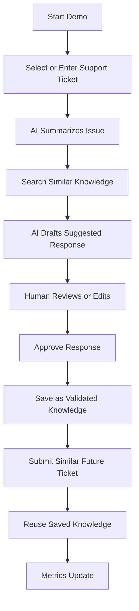
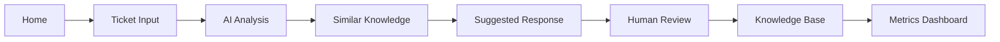
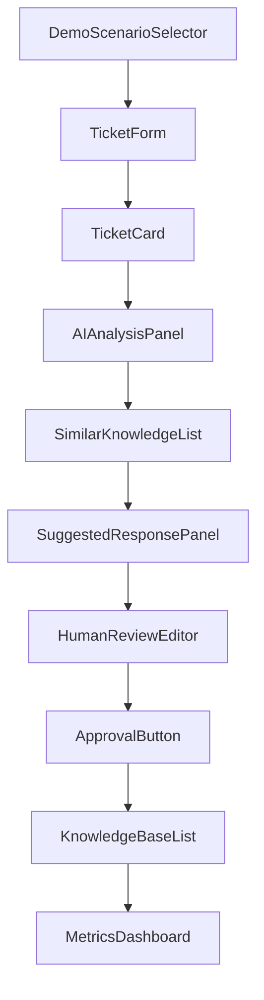
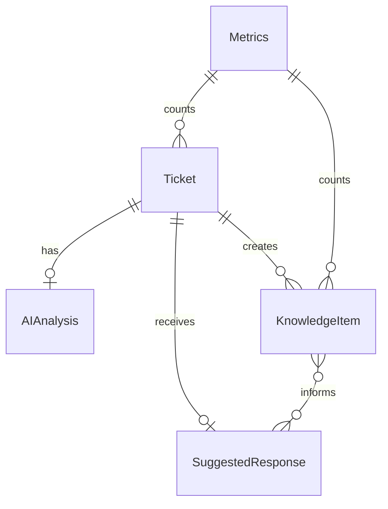
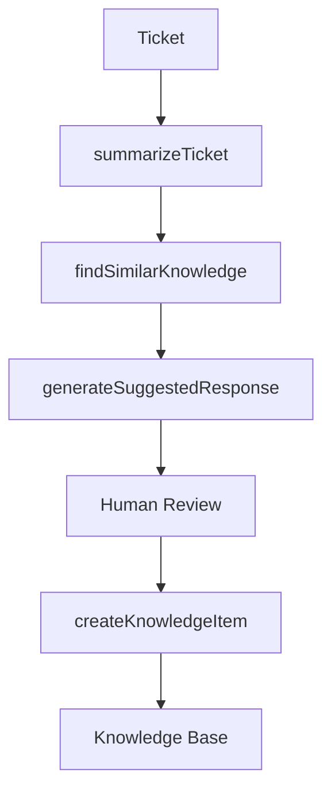
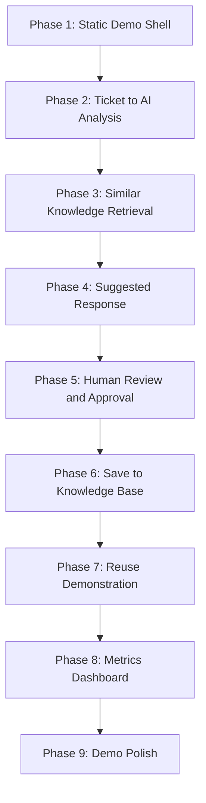
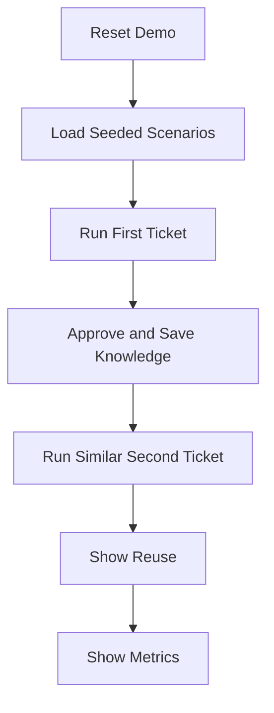

# Prototype Plan

## Derived From

- [Hackathon Scope](./00_HACKATHON_SCOPE.md)
- Product Documents Version: `v1.0.0`
- [Repository Map](../REPOSITORY_MAP.md)

## Primary Question

How should the hackathon prototype be built so the core demo loop works reliably from start to finish?

This document defines the practical build plan for the hackathon prototype of the Organizational Intelligence Platform.

It is written for a solo-developer hackathon project. The goal is not to build a full enterprise platform. The goal is to build a reliable, demo-ready prototype that proves the core loop clearly.

## 1. Executive Summary

The prototype plan translates hackathon scope into a buildable product plan.

The prototype should prioritize reliability, clarity, and demo impact over completeness. It should make one idea obvious:

> Solved customer support issues should become reviewed, reusable organizational memory.

The build should focus on a short end-to-end loop:

1. Customer issue comes in.
2. AI summarizes the issue.
3. System finds similar past knowledge.
4. AI suggests a response.
5. Human reviews or edits.
6. Approved knowledge is saved.
7. Future similar issues are resolved faster.

Everything else is secondary.

The prototype should be able to run with seeded data, deterministic fallbacks, and a resettable demo mode. AI integration should improve the demo, but the demo should not collapse if an API call fails.

## 2. Prototype Build Goal

Build a simple web prototype where a support issue can become reviewed, reusable organizational memory.

The prototype must make the value visible within a short demo:

- A support agent receives a repeated customer issue.
- The system summarizes the issue and finds related knowledge.
- AI drafts a response.
- A human reviews and approves the response.
- The approved response becomes validated knowledge.
- A later similar ticket reuses that knowledge.
- Simple metrics show the impact.

The prototype does not need to be production-ready. It needs to be clear, reliable, and convincing.

## 3. Non-Negotiable Demo Requirements

These requirements must be completed before any extra feature.

| Non-Negotiable | Build Requirement |
| --- | --- |
| Full demo loop must work | User can go from ticket input to saved knowledge to reuse. |
| Human review must be visible | User can edit or approve AI response before saving. |
| Reuse must be demonstrated | A second similar ticket retrieves saved knowledge. |
| Metrics must appear at the end | Dashboard shows basic impact numbers. |
| Seeded data must work | Demo can run reliably without live customer data. |

If any non-negotiable is broken, lower-priority features should be cut until the core demo works reliably.

## 4. Prototype User Flow

The prototype should follow one simple end-to-end flow.

1. Start demo.
2. Select or enter a support ticket.
3. AI summarizes issue.
4. System searches similar knowledge.
5. AI drafts suggested response.
6. Human edits or approves.
7. Approved response is saved as validated knowledge.
8. User submits a similar ticket.
9. System reuses saved knowledge.
10. Metrics update.

The demo should feel like a story, not a configuration exercise.

## 5. Required Screens

Only the minimum screens needed for the demo should be built.

| Screen | Purpose | Main UI Elements | Required Actions | Data Shown | Success Condition |
| --- | --- | --- | --- | --- | --- |
| Home / Demo Start | Start the pitch and select a scenario. | Demo title, value statement, scenario selector, start button. | Choose scenario and start demo. | Scenario names and short descriptions. | User can begin the demo in one click. |
| Ticket Input | Capture or select a customer issue. | Ticket form, seeded ticket selector, submit button. | Select seeded ticket or enter issue. | Customer name, subject, description, category if seeded. | Ticket is submitted into the flow. |
| AI Analysis | Show the system understanding the issue. | Summary panel, core problem, urgency, tags, category. | Continue to similar knowledge. | AI or seeded analysis. | User can see the issue was interpreted clearly. |
| Similar Knowledge | Show relevant prior knowledge. | Knowledge list, match reason, empty state if none exists. | Select or continue with related knowledge. | Related knowledge title, category, tags, approved answer preview. | Similar knowledge appears when available. |
| Suggested Response | Show the AI-drafted answer. | Draft response panel, confidence note, source knowledge references. | Send draft to review. | Draft response and related knowledge IDs. | A useful draft is visible. |
| Human Review | Make human-in-the-loop control obvious. | Editable response field, approve button, reject/reset option. | Edit and approve. | Draft response, ticket context, related knowledge. | Human can approve a reviewed response. |
| Knowledge Base | Show approved memory. | Knowledge item list, item cards, reuse count. | View saved knowledge. | Title, problem, approved answer, category, tags, times reused. | Approved item appears in the knowledge base. |
| Metrics Dashboard | End with visible value. | Metric cards and simple summary. | Reset demo or finish pitch. | Tickets processed, knowledge created, reuse, time saved, approvals. | Metrics reflect the demo loop. |

## Screen Navigation

## 6. Core Components

Build reusable components only where they make the demo easier to implement and maintain.

| Component | Responsibility |
| --- | --- |
| `TicketForm` | Captures a custom support ticket or submits a selected seeded ticket. |
| `TicketCard` | Displays ticket subject, customer, description, category, and status. |
| `AIAnalysisPanel` | Displays summary, core problem, urgency, category, and suggested tags. |
| `SimilarKnowledgeList` | Displays related knowledge items and why they matched. |
| `SuggestedResponsePanel` | Displays draft response, confidence note, and source knowledge references. |
| `HumanReviewEditor` | Allows the user to edit the suggested response before approval. |
| `ApprovalButton` | Saves the reviewed response as validated knowledge. |
| `KnowledgeBaseList` | Displays all approved knowledge items. |
| `KnowledgeItemCard` | Displays one knowledge item with problem, answer, category, tags, and reuse count. |
| `MetricsDashboard` | Displays simple demo metrics. |
| `DemoScenarioSelector` | Allows the presenter to choose a seeded demo path. |
| `ResetDemoButton` | Resets local state for another demo run. |

## Component Flow

Keep components boring and clear. This is a demo prototype, not a design system.

## 7. Data Model

The data model should stay simple.

Do not design enterprise databases. The prototype can use local state, JSON, SQLite, or PostgreSQL depending on build constraints.

## Ticket

| Field | Purpose |
| --- | --- |
| `id` | Unique ticket identifier. |
| `customerName` | Demo customer name. |
| `subject` | Short issue title. |
| `description` | Customer issue details. |
| `category` | Issue category. |
| `status` | Demo status such as new, analyzed, reviewed, approved, resolved. |
| `createdAt` | Ticket creation timestamp. |

## AIAnalysis

| Field | Purpose |
| --- | --- |
| `ticketId` | Ticket being analyzed. |
| `summary` | Short summary of the issue. |
| `coreProblem` | Extracted core problem. |
| `category` | Suggested issue category. |
| `urgency` | Low, medium, or high urgency. |
| `suggestedTags` | Tags for matching and knowledge creation. |

## KnowledgeItem

| Field | Purpose |
| --- | --- |
| `id` | Unique knowledge item identifier. |
| `title` | Human-readable title. |
| `problem` | Problem the knowledge item helps solve. |
| `approvedAnswer` | Human-approved reusable answer. |
| `category` | Knowledge category. |
| `tags` | Tags for search and matching. |
| `sourceTicketId` | Ticket that created the knowledge item. |
| `timesReused` | Number of times this item was reused. |
| `createdAt` | Creation timestamp. |
| `approvedAt` | Approval timestamp. |

## SuggestedResponse

| Field | Purpose |
| --- | --- |
| `ticketId` | Ticket being answered. |
| `draftResponse` | AI or seeded suggested response. |
| `basedOnKnowledgeIds` | Knowledge items used to draft the response. |
| `confidenceNote` | Short explanation of confidence or limits. |

## Metrics

| Field | Purpose |
| --- | --- |
| `ticketsProcessed` | Number of tickets processed during demo. |
| `knowledgeItemsCreated` | Number of approved knowledge items created. |
| `knowledgeItemsReused` | Number of reuse events. |
| `estimatedTimeSavedMinutes` | Simple estimated time savings for storytelling. |
| `humanApprovedResponses` | Number of responses approved by a human. |
| `repeatedIssuesDetected` | Number of repeated issue matches found. |

## Simple Relationship Model

## 8. Seed Data Plan

Seeded data should make the demo deterministic and reliable.

Use at least seven scenarios.

| Scenario | Sample Customer Issue | Expected AI Summary | Expected Category | Possible Response | Similar Knowledge Exists? |
| --- | --- | --- | --- | --- | --- |
| Login problem | "I reset my password but still cannot log in." | Customer cannot access account after password reset. | Login | Ask customer to clear browser cache, confirm reset link expiry, and try password reset again. | Yes |
| Account blocked | "My account says it is locked after too many attempts." | Account is locked due to repeated failed login attempts. | Account Access | Explain unlock timing and identity verification steps. | Yes |
| Payment failed | "My payment failed but my card was charged." | Customer sees payment failure with possible pending charge. | Billing | Explain pending authorization and payment retry guidance. | Yes |
| Refund request | "I want a refund for my last payment." | Customer is requesting refund eligibility review. | Refund | Explain refund policy and request order/payment details. | No |
| Product activation issue | "I bought the product but the activation code does not work." | Customer cannot activate product after purchase. | Activation | Ask for purchase email and activation code; suggest checking code format and expiration. | Yes |
| Subscription cancellation | "Please cancel my subscription before next renewal." | Customer wants to cancel subscription renewal. | Subscription | Explain cancellation path and confirm renewal date. | No |
| Delivery delay | "My order should have arrived yesterday but tracking has not updated." | Customer is asking about delayed delivery. | Delivery | Explain tracking delay, expected window, and escalation threshold. | Yes |

Seed data should include:

- At least three existing knowledge items.
- At least one scenario with no similar knowledge.
- One second ticket that clearly reuses a knowledge item created during the demo.
- Prewritten summaries and responses for fallback mode.

## 9. AI Function Plan

AI functions should be simple, reviewable, and replaceable.

AI output should never be automatically sent to customers. It should support the human review step.

## `summarizeTicket`

| Field | Description |
| --- | --- |
| Input | Ticket subject and ticket description. |
| Output | Summary, core problem, category, urgency, tags. |
| Purpose | Show quick understanding of the customer issue. |
| Fallback | Use prewritten analysis from seed data. |

## `findSimilarKnowledge`

| Field | Description |
| --- | --- |
| Input | Ticket summary, category, tags. |
| Output | List of related knowledge items. |
| Purpose | Demonstrate organizational memory retrieval. |
| Fallback | Use deterministic category and tag matching. |

## `generateSuggestedResponse`

| Field | Description |
| --- | --- |
| Input | Ticket, AI summary, related knowledge. |
| Output | Draft response and confidence note. |
| Purpose | Demonstrate practical AI assistance. |
| Fallback | Use prewritten response template. |

## `createKnowledgeItem`

| Field | Description |
| --- | --- |
| Input | Reviewed response, ticket, AI summary. |
| Output | Validated knowledge item. |
| Purpose | Convert approved work into reusable memory. |
| Fallback | Create item from edited response and deterministic metadata. |

## AI Flow

## 10. Similarity Search Plan

Similarity search should be simple and reliable.

Acceptable approaches:

- Keyword matching.
- Tag matching.
- Category matching.
- Lightweight embeddings.
- Local semantic search.

For hackathon reliability, deterministic matching using category and tags is acceptable.

## Recommended Matching Order

| Step | Matching Method | Required? |
| --- | --- | --- |
| 1 | Category match | Yes |
| 2 | Tag overlap | Yes |
| 3 | Keyword overlap | Recommended |
| 4 | Lightweight embeddings | Optional |
| 5 | Local semantic search | Optional |

## Matching Rule

Start with deterministic category and tag matching.

Add embeddings only after the full demo loop works. Advanced vector search is optional, not required for the first working demo.

## 11. Build Phases

Build the prototype in phases.

Each phase should produce a working increment.

## Phase Plan

| Phase | Goal | Tasks | Completion Criteria |
| --- | --- | --- | --- |
| Phase 1: Static Demo Shell | Build basic screens, navigation, layout, and seeded data display. | Create app shell, route or step navigation, scenario selector, placeholder screens. | Presenter can click through all screens with static data. |
| Phase 2: Ticket to AI Analysis | Implement ticket input and AI summary. | Add ticket form, seed ticket selection, summarizeTicket function or seeded summary. | Submitted ticket displays analysis. |
| Phase 3: Similar Knowledge Retrieval | Implement simple matching from seed knowledge. | Add seed knowledge, category/tag matching, similar knowledge list. | Related knowledge appears for known scenarios. |
| Phase 4: Suggested Response | Generate draft response from ticket and related knowledge. | Add generateSuggestedResponse function or template fallback. | Suggested response appears with confidence note. |
| Phase 5: Human Review and Approval | Allow editing and approving the response. | Add review editor, approve action, reviewed response state. | Human can edit and approve response. |
| Phase 6: Save to Knowledge Base | Save approved response as validated knowledge. | Add createKnowledgeItem, knowledge list update, timestamps, source ticket link. | Approved response appears in knowledge base. |
| Phase 7: Reuse Demonstration | Submit similar second ticket and show reused knowledge. | Add second ticket scenario, reuse detection, increment reuse count. | Second ticket retrieves saved knowledge. |
| Phase 8: Metrics Dashboard | Show processed tickets, created knowledge, reuse, time saved, and human approvals. | Add metric counters and simple dashboard cards. | Metrics update after demo actions. |
| Phase 9: Demo Polish | Improve layout, copywriting, empty states, loading states, and presentation flow. | Add visual polish, demo copy, reset button, predictable path. | Demo can be completed smoothly in under 5 minutes. |

## Phase Dependency Diagram

## 12. Recommended Build Order

Build the demo so it works with mock or deterministic logic before AI is fully integrated.

Recommended order:

1. Seed data.
2. UI shell.
3. Ticket input.
4. Knowledge base display.
5. Similar knowledge matching.
6. Suggested response.
7. Human review editor.
8. Save approved knowledge.
9. Reuse scenario.
10. Metrics dashboard.
11. AI integration.
12. UI polish.

## Build Order Principle

The prototype should work before it is smart.

If the deterministic flow works, AI can be added safely. If the deterministic flow does not work, AI integration will make debugging harder and demo risk higher.

## 13. Fallback Plan

Hackathon demo reliability is more important than perfect automation.

| Risk | Fallback |
| --- | --- |
| AI summary fails | Use prewritten summary from seed data. |
| AI response generation fails | Use prewritten response template. |
| Similarity search fails | Use category/tag matching. |
| Database fails | Use local JSON or in-memory state. |
| Internet fails | Use fully seeded offline demo mode. |
| UI bug appears | Provide direct demo scenario route. |

## Fallback Decision Rule

If a live dependency makes the demo unreliable, switch to deterministic fallback mode.

The pitch can explain that the prototype uses seeded demo data for reliability while still showing the intended product loop.

## 14. Demo Mode

The prototype should include a special demo mode.

Demo mode should include:

- Seeded scenarios.
- Predictable outputs.
- Reset demo button.
- Sample first ticket.
- Sample second similar ticket.
- Visible before/after reuse moment.

## Demo Mode Flow

Demo mode is acceptable because the goal is to prove the concept clearly.

The prototype should still feel interactive, but the presenter should not be at the mercy of live data, flaky APIs, or network conditions.

## 15. Definition of Done

The prototype is done when:

- A ticket can be submitted.
- AI analysis or seeded analysis appears.
- Similar knowledge appears.
- Suggested response appears.
- Human can edit and approve.
- Approved knowledge is saved.
- A similar future ticket reuses saved knowledge.
- Metrics update.
- Demo can be completed in under 5 minutes.
- The app can be reset for another demo.

## Completion Checklist

| Requirement | Done When |
| --- | --- |
| Ticket submission | A selected or custom ticket enters the demo flow. |
| Analysis | Summary, core problem, category, urgency, and tags appear. |
| Similar knowledge | Related knowledge appears or a clear empty state appears. |
| Suggested response | A useful draft response appears. |
| Human review | User can edit and approve the response. |
| Save knowledge | Approved response becomes a knowledge item. |
| Reuse | Similar future ticket retrieves saved knowledge. |
| Metrics | Dashboard numbers update after actions. |
| Reset | Demo state can be reset. |
| Timing | Full demo can run in under 5 minutes. |

## 16. Scope Control Rules

Use these rules whenever the build starts to sprawl:

- If it does not support the demo loop, cut it.
- If it delays the non-negotiables, cut it.
- If it requires complex enterprise logic, cut it.
- If it cannot be explained in the pitch, cut it.
- If seeded data can prove the point, do not build live integration yet.

## Scope Control Matrix

| Temptation | Decision |
| --- | --- |
| Add Slack or WhatsApp integration | Cut until demo loop works. |
| Build admin console | Cut. |
| Add complex permissions | Cut. |
| Build mobile app | Cut. |
| Add advanced analytics | Cut; use simple metrics. |
| Add real helpdesk sync | Cut unless core demo is already reliable. |
| Add vector search before matching works | Defer until deterministic matching works. |
| Add enterprise governance | Mention as future expansion, do not build. |

Scope control is not pessimism. It is how a solo developer finishes.

## 17. Immediate Build Checklist

| Step | Task |
| --- | --- |
| 1 | Create app shell and navigation |
| 2 | Add seed tickets and seed knowledge |
| 3 | Build ticket input screen |
| 4 | Build AI analysis panel with seeded fallback |
| 5 | Build similar knowledge matching |
| 6 | Build suggested response panel |
| 7 | Build human review editor |
| 8 | Save approved knowledge |
| 9 | Run second ticket reuse demo |
| 10 | Show metrics dashboard |
| 11 | Add reset demo button |
| 12 | Polish UI and demo copy |

This checklist should be followed in order. The prototype should work with deterministic seeded data first. AI integration and visual polish should only be added after the full demo loop works reliably.

## 18. Closing

The prototype plan exists to turn the concept into a working hackathon demo.

The goal is not to build the final company.

The goal is to prove one powerful idea:

> Solved support issues should become reviewed, reusable organizational memory.

Build the loop first.

Polish second.

Expand later.

If the prototype reliably shows a ticket becoming validated knowledge and a later ticket reusing that knowledge, the demo has done its job.
