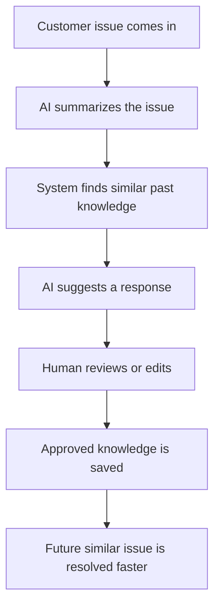

# Demo Script

## Derived From

- [Hackathon Scope](./00_HACKATHON_SCOPE.md)
- [Prototype Plan](./01_PROTOTYPE_PLAN.md)
- Product Documents Version: `v1.0.0`
- [Repository Map](../REPOSITORY_MAP.md)

## Primary Question

How should the hackathon prototype be presented so judges quickly understand the problem, the solution, the AI value, and the future potential?

This document defines the demo script for presenting the Organizational Intelligence Platform hackathon prototype.

It is written for a solo-developer hackathon project. The goal is not to explain the full enterprise platform. The goal is to help judges understand the problem, see the working prototype, and remember the value clearly.

## 1. Executive Summary

This demo script is designed to tell one simple story:

Customer support teams solve the same problems repeatedly, but their solved knowledge often disappears into tickets and chats.

This prototype turns solved support issues into reviewed, reusable organizational memory.

The demo should show the core loop:

The presenter should not try to explain the whole company vision at once. The demo wins by making the loop obvious.

## 2. Demo Goal

By the end of the demo, judges should understand that the prototype helps support teams:

- Reduce repeated work.
- Reuse validated answers.
- Keep humans in control.
- Make AI useful and reviewable.
- Turn daily support work into organizational memory.

The judge should leave thinking:

> I understand the problem, I saw the prototype work, and I can imagine this becoming valuable for real support teams.

## 3. Demo Length

Target demo length:

| Version | Length | Use When |
| --- | --- | --- |
| Short version | 3 minutes | Time is tight or judges already understand the problem. |
| Ideal version | 4 minutes | Best balance of problem, demo, metrics, and future vision. |
| Maximum version | 5 minutes | Use only if the format allows more explanation. |

The demo should feel like a story, not a feature tour.

If time is short, cut explanation before cutting the core loop. The second-ticket reuse moment is the most important part.

## 4. One-Sentence Pitch

## Primary Pitch

Organizational Intelligence Platform helps customer support teams turn solved tickets into reviewed, reusable knowledge so future agents can resolve similar issues faster and more consistently.

## Alternative Versions

| Version | Pitch |
| --- | --- |
| Simple version | This prototype helps support teams stop solving the same problem from scratch. |
| Investor version | We turn everyday support work into compounding organizational memory, starting with repeated customer issues. |
| Judge-friendly version | AI drafts the answer, humans approve it, and the approved solution helps the next similar ticket get resolved faster. |

Use the primary pitch unless a shorter version fits the moment better.

## 5. Opening Script

Use this as a natural 30-second opening:

> Customer support teams answer the same kinds of questions again and again: activation issues, payment problems, login failures, refund requests.
>
> The problem is not that teams never solve these issues. They do solve them. The problem is that the solution often disappears into a closed ticket, a chat thread, or the memory of one experienced agent.
>
> So the next agent starts from scratch.
>
> This prototype shows a different loop. A support issue comes in, AI helps summarize and draft a response, a human reviews it, and the approved solution becomes reusable knowledge for the next similar issue.

Keep the opening calm and concrete. Do not start with architecture.

## 6. Demo Scenario

Use a simple activation issue.

## Main Scenario

| Ticket | Scenario |
| --- | --- |
| First ticket | A customer cannot activate a product after purchase. |
| Second ticket | Another customer has a similar activation problem. |

## Why This Scenario Works

- Easy to understand.
- Realistic for customer support.
- Repeated issue.
- Good for knowledge reuse demonstration.
- Does not require sensitive data.
- Does not require billing, legal, or account actions.

## Scenario Setup Line

> For the demo, I am using a common support scenario: a customer bought the product, but the activation code is not working.

This scenario is simple enough that judges can focus on the product loop rather than the customer problem itself.

## 7. Step-by-Step Demo Flow

| Step | Screen | Presenter Action | What to Say | Key Message |
| --- | --- | --- | --- | --- |
| 1 | Home / Demo Start | Open the prototype and start the activation scenario. | "I'll show one repeated support issue becoming reusable knowledge." | The demo has one clear story. |
| 2 | Ticket Input | Select the first activation ticket. | "Here is the first customer issue: they purchased the product, but cannot activate it." | Real support work starts the loop. |
| 3 | AI Analysis | Show summary, core problem, category, urgency, and tags. | "The AI summarizes the issue and extracts the core problem." | AI helps understand the ticket. |
| 4 | Similar Knowledge | Show any related existing knowledge or explain none exists. | "The system checks whether the organization already knows how to solve this." | Memory is searched before reinventing. |
| 5 | Suggested Response | Generate or show a suggested response. | "AI drafts a response using the ticket context and available knowledge." | AI assists practical support work. |
| 6 | Human Review | Open editable review screen. | "But the AI does not send this automatically. A human reviews it first." | Human-in-the-loop trust. |
| 7 | Approve Response | Make a small edit if useful, then approve. | "After review, the response is approved." | Human approval creates trust. |
| 8 | Save as Validated Knowledge | Save the approved answer to the knowledge base. | "Now the solved issue becomes validated knowledge." | Solved work becomes memory. |
| 9 | Submit Second Similar Ticket | Select the second activation ticket. | "Now another customer has a similar activation issue." | Repetition creates reuse opportunity. |
| 10 | Show Reused Knowledge | Show the saved item appearing as related knowledge. | "This time, the system immediately finds the knowledge we just created." | Organizational memory works. |
| 11 | Metrics Dashboard | Show basic metrics. | "At the end, we can see tickets processed, knowledge created, reuse, approvals, and estimated time saved." | Value becomes visible. |
| 12 | Future Vision | Close with brief future expansion. | "This is a prototype, but the same loop can connect to real helpdesks, governance, analytics, and team memory." | Small prototype, larger future. |

Do not linger too long on any one screen. The power is in the whole loop.

## 8. Spoken Demo Script

## Start

> I am going to show a simple prototype for customer support teams.
>
> The idea is that solved tickets should not disappear. They should become reviewed, reusable knowledge that helps the next agent.

## First Ticket

> I will start with a common issue: a customer bought the product, but the activation code is not working.
>
> I submit the ticket, and the system analyzes it.

## AI Analysis

> Here the AI summarizes the issue, extracts the core problem, assigns a category, and suggests tags.
>
> This is useful because support tickets can be messy, but the team needs a clean understanding of what problem is actually being solved.

## Similar Knowledge

> Next, the system checks the knowledge base for similar issues.
>
> The important thing is that the agent does not start from scratch if the organization has already learned something relevant.

## Suggested Response

> Now the AI drafts a suggested response.
>
> It is not acting alone. It is using the ticket context and any related knowledge to help the support agent respond faster.

## Human Review

> This is the trust step.
>
> The AI does not send the response directly to the customer. A human can review, edit, and approve it.
>
> That keeps the agent in control and prevents AI output from becoming automatic truth.

## Save Knowledge

> Once the response is approved, we save it as validated knowledge.
>
> This is the key shift: the solved ticket becomes organizational memory.

## Second Ticket

> Now I submit a second ticket from another customer with a similar activation problem.
>
> This time, the system immediately finds the knowledge we just created.

## Reuse Moment

> This is the main point of the prototype.
>
> The first issue did not just get solved. It made the next similar issue easier to solve.

## Metrics

> Finally, the dashboard shows simple prototype metrics: tickets processed, knowledge items created, knowledge reused, human-approved responses, repeated issues detected, and estimated time saved.
>
> These are not full enterprise analytics yet. They are here to show that the loop is working.

## Close

> The larger vision is to connect this loop to real support tools, team knowledge, governance, and analytics.
>
> But for the hackathon, the prototype proves the core idea: solved support problems should become reviewed, reusable organizational memory.

## 9. Screen-by-Screen Talking Points

## Home / Demo Start

| Guidance | Notes |
| --- | --- |
| What the screen shows | Demo title, short value statement, seeded scenario selector. |
| Emphasize | This is a focused prototype for one support workflow. |
| Do not over-explain | Company strategy, enterprise architecture, or future platform details. |

## Ticket Input

| Guidance | Notes |
| --- | --- |
| What the screen shows | A seeded or entered customer support issue. |
| Emphasize | Real support work is the starting point. |
| Do not over-explain | Data model, database structure, or form details. |

## AI Analysis

| Guidance | Notes |
| --- | --- |
| What the screen shows | Summary, core problem, category, urgency, tags. |
| Emphasize | AI helps structure messy support input. |
| Do not over-explain | Prompt design, model internals, or classification theory. |

## Similar Knowledge

| Guidance | Notes |
| --- | --- |
| What the screen shows | Related knowledge or related past issue. |
| Emphasize | The system checks organizational memory before reinventing. |
| Do not over-explain | Vector search, embeddings, or ranking unless asked. |

## Suggested Response

| Guidance | Notes |
| --- | --- |
| What the screen shows | Draft answer and confidence note. |
| Emphasize | AI helps the agent move faster. |
| Do not over-explain | Every sentence of the generated response. |

## Human Review

| Guidance | Notes |
| --- | --- |
| What the screen shows | Editable response and approval action. |
| Emphasize | Human review is visible and required. |
| Do not over-explain | Enterprise approval workflows or compliance systems. |

## Knowledge Base

| Guidance | Notes |
| --- | --- |
| What the screen shows | Approved knowledge item saved from the ticket. |
| Emphasize | The solved issue became reusable memory. |
| Do not over-explain | Full knowledge lifecycle or governance model. |

## Metrics Dashboard

| Guidance | Notes |
| --- | --- |
| What the screen shows | Simple cards for tickets, created knowledge, reuse, time saved, repeated issues, approvals. |
| Emphasize | The value of the loop is visible. |
| Do not over-explain | Enterprise analytics or long-term measurement frameworks. |

## 10. Key Demo Moments

These are the moments judges must remember.

| Demo Moment | Why It Matters |
| --- | --- |
| AI understands the issue | Shows practical AI value immediately. |
| System finds related knowledge | Shows the product is more than a chatbot. |
| AI drafts a response | Shows support productivity. |
| Human approves before saving | Shows trust and human-in-the-loop control. |
| Saved knowledge becomes reusable memory | Shows the core product idea. |
| Second ticket is resolved faster | Proves the loop. |
| Metrics show value | Makes the pitch concrete. |

If the demo needs to be shortened, preserve these moments.

## 11. Metrics Explanation

Prototype metrics should be explained simply.

| Metric | How to Explain It |
| --- | --- |
| Tickets processed | "How many support issues went through the prototype." |
| Knowledge items created | "How many approved answers became reusable knowledge." |
| Reused knowledge items | "How many times saved knowledge helped a later ticket." |
| Estimated time saved | "A simple estimate of time saved by not starting from scratch." |
| Repeated issues detected | "How many issues looked similar to something the team already solved." |
| Human-approved responses | "How many responses were reviewed and approved by a person." |

Suggested explanation:

> These are prototype demo metrics, not full enterprise analytics. They make the value visible: the system processed tickets, created knowledge, reused it, and kept humans in control.

Do not overclaim the metrics. They support the story; they do not prove enterprise ROI yet.

## 12. Fallback Demo Script

Fallbacks should sound confident, not apologetic.

## General Fallback Line

> This prototype includes seeded fallback data to keep the demo reliable. In production, this step would call the AI model live, but the important part is the workflow: AI assists, a human reviews, and approved knowledge becomes reusable.

## Fallback Lines

| Situation | What to Say |
| --- | --- |
| AI summary failure | "For demo reliability, I will use the seeded summary here. This represents the AI analysis step: summarize the ticket, extract the problem, and prepare it for matching." |
| Suggested response failure | "I will switch to the seeded response template. The workflow is the same: AI proposes a draft, then the human reviews before approval." |
| Similarity search failure | "I will use the deterministic category and tag match. The prototype supports this fallback so the demo still shows the reuse loop clearly." |
| Internet failure | "This demo has an offline seeded mode. The live AI call is not the main point; the main point is the workflow from ticket to reviewed knowledge to reuse." |

## Fallback Principle

Never apologize for seeded data.

Say it is there to keep the demo reliable, then continue the story.

## 13. Judge-Friendly Explanation

Use this after the demo if judges ask what is real and what is simulated.

| Question Area | Short Explanation |
| --- | --- |
| What is working now? | The prototype can process a support ticket, show analysis, retrieve similar knowledge, draft a response, support human review, save knowledge, reuse it on a second ticket, and update metrics. |
| What is simulated or seeded? | Demo scenarios, fallback AI outputs, and simple metrics may be seeded to keep the presentation reliable. |
| What is AI doing? | AI summarizes tickets, extracts the core problem, helps find similar knowledge, drafts suggested responses, and structures approved responses into reusable knowledge. |
| What does the human control? | The human reviews, edits, and approves the response before it becomes validated knowledge. |
| What would be built next? | Real helpdesk integrations, stronger governance, role-based permissions, richer analytics, and production-ready knowledge workflows. |

Short spoken version:

> The working prototype shows the full loop. Some data is seeded for demo reliability, but the product behavior is clear: support work becomes reviewed knowledge, and reviewed knowledge helps the next similar ticket.

## 14. Future Vision Closing

Use this as a 30-second closing pitch:

> This is intentionally a small prototype.
>
> After the hackathon, the next step would be connecting this loop to real helpdesk tools, adding enterprise governance, role-based permissions, stronger analytics, and team-level organizational memory.
>
> Over time, the same idea can grow into an Organizational Intelligence Platform: a system that helps companies become smarter through the work they already do.
>
> But today, the prototype proves the core loop: a solved support issue becomes reviewed knowledge, and that knowledge helps the next issue get resolved faster.

Do not make the prototype sound bigger than it is. Make the future feel credible because the loop works.

## 15. Common Judge Questions

| Question | Short Answer |
| --- | --- |
| How is this different from a chatbot? | A chatbot answers one conversation. This prototype turns reviewed answers into reusable organizational memory for future tickets. |
| Why not just use a normal knowledge base? | Normal knowledge bases often depend on manual updates. This prototype captures knowledge from real support work and keeps human review in the loop. |
| What part uses AI? | AI summarizes the ticket, extracts the problem, finds similar knowledge, drafts a response, and helps create reusable knowledge. |
| Why is human review needed? | Because AI should assist, not become automatic truth. Human review keeps trust, quality, and control visible. |
| Can this work with real helpdesk tools? | Yes. The prototype uses simple input, but the next step would be connecting to tools like helpdesk systems, chat, or email. |
| How would this scale after the hackathon? | Add real integrations, governance, permissions, audit history, analytics, and more robust knowledge workflows. |
| What is the business value? | Faster resolution, less repeated work, more consistent answers, easier onboarding, and better reuse of expert knowledge. |
| What makes this useful for Indonesia-first teams? | Many teams handle repeated support issues across fast-growing digital services. The prototype can support localized workflows and English/Indonesian support patterns over time. |

Keep answers short. If judges want more depth, answer directly and return to the core loop.

## 16. Demo Do's and Don'ts

## Do

- Keep the demo moving.
- Show the loop clearly.
- Emphasize human review.
- Show the second ticket reuse moment.
- End with metrics.
- Explain future vision briefly.
- Use simple language.
- Stay calm if fallback data is needed.

## Don't

- Explain every document.
- Talk too much about enterprise architecture.
- Mention too many future features.
- Apologize for seeded data.
- Over-explain AI.
- Turn the demo into a technical walkthrough.
- Spend too long on setup.
- Let the future vision overshadow the working prototype.

## 17. Demo Success Criteria

| Success Signal | Meaning |
| --- | --- |
| They understand the repeated support problem | The pain is clear. |
| They see AI assisting, not replacing humans | Trust is clear. |
| They see human review | Control is clear. |
| They see knowledge reuse on the second ticket | Organizational memory is clear. |
| They understand future enterprise potential | Vision is clear. |

If the demo communicates these five points clearly, the presentation has succeeded. The presenter should not try to explain every feature or every future possibility. The goal is to make the problem, loop, trust model, reuse moment, and future potential easy to understand.

## 18. Final Demo Checklist

Review this before presenting.

| Check | Done |
| --- | --- |
| App opens correctly |  |
| Seeded data loads |  |
| First ticket works |  |
| AI analysis or fallback appears |  |
| Suggested response appears |  |
| Human review works |  |
| Knowledge save works |  |
| Second ticket reuse works |  |
| Metrics update |  |
| Reset button works |  |
| Pitch opening memorized |  |
| Closing pitch memorized |  |

## Last-Minute Presenter Reminder

Say less. Show the loop.

If the judges remember only one sentence, make it this:

> Solved support issues should become reusable organizational memory.

## 19. Closing

The demo should prove one idea clearly:

> Solved support problems should not disappear.

They should become reviewed, reusable organizational memory.

The presenter does not need to prove the full enterprise future during the hackathon.

The presenter only needs to show the loop, explain the value, and make the judges believe this prototype can grow into something much bigger.

Keep it simple.

Keep it moving.

Make the reuse moment impossible to miss.
