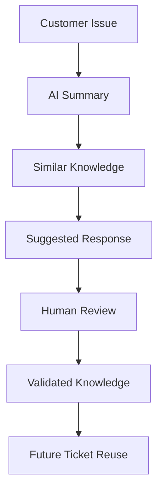

# Pitch Narrative

## Derived From

- [Hackathon Scope](./00_HACKATHON_SCOPE.md)
- [Prototype Plan](./01_PROTOTYPE_PLAN.md)
- [Demo Script](./02_DEMO_SCRIPT.md)
- Product Documents Version: `v1.0.0`
- [Repository Map](../REPOSITORY_MAP.md)

## Primary Question

How should the Organizational Intelligence Platform prototype be explained as a compelling hackathon pitch?

This document defines the pitch narrative for the Organizational Intelligence Platform hackathon prototype.

It is written for a solo-developer hackathon project. The goal is not to pitch a fully built enterprise company. The goal is to pitch a clear problem, a working prototype, a practical AI solution, and a credible future path.

## 1. Executive Summary

The pitch narrative tells one simple story:

Customer support teams repeatedly solve the same problems, but their solutions often disappear into closed tickets, chats, and individual memory.

The prototype turns those solved issues into reviewed, reusable organizational memory.

The pitch should help judges understand why the prototype matters before and after the demo:

- The problem is real and easy to recognize.
- The solution is practical and demo-ready.
- AI has a clear role.
- Humans stay in control.
- The prototype proves a small but powerful loop.
- The future potential is credible without being overclaimed.

## 2. Core Pitch Message

Customer support teams often solve the same problems again and again because the knowledge from past tickets is hard to reuse.

This prototype uses AI to summarize issues, find similar knowledge, draft responses, and turn human-approved answers into reusable organizational memory.

It starts with a simple support workflow, but the larger idea is that daily work should make the organization smarter over time.

## 3. Problem

Customer support teams handle repeated issues every day:

- Login problems.
- Product activation issues.
- Payment failures.
- Refund questions.
- Account blocks.
- Subscription cancellations.
- Delivery delays.

The problem is not that teams never solve these issues. They do.

The problem is that the solved knowledge often disappears into:

- Closed tickets.
- Chat threads.
- Internal documents.
- Individual employee memory.
- Informal answers from experienced staff.

That creates several practical problems:

- Agents start from scratch.
- Answers become inconsistent.
- Onboarding new agents takes longer.
- Experienced staff get interrupted repeatedly.
- Archived tickets are difficult to turn into reusable guidance.

Customer support is the beachhead because the pain is visible, repeated, and easy to understand.

## 4. Why This Problem Matters

This problem matters because repeated support work quietly becomes expensive.

Companies lose time when agents investigate problems that were already solved. Customers get slower or inconsistent answers. New support agents depend heavily on experienced teammates. Managers struggle to turn support experience into durable team knowledge.

Archived tickets are not enough because archives are passive. They store what happened, but they do not automatically help the next agent understand what to do.

The practical impact:

| Business Pain | Why It Matters |
| --- | --- |
| Wasted support time | Agents repeat investigations instead of reusing prior solutions. |
| Slower response | Customers wait longer for issues the company has already seen. |
| Repeated investigation | The organization keeps relearning the same lessons. |
| Inconsistent customer experience | Different agents may give different answers to similar problems. |
| Knowledge trapped in people or tickets | Expertise does not become team capability. |
| Difficulty scaling support | New agents need more time and expert help to become effective. |

The pitch should keep this practical. Do not make the problem abstract too early.

## Broader Problem: Organizational Entropy

Customer support is the starting point because the problem is visible and easy to demonstrate. But the larger problem is organizational entropy: companies lose knowledge when expertise stays trapped in people, tickets, chats, documents, and informal conversations.

When an experienced employee leaves with only one week of notice, years of knowledge cannot realistically be transferred in a few handover meetings. The company may keep the job title, the documents, and the process, but still lose the reasoning, shortcuts, judgment, and context that made the employee effective.

This prototype starts with support tickets because they provide a narrow, demo-friendly workflow. But the same core idea can eventually apply to other areas where companies lose expertise.

Pitch line:

> The prototype starts with customer support, but the real enemy is organizational entropy.

## 5. Solution

The prototype helps support teams turn solved tickets into reviewed, reusable knowledge.

The loop is:

1. Customer issue comes in.
2. AI summarizes the issue.
3. System finds similar past knowledge.
4. AI drafts a suggested response.
5. Human reviews or edits.
6. Approved response becomes validated knowledge.
7. Future similar issues are resolved faster.

The key is not just answering one ticket.

The key is that the first ticket improves the second ticket.

## 6. Why AI Belongs Here

AI belongs here because support tickets are often messy, repetitive, and text-heavy.

AI helps with:

- Summarizing messy tickets.
- Extracting the core problem.
- Finding similar knowledge.
- Drafting suggested responses.
- Turning approved answers into reusable knowledge.

AI makes the workflow faster, but it does not replace the support agent.

The pitch line:

> AI drafts, humans approve, the organization remembers.

This keeps AI practical and trustworthy.

## 7. Human-in-the-Loop Trust

Human review is important because AI output should not become automatic truth.

The prototype keeps humans in control:

- AI suggests.
- The human reviews.
- The human edits if needed.
- The human approves.
- Only approved knowledge becomes reusable.

This makes the prototype safer and more realistic for business use.

The trust model is simple:

> AI helps the agent move faster. The human decides what becomes knowledge.

## 8. What the Prototype Proves

The hackathon prototype proves:

- The core loop can work.
- AI can assist support work.
- Human review can remain visible.
- Solved issues can become reusable knowledge.
- A second similar ticket can be resolved faster.
- Simple metrics can show value.

The prototype does not prove yet:

- Full enterprise deployment.
- Production security.
- Real helpdesk integrations.
- Large-scale analytics.
- Complex role-based permissions.
- Multi-team governance.

This honesty helps the pitch.

The prototype is not pretending to be finished. It is proving the core insight.

## 9. Business Value

The practical business value is straightforward:

- Faster support responses.
- Less repeated work.
- More consistent answers.
- Better reuse of expert knowledge.
- Easier onboarding for new agents.
- Better organizational memory.

Do not overclaim ROI.

Use simple language:

> If a team solves the same kind of issue every week, the second, third, and fourth time should get easier. This prototype shows how that can happen.

## 10. Why Now

This is timely because AI models are now good enough to help with support knowledge work:

- They can summarize messy text.
- They can draft useful responses.
- They can extract patterns and tags.
- They can help match similar issues.

At the same time, companies already have large amounts of support history. Support teams need faster, more consistent answers. Businesses want AI, but they still need trust and human control.

That combination makes this the right moment for a human-reviewed AI workflow that turns daily support work into reusable memory.

## 11. Why This Is Different From a Chatbot

A chatbot answers one conversation.

This prototype captures reviewed answers and turns them into reusable organizational memory.

| Chatbot | Organizational Intelligence Prototype |
| --- | --- |
| Answers one interaction | Improves future interactions |
| May forget context | Builds reusable memory |
| Often autonomous | Keeps human review visible |
| Focuses on conversation | Focuses on organizational learning |

Pitch line:

> The goal is not just to answer this customer. The goal is to make the next similar answer easier.

## 12. Why This Is Different From a Knowledge Base

A normal knowledge base depends on people manually writing and updating articles.

This prototype captures knowledge from real support work and turns reviewed solutions into reusable knowledge.

| Traditional Knowledge Base | Organizational Intelligence Prototype |
| --- | --- |
| Relies on manual article creation | Captures knowledge from solved tickets |
| Often becomes stale | Uses review and reuse to keep knowledge active |
| Stores documents | Stores reviewed solutions tied to real issues |
| Separate from daily work | Learns from the support workflow itself |
| Measures content volume | Shows reuse and simple impact metrics |

Pitch line:

> A knowledge base stores information. This prototype helps the team learn from work.

## 13. Indonesia-First Relevance

This can matter for Indonesia-first teams because many digital services are growing quickly while support teams need to stay lean and responsive.

Practical reasons:

- Growing digital services create repeated customer support issues.
- Teams often support customers in both Indonesian and English contexts.
- Lean teams need productivity without losing quality.
- Companies want practical AI, but they still need human control.
- Support knowledge often lives inside people, chat, and ticket history.

Keep this grounded.

Do not claim the prototype solves every Indonesian market challenge. Say it is a practical starting point for teams that need faster, more consistent support while preserving human review.

## 14. Hackathon Prototype Positioning

This is not a full enterprise platform yet.

It is a focused proof of concept.

It demonstrates the core product loop in a reliable, judge-friendly way:

- Ticket in.
- AI summary.
- Similar knowledge.
- Suggested response.
- Human review.
- Save knowledge.
- Reuse on the next similar ticket.
- Show metrics.

The goal is to prove the insight before building the full platform.

This framing is important. It keeps the pitch honest and credible.

## 15. Future Vision

After the hackathon, the prototype could grow into a fuller platform through:

- Real helpdesk integrations.
- Team knowledge memory.
- Role-based permissions.
- Enterprise governance.
- Analytics.
- Organizational intelligence scoring.
- Multi-team knowledge reuse.
- Bilingual workflows.

Keep the future vision short.

The strongest future pitch is:

> If this loop works for one support issue, it can expand to more issue types, more teams, and eventually more departments.

## 16. 30-Second Pitch

Customer support teams often solve the same problems repeatedly, but the solution disappears into closed tickets or individual memory.

This prototype uses AI to summarize a support issue, find similar knowledge, draft a response, and let a human approve it before saving it as reusable knowledge.

The goal is simple: the first ticket solves the customer problem, and the second similar ticket proves the organization learned.

## 17. 60-Second Pitch

Customer support teams answer repeated questions every day: activation issues, payment problems, login failures, refund requests. The issue is not that teams cannot solve them. The issue is that solved knowledge often disappears into closed tickets, chats, or the memory of experienced agents.

This prototype shows a better loop. A ticket comes in, AI summarizes the issue, the system checks for similar past knowledge, AI drafts a suggested response, and a human reviews it before approval. Once approved, that response becomes reusable knowledge.

Then, when a second similar ticket comes in, the system can reuse what the team already learned. That means faster responses, more consistent answers, and less repeated work.

It is not a full enterprise platform yet. It is a focused prototype proving that daily support work can become organizational memory.

## 18. 2-Minute Pitch

Support teams solve the same kinds of customer problems again and again.

A customer cannot activate a product. Another customer has a payment failure. Someone else cannot log in. These are normal support issues, and most teams can solve them. But after the ticket is closed, the useful knowledge often disappears into ticket history, chat threads, or the head of one experienced agent.

That means the next agent may start from scratch, customers may get inconsistent answers, and onboarding new support agents becomes harder than it should be.

This prototype shows a different workflow.

A customer issue comes in. AI summarizes the issue and extracts the core problem. The system checks whether there is similar knowledge from past work. AI drafts a suggested response, but it does not send it automatically. A human reviews and edits the response. Once approved, that answer becomes validated knowledge.

Then the important part happens: a second similar ticket comes in, and the system reuses the knowledge from the first one.

That is the core idea. The first ticket solves the customer problem. The second ticket proves the organization learned.

For the hackathon, this is intentionally small. It uses a focused support scenario, seeded data where needed, and simple metrics like tickets processed, knowledge created, reuse, human approvals, and estimated time saved.

The future version could connect to real helpdesk tools, add governance, permissions, analytics, and bilingual workflows. But the prototype already proves the central loop: solved support problems should become reviewed, reusable organizational memory.

## 19. Pitch Soundbites

Use these when you need short, memorable lines.

1. "Solved tickets should not disappear."
2. "AI drafts, humans approve, the organization remembers."
3. "The first ticket solves the customer problem. The second ticket proves the organization learned."
4. "This is not just faster support. It is support that compounds."
5. "A closed ticket should become the start of future knowledge, not the end of it."
6. "The goal is not to replace agents. The goal is to make every agent better equipped."
7. "Archived tickets store history. This prototype turns history into reusable guidance."
8. "The AI helps write the answer, but the human decides what becomes knowledge."
9. "Repeated problems should get easier every time the team solves them."
10. "Customer support is not just a cost center. It is a learning engine."
11. "The organization should remember what its best agents already know."
12. "The demo is small, but the loop is powerful."

## 20. What Not to Say

Avoid these claims or habits:

- Do not claim this is already enterprise-ready.
- Do not overclaim AI accuracy.
- Do not say the prototype replaces support agents.
- Do not spend too long on architecture.
- Do not describe every repository document.
- Do not promise integrations that are not built yet.
- Do not present seeded data as live customer data.
- Do not claim full automation.
- Do not make financial projections.
- Do not imply the prototype solves every support problem.

Safer framing:

> This is a focused prototype proving the core loop. The future platform would add integrations, governance, permissions, analytics, and production hardening.

## 21. Closing Pitch

Solved support problems should not disappear.

They should become reviewed, reusable organizational memory.

This prototype proves that loop in a simple way: one ticket creates knowledge, and the next similar ticket benefits from it.

AI helps make the workflow faster, but humans stay in control.

The result is a practical path toward faster support, more consistent answers, easier onboarding, and organizations that learn from the work they already do.

## 22. Final Pitch Checklist

Use this checklist before presenting.

| Check | Done |
| --- | --- |
| Problem is clear |  |
| Solution is clear |  |
| AI role is clear |  |
| Human review is clear |  |
| Reuse moment is clear |  |
| Business value is clear |  |
| Future vision is credible |  |
| Prototype limitations are honest |  |
| Pitch can be delivered in under 2 minutes |  |
| Demo and pitch support each other |  |

## Final Reminder

The pitch does not need to prove everything.

It needs to make judges believe one thing:

> Daily support work can become organizational memory.
