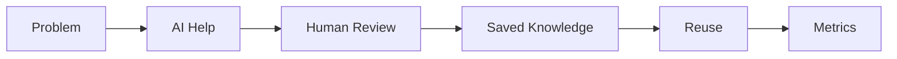

# Judging Criteria Alignment

## Derived From

- [Hackathon Scope](./00_HACKATHON_SCOPE.md)
- [Prototype Plan](./01_PROTOTYPE_PLAN.md)
- [Demo Script](./02_DEMO_SCRIPT.md)
- [Pitch Narrative](./03_PITCH_NARRATIVE.md)
- Product Documents Version: `v1.0.0`
- [Repository Map](../REPOSITORY_MAP.md)

## Primary Question

How does the hackathon prototype align with what judges are likely to evaluate?

This document explains how the Organizational Intelligence Platform hackathon prototype aligns with likely hackathon judging criteria.

If official judging criteria are later provided, this document should be updated to match them exactly.

## 1. Executive Summary

This document maps the hackathon prototype to likely judging criteria.

The prototype should be judged as a focused proof of concept, not a full enterprise product.

The core judging message is:

> This prototype solves a real repeated support problem by using AI to turn reviewed answers into reusable organizational memory.

The best judging strategy is not to make the prototype sound bigger than it is. The best strategy is to make the core loop easy to understand, visibly working, and memorable:

1. A repeated support issue appears.
2. AI helps summarize and draft.
3. A human reviews and approves.
4. The approved answer becomes knowledge.
5. A second similar ticket reuses that knowledge.
6. Simple metrics make the value visible.

## 2. Likely Judging Criteria

The following are likely judging areas, not official criteria unless confirmed later.

| Judging Area | What Judges May Look For |
| --- | --- |
| Real-world problem | Is the problem understandable, meaningful, and practical? |
| Practical AI usage | Is AI used in a useful workflow rather than as a gimmick? |
| Working prototype | Does the demo work from start to finish? |
| Technical execution | Is the build reliable, coherent, and appropriate for hackathon scope? |
| User experience | Can judges understand the product quickly? |
| Business value | Does the prototype show a believable value proposition? |
| Trust and safety | Are AI limits, human control, and safe boundaries visible? |
| Future scalability | Could this grow into something larger after the hackathon? |
| Demo clarity | Is the story easy to follow and remember? |
| Originality | Is the concept meaningfully different from obvious alternatives? |

The prototype should be presented through these lenses without overclaiming.

## 3. Judging Alignment Matrix

| Judging Area | How the Prototype Aligns | Demo Evidence | Pitch Message |
| --- | --- | --- | --- |
| Real-world problem | Support teams repeatedly solve similar issues and lose knowledge. | Repeated activation issue. | "Solved tickets should not disappear." |
| Practical AI usage | AI summarizes, extracts the problem, finds similar knowledge, drafts, and helps structure knowledge. | AI analysis and suggested response screens. | "AI assists a real support workflow." |
| Working prototype | The demo shows ticket input, analysis, review, saved knowledge, reuse, and metrics. | Full demo loop from first ticket to second-ticket reuse. | "The loop works end to end." |
| Technical execution | Simple web prototype with seeded data, deterministic fallback, matching logic, and resettable demo mode. | Reliable demo path and fallback behavior. | "The build is intentionally simple and reliable." |
| User experience | Screens follow a clear story from ticket to knowledge to reuse. | Step-by-step flow and visible review moment. | "Judges can understand it without technical setup." |
| Business value | Faster responses, less repeated work, consistent answers, easier onboarding, better memory. | Metrics dashboard and reuse moment. | "The first ticket makes the next ticket easier." |
| Trust and safety | AI output is reviewed before approval; sensitive actions are out of scope. | Human review editor and approval step. | "AI drafts, humans approve." |
| Future scalability | The loop can expand to real helpdesks, governance, analytics, and team memory. | Closing pitch and future vision. | "Small prototype, credible platform path." |
| Demo clarity | The story is one repeated support issue becoming reusable memory. | First ticket, save knowledge, second ticket reuse. | "Show the loop, not every feature." |
| Originality | The prototype is not just a chatbot or knowledge base; it turns support work into reviewed memory. | Knowledge save and second-ticket reuse. | "It focuses on organizational learning." |

## 4. Real-World Problem Alignment

Customer support teams repeatedly solve similar issues, but knowledge gets trapped in tickets, chats, documents, and people.

The broader problem is organizational entropy. Companies lose knowledge when expertise remains informal or scattered. When experienced employees leave, years of context cannot be transferred in a few handover meetings.

Customer support is a good prototype entry point because:

- Repeated problems are easy to demonstrate.
- The workflow is familiar.
- The value of reuse is visible.
- The data can be safely seeded.
- The demo does not require sensitive account actions.

The prototype should keep this practical:

> Customer support is the starting point, but the larger problem is organizational entropy.

## 5. Practical AI Usage Alignment

AI is used in a practical support workflow.

AI supports:

- Ticket summarization.
- Core problem extraction.
- Similar knowledge retrieval.
- Suggested response drafting.
- Reusable knowledge creation.

AI is not used for:

- Fully autonomous customer replies.
- Irreversible decisions.
- Sensitive account actions.
- Legal or compliance decisions.

The key trust line:

> AI assists. Humans approve.

This makes the AI usage easier for judges to trust.

## 6. Working Prototype Alignment

The prototype should visibly show the full loop.

Required working evidence:

- Ticket input.
- AI analysis or seeded fallback.
- Similar knowledge.
- Suggested response.
- Human review.
- Approval.
- Knowledge save.
- Second-ticket reuse.
- Metrics dashboard.
- Reset demo.

The full loop matters more than feature breadth.

A narrow prototype that completes the loop is stronger than a broad prototype with disconnected screens.

## 7. Technical Execution Alignment

The prototype is intentionally simple.

Technical strength comes from reliability and clarity, not over-engineering.

The build should highlight:

- Simple web UI.
- Seeded demo data.
- Deterministic fallback logic.
- Simple matching by category and tags.
- Optional AI integration.
- Resettable demo mode.
- Clear data model.

Pitch framing:

> For the hackathon, I optimized for a reliable end-to-end demo. The prototype uses simple matching and seeded fallbacks so the core workflow can be shown clearly.

This is stronger than pretending the prototype is production infrastructure.

## 8. User Experience Alignment

The prototype should be easy to understand.

UX strengths:

- Simple screens.
- Clear step-by-step flow.
- Visible AI analysis.
- Visible human review.
- Obvious reuse moment.
- Simple metrics at the end.

The demo should feel like a story, not a technical walkthrough.

Judges should be able to follow:

If judges can explain the loop back in one sentence, the UX and demo narrative are working.

## 9. Business Value Alignment

Business value should be realistic.

The prototype suggests value through:

- Faster support responses.
- Less repeated work.
- More consistent answers.
- Easier onboarding.
- Better reuse of expert knowledge.
- Stronger organizational memory.

Do not add financial projections.

Use simple business language:

> If support teams keep seeing the same issues, the second and third time should be easier than the first.

The metrics are demo metrics. They make value visible, but they are not yet enterprise ROI proof.

## 10. Trust and Safety Alignment

Human review is central to the trust model.

This matters because:

- AI output is not automatic truth.
- Humans review and approve.
- Approved knowledge becomes reusable.
- Sensitive actions are out of scope.
- The prototype does not make irreversible decisions.

Pitch line:

> AI drafts, humans approve, the organization remembers.

This should be repeated if judges ask about AI risk.

## 11. Future Scalability Alignment

Future potential should be credible because the prototype proves the core loop.

After the hackathon, the prototype could expand into:

- Real helpdesk integrations.
- Enterprise governance.
- Role-based permissions.
- Analytics.
- Bilingual workflows.
- Multi-team organizational memory.
- Organizational intelligence scoring.

Clarify:

> This prototype is not enterprise-ready yet. It proves the loop that a future enterprise platform could build on.

The future should sound possible, not inflated.

## 12. Originality Alignment

The prototype is not just a chatbot, normal knowledge base, ticketing system, or summarizer.

It is a workflow where support work becomes reviewed, reusable organizational memory.

| Common Category | How This Prototype Is Different |
| --- | --- |
| Chatbot | A chatbot answers one interaction; this improves future interactions. |
| Knowledge base | A knowledge base stores articles; this captures reviewed knowledge from real support work. |
| Ticketing system | A ticketing system tracks issues; this turns solved issues into reusable memory. |
| Summarizer | A summarizer condenses text; this uses summaries inside a review-and-reuse loop. |

Originality is in the loop:

> Ticket → AI assist → human review → validated knowledge → future reuse.

## 13. Demo Evidence Checklist

The presenter should show this evidence during the demo.

| Evidence | Shown? |
| --- | --- |
| Repeated support problem is introduced |  |
| First ticket is submitted |  |
| AI analysis appears |  |
| Similar knowledge is checked |  |
| Suggested response appears |  |
| Human review is shown |  |
| Approved knowledge is saved |  |
| Second similar ticket is submitted |  |
| Saved knowledge is reused |  |
| Metrics dashboard appears |  |
| Future vision is explained briefly |  |

If time is short, protect the second-ticket reuse moment.

## 14. Risk Areas and Mitigation

| Risk | Why It Matters | Mitigation |
| --- | --- | --- |
| AI/API failure | Live AI failure can interrupt the demo. | Use seeded fallback summaries and responses. |
| Demo too long | Judges may miss the main idea. | Keep to 3-5 minutes and cut explanation before cutting the loop. |
| Judges think it is just a chatbot | The concept may seem less original. | Emphasize saved knowledge and second-ticket reuse. |
| Seeded data misunderstood | Judges may think the demo is fake or overclaimed. | Explain seeded data is for reliability and the workflow is the proof. |
| Overclaiming enterprise readiness | Weakens credibility. | Say it is a focused proof of concept, not a production platform. |
| Too much architecture explanation | Distracts from value. | Keep technical details short unless asked. |
| Reuse moment not clear | Judges may miss organizational memory. | Slow down at the second ticket and explicitly point out reuse. |
| Metrics overclaimed | Demo metrics can be mistaken for ROI proof. | Say they are prototype metrics for storytelling, not enterprise analytics. |

## 15. What to Emphasize to Judges

Strongest messages:

- The problem is repeated and easy to understand.
- AI is used in a practical workflow.
- Humans stay in control.
- The first ticket improves the second ticket.
- The prototype is narrow but complete.
- The future platform has credible expansion potential.

Short version:

> This is a small prototype with a complete loop.

## 16. What Not to Emphasize

Avoid focusing on:

- Full enterprise architecture.
- Long repository explanation.
- Too many future features.
- Production security claims.
- Financial projections.
- Replacing support agents.
- Claiming full automation.
- Presenting seeded data as live production data.

If judges ask technical questions, answer clearly. Then return to the core loop.

## 17. Self-Scoring Table

Use this honestly before submission.

| Judging Area | Current Strength | Evidence | Needs Improvement |
| --- | --- | --- | --- |
| Problem clarity | Strong | Repeated support issue and organizational entropy framing. | Keep opening concise. |
| AI usage | Strong | Summary, extraction, matching, drafting, knowledge creation. | Ensure fallback does not hide AI role. |
| Prototype completeness | Medium-Strong | Full loop is defined and buildable. | Confirm every non-negotiable works. |
| Demo reliability | Medium | Seeded data and fallback plan. | Practice reset and offline mode. |
| Business value | Strong | Less repeated work, faster responses, consistency, onboarding. | Avoid ROI overclaims. |
| Trust model | Strong | Human review and approval are visible. | Make review moment obvious. |
| Technical execution | Medium | Simple stack, deterministic matching, clear data model. | Keep implementation reliable over clever. |
| Future potential | Strong | Clear expansion path after core loop. | Keep future vision short. |

Do not inflate the score. Honest weaknesses are easier to defend than exaggerated claims.

## 18. Submission Readiness Checklist

Use this before final submission.

- Prototype opens reliably.
- Demo mode works.
- Seeded data loads.
- Fallback mode works.
- Pitch is practiced.
- Demo script is practiced.
- Metrics appear.
- README explains the prototype.
- Screenshots or demo video are prepared if required.
- Limitations are clearly stated.
- Future vision is concise.
- Repository is clean enough for judges.

## 19. Closing

Judging alignment is not about pretending the prototype is bigger than it is.

The best strategy is to make the core loop clear:

> A repeated support issue becomes AI-assisted, human-reviewed, reusable organizational memory.

If judges understand that loop, the problem, the trust model, and the future potential, the prototype has a strong chance to stand out.

Keep the scope honest.

Keep the demo reliable.

Make the reuse moment memorable.
