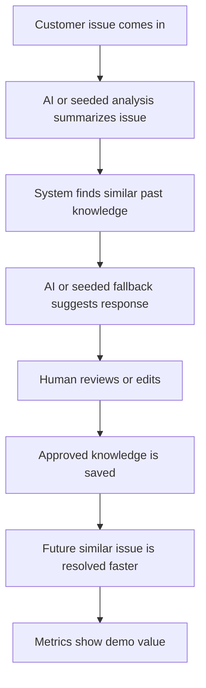
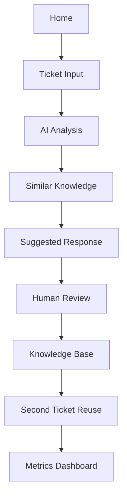
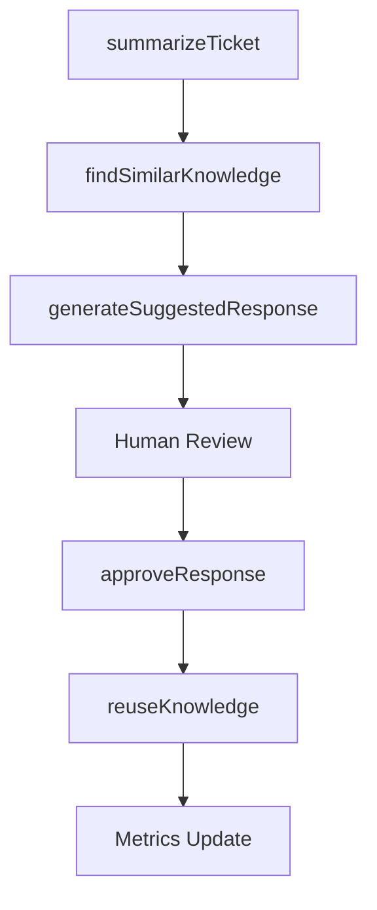
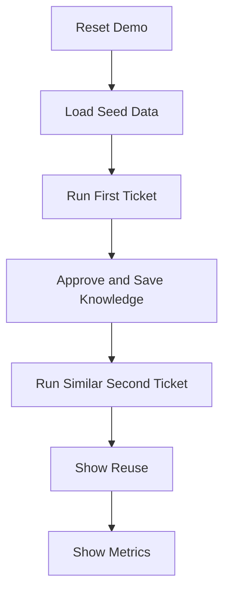

# Technical Build Spec

## Derived From

- [Hackathon Scope](./00_HACKATHON_SCOPE.md)
- [Prototype Plan](./01_PROTOTYPE_PLAN.md)
- [Demo Script](./02_DEMO_SCRIPT.md)
- [Pitch Narrative](./03_PITCH_NARRATIVE.md)
- [Judging Criteria Alignment](./04_JUDGING_CRITERIA_ALIGNMENT.md)
- Product Documents Version: `v1.0.0`
- [Repository Map](../REPOSITORY_MAP.md)

## Primary Question

What exactly should be built technically so the hackathon prototype works reliably from start to finish?

This document defines the technical build specification for the Organizational Intelligence Platform hackathon prototype.

It is written for a solo-developer hackathon project. The goal is not to build production infrastructure. The goal is to build a reliable, demo-ready prototype that proves the core loop.

## 1. Executive Summary

This technical build spec translates the hackathon prototype plan into concrete implementation guidance.

Reliability, demo clarity, and fallback behavior are more important than architectural perfection.

The prototype should prove one end-to-end loop:



The implementation should be simple enough for one developer to build and reliable enough to present without fear.

## 2. Recommended Stack

Use the simplest stack that supports a polished web demo.

| Layer | Recommendation |
| --- | --- |
| Frontend | Next.js with React |
| Language | TypeScript |
| Styling | Tailwind CSS |
| State | React state or lightweight store |
| Data | Local JSON or TypeScript seed data |
| Persistence | `localStorage` for demo state |
| AI | API call if available; seeded fallback if unavailable |
| Search | Deterministic category/tag matching first |
| Deployment | Local demo or simple hosted deployment |

## Not Required for First Hackathon Prototype

- SQLite.
- PostgreSQL.
- Vector database.
- Authentication.
- Real helpdesk integrations.
- Multi-user accounts.
- Production infrastructure.

These may become useful later, but they should not block the first reliable demo loop.

## 3. Technical Non-Negotiables

| Non-Negotiable | Technical Requirement |
| --- | --- |
| Full demo loop works | App supports ticket input, analysis, response, review, save, reuse, and metrics. |
| Human review visible | Editable response screen exists before approval. |
| Reuse demonstrated | Second ticket retrieves saved knowledge. |
| Metrics appear | Dashboard updates after demo actions. |
| Seeded data works | App can run without live customer data or AI API. |
| Reset works | Demo state can be reset quickly. |

These must work before adding polish or optional AI improvements.

## 4. App Flow

Use a simple step-based demo flow.

1. Home.
2. Ticket Input.
3. AI Analysis.
4. Similar Knowledge.
5. Suggested Response.
6. Human Review.
7. Knowledge Base.
8. Second Ticket Reuse.
9. Metrics Dashboard.



The app may be implemented as one page with step navigation. Separate routes are optional.

## 5. Suggested Project Structure

Use a structure like this:

```text
app/
  page.tsx
  layout.tsx

components/
  DemoScenarioSelector.tsx
  TicketForm.tsx
  TicketCard.tsx
  AIAnalysisPanel.tsx
  SimilarKnowledgeList.tsx
  SuggestedResponsePanel.tsx
  HumanReviewEditor.tsx
  KnowledgeBaseList.tsx
  KnowledgeItemCard.tsx
  MetricsDashboard.tsx
  ResetDemoButton.tsx
  StepNavigation.tsx

data/
  seedTickets.ts
  seedKnowledge.ts
  seedResponses.ts

lib/
  demoState.ts
  matching.ts
  ai.ts
  metrics.ts
  knowledge.ts

types/
  ticket.ts
  ai.ts
  knowledge.ts
  metrics.ts
```

This structure may be simplified if needed.

For example, all types can live in `types/index.ts`, and all seed data can live in one file if that helps finish faster.

## 6. Data Types

Keep schemas simple. Do not design enterprise models.

## `Ticket`

```ts
export interface Ticket {
  id: string;
  customerName: string;
  subject: string;
  description: string;
  category: string;
  status: "new" | "analyzed" | "drafted" | "reviewed" | "approved" | "resolved";
  createdAt: string;
}
```

## `AIAnalysis`

```ts
export interface AIAnalysis {
  ticketId: string;
  summary: string;
  coreProblem: string;
  category: string;
  urgency: "low" | "medium" | "high";
  suggestedTags: string[];
}
```

## `KnowledgeItem`

```ts
export interface KnowledgeItem {
  id: string;
  title: string;
  problem: string;
  approvedAnswer: string;
  category: string;
  tags: string[];
  sourceTicketId: string;
  timesReused: number;
  createdAt: string;
  approvedAt: string;
}
```

## `SuggestedResponse`

```ts
export interface SuggestedResponse {
  ticketId: string;
  draftResponse: string;
  basedOnKnowledgeIds: string[];
  confidenceNote: string;
}
```

## `Metrics`

```ts
export interface Metrics {
  ticketsProcessed: number;
  knowledgeItemsCreated: number;
  knowledgeItemsReused: number;
  estimatedTimeSavedMinutes: number;
  humanApprovedResponses: number;
  repeatedIssuesDetected: number;
}
```

## 7. Seed Data

Seeded data is demo data to make the prototype reliable. It is not fake enterprise data.

## `seedTickets.ts`

Must include at least:

- Product activation issue.
- Second similar activation issue.
- Login problem.
- Account blocked.
- Payment failed.
- Refund request.
- Subscription cancellation.
- Delivery delay.

## `seedKnowledge.ts`

Must include at least three reusable knowledge items.

Recommended starting items:

| Knowledge Item | Category | Tags |
| --- | --- | --- |
| Activation code troubleshooting | Activation | `activation`, `activation-code`, `purchase` |
| Account unlock guidance | Account Access | `account`, `locked`, `login` |
| Payment pending authorization explanation | Billing | `payment`, `failed-payment`, `authorization` |

## `seedResponses.ts`

Must include fallback summaries and fallback suggested responses for demo reliability.

At minimum, include fallback data for the activation demo path.

## 8. Core Functions

## `summarizeTicket(ticket)`

Purpose:

Return AI analysis for a ticket.

Behavior:

- Try AI API if configured.
- Fall back to seeded analysis if AI fails.
- Return summary, core problem, category, urgency, and tags.

## `findSimilarKnowledge(analysis, knowledgeItems)`

Purpose:

Find related knowledge.

Behavior:

- Match category first.
- Match tag overlap second.
- Match keyword overlap third.
- Return matched knowledge with match reason.
- Do not require embeddings for v1.

## `generateSuggestedResponse(ticket, analysis, matches)`

Purpose:

Create draft support response.

Behavior:

- Try AI API if configured.
- Use matched knowledge as context.
- Fall back to seeded response if AI fails.
- Include confidence note.

## `approveResponse(ticket, analysis, reviewedResponse)`

Purpose:

Save reviewed response as validated knowledge.

Behavior:

- Create new `KnowledgeItem`.
- Add `sourceTicketId`.
- Add tags and category.
- Set `approvedAt`.
- Increment metrics.

## `reuseKnowledge(ticket, matchedKnowledge)`

Purpose:

Demonstrate second-ticket reuse.

Behavior:

- Show saved knowledge item.
- Increment `timesReused`.
- Update metrics.

## `resetDemo()`

Purpose:

Reset app to initial seeded state.

Behavior:

- Clear `localStorage`.
- Reload seed tickets and knowledge.
- Reset metrics.

## Core Function Flow



## 9. Demo State Model

Use local React state for the first build.

Use `localStorage` only if persistence is easy and helpful.

## State Fields

| Field | Purpose |
| --- | --- |
| `currentStep` | Current step in demo flow. |
| `selectedTicket` | First ticket being processed. |
| `secondTicket` | Similar second ticket used for reuse demo. |
| `aiAnalysis` | Analysis for selected ticket. |
| `similarKnowledge` | Matched knowledge items. |
| `suggestedResponse` | Draft support response. |
| `reviewedResponse` | Human-edited approved response. |
| `knowledgeItems` | Current knowledge base state. |
| `metrics` | Current demo metrics. |
| `demoMode` | Whether deterministic demo mode is active. |
| `errorMessage` | Friendly demo-safe error message. |
| `isLoading` | Loading state for AI or matching actions. |

## 10. Screen Specifications

Keep every screen simple.

| Screen | Route or Step | Purpose | Required Components | User Action | State Changes | Success Condition |
| --- | --- | --- | --- | --- | --- | --- |
| Home / Demo Start | `home` | Start demo and choose scenario. | `DemoScenarioSelector`, `StepNavigation` | Start activation scenario. | Set `currentStep`, load seed state. | Demo starts cleanly. |
| Ticket Input | `ticket-input` | Select or enter first support ticket. | `TicketForm`, `TicketCard` | Submit ticket. | Set `selectedTicket`; increment processed when analysis begins. | Ticket enters flow. |
| AI Analysis | `ai-analysis` | Show summary and extracted problem. | `AIAnalysisPanel` | Continue. | Set `aiAnalysis`; update ticket status. | Analysis appears or fallback appears. |
| Similar Knowledge | `similar-knowledge` | Show related knowledge. | `SimilarKnowledgeList` | Continue with matches or empty state. | Set `similarKnowledge`; increment repeated issue if match found. | Related knowledge or empty state appears. |
| Suggested Response | `suggested-response` | Show draft answer. | `SuggestedResponsePanel` | Send to review. | Set `suggestedResponse`. | Draft response appears. |
| Human Review | `human-review` | Let human edit and approve. | `HumanReviewEditor`, `ApprovalButton` | Edit and approve. | Set `reviewedResponse`; save knowledge. | Approved answer exists. |
| Knowledge Base | `knowledge-base` | Show saved validated knowledge. | `KnowledgeBaseList`, `KnowledgeItemCard` | Continue to reuse demo. | `knowledgeItems` includes new item. | New knowledge item appears. |
| Second Ticket Reuse | `reuse-demo` | Demonstrate reuse on similar ticket. | `TicketCard`, `SimilarKnowledgeList` | Submit second ticket. | Set `secondTicket`; increment reuse metrics. | Saved knowledge is retrieved. |
| Metrics Dashboard | `metrics` | Show impact. | `MetricsDashboard`, `ResetDemoButton` | Finish or reset. | Display final metrics. | Metrics reflect demo actions. |

## 11. AI Integration Boundary

AI integration is optional but useful.

All AI calls should be isolated in:

```text
lib/ai.ts
```

Use an environment flag:

```text
AI_ENABLED=true/false
```

Rules:

- The app must work if AI is disabled.
- If AI is disabled or fails, use seeded fallback data.
- AI should never automatically send a customer reply.
- All AI output must pass through Human Review before becoming validated knowledge.

Keep AI prompts and API details replaceable.

## 12. Matching Logic

Use simple matching logic.

Priority:

1. Category match.
2. Tag overlap.
3. Keyword overlap.

Return:

- Knowledge item.
- Match score.
- Match reason.

Example match reason:

```text
Matched category "Activation" and tags: activation-code, purchase.
```

Embeddings or vector search are optional later improvements. They are not required for the hackathon demo.

## 13. Metrics Logic

These are demo metrics, not enterprise analytics.

## Update Rules

| Metric | Update Rule |
| --- | --- |
| `ticketsProcessed` | Increment when a ticket enters analysis. |
| `knowledgeItemsCreated` | Increment after approval creates a knowledge item. |
| `knowledgeItemsReused` | Increment when saved knowledge is used for a second ticket. |
| `estimatedTimeSavedMinutes` | Increase by a simple fixed value per reuse, such as 10 minutes. |
| `humanApprovedResponses` | Increment after approval. |
| `repeatedIssuesDetected` | Increment when similar knowledge is found. |

Metric values should support the pitch. They should not be presented as production ROI.

## 14. Fallback and Error Handling

The app should fail gracefully during the demo.

| Failure | App Behavior |
| --- | --- |
| AI summary fails | Use seeded analysis. |
| AI response fails | Use seeded suggested response. |
| No similar knowledge found | Show clear empty state and continue. |
| `localStorage` fails | Continue with in-memory state. |
| Reset fails | Provide manual reload instruction. |
| Unexpected error | Show friendly demo-safe error message. |

Friendly demo-safe error example:

```text
Live AI is unavailable, so the demo is using seeded fallback output. The workflow remains the same.
```

## 15. Demo Mode Requirements

Demo mode is a feature, not a weakness.

Demo mode should include:

- Scenario selector.
- Preloaded seed data.
- Predictable first ticket.
- Predictable second ticket.
- Seeded fallback outputs.
- Reset demo button.
- Visible progress through steps.
- Metrics update at the end.

## Demo Mode Flow



## 16. Implementation Order

Build in this exact order:

1. Create Next.js app shell.
2. Add Tailwind styling.
3. Add TypeScript types.
4. Add seed ticket and knowledge files.
5. Add demo state.
6. Build Home / Demo Start.
7. Build Ticket Input.
8. Build AI Analysis with fallback.
9. Build Similar Knowledge matching.
10. Build Suggested Response with fallback.
11. Build Human Review editor.
12. Build approve and save knowledge logic.
13. Build Knowledge Base screen.
14. Build second-ticket reuse flow.
15. Build Metrics Dashboard.
16. Add reset demo button.
17. Add loading and empty states.
18. Polish demo copy and UI.
19. Test full demo loop.
20. Prepare for presentation.

Do not integrate optional AI before the deterministic loop works.

## 17. Testing Checklist

Use this before demo.

| Test | Pass? |
| --- | --- |
| App starts locally |  |
| Seed data loads |  |
| First ticket can be selected |  |
| AI analysis appears |  |
| Fallback analysis works |  |
| Similar knowledge appears |  |
| No-match state works |  |
| Suggested response appears |  |
| Human review editor works |  |
| Approved knowledge saves |  |
| Knowledge base updates |  |
| Second ticket finds saved knowledge |  |
| Metrics update correctly |  |
| Reset button works |  |
| App works without AI API |  |
| Demo can be completed in under 5 minutes |  |

## 18. Out of Scope

Do not build these for the hackathon prototype:

- Authentication.
- Multi-user accounts.
- Enterprise permissions.
- Billing.
- Real helpdesk integration.
- Slack, WhatsApp, or email integration.
- Vector database requirement.
- Production security.
- Admin dashboard.
- Mobile app.
- Deployment pipeline.
- Complex analytics.
- Audit logs.
- Multi-tenant architecture.

These can be future improvements, but they should not block the hackathon prototype.

## 19. Definition of Done

The technical build is done when:

- The app runs.
- The seeded demo works.
- The first ticket goes through the full flow.
- Human review is visible.
- Approved knowledge is saved.
- The second ticket reuses saved knowledge.
- Metrics update.
- Reset works.
- The demo can run without AI API if necessary.
- The presenter can complete the demo confidently in under 5 minutes.

## 20. Closing

The technical build should prioritize one thing:

> A reliable end-to-end demo loop.

The prototype does not need to be enterprise-ready.

It needs to make judges understand:

> Solved support issues can become AI-assisted, human-reviewed, reusable organizational memory.

Build the loop.

Make it reliable.

Then polish the presentation.
