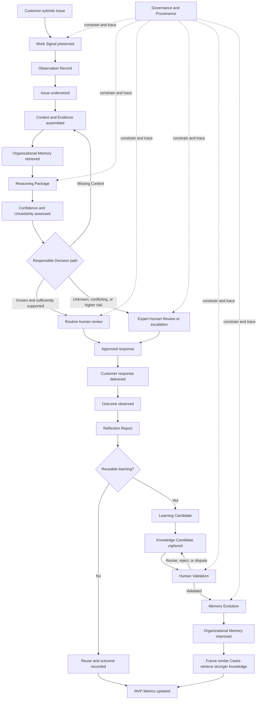
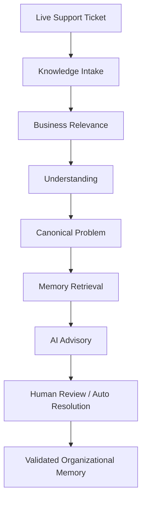

# MVP Scope

## Derived From

Canon Version: `v1.0.0`

### Primary Canon Documents

- [Founder's Thesis](../canon/00_FOUNDERS_THESIS.md)
- [Product Vision](../canon/01_PRODUCT_VISION.md)
- [Product Principles](../canon/02_PRODUCT_PRINCIPLES.md)
- [Capability Model](../canon/03_PRODUCT_CAPABILITY_MODEL.md)
- [Domain Model](../canon/04_PRODUCT_DOMAIN_MODEL.md)
- [Workflow Model](../canon/05_PRODUCT_WORKFLOW_MODEL.md)
- [AI Cognitive Model](../canon/06_AI_COGNITIVE_MODEL.md)

### Primary Architecture Documents

- [System Architecture](../architecture/07_SYSTEM_ARCHITECTURE.md)
- [AI Agent Architecture](../architecture/08_AI_AGENT_ARCHITECTURE.md)
- [Data Architecture](../architecture/09_DATA_ARCHITECTURE.md)
- [Knowledge Representation](../architecture/10_KNOWLEDGE_REPRESENTATION_MODEL.md)
- [Integration Architecture](../architecture/11_INTEGRATION_ARCHITECTURE.md)

---

## 1. Introduction

The Minimum Viable Product is the smallest operational realization of the Organizational Intelligence Platform that can test its central hypothesis without abandoning its identity.

MVP means:

- **Minimal:** remove every Domain, workflow, integration, customization, and operational concern not required to test the core hypothesis.
- **Viable:** deliver a complete, trustworthy experience that real support staff can use on real Cases and from which the Organization can learn.
- **Platform:** preserve the enduring concepts, boundaries, learning loop, Governance, and Organizational Memory that later capabilities will extend.

It does not mean “minimal features.” A small collection of disconnected features can be easier to build while failing to demonstrate the platform. An Answer generator, document search experience, or review queue without validated learning would be incomplete even if Users found it briefly useful.

The MVP should minimize engineering complexity by narrowing breadth, not by cutting through the Canon's trust boundaries. It serves one Organization, begins in the Customer Support Domain, focuses on a bounded family of repetitive and knowledge-rich Cases, uses a small set of fixed Roles, limits integrations, and keeps consequential action under human authority.

Within that boundary, it must demonstrate the complete Knowledge Flywheel:

> Every solved organizational problem should permanently increase the Organization's future intelligence when it contains a reusable lesson.

The MVP is not a roadmap, backlog, or forecast. It is the strategic boundary that defines what must exist for Version 1 to be a faithful test and what must remain deferred.

The Canon defines the identity and obligations the MVP must preserve. The architecture documents define logical responsibilities and information boundaries. This MVP narrows operational scope while retaining those meanings.

Logical responsibilities may initially be realized by fewer operational components to reduce complexity. They may not be collapsed conceptually where doing so would permit self-approval, hidden state change, lost Provenance, or authority drift.

---

## 2. MVP Vision

The MVP is intentionally limited in implementation, but not in architectural vision. It is the first production-ready **Knowledge Intake Door** of the Organizational Intelligence Platform, the first operational implementation of the platform itself, and the foundation on which future organizational workflows are built.

The prototype is intentionally focused on Customer Support. The architecture is designed for many organizational Domains. Narrow implementation and broad architecture are both deliberate.

### Three Knowledge Intake Doors

The long-term platform supports three Knowledge Intake Doors through which organizational knowledge enters the same intelligence pipeline:

1. **Manual Knowledge Entry** — experts and contributors record knowledge directly.
2. **Historical / Bulk Knowledge Import** — existing documents and archives are recovered as Knowledge Candidates.
3. **Live Workflow Capture** — knowledge is captured from real work while Context is still fresh.

The current MVP intentionally implements only **Door 3 (Live Workflow Capture)**. This decision is strategic rather than technical. Live customer support provides the richest Context, the fastest learning loop, and the clearest demonstration of Organizational Intelligence. Doors 1 and 2 are deferred because they reuse the same downstream pipeline and therefore are not needed to validate the architecture.

### MVP Scope at a Glance

The following table shows that the MVP intentionally validates the core architecture rather than implementing every capability. `✅` means present; `Planned` and `Limited` describe intentional MVP deferral.

| Area | MVP | Future Platform |
| --- | --- | --- |
| Manual Knowledge Entry | Planned | ✅ |
| Historical Knowledge Import | Planned | ✅ |
| Live Customer Support Workflow | ✅ | ✅ |
| Organization Profile | ✅ | ✅ |
| Business Relevance Guardrail | ✅ | ✅ |
| Canonical Problem Engine | ✅ | ✅ |
| Organizational Memory | ✅ | ✅ |
| Trust Engine | ✅ | ✅ |
| Pattern Discovery | ✅ | ✅ |
| AI Advisory Layer | ✅ | ✅ |
| Enterprise Integrations | Limited | ✅ |
| Multi-tenant Deployment | Planned | ✅ |
| Distributed Storage | Planned | ✅ |
| Cloud AI Providers | Planned | ✅ |

The MVP implements one Knowledge Intake Door extremely well, with the full intelligence pipeline behind it, rather than implementing every door shallowly.

---

## 3. Why Customer Support First?

Customer Support is the ideal first Knowledge Intake Door for reasons that are strategic, not incidental:

- **High volume of recurring organizational knowledge.** The same families of Issues appear repeatedly, so reuse and learning become observable quickly.
- **Clear feedback loops.** A response leads to an outcome that can be observed and reflected upon.
- **Existing support history.** Organizations already hold prior Cases and resolutions that ground retrieval and Canonical Problems.
- **Human validation already exists.** Support teams already review and correct answers, so the Validation boundary fits existing behavior.
- **Easy to measure organizational learning.** Repeated-work reduction, reuse, and gap closure are naturally measurable in support work.
- **Strong demonstration value.** The loop is concrete and convincing for judges and customers.

Customer Support is the beachhead, not the product. It is the first Domain that proves the platform, chosen because it makes Organizational Intelligence visible fastest—not because the platform is a support tool.

---

## 4. Architectural Completeness

Although the implementation scope is intentionally small, the architecture validated by the MVP is already complete. The MVP exercises the full Organizational Intelligence pipeline:

- **Knowledge Intake** — governed capture of organizational work as Knowledge Candidates.
- **Organization Profile** — organization-specific vocabulary, Domains, relevance, and Governance.
- **Business Relevance** — a guardrail that separates organizational knowledge from noise.
- **Canonical Problem Engine** — organizes validated knowledge into durable organizational understanding.
- **Organizational Memory** — connected, validated, governed knowledge available for reuse.
- **Trust Engine** — trust that evolves through Validation, reuse, and outcomes.
- **Pattern Discovery** — detection of Emerging Patterns from repeated work.
- **AI Advisory Layer** — AI assistance that remains advisory until accepted.
- **Organizational Learning** — selective learning from outcomes and Corrections.
- **Memory Evolution** — authorized change to memory with history intact.

The MVP validates the architecture, not just a workflow. Building one Knowledge Intake Door end to end exercises every component the future platform depends on, so later doors and Domains extend a proven architecture rather than introducing a new one.

---

## 5. MVP Principles

### Preserve Philosophy over Feature Count

When scope pressure creates a choice, preserve memory, human expertise, visible Uncertainty, Provenance, Validation, and learning before adding another surface or case type. A smaller Canon-faithful product is more viable than a broader chatbot.

### Build One Complete Learning Loop

The MVP must connect Work Signal, Case, Context, Evidence, Reasoning, Confidence, Decision, Human Review, response, outcome, reflection, learning, Knowledge Capture, Validation, and Memory Evolution. No stage may exist only as a diagram.

### Prefer Depth over Breadth

Support one bounded family of recurring Customer Support Issues well enough to observe reuse and improvement. Do not attempt broad Domain coverage or every support intent.

### Human Collaboration Is Mandatory

Humans provide Context, exercise authority, correct cognition, review uncertain Cases, validate knowledge, and explain exceptions. The MVP does not treat their involvement as failure or temporary scaffolding.

### Learning Is Mandatory

A resolved meaningful Case must be assessed for reusable learning. The system must distinguish routine reuse from a new lesson and preserve an explicit no-learning outcome when nothing should change.

### Governance Cannot Be Skipped

The MVP uses a small, fixed Governance model rather than enterprise-wide flexibility. It still enforces Organization boundary, User identity, Role, authority, permitted knowledge use, review requirements, and traceable approval.

### Memory Must Evolve

Validated learning must be able to create, challenge, update, deprecate, or replace Knowledge Items while preserving prior history. A static repository is not sufficient.

### Every Decision Must Remain Explainable

Users and reviewers must see the relevant Context, Evidence, recalled knowledge, Reasoning Summary, Confidence basis, material Uncertainty, and authority behind a proposed response.

### Every Knowledge Change Must Remain Validated

Learning, Capture, and repetition may propose knowledge. Only an authorized Validation Record may change active Organizational Memory.

### Trust Before Automation

The MVP does not require autonomous customer-facing action. It uses Confidence to change routing, review depth, and escalation while retaining final human approval for outbound responses.

### Measure Capability, Not Activity

The MVP should show whether validated knowledge is reused, repeated work declines, Corrections recur less often, gaps become visible, and future Reasoning improves. Ticket and response counts are supporting context, not success by themselves.

### Preserve Replaceable Boundaries

The MVP may combine implementation responsibilities, but its information objects and authority boundaries should allow later separation. No component should become the permanent owner of several incompatible responsibilities merely because the first version is small.

### MVP Strategic Principles

In addition to the principles above, the MVP follows these strategic principles for building the first Knowledge Intake Door:

1. Build one Knowledge Intake Door extremely well before adding others.
2. Validate architecture before expanding features.
3. Preserve Governance over automation.
4. AI enhances intelligence but does not replace organizational decision-making.
5. Every future capability should reuse the same Organizational Intelligence pipeline.
6. The MVP should prove organizational learning rather than feature completeness.

---

## 6. MVP Success Criteria

The MVP succeeds when it demonstrates the following behaviors with real or operationally representative support work.

| Success criterion | Required demonstration | Evidence of success |
| --- | --- | --- |
| **Complete Case lifecycle** | A customer Issue moves from Work Signal through Context, Reasoning, Decision, Human Review, response, outcome, reflection, and closure. | Traceable artifacts and Events exist for every material transition; Case and Issue remain distinct. |
| **Organizational Memory evolution** | A meaningful resolved Case produces a Knowledge Candidate that is validated and applied as a Memory Change. | Prior and new memory state, Validation, authority, lifecycle, and Provenance are inspectable. |
| **Knowledge reuse** | A later Case retrieves and applies a validated Knowledge Item created or improved by earlier work. | The later Reasoning Package cites the item, tests Applicability, and avoids repeating the earlier investigation. |
| **Human Review** | A human can inspect, correct, approve, reject, narrow, or escalate a proposed response or knowledge change. | Review records preserve User, Role, rationale, Evidence, and effect on workflow or learning. |
| **Confidence-based escalation** | Confidence and Uncertainty change routing and required review. | A known supported Case takes the routine review path; an unknown, conflicting, or high-risk Case reaches an expert or pauses. |
| **Explainable Reasoning** | A reviewer can understand why a recommendation was made and what could make it wrong. | Context, Evidence, applicable memory, assumptions, alternatives, Confidence, and limits are visible. |
| **Knowledge Validation** | Proposed knowledge remains separate from active memory until authorized review. | Unvalidated candidates cannot guide routine work as trusted Knowledge Items. |
| **Organizational learning** | A Correction, novel Resolution, or repeated pattern changes future organizational capability. | Reflection and Learning Candidates lead to validated knowledge, a challenge, or a Knowledge Gap. |
| **Reduction of repeated work** | Similar later Cases require less investigation or fewer expert interruptions without lowering quality. | Case comparisons show trusted reuse, shorter investigation paths, and stable or improved outcomes. |
| **Knowledge Gap visibility** | Repeated low Confidence, escalation, or failed knowledge use becomes an explicit gap. | Gap record includes affected Issue, Evidence, consequence, owner, and closure criteria. |
| **Governed operation** | Restricted knowledge, authority, and approval boundaries are enforced throughout the workflow. | No response or memory change can bypass the fixed MVP Roles and required review. |
| **Outcome-aware learning** | The system evaluates what happened after the response rather than treating delivery as success. | Outcome and Reflection records distinguish response sent, Issue resolved, Correction, recurrence, and unknown result. |

### Minimum Proof Scenarios

The evaluation must include at least four end-to-end scenarios:

1. **Known Case:** validated knowledge applies; the system retrieves it, explains applicability, and completes routine human approval without creating unnecessary new knowledge.
2. **Unknown Case:** no trusted answer exists; the system exposes Uncertainty, escalates to an expert, captures the reusable lesson, validates it, and improves memory.
3. **Human Correction:** a proposed response is corrected; reflection identifies the failed assumption; applicable knowledge is created or updated through Validation.
4. **Knowledge Evolution:** new Evidence challenges active guidance; the item becomes challenged, disputed, narrowed, deprecated, or replaced with history intact.

The MVP does not need to solve every customer support problem. It must solve and learn from a narrow class deeply enough to demonstrate that the next similar Case begins from a stronger place.

### Architectural Success Behaviors

Beyond the Case-level criteria above, the MVP is successful if it demonstrates that the Organizational Intelligence architecture works end to end:

- Organizational knowledge is captured during live work.
- Knowledge becomes reusable after Validation.
- Canonical Problems evolve over time.
- Organizational Memory improves through reuse.
- Pattern Discovery identifies emerging issues.
- AI assists but never governs.
- Organization Profile changes platform behavior without code changes.
- The architecture clearly supports future Knowledge Intake Doors.

---

## 7. Core Workflow

The core workflow is the heart of the MVP. Every in-scope capability exists to make this loop operational.

### MVP Workflow Boundaries

- One Case may contain more than one Issue, but the pilot should select Cases with one primary in-scope Issue where possible.
- External customer responses require human approval. Confidence determines the type of review and escalation, not permission to bypass review.
- The system may draft, ask for Context, recommend, or refuse. It does not autonomously execute refunds, account changes, policy exceptions, or other consequential operations.
- A resolved Case does not automatically create knowledge. Reflection makes the distinction.
- A Knowledge Candidate is never treated as active Organizational Memory before Validation.
- The first successful loop must be followed by a later reuse scenario; creating knowledge without demonstrating future benefit is insufficient.

### Implemented Intake Pipeline

The workflow above is the complete cognitive loop. Expressed in terms of the platform's intake architecture, the implemented MVP pipeline is:

Live Workflow Capture (Door 3) is the only intake door implemented in the MVP, but the stages after Knowledge Intake—Business Relevance, Understanding, Canonical Problem, Memory Retrieval, AI Advisory, Human Review, and Validated Organizational Memory—are shared. Future intake doors (Manual Knowledge Entry and Historical Import) reuse exactly the same downstream pipeline; they change only where knowledge enters, not how it becomes trusted memory. Human Review remains the default; Auto Resolution applies only where the Trust Engine has established sufficient validated trust under Governance, preserving Trust Before Automation.

---

## 8. In Scope

### Work Intake

**Minimum capability:** Receive customer inquiries through the three supported communication entry points, preserve original Source and time, identify the Organization and channel, and create or associate a Work Signal.

**Boundary:** Intake does not interpret truth or create knowledge. Unsupported attachments, channels, and rich communication behaviors may be deferred.

**Why required:** The Knowledge Flywheel must begin with real organizational work and intact Provenance.

### Case and Issue Management

**Minimum capability:** Create a Case, identify one or more Issues, associate participants and Work Signals, represent active, waiting, escalated, resolved, reopened, and closed states, and preserve outcome and history.

**Boundary:** The MVP is not a general ticketing replacement. It manages only the state required by its learning workflow.

**Why required:** Learning must remain connected to the bounded work that created it.

### Context and Evidence Assembly

**Minimum capability:** Collect relevant customer, product, policy, account, prior-attempt, risk, and time Context available through in-scope inputs; preserve Sources; distinguish Evidence from assertion; identify missing information.

**Boundary:** Context enrichment remains limited to information needed for selected support Issues. The system may ask Humans for missing Context rather than automate broad enrichment.

**Why required:** Similar wording does not imply identical applicability.

### Organizational Memory Retrieval

**Minimum capability:** Retrieve relevant active Knowledge Items, related cases, Sources, exceptions, contradictions, and lifecycle state using the Issue and Context; make absence and stale or disputed status visible.

**Boundary:** Retrieval supports a bounded knowledge collection for the pilot Domain. It does not need to search every organizational repository.

**Why required:** Future Cases must benefit from earlier validated learning.

### Reasoning

**Minimum capability:** Produce an inspectable Diagnosis or problem interpretation, alternatives, recommended response, assumptions, supporting and conflicting Evidence, applicable knowledge, exceptions, and unresolved questions.

**Boundary:** Reasoning focuses on selected support Issues and proposes rather than executes. It may conclude that no responsible answer is available.

**Why required:** The platform must determine what should be said or done, not merely retrieve similar text.

### Confidence and Uncertainty Assessment

**Minimum capability:** Assess Evidence quality, knowledge freshness, applicability, conflict, missing Context, authority, and consequence; identify material Uncertainty; recommend routine review, expert review, follow-up, pause, or refusal.

**Boundary:** A transparent multidimensional assessment is sufficient. The MVP does not require a universal or statistically calibrated score.

**Why required:** Confidence must change behavior and protect trust.

### Decision and Human Review

**Minimum capability:** Select the next behavior—draft, ask follow-up, route for routine approval, escalate to expert, pause, or refuse—and allow an identified human with a fixed Role to approve, reject, correct, or escalate.

**Boundary:** Every customer-facing response is human-approved. The MVP supports a small Role set: Support Agent, Expert Reviewer, Knowledge Validator, and Governance Administrator; one User may hold several Roles where separation is not required.

**Why required:** Human expertise and authority remain central while Confidence routing is still tested.

### Response and Action

**Minimum capability:** Produce an explainable response draft containing the relevant answer, basis, material limits, and Source references appropriate for the reviewer; deliver it after approval; record execution and failure.

**Boundary:** Communication is the only outbound action. No autonomous business operation or policy exception is executed.

**Why required:** The immediate Case must reach a useful outcome before learning can be evaluated.

### Outcome Observation and Reflection

**Minimum capability:** Record whether the response was approved, corrected, delivered, accepted, followed up, failed, or resolved; compare outcome with Reasoning and Confidence; produce a Reflection Report.

**Boundary:** Outcome may be manually confirmed when no external signal is available. The MVP need not infer every downstream impact.

**Why required:** Outputs do not prove success; learning begins by examining outcomes.

### Learning and Knowledge Capture

**Minimum capability:** Determine whether a Case created a reusable lesson, challenge, or gap; produce an explicit no-learning result when appropriate; transform reusable learning into a Knowledge Candidate with claim, Context, Evidence, Applicability, limits, Reasoning Summary, and Provenance.

**Boundary:** The MVP supports learning from resolved Cases, human Corrections, repeated Issues, and policy updates within the pilot scope.

**Why required:** Closing Cases without preserving lessons would reproduce organizational forgetting.

### Knowledge Validation

**Minimum capability:** Present a Knowledge Candidate and its Evidence to an authorized validator; allow validate, narrow, request revision, reject, dispute, deprecate, or replace; preserve rationale, Role, scope, and history.

**Boundary:** Human Validation is mandatory in the MVP. Automated support may organize Evidence but cannot grant trust.

**Why required:** Proposed learning must not become organizational truth automatically.

### Organizational Memory and Lifecycle

**Minimum capability:** Preserve validated Knowledge Items with their semantic minimum, relationships, lifecycle, versions, replacement history, and use; apply authorized Memory Changes; expose current and historical states distinctly.

**Boundary:** One Organization, one primary Domain, and a bounded knowledge collection. The memory model still includes Organization and Domain scope so expansion does not require conceptual redesign.

**Why required:** The platform hypothesis depends on durable, evolving, reusable memory rather than stored conversations.

### Knowledge Gap Detection

**Minimum capability:** Allow repeated low Confidence, escalations, Corrections, failed knowledge use, and unanswered Issues to create an evidence-backed Knowledge Gap with owner and closure criteria.

**Boundary:** Pattern detection may be simple and human-confirmed. It need not discover every latent organizational gap.

**Why required:** Support should become an organizational learning sensor, not only a queue.

### Governance, Audit, and Provenance

**Minimum capability:** Enforce one Organization boundary, fixed Roles, knowledge status, review authority, sensitive-source restrictions needed by the pilot, and a traceable history from Work Signal through response and Memory Change.

**Boundary:** No configurable enterprise policy language, complex hierarchy, or fine-grained permission administration is required.

**Why required:** Governance and Provenance cannot be postponed without changing the identity of the platform.

### Metrics

**Minimum capability:** Record the workflow, knowledge, review, Confidence, gap, reuse, and outcome measures defined in Section 14 with clear scope and definitions.

**Boundary:** Operational summaries and comparisons are sufficient; advanced exploration, forecasting, and executive analytics are deferred.

**Why required:** The central hypothesis must be measurable rather than demonstrated through anecdotes alone.

---

## 9. Out of Scope

| Deferred scope | Why it is intentionally excluded |
| --- | --- |
| **Voice support** | Introduces transcription, call handling, speaker Context, and real-time interaction concerns that do not add evidence to the first text-based learning loop. |
| **Phone calls** | Adds a separate operational channel and quality boundary; human call summaries may enter as Sources during the pilot if governed. |
| **Multi-language support** | Expands semantic equivalence, translation Provenance, review, and evaluation before the core loop is proven in one language. |
| **Autonomous execution** | Consequential actions and unreviewed customer responses would add risk without being necessary to validate learning, memory, and Confidence-based routing. |
| **CRM replacement** | The MVP needs limited customer and Case Context, not ownership of the full customer relationship or sales process. |
| **ERP replacement** | Operational and financial systems remain external Sources; rebuilding them does not test Organizational Intelligence. |
| **Complex analytics** | The first evaluation needs defined learning and knowledge measures, not general analytics exploration. |
| **Billing** | Commercial charging, invoicing, and entitlement operations do not validate the Knowledge Flywheel. |
| **Authentication platform** | Users must be identifiable and accountable, but building general identity capability is outside the learning hypothesis. |
| **Enterprise permissions** | The MVP requires fixed Roles and Governance boundaries, not configurable organization-wide permission hierarchies. |
| **Multi-tenant deployment** | A single-Organization pilot reduces isolation and administration complexity while the logical model retains Organization scope. |
| **Advanced scheduling** | Basic review assignment and waiting state are sufficient; workforce and calendar optimization do not test the core hypothesis. |
| **Marketplace** | Third-party distribution and extension governance are irrelevant before the platform itself is validated. |
| **Workflow designer** | One opinionated learning workflow should be proven before Users can configure arbitrary workflows. |
| **Fine-grained customization** | Extensive per-team behavior would increase evaluation variance and weaken the first controlled test. |
| **Custom AI training** | The MVP tests the organizational learning system, not bespoke model development. Human Corrections improve memory and workflow rather than altering an AI model. |
| **Predictive analytics** | Forecasting future workload or outcomes is not required to show that validated knowledge improves later Cases. |
| **Autonomous policy generation** | Policies carry organizational authority and must remain human-defined and governed; the MVP may identify policy gaps, not invent policy. |

Out of scope does not mean conceptually forbidden forever. It means the capability is unnecessary to prove Version 1 and would increase complexity, risk, or evaluation ambiguity.

### Not Included Yet

The following capabilities are intentionally excluded from the MVP implementation:

- Manual Knowledge Entry UI.
- Historical Bulk Import.
- Enterprise Authentication.
- Production Database.
- Multi-organization SaaS deployment.
- Role-based administration.
- Cloud-native AI providers.
- Enterprise connector library.
- Production analytics.
- Enterprise security features.

These are deferred because they do not change the core Organizational Intelligence architecture being validated. Each can be added later as an extension of the same pipeline rather than a redesign of it.

---

## 10. MVP Cognitive Scope

The MVP implements all logical cognitive responsibilities required by the complete loop. Several may share an operational component or human workflow initially, but their inputs, outputs, authority, and audit history remain distinct.

| Logical agent responsibility | MVP requirement | May initially share implementation with | Boundary that must remain distinct |
| --- | --- | --- | --- |
| **Interaction Agent** | Capture Work Signals and present questions, drafts, Uncertainty, review state, and outcomes. | Action and Work Intake experience. | Cannot reason or decide substantive content. |
| **Observation Agent** | Preserve original input and produce Observation Records. | Understanding and Context component. | Observation remains distinct from interpretation. |
| **Understanding Agent** | Identify Issue, ambiguity, consequence, and missing information. | Context Builder. | Cannot make final Diagnosis or Decision. |
| **Context Builder Agent** | Assemble permitted Context, Evidence, Sources, and gaps. | Understanding and Evidence responsibilities. | Cannot reason to an Answer. |
| **Memory Retrieval Agent** | Recall relevant Knowledge Items, similar Cases, exceptions, conflict, and lifecycle state. | Reasoning component. | Retrieval cannot decide applicability or truth. |
| **Reasoning Agent** | Produce Diagnosis, alternatives, recommendation, assumptions, and Evidence basis. | Confidence component operationally. | Cannot communicate directly, validate, or change memory. |
| **Confidence Agent** | Assess reliance and route routine review, expert review, follow-up, pause, or refusal. | Reasoning and Decision component. | Cannot create authority, Evidence, or Validation. |
| **Decision Agent** | Select next behavior from the assessed cognitive artifacts. | Orchestration. | Cannot invent Reasoning or override Governance. |
| **Action Agent** | Draft and deliver approved communication and record execution. | Interaction component. | Cannot change Decision meaning or add unsupported claims. |
| **Reflection Agent** | Compare cognition with outcome and identify possible learning. | Learning component. | Cannot update memory. |
| **Learning Agent** | Decide whether a reusable lesson, challenge, gap, or no-learning result exists. | Reflection and Gap Detection component. | Cannot validate its own lesson. |
| **Knowledge Capture Agent** | Create complete Knowledge Candidates with semantic minimum and Provenance. | Learning workflow. | Cannot approve the candidate. |
| **Validation Agent** | Coordinate human Validation and produce Validation Records. | Reviewer experience. | Must remain authority-separate from Capture and Memory Evolution. |
| **Memory Evolution Agent** | Apply authorized lifecycle and knowledge changes with history intact. | Knowledge administration component. | Cannot invent content or bypass Validation. |
| **Knowledge Gap Detection Agent** | Create and maintain gaps from repeated insufficiency. | Learning and Metrics component. | Cannot declare the answer to a gap or close it without Evidence. |
| **Metrics Agent** | Produce scoped measures of work, Confidence, learning, reuse, and knowledge health. | Operational reporting component. | Cannot validate truth or directly optimize cognitive behavior. |
| **Governance Agent** | Enforce fixed Organization, Role, review, source, and action boundaries throughout the loop. | Shared policy responsibility. | Cannot reason, answer, or validate subject matter. |

### Permitted Consolidation

The MVP may use fewer operational components than logical agents. Consolidation is acceptable when:

- Cognitive artifacts remain distinct and inspectable.
- The producer of a Knowledge Candidate cannot approve it.
- Reasoning cannot write Organizational Memory.
- Governance decisions remain explicit.
- Human Review retains independence and sufficient Context.
- Changes can later be separated without redefining information meaning.

Consolidation is not acceptable when it creates self-validation, hidden shared mutable state, lost Provenance, or one component that silently owns observation through memory.

---

## 11. MVP Information Scope

| Information object | Why it is essential in the MVP |
| --- | --- |
| **Organization** | Establishes ownership of memory, Cases, Roles, Governance, and Metrics even in a single-Organization pilot. |
| **User and Role** | Make human contribution, review authority, Validation, and accountability explicit. |
| **Case** | Preserves the bounded unit and history of work. |
| **Issue** | Separates the actual problem from its communication container. |
| **Work Signal** | Preserves original customer or policy input with Source identity. |
| **Observation Record** | Separates what was observed from later interpretation. |
| **Source** | Preserves origin, author, authority, time, and transformation history. |
| **Evidence** | Connects information to the claim it supports or challenges. |
| **Context Package** | Establishes conditions, missing information, Evidence, risk, and Governance needed for Reasoning. |
| **Reasoning Package** | Makes Diagnosis, recommendation, assumptions, alternatives, Evidence, and memory use explainable. |
| **Confidence Assessment** | Makes Uncertainty behavioral and supports review routing. |
| **Decision Proposal** | Separates cognitive recommendation from authorized next action. |
| **Human Review Record** | Preserves accountable approval, rejection, Correction, escalation, rationale, and Role. |
| **Action Package** | Distinguishes an approved response from Reasoning and records what was delivered. |
| **Outcome Record** | Allows the MVP to determine whether the Issue was resolved, corrected, or still unknown. |
| **Reflection Report** | Connects outcome to cognitive quality and possible learning. |
| **Learning Candidate** | Represents potential organizational improvement without granting trust. |
| **Knowledge Candidate** | Preserves the proposed reusable claim, scope, Evidence, limits, and Provenance for Validation. |
| **Validation Record** | Establishes why knowledge earned, lost, or changed trust. |
| **Knowledge Item** | Represents reusable validated organizational understanding. |
| **Memory Change Record** | Preserves authorized before-and-after memory evolution. |
| **Organizational Memory** | Connects current and historical Knowledge Items for future Reasoning. |
| **Knowledge Gap** | Makes repeated organizational insufficiency explicit and actionable. |
| **Governance Decision** | Records permitted use, required review, authority, restriction, and rationale. |
| **Event** | Preserves meaningful transitions and supports workflow, audit, learning, and Metrics. |
| **Metric** | Represents scoped evidence that the Organization is becoming more capable. |

### Information Simplification Rules

- Logical objects may share one operational representation, but their identities and meanings remain distinct.
- Only attributes required by the pilot workflow and integrity rules need to be exposed to Users.
- Historical state must be preserved for knowledge, Validation, review, Decision, and memory changes.
- Relationships may begin with a limited controlled set, but Evidence-to-Source, candidate-to-Validation, item-to-memory, replacement, contradiction, and derivation are mandatory.
- No information object may be dropped if its absence collapses a Canon distinction.

---

## 12. MVP Integrations

Integrations are intentionally minimal and category-based. Each contributes information or participation; none becomes organizational truth directly.

| Integration | MVP role | Why it is sufficient | Boundary |
| --- | --- | --- | --- |
| **Email** | Receive customer inquiries and send approved responses; preserve thread, participants, time, and message Provenance. | Represents common asynchronous support work and repeated questions without requiring a ticketing replacement. | Email content is a Work Signal and Source, not Knowledge. |
| **Web Form** | Receive structured issue description and selected Context from a customer. | Tests whether better initial Context improves Reasoning and Confidence. | Form categories assist Understanding but do not define the Issue or Decision. |
| **Simple Chat Interface** | Support one text conversation with follow-up questions and approved responses. | Tests interactive Context gathering and transparent Uncertainty in a narrow channel. | No broad real-time automation, voice, multilingual behavior, or channel customization. |
| **Internal Knowledge Repository** | Import a bounded set of current documents, policies, and existing guidance as Sources and possible Evidence. | Provides a baseline from which structured Knowledge Candidates and Items can be established. | Repository documents are not active Organizational Memory until captured and validated. |
| **Human Reviewer Interface** | Present Context, Evidence, Reasoning, Confidence, candidate knowledge, and required actions to Support Agents, Experts, Validators, and Governance Users. | Enables human authority, Corrections, escalation, and Validation across the full loop. | Reviewer Role and scope remain explicit; interface access alone does not grant authority. |

### Integration Boundary

No customer relationship platform, enterprise resource system, broad identity system, or general communication hub is required. Where pilot Context is unavailable through the five integrations, a human may supply it with Provenance. This keeps the test focused on learning rather than integration breadth.

---

## 13. MVP Knowledge Model

The MVP implements the semantic minimum needed to create trustworthy reusable knowledge without building an advanced ontology.

### Required Knowledge Item Components

| Component | MVP requirement |
| --- | --- |
| **Claim** | One clear fact, rule, procedure, exception, Diagnosis pattern, Decision pattern, or reusable lesson. |
| **Problem Addressed** | The Issue or recurring need the item helps resolve. |
| **Context and Applicability** | Organization, Domain, supported case conditions, effective period, preconditions, and known exclusions. |
| **Evidence and Sources** | Explicit support and material conflict linked to identifiable Sources and Cases. |
| **Reasoning Summary** | Why the claim follows, which assumptions matter, and which alternatives or exceptions were considered. |
| **Validation** | Validator, Role, result, scope, rationale, Evidence, and effective time. |
| **Authority and Governance** | Who may validate, use, review, disclose, challenge, or change the item within the fixed MVP Roles. |
| **Provenance** | Originating Case, Work Signals, human contributions, Learning Candidate, Knowledge Candidate, Validation, and change history. |
| **Relationships** | Minimum typed relations: `supports`, `contradicts`, `depends_on`, `exception_to`, `derived_from`, `replaces`, and constrained `related_to`. |
| **Lifecycle** | Proposed, validated, active, challenged, disputed, stale, deprecated, and replaced, with prior state retained. |
| **Usage History** | Cases and Reasoning Packages that used the item, associated outcomes, Corrections, and Confidence. |

### Minimum Knowledge Behaviors

- Create a Knowledge Candidate from a novel Resolution or Correction.
- Validate, narrow, reject, dispute, deprecate, or replace knowledge through Human Review.
- Retrieve active applicable items and expose challenged, disputed, stale, or replaced status.
- Preserve contradiction rather than merge it into one fluent statement.
- Link exceptions to the general guidance they constrain.
- Show which Source, Case, and validator support an item.
- Record a later Case's use and outcome without treating frequency as truth.

### Deliberate Simplification

The MVP does not need a comprehensive organizational ontology, automatic semantic composition, broad cross-Domain relationships, sophisticated generalization, or fully automated relationship discovery. It needs enough structure to prove that a reusable lesson can be understood, validated, applied, challenged, and evolved.

---

## 14. MVP Metrics

Metrics validate the Founder's Thesis by connecting work, memory change, and future outcomes. Target thresholds should be set for the pilot population before evaluation; this document defines what must be measured, not arbitrary universal targets.

| Metric | Definition | What it tests |
| --- | --- | --- |
| **First-response quality** | Human assessment of correctness, relevance, Context use, explainability, and appropriate Uncertainty in the first approved response. | Whether memory and Reasoning improve customer-facing work without hiding risk. |
| **Knowledge reuse rate** | Share of eligible resolved Cases whose Reasoning used at least one applicable validated Knowledge Item. | Whether Organizational Memory is usable in daily work. |
| **Successful reuse rate** | Share of reused Knowledge Item applications that led to an accepted, uncorrected, appropriately resolved outcome. | Whether reuse is trustworthy, not merely frequent. |
| **Escalation rate** | Share of Cases routed from routine review to expert or Governance review, grouped by reason and Confidence. | Whether the system recognizes its limits and whether memory coverage improves. |
| **Human review frequency** | Number and type of routine, expert, Validation, and Governance reviews per eligible Case. | Whether human attention is focused where authority and expertise matter. |
| **Correction rate** | Share of proposed responses or Reasoning Packages materially corrected by Humans, categorized by cause. | Whether cognition improves and what it repeatedly misunderstands. |
| **Repeated issue reduction** | Change in investigation effort, expert interruption, or repeated diagnostic steps for similar Issues over time. | The central hypothesis that solved problems make future work easier. |
| **Knowledge growth** | Validated Knowledge Items created or materially improved, separated from raw candidates and content volume. | Whether meaningful work becomes trusted memory rather than noise. |
| **Validation throughput** | Knowledge Candidates reviewed and resolved, with time in review, result, and revision count. | Whether the learning loop can convert candidates into trustworthy outcomes. |
| **Reflection completion** | Share of eligible resolved Cases with an Outcome Record and completed Reflection Report. | Whether the platform observes outcomes before claiming learning. |
| **Learning conversion rate** | Share of Learning Candidates becoming validated Knowledge Items, item changes, Knowledge Gaps, or explicit no-learning determinations. | Whether learning is selective and operational rather than indiscriminate capture. |
| **Knowledge Gap discovery** | Confirmed gaps detected, grouped by Evidence, impact, cause, and owner. | Whether support work reveals where the Organization needs to learn. |
| **Knowledge Gap closure** | Gaps meeting their defined closure criteria through demonstrated future work. | Whether the Organization fixes insufficiency instead of only documenting it. |
| **Confidence behavior quality** | Agreement between Confidence-based routing and later Human Review or outcomes, examined by uncertainty type. | Whether Confidence changes behavior appropriately. |
| **Knowledge freshness** | Active items reviewed or supported within their expected change interval and items flagged by change Evidence. | Whether memory remains alive rather than silently decaying. |
| **Answer consistency** | Similar applicable Cases receiving materially aligned approved guidance, with justified exceptions separated. | Whether shared memory reduces unofficial competing truths. |
| **Expert dependency** | Repeated reliance on a specific expert for Issues that should have reusable knowledge, while preserving their contribution. | Whether expertise becomes organizational memory rather than remaining trapped. |

### Metric Interpretation Rules

- No metric is sufficient alone.
- Lower escalation is good only when quality, Confidence, and outcomes remain trustworthy.
- Higher reuse is good only for applicable, active, successful knowledge.
- Higher knowledge growth is not good if Validation weakens or duplication grows.
- Human Review is not waste; declining routine review with stable quality and increasing attention to novel Cases is a stronger signal.
- Metrics should be compared across similar Issue groups and Context, not aggregated into one intelligence score.

---

## 15. MVP Risks

| Risk | How it threatens the hypothesis | MVP mitigation |
| --- | --- | --- |
| **Reasoning quality is weak** | Poor Diagnoses and recommendations create review burden and distrust before learning can be evaluated. | Narrow Issue scope; require inspectable Evidence and assumptions; keep human approval; measure material Corrections by cause. |
| **Knowledge quality is weak** | Reused lessons repeat errors or remain too vague to apply. | Enforce semantic minimum, applicability, Evidence, Validation, lifecycle, and successful-reuse measurement. |
| **Validation is superficial** | Candidates become approved content without genuine authority or challenge. | Fixed Validator Role; complete candidate and Evidence view; explicit rationale; ability to reject and revise; audit separation from Capture. |
| **Confidence is inflated** | Unknown or conflicting Cases take a routine path and produce unsafe drafts. | Assess multiple dimensions; require expert routing for material uncertainty; compare Confidence with Corrections and outcomes. |
| **Context is insufficient** | Similar Cases are falsely treated as identical and knowledge is misapplied. | Structured Context minimum; targeted follow-up questions; missing Context visible; human supplementation with Provenance. |
| **Knowledge reuse is low** | Memory exists but does not improve work, leaving the hypothesis untested. | Choose repetitive pilot Issues; connect Case workflow to retrieval; inspect why eligible items were not used; improve granularity and applicability. |
| **Human resistance** | Experts may see review and Capture as extra work or distrust opaque recommendations. | Keep review inside daily workflow; show Evidence and Reasoning; capture rationale once; demonstrate reduced repeated interruption. |
| **Governance overhead dominates** | Review becomes too slow or broad for a small pilot. | Use one Organization and fixed Roles; limit sensitivity and action scope; retain essential authority and Provenance without enterprise configurability. |
| **Learning quality is poor** | Every Case creates noisy candidates or meaningful lessons are missed. | Selective Reflection; explicit no-learning result; human confirmation of durability; track conversion and duplicate candidates. |
| **Outcomes are unavailable** | The system cannot distinguish sent responses from successful Resolutions. | Use reviewer and agent confirmation for the pilot; record unknown outcomes explicitly; prioritize Cases with observable follow-up. |
| **Pilot Cases are too diverse** | Sparse repetition prevents Knowledge reuse and repeated-work reduction from being observed. | Define a bounded Issue family with sufficient recurrence and stable enough policy to compare Cases. |
| **Pilot Cases are too simple** | The system appears useful through canned answers without demonstrating Reasoning or learning. | Include known, unknown, corrected, and evolving-knowledge scenarios with meaningful Context and exceptions. |
| **Metrics create incentives to hide review** | Teams optimize escalation or speed rather than trust and learning. | Pair operational metrics with quality, successful reuse, Corrections, gap closure, and outcome evidence; avoid isolated targets. |
| **Static repository is mistaken for memory** | Documents are retrieved, but knowledge does not evolve from daily work. | Require Knowledge Candidates, Validation Records, lifecycle change, Memory Change, and later reuse for MVP success. |
| **Implementation consolidation erases boundaries** | One component observes, reasons, approves, and writes memory without accountable transitions. | Preserve distinct artifacts, Roles, authority, and Events even where operational components are combined. |
| **One successful demonstration is overinterpreted** | Anecdote is treated as proof of general platform viability. | Repeat scenarios across the bounded Issue family; use metrics and counterexamples; state the limits of pilot evidence. |

Risk mitigation should preserve the Canon rather than conceal weak capability. If the loop cannot be completed responsibly within the chosen Issue family, scope should narrow further before trust boundaries are removed.

---

## 16. What Makes This MVP Different

| Traditional AI chatbot | Organizational Intelligence MVP |
| --- | --- |
| Answers questions. | Resolves bounded Cases while preserving Context, Evidence, Confidence, authority, and outcome. |
| Treats conversation delivery as completion. | Observes what happened and reflects before learning. |
| Uses documents as retrieved text. | Converts Sources into Evidence and validated semantic Knowledge Items. |
| Produces fluent output when information is weak. | Makes missing, stale, conflicting, or insufficient knowledge change behavior. |
| Treats human escalation as failure. | Uses human expertise and authority as part of the learning system. |
| Applies one answer to similar wording. | Tests Applicability, exceptions, policy period, and material Context. |
| Captures feedback as an edit. | Preserves Corrections as possible Learning Events connected to failed assumptions. |
| Stores transcripts. | Builds connected Organizational Memory with lifecycle and Provenance. |
| Learns implicitly or opaquely. | Changes trusted memory only through explicit Capture, Validation, and Memory Evolution. |
| Optimizes response or deflection rate. | Measures successful reuse, repeated-work reduction, gap closure, and future capability. |
| Conversation ends. | The next similar Case begins from accumulated learning. |
| Intelligence appears to belong to the model. | Intelligence belongs to Humans, memory, Governance, Validation, workflow, cognition, and outcomes working together. |

The MVP may look smaller than a broad chatbot because it handles fewer Issues and integrations. It is deeper because it demonstrates the complete path from work to trusted learning and back to better work.

---

## 17. Future Expansion

After the MVP demonstrates one complete Knowledge Flywheel, later scope may add:

- More Customer Support Issue families and Domain-specific cognition.
- Additional organizational Domains.
- Advanced external integrations and operational actions.
- Multi-Organization operation and enterprise Governance.
- Voice and multilingual interaction.
- Richer knowledge composition and relationship discovery.
- Planning, simulation, and independent challenge agents.
- Advanced analytics and predictive intelligence.
- Broader outcome observation and automated quality evaluation.
- Carefully earned autonomy for low-risk, well-governed work.

Expansion should increase breadth, efficiency, specialization, and scale. It should not change the learning philosophy or remove the trust boundaries proven by the MVP.

### Roadmap Alignment

Each phase extends the same architecture rather than replacing it.

#### Phase 1 (Current MVP)

- Live Customer Support Workflow.
- Local Organizational Memory.
- Local AI Advisory (Gemma).

#### Phase 2

- Manual Knowledge Entry.
- Historical Knowledge Import.

#### Phase 3

- Enterprise Connectors.
- AMD Cloud AI.
- Multi-tenant deployment.

#### Phase 4

- Cross-domain Organizational Intelligence Platform.

Every phase adds Knowledge Intake Doors, scale, or Domains on top of the same Organizational Intelligence pipeline proven by the MVP. No phase changes the learning philosophy or the trust boundaries.

---

## 18. Traceability Matrix

| Canon concept or architectural requirement | MVP realization |
| --- | --- |
| Customer Support as first proving ground | One bounded family of repetitive support Issues for one Organization |
| Work Signal | Email, web form, chat, policy update, Correction, and outcome input |
| Case and Issue | Minimal Case lifecycle with explicit Issue framing and history |
| Context | Context Package with customer, product, policy, time, prior attempt, risk, and missing information |
| Evidence and Source | Imported artifacts and human input retain Source and claim relationships |
| Organizational Memory | Connected validated Knowledge Items with current and historical state |
| Memory Before Automation | Retrieval and applicability checks precede Reasoning and every approved response |
| Human expertise as source of trust | Routine reviewer, expert reviewer, validator, and Governance Roles |
| Visible Uncertainty | Confidence Assessment routes follow-up, routine review, expert escalation, pause, or refusal |
| Provenance is non-negotiable | Trace from Work Signal through Evidence, Reasoning, review, response, learning, Validation, and Memory Change |
| Knowledge has a lifecycle | Proposed, validated, active, challenged, disputed, stale, deprecated, and replaced states |
| Every meaningful interaction can improve the system | Outcome observation, Reflection, selective Learning Candidate, and explicit no-learning result |
| Reduce organizational entropy | Reuse, conflict visibility, gap detection, replacement history, and repeated-work metrics |
| Learning over deflection | All responses human-approved; success measured through learning and future work, not avoided tickets |
| Trust earned over time | Human review, outcomes, successful reuse, Corrections, Validation, and Confidence behavior |
| Organizational Intelligence Metrics | Knowledge reuse, repeated-work reduction, gap closure, freshness, consistency, and expert dependency |
| Build for the human who comes next | Knowledge Items preserve claim, Context, Reasoning Summary, Evidence, Applicability, and limits |
| Knowledge Flywheel | Complete workflow from Work Signal to validated Memory Change and later reuse |
| Standard Known Case workflow | Active Knowledge Item → applicable Reasoning → routine review → response → reuse evidence |
| New Unknown Problem workflow | Explicit Uncertainty → expert review → Resolution → candidate → Validation → memory |
| Human Correction workflow | Correction → Reflection → Learning → knowledge create or update → recurrence measure |
| Knowledge Evolution workflow | Challenge → Validation → dispute, deprecation, narrowing, or replacement with history |
| Knowledge Gap workflow | Repeated insufficiency → gap → owner and criteria → validated repair → observed closure |
| AI Cognitive Cycle | Observation, Understanding, Retrieval, Reasoning, Confidence, Decision, Action, outcome, Reflection, Learning, memory |
| AI is not the intelligence | Logical agents collaborate with Humans, Governance, memory, Validation, workflow, and Metrics |
| Agent boundaries | Distinct cognitive artifacts and no Reasoning-to-memory or Capture-to-Validation shortcut |
| Data integrity | Required logical objects preserve identity, authority, relationships, lifecycle, and history |
| Knowledge Representation | Semantic minimum for claim, scope, Evidence, Reasoning, Validation, Governance, relationships, lifecycle, and usage |
| Integration boundary | Five minimal integrations contribute Sources and participation; none creates trusted memory directly |
| Governance | One Organization, fixed Roles, review requirements, source restrictions, approval, and auditable Decisions |
| Event-oriented learning | Meaningful transitions create Events used by workflow, Metrics, audit, and learning |
| Outcome over output | Outcome Record and Reflection are required before reusable learning is claimed |

Every in-scope capability exists to realize a Canon concept. No feature is included solely because it is conventional in support software.

---

## 19. What This Document Does Not Define

This document intentionally excludes:

- Sprint planning and delivery timelines.
- User stories and acceptance-test implementation.
- Engineering task breakdown.
- Technical implementation.
- APIs and interface contracts.
- Cloud infrastructure and deployment topology.
- Technology stack and vendor selection.
- Programming languages and frameworks.
- Physical data schemas and storage products.
- AI model or prompt design.
- UI mockups and visual design.
- Backlog prioritization.
- Staffing and team structure.
- Commercial packaging and pricing.

Those belong in future implementation planning. They must target Canon Version `v1.0.0`, declare direct derivations, and preserve the MVP boundary and logical responsibilities defined here.

---

## 20. Closing

The MVP is not the first version of a chatbot. It is the first operational realization of the Organizational Intelligence Platform.

Its purpose is not feature completeness. Its purpose is to validate that organizational knowledge can compound through governed learning: a real problem becomes a Case; the platform reasons from current memory; Humans correct and exercise authority; the outcome is observed; reusable learning is captured and validated; memory evolves; and the next similar Case begins from a stronger place.

The MVP remains small by limiting Domain, Organization, Issue breadth, integrations, Roles, customization, analytics, and autonomy. It remains viable by preserving the complete Knowledge Flywheel, explainability, Confidence-based behavior, Human Review, Validation, Governance, Provenance, and measurement.

If the MVP successfully demonstrates one complete Knowledge Flywheel and repeated future benefit within its bounded scope, then the platform's core hypothesis has been proven sufficiently to justify expansion.

Everything beyond the MVP is expansion, optimization, and scale—not a change in philosophy.
