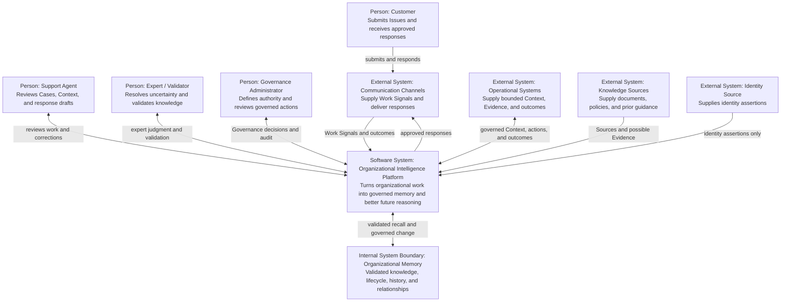
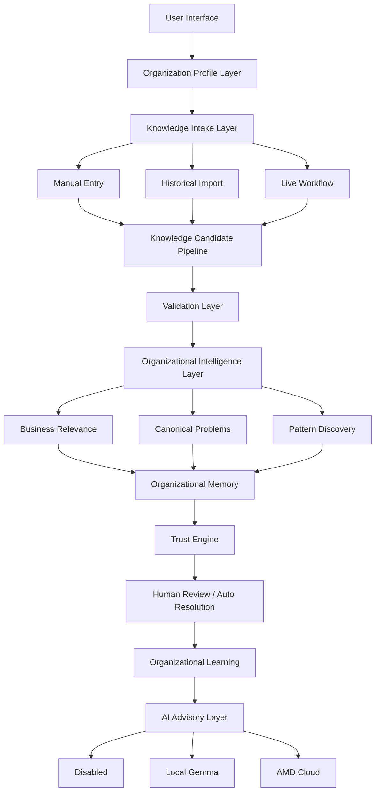
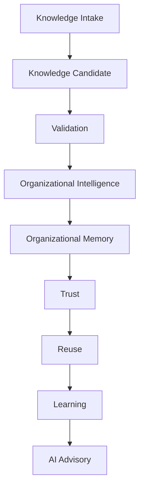
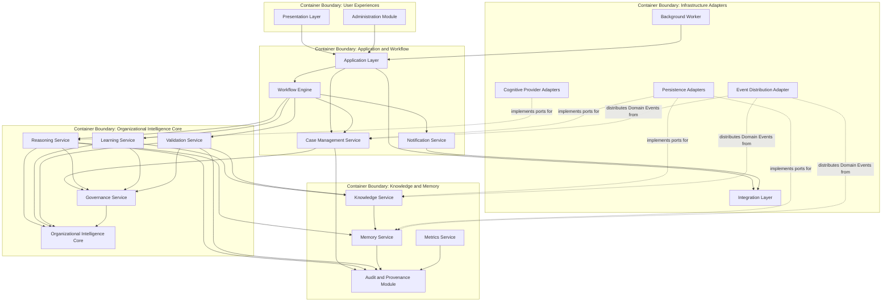
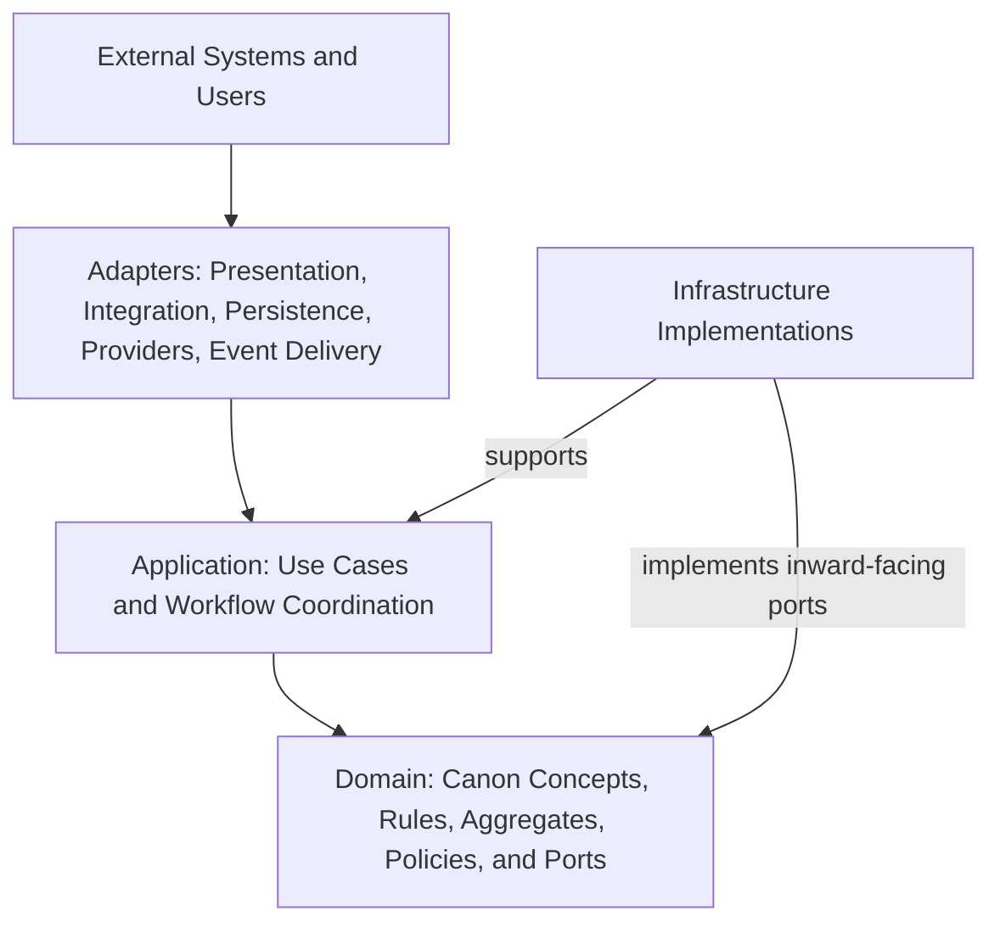
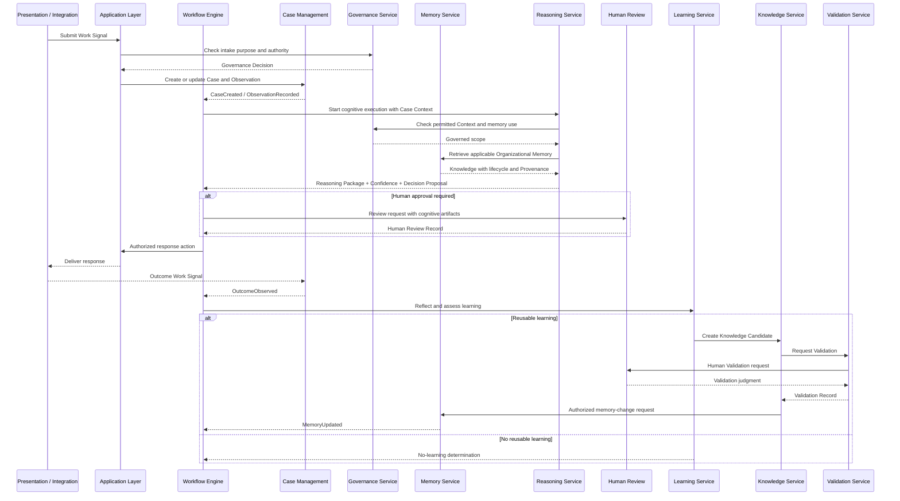
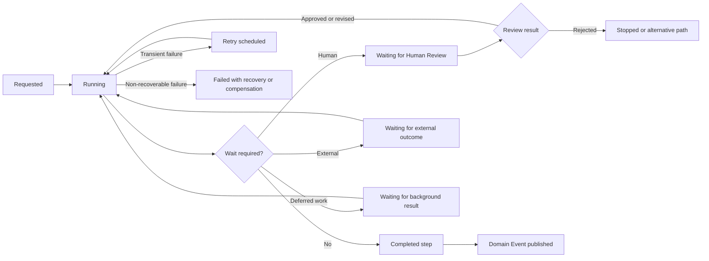
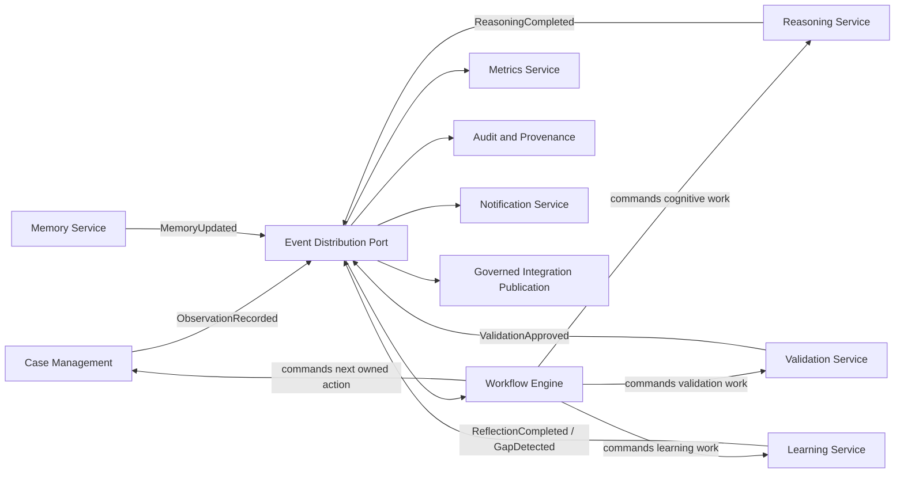
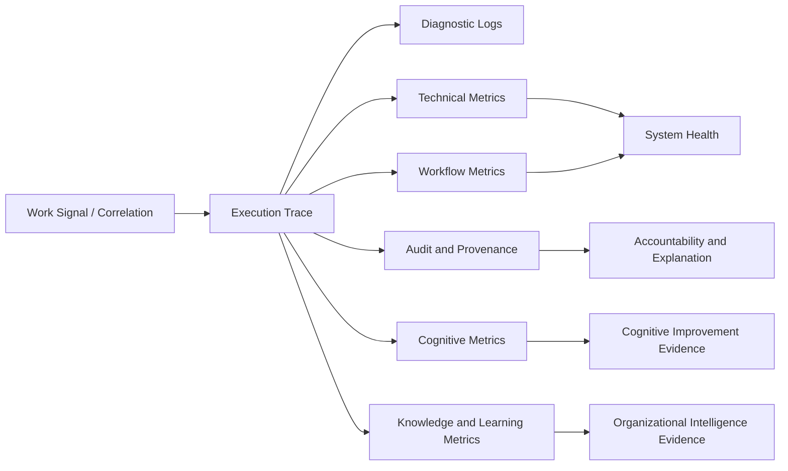

# Implementation Architecture

## Derived From

Canon Version: `v1.0.0`

### Primary Canon Documents

- [Founder's Thesis](../canon/00_FOUNDERS_THESIS.md)
- [Product Vision](../canon/01_PRODUCT_VISION.md)
- [Product Principles](../canon/02_PRODUCT_PRINCIPLES.md)
- [Capability Model](../canon/03_PRODUCT_CAPABILITY_MODEL.md)
- [Domain Model](../canon/04_PRODUCT_DOMAIN_MODEL.md)
- [Workflow Model](../canon/05_PRODUCT_WORKFLOW_MODEL.md)
- [AI Cognitive Model](../canon/06_AI_COGNITIVE_MODEL.md)

### Primary Architecture Documents

- [System Architecture](../architecture/07_SYSTEM_ARCHITECTURE.md)
- [AI Agent Architecture](../architecture/08_AI_AGENT_ARCHITECTURE.md)
- [Data Architecture](../architecture/09_DATA_ARCHITECTURE.md)
- [Knowledge Representation](../architecture/10_KNOWLEDGE_REPRESENTATION_MODEL.md)
- [Integration Architecture](../architecture/11_INTEGRATION_ARCHITECTURE.md)

### Primary Implementation Scope

- [MVP Scope](./12_MVP_SCOPE.md)

---

## 1. Introduction

Implementation Architecture translates logical Architecture into software that can be built, operated, tested, and changed. It defines the software modules, responsibility boundaries, dependencies, collaboration patterns, execution paths, and operational properties needed to realize the Organizational Intelligence Platform.

Logical concepts remain unchanged. Case, Issue, Evidence, Knowledge Candidate, Validation, Knowledge Item, Organizational Memory, Confidence, Governance, and Human Review retain the meanings established by the Canon. Implementation decides where their behavior lives and how software responsibilities collaborate; it does not rename or collapse them for convenience.

This document sits between conceptual Architecture and lower-level engineering specifications. It may discuss services, modules, ports, adapters, event collaboration, background work, persistence responsibilities, external interfaces, and deployment-unit candidates. It intentionally does not select products, vendors, programming languages, frameworks, or a deployment topology.

The architecture is designed for evolutionary realization:

- Version 1 may combine several software modules within one deployment unit.
- Modules retain explicit interfaces and ownership even when deployed together.
- Trust-sensitive responsibilities remain separate in authority and state transition.
- Infrastructure mechanisms remain replaceable behind inward-facing ports.
- Later scale may split deployment units without redefining Domain behavior or information meaning.

Implementation succeeds when software can change rapidly while Canon meaning, Architecture boundaries, Provenance, Governance, and Organizational Memory remain stable.

The same implementation layers serve every organizational workflow. Customer Support is the first implementation of this universal architecture, not its center: future workflows such as HR, Legal, IT, Operations, and Sales reuse the same layers, providers, and trust boundaries rather than introducing parallel implementations.

---

## 2. Relationship to Previous Documents

| Document | Contribution |
| --- | --- |
| Canon | Meaning |
| System Architecture | Responsibilities |
| AI Agent Architecture | Cognitive decomposition |
| Data Architecture | Information model |
| Knowledge Representation | Semantic model |
| Integration Architecture | External boundaries |
| MVP Scope | Version 1 boundary |
| Implementation Architecture | Software realization |

The dependency direction is deliberate:

```text
Canon

↓

Logical Architecture

↓

MVP Scope

↓

Implementation Architecture

↓

Technology and Engineering Decisions
```

Downstream documents may make responsibilities concrete but may not revise upstream meaning. If an implementation choice cannot preserve a Canon distinction or Architecture boundary, the choice must change or the conflict must be raised explicitly under the appropriate governance process.

---

## 3. Architectural Philosophy

### Canon First

Software structure follows Canon meaning. An implementation shortcut is invalid when it turns an Answer into Knowledge, Confidence into authority, retrieval into Reasoning, or an external Source into organizational truth.

### Domain-Centric Design

Core behavior is organized around Domain concepts and rules rather than screens, providers, or storage structures. Case lifecycle, Knowledge Validation, memory evolution, Governance, and cognitive artifacts remain understandable without knowing how infrastructure works.

### Hexagonal Architecture — Ports and Adapters

The Domain and Application core expose **ports** that describe what they need from persistence, cognition, external systems, notifications, identity, and work execution. **Adapters** realize those ports. Infrastructure depends on the core contracts; the core does not depend on infrastructure products.

### Replaceable Infrastructure

AI providers, persistence mechanisms, event distribution, external connectors, communication channels, and execution mechanisms sit behind explicit interfaces. Replacing one should not change Domain objects, workflow meaning, or trust boundaries.

### Event-Driven Collaboration

Modules publish facts about completed Domain transitions so other responsibilities can react without direct ownership coupling. Events support workflow progression, audit, learning, metrics, and integration. Events do not replace commands, queries, Validation, or Organizational Memory.

### Explicit Boundaries

Every module has a reason to change, state it owns, actions it may perform, and actions it must never perform. Hidden shared mutable state and direct cross-module state mutation are prohibited.

### Human-in-the-Loop

Human review, approval, Correction, Validation, and escalation are modeled as durable workflow states. Human waiting time is normal; it is not an exception path or process failure.

### Explainability by Design

Reasoning, Confidence, Decisions, reviews, knowledge changes, and outbound actions retain the artifacts needed to explain their basis. Explainability is built into data and workflow, not reconstructed from logs after a problem.

### Knowledge Before Automation

Automated behavior consumes validated knowledge, governed Context, Reasoning, Confidence, and authority. No automation path writes memory, approves its own output, or bypasses required review.

### Evolutionary Architecture

The system begins with the smallest operational structure that preserves all required boundaries. It can later split modules, introduce specialized agents, add Domains, and replace infrastructure through stable ports and events.

### Organization-Scoped by Default

Every Case, cognitive artifact, knowledge object, Governance evaluation, event, and metric carries Organization scope. The MVP may serve one Organization, but software boundaries must not assume organizational meaning is globally shared.

---

## 4. High-Level System

The following C4-style System Context diagram shows people and external systems around the Organizational Intelligence Platform. “Application” represents the complete software system, not a single user interface.



### Context Rules

- External systems contribute information; they do not create internal trusted knowledge.
- Humans remain participating authorities inside platform workflows.
- Organizational Memory is an internal trust boundary, not a document repository.
- All external and human interactions pass through Governance and Provenance responsibilities.
- The platform may be one deployable system initially while retaining the component boundaries defined below.

---

## 5. High-Level Layered Architecture

The Organizational Intelligence Platform is implemented as a series of reusable architectural layers. Each layer has a single responsibility and is reused by every organizational workflow. The diagram below is the processing-pipeline view of the platform; it complements the component ownership view in the Major Software Components section and the inward hexagonal layering in the Internal Layering section rather than replacing them.



Every implementation layer has a single responsibility. Customer Support is the first implementation of this universal architecture, not its center. Future workflows—HR, Legal, IT, Operations, Sales, and others—enter through the same Knowledge Intake Layer and reuse every downstream layer without parallel implementations. The layers map onto the existing module model: the Organization Profile Layer is realized by Organization-scoped configuration and the Administration Module; the Knowledge Intake Layer by the Integration Layer and Work Intake; the Validation Layer by the Validation Service; the Organizational Intelligence Layer by the Organizational Intelligence Core, Reasoning, Knowledge, and Memory Services; the Trust Engine within the Knowledge and Reasoning boundary; Organizational Learning by the Learning and Memory Services; and the AI Advisory Layer by the Cognitive Provider Adapters behind Reasoning ports.

---

## 6. Implementation Layers

Each layer is described by its single responsibility. A layer may be realized by one or several of the software components in the Major Software Components section, but its responsibility boundary does not move.

### 1. Organization Profile Layer

Responsible for:

- Organization configuration.
- Terminology.
- Supported Domains.
- Policies.
- Customer tone.
- Trust thresholds.

This layer configures the rest of the platform. It changes behavior through configuration rather than code, so the same downstream layers serve many organizations and Domains.

### 2. Knowledge Intake Layer

Responsible for:

- Accepting organizational knowledge.
- Preserving Provenance.
- Creating Knowledge Intake Events.
- Producing Knowledge Candidates.

No Validation occurs here. The Knowledge Intake Layer ends at the Knowledge Candidate boundary regardless of whether knowledge arrived through Manual Entry, Historical Import, or Live Workflow.

### 3. Validation Layer

Responsible for:

- Human review.
- Governance.
- Quality assurance.
- Trust initialization.
- Approval workflows.

Only validated knowledge proceeds. The Validation Layer is independent of the intake source; every Knowledge Candidate passes through the same Validation regardless of which door produced it.

### 4. Organizational Intelligence Layer

Responsible for:

- Business relevance.
- Understanding.
- Canonical Problems.
- Memory retrieval.
- Pattern Discovery.
- Organizational reasoning.

This is the core of the OIP. It turns validated knowledge into organizational understanding and connects new work to existing Canonical Problems and Organizational Memory.

### 5. Trust Layer

Responsible for:

- Trust evolution.
- Reuse statistics.
- Confidence.
- Promotion decisions.
- Automatic resolution eligibility.

Trust is deterministic. It is computed from Validation, reuse, and outcomes rather than produced by an AI provider, so trust behavior is reproducible and auditable.

### 6. Organizational Learning Layer

Responsible for:

- Memory Evolution.
- Pattern promotion.
- Continuous improvement.
- Organizational Metrics.

This layer turns observed outcomes and Emerging Patterns into authorized changes to Organizational Memory, preserving history.

### 7. AI Advisory Layer

Responsible for:

- Ticket understanding suggestions.
- Canonical suggestions.
- Pattern naming.
- Knowledge enrichment.
- Customer response drafting.

AI never:

- Updates memory.
- Modifies trust.
- Bypasses Validation.
- Overrides Governance.

The AI Advisory Layer enhances every other layer but owns none of them. Its outputs are advisory until accepted through Validation and Human Review.

---

## 7. Unified Implementation Flow

Every workflow, regardless of intake door or Domain, follows one unified implementation flow.



The AI Advisory Layer enhances the workflow but never owns it. AI assists at each stage—suggesting understanding, canonical structure, enrichment, and drafts—while the authoritative path from Knowledge Intake to validated, trusted, reused, and improved Organizational Memory remains governed by deterministic layers and Human Review.

---

## 8. Separation of Concerns

Each layer is a distinct concern with a distinct reason to change:

> Knowledge Intake ≠ Validation ≠ Organizational Intelligence ≠ Trust ≠ AI ≠ Governance

- **Knowledge Intake** accepts and normalizes; it does not decide trust.
- **Validation** grants trust; it does not capture or reason.
- **Organizational Intelligence** reasons and organizes; it does not approve itself.
- **Trust** evolves deterministically; it does not depend on AI.
- **AI** advises; it does not own memory, trust, Validation, or Governance.
- **Governance** constrains every layer; it does not perform their work.

This separation improves maintainability and future evolution. Each layer can be tested, replaced, scaled, or extended independently. A new intake door does not change Validation; a new AI provider does not change Trust; a new Domain does not change the pipeline. Because no layer secretly performs another layer's responsibility, change in one layer cannot silently corrupt another.

---

## 9. AI Provider Architecture

AI providers are pluggable. The platform consumes cognition through an AI Adapter that exposes a provider-neutral interface, consistent with the Cognitive Provider Boundary defined later in this document.

Current providers:

- **Disabled** — the platform operates fully without AI; deterministic layers and Human Review carry the workflow.
- **Local Gemma (LM Studio)** — local AI Advisory used by the current prototype.
- **AMD Cloud (placeholder)** — a planned cloud provider, not yet implemented.

Adding a future provider should only require implementing the provider interface. The rest of the OIP must remain unchanged: intake, Validation, Organizational Intelligence, Trust, memory, learning, and Governance do not depend on which provider is active, and the platform must remain correct with AI Disabled.

---

## 10. Current MVP Mapping

The current prototype implements one Knowledge Intake Door and the full downstream pipeline.

Implemented:

- Live Workflow Intake.
- Organization Profile.
- Business Relevance Guardrail.
- Canonical Problem Engine.
- Organizational Memory.
- Trust Engine.
- Pattern Discovery.
- AI Advisory Layer (Gemma).
- Local Storage.

Future:

- Manual Entry.
- Historical Import.
- Enterprise Storage.
- Enterprise Connectors.
- AMD Cloud AI.

### Implementation Roadmap

Each phase extends the architecture rather than replacing it.

**Current**

- Customer Support.
- Local Gemma.
- Local Storage.

**Next**

- Manual Knowledge Entry.
- Historical Knowledge Import.
- Enterprise Connectors.

**Future**

- Distributed storage.
- Multi-tenant SaaS.
- AMD Cloud AI.
- Additional organizational Domains.

Each phase adds intake doors, providers, storage, or Domains on top of the same layers proven by the MVP. No phase replaces the architecture.

---

## 11. Modularity Principles

1. Every implementation layer should be independently replaceable.
2. AI providers are interchangeable through the AI Adapter.
3. New intake doors reuse the same downstream layers.
4. Validation remains independent of intake source.
5. Trust remains independent of AI providers.
6. Organization Profile configures behavior without changing implementation.
7. Organizational Memory is the single source of truth.

---

## 12. Major Software Components

“Service” denotes a bounded software responsibility. It does not require an independently deployed network service. The initial implementation may group compatible services into fewer deployment units while preserving interfaces, ownership, and prohibited dependencies.

### Component Catalog

| Component | Primary responsibility | Owns | Must not own |
| --- | --- | --- | --- |
| **Presentation Layer** | Deliver customer, support, review, administration, and knowledge experiences; translate user interaction into Application requests. | View state, input validation, presentation models, interaction Context. | Domain truth, workflow state, Reasoning, Validation, memory mutation. |
| **Application Layer** | Expose use cases, establish request Context, authorize entry, coordinate modules, and return outcomes. | Use-case coordination and application transaction boundaries. | Domain rules that belong to a Domain module or infrastructure-specific behavior. |
| **Organizational Intelligence Core** | Provide shared Domain language, cognitive artifact rules, organizational scope, and core invariants across intelligence workflows. | Canon-aligned value objects, artifact semantics, Domain policies, invariant enforcement. | External integration or vendor-specific cognition. |
| **Workflow Engine** | Persist and advance long-running Case, review, Validation, learning, and memory workflows. | Workflow definitions, current workflow state, timers, compensation state, correlation. | Domain truth, substantive Reasoning, knowledge trust decisions. |
| **Case Management Service** | Manage Case and Issue lifecycle, participants, Work Signals, Context references, outcomes, and history. | Case and Issue state and Case-level Domain Events. | Knowledge Validation, Reasoning output, external ticket authority. |
| **Knowledge Service** | Manage Knowledge Candidates, Knowledge Items, semantic components, typed relationships, challenges, and lifecycle requests. | Candidate and Knowledge Item aggregate rules, relationship integrity, knowledge views. | Organizational Memory storage mechanics, self-Validation, cognitive conclusions. |
| **Memory Service** | Preserve and recall Organization-scoped Organizational Memory, history, relationships, and authorized changes. | Current and historical memory state; governed recall; Memory Change application. | Candidate creation, Validation authority, response generation. |
| **Reasoning Service** | Execute observation-to-Decision cognitive responsibilities over Context, Evidence, and governed memory. | Reasoning Packages, Confidence Assessments, cognitive execution records, provider-neutral reasoning ports. | Human authority, knowledge Validation, direct memory change, customer delivery. |
| **Validation Service** | Coordinate knowledge review and produce authorized Validation Records and lifecycle decisions. | Validation workflow state, criteria, results, reviewer authority Context. | Knowledge Capture, Case Diagnosis, Memory Change application. |
| **Governance Service** | Evaluate Organization, User, Role, Domain, purpose, sensitivity, risk, and authority for every governed action. | Governance policies, contextual Governance Decisions, approval requirements. | Domain truth, Reasoning, subject-matter Validation. |
| **Learning Service** | Coordinate outcome observation, Reflection, selective learning, Knowledge Capture, and Knowledge Gap creation. | Reflection Reports, Learning Candidates, Knowledge Capture requests, gap proposals. | Validation of its own candidates or direct memory writes. |
| **Metrics Service** | Produce operational, workflow, cognitive, knowledge, learning, and Organizational Intelligence measures. | Metric definitions, observations, aggregates, measurement Context. | Domain authority, knowledge trust, workflow commands based only on metrics. |
| **Integration Layer** | Implement inbound and outbound adapters for communication, knowledge Sources, operational Context, identity assertions, and feedback. | Connector state, Source mapping, boundary transformations, external correlation. | Canon concepts, internal workflow truth, direct memory mutation. |
| **Notification Service** | Deliver review assignments, escalations, reminders, challenge notices, and workflow attention signals. | Notification intent, delivery status, recipient routing. | Review Decision, Domain authority, workflow completion. |
| **Background Worker** | Execute durable deferred work requested by owned modules. | Work execution leases, attempt history, completion or failure result. | Business authority, independent workflow transitions, unrequested actions. |
| **Administration Module** | Manage Organization-scoped configuration, fixed MVP Roles, knowledge stewardship, Governance configuration, and operational support. | Governed administrative commands and configuration views. | Unreviewed knowledge edits, hidden Governance overrides, Domain reasoning. |
| **Audit and Provenance Module** | Preserve append-only histories linking Sources, artifacts, decisions, reviews, changes, actors, and authority. | Audit records, Provenance relationships, correlation and causation history. | Operational logs as a substitute for audit, Domain mutation. |

### C4-Style Container and Component View



The container boundaries are candidates for operational grouping, not deployment decisions. Dependency rules and module interfaces apply whether these components run together or separately.

---

## 13. Internal Layering

Each bounded component follows inward dependency direction.



### Presentation

Presentation receives input and renders state. It depends on Application use cases and read models. It does not access persistence, cognitive providers, or external systems directly.

### Application

Application coordinates one use case, invokes Domain behavior, requests ports, and defines the consistency boundary for the operation. It may begin or advance a Workflow but does not contain the core rules of Knowledge Validation, Governance, or Reasoning.

### Domain

Domain contains stable concepts, aggregate rules, value semantics, policies, Domain Events, and ports required by the Canon and logical Architecture. It has no dependency on provider, persistence, transport, or user-interface concerns.

### Infrastructure

Infrastructure supplies adapters for persistence, external integrations, cognitive providers, event delivery, notification, background execution, time, and identity. Adapters translate external semantics into internal contracts and preserve Provenance.

### Dependency Rules

- Dependencies point inward toward Domain contracts.
- Cross-module calls use the owning module's Application port or published Event.
- A module never changes another module's state directly.
- Read access does not imply write authority.
- Infrastructure objects do not enter Domain APIs as Canon concepts.
- Domain Events are created by the module that owns the completed transition.
- Shared libraries may contain stable primitives, not shared business state or a second Domain Model.

---

## 14. Domain Module Mapping

| Canon or Architecture concept | Primary software owner | Supporting modules | Implementation boundary |
| --- | --- | --- | --- |
| Organization, User, Role | Administration Module | Governance, Application, Integration | External identity assertion does not grant internal Role. |
| Domain | Organizational Intelligence Core | Administration, Governance | Domain extensions preserve Canon vocabulary. |
| Work Signal | Integration Layer | Case Management, Audit | Original Source and transformation history remain intact. |
| Case and Issue | Case Management Service | Workflow Engine, Presentation | External ticket state does not own internal Case truth. |
| Observation Record | Case Management Service | Integration, Reasoning, Audit | Observation remains distinct from interpretation. |
| Context Package and Evidence | Case Management Service | Reasoning, Integration, Memory | Evidence retains Source and claim relationship. |
| Organizational Memory recall | Memory Service | Reasoning, Governance | Recall is permission-aware and does not decide applicability. |
| Reasoning Package | Reasoning Service | Memory, Governance, Audit | Reasoning cannot communicate or mutate memory directly. |
| Confidence Assessment | Reasoning Service | Governance, Metrics | Confidence changes routing but not authority. |
| Decision Proposal | Reasoning Service application boundary | Workflow, Governance, Human Review | Proposal requires authority before execution. |
| Human Review | Workflow Engine | Presentation, Notification, Governance, Validation | Review is durable and independent. |
| Action Package | Application Layer | Presentation, Integration, Workflow | Action faithfully executes an authorized Decision. |
| Outcome Record | Case Management Service | Integration, Workflow, Metrics | Delivery and outcome remain distinct. |
| Reflection Report | Learning Service | Case, Reasoning, Metrics | Reflection cannot change memory. |
| Learning Candidate | Learning Service | Knowledge, Gap Detection | Learning cannot validate itself. |
| Knowledge Candidate | Knowledge Service | Learning, Validation, Audit | Candidate remains separate from active knowledge. |
| Knowledge Item | Knowledge Service | Validation, Memory, Governance | Semantic structure and lifecycle are enforced. |
| Validation Record | Validation Service | Human Review, Governance, Knowledge | Validation cannot apply memory changes directly. |
| Memory Change Record | Memory Service | Knowledge, Validation, Audit | Requires authorized Validation or lifecycle Decision. |
| Knowledge Gap | Learning Service | Metrics, Knowledge, Human Review | Gap closure requires evidence of improved capability. |
| Governance Boundary and Decision | Governance Service | Administration, every requesting module | Governance is checked at point of use. |
| Event | Owning Domain module | Event adapter, Audit, Workflow, Metrics | Event records a completed fact and is immutable. |
| Metric | Metrics Service | All event-producing modules | Metrics cannot become Domain authority. |
| Provenance | Audit and Provenance Module | Every producing module | Operational logging does not replace Provenance. |

### Aggregate Ownership

Each state-changing object belongs to one module's consistency boundary. Other modules request a change through a command or react after a published Event. This prevents two components from claiming authority over the same Case, Validation, or Knowledge lifecycle state.

---

## 15. Cognitive Execution

Logical agents remain architectural responsibilities. Software implementation may combine compatible agents inside the Reasoning Service or Learning Service while preserving distinct cognitive artifacts, decisions, and audit history.

### Agent-to-Software Mapping

| Logical agent responsibility | Software realization |
| --- | --- |
| Interaction | Presentation Layer and Application Layer |
| Observation | Case Management and Integration input pipeline |
| Understanding | Reasoning Service cognition stage |
| Context Builder | Case Management plus Reasoning Service Context assembly |
| Memory Retrieval | Memory Service port consumed by Reasoning Service |
| Reasoning | Reasoning Service |
| Confidence | Reasoning Service with independent Confidence artifact and policy |
| Decision | Reasoning Service Decision stage coordinated by Workflow Engine |
| Action | Application Layer plus Presentation or Integration adapter |
| Reflection | Learning Service using Case outcomes and cognitive artifacts |
| Learning | Learning Service |
| Knowledge Capture | Knowledge Service invoked by Learning workflow |
| Validation | Validation Service and Human Review workflow |
| Memory Evolution | Memory Service applying authorized Memory Change |
| Knowledge Gap Detection | Learning Service with Metrics evidence |
| Metrics | Metrics Service |
| Governance | Governance Service consulted at every governed stage |

### Cognitive Execution Sequence



### Cognitive Provider Boundary

Reasoning Service uses provider-neutral ports for interpretation, structured generation, comparison, and other cognitive assistance. Provider outputs are untrusted intermediate artifacts until Domain validation, Evidence checks, Confidence, Governance, and Human Review are applied.

No provider receives unrestricted Organizational Memory. Context selection and disclosure are governed before invocation, and provider response Provenance remains attached to the Reasoning Package.

---

## 16. Workflow Orchestration

Workflow Engine coordinates process; Domain modules own truth. A workflow references Cases, artifacts, reviews, and Events but does not duplicate their authoritative state.

### Synchronous Work

Use synchronous collaboration when a caller needs an immediate result, the operation has a bounded duration, one owning module can decide the outcome, and no human or external wait is required. Examples include reading a Case view, evaluating Governance for a request, or creating a draft cognitive execution request.

Synchronous calls should not hold open while waiting for Human Review, external outcomes, or knowledge Validation.

### Asynchronous Work

Use asynchronous collaboration when work is long-running, may be retried, can continue after the initiating interaction ends, fans out to several observers, waits on an external participant, or performs costly cognitive or analytical work.

Background Worker executes requested deferred work. It reports completion or failure to the owner; it does not decide the next Domain state independently.

### Human Approval

Human approval is a durable workflow state containing:

- The object under review.
- Required Role and authority.
- Context, Evidence, Reasoning, Confidence, and alternatives.
- Assignment and escalation state.
- Decision, rationale, conditions, and time.
- Expiry or timeout behavior.

Workflow resumes from the Human Review Record rather than from an unstructured notification response.

### Long-Running Workflows

Case, Validation, knowledge evolution, gap closure, and outcome monitoring may last beyond one interaction. Workflow state must survive interruption, repeat delivery, process restart, and delayed human or external response.

### Retries

Retry only operations safe to repeat or protected by idempotency. Retry policy distinguishes transient unavailability from rejected Domain action, missing authority, invalid input, and permanent external failure. Domain rejection is not retried as infrastructure failure.

### Compensation

Compensation is an explicit corrective action when a completed step cannot be technically undone. It preserves original Events and creates a new action or state transition. Compensation must not rewrite history or pretend the first action never occurred.

### Timeouts

A timeout creates an explicit workflow event and policy decision: continue waiting, remind, escalate, pause, expire, or compensate. Timeout never implies that a human rejected, an external action failed, or an Issue resolved.

### Workflow State Model



---

## 17. Event Architecture

Internal Events represent completed Domain facts. They support module collaboration without allowing subscribers to mutate the producer's state.

### Event Ownership

| Event family | Owning publisher | Meaning |
| --- | --- | --- |
| `CaseCreated`, `IssueIdentified`, `ObservationRecorded`, `OutcomeObserved` | Case Management Service | A Case or work fact changed within Case ownership. |
| `ReasoningCompleted`, `ConfidenceAssessed`, `DecisionProposed` | Reasoning Service | A cognitive artifact was completed; it is not an authorized action by itself. |
| `HumanReviewCompleted` | Workflow Engine / review application boundary | An identified Human made a governed judgment. |
| `KnowledgeCandidateCreated`, `KnowledgeChallenged` | Knowledge Service | Proposed or existing knowledge entered a trust-changing process. |
| `ValidationApproved`, `ValidationRejected`, `KnowledgeDisputed` | Validation Service | A Validation result was completed under stated authority. |
| `MemoryUpdated`, `KnowledgeDeprecated`, `KnowledgeReplaced` | Memory Service | An authorized memory or lifecycle change was applied. |
| `ReflectionCompleted`, `LearningCandidateCreated`, `KnowledgeGapDetected` | Learning Service | Outcome assessment produced a learning fact or gap. |
| `GovernanceRestricted`, `GovernanceApproved` | Governance Service | A contextual Governance evaluation completed. |
| `NotificationDelivered`, `NotificationFailed` | Notification Service | Attention signal delivery changed; Human Review itself did not. |
| `MetricRecorded` | Metrics Service | A scoped measurement was observed. |

### Event Envelope

Every event carries, conceptually:

- Event identity and type.
- Event schema or semantic version.
- Owning Organization and Domain.
- Subject identity and resulting state.
- Occurrence and record time.
- Actor, Role, and authority where applicable.
- Correlation and causation identity.
- Workflow and Case identity where applicable.
- Provenance and Governance scope.
- Reference to authoritative detail rather than unnecessary sensitive duplication.

### Event Flow



### Event Rules

- Publish an Event only after the owning state transition succeeds.
- Events are immutable; corrections are new related Events.
- Delivery may repeat; consumers process idempotently.
- Ordering assumptions are limited to the subject or workflow that requires them.
- Consumers do not infer current truth from one historical Event; they consult the owning module when current state matters.
- Event distribution failure must not roll back an already completed Domain fact silently; publication recovery remains traceable.
- Sensitive information is referenced or minimized according to Governance.

---

## 18. Service Communication

| Pattern | Use when | Semantics | Avoid when |
| --- | --- | --- | --- |
| **Request / Response** | A caller needs an immediate bounded result from one owner. | The callee returns a result or explicit failure; caller remains responsible for its own state. | Waiting for Humans, external outcomes, or long-running cognitive work. |
| **Command** | One module requests that the owning module attempt a state change. | Imperative intent with identity, authority, idempotency key, and expected outcome; may be accepted or rejected. | Broadcasting facts or reading state. |
| **Query** | A module needs current or historical information without changing it. | Side-effect-free read shaped for the caller's governed purpose. | Sneaking state changes, audit events, or workflow progression into reads. |
| **Domain Event** | An owning module announces that a meaningful fact occurred. | Past-tense immutable fact; zero or more consumers may react. | Requesting action, carrying mutable shared state, or declaring another module's fact. |
| **Notification** | Human or external attention is needed. | Best-effort attention signal tied to authoritative workflow state. | Treating delivery as review completion, approval, or Case Resolution. |
| **Published Read Model** | Several consumers need a stable, non-authoritative projection. | Derived view with owner, freshness, version, and Provenance. | Performing writes or making trust decisions from stale projections. |

### Communication Rules

- Every state change has one authoritative owner.
- Commands target one owner; Events may have many consumers.
- Queries do not mutate state.
- Cross-module communication carries Organization, Domain, actor, purpose, correlation, and Governance Context.
- Failures are explicit and typed as Domain rejection, authorization failure, unavailable dependency, timeout, or invalid request.
- Modules do not share writable persistence as a communication mechanism.
- Direct calls and Events use the same Domain language and information semantics.
- Network boundaries, if introduced later, do not change the meaning of an interaction.

---

## 19. Scalability Strategy

Scalability follows independent workload characteristics while preserving Organization boundaries, ordering, and authority.

### Reasoning

Cognitive executions are independent by Case and attempt. Reasoning capacity can scale horizontally through work distribution, provider-neutral execution pools, workload limits, and priority classes. Concurrency must not allow several attempts to publish competing authoritative Decisions without workflow coordination.

### Background Workers

Deferred work scales through additional workers that claim bounded tasks. Task identity, lease, attempt, idempotency, and completion result prevent duplicate delivery from creating duplicate state transitions.

### Memory Retrieval

Read capacity can scale independently from memory-change capacity. Governed read projections and caches may improve recall performance later, while the Memory Service remains authority for lifecycle and current trust. Stale projections expose freshness and never accept writes.

### Knowledge and Validation

Knowledge reads, candidate creation, relationship analysis, and Validation workflow have different loads. They can scale independently, but one Knowledge Item's trust transition remains serialized through its owning consistency boundary.

### Notifications

Delivery work is isolated from workflow authority. Notification volume can scale without allowing delivery delays to corrupt Human Review state.

### Human Review

Human capacity scales through routing, prioritization, role pools, workload visibility, and escalation—not by removing required authority. The system should measure review wait and expertise concentration as organizational constraints.

### Metrics

Metric computation can consume Events and read projections asynchronously. It must not slow Case completion or memory changes and must remain able to rebuild derived measures from authoritative history.

### Organization and Domain Isolation

Work may be partitioned conceptually by Organization, Domain, Case, Knowledge Item, or workflow. Partitioning must preserve cross-object relationships, Governance, and explicit cross-boundary operations.

### Backpressure

When demand exceeds capacity, modules expose queue depth, wait state, and refusal or degradation policy. High-risk reviews, memory changes, and audit preservation take priority over optional analytics or enrichment. The system must not silently drop Work Signals or learning events.

Horizontal scaling changes capacity, not authority. More Reasoning workers do not create more truth; more Validation workers do not widen reviewer scope.

---

## 20. Reliability

### Failure Isolation

External integration, cognitive provider, notification, analytics, and background-work failures should be isolated from Case and Organizational Memory integrity. A failed optional enrichment does not corrupt a Case; a failed metric does not block a validated Memory Change.

### Retry

Retry transient failures with bounded attempts and explicit delay policy. Do not retry Domain rejection, Governance denial, invalid Evidence, or Human refusal as though they were infrastructure failures.

### Idempotency

Every externally or asynchronously repeated command identifies the intended operation. Reprocessing produces the same state or a harmless duplicate result. Memory changes, outbound actions, Event handling, and external ingestion require particular care.

### Graceful Degradation

When cognition is unavailable, the system preserves the Case and routes to Human Review. When external Context is unavailable, it shows missing information and pauses or asks. When metrics are unavailable, operational work continues and observations await later processing. The system never fills unavailable knowledge with fabricated certainty.

### Human Fallback

Human fallback is a defined workflow path with complete Context and authority, not an emergency manual workaround. It remains auditable and can produce learning.

### Recovery

Authoritative state, workflow progress, outbox or pending publication state, and audit history must be recoverable after interruption. Recovery reconciles incomplete operations and republishes missing Events without duplicating completed Domain changes.

### Memory Integrity

Validation result, Knowledge lifecycle transition, Memory Change, and history preservation form one logical consistency boundary. Partial application cannot expose a Knowledge Item as active without its authority and Provenance.

### Audit

Audit records are independent from diagnostic logs. They preserve actor, authority, request, Decision, Reasoning reference, state transition, and outcome required for accountability. Audit failure blocks trust-sensitive changes when history cannot otherwise be guaranteed.

### Reliability Matrix

| Failure | Required behavior |
| --- | --- |
| External Source unavailable | Mark Context incomplete; retry or ask Human; do not infer a negative fact. |
| Cognitive provider unavailable | Preserve workflow; use alternate adapter if approved or route to Human. |
| Reasoning attempt fails | Record failure; retry safely or escalate; never create Decision Proposal from partial output. |
| Human Review delayed | Persist wait state; remind or escalate according to workflow; do not infer approval. |
| Validation fails mid-process | Keep candidate non-active; resume from durable review state. |
| Memory Change partially attempted | Expose no new current state until logical change is complete; reconcile with audit history. |
| Event publication delayed | Recover publication from authoritative transition history; consumers remain idempotent. |
| Notification fails | Workflow remains waiting; retry or use another permitted attention path. |
| Metrics processing fails | Rebuild from Events and authoritative state later; Domain workflow continues. |

---

## 21. Observability

Observability answers both “Is the software healthy?” and “Is the Organization becoming more capable?” Those questions use related but distinct evidence.

### Diagnostic Logs

Structured diagnostic records describe component behavior, failures, retries, latency, and operational Context. They carry correlation and Organization scope, minimize sensitive content, and are not the authoritative audit trail.

### Technical Metrics

Measure request volume, latency, failures, saturation, work backlog, retries, dependency health, Event publication delay, and resource pressure by component and critical workflow.

### Tracing

Trace a Work Signal or use case across Presentation, Application, workflow, cognition, Human Review, external interaction, and persistence adapters using correlation and causation. Traces reference sensitive artifacts rather than copying them indiscriminately.

### Audit

Audit records explain who or what observed, reasoned, proposed, approved, validated, changed, disclosed, or executed under which authority. Audit retention and access follow Governance.

### Knowledge Metrics

Observe candidate volume, Validation result, knowledge growth, freshness, challenge, conflict, replacement, successful reuse, Correction, and gap closure. Counts remain separated from quality.

### Workflow Metrics

Observe Case stage duration, waiting state, review routing, escalation, timeout, retry, compensation, completion, and abandonment with reason.

### Cognitive Metrics

Observe Reasoning completion, Confidence dimensions, missing Context, conflict, human Correction, escalation agreement, provider failure, and outcome calibration without turning metrics into Domain authority.

### System Health

Health reflects whether critical responsibilities can accept work and preserve integrity. A “healthy” endpoint alone is insufficient if Validation is blocked, Event publication is delayed, or audit cannot be preserved.

### Observability Correlation



Observability data is governed information. Access, retention, redaction, and cross-Organization aggregation must respect the same boundaries as operational data.

---

## 22. Extensibility

### New Domains

Add Domain modules or policies that extend Canon concepts with Domain vocabulary, Context, Evidence standards, Roles, Validation, and Governance. Shared core objects remain unchanged. Domain-specific behavior enters through registered policies and ports, not conditional logic scattered across the system.

### New Integrations

Add inbound and outbound adapters behind Integration ports. Each maps external identity and events to Canon objects, preserves Provenance, and declares Governance and failure behavior. No connector writes module-owned state directly.

### New AI Providers

Implement existing cognitive ports and capability declarations. Provider selection policy may consider task, Domain, risk, cost, availability, and Governance later. Provider outputs still become attributed intermediate artifacts.

### New Workflow Steps

Extend workflow definitions with named commands, waits, Events, timeouts, and compensation while leaving Domain Decisions in owning modules. A configurable step cannot bypass Validation or Governance.

### New Knowledge Types

Extend the semantic Knowledge Item model through explicit type-specific rules while preserving claim, Applicability, Evidence, Validation, Provenance, Governance, lifecycle, and relationships.

### New Agents

Map a new logical cognitive responsibility to a module or port with defined artifacts, authority, and prohibited actions. Multiple Reasoning or challenge agents may collaborate without gaining collective authority through agreement alone.

### Layer-Oriented Extensions

New platform capabilities extend existing layers rather than introducing parallel implementations:

- **New Knowledge Intake Door** — add an intake adapter that produces Knowledge Candidates; reuse the entire downstream pipeline.
- **New AI Provider** — implement the AI Adapter interface; no other layer changes.
- **New Connector** — add an inbound or outbound adapter behind Integration ports.
- **New Industry Profile** — add an Organization Profile that reconfigures terminology, Domains, relevance, tone, and trust thresholds without code changes.
- **New Canonical Problem Category** — extend the Canonical Problem Engine's categorization within the Organizational Intelligence Layer.

Each extension reuses Validation, Organizational Intelligence, Trust, Organizational Memory, Learning, and Governance unchanged.

### Extension Requirements

- Declare Canon and Architecture derivation.
- Reuse existing Domain language before adding a new concept.
- Define module ownership and dependency direction.
- Define commands, queries, Events, and failure behavior.
- Preserve Organization and Domain scope.
- Define Governance, audit, and Provenance.
- Demonstrate replacement and rollback strategy.
- Add contract, Domain, workflow, and failure tests at the new boundary.
- Avoid changes that force unrelated modules to know provider-specific details.

---

## 23. Traceability Matrix

| Canon or Architecture concept | Software realization | Enforced boundary |
| --- | --- | --- |
| Organizational Intelligence Platform | Complete application system and module collaboration | No single module or AI provider is the intelligence. |
| Interaction Layer | Presentation Layer | Presentation does not reason or own workflow truth. |
| Orchestration Layer | Application Layer and Workflow Engine | Process coordination does not own Domain truth. |
| Intelligence Layer | Reasoning Service and Learning Service | Cognition cannot grant authority or write memory directly. |
| Knowledge Layer | Knowledge Service and Validation Service | Capture, trust, and lifecycle remain separate. |
| Memory Layer | Memory Service | Only authorized changes affect current Organizational Memory. |
| Governance Layer | Governance Service | Governance applies at every relevant boundary. |
| Observability Layer | Metrics Service, Audit Module, logs, traces | Measurement does not become Domain authority. |
| Work Intake | Integration Layer and Application Layer | External input becomes Source and Work Signal, not truth. |
| Case | Case Management Service | External tickets cannot own internal Case state. |
| Context and Evidence | Case Management plus Reasoning inputs | Sources and claim relationships remain traceable. |
| Organizational Memory | Memory Service | Memory is distinct from persistence and documents. |
| Reasoning | Reasoning Service | Provider-neutral; no direct User action or memory mutation. |
| Confidence | Reasoning Service Confidence stage | Confidence changes workflow, not authority. |
| Decision | Decision stage plus Workflow Engine | Proposal remains distinct from authorization and action. |
| Human Review | Workflow Engine, Presentation, Notification | Durable, independent, role-aware review state. |
| Knowledge Capture | Learning and Knowledge Services | Capture cannot validate itself. |
| Validation | Validation Service | Validation cannot apply memory changes directly. |
| Memory Evolution | Memory Service | Requires Validation and preserves history. |
| Knowledge Gap | Learning Service | Gap detection cannot declare the missing truth. |
| Organizational Intelligence Metrics | Metrics Service | Metrics connect work, memory, and outcomes without controlling truth. |
| Provenance | Audit and Provenance Module | Every consequential transition remains attributable. |
| Event-oriented learning | Domain Events and Event Distribution port | Publisher owns fact; consumers react idempotently. |
| Human expertise is source of trust | Human Review and Validation workflows | Humans receive Context and can disagree. |
| Visible Uncertainty | Confidence artifacts and workflow routing | Missing, stale, or conflicting knowledge cannot be hidden. |
| Knowledge before automation | Reasoning → Confidence → Governance → Review → Action path | No shortcut from retrieval to execution. |
| Knowledge lifecycle | Knowledge Service, Validation Service, Memory Service | Current and historical states remain distinct. |
| External systems are Sources | Integration adapters | Connectors cannot redefine Canon or write memory. |
| Replaceable intelligence | Cognitive provider ports | Provider choice remains an implementation concern. |
| Replaceable infrastructure | Domain ports and Infrastructure adapters | Domain has no product dependency. |
| Complete MVP Knowledge Flywheel | Workflow Engine coordinating Case, Reasoning, Review, Learning, Validation, and Memory | One end-to-end loop is operational before breadth. |

Every software component exists to realize a Canon concept, an Architecture responsibility, or the bounded MVP. Components without traceability require explicit justification before adoption.

---

## 24. What This Document Does Not Define

This document intentionally excludes:

- Programming language.
- Application frameworks and libraries.
- Database and storage products.
- AI providers and specific models.
- Event distribution products.
- Cloud vendors and managed services.
- Deployment topology and environment design.
- Physical service count.
- API contracts and payload schemas.
- Security-control implementation.
- Identity and authentication protocols.
- Physical data schemas and indexes.
- Source-code package layout.
- Capacity numbers and performance targets.
- Build, release, and operations tooling.

Those decisions belong in [Technology Decisions](./14_TECHNOLOGY_DECISIONS.md), [API Architecture](./15_API_ARCHITECTURE.md), [Storage Architecture](./16_STORAGE_ARCHITECTURE.md), [Deployment Architecture](./17_DEPLOYMENT_ARCHITECTURE.md), [Security Architecture](./18_SECURITY_ARCHITECTURE.md), and later engineering specifications.

Each downstream document must target Canon Version `v1.0.0`, preserve this module and dependency model, and explicitly record any proposed deviation.

---

## 25. Closing

Implementation Architecture is the software realization of the Canon and logical Architecture.

It organizes the platform into explicit modules for interaction, workflow, Cases, cognition, knowledge, Validation, Governance, memory, integration, metrics, notification, background work, administration, and Provenance. It defines inward dependencies, ports and adapters, owned state, event collaboration, Human Review, reliability, observability, scalability, and extension boundaries.

Software components may evolve. Module implementations may be replaced. Deployment units may split or combine. Technologies may change.

The Canon remains stable.

Implementation succeeds when software can evolve without changing organizational meaning: Sources remain distinct from Evidence, Answers remain distinct from Knowledge, Confidence remains distinct from authority, learning remains distinct from Validation, and Reasoning remains unable to rewrite Organizational Memory.
