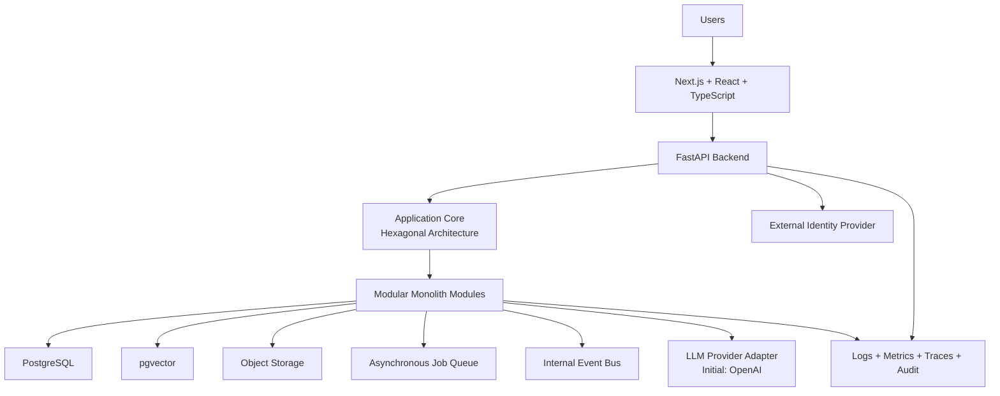

# Technology Decisions

## Derived From

Canon Version: `v1.0.0`

### Primary Canon Documents

- [Founder's Thesis](../canon/00_FOUNDERS_THESIS.md)
- [Product Vision](../canon/01_PRODUCT_VISION.md)
- [Product Principles](../canon/02_PRODUCT_PRINCIPLES.md)
- [Capability Model](../canon/03_PRODUCT_CAPABILITY_MODEL.md)
- [Domain Model](../canon/04_PRODUCT_DOMAIN_MODEL.md)
- [Workflow Model](../canon/05_PRODUCT_WORKFLOW_MODEL.md)
- [AI Cognitive Model](../canon/06_AI_COGNITIVE_MODEL.md)

### Primary Architecture Documents

- [System Architecture](../architecture/07_SYSTEM_ARCHITECTURE.md)
- [AI Agent Architecture](../architecture/08_AI_AGENT_ARCHITECTURE.md)
- [Data Architecture](../architecture/09_DATA_ARCHITECTURE.md)
- [Knowledge Representation](../architecture/10_KNOWLEDGE_REPRESENTATION_MODEL.md)
- [Integration Architecture](../architecture/11_INTEGRATION_ARCHITECTURE.md)

### Primary Implementation Documents

- [MVP Scope](./12_MVP_SCOPE.md)
- [Implementation Architecture](./13_IMPLEMENTATION_ARCHITECTURE.md)

---

Status: **Active**

## Primary Question

Which technologies should implement the Organizational Intelligence Platform, and why were they chosen?

## Purpose

This document records engineering technology decisions for the Organizational Intelligence Platform.

Unlike Canon and Architecture documents, this document intentionally discusses concrete technologies. Those technologies are not conceptual truths. They are current implementation choices made to realize the Canon, preserve architectural boundaries, and deliver the MVP with an acceptable balance of speed, reliability, learning, and future replaceability.

Technology exists to implement Architecture. It never defines Architecture.

Each decision answers:

- Why this technology or technical approach was selected.
- Which alternatives were considered.
- Which Canon and Architecture commitments influenced the decision.
- What trade-offs were accepted.
- When the decision should be revisited.

These decisions should be treated as Architecture Decision Records. They are durable enough to guide engineering work, but not sacred. If evidence changes, scale changes, security requirements change, or operational conditions change, the decisions may be revisited without redefining the Canon.

## Decision Principles

Technology choices in this document are governed by the following principles:

1. Preserve the Canon before optimizing for tools.
2. Prefer explicit boundaries over implicit coupling.
3. Prefer replaceable adapters over platform lock-in.
4. Prefer boring operational technology where the platform does not need novelty.
5. Prefer AI-native engineering where reasoning, retrieval, memory, and learning are central.
6. Prefer MVP simplicity until real operating evidence justifies distribution.
7. Preserve auditability, explainability, and historical memory.

## ADR-001: Overall Architectural Style

### Status

Accepted

### Context

The platform must coordinate users, organizations, work objects, workflows, knowledge, AI agents, integrations, and governance without allowing external tools or implementation details to distort the domain. The Architecture documents define a clear separation between the Organizational Intelligence Core and external systems. The implementation needs an architectural style that protects that separation over time.

### Decision

Adopt Hexagonal Architecture, also known as Ports and Adapters, as the overall implementation style.

The Application Core will define domain logic, use cases, policies, and ports. Adapters will implement inbound interfaces such as APIs and UI-facing application services, and outbound interfaces such as persistence, LLM providers, object storage, identity providers, event dispatch, and external integrations.

### Why This Fits the Canon

Hexagonal Architecture preserves the Product Vision by keeping organizational intelligence centered in the platform core rather than scattered across frameworks or vendors. It supports Product Principles by making decisions traceable and boundaries explicit. It implements the System Architecture by separating internal responsibilities from integrations. It supports MVP Scope by allowing a small implementation to stay clean while remaining ready for later expansion.

### Alternatives Considered

- Layered Architecture: familiar and simple, but often allows domain logic to leak into controllers, database models, or framework services.
- Clean Architecture: strongly aligned in spirit, but can become overly abstract if applied ceremonially.
- Microservices: useful at larger scale, but premature for the MVP and likely to add operational complexity before the domain stabilizes.
- Unstructured Monolith: fast initially, but conflicts with long-term clarity, traceability, and replaceability.

### Trade-offs

Advantages:

- Strong separation between domain concepts and infrastructure.
- Clear replacement boundaries for vendors, frameworks, and storage adapters.
- Easier testing of core logic without external systems.
- Good fit for AI provider abstraction and integration boundaries.

Disadvantages:

- Requires discipline in module boundaries.
- Introduces more interfaces than a simple script-oriented application.
- Can feel slower during early prototyping if the team is unfamiliar with the pattern.

Operational cost is moderate. Complexity is justified by the platform's long-term need for replaceability and governance. Maintainability improves when boundaries are enforced. Scalability remains possible because adapters and modules can be extracted later. The learning curve is real but acceptable for a platform intended to become durable infrastructure.

### Consequences

Positive consequences:

- The Canon remains protected from framework and vendor decisions.
- External systems can change without rewriting core reasoning and workflow logic.
- Future engineers can locate responsibility by boundary.

Negative consequences:

- Poorly named ports or over-abstracted adapters could create unnecessary ceremony.
- The team must actively prevent framework models from becoming domain models.

### Revisit Criteria

Revisit this decision if the implementation becomes dominated by accidental abstraction, if module boundaries cannot be understood by new engineers, or if the platform evolves into independently deployable services that require a different boundary enforcement mechanism.

## ADR-002: Application Architecture

### Status

Accepted

### Context

The MVP must validate the Knowledge Flywheel with a complete but focused system. The platform needs multiple internal responsibilities, including users, work objects, workflows, knowledge, AI execution, integrations, governance, and audit. These responsibilities should be separated conceptually, but the team should not pay the cost of distributed systems before usage patterns are proven.

### Decision

Implement the MVP as a Modular Monolith.

Each major domain and platform responsibility will live in a distinct internal module with explicit dependencies and ports. Modules will be deployed together initially, while preserving extraction paths for future service boundaries.

### Why This Fits the Canon

The Modular Monolith supports the Product Vision by delivering one coherent product experience rather than a fragmented set of services. It supports Product Principles by favoring clarity, speed, and human usefulness over premature infrastructure complexity. It supports the Architecture by respecting module boundaries inside a single deployable system. It supports MVP Scope by enabling fast iteration around one complete Knowledge Flywheel.

### Alternatives Considered

- Microservices: provide independent deployment and scaling, but introduce network failure, service discovery, distributed tracing, data synchronization, and operational overhead too early.
- Distributed Services: useful for mature teams with clear scale boundaries, but likely to slow MVP learning.
- Single Unmodular Monolith: faster for a few weeks, but risks creating a tangled codebase that contradicts the Architecture.

### Trade-offs

Advantages:

- Fast local development and deployment.
- Simple transactions and consistency boundaries.
- Easier debugging and observability during MVP.
- Clear path from modules to future services.

Disadvantages:

- Scaling is initially at the application level rather than per service.
- Poor discipline could collapse modules into a shared-code mass.
- Independent team ownership is less explicit than in separately deployed services.

Operational cost is low for MVP. Complexity is lower than microservices but higher than a naïve monolith. Maintainability depends on enforcing module boundaries. Scalability is sufficient for early validation. Vendor dependency is minimal.

### Consequences

Positive consequences:

- The team can validate product behavior before committing to infrastructure topology.
- Data consistency and workflow state are easier to preserve.
- Future extraction can be based on measured pressure rather than speculation.

Negative consequences:

- Engineers must resist adding direct cross-module imports where ports are required.
- Some future scaling work may require service extraction.

### Revisit Criteria

Revisit this decision when one module requires materially different scaling, deployment cadence, security isolation, failure isolation, or team ownership than the rest of the application.

## ADR-003: Backend Framework

### Status

Accepted

### Context

The backend must expose application capabilities, orchestrate workflows, coordinate AI execution, manage persistence, and integrate with external systems. The framework should be productive for API development while aligning with the AI-first nature of the platform.

### Decision

Use FastAPI with Python for the backend application.

FastAPI will serve HTTP APIs, request validation, dependency injection patterns, API documentation generation, and application entry points. Domain logic will remain in the Application Core rather than in route handlers.

### Why This Fits the Canon

Python aligns with AI-first development because most AI, retrieval, evaluation, and data-processing ecosystems are strongest in Python. FastAPI supports rapid iteration while remaining explicit enough for mature engineering practices. This helps the MVP validate intelligence workflows without fighting the implementation stack.

### Alternatives Considered

- Spring Boot: mature and robust, but Java ecosystem velocity for AI-native experimentation is less advantageous for this platform's early stage.
- NestJS: strong TypeScript backend option, but less naturally aligned with Python-native AI libraries.
- ASP.NET: mature and performant, but less aligned with the likely AI tooling ecosystem.
- Express: lightweight, but requires more structure to reach the same clarity and validation discipline.
- Go: excellent operational simplicity and performance, but less productive for AI-heavy development and experimentation.

### Trade-offs

Advantages:

- Strong fit with Python AI tooling.
- Fast API development with type hints and validation.
- Good developer ergonomics for MVP iteration.
- Broad community support.

Disadvantages:

- Python runtime performance requires care for CPU-heavy work.
- Async patterns must be applied consistently.
- Large applications require discipline to avoid loose module organization.

Operational cost is moderate and well understood. Complexity is acceptable. Maintainability depends on keeping FastAPI at the adapter layer. Scalability is sufficient when paired with background processing and horizontal application scaling. Vendor dependency is low.

### Consequences

Positive consequences:

- AI orchestration, retrieval, and evaluation can be implemented close to the backend core.
- The team can move quickly from prototype to production-quality API.

Negative consequences:

- Performance-sensitive work may need specialized workers, optimized libraries, or later extraction.
- Python dependency management must be handled carefully.

### Revisit Criteria

Revisit this decision if backend throughput requirements exceed Python's practical operating envelope, if the team composition shifts strongly away from Python, or if AI execution is separated so completely that another backend runtime becomes more appropriate.

## ADR-004: Frontend

### Status

Accepted

### Context

The frontend must present complex organizational workflows, AI-assisted explanations, review states, knowledge surfaces, dashboards, and administrative controls. The implementation should support rapid iteration while maintaining type safety and a path to production maturity.

### Decision

Use Next.js, React, and TypeScript for the frontend.

Next.js will provide the application framework, React will provide the UI component model, and TypeScript will provide static typing for client-side and shared interface code.

### Why This Fits the Canon

The Product Vision requires an interface that makes organizational intelligence understandable and actionable. React and TypeScript support iterative development of complex interaction patterns. Next.js supports product velocity while allowing the team to evolve rendering, routing, and deployment patterns without redefining the platform.

### Alternatives Considered

- Angular: mature and opinionated, but heavier than needed for MVP iteration.
- Vue: productive and approachable, but TypeScript-heavy enterprise patterns are less standard than in React ecosystems.
- Svelte: elegant and fast, but smaller ecosystem and hiring pool.
- Blazor: powerful in .NET contexts, but less aligned with the chosen backend and broader frontend ecosystem.

### Trade-offs

Advantages:

- Large ecosystem and hiring pool.
- Strong TypeScript support.
- Fast product iteration.
- Good fit for componentized workflow and dashboard interfaces.

Disadvantages:

- React ecosystem churn requires discipline.
- Next.js capabilities can encourage coupling frontend architecture to framework features.
- Client/server rendering choices can become complex.

Operational cost is moderate. Maintainability depends on explicit UI architecture and API boundaries. Scalability is strong for product growth. Learning curve is manageable. Vendor dependency is limited but present through framework conventions.

### Consequences

Positive consequences:

- The team can build rich workflow and review experiences quickly.
- Interface contracts can be represented with types.

Negative consequences:

- The frontend needs strong conventions to avoid becoming a collection of unrelated components.
- Framework upgrades may require maintenance work.

### Revisit Criteria

Revisit this decision if the product becomes primarily native-mobile, if React ecosystem costs outweigh benefits, or if a different UI runtime becomes necessary for customer deployment constraints.

## ADR-005: Programming Languages

### Status

Accepted

### Context

The platform spans backend AI orchestration, domain logic, APIs, user interfaces, and integration adapters. A single language could reduce cognitive load, but different platform areas have different ecosystem needs.

### Decision

Use Python for backend services and TypeScript for frontend applications.

Python will own backend application logic, AI orchestration, retrieval, workflow execution, and integration adapters. TypeScript will own frontend application code, UI state, and browser-facing interaction logic.

### Why This Fits the Canon

The split supports AI-first development while preserving high-quality user experience. Python serves the intelligence and learning responsibilities. TypeScript serves the product interface that makes intelligence usable, reviewable, and governable by humans.

### Alternatives Considered

- TypeScript Everywhere: simplifies language count, but weakens alignment with Python-native AI tooling.
- Python Everywhere: possible for backend, but not suitable for modern browser frontend development.
- Java or C# Everywhere: strong enterprise choices, but less aligned with rapid AI experimentation.
- Go Backend and TypeScript Frontend: operationally attractive, but less productive for AI-native development.

### Trade-offs

Advantages:

- Each language is used where its ecosystem is strongest.
- Type safety improves frontend maintainability.
- Python accelerates AI and data workflows.

Disadvantages:

- Two language ecosystems require two dependency and build systems.
- Shared types must be generated or coordinated through API contracts.
- Engineers may need cross-stack literacy.

Operational cost is moderate. Complexity is acceptable for a product with both AI-heavy backend logic and rich frontend interaction. Maintainability depends on clear API contracts. Vendor dependency is low.

### Consequences

Positive consequences:

- Engineering can move quickly in both AI and product-interface layers.
- Future specialized workers can remain Python-native unless evidence suggests otherwise.

Negative consequences:

- Contract drift between backend and frontend must be actively prevented.
- Tooling consistency requires deliberate engineering standards.

### Revisit Criteria

Revisit this decision if cross-language friction becomes a major delivery bottleneck or if backend AI responsibilities move into separate services with different runtime needs.

## ADR-006: Primary Database

### Status

Accepted

### Context

The platform must preserve users, organizations, work objects, workflows, decisions, knowledge artifacts, audit records, and relationships between them. Organizational memory depends on consistency, traceability, and durable state.

### Decision

Use PostgreSQL as the primary transactional database.

PostgreSQL will store authoritative relational state, workflow state, metadata, audit references, domain entities, and transactional records. It will not be used as a dumping ground for large binary documents.

### Why This Fits the Canon

The Domain Model emphasizes stable concepts and relationships. The Knowledge Representation Model requires traceability between knowledge, evidence, work, and decisions. PostgreSQL supports relational integrity, transactions, constraints, and queryability, making it a strong fit for organizational memory.

### Alternatives Considered

- MySQL: mature and widely used, but PostgreSQL offers stronger extensibility and advanced query capabilities for this platform's likely needs.
- SQL Server: enterprise-grade, but introduces heavier licensing and ecosystem assumptions.
- MongoDB: flexible for documents, but weaker fit for relational consistency and governed organizational memory.

### Trade-offs

Advantages:

- Strong relational consistency.
- Mature transactions and indexing.
- Rich query capabilities.
- Extensible ecosystem, including vector support through pgvector.

Disadvantages:

- Requires schema discipline and migrations.
- Not ideal for large binary storage.
- Scaling writes globally requires careful architecture.

Operational cost is moderate and predictable. Complexity is low relative to its capability. Maintainability is strong with migration discipline. Scalability is sufficient for MVP and significant growth. Vendor dependency is low because PostgreSQL is portable across hosting environments.

### Consequences

Positive consequences:

- The platform has a reliable source of truth for organizational state.
- Knowledge and workflow relationships can be queried and audited.

Negative consequences:

- Poor schema design could slow iteration.
- Some future analytical or graph workloads may require complementary stores.

### Revisit Criteria

Revisit this decision only if relational consistency no longer fits core state, if scale requirements exceed practical PostgreSQL patterns, or if a specialized store becomes necessary for a clearly bounded workload.

## ADR-007: Vector Storage

### Status

Accepted

### Context

The platform must support semantic retrieval over knowledge artifacts, work objects, and organizational memory. Vector search is important, but the MVP should avoid adding a separate storage system before retrieval requirements are proven.

### Decision

Use pgvector initially for vector storage and similarity search.

Embeddings will be stored close to the transactional records and metadata that explain their source, scope, version, and governance status.

### Why This Fits the Canon

The Canon treats knowledge as contextual, governed, and traceable. Keeping vectors near relational metadata simplifies explainability, filtering, permissions, and source attribution. This supports the MVP by reducing infrastructure complexity while preserving the Knowledge Representation Model.

### Alternatives Considered

- Pinecone: strong managed vector database, but introduces an external vendor and additional operational boundary early.
- Weaviate: capable vector-native platform, but broader than necessary for MVP.
- Milvus: powerful open-source vector database, but adds operational complexity.
- Qdrant: strong vector database, but still introduces a separate persistence and operations layer.

### Trade-offs

Advantages:

- Simple MVP operations.
- Easier joins between embeddings and governed metadata.
- Lower infrastructure footprint.
- Good enough for early retrieval validation.

Disadvantages:

- Dedicated vector systems may outperform pgvector at larger scale.
- Advanced vector-native features may be limited.
- PostgreSQL load must be monitored carefully.

Operational cost is low for MVP. Complexity is low. Maintainability is strong when embeddings are versioned and indexed carefully. Scalability is acceptable until retrieval volume, latency, or corpus size requires a dedicated store. Vendor dependency is low.

### Consequences

Positive consequences:

- Retrieval can remain traceable to authoritative records.
- The team avoids premature infrastructure fragmentation.

Negative consequences:

- A future migration to a dedicated vector database may be required.
- Indexing strategy will need tuning as data grows.

### Revisit Criteria

Revisit this decision when vector corpus size, retrieval latency, ranking complexity, multi-tenant isolation, or operational load exceeds pgvector's practical limits.

## ADR-008: Knowledge Search

### Status

Accepted

### Context

Organizational knowledge is not only semantic. Users search for exact terms, names, identifiers, dates, documents, decisions, exceptions, and remembered phrases. Pure vector search can miss exact constraints, while pure keyword search can miss conceptual similarity.

### Decision

Use Hybrid Retrieval combining keyword search and semantic search.

Retrieval should combine lexical matching, structured filtering, semantic similarity, permissions, source metadata, recency, version status, and governance state. Ranking should remain explainable enough for users and AI agents to understand why a result was retrieved.

### Why This Fits the Canon

The Knowledge Representation Model treats knowledge as grounded, contextual, and connected to evidence. Hybrid Retrieval supports explainability and organizational memory better than pure embeddings. It also supports Product Principles by making AI assistance reviewable rather than mysterious.

### Alternatives Considered

- Pure Vector Search: effective for similarity, but weak for exact identifiers, governance filters, and deterministic lookup.
- Pure Keyword Search: transparent and precise, but weak for conceptual retrieval and paraphrased knowledge.
- Manual Navigation Only: understandable, but insufficient for an intelligence platform.

### Trade-offs

Advantages:

- Better retrieval quality across varied knowledge-seeking behaviors.
- Supports exact, semantic, and governed retrieval.
- Improves explainability of AI-generated answers.

Disadvantages:

- Ranking and evaluation are more complex.
- Requires careful testing to prevent noisy retrieval.
- Multiple retrieval signals must be tuned over time.

Operational cost is moderate. Complexity is justified by the platform's knowledge goals. Maintainability depends on clear retrieval pipelines and evaluation sets. Scalability can be managed through indexing and caching. Vendor dependency is low if retrieval remains adapter-based.

### Consequences

Positive consequences:

- Users and agents can retrieve both exact facts and related concepts.
- AI outputs can be grounded in traceable sources.

Negative consequences:

- Retrieval quality becomes an ongoing engineering discipline.
- Evaluation data must be curated.

### Revisit Criteria

Revisit this decision if evidence shows one retrieval mode consistently dominates, if ranking complexity becomes unmanageable, or if specialized search infrastructure becomes necessary.

## ADR-009: LLM Provider

### Status

Accepted

### Context

The platform depends on large language models for reasoning assistance, synthesis, explanation, classification, and knowledge interaction. No provider should become part of the Canon or be allowed to define the platform's cognitive architecture.

### Decision

Use a Provider Abstraction Layer for LLM access.

The initial implementation will use OpenAI through an outbound adapter. The Application Core will depend on model capabilities and cognitive contracts, not on provider-specific APIs.

### Why This Fits the Canon

The AI Cognitive Model defines how intelligence should think inside the platform. It does not define a single vendor. Provider abstraction preserves replaceability, governance, cost control, and long-term adaptability while allowing the MVP to start with a strong implementation provider.

### Alternatives Considered

- Direct OpenAI Integration Everywhere: fastest initially, but creates vendor coupling and makes future replacement difficult.
- Anthropic as Initial Provider: strong alternative, but still requires abstraction to avoid provider lock-in.
- Gemini as Initial Provider: strong alternative, but same abstraction requirement.
- Open-source Models Only: attractive for control, but may slow MVP capability validation depending on hosting and quality requirements.

### Trade-offs

Advantages:

- Provider replaceability.
- Easier model comparison and evaluation.
- Better cost and risk management.
- Cleaner alignment with AI Cognitive Architecture.

Disadvantages:

- Abstraction may hide useful provider-specific capabilities.
- Requires careful capability modeling.
- More engineering work than direct calls.

Operational cost is moderate. Complexity is acceptable because AI is central to the platform. Maintainability improves when prompts, tools, and model contracts are versioned. Scalability depends on provider limits and queue design. Vendor dependency is reduced but not eliminated.

### Consequences

Positive consequences:

- The platform can evolve across model providers.
- AI behavior can be governed at the platform level.

Negative consequences:

- The first abstraction may need revision as provider capabilities diverge.
- Provider-specific optimizations must be introduced deliberately.

### Revisit Criteria

Revisit this decision if one provider becomes a hard requirement for critical features, if abstraction prevents necessary capability use, or if self-hosted models become operationally and economically superior for major workloads.

## ADR-010: Background Processing

### Status

Accepted

### Context

Reasoning, learning, memory updates, embeddings, document processing, integration sync, notifications, and audit enrichment may be slow, retryable, or failure-prone. User interaction should not block on these operations unless immediate completion is essential.

### Decision

Use an asynchronous job queue for background processing.

This decision is intentionally implementation-neutral regarding the queue technology. The Architecture requires asynchronous execution boundaries; a later implementation document or operational decision may select a specific queue based on deployment constraints.

### Why This Fits the Canon

The Workflow Model describes work evolving over time. The AI Cognitive Model includes reasoning and memory activities that may require asynchronous execution. Background processing protects human interaction while allowing the Knowledge Flywheel to continue operating.

### Alternatives Considered

- Synchronous Processing Only: simple, but would degrade user experience and reliability.
- Cron-Only Processing: useful for scheduled tasks, but insufficient for event-driven workflows and retries.
- External Workflow Engine for All Work: powerful, but may be too heavy for MVP if applied broadly.

### Trade-offs

Advantages:

- Improves responsiveness.
- Supports retries and delayed work.
- Allows AI and knowledge updates to run safely outside request lifecycles.
- Creates a path for specialized workers.

Disadvantages:

- Introduces eventual consistency.
- Requires idempotency and retry design.
- Adds operational monitoring requirements.

Operational cost depends on the queue technology selected later. Complexity is moderate. Maintainability depends on explicit job contracts. Scalability improves because workers can scale independently. Vendor dependency should be avoided by keeping queue access behind ports.

### Consequences

Positive consequences:

- User workflows remain responsive.
- Long-running intelligence tasks can be managed reliably.

Negative consequences:

- Users may need status indicators for pending work.
- Developers must handle duplicate execution and partial failure.

### Revisit Criteria

Revisit this decision if background work becomes complex enough to require a dedicated workflow engine, if strict synchronous guarantees are required for specific operations, or if queue reliability becomes a bottleneck.

## ADR-011: Event Processing

### Status

Accepted

### Context

The Knowledge Flywheel depends on meaningful events: work created, evidence attached, decisions made, workflows advanced, knowledge extracted, memories updated, integrations synchronized, and governance actions recorded. These events should trigger learning and coordination without tightly coupling modules.

### Decision

Use an Internal Event Bus.

The MVP event bus may be implemented in-process or with lightweight infrastructure, but producers and consumers should communicate through explicit event contracts. The specific event technology remains implementation-neutral at this stage.

### Why This Fits the Canon

The Workflow Model describes concepts changing over time. The Knowledge Representation Model requires capturing how knowledge emerges from work. An Internal Event Bus allows the platform to observe change and convert activity into organizational memory without forcing every module to know every other module.

### Alternatives Considered

- Direct Method Calls Between Modules: simple, but creates coupling and hides system behavior.
- Database Polling: workable for some cases, but inefficient and less expressive.
- External Streaming Platform Immediately: powerful, but may be premature for MVP.

### Trade-offs

Advantages:

- Supports loose coupling.
- Creates a clear mechanism for the Knowledge Flywheel.
- Enables future asynchronous processing and audit enrichment.
- Improves extensibility.

Disadvantages:

- Event contracts require governance.
- Event ordering and duplication must be understood.
- Debugging event-driven behavior can be harder than direct calls.

Operational cost is low if internal initially, higher if externalized later. Complexity is moderate. Maintainability depends on versioned event contracts. Scalability can improve through later externalization. Vendor dependency should remain low.

### Consequences

Positive consequences:

- New knowledge processes can subscribe to platform activity without invasive changes.
- Workflow and memory updates can evolve independently.

Negative consequences:

- Poorly designed events can become a second, implicit domain model.
- Event consumers need idempotency.

### Revisit Criteria

Revisit this decision if event volume, ordering needs, cross-service distribution, or replay requirements exceed an internal event bus.

## ADR-012: Authentication

### Status

Accepted

### Context

The platform must identify users and organizations securely, but authentication mechanics are not the Organizational Intelligence Core. Building identity infrastructure internally would distract from the product's central purpose and increase security risk.

### Decision

Use an External Identity Provider for authentication.

The platform will integrate with an identity provider through an adapter and will maintain internal authorization, tenancy, role, and governance concepts as needed. Authentication remains outside the core domain.

### Why This Fits the Canon

The Canon focuses on organizational intelligence, not identity infrastructure. External authentication supports Product Principles by preserving focus and reducing avoidable risk. The Architecture already separates external systems from the core through adapters.

### Alternatives Considered

- Build Authentication Internally: maximum control, but high security and maintenance burden.
- Basic Username and Password in Application Database: simple, but inappropriate for mature security needs.
- Enterprise SSO Only from Day One: valuable later, but may be too restrictive for MVP.

### Trade-offs

Advantages:

- Reduces security implementation burden.
- Supports mature authentication flows.
- Allows future SSO and enterprise identity integration.
- Keeps the core focused on organizational intelligence.

Disadvantages:

- Creates dependency on identity provider availability.
- Provider configuration becomes operationally important.
- Some customer requirements may require multiple identity modes later.

Operational cost is moderate and provider-dependent. Complexity is lower than building identity internally. Maintainability improves through delegation. Scalability is strong. Vendor dependency must be controlled through adapter boundaries.

### Consequences

Positive consequences:

- The team can rely on hardened identity capabilities.
- Authentication can evolve without redefining internal authorization concepts.

Negative consequences:

- Local development and testing require identity stubs or test tenants.
- Provider outages may affect login.

### Revisit Criteria

Revisit this decision if enterprise customer requirements require additional identity providers, if offline deployment becomes necessary, or if authentication provider constraints conflict with governance needs.

## ADR-013: File Storage

### Status

Accepted

### Context

The platform will ingest and reference documents, attachments, exports, generated artifacts, and evidence files. These files may be large, binary, and independently lifecycle-managed. Storing them directly in the primary relational database would create unnecessary load and operational friction.

### Decision

Use Object Storage for file content.

PostgreSQL will store file metadata, ownership, source relationships, permissions, processing state, and audit references. Object Storage will store the binary content.

### Why This Fits the Canon

The Knowledge Representation Model requires preserving evidence and linking it to knowledge. Object Storage allows the platform to preserve documents while keeping relational state clean and queryable. This supports Architecture by separating metadata and binary storage responsibilities.

### Alternatives Considered

- Store Files in PostgreSQL: simple transactionally, but poor fit for large binary growth and backup efficiency.
- Local Filesystem Storage: simple for development, but weak for scalable deployment and durability.
- External Document Provider Only: may be useful as an integration, but the platform still needs durable control over ingested artifacts.

### Trade-offs

Advantages:

- Scales well for large binary objects.
- Keeps the primary database focused on structured state.
- Supports lifecycle policies and archival strategies.
- Portable across cloud and self-hosted object storage options.

Disadvantages:

- Requires coordination between metadata and object references.
- Adds access-control and signed-url concerns.
- Backup and retention policies span two storage systems.

Operational cost is moderate. Complexity is manageable with clear metadata contracts. Maintainability improves when files are content-addressed or versioned carefully. Scalability is strong. Vendor dependency is low if object storage is accessed through an adapter.

### Consequences

Positive consequences:

- Documents can grow without bloating the primary database.
- Evidence files remain durable and linkable.

Negative consequences:

- Orphaned objects must be prevented or cleaned up.
- File access must be audited and governed.

### Revisit Criteria

Revisit this decision if deployment constraints prohibit object storage, if file volumes remain trivial, or if specialized document management requirements emerge.

## ADR-014: Deployment

### Status

Accepted

### Context

The MVP must be deployable in a repeatable way without prematurely choosing a single cloud provider or production topology. The platform should remain portable across local development, staging, production, and future customer-specific environments.

### Decision

Use container-first deployment.

Application components should be packaged as containers. This decision does not choose a cloud provider, orchestration platform, runtime environment, or production topology.

### Why This Fits the Canon

Container-first deployment supports replaceability and operational clarity. It allows the Architecture to remain stable while infrastructure choices evolve. It also supports MVP Scope by keeping deployment repeatable without locking the platform into one cloud model.

### Alternatives Considered

- Platform-Specific Deployment: can be fast on one cloud, but risks early lock-in.
- Traditional VM Deployment: viable, but less portable and less consistent across environments.
- Serverless-First Deployment: attractive for some workloads, but may create constraints around long-running AI jobs, event processing, and portability.

### Trade-offs

Advantages:

- Portable packaging.
- Consistent development and deployment environments.
- Supports future orchestration.
- Cloud-neutral.

Disadvantages:

- Containers require image build and registry practices.
- Runtime configuration and secrets must be managed carefully.
- Does not by itself solve orchestration, scaling, or networking.

Operational cost is low to moderate. Complexity is acceptable. Maintainability improves through repeatable packaging. Scalability depends on later deployment architecture. Vendor dependency is low.

### Consequences

Positive consequences:

- The platform can move between environments with less friction.
- Future deployment topology can evolve without repackaging the application model.

Negative consequences:

- The team still needs later decisions for orchestration, networking, and environment management.
- Container security scanning becomes part of the engineering workflow.

### Revisit Criteria

Revisit this decision if customer deployment requirements prohibit containers or if a specific managed runtime becomes overwhelmingly beneficial for a bounded component.

## ADR-015: Observability

### Status

Accepted

### Context

The platform coordinates human work, AI reasoning, knowledge updates, workflows, integrations, and governance. Failures may be technical, cognitive, operational, or data-related. Engineers and operators need visibility into what happened, why it happened, and who or what was affected.

### Decision

Use centralized logging, metrics, distributed tracing, and audit logs.

Operational logs, application metrics, traces, and domain audit logs are distinct but complementary. Audit logs are not merely operational telemetry; they are part of governance and organizational trust.

### Why This Fits the Canon

Organizational Intelligence requires explainability and trust. Observability allows the platform to learn from behavior, diagnose problems, support governance, and preserve evidence of important actions. It supports Architecture by making cross-module and AI-driven workflows understandable.

### Alternatives Considered

- Logs Only: insufficient for performance, causality, and system health.
- Metrics Only: insufficient for debugging and audit.
- Vendor-Specific Observability from the Start: useful, but risks coupling before operational needs are proven.

### Trade-offs

Advantages:

- Better diagnosis and support.
- Enables reliability engineering.
- Makes AI and workflow execution more inspectable.
- Supports compliance and governance.

Disadvantages:

- Requires instrumentation discipline.
- Can produce sensitive data if not carefully filtered.
- Storage and retention costs can grow.

Operational cost is moderate. Complexity is necessary for a platform of this nature. Maintainability improves when observability standards are consistent. Scalability depends on sampling, retention, and aggregation strategy. Vendor dependency should be controlled through open standards where practical.

### Consequences

Positive consequences:

- Engineers can understand system behavior across modules.
- Users and administrators can trust governed actions.

Negative consequences:

- Poor telemetry hygiene can expose sensitive information.
- Observability tooling requires ongoing maintenance.

### Revisit Criteria

Revisit this decision if observability costs become disproportionate, if regulatory needs require different audit retention, or if a specific operational platform becomes a customer requirement.

## ADR-016: Configuration

### Status

Accepted

### Context

The platform will run in multiple environments and integrate with external providers. Configuration values differ by environment, while secrets require stricter handling than ordinary settings. Configuration should not be hard-coded or mixed with domain logic.

### Decision

Use environment-based configuration with centralized secrets management.

Non-secret configuration will be supplied through environment-specific settings. Secrets such as API keys, database credentials, identity-provider secrets, and encryption keys will be stored in a secrets manager appropriate to the deployment environment.

### Why This Fits the Canon

This supports Product Principles by keeping implementation adaptable and secure. It supports Architecture by ensuring external adapters can be configured without changing core code. It supports MVP Scope by keeping environment management understandable.

### Alternatives Considered

- Hard-Coded Configuration: simple, but unsafe and unmaintainable.
- Configuration Files Committed with Secrets: unacceptable security risk.
- Database-Stored Runtime Configuration for Everything: adds unnecessary complexity and creates bootstrap problems.

### Trade-offs

Advantages:

- Clear separation of code and environment.
- Safer secret handling.
- Easier deployment across environments.
- Supports provider replaceability.

Disadvantages:

- Requires environment management discipline.
- Misconfiguration can still cause outages.
- Local development needs safe defaults and examples.

Operational cost is moderate. Complexity is low if conventions are consistent. Maintainability improves through typed configuration. Scalability is strong. Vendor dependency depends on secrets manager choice and should be adapter-friendly where possible.

### Consequences

Positive consequences:

- Deployments can differ without code changes.
- Secret rotation becomes operationally possible.

Negative consequences:

- Configuration validation must be implemented.
- Developers need clear onboarding documentation.

### Revisit Criteria

Revisit this decision if configuration becomes dynamic domain behavior, if multi-tenant runtime settings require database-backed management, or if deployment environments impose a specific secrets system.

## ADR-017: AI Prompt Management

### Status

Accepted

### Context

Prompts shape AI behavior, reasoning boundaries, output formats, review expectations, and governance behavior. Treating prompts as invisible runtime strings would make AI behavior difficult to review, version, test, and improve.

### Decision

Manage prompt templates as version-controlled engineering assets.

Prompts will be stored, reviewed, versioned, tested, and released through the same discipline as application code. Runtime configuration may choose active prompt versions, but the prompt definitions themselves belong in controlled source assets.

### Why This Fits the Canon

The AI Cognitive Model defines intelligence as governed, explainable, and aligned with platform concepts. Version-controlled prompts make AI behavior traceable and reviewable. This supports human review and prevents silent cognitive drift.

### Alternatives Considered

- Store Prompts Only in Database: flexible, but weak for code review and release discipline.
- Hard-Code Prompts Inside Functions: simple, but hard to audit and evolve.
- External Prompt Management Vendor Only: may be useful later, but should not replace source-level governance.

### Trade-offs

Advantages:

- Reviewable AI behavior changes.
- Easier testing and evaluation.
- Clear version history.
- Better alignment with release management.

Disadvantages:

- Less convenient for ad hoc prompt edits.
- Requires prompt testing discipline.
- Product and engineering teams need a shared review process.

Operational cost is low to moderate. Complexity is justified because prompts are part of AI behavior. Maintainability improves through templates, versioning, and evaluation fixtures. Scalability depends on prompt catalog organization. Vendor dependency is low.

### Consequences

Positive consequences:

- AI behavior can be traced to specific prompt versions.
- Prompt changes can be reviewed against Canon and Architecture.

Negative consequences:

- Rapid experimentation needs a controlled sandbox path.
- Poorly organized prompt assets can become difficult to navigate.

### Revisit Criteria

Revisit this decision if prompt volume requires specialized management tooling, if non-engineering teams need governed editing workflows, or if runtime prompt optimization becomes a core capability.

## ADR-018: Knowledge Versioning

### Status

Accepted

### Context

Organizational learning is historical. The platform must preserve how knowledge changed, why it changed, what evidence supported it, and which workflows or decisions depended on it. Overwriting knowledge destroys the memory needed for audit, explanation, and learning.

### Decision

Use Immutable Knowledge History.

Knowledge changes should create new versions or append historical records rather than destructively overwriting prior knowledge. Current views may point to the latest valid version, but earlier versions must remain available according to governance and retention rules.

### Why This Fits the Canon

The Product Vision centers on durable organizational intelligence. The Knowledge Representation Model requires traceability. The Workflow Model requires understanding how work and knowledge evolve over time. Immutable history preserves the conditions under which intelligence was formed.

### Alternatives Considered

- Mutable Current-State Only: simple, but loses history and weakens trust.
- Periodic Snapshots Only: better than nothing, but may miss causality between changes.
- External Audit System Only: useful as a supplement, but knowledge history belongs in the platform's core representation.

### Trade-offs

Advantages:

- Strong auditability.
- Supports explainability and learning.
- Enables historical reconstruction.
- Protects against accidental knowledge loss.

Disadvantages:

- Requires more storage.
- Queries must distinguish current state from history.
- Retention and privacy rules become more important.

Operational cost grows with data volume. Complexity is justified by the platform's purpose. Maintainability depends on clear versioning models. Scalability requires archival and indexing strategies. Vendor dependency is low.

### Consequences

Positive consequences:

- The platform can explain how knowledge evolved.
- Governance and review workflows can rely on preserved evidence.

Negative consequences:

- Data lifecycle management becomes an important engineering function.
- Legal deletion or retention requirements must be designed carefully.

### Revisit Criteria

Revisit this decision only if specific legal requirements require destructive deletion workflows for bounded data, or if historical storage volume requires a different archival implementation while preserving the conceptual rule of history.

## Technology Decision Matrix

| Area | Decision | Alternatives |
| --- | --- | --- |
| Overall Architectural Style | Hexagonal Architecture | Layered Architecture, Clean Architecture, Microservices, Unstructured Monolith |
| Application Architecture | Modular Monolith for MVP | Microservices, Distributed Services, Single Unmodular Monolith |
| Backend Framework | FastAPI with Python | Spring Boot, NestJS, ASP.NET, Express, Go |
| Frontend | Next.js, React, TypeScript | Angular, Vue, Svelte, Blazor |
| Programming Languages | Python backend, TypeScript frontend | TypeScript everywhere, Python everywhere, Java/C#, Go backend |
| Primary Database | PostgreSQL | MySQL, SQL Server, MongoDB |
| Vector Storage | pgvector initially | Pinecone, Weaviate, Milvus, Qdrant |
| Knowledge Search | Hybrid Retrieval | Pure vector search, pure keyword search, manual navigation |
| LLM Provider | Provider Abstraction Layer with initial OpenAI adapter | Direct provider integration, Anthropic, Gemini, open-source-only models |
| Background Processing | Asynchronous Job Queue | Synchronous processing, cron-only processing, external workflow engine for all work |
| Event Processing | Internal Event Bus | Direct method calls, database polling, external streaming platform immediately |
| Authentication | External Identity Provider | Internal authentication, application-database passwords, enterprise SSO only |
| File Storage | Object Storage | PostgreSQL binary storage, local filesystem, external document provider only |
| Deployment | Container-first deployment | Platform-specific deployment, VM deployment, serverless-first deployment |
| Observability | Centralized logs, metrics, tracing, audit logs | Logs only, metrics only, vendor-specific observability from the start |
| Configuration | Environment-based configuration with centralized secrets | Hard-coded config, committed secret files, database-stored config for everything |
| AI Prompt Management | Version-controlled prompt templates | Database-only prompts, hard-coded prompts, external prompt vendor only |
| Knowledge Versioning | Immutable Knowledge History | Mutable current-state only, periodic snapshots only, external audit only |

## Dependency Diagram

This diagram is conceptual. It shows technology relationships, not deployment topology.

## Technology Evolution Strategy

Technologies may change without changing the Canon, Architecture, Data Model, or Knowledge Model.

The platform should preserve this separation through explicit ports, adapters, contracts, versioned data models, and migration paths. A technology replacement is acceptable when it preserves or improves the platform's ability to implement the Canon. A technology replacement is not acceptable if it silently changes the meaning of core concepts, weakens governance, erases history, or makes AI behavior less explainable.

Technology may evolve in several ways:

- A framework may be replaced if application boundaries remain stable.
- A provider may be replaced if provider capabilities are abstracted behind ports.
- A storage engine may be supplemented if the authoritative data model remains clear.
- A queue or event bus may be externalized if contracts remain versioned.
- A deployment platform may change if runtime responsibilities remain intact.
- Prompt tooling may mature if prompt versions remain reviewable and traceable.

The preferred pattern is evolutionary replacement, not conceptual redesign. Engineers should identify the stable concept first, then evaluate whether the current technology still serves that concept.

## Traceability Matrix

| Canon or Architecture Commitment | Technology Decision |
| --- | --- |
| The platform must preserve a coherent Organizational Intelligence Core. | Hexagonal Architecture |
| Product behavior should remain understandable and governed. | Modular Monolith with explicit module boundaries |
| AI-first development should be practical and close to the core implementation. | FastAPI and Python backend |
| Human users need a clear, iterative, high-quality product interface. | Next.js, React, and TypeScript frontend |
| Organizational memory requires durable relationships and consistency. | PostgreSQL |
| Semantic knowledge must remain connected to evidence and metadata. | pgvector initially inside PostgreSQL |
| Explainability requires more than semantic similarity. | Hybrid Retrieval |
| Intelligence must not be defined by one vendor. | LLM Provider Abstraction Layer |
| Reasoning and learning should not block user interaction. | Asynchronous Job Queue |
| The Knowledge Flywheel depends on observing change over time. | Internal Event Bus |
| Identity should not distract from the Organizational Intelligence Core. | External Identity Provider |
| Evidence files must be durable without bloating the relational core. | Object Storage |
| Implementation should remain portable across environments. | Container-first deployment |
| Trust requires visibility into system, workflow, and AI behavior. | Centralized logging, metrics, tracing, and audit logs |
| Configuration should not be hidden in code. | Environment-based configuration and centralized secrets |
| AI behavior is engineering behavior. | Version-controlled prompt templates |
| Organizational learning requires historical preservation. | Immutable Knowledge History |
| Future changes must extend rather than contradict the Canon. | ADR-based technology governance |

## What This Document Does NOT Define

This document intentionally does not define:

- API contracts.
- Endpoint definitions.
- Database schemas.
- Infrastructure topology.
- Cloud provider selection.
- Deployment environments.
- Implementation code.
- Queue product selection.
- Event streaming product selection.
- Observability vendor selection.
- Identity provider vendor selection.

Those decisions belong to later implementation documents or bounded operational ADRs.

## Closing

Technologies are temporary.

The Canon is permanent.

Architecture is stable.

This document records today's best implementation choices while recognizing that technology will evolve as the platform grows. Every future technology change should be evaluated against the Canon, the Architecture, and the evidence gathered from real use.

The correct question is not whether a technology is universally best. The correct question is whether it faithfully implements the Organizational Intelligence Platform while preserving clarity, replaceability, governance, and long-term learning.
