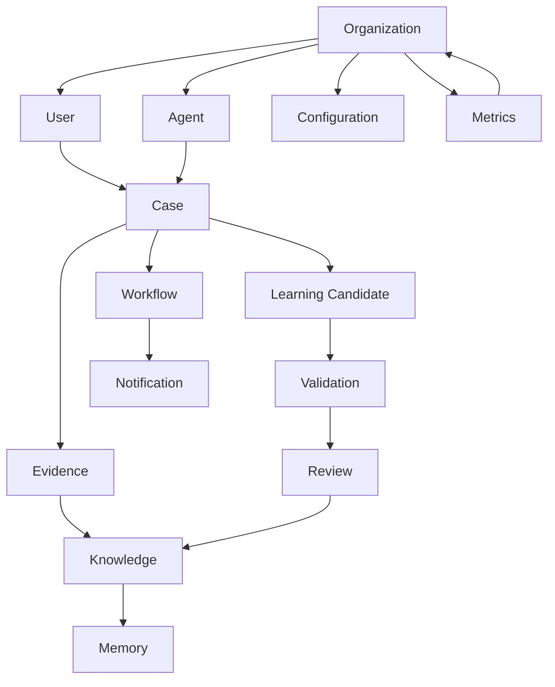
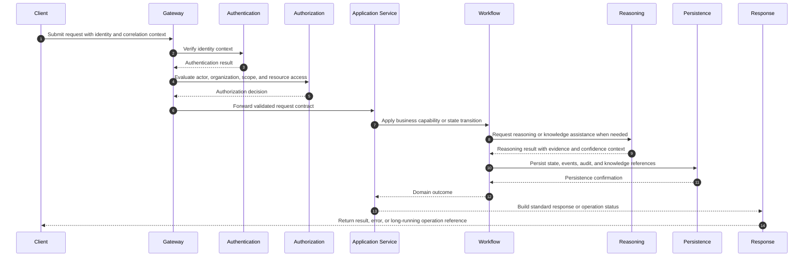
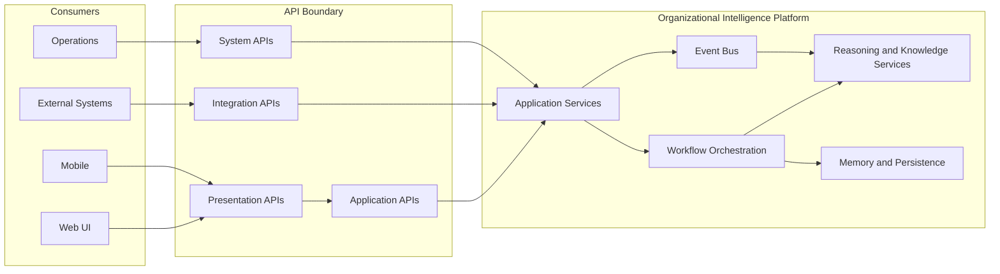
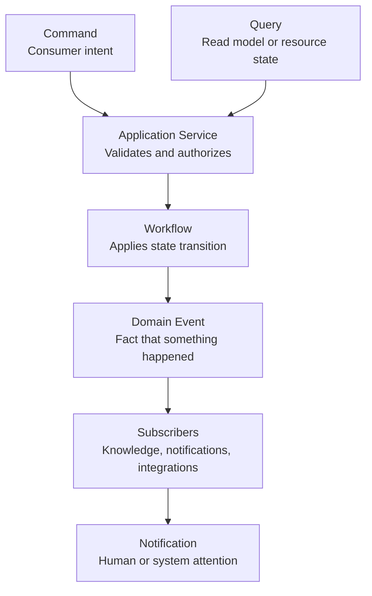

# API Architecture

## Derived From

Canon Version: `v1.0.0`

### Primary Canon Documents

- [Founder's Thesis](../canon/00_FOUNDERS_THESIS.md)
- [Product Vision](../canon/01_PRODUCT_VISION.md)
- [Product Principles](../canon/02_PRODUCT_PRINCIPLES.md)
- [Capability Model](../canon/03_PRODUCT_CAPABILITY_MODEL.md)
- [Domain Model](../canon/04_PRODUCT_DOMAIN_MODEL.md)
- [Workflow Model](../canon/05_PRODUCT_WORKFLOW_MODEL.md)
- [AI Cognitive Model](../canon/06_AI_COGNITIVE_MODEL.md)

### Primary Architecture Documents

- [System Architecture](../architecture/07_SYSTEM_ARCHITECTURE.md)
- [AI Agent Architecture](../architecture/08_AI_AGENT_ARCHITECTURE.md)
- [Data Architecture](../architecture/09_DATA_ARCHITECTURE.md)
- [Knowledge Representation](../architecture/10_KNOWLEDGE_REPRESENTATION_MODEL.md)
- [Integration Architecture](../architecture/11_INTEGRATION_ARCHITECTURE.md)

### Primary Implementation Documents

- [MVP Scope](./12_MVP_SCOPE.md)
- [Implementation Architecture](./13_IMPLEMENTATION_ARCHITECTURE.md)
- [Technology Decisions](./14_TECHNOLOGY_DECISIONS.md)

---

Status: **Active**

## Primary Question

How should software components communicate while preserving the Organizational Intelligence Platform?

This document defines API Architecture. It defines communication contracts, not endpoint implementation, controller code, SDKs, or HTTP handlers.

## Purpose

The API layer is not merely a transport mechanism. It is the public expression of the platform's architecture.

Every API should preserve:

- Canon concepts.
- Domain language.
- Explainability.
- Governance.
- Organizational Memory.
- Version stability.

APIs should expose business capabilities, not database tables.

# 1. Introduction

API Architecture defines how software communicates across the Organizational Intelligence Platform.

Communication is architectural. Every request, response, event, status object, and error message either reinforces the platform's domain model or leaks implementation detail. The API layer therefore must express stable platform concepts such as Case, Knowledge, Memory, Workflow, Evidence, Review, Validation, and Learning Candidate rather than internal tables, provider objects, framework classes, or storage structures.

The API Architecture must support several kinds of communication:

- Human-facing interaction through presentation clients.
- Business capability access through application APIs.
- Module-to-module coordination through internal contracts.
- External system coordination through integration APIs.
- Operational visibility through system APIs.
- Asynchronous state change through events and notifications.

REST concepts are appropriate for many external and presentation-facing contracts because they provide a widely understood model for resources, representation, status, and compatibility. However, REST is not the only communication model. Internal modules may use direct typed contracts. Event-driven workflows should use events. High-throughput or strongly typed service-to-service communication may later justify gRPC. Consumer-driven graph composition may later justify GraphQL. Those protocols are implementation choices; the stable architectural requirement is that APIs preserve domain meaning.

# 2. API Design Principles

## API First

APIs are designed before implementation details are exposed to consumers.

API First does not mean every internal function becomes a public endpoint. It means communication contracts are intentional, reviewed, documented, versioned, and aligned with the Canon before clients depend on them. The contract should be understandable without knowing the database schema, framework, queue, or AI provider behind it.

## Domain-Driven APIs

APIs must use the language of the platform domain.

Resources and operations should reflect Canon concepts and workflow behavior. An API that exposes a Knowledge object should communicate provenance, confidence, validation state, and governance status where relevant. An API that exposes Review should communicate human judgment and decision state rather than internal task records.

## Resource-Oriented Design

External and presentation-facing APIs should be organized around resources and representations.

Resources should represent stable platform concepts. Actions should usually be expressed as state transitions, commands on resources, or subordinate workflow operations. APIs should not expose database tables, object-relational mapping structures, queue messages, or provider payloads as primary resources.

## Explicit Contracts

Every API contract should define request shape, response shape, allowed state transitions, error behavior, authorization expectations, idempotency behavior, pagination behavior, and compatibility guarantees.

Explicit contracts reduce ambiguity between producers and consumers. They also make governance possible because reviewers can evaluate whether a contract preserves platform meaning.

## Stable Versioning

Public and presentation-facing APIs must use stable versioning.

Once consumers depend on a contract, that contract should change slowly. The platform may add compatible fields and capabilities, but it must not silently change the meaning of existing fields, status values, identifiers, or error codes.

## Backward Compatibility

Compatible changes are preferred over breaking changes.

Backward compatibility allows the frontend, integrations, automation, and future clients to evolve safely. Removing fields, changing types, renaming concepts, changing error semantics, or changing lifecycle behavior requires versioning and migration planning.

## Idempotency

Commands that may be retried should support idempotency.

The platform will coordinate workflows, learning, background jobs, external integrations, and AI reasoning. Network retries and client retries must not accidentally create duplicate Cases, duplicate Evidence, repeated Learning Candidates, or repeated notifications. Idempotency is required wherever duplicate execution would harm meaning, trust, or operational correctness.

## Stateless Requests

API requests should be stateless from the transport perspective.

Each request should carry or reference the identity, authorization context, tenant context, correlation context, and resource identity needed to process it. Workflow state belongs in the platform, not in client sessions or hidden transport state.

## Explainability

APIs should make important outcomes explainable.

Errors should describe what failed and how to recover. AI-supported responses should identify reasoning status, evidence references, confidence where appropriate, and validation state. Knowledge and Memory APIs should preserve source and provenance. Explainability is a product and governance requirement, not a cosmetic response feature.

## Security by Design

Authentication, authorization, input validation, tenant isolation, rate limiting, audit logging, sensitive-data handling, and abuse prevention must be designed into the API model from the beginning.

Security should not be added after the contract exists. A contract that cannot be secured without changing its semantics is an unstable contract.

## Pagination by Default

Collection APIs must be paginated by default.

Organizational data grows over time. Cases, Evidence, Knowledge, Memory, Notifications, and audit records may become large. Pagination protects reliability, performance, and consumer usability. Collection responses should define ordering, cursors or page references, limits, and continuation behavior.

## Consistent Error Models

All APIs should use a consistent error model.

Consistent errors allow clients, operators, and support teams to understand failures without custom logic for every resource. Error responses should include machine-readable codes, human-readable messages, categories, correlation identifiers, timestamps, and recovery guidance.

## Contract Decision Matrix

| Principle | Architectural Intent | API Implication |
| --- | --- | --- |
| API First | Contracts precede implementation exposure. | Review contracts before consumers depend on them. |
| Domain-Driven APIs | Preserve Canon language. | Model Cases, Knowledge, Memory, Reviews, and Workflows directly. |
| Resource-Oriented Design | Express stable concepts. | Use resources and state transitions rather than table-shaped APIs. |
| Explicit Contracts | Reduce ambiguity. | Define requests, responses, errors, authorization, and lifecycle behavior. |
| Stable Versioning | Protect consumers. | Version major breaking changes and deprecate deliberately. |
| Backward Compatibility | Permit safe evolution. | Add fields rather than rename or remove them. |
| Idempotency | Prevent accidental duplication. | Require retry-safe commands where duplicates are harmful. |
| Stateless Requests | Improve reliability. | Keep workflow state on the server side. |
| Explainability | Preserve trust. | Include evidence, provenance, status, and recovery guidance. |
| Security by Design | Protect organizational intelligence. | Design authorization, validation, audit, and rate limits into contracts. |
| Pagination by Default | Support growth. | Never expose unbounded collections. |
| Consistent Error Models | Improve usability and operations. | Use standard error fields across APIs. |

# 3. API Categories

The platform uses five API categories. The categories differ by consumer, stability expectation, security posture, and communication style.

## Presentation APIs

Presentation APIs are used by Web UI, mobile applications, and future desktop applications.

Their purpose is human interaction. They support screens, workflows, review experiences, dashboards, notifications, and guided user actions. They may aggregate multiple application capabilities into shapes that are convenient for user interfaces, but they must not bypass domain rules, governance, authorization, validation, or audit.

Presentation APIs should remain stable enough for frontend release independence, but they may evolve faster than external integration APIs because the platform controls the primary clients.

## Application APIs

Application APIs expose business capabilities.

Examples include Case lifecycle, Knowledge interaction, Workflow progression, Review, Validation, Learning, Evidence management, and Memory access. These APIs represent the platform's core capabilities and should be governed carefully. They should be designed around domain operations and resource state, not database CRUD.

Application APIs are the main public expression of the Organizational Intelligence Platform.

## Internal Service APIs

Internal Service APIs support communication between internal software modules.

The MVP is a Modular Monolith, so internal communication should prefer typed internal contracts, application services, ports, and domain interfaces rather than external REST where possible. Internal REST should not be introduced merely because modules are conceptually separate.

If a module is later extracted into a separate deployable service, its internal contract may become a network API. That transition should preserve the contract's domain meaning.

## Integration APIs

Integration APIs support communication with external systems such as CRM, email, chat, ERP, document systems, identity providers, and external AI providers.

Integration APIs may be inbound or outbound. Inbound integration APIs allow external systems to provide work, evidence, events, or commands. Outbound integration adapters allow the platform to read from or write to external systems. These APIs must protect the Organizational Intelligence Core from provider-specific concepts.

Integration APIs should normalize external concepts into platform concepts at adapter boundaries.

## System APIs

System APIs support operational visibility and control.

Examples include health, metrics, configuration visibility, diagnostics, readiness, and liveness. These APIs are not product capabilities, but they are essential to reliability, supportability, and safe operations. They must be secured and should not expose sensitive information.

## API Category Comparison

| Category | Primary Consumers | Purpose | Stability | Typical Style | Governance Focus |
| --- | --- | --- | --- | --- | --- |
| Presentation APIs | Web UI, mobile, desktop | Human interaction | Medium to high | REST-style resources, view models, workflow actions | Usability, authorization, explainability |
| Application APIs | First-party clients, trusted consumers | Business capabilities | High | Resource-oriented contracts and commands | Domain integrity, versioning, governance |
| Internal Service APIs | Internal modules and workers | Module collaboration | Medium | Typed contracts, ports, events, direct module calls | Boundary integrity, dependency control |
| Integration APIs | CRM, email, chat, ERP, document systems, identity, AI providers | External system exchange | High | Adapters, REST, webhooks, events, provider protocols | Normalization, isolation, audit |
| System APIs | Operators, deployment systems, monitoring tools | Reliability and diagnostics | High | Health/readiness/metrics contracts | Least privilege, operational safety |

# 4. Resource Model

The resource model defines the major API concepts. These are not endpoint definitions. They are the stable conceptual resources around which contracts should be designed.

| Resource | Responsibility |
| --- | --- |
| Case | Represents a bounded unit of organizational work that moves through lifecycle, context, evidence, reasoning, review, and resolution. |
| Knowledge | Represents validated or candidate organizational understanding derived from work, evidence, decisions, and learning processes. |
| Memory | Represents durable organizational memory that can be retrieved, versioned, governed, and connected to source evidence. |
| Learning Candidate | Represents a proposed knowledge update or pattern discovered from work that requires validation before becoming trusted memory. |
| Validation | Represents the process and state by which knowledge, evidence, or AI output is checked against rules, context, and human judgment. |
| Review | Represents human examination, approval, rejection, correction, or escalation of platform outputs, workflow transitions, or learning candidates. |
| Evidence | Represents source material, observations, files, messages, records, or external data used to support reasoning, decisions, and knowledge. |
| Workflow | Represents the structured progression of work, decisions, tasks, states, responsibilities, and transitions over time. |
| Organization | Represents the tenant, institution, company, or operating context within which users, work, knowledge, governance, and memory exist. |
| User | Represents a human actor with identity, authorization context, responsibilities, and actions within an organization. |
| Agent | Represents an AI or automated actor operating under platform governance, scopes, prompts, tools, and review expectations. |
| Notification | Represents a message, alert, task prompt, escalation, or status update delivered to a human or system consumer. |
| Configuration | Represents environment, organization, feature, policy, or operational settings that influence platform behavior without redefining the Canon. |
| Metrics | Represents operational, product, workflow, AI, and knowledge-system measurements used for monitoring and improvement. |

## Resource Relationship Diagram

This diagram shows conceptual relationships only. It does not define storage structure, endpoint paths, or service topology.

# 5. API Naming

API naming should make the platform understandable to consumers and stable over time.

## Plural Resources

Resource collections should use plural names. Plural naming makes collection semantics clear and avoids inconsistent one-off conventions.

## Nouns Instead of Verbs

Resource names should be nouns that represent domain concepts. Verbs should be reserved for state transitions or commands where a resource-oriented representation would be misleading.

The preferred design is to expose a resource and its lifecycle, not a long list of procedure-shaped operations.

## Hierarchical Resources

Hierarchy should represent real containment or scope, not incidental implementation relationships.

For example, Evidence may be scoped to a Case when the evidence exists only in that Case context. Memory may be scoped to an Organization when it represents durable organizational memory. Hierarchy should not mirror table joins.

## Versioning

Public API contracts should include a major version boundary. This document chooses URI versioning, described in Section 9.

## Consistent Identifiers

Identifiers should be opaque, stable, and non-meaningful to clients.

Clients should not infer organization, type, creation time, database shard, provider identity, or sequence from identifiers unless the contract explicitly defines that behavior. Internal database keys should not be exposed unnecessarily.

## Consistent Timestamps

Timestamps should use a consistent standard format, timezone behavior, and meaning. Contracts should distinguish creation time, update time, submission time, validation time, review time, and completion time where those concepts differ.

## Standard Metadata

Common metadata should be consistent across resources where relevant:

- Resource identifier.
- Resource type.
- Version or revision.
- Lifecycle status.
- Created timestamp.
- Updated timestamp.
- Created by actor.
- Updated by actor.
- Organization or tenant scope.
- Correlation or provenance references.
- Governance state.

Standard metadata does not mean every resource has identical fields. It means the same concept should not be named or represented differently across resources without reason.

# 6. Request Lifecycle

The request lifecycle describes how a request moves through the platform while preserving security, governance, workflow integrity, reasoning boundaries, persistence, and explainability.

## Lifecycle Responsibilities

| Stage | Responsibility |
| --- | --- |
| Client | Sends request, idempotency key where applicable, correlation context, and accepted contract version. |
| Gateway | Provides boundary enforcement, routing, coarse validation, rate limiting, and request correlation. |
| Authentication | Confirms the actor's identity without embedding provider-specific concepts into the domain. |
| Authorization | Evaluates organization, role, scope, resource, policy, and governance context. |
| Application Service | Executes the business capability and coordinates domain modules. |
| Workflow | Applies lifecycle state, transitions, review rules, and orchestration. |
| Reasoning | Performs AI-assisted reasoning, retrieval, synthesis, validation support, or reflection under governance. |
| Persistence | Saves authoritative state, events, audit records, evidence links, and knowledge changes. |
| Response | Returns a stable representation, error, or operation status with explainability context. |

## Communication Boundary Diagram

# 7. Response Standards

Responses should be consistent across API categories while allowing each category to include resource-specific representations.

## Success

A successful response should return the requested representation, created resource representation, accepted operation reference, or state transition result. The response should include standard metadata where relevant and should not expose implementation details.

Successful responses should communicate:

- The resulting resource or operation state.
- The resource version or revision where relevant.
- Related evidence, provenance, or workflow status when relevant.
- Pagination metadata for collections.
- Correlation metadata for support and tracing.

## Validation Error

A validation error means the request contract is malformed, incomplete, semantically invalid, or violates field-level rules before business execution can proceed.

Validation errors should identify the invalid fields or request elements, provide stable error codes, and explain how the consumer can correct the request.

## Business Error

A business error means the request is syntactically valid but cannot be completed because it violates domain rules, workflow state, governance requirements, or lifecycle constraints.

Business errors should explain the rule or state that prevented completion without exposing internal implementation.

## Authorization Error

An authorization error means the actor is authenticated but not permitted to perform the requested action on the target resource or within the target organization.

Authorization errors should avoid leaking sensitive resource existence information when the actor is not allowed to know that the resource exists.

## Conflict

A conflict means the request cannot be applied because of competing state, version mismatch, duplicate idempotency behavior, concurrent workflow transition, or incompatible resource status.

Conflict responses should help the consumer understand whether to refresh, retry with a new idempotency key, choose a different workflow action, or escalate to human review.

## Not Found

A not-found response means the resource is unavailable to the actor under the current request context.

The response should not distinguish between nonexistent and unauthorized resources unless the contract explicitly permits that distinction.

## Unexpected Failure

Unexpected failures should be rare, generic to consumers, and rich in internal correlation. The consumer should receive a stable error category, correlation ID, timestamp, and safe recovery guidance.

Internal stack traces, provider payloads, SQL errors, prompt contents, secrets, and sensitive records must not be exposed.

## Long-Running Operation

Long-running operations should return an operation reference rather than blocking the request until completion.

The response should communicate:

- Operation identifier.
- Current status.
- Submitted timestamp.
- Expected polling or notification behavior.
- Related resource references.
- Cancellation support where applicable.
- Human review requirements where applicable.

## Response Pattern Matrix

| Response Type | Meaning | Consumer Action |
| --- | --- | --- |
| Success | Capability completed or representation returned. | Continue workflow using returned state. |
| Validation Error | Request violates contract or field rules. | Correct request and resubmit. |
| Business Error | Request violates domain, workflow, or governance rule. | Change action, satisfy prerequisite, or request review. |
| Authorization Error | Actor lacks permission. | Request access or use a permitted actor/context. |
| Conflict | Request conflicts with current resource state or version. | Refresh, reconcile, or retry safely. |
| Not Found | Resource unavailable in this context. | Verify reference and access context. |
| Unexpected Failure | Platform could not complete request. | Retry if safe or contact support with correlation ID. |
| Long-Running Operation | Work accepted for asynchronous processing. | Poll operation status or wait for notification. |

# 8. Error Model

The error model is part of the platform's explainability contract.

Every error should include a consistent set of information appropriate to the API category and sensitivity level.

| Field | Purpose |
| --- | --- |
| Error Code | Stable machine-readable identifier for the specific failure condition. |
| Error Message | Human-readable explanation suitable for the consumer. |
| Error Category | Broad classification such as validation, business, authorization, conflict, not found, rate limit, dependency failure, or unexpected failure. |
| Correlation ID | Identifier that links the client-visible error to logs, traces, audit, and support workflows. |
| Trace ID | Technical tracing identifier for distributed diagnostics where available. |
| Timestamp | Time the error occurred or was reported. |
| Recovery Guidance | Safe next step for the consumer or user. |
| Explainability | Context about why the platform made the decision, where safe and appropriate. |

## Why the Error Model Matters

Errors influence trust. A vague failure forces users to guess. A provider-shaped error leaks implementation. A database-shaped error exposes the wrong abstraction. A stable domain-shaped error helps users and engineers understand what happened without weakening security.

The error model supports:

- User comprehension.
- Developer integration quality.
- Operational support.
- Auditability.
- AI explainability.
- Governance review.
- Safe retries.

Errors must never expose secrets, prompt contents, private evidence, database internals, stack traces, provider credentials, or unauthorized resource details.

# 9. API Versioning

## Decision

Use URI versioning for major public API versions.

Major version boundaries should be visible in the URI structure for public, presentation-facing, and integration-facing APIs. Minor compatible changes should not require a new URI version.

## Rationale

URI versioning is explicit, easy for consumers to understand, easy to document, and operationally straightforward. It is appropriate for an enterprise platform whose APIs may be consumed by web clients, integration partners, automation, and future SDKs.

Header versioning was considered. It can keep resource paths cleaner and support sophisticated negotiation, but it is less visible, harder to test manually, and easier for consumers to misconfigure. For this platform stage, explicit major version boundaries are more important than path elegance.

## Major Versions

A major version is required when a change breaks existing consumer expectations.

Breaking changes include:

- Removing a field.
- Renaming a field.
- Changing a field type.
- Changing resource identity semantics.
- Changing lifecycle behavior in an incompatible way.
- Changing error codes or categories in a way that breaks client behavior.
- Changing authorization requirements in a way that breaks existing approved integrations.

## Minor Changes

Minor changes should be backward compatible.

Compatible changes include:

- Adding optional fields.
- Adding new resources.
- Adding new operation statuses without changing existing meanings, where clients are expected to handle unknown values.
- Adding new error codes within an existing category, where consumer behavior remains compatible.
- Adding optional filters or sort options.

## Deprecation

Deprecated API versions or fields should remain available for a published period. Deprecation notices should include reason, replacement guidance, migration expectations, and target sunset date.

## Sunset

Sunset is the removal or disablement of a deprecated version or behavior. Sunset requires consumer communication, migration support, operational readiness, and explicit approval.

## Compatibility

Compatibility must be evaluated from the consumer's perspective, not the producer's convenience. A technically small change can be a major breaking change if consumers depend on existing behavior.

## Migration

Migration plans should include:

- A description of the old and new contract.
- Compatibility risks.
- Consumer impact.
- Timeline.
- Testing strategy.
- Rollback or coexistence plan.
- Support and communication plan.

# 10. Long-Running Operations

Some platform work should not block user interaction or synchronous API responses.

Long-running operations include:

- Background jobs.
- AI reasoning.
- Knowledge extraction.
- Learning Candidate generation.
- Reflection.
- Evidence ingestion.
- Document processing.
- Integration synchronization.
- Memory update and versioning.
- Large workflow transitions.

## Operation Resource

Long-running work should create an operation resource or status resource. That resource should represent the current state of accepted asynchronous work.

An operation should communicate:

- Identifier.
- Operation type.
- Related resource references.
- Current status.
- Progress where meaningful.
- Submitted timestamp.
- Started timestamp where available.
- Completed timestamp where available.
- Failure category where applicable.
- Recovery guidance where applicable.
- Result reference when complete.

## Polling

Polling is acceptable for MVP and for clients that cannot receive callbacks. Polling contracts should define reasonable intervals, terminal states, retry behavior, and rate-limit expectations.

Polling should not require consumers to understand queue internals.

## Notifications

Where appropriate, completion or failure may also produce notifications. Notifications are especially important when human review, workflow escalation, or delayed AI reasoning is involved.

## Cancellation

Cancellation should be supported where the operation can be safely stopped without corrupting workflow state, evidence processing, knowledge versioning, or audit.

# 11. Event APIs

Events differ from REST APIs.

REST APIs are best for request-response interaction, resource retrieval, commands that need immediate validation, and consumer-driven queries. Events are best for communicating that something happened.

## Commands

Commands ask the platform to do something.

A command expresses intent. It may be accepted, rejected, executed synchronously, or converted into a long-running operation. Commands should be validated, authorized, idempotent where appropriate, and audited.

## Queries

Queries ask the platform for information.

Queries should not mutate state. They should support pagination, filtering, authorization, and stable response contracts. Queries may read current state, historical state, or derived views depending on contract.

## Events

Events state that something happened.

Events are facts about completed or accepted changes. They should be named in domain language and should include enough context for subscribers to respond without requiring hidden coupling. Events should not be used as vague function calls.

## Notifications

Notifications are messages delivered to humans or systems to prompt attention, communicate completion, or signal required action.

Notifications may be produced by workflows, events, long-running operations, reviews, validations, or integration changes.

## Communication Pattern Matrix

| Pattern | Use When | Avoid When |
| --- | --- | --- |
| Command | A consumer wants the platform to perform a business action. | The consumer only needs to read state. |
| Query | A consumer needs current or historical information. | The operation changes state. |
| Event | A domain fact occurred and other components may react. | The producer expects an immediate response. |
| Notification | A human or system needs attention or status. | The message is only internal coordination noise. |
| Long-Running Operation | Work is accepted but completion is delayed. | The work must complete atomically in the request. |

## Event Communication Diagram

# 12. Security

Security is a first-order API architecture concern.

## Authentication

Authentication verifies the actor's identity. The API Architecture should remain vendor-neutral. Authentication provider details belong behind adapters and operational configuration, not in domain contracts.

## Authorization

Authorization determines whether an authenticated actor may perform an action on a resource within an organization and governance context.

Authorization should consider:

- Organization or tenant.
- User role.
- Actor type.
- Scope.
- Resource ownership.
- Workflow state.
- Sensitivity.
- Governance policy.
- Human review requirements.

## Scopes

Scopes describe bounded access capabilities. Scopes should be named around platform capabilities, not internal services or database tables.

## Roles

Roles describe human or system responsibilities within an organization. Roles should be used with scopes and resource policies rather than treated as the only authorization mechanism.

## Rate Limiting

Rate limiting protects reliability, cost, provider quotas, and abuse boundaries. AI-assisted and integration-heavy APIs may require stricter limits because they can trigger expensive reasoning or external calls.

## Input Validation

All input must be validated at the API boundary and again at the domain boundary where business meaning requires it. Validation should protect against malformed data, injection, oversized payloads, unsupported formats, invalid workflow transitions, and unauthorized field changes.

## Audit

APIs that affect work, knowledge, memory, workflow, governance, security, or integrations should produce audit records. Audit should capture actor, organization, resource, action, timestamp, outcome, and correlation context.

## Sensitive Information

Sensitive data should be minimized in requests, responses, logs, errors, and metrics. API contracts should not return sensitive evidence, PII, credentials, prompts, or reasoning traces unless the actor is authorized and the use case requires it.

## PII

Personally identifiable information should be explicitly modeled, protected, minimized, and audited. APIs should avoid duplicating PII across responses when references or redacted summaries are sufficient.

## Secrets

Secrets must never appear in API responses, errors, logs, metrics, traces, or documentation examples. Secret submission and rotation workflows require dedicated governance and operational controls.

# 13. API Governance

API Governance ensures that communication contracts preserve the Organizational Intelligence Platform as it evolves.

## Governance Rules

1. APIs must not leak database structure.
2. APIs must not leak implementation framework concepts.
3. APIs must not expose provider-specific concepts as platform concepts.
4. APIs must not expose internal IDs unless the contract explicitly requires them.
5. APIs must preserve Canon domain language.
6. APIs must define stable contracts before consumers depend on them.
7. APIs must include consistent error behavior.
8. APIs must define authorization expectations.
9. APIs must define idempotency expectations for retryable commands.
10. APIs must paginate collections by default.
11. APIs must document compatibility expectations.
12. APIs must produce audit records for governed actions.
13. APIs must not bypass workflow, validation, review, or knowledge-governance rules.
14. APIs must not allow AI provider behavior to redefine platform semantics.

## Review Process

API changes should be reviewed for:

- Canon alignment.
- Domain language correctness.
- Security impact.
- Backward compatibility.
- Error behavior.
- Governance impact.
- Operational observability.
- Consumer migration burden.
- Documentation completeness.

## Deprecation Policy

Deprecation requires explicit communication, replacement guidance, migration timeline, compatibility notes, and sunset approval. Deprecated APIs should continue to behave consistently until sunset.

# 14. Documentation Strategy

API documentation is a product surface for engineers and integration consumers.

## OpenAPI

OpenAPI should be used for REST-style public, presentation, application, integration, and system API contracts. OpenAPI describes contract artifacts, not the architecture itself. This document does not include the OpenAPI specification.

## Generated Documentation

Generated documentation should be produced from approved contracts where possible. Generated documentation reduces drift, but it must be supplemented with domain guidance because schemas alone do not explain platform meaning.

## Examples

Examples should demonstrate resource representations, lifecycle states, error behavior, long-running operation behavior, pagination, and authorization expectations.

Examples must not contain real PII, secrets, private customer data, internal stack traces, provider credentials, or misleading mock behavior.

## Version History

API documentation should include version history, compatibility notes, deprecations, sunset schedules, and migration guidance.

## Consumer Guides

Consumer guides should explain how to use APIs for meaningful workflows such as Case lifecycle, Evidence submission, Review, Learning Candidate validation, Knowledge retrieval, and long-running reasoning operations.

## Change Logs

Change logs should distinguish compatible additions, behavioral changes, deprecations, breaking changes, and operational notices.

## Testing Strategy

API documentation should be supported by contract tests, compatibility tests, example validation, security tests, authorization tests, and consumer-driven tests where appropriate.

# 15. API Evolution

API evolution should be deliberate and consumer-aware.

## Adding Fields

Adding optional fields is usually compatible. Consumers should be expected to ignore unknown fields where possible. New fields should not change the meaning of existing fields.

## Removing Fields

Removing fields is a breaking change unless the field was explicitly experimental or previously deprecated under a published policy.

## Breaking Changes

Breaking changes require a major version, migration path, communication plan, and sunset strategy.

Breaking changes should be rare because APIs express stable platform concepts. Frequent breaking changes suggest unstable domain modeling.

## Experimental APIs

Experimental APIs may be used for early learning, but they must be clearly labeled and isolated. Experimental contracts should not be treated as stable by consumers.

Experimental APIs should still follow security, governance, and domain-language rules. Experimental does not mean unsafe.

## Feature Flags

Feature flags may control availability of API behavior, but they must not create hidden contract differences that surprise consumers. If a flag changes response shape or lifecycle behavior, the contract must document that variability.

## Consumer Migration

Migration should be treated as a product responsibility. Consumers need clear guidance, test environments, compatibility windows, and support channels.

## Evolution Decision Matrix

| Change Type | Compatibility | Required Governance |
| --- | --- | --- |
| Add optional field | Usually compatible | Contract review and documentation update |
| Add new resource | Usually compatible | Domain review, security review, documentation |
| Add new status value | Conditionally compatible | Consumer handling review and migration notes |
| Rename field | Breaking | Major version or migration bridge |
| Remove field | Breaking | Deprecation, sunset, major version |
| Change field meaning | Breaking | Major version and explicit migration |
| Change authorization behavior | Potentially breaking | Security review and consumer impact analysis |
| Change error semantics | Potentially breaking | Compatibility review and documentation |
| Mark experimental feature stable | Compatible if unchanged | Governance approval and documentation |

# 16. Traceability Matrix

| Canon Principle or Concept | API Decision |
| --- | --- |
| Explainability | Standard response and error models include recovery guidance, correlation context, and safe explanatory detail. |
| Organizational Memory | Memory, Knowledge, Evidence, and Learning Candidate resources preserve durable learning concepts. |
| Human Review | Review and Validation resources represent human judgment, approval, correction, and escalation. |
| Governance | Stable versioning, authorization, audit, deprecation policy, and API review process are mandatory. |
| Knowledge Flywheel | Learning Candidate, Knowledge, Memory, Evidence, Workflow, and Event APIs support learning from work. |
| Domain Language | APIs expose business capabilities and Canon concepts rather than database tables or provider payloads. |
| Replaceability | Provider-specific concepts are isolated behind Integration APIs and adapters. |
| AI Cognitive Model | Reasoning responses preserve evidence, validation state, and review boundaries where relevant. |
| Product Vision | API categories support human interaction, business capabilities, integrations, operations, and system growth. |
| Product Principles | API First, explicit contracts, backward compatibility, and security by design support durable product decisions. |
| Workflow Model | Request lifecycle, commands, events, long-running operations, and notifications preserve work over time. |
| Data Architecture | Resources preserve authoritative state, metadata, provenance, versioning, and audit expectations. |
| Integration Architecture | Integration APIs normalize external systems into platform concepts instead of letting external systems define the core. |

# 17. What This Document Does NOT Define

This document intentionally excludes:

- Endpoint lists.
- Controller code.
- Authentication provider selection.
- SDKs.
- Serialization libraries.
- OpenAPI specification artifacts.
- Protocol implementation.
- HTTP handlers.
- Database schemas.
- Queue implementation.
- Event broker implementation.
- Frontend data-fetching implementation.

These belong to implementation artifacts, later detailed documents, or code-level design.

# 18. Closing

API Architecture is the communication contract of the Organizational Intelligence Platform.

Good APIs preserve meaning. Poor APIs expose implementation.

As technologies evolve, APIs should continue expressing stable organizational concepts while hiding infrastructure details. Frameworks may change. Providers may change. Storage engines may change. Deployment environments may change. The API layer should continue to communicate Case, Knowledge, Memory, Workflow, Evidence, Review, Validation, Learning, and Governance in the language of the platform.

The API layer should therefore evolve much more slowly than the underlying implementation. It is not only how clients communicate with software. It is how the platform protects its meaning over time.
