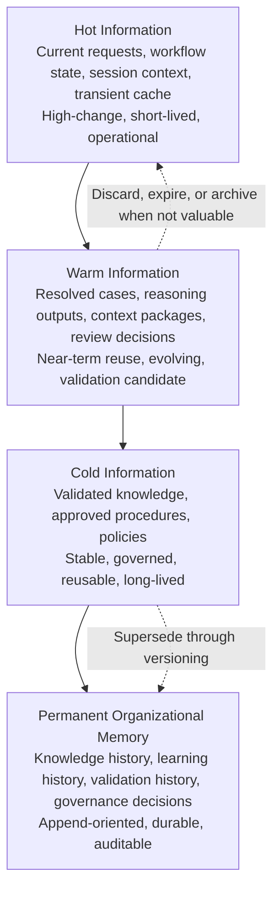
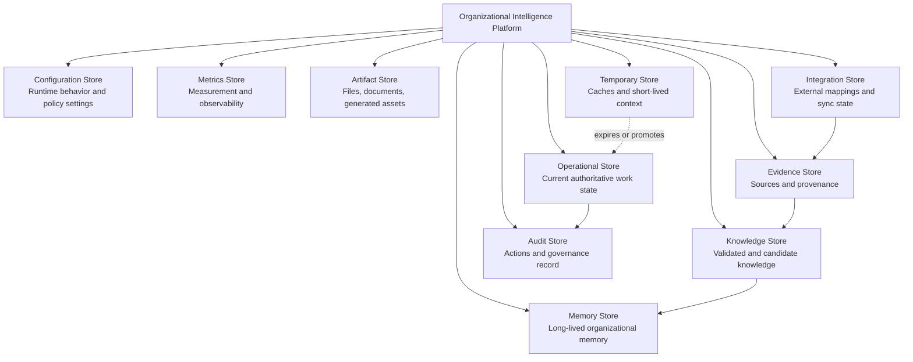
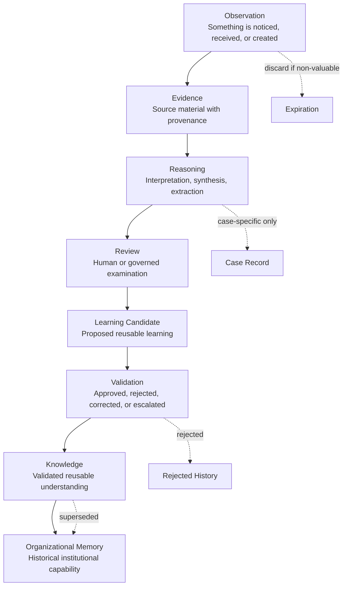

# Storage Architecture

## Derived From

Canon Version: `v1.0.0`

### Primary Canon Documents

- [Founder's Thesis](../canon/00_FOUNDERS_THESIS.md)
- [Product Vision](../canon/01_PRODUCT_VISION.md)
- [Product Principles](../canon/02_PRODUCT_PRINCIPLES.md)
- [Capability Model](../canon/03_PRODUCT_CAPABILITY_MODEL.md)
- [Domain Model](../canon/04_PRODUCT_DOMAIN_MODEL.md)
- [Workflow Model](../canon/05_PRODUCT_WORKFLOW_MODEL.md)
- [AI Cognitive Model](../canon/06_AI_COGNITIVE_MODEL.md)

### Primary Architecture Documents

- [System Architecture](../architecture/07_SYSTEM_ARCHITECTURE.md)
- [AI Agent Architecture](../architecture/08_AI_AGENT_ARCHITECTURE.md)
- [Data Architecture](../architecture/09_DATA_ARCHITECTURE.md)
- [Knowledge Representation](../architecture/10_KNOWLEDGE_REPRESENTATION_MODEL.md)
- [Integration Architecture](../architecture/11_INTEGRATION_ARCHITECTURE.md)

### Primary Implementation Documents

- [MVP Scope](./12_MVP_SCOPE.md)
- [Implementation Architecture](./13_IMPLEMENTATION_ARCHITECTURE.md)
- [Technology Decisions](./14_TECHNOLOGY_DECISIONS.md)
- [API Architecture](./15_API_ARCHITECTURE.md)

---

Status: **Active**

## Primary Question

How should the Organizational Intelligence Platform preserve information, knowledge, memory, and organizational intelligence over time?

This document defines Storage Architecture.

It is not a database schema. It is not an entity relationship diagram. It is not a table definition. It defines the philosophy and architecture of persistence.

## Purpose

The purpose of storage is not merely to save data.

The purpose of storage is to preserve organizational learning.

The platform must distinguish between:

- Transient information.
- Operational state.
- Historical evidence.
- Validated knowledge.
- Organizational memory.

Not every piece of information deserves permanent storage. Some information exists only to complete a request. Some information should be retained for operational continuity. Some information becomes evidence. Some information becomes reusable knowledge. Some information becomes institutional memory.

Storage is therefore a governance concern, not merely an infrastructure concern.

# 1. Introduction

Storage Architecture preserves Organizational Intelligence rather than simply storing application data.

The Organizational Intelligence Platform exists to help an organization learn from work, remember what matters, explain how knowledge was formed, and preserve capability over time. Storage is the architectural mechanism that allows this intelligence to survive individual conversations, employees, AI models, tools, vendors, and technology changes.

A normal application stores records so screens can be rendered and transactions can complete. This platform must do more. It must preserve the relationship between work, evidence, reasoning, review, validation, knowledge, memory, governance, and history.

That means storage must answer questions such as:

- What is temporary and what is durable?
- What is authoritative and what is derived?
- What is evidence and what is interpretation?
- What may evolve and what must remain immutable?
- What is operational state and what is organizational memory?
- What must be retained, reviewed, archived, or deleted?
- What must remain explainable years after the original work occurred?

The storage architecture exists so the platform can answer those questions consistently.

# 2. Storage Principles

## Organizational Memory over Raw Data

The platform should not retain information simply because it can.

Raw data becomes valuable when it contributes to organizational memory, evidence, workflow continuity, governance, measurement, or learning. Storage decisions should prioritize preserved meaning over accumulated volume.

## Single Source of Truth

Each authoritative fact should have one clear owner.

The platform may create read models, caches, indexes, embeddings, summaries, metrics, and derived views, but those representations must not become competing sources of truth. When multiple systems hold related information, ownership must define which system or storage domain is authoritative for each concept.

## Information Has a Lifecycle

Information changes role over time.

An observation may become evidence. Evidence may support reasoning. Reasoning may become a learning candidate. A learning candidate may be validated as knowledge. Knowledge may become organizational memory. Storage must preserve those transitions rather than flattening all information into undifferentiated records.

## Knowledge Is Versioned

Knowledge evolves.

The platform must preserve knowledge versions so the organization can understand what was believed, when it was believed, why it changed, and which evidence or review produced the change. Updating knowledge must not silently erase prior understanding.

## Evidence Is Immutable

Evidence should not be silently rewritten.

Evidence is the basis for explanation, review, and trust. If evidence is corrected, replaced, redacted, or invalidated, that change should be represented as a new state or new version with traceable reason, not as an invisible mutation.

## Auditability by Default

Storage must support auditability for actions that affect work, knowledge, memory, security, governance, and integrations.

Auditability requires actor context, resource context, timestamp, action, outcome, correlation, and relevant policy or workflow state. Audit records should explain what happened without requiring access to implementation internals.

## Traceability Across Time

The platform must preserve relationships across time.

It should be possible to trace from a memory item back to knowledge versions, validation decisions, learning candidates, reasoning outputs, evidence, cases, workflows, reviews, agents, users, and governing policies where appropriate.

## Storage Supports Explainability

Explainability depends on persistence.

An AI answer or workflow recommendation is only explainable if the platform can retrieve the evidence, context, knowledge version, prompt version, reasoning record, validation state, and review history that shaped it. Storage must preserve enough context for meaningful explanation without retaining unnecessary sensitive information.

## Governance Before Retention

Retention should be governed before it is technical.

The decision to retain, archive, redact, anonymize, or delete information should depend on classification, sensitivity, legal obligations, business value, knowledge value, audit requirements, and user trust. Storage engines execute retention policies; they do not define them.

## Separation of Operational and Historical Data

Operational data supports current work. Historical data preserves evidence, learning, audit, and memory.

The platform should not overload operational records with permanent history, and it should not force historical reconstruction from mutable operational state. Operational state may change quickly. Historical records must preserve what happened.

## Storage Principle Matrix

| Principle | Architectural Meaning | Storage Implication |
| --- | --- | --- |
| Organizational Memory over Raw Data | Retain meaning, not noise. | Classify information before retaining it permanently. |
| Single Source of Truth | Authority is explicit. | Derived views never override authoritative stores. |
| Information Has a Lifecycle | Information changes role. | Preserve transitions from observation to memory. |
| Knowledge Is Versioned | Understanding evolves. | Store knowledge history and current views separately. |
| Evidence Is Immutable | Trust depends on stable evidence. | Correct through versioning, redaction, or invalidation records. |
| Auditability by Default | Important actions must be explainable. | Record actors, resources, outcomes, and correlation. |
| Traceability Across Time | Learning must be reconstructable. | Preserve links across work, evidence, knowledge, and memory. |
| Storage Supports Explainability | Answers need sources. | Store provenance, validation, and reasoning context. |
| Governance Before Retention | Policy precedes infrastructure. | Apply classification, sensitivity, and legal rules. |
| Separation of Operational and Historical Data | Current state and history differ. | Use distinct models for active operations and durable history. |

# 3. Information Temperature Model

Information Temperature describes how actively information changes, how quickly it must be accessed, how durable it should be, and how strongly it is governed.

Temperature is conceptual. It does not mandate a specific technology. It helps the platform decide how information should be stored, indexed, governed, and retained.

## Hot Information

Hot Information supports immediate operations.

Examples:

- Current requests.
- Workflow state.
- Session context.
- Temporary reasoning.
- Transient cache.

Characteristics:

- High change frequency.
- Short-lived.
- Operational.
- Latency-sensitive.
- Usually not authoritative as long-term memory.

Hot Information should be durable only when it represents active operational state that must survive interruption. Temporary reasoning and cache content should expire unless promoted into evidence, learning, or audit.

## Warm Information

Warm Information supports near-term reuse, review, and completion.

Examples:

- Resolved Cases.
- Reasoning outputs.
- Context packages.
- Review decisions.

Characteristics:

- Useful for near-term reuse.
- May evolve.
- Subject to validation.
- Often linked to active or recently completed workflows.
- May become evidence or learning input.

Warm Information is often where the platform decides whether something should be forgotten, archived, validated, or promoted.

## Cold Information

Cold Information represents governed reusable knowledge.

Examples:

- Validated Knowledge.
- Approved procedures.
- Organizational policies.
- Expert-reviewed solutions.

Characteristics:

- Stable.
- Governed.
- Reusable.
- Long-lived.
- Versioned.
- Retrieved for future reasoning and human work.

Cold Information should be optimized for trust, retrieval, version history, and explainability rather than rapid mutation.

## Permanent Organizational Memory

Permanent Organizational Memory preserves the historical record of institutional learning.

Examples:

- Knowledge history.
- Learning history.
- Validation history.
- Governance decisions.
- Version history.
- Institutional knowledge.

Characteristics:

- Append-only where appropriate.
- Highly durable.
- Auditable.
- Never silently rewritten.
- Preserved across technology changes.

Permanent Organizational Memory is the most important storage layer conceptually. It is where the platform protects the organization's accumulated intelligence.

## Information Temperature Diagram

# 4. Storage Domains

Storage domains define conceptual responsibility. A storage domain may be implemented by one or more technologies, and one technology may support multiple domains. The boundary is meaning and authority, not product selection.

| Storage Domain | Responsibility |
| --- | --- |
| Operational Store | Preserves current authoritative state for active Cases, Workflows, Organizations, Users, Agents, and platform operations. |
| Knowledge Store | Preserves validated and candidate knowledge objects, knowledge status, confidence, provenance references, and current knowledge views. |
| Memory Store | Preserves long-lived organizational memory, knowledge history, learning history, validation history, and institutional evolution. |
| Evidence Store | Preserves source materials, evidence references, provenance, source metadata, and evidence integrity state. |
| Audit Store | Preserves records of important actions, actors, outcomes, policy decisions, access, governance events, and correlation context. |
| Configuration Store | Preserves runtime configuration, feature state, policy configuration, prompt selection, and environment-specific behavior where appropriate. |
| Metrics Store | Preserves measurements about system health, workflow performance, product behavior, AI behavior, knowledge quality, and operational trends. |
| Artifact Store | Preserves generated files, uploaded documents, exports, attachments, rendered artifacts, and other binary or semi-structured assets. |
| Integration Store | Preserves external references, sync state, provider mappings, inbound/outbound integration status, and external-system correlation. |
| Temporary Store | Preserves short-lived state such as caches, sessions, intermediate reasoning context, and temporary processing artifacts. |

## Storage Domain Diagram

# 5. Information Ownership

Authoritative ownership defines which concept controls the meaning and lifecycle of information.

Ownership does not mean only one module may read information. It means one domain is responsible for defining validity, lifecycle, mutation rules, and source-of-truth semantics.

| Information Relationship | Authoritative Ownership |
| --- | --- |
| Case owns Workflow | A Case defines the bounded work context within which workflow progresses. |
| Workflow owns State | Workflow controls lifecycle status, transitions, tasks, escalation, and completion semantics. |
| Evidence owns Provenance | Evidence controls source, origin, capture context, integrity, and traceability to source systems or artifacts. |
| Knowledge owns Validation | Knowledge controls whether a claim, solution, procedure, or pattern is candidate, validated, superseded, rejected, or approved. |
| Memory owns Historical Evolution | Memory controls the preserved history of how knowledge and institutional understanding changed over time. |
| Governance owns Policy | Governance controls retention rules, access rules, approval rules, classification, and policy decisions. |
| Configuration owns Runtime Behavior | Configuration controls environment and organization-specific behavior without redefining Canon concepts. |
| Metrics own Measurement | Metrics control measurement definitions, observations, aggregation, and reporting context. |

## Ownership Boundaries

Ownership boundaries prevent storage from becoming ambiguous.

- Operational state may reference Evidence, but it does not own Evidence provenance.
- Knowledge may reference Evidence, but it does not rewrite Evidence.
- Memory may preserve Knowledge history, but current Knowledge views should remain clear.
- Audit may reference all domains, but it does not become the primary model for those domains.
- Metrics may summarize behavior, but metrics are not authoritative workflow state.
- Integration mappings may connect external systems, but external provider identifiers should not become platform identity.
- Configuration may influence runtime behavior, but it must not redefine Canon language.

When ownership is unclear, the platform should prefer explicit domain responsibility over storage convenience.

# 6. Information Lifecycle

Information moves through a lifecycle from observation to durable organizational memory.

Not every observation completes the lifecycle. Some observations expire. Some evidence is rejected. Some reasoning is useful only for one Case. Some learning candidates fail validation. The lifecycle exists to preserve meaning when information deserves promotion.

## Lifecycle Diagram

## Lifecycle Transitions

| Transition | Meaning | Storage Responsibility |
| --- | --- | --- |
| Observation to Evidence | Raw input becomes a source that may support future explanation. | Capture provenance, source context, classification, and integrity metadata. |
| Evidence to Reasoning | Evidence is interpreted, summarized, extracted, or connected. | Preserve reasoning context where needed for explainability. |
| Reasoning to Review | AI or system output is placed under human or governed examination. | Preserve review state, reviewer, decision, and correction history. |
| Review to Learning Candidate | A reviewed pattern or answer becomes a proposed reusable learning. | Store candidate status, source Case, evidence, and proposed scope. |
| Learning Candidate to Validation | Candidate is tested against policy, expertise, evidence, and governance rules. | Preserve validation decision, rationale, actor, and timestamp. |
| Validation to Knowledge | Approved learning becomes reusable knowledge. | Create or update knowledge version without erasing history. |
| Knowledge to Organizational Memory | Knowledge becomes part of institutional history and future capability. | Preserve version lineage, provenance, and historical context. |

# 7. Persistence Strategy

Persistence categories describe how different kinds of information should be preserved. They do not mandate specific storage products.

| Persistence Category | Belongs Here | Architectural Concern |
| --- | --- | --- |
| Transactional | Current operational state, Case records, Workflow state, resource metadata, identity references, configuration references. | Consistency, authority, referential integrity, lifecycle correctness. |
| Document | Semi-structured knowledge representations, context packages, extracted document metadata, policy documents, reasoning summaries. | Flexibility, semantic structure, versioning, retrieval. |
| Object | Uploaded files, generated artifacts, attachments, exports, evidence binaries, large source materials. | Durability, content integrity, lifecycle policies, access control. |
| Vector | Embeddings for semantic retrieval over knowledge, evidence, memory, and context. | Semantic search, explainable retrieval, metadata filtering, version alignment. |
| Cache | Short-lived operational acceleration, retrieval results, configuration snapshots, expensive computed views. | Expiration, invalidation, non-authority, performance. |
| Event | Domain events, workflow events, learning events, integration events, audit-linked events. | Time ordering, replay where needed, subscriber decoupling, historical reconstruction. |

## Persistence Decision Matrix

| Information Type | Preferred Category | Reason |
| --- | --- | --- |
| Active Case state | Transactional | Requires consistency and workflow authority. |
| Evidence file | Object | Large or binary source material should not bloat authoritative relational state. |
| Evidence metadata | Transactional or Document | Requires provenance, classification, and traceable reference. |
| Knowledge version | Document and Transactional | Requires semantic representation plus authoritative lifecycle metadata. |
| Embedding | Vector | Supports semantic retrieval while referencing authoritative records. |
| Audit record | Event or Transactional history | Requires durable, append-oriented traceability. |
| Temporary reasoning context | Cache or Temporary | Should expire unless promoted. |
| Integration sync cursor | Transactional | Requires reliable continuation and external correlation. |
| Metrics | Metrics category | Requires time-series or measurement-oriented preservation. |

# 8. Immutability Strategy

Immutability preserves trust.

The platform should distinguish between mutable operational state and immutable or append-oriented historical records. Not every record is immutable, but anything that explains what happened, why it happened, or what knowledge existed at a point in time should not be silently rewritten.

## Information That Must Be Immutable or Append-Oriented

| Information | Immutability Expectation | Reason |
| --- | --- | --- |
| Evidence | Preserve original source or original captured representation where legally permissible. | Evidence anchors explanation and review. |
| Audit Records | Append-only except for governed redaction metadata. | Audit must explain actions and outcomes. |
| Knowledge History | Prior versions must remain recoverable. | Organizational learning requires historical comparison. |
| Validation Decisions | Decisions should be preserved with rationale and actor context. | Trust depends on knowing how knowledge was approved or rejected. |
| Learning History | Candidate lifecycle and outcomes should be retained. | The platform must learn from accepted and rejected learning. |
| Events | Events should represent facts that occurred. | Event history supports reconstruction and downstream learning. |
| Governance Decisions | Policy applications and exceptions should be preserved. | Governance must be accountable. |

## Correcting Immutable Information

Immutability does not mean errors can never be corrected. It means corrections are explicit.

Correction patterns include:

- Superseding a record with a new version.
- Marking a record invalid.
- Adding a correction record.
- Adding redaction metadata.
- Linking to replacement evidence.
- Recording legal deletion or restriction actions.

The platform should never create the illusion that incorrect historical information never existed unless a lawful deletion requirement explicitly requires stronger action.

# 9. Versioning Strategy

Versioning preserves semantic evolution.

The platform must version information whose meaning can change while its history remains important.

## Knowledge Versions

Knowledge versions preserve how validated understanding evolves. A new version should be created when meaning, scope, evidence, confidence, applicability, or governance status materially changes.

## Memory Versions

Memory versions preserve the historical evolution of organizational capability. Memory may reference current knowledge, superseded knowledge, policy changes, validation history, and learning outcomes.

## Configuration Versions

Configuration versions preserve behavior-affecting changes. Configuration changes may alter workflows, feature availability, integration behavior, retention behavior, or AI runtime choices. Important configuration changes should be traceable and reversible where possible.

## Prompt Versions

Prompt versions preserve AI behavior over time. Because prompts influence reasoning, classification, synthesis, and review support, they are part of the storage and audit story. A reasoning output should be traceable to the prompt version that shaped it where appropriate.

## Policy Versions

Policy versions preserve governance context. A decision made under one policy version may need to be explained later even after the policy changes.

## Workflow Definitions

Workflow definitions should be versioned because active Cases may have begun under one workflow definition while future Cases use another. State transitions must remain explainable according to the definition active at the time.

## Semantic Evolution

Semantic evolution should preserve meaning across time.

When concepts evolve, storage should maintain:

- Old meaning.
- New meaning.
- Effective time.
- Migration or mapping rule.
- Affected resources.
- Reviewer or approver.
- Rationale.

Versioning is not only a technical revision number. It is the history of institutional understanding.

# 10. Retention Strategy

Retention determines how long information should remain available, archived, restricted, anonymized, or deleted.

This document does not specify exact time periods. Exact retention periods depend on policy, law, customer requirements, sensitivity, and operational needs.

| Information | Retention Expectation |
| --- | --- |
| Temporary Sessions | Short-lived; expire when no longer needed for active interaction or security continuity. |
| Operational Logs | Retained long enough for support, diagnostics, security review, and operational trend analysis. |
| Cases | Retained according to business value, customer policy, audit needs, and knowledge contribution. |
| Knowledge | Long-lived when validated and reusable; superseded through versioning rather than silent deletion. |
| Memory | Long-lived or permanent where it represents institutional learning and governance history. |
| Audit | Retained according to governance, legal, security, and compliance requirements. |
| Evidence | Retained according to source sensitivity, legal requirements, knowledge value, and review needs. |
| Metrics | Retained at different granularities for operational, product, and strategic analysis. |
| Archived Artifacts | Retained according to artifact value, legal needs, customer policy, and cost. |

## Retention Decision Factors

Retention decisions should consider:

- Information classification.
- Sensitivity and PII.
- Legal or contractual obligations.
- Audit requirements.
- Knowledge value.
- Evidence value.
- Customer policy.
- Operational value.
- Cost.
- Risk of retaining unnecessary information.
- Risk of losing institutional memory.

Retention is successful when it preserves what the organization needs to remember and safely removes what it should not keep.

# 11. Retrieval Strategy

Retrieval exists because storage is only useful if the right information can be found with the right context and authority.

## Fast Operational Retrieval

Fast operational retrieval supports active work such as loading current Cases, Workflow state, Notifications, Reviews, and Configuration. It prioritizes latency, correctness, and authorization.

## Knowledge Retrieval

Knowledge retrieval supports reuse of validated knowledge, procedures, policies, solutions, and patterns. It prioritizes relevance, validation state, governance status, applicability, and version awareness.

## Semantic Retrieval

Semantic retrieval supports conceptually related search across Knowledge, Evidence, Memory, and context. It should be grounded by metadata, authority, and explainability rather than pure similarity alone.

## Historical Retrieval

Historical retrieval supports reconstruction of what was known, decided, reviewed, or validated at a point in time. It prioritizes version history, event history, and provenance.

## Governance Retrieval

Governance retrieval supports policy review, approval history, classification review, retention review, and exception handling. It prioritizes accountability and policy context.

## Audit Retrieval

Audit retrieval supports security, compliance, support, and incident investigation. It prioritizes actor, action, resource, timestamp, outcome, correlation, and traceability.

## Retrieval Decision Matrix

| Retrieval Need | Primary Goal | Required Context |
| --- | --- | --- |
| Operational | Continue active work. | Current state, actor authorization, workflow status. |
| Knowledge | Reuse validated understanding. | Validation state, scope, evidence, version. |
| Semantic | Find related meaning. | Embeddings, metadata filters, source references. |
| Historical | Reconstruct past understanding. | Effective time, versions, events, prior policies. |
| Governance | Review policy and approval. | Classification, reviewer, policy version, decision rationale. |
| Audit | Investigate action and outcome. | Actor, timestamp, resource, correlation, outcome. |

# 12. Caching Strategy

Caches accelerate access. They never become the source of truth.

Caching may be used to improve performance, reduce repeated computation, and protect downstream systems. Cached information must be invalidated, refreshed, or expired according to the authority and lifecycle of the underlying information.

## Operational Cache

Operational caches may accelerate active resource reads, permissions, workflow views, and frequently accessed metadata. They must respect authorization and tenant boundaries.

## Reasoning Cache

Reasoning caches may avoid repeating expensive AI reasoning when the same context, prompt version, model capability, and evidence set produce a reusable result. Reasoning cache entries must include enough context to avoid returning stale or unauthorized outputs.

## Retrieval Cache

Retrieval caches may accelerate common knowledge searches, semantic queries, and context assembly. They must be invalidated when relevant Knowledge, Evidence, Memory, permissions, or governance state changes.

## Configuration Cache

Configuration caches may accelerate runtime behavior decisions. They must refresh safely after configuration, policy, or feature flag changes.

## Cache Invalidation

Cache invalidation should be driven by ownership and events.

When authoritative information changes, derived caches should expire or refresh. If the platform cannot safely determine invalidation, it should prefer shorter lifetimes or no cache for governed information.

Caching must never hide updated governance decisions, access changes, evidence corrections, knowledge supersession, or policy changes.

# 13. Backup and Recovery

Backup and recovery protect the platform's ability to preserve organizational intelligence after failure.

## Recovery

Recovery means restoring the platform to a trustworthy state after accidental deletion, corruption, infrastructure failure, software defect, operator mistake, security incident, or disaster.

Recovery must protect both current operation and historical memory.

## Durability

Durability expectations differ by storage domain. Operational state, Evidence, Audit, Knowledge, and Memory require stronger durability than temporary caches. The most durable information is information required to reconstruct organizational learning and governance.

## Replication

Replication may protect against localized failure and improve availability. Replication must preserve consistency expectations and should not create ambiguous authority between copies.

## Snapshots

Snapshots provide point-in-time recovery. They are useful for restoring stores, investigating historical state, and protecting against corruption. Snapshot strategy should align with retention, sensitivity, and legal requirements.

## Disaster Recovery

Disaster recovery addresses large-scale infrastructure failure. It should define how the platform restores service, data, evidence, memory, and auditability after severe disruption.

## Consistency

Recovery must consider consistency across storage domains. Restoring an Operational Store without related Evidence, Audit, Memory, or Artifact references may create misleading state. Cross-domain recovery planning is essential.

## Recovery Objectives

Recovery objectives should define acceptable data loss and restoration time for each storage domain. This document does not specify exact values, but the highest priority should be information required for organizational memory, governance, evidence, and active work continuity.

# 14. Data Governance

Data Governance defines how information is owned, classified, protected, retained, approved, and traced.

## Ownership

Every important information type should have an owning domain responsible for authority, lifecycle, mutation rules, and retention expectations.

## Classification

Information should be classified according to sensitivity, business value, knowledge value, evidence value, and governance obligations. Classification influences retention, access, retrieval, audit, and deletion.

## Sensitivity

Sensitive information requires stricter access, logging, masking, retention, and deletion policies. Sensitivity should be explicit rather than inferred from storage location.

## Retention

Retention rules should be governed by policy, law, customer expectations, and organizational value. Retention must balance memory preservation with privacy, security, cost, and legal obligations.

## Deletion

Deletion should be controlled, audited, and policy-driven. For immutable or historical records, deletion may mean redaction, restriction, tombstoning, anonymization, or legal erasure depending on obligation.

## Legal Considerations

Legal requirements may affect evidence retention, audit retention, PII handling, deletion, export, e-discovery, and customer-specific data handling. Storage architecture must allow policy-driven variation without redefining domain concepts.

## Knowledge Approval

Knowledge should not become authoritative memory without validation and approval appropriate to its scope and impact. Storage must preserve approval state and reviewer context.

## Policy Enforcement

Policy enforcement should occur at storage access, API access, workflow transition, integration boundary, and retrieval time. Storage should support policy enforcement without embedding policy logic in every consumer.

## Traceability

Traceability links information across its lifecycle. Governance requires the ability to trace from Memory back to Knowledge, Validation, Learning Candidate, Review, Reasoning, Evidence, Case, User, Agent, and Policy where appropriate.

# 15. Storage Evolution

Storage technologies may change while preserving information meaning.

The platform may add storage technologies, migrate databases, split storage domains, scale storage, move archives, change search infrastructure, or replace vendors. Those changes are acceptable only if they preserve domain semantics, authority, history, traceability, and governance.

## Evolution Scenarios

| Scenario | Acceptable If |
| --- | --- |
| Adding storage technologies | The new technology has a clear domain responsibility and does not create competing authority. |
| Migrating databases | Data meaning, identifiers, history, references, and governance are preserved. |
| Splitting storage | Ownership boundaries become clearer, not weaker. |
| Scaling storage | Performance improves without sacrificing consistency, auditability, or explainability. |
| Archive migration | Historical retrieval, retention rules, and legal obligations remain intact. |
| Technology replacement | The platform preserves Canon concepts and storage contracts across the change. |

## Evolution Principles

Storage evolution should follow these principles:

1. Concepts are more durable than technologies.
2. Authority must remain explicit during migration.
3. History must not be silently compressed away.
4. Evidence and audit must remain trustworthy.
5. Retrieval behavior must remain explainable.
6. Governance rules must survive infrastructure changes.
7. Consumers should not need to understand storage migration details.

The storage architecture is healthy when it allows infrastructure to evolve without changing what the organization knows.

# 16. Traceability Matrix

| Canon Concept | Storage Responsibility |
| --- | --- |
| Organizational Memory | Memory Store preserves durable institutional learning and historical evolution. |
| Knowledge Flywheel | Information Lifecycle promotes Evidence, Reasoning, Review, Learning Candidates, Validation, Knowledge, and Memory. |
| Explainability | Evidence Store, Audit Store, version history, and provenance support reconstruction of decisions and AI outputs. |
| Governance | Immutable history, policy versions, audit records, classification, and retention controls preserve accountability. |
| Human Review | Review records, Validation decisions, reviewer context, and correction history preserve human judgment. |
| Learning | Versioned Knowledge and Memory preserve accepted, rejected, superseded, and improved learning. |
| Domain Model | Storage domains preserve Case, Workflow, Evidence, Knowledge, Memory, User, Agent, Organization, and Governance concepts. |
| Workflow Model | Operational Store and Event history preserve state transitions and lifecycle context. |
| AI Cognitive Model | Prompt versions, reasoning context, retrieval sources, and validation records preserve AI behavior accountability. |
| Product Vision | Storage preserves capability beyond individual workers, tools, conversations, and technology changes. |
| Product Principles | Storage decisions favor clarity, trust, traceability, replaceability, and governed evolution. |
| Data Architecture | Ownership, authority, lifecycle, and persistence categories realize logical data responsibilities. |
| API Architecture | Storage supports stable resources, response explainability, long-running operations, and audit-backed contracts. |

# 17. What This Document Does NOT Define

This document intentionally excludes:

- Database schema.
- Entity relationship diagrams.
- SQL.
- Indexes.
- Query optimization.
- Storage engines.
- Cloud storage vendors.
- Table definitions.
- Migration scripts.
- ORM configuration.
- Physical partitioning.
- Exact backup schedules.
- Exact retention periods.
- Vendor-specific archival products.

These belong to implementation artifacts, later detailed documents, or operational runbooks.

# 18. Closing

Storage Architecture preserves Organizational Intelligence.

Technology stores bytes.

The platform stores organizational capability.

Every persistence decision should therefore be evaluated according to one question:

> Does this preserve organizational intelligence across time?

If the answer is yes, the storage architecture is fulfilling its purpose. If the answer is no, the platform may be accumulating data without preserving memory.

The goal is not to store everything forever. The goal is to preserve the right information, with the right authority, for the right reason, in a form that remains explainable, governed, and useful as the organization learns.
