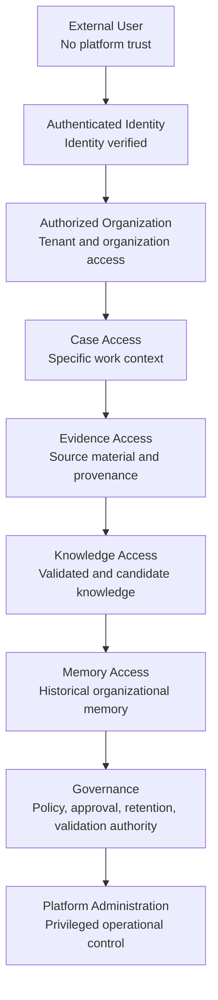
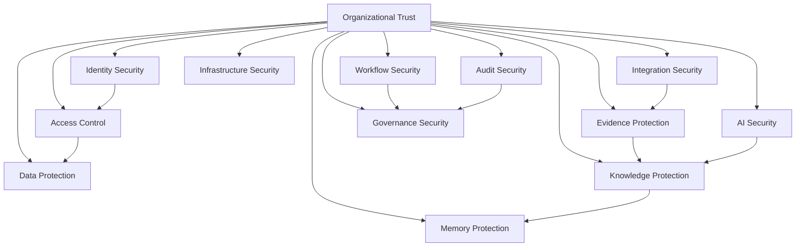
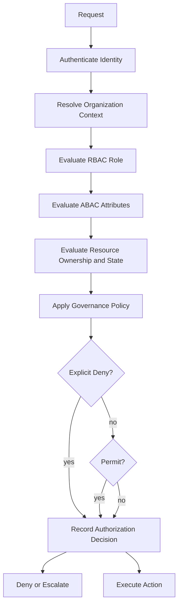
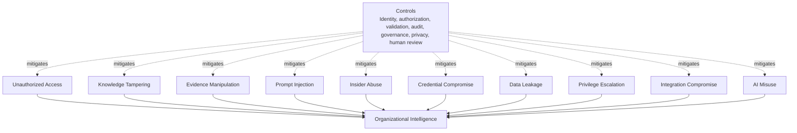

# Security Architecture

## Derived From

Canon Version: `v1.0.0`

### Primary Canon Documents

- [Founder's Thesis](../canon/00_FOUNDERS_THESIS.md)
- [Product Vision](../canon/01_PRODUCT_VISION.md)
- [Product Principles](../canon/02_PRODUCT_PRINCIPLES.md)
- [Capability Model](../canon/03_PRODUCT_CAPABILITY_MODEL.md)
- [Domain Model](../canon/04_PRODUCT_DOMAIN_MODEL.md)
- [Workflow Model](../canon/05_PRODUCT_WORKFLOW_MODEL.md)
- [AI Cognitive Model](../canon/06_AI_COGNITIVE_MODEL.md)

### Primary Architecture Documents

- [System Architecture](../architecture/07_SYSTEM_ARCHITECTURE.md)
- [AI Agent Architecture](../architecture/08_AI_AGENT_ARCHITECTURE.md)
- [Data Architecture](../architecture/09_DATA_ARCHITECTURE.md)
- [Knowledge Representation](../architecture/10_KNOWLEDGE_REPRESENTATION_MODEL.md)
- [Integration Architecture](../architecture/11_INTEGRATION_ARCHITECTURE.md)

### Primary Implementation Documents

- [MVP Scope](./12_MVP_SCOPE.md)
- [Implementation Architecture](./13_IMPLEMENTATION_ARCHITECTURE.md)
- [Technology Decisions](./14_TECHNOLOGY_DECISIONS.md)
- [API Architecture](./15_API_ARCHITECTURE.md)
- [Storage Architecture](./16_STORAGE_ARCHITECTURE.md)
- [Deployment Architecture](./17_DEPLOYMENT_ARCHITECTURE.md)

---

Status: **Active**

## Primary Question

How should the Organizational Intelligence Platform preserve the confidentiality, integrity, availability, explainability, governance, and trustworthiness of organizational intelligence?

This document defines Security Architecture.

It is not a penetration testing guide. It is not a security operations manual. It is not an infrastructure hardening checklist. It defines how trust is preserved throughout the platform.

## Purpose

Security exists to protect Organizational Intelligence.

The platform must preserve:

- Trust.
- Integrity.
- Accountability.
- Explainability.
- Governance.
- Privacy.
- Resilience.

Security should be invisible during normal operation, but foundational to every architectural decision. Security is not an isolated subsystem. It is a cross-cutting architectural capability.

# 1. Introduction

Organizational Intelligence is the primary asset being protected.

The platform does not merely contain data. It contains evidence, reasoning, memory, knowledge history, workflow decisions, validation records, review outcomes, policies, governance decisions, AI behavior, and institutional learning. If these assets are exposed, corrupted, manipulated, or made unexplainable, the platform loses its purpose even if the application remains technically available.

The security goal is therefore broader than preventing unauthorized access.

Security must preserve institutional trust in:

- Knowledge.
- Memory.
- Evidence.
- Workflow state.
- Human review.
- AI reasoning.
- Governance decisions.
- Audit history.
- Integration boundaries.

A secure Organizational Intelligence Platform is one where authorized people and systems can rely on the platform's knowledge, understand how that knowledge was formed, verify that evidence has not been silently changed, and trust that decisions were made under governed rules.

# 2. Security Principles

## Security by Design

Security must be part of architecture, API contracts, storage models, workflows, integrations, and AI behavior from the beginning.

Security by Design means the platform does not first expose capabilities and then attempt to protect them. Capabilities should be designed with identity, authorization, audit, privacy, validation, and abuse resistance already present.

## Least Privilege

Every human, agent, service, integration, and administrator should have only the permissions needed for its role and current purpose.

Least privilege applies to users, AI agents, background workers, integrations, service identities, administrative actions, and data access. Broad access should be rare, justified, time-bounded where possible, and auditable.

## Zero Trust

No actor, network location, integration, service, or request should be trusted implicitly.

Every boundary crossing should verify identity, authorization, context, policy, and resource access. Internal calls still require accountability. Authenticated does not mean authorized. Authorized for one Organization does not mean authorized for another. Authorized for a Case does not mean authorized for all Evidence or Memory.

## Defense in Depth

Security should use multiple reinforcing controls.

Authentication, authorization, validation, audit, encryption concepts, rate limiting, input filtering, workflow approval, human review, anomaly detection, and governance all protect different failure modes. No single control should be assumed sufficient.

## Explicit Trust Boundaries

Trust boundaries must be visible in the architecture.

The platform should know when a request crosses from unauthenticated to authenticated, from authenticated to authorized, from organization access to Case access, from Case access to Evidence access, from Evidence access to Knowledge access, from Knowledge access to Memory access, and from ordinary access to governance or administration.

## Secure by Default

Default behavior should deny access, minimize exposure, require explicit opt-in, and avoid risky assumptions.

New resources, integrations, AI tools, prompts, workflows, and APIs should not become broadly accessible by default. A missing policy should result in safe failure, not accidental access.

## Explainability Preservation

Security must preserve explainability.

Security controls should not destroy the ability to understand why a decision was made, which evidence was used, which actor approved it, which policy applied, or which AI prompt version influenced it. Redaction and access control may limit who can see details, but the platform should preserve traceable explanation for authorized review.

## Governance Before Convenience

Convenience must not bypass governance.

Fast workflows, AI automation, integration sync, and administrative shortcuts must still respect review, validation, approval, classification, retention, and audit rules. The platform should make governed paths efficient rather than creating hidden ungoverned paths.

## Auditability by Default

Important actions should produce audit records by default.

Auditability is required for access, administrative changes, policy decisions, Knowledge changes, Memory changes, Evidence access, Review decisions, integration activity, AI-assisted decisions, and security events.

## Privacy by Design

The platform should minimize, classify, protect, and purpose-limit personal and sensitive information.

Privacy is not only a legal constraint. It is part of trust. Users and organizations must believe the platform preserves intelligence without unnecessarily exposing people.

## Fail Secure

When the platform cannot determine whether an action is safe, it should deny, pause, escalate, or require review.

Failure modes should not grant access, skip audit, expose sensitive information, promote unvalidated knowledge, or hide governance exceptions.

## Separation of Duties

No single actor should control every step of sensitive knowledge, governance, security, or administrative workflows.

Separation of duties reduces insider risk and protects the integrity of approval, validation, deployment, configuration, and incident-response decisions.

## Security Principle Matrix

| Principle | Architectural Meaning | Platform Implication |
| --- | --- | --- |
| Security by Design | Security is built into capabilities. | APIs, storage, workflows, AI, and integrations include controls from the start. |
| Least Privilege | Access is narrow and purposeful. | Users, agents, services, and integrations receive only required permissions. |
| Zero Trust | Trust is continuously verified. | Internal and external calls require identity, authorization, and accountability. |
| Defense in Depth | Controls reinforce each other. | Multiple layers protect data, workflows, AI, and operations. |
| Explicit Trust Boundaries | Boundary crossings are visible. | Every privilege step requires additional authorization. |
| Secure by Default | Unsafe access is not the default. | Missing policy denies or escalates. |
| Explainability Preservation | Security must not erase accountability. | Evidence, audit, provenance, and decision context remain traceable. |
| Governance Before Convenience | Convenience cannot bypass policy. | Review, validation, and approval remain enforced. |
| Auditability by Default | Important actions are recorded. | Security, knowledge, evidence, and governance events are auditable. |
| Privacy by Design | Sensitive data is minimized and protected. | PII is classified, masked, retained, and deleted by policy. |
| Fail Secure | Uncertainty does not grant access. | Ambiguous requests deny, pause, or escalate. |
| Separation of Duties | Sensitive control is distributed. | Approval and administration require distinct authority where appropriate. |

# 3. Trust Boundary Model

Trust Boundaries define conceptual levels of access and accountability.

Each boundary requires additional authorization, policy evaluation, and auditability. Crossing one boundary does not imply permission to cross the next.

## Boundary Expectations

| Boundary | Required Evaluation |
| --- | --- |
| External User to Authenticated Identity | Identity proof, session integrity, authentication strength, risk context. |
| Authenticated Identity to Authorized Organization | Tenant membership, organization role, account status, policy constraints. |
| Authorized Organization to Case Access | Case permission, assignment, role, workflow state, sensitivity. |
| Case Access to Evidence Access | Evidence classification, need to know, source restrictions, legal constraints. |
| Evidence Access to Knowledge Access | Knowledge visibility, validation state, scope, governance status. |
| Knowledge Access to Memory Access | Historical sensitivity, retention policy, version access, organizational scope. |
| Memory Access to Governance | Policy authority, approval role, separation of duties, audit accountability. |
| Governance to Platform Administration | Elevated privilege, operational approval, security review, administrative audit. |

# 4. Security Domains

Security domains define conceptual areas of responsibility. They may be implemented by multiple modules, policies, or operational controls.

| Security Domain | Responsibility |
| --- | --- |
| Identity Security | Establishes and protects human, service, machine, and agent identity. |
| Access Control | Determines what authenticated actors may do within Organizations, Cases, Knowledge, Memory, and administration. |
| Data Protection | Protects Operational Data, Evidence, Knowledge, Memory, Audit, Artifacts, Configuration, Secrets, and PII. |
| Knowledge Protection | Preserves integrity, validation state, visibility, version history, and approved use of Knowledge. |
| Memory Protection | Protects historical organizational memory from unauthorized access, silent mutation, and ungoverned deletion. |
| Evidence Protection | Protects source materials, provenance, chain of custody, classification, and evidence integrity. |
| Workflow Security | Enforces secure transitions, approval, escalation, delegation, review, and learning promotion. |
| AI Security | Protects prompts, context, model interactions, outputs, provider boundaries, and human approval paths. |
| Integration Security | Protects external APIs, webhooks, credentials, sync state, third-party access, and provider mappings. |
| Infrastructure Security | Protects runtime environments, network boundaries, deployment surfaces, service identities, and operational foundations conceptually. |
| Governance Security | Protects policy ownership, approvals, exceptions, retention, compliance, and administrative accountability. |
| Audit Security | Protects audit records, security events, correlation, traceability, and tamper resistance. |

## Security Domain Diagram

# 5. Identity and Authentication

Identity is the foundation of accountability.

The platform must identify humans, services, machines, integrations, and AI agents clearly enough to enforce access, preserve auditability, and explain decisions.

## Identity

An identity represents an actor that can request access, perform actions, make decisions, trigger workflows, produce outputs, or operate infrastructure. Identities should be stable, traceable, and scoped to the appropriate Organization and role.

## Authentication

Authentication verifies that an actor is who or what it claims to be. Authentication should be strong enough for the sensitivity of the action and should remain vendor-neutral in the platform architecture.

## Session Management

Sessions should preserve authenticated continuity without becoming hidden authorization. Session lifetime, renewal, revocation, inactivity, and risk changes should be governed according to sensitivity and trust level.

## Service Identities

Internal services and background workers should use service identities. Service identities should be purpose-specific and limited to required capabilities. Shared broad service credentials should be avoided.

## Machine Identities

Machine identities represent non-human runtime actors such as deployment systems, workers, schedulers, and infrastructure automation. They require strong accountability because they may operate at high privilege.

## Federation

Federation allows external identity authorities to authenticate users while the platform preserves internal authorization and governance. Federated identity should not let external roles redefine platform domain permissions without mapping and policy review.

## Multi-Factor Authentication

Multi-factor authentication should be required or strongly preferred for sensitive roles, administrative actions, governance approvals, and high-risk access. Requirements may vary by policy and context.

## Single Sign-On

Single Sign-On can improve usability and centralized identity governance. The platform should support SSO conceptually while preserving its own authorization model, audit requirements, and Organization boundaries.

# 6. Authorization Model

Authorization determines whether an authenticated actor may perform a specific action on a specific resource in a specific context.

Authentication answers who the actor is. Authorization answers what the actor may do.

## Authorization Philosophy

Authorization should be layered, contextual, and explicit. The platform should combine Role-Based Access Control, Attribute-Based Access Control, resource ownership, organization boundaries, workflow state, knowledge visibility, and governance policy.

## Role-Based Access Control

RBAC assigns permissions based on roles such as user, reviewer, administrator, governance owner, integration actor, or operational actor.

RBAC provides understandable coarse-grained access, but it is not sufficient by itself for a knowledge platform because access often depends on resource sensitivity, workflow state, ownership, and policy.

## Attribute-Based Access Control

ABAC evaluates attributes such as Organization, Case assignment, resource classification, actor type, workflow state, sensitivity level, region, policy version, or review requirement.

ABAC allows authorization to reflect organizational context and governance rules.

## Resource Ownership

Resources should define ownership and stewardship. A Case may have owners, assignees, reviewers, or observers. Evidence may have source restrictions. Knowledge may have scope and validation ownership. Memory may have governance ownership.

## Organization Boundaries

Organization boundaries are hard security boundaries. Access to one Organization does not imply access to another. Cross-organization access must be explicit, governed, and auditable.

## Case-Level Permissions

Case access should be specific to role, assignment, workflow state, sensitivity, and purpose. Case access should not automatically grant unrestricted Evidence, Knowledge, or Memory access.

## Knowledge Visibility

Knowledge visibility should depend on validation state, classification, organization scope, policy, and actor role. Candidate Knowledge may require stricter access than approved Knowledge.

## Administrative Privileges

Administrative privileges should be limited, monitored, reviewed, and separated by function where appropriate. Administrative access does not automatically imply permission to view sensitive Evidence, Memory, or private Knowledge.

## Policy Enforcement

Policy enforcement should occur at API boundaries, application services, workflow transitions, retrieval operations, storage access, integrations, and administrative actions.

## Authorization Inheritance

Authorization may inherit from Organization to Case, Case to Workflow, or Case to Evidence only when the policy explicitly defines that inheritance. Inheritance should be understandable and auditable.

## Explicit Denial

Explicit denial should override inherited or role-based permission. If policy, sensitivity, legal restriction, or governance state denies access, broader permissions should not bypass that denial.

## Authorization Flow Diagram

# 7. Data Protection

Data Protection preserves confidentiality, integrity, availability, and appropriate use across information types.

## Operational Data

Operational Data includes active Cases, Workflow state, resource metadata, assignments, and current application state. It requires access control, consistency, auditability, backup, and protection against unauthorized mutation.

## Evidence

Evidence requires provenance, classification, integrity protection, access control, and traceability. Evidence should not be silently modified because it anchors explanation and validation.

## Knowledge

Knowledge requires protection of validation state, version history, scope, visibility, confidence, and source references. Unauthorized or silent knowledge modification directly damages Organizational Intelligence.

## Memory

Memory requires durable integrity, historical preservation, governed access, and protection from unapproved deletion or rewriting. Memory is among the platform's highest-value assets.

## Audit

Audit records require tamper resistance, restricted access, durable retention, and searchability for authorized investigation. Audit records should not expose more sensitive detail than necessary.

## Artifacts

Artifacts include uploaded files, generated documents, exports, attachments, and evidence binaries. They require classification, access control, lifecycle management, and safe sharing rules.

## Configuration

Configuration can affect runtime behavior, policy enforcement, integrations, prompts, and security posture. Configuration changes require authorization, versioning, validation, and audit.

## Secrets

Secrets must be protected from exposure in code, logs, errors, prompts, documentation, telemetry, and user interfaces. Secrets should be scoped, rotated, and accessible only to identities that require them.

## PII

Personally identifiable information requires classification, minimization, masking, purpose limitation, retention control, and governed deletion or anonymization where required.

## Encryption Concepts

Encryption should protect sensitive information in transit and at rest where appropriate. This document does not specify algorithms. Encryption must be paired with access control, key governance, audit, and operational discipline.

## Classification

Classification determines sensitivity, access, masking, retention, retrieval, sharing, and audit requirements. Classification should travel with information as it moves from Evidence to Knowledge to Memory where appropriate.

## Masking

Masking should reduce exposure of sensitive values in responses, logs, audit views, support tools, and AI context packages. Masking must not destroy authorized traceability.

## Data Minimization

The platform should collect, retain, transmit, and expose only the information needed for the purpose. Data minimization reduces risk while preserving meaningful Organizational Intelligence.

# 8. Knowledge Integrity

Knowledge Integrity protects the trustworthiness of what the platform remembers and recommends.

The platform must prevent silent modification of:

- Knowledge Versions.
- Validation History.
- Memory.
- Governance Decisions.
- Prompt Versions.
- Evidence Provenance.

## Knowledge Versions

Knowledge Versions must preserve prior meaning. New understanding should supersede or amend previous versions rather than overwrite them invisibly.

## Validation History

Validation History records how Knowledge became trusted, rejected, corrected, or escalated. It should include decision context, review state, actor, timestamp, policy context, and rationale where appropriate.

## Memory

Memory should preserve long-term institutional learning. Mutation of Memory requires governance and must leave traceable history.

## Governance Decisions

Governance Decisions define why access, retention, approval, or exception behavior occurred. These decisions should be protected as security-relevant records.

## Prompt Versions

Prompt Versions influence AI behavior. Changes to prompts should be versioned, reviewed, and traceable so reasoning outputs can be explained later.

## Evidence Provenance

Evidence Provenance protects the source, capture context, chain of custody, and integrity of Evidence. Without provenance, knowledge cannot be fully trusted.

## Integrity Verification

Integrity verification should conceptually support:

- Detecting unauthorized modification.
- Comparing current and historical versions.
- Reconstructing decision lineage.
- Validating evidence references.
- Confirming prompt and policy versions.
- Identifying gaps in audit or provenance.

The goal is not only to detect tampering, but to preserve confidence in institutional memory.

# 9. AI Security

AI Security protects the cognitive layer of the platform.

AI capabilities can accelerate learning, retrieval, synthesis, classification, and review. They can also introduce prompt injection, data leakage, hallucination, provider dependency, unauthorized tool use, and ungoverned knowledge changes. AI Security ensures intelligence remains accountable.

## Prompt Protection

Prompts are engineering assets and governance artifacts. They should be protected from unauthorized modification, accidental disclosure, injection, and unreviewed drift.

## Model Abstraction

Model abstraction prevents one provider from defining platform intelligence. Provider-specific capabilities should remain behind adapters, and security controls should apply consistently across providers.

## Prompt Versioning

Prompt Versioning allows AI behavior to be traced over time. Reasoning records should reference prompt versions where relevant to explanation, review, or audit.

## Output Validation

AI outputs should be validated before they affect Knowledge, Memory, Workflow transitions, or governed decisions. Validation may include rule checks, evidence grounding, confidence evaluation, human review, and policy enforcement.

## Hallucination Mitigation

Hallucination risk should be reduced through grounded retrieval, source citation, Evidence linkage, confidence boundaries, refusal behavior, human approval, and clear distinction between facts, inference, and recommendation.

## Human Approval

Human approval is required where AI output changes Knowledge, promotes Learning Candidates, affects sensitive workflows, or creates governance impact. AI may assist, but governed authority remains explicit.

## Provider Isolation

Provider interactions should be isolated through adapters that control payloads, credentials, logging, retention assumptions, and output handling. External model providers should not receive unnecessary sensitive context.

## Context Protection

Context packages sent to AI models should be minimized, classified, authorized, and auditable. Sensitive Evidence, PII, secrets, and restricted Memory should not be included unless explicitly permitted.

## Prompt Injection Awareness

The platform must treat external content, user submissions, documents, emails, chat messages, and integration data as potentially adversarial. Prompt injection mitigation should include instruction hierarchy, content isolation, tool permission checks, output validation, and human review for sensitive effects.

## AI Security Alignment

AI Security aligns with Organizational Intelligence by ensuring that AI accelerates learning without corrupting Memory, bypassing Governance, exposing sensitive information, or presenting unsupported claims as truth.

# 10. Workflow Security

Workflow Security ensures that work changes state only through authorized, governed transitions.

Security must apply across:

- Approval workflows.
- Escalation.
- Case ownership.
- Delegation.
- Review.
- Learning.
- Knowledge promotion.

## Approval Workflows

Approvals should verify actor authority, separation of duties, resource sensitivity, workflow state, and policy requirements.

## Escalation

Escalation should preserve context, audit, and access boundaries. Escalating a Case should not expose unrelated Evidence, Knowledge, or Memory.

## Case Ownership

Case owners may control work coordination but should not automatically control every Evidence item, Knowledge item, or governance decision connected to the Case.

## Delegation

Delegation must be explicit, scoped, time-bound where appropriate, and auditable. Delegated authority should not exceed the delegator's permitted authority.

## Review

Review decisions should be protected, auditable, and attributable. Reviewers should have appropriate authority and access to necessary Evidence without overexposure.

## Learning

Learning workflows should prevent unvalidated patterns from becoming trusted Knowledge. Candidate learning requires review, validation, provenance, and governance.

## Knowledge Promotion

Knowledge promotion from candidate to validated Knowledge is a security-sensitive transition. It affects future reasoning and organizational behavior and therefore requires policy enforcement and audit.

## Transition Authorization

Authorization must be evaluated during state transitions, not only when resources are read. A user may be able to view a Case but not approve it, promote learning from it, export it, delete it, or attach sensitive Evidence.

# 11. Integration Security

Integration Security protects the platform where it exchanges information with external systems.

External integrations include:

- External APIs.
- Webhooks.
- Credentials.
- Secrets.
- Third-party providers.
- CRM integrations.
- Document systems.
- Email.
- Chat.
- Identity providers.

## External APIs

External API access should be authenticated, authorized, rate-limited, validated, and audited. External APIs should expose platform concepts rather than implementation details.

## Webhooks

Webhooks should verify origin, authenticity, replay safety, payload integrity, and authorization. Webhook processing should be idempotent where duplicate delivery is possible.

## Credentials and Secrets

Integration credentials and secrets should be scoped to required actions, stored securely, rotated, and never exposed through logs, errors, prompts, or documentation examples.

## Third-Party Providers

Third-party provider access should be governed by least privilege, data minimization, contract expectations, auditability, and provider isolation. External providers should not define Canon concepts.

## CRM, Document, Email, and Chat Integrations

Business-system integrations may contain sensitive customer, employee, project, and organizational information. The platform should normalize incoming data into Evidence, Case, Workflow, Knowledge, or Integration records without inheriting unsafe external assumptions.

## Identity Providers

Identity providers authenticate actors, but the platform retains responsibility for authorization, Organization boundaries, governance, audit, and resource policy.

## Least Privilege for Integrations

Each integration should have the narrowest permissions required for its purpose. An integration that reads documents should not administer users. An AI provider adapter should not access unrelated Evidence. A webhook sender should not receive broad query capability.

# 12. Audit and Accountability

Auditability preserves trust by making important actions traceable.

Audit is not merely operational logging. It is the governed record of who did what, when, to which resource, under what policy, and with what outcome.

## Audit Logging

Audit logs should record security-relevant and governance-relevant activity in a durable, searchable, protected form.

## Traceability

Traceability should link actions to identities, resources, Cases, Evidence, Knowledge, Memory, Workflows, policies, prompts, integrations, and outcomes where appropriate.

## Correlation IDs

Correlation IDs connect API requests, background jobs, events, logs, traces, audit records, and support workflows. They allow the platform to reconstruct activity across components.

## Security Events

Security events include authentication events, authorization decisions, denied access, privilege changes, policy changes, suspicious activity, secret changes, integration failures, and administrative actions.

## Policy Decisions

Policy decisions should be auditable when they affect access, retention, deletion, approval, classification, or knowledge promotion.

## Administrative Actions

Administrative actions require strong auditability because they may affect security posture, configuration, users, integrations, policies, or operational behavior.

## Knowledge Changes

Knowledge changes must be attributable, versioned, and linked to validation and evidence. Unauthorized or unexplained knowledge changes are direct threats to Organizational Intelligence.

## Review History

Review History preserves human judgment and accountability. It should include reviewer, decision, rationale, timestamp, policy context, and affected resources where appropriate.

## Evidence Access

Evidence access should be auditable because Evidence may contain sensitive source material and directly supports knowledge trust.

# 13. Privacy

Privacy protects people while allowing the organization to learn responsibly.

## PII

PII should be identified, classified, minimized, masked, retained, exported, and deleted according to policy and legal requirements.

## Sensitive Information

Sensitive information may include personal data, customer data, confidential business information, credentials, restricted Evidence, privileged communications, and protected knowledge. Sensitivity should influence access, retention, masking, retrieval, and audit.

## Data Minimization

The platform should not collect or expose more personal or sensitive information than required for the intended purpose.

## Purpose Limitation

Information collected for one purpose should not be reused for incompatible purposes without policy review and appropriate authorization.

## Consent

Where consent is required, the platform should preserve consent state, scope, effective time, and withdrawal behavior conceptually.

## Anonymization

Anonymization or pseudonymization may reduce privacy risk for analytics, product improvement, testing, or learning workflows. It must be applied carefully so it does not create false confidence or destroy required auditability.

## Retention

Privacy-sensitive data should not be retained longer than necessary. Retention must balance privacy obligations with Evidence, Audit, Knowledge, Memory, and legal requirements.

## Right to Deletion

Right-to-deletion requirements may require deletion, redaction, anonymization, restriction, or tombstoning depending on legal and governance context. The platform must reconcile deletion obligations with audit and memory preservation.

## Legal Considerations

Legal considerations may affect access, retention, deletion, export, e-discovery, breach notification, consent, and cross-border handling. This document remains conceptual and does not define legal policy.

# 14. Threat Model

The threat model identifies conceptual risks to Organizational Intelligence and corresponding architectural mitigations.

## Threat Model Matrix

| Threat | Risk to Organizational Intelligence | Conceptual Mitigation |
| --- | --- | --- |
| Unauthorized access | Sensitive Cases, Evidence, Knowledge, or Memory may be exposed. | Authentication, authorization, least privilege, classification, audit. |
| Knowledge tampering | The organization may rely on corrupted understanding. | Versioning, validation, immutable history, audit, approval controls. |
| Evidence manipulation | Explanations and decisions lose source integrity. | Provenance, immutability, integrity verification, restricted modification. |
| Prompt injection | External content may manipulate AI behavior. | Context isolation, instruction hierarchy, tool authorization, output validation. |
| Insider abuse | Privileged actors may misuse access or alter governance. | Separation of duties, access reviews, audit, explicit denial, approvals. |
| Credential compromise | Attackers may impersonate users, services, or integrations. | Strong authentication, secret protection, rotation, anomaly detection, revocation. |
| Data leakage | Sensitive or personal information may be exposed. | Minimization, masking, encryption concepts, access control, provider isolation. |
| Privilege escalation | Actors may gain unauthorized capabilities. | RBAC, ABAC, policy enforcement, administrative audit, least privilege. |
| Integration compromise | External systems may inject bad data or abuse access. | Integration scoping, webhook validation, credential isolation, input validation. |
| AI misuse | AI may produce untrusted, unauthorized, or harmful outputs. | Human approval, validation, audit, provider abstraction, governance boundaries. |

## Threat Model Diagram

# 15. Incident Response

Incident Response defines how the organization detects, contains, investigates, recovers from, communicates about, and learns from security incidents.

## Detection

Detection identifies abnormal or harmful activity through audit records, security events, operational telemetry, integration anomalies, user reports, and governance signals.

## Containment

Containment limits harm. It may involve revoking access, disabling integrations, pausing workflows, isolating affected resources, suspending AI tools, or restricting administrative capabilities.

## Investigation

Investigation reconstructs what happened using audit logs, correlation IDs, Evidence access records, Knowledge history, configuration versions, integration events, and workflow history.

## Recovery

Recovery restores secure operation and verifies affected Knowledge, Evidence, Memory, Workflow, and Configuration. Recovery should not merely restore uptime; it should restore trust.

## Knowledge Verification

If an incident may have affected Knowledge, Evidence, Memory, prompts, policy, or validation records, the platform must verify whether organizational intelligence was changed, exposed, or made unreliable.

## Communication

Communication should be accurate, timely, appropriate to audience, and governed by legal, security, customer, and operational requirements.

## Lessons Learned

Lessons learned should become part of the organization's security memory. The platform should capture root causes, control gaps, improved policies, revised workflows, and future detection opportunities.

## Organizational Learning

Incident Response feeds the Knowledge Flywheel. Security incidents should produce Learning Candidates, validation, policy updates, workflow improvements, and operational memory where appropriate.

# 16. Security Governance

Security Governance defines accountability for protecting Organizational Intelligence.

## Security Reviews

Security reviews should evaluate API changes, storage changes, AI behavior, integrations, deployment changes, configuration changes, and governance-impacting features.

## Policy Ownership

Security policies require clear owners. Policy owners define acceptable access, retention, classification, approval, incident response, and exception handling.

## Access Reviews

Access reviews should verify that users, agents, services, integrations, and administrators retain only necessary privileges. Reviews should be periodic and triggered by role, organization, or risk changes.

## Risk Assessments

Risk assessments should evaluate threats to confidentiality, integrity, availability, explainability, governance, privacy, and organizational trust.

## Knowledge Approval

Knowledge approval is a security concern because validated Knowledge influences future decisions. Approval workflows must preserve authority, review context, evidence, and audit.

## Compliance

Compliance requirements may influence retention, privacy, access, audit, reporting, deletion, and incident handling. Compliance should be implemented without redefining Canon concepts.

## Architecture Review

Architecture review ensures security controls align with Canon, Architecture, Implementation, API, Storage, and Deployment decisions.

## Change Approval

Security-sensitive changes require approval appropriate to risk. Changes to identity, authorization, prompts, policies, integrations, secrets, deployment boundaries, and storage retention require traceable review.

## Accountability

Accountability requires named ownership, explicit decision authority, audit records, review history, and escalation paths.

# 17. Security Evolution

Security evolves as threats, technology, regulations, integrations, AI capabilities, and deployment environments change.

## New Threats

New threats should be evaluated against the platform's trust model. The response may require new controls, updated policies, revised workflows, improved detection, or additional review.

## New AI Providers

New AI providers must preserve model abstraction, prompt protection, context minimization, provider isolation, auditability, and output validation.

## New Integrations

New integrations must be scoped, authorized, audited, classified, and normalized into platform concepts. Integrations must not bypass governance or redefine internal domain language.

## New Regulations

New regulations may affect privacy, retention, deletion, audit, access, data transfer, and incident response. Regulatory changes should be implemented through policy and governance without corrupting the Canon.

## New Deployment Environments

New deployment environments may introduce different infrastructure risks. Security Architecture should preserve identity, access, audit, data protection, governance, and resilience across those environments.

## Evolution Principle

Security improvements should preserve Canon concepts rather than redefine them. The platform can strengthen controls, add policies, and improve detection without changing what Knowledge, Memory, Evidence, Review, Governance, or Organizational Intelligence mean.

# 18. Traceability Matrix

| Canon Concept | Security Responsibility |
| --- | --- |
| Organizational Memory | Integrity protection, governed access, immutable history, and memory tamper resistance. |
| Knowledge Flywheel | Secure learning workflow, validated promotion, human review, and protected feedback loops. |
| Explainability | Evidence integrity, provenance, auditability, prompt versioning, and traceable decisions. |
| Governance | Policy enforcement, approval controls, access reviews, audit, and explicit accountability. |
| Human Review | Review authorization, separation of duties, approval history, and reviewer accountability. |
| Organizational Intelligence | Defense in depth across identity, access, data, AI, workflow, integration, and infrastructure. |
| Product Vision | Security protects trust in the platform as a durable organizational capability. |
| Product Principles | Security by design, least privilege, auditability, and privacy by design guide product behavior. |
| Domain Model | Case, Evidence, Knowledge, Memory, User, Agent, Organization, and Governance each receive explicit controls. |
| Workflow Model | State transitions require authorization, review, escalation, delegation, and audit. |
| AI Cognitive Model | AI security protects prompts, context, output validation, human approval, and provider boundaries. |
| Data Architecture | Classification, retention, access control, immutability, and traceability protect information meaning. |
| Knowledge Representation | Versioning, validation, Evidence provenance, and Memory history protect knowledge integrity. |
| Integration Architecture | External boundaries use least privilege, credential protection, normalization, and audit. |
| API Architecture | Authentication, authorization, rate limiting, input validation, standard errors, and audit protect contracts. |
| Storage Architecture | Immutable history, retention, backup, recovery, classification, and governance preserve trust over time. |
| Deployment Architecture | Environment boundaries, operational identity, resilience, and change governance protect runtime trust. |

# 19. What This Document Does NOT Define

This document intentionally excludes:

- Firewall configuration.
- TLS configuration.
- Encryption algorithms.
- Key management implementation.
- Cloud IAM products.
- Operating system hardening.
- SIEM configuration.
- Vulnerability scanners.
- Infrastructure monitoring.
- Runbooks.
- Incident playbooks.
- Penetration testing procedures.
- Security product selection.
- Code-level security controls.

These belong to operational documentation, implementation artifacts, security operations manuals, or infrastructure runbooks.

# 20. Closing

Security Architecture exists to preserve trust in Organizational Intelligence.

Without integrity, knowledge cannot be trusted.

Without governance, memory cannot be relied upon.

Without explainability, AI cannot be accountable.

Technology protects systems.

Security Architecture protects organizational trust.

Every future security decision should therefore be evaluated according to one question:

> Does this strengthen trust in Organizational Intelligence without compromising the Canon?

If the answer is yes, the security architecture is fulfilling its purpose. If the answer is no, the platform may be secure in a narrow technical sense while failing to protect the thing that matters most: the organization's ability to trust what it knows.
