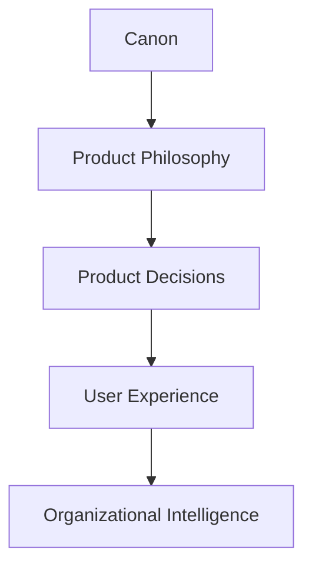
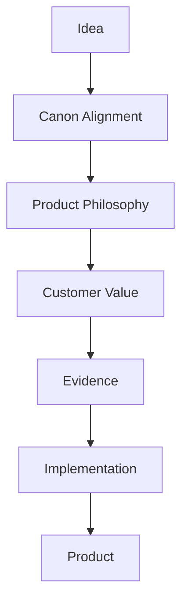
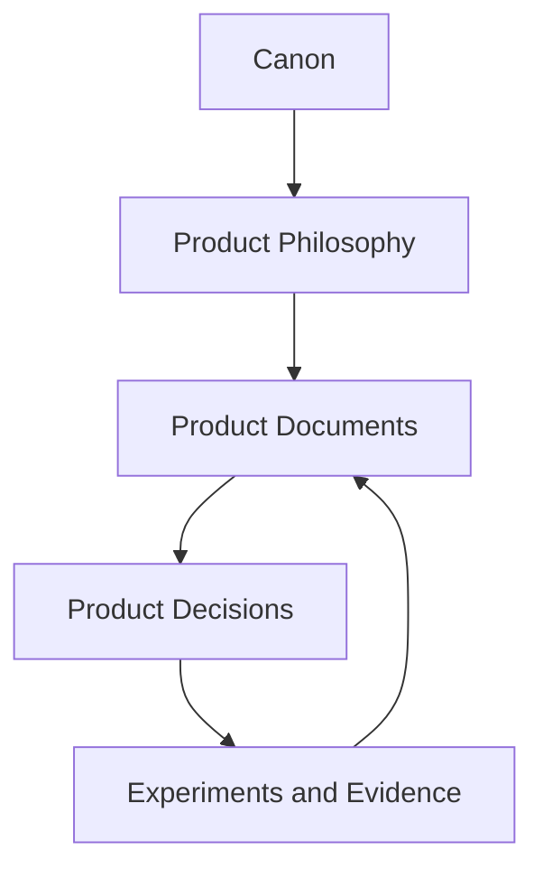

# Product Philosophy

## Derived From

- Canon Version: `v1.0.0`
- Architecture Version: `v1.0.0`
- Implementation Version: `v1.0.0`
- Strategy Version: `v1.0.0`
- Research Version: `v1.0.0`

### Primary Repository Sources

- [Canon](../canon/README.md)
- [Architecture](../architecture/README.md)
- [Implementation](../implementation/README.md)
- [Strategy](../strategy/README.md)
- [Research](../research/README.md)

---

Status: **Active**

## Primary Question

What principles should guide every product decision made by the company, regardless of changing technologies, markets, or AI capabilities?

This document is one of the foundational Product documents.

It is not a Product Vision. It is not a Requirements document. It defines the enduring philosophy that governs every product decision across the Organizational Intelligence Platform.

## 1. Executive Summary

Product Philosophy sits between the Canon and Product Design.

The Canon explains why the company exists. Product Philosophy explains how those beliefs become products.

The Organizational Intelligence Platform should not become a bundle of features, a collection of AI experiments, or a fashionable response to market pressure. It should remain a coherent product system built around one enduring purpose:

> Help organizations become permanently more capable through governed knowledge, human judgment, and Organizational Intelligence that compounds over time.

Every future feature should be traceable back to this document.

Product teams should use this document to evaluate:

- What kind of product the company builds.
- What kind of product the company refuses to build.
- How product decisions are made.
- How AI appears in the user experience.
- How trust is established.
- How Organizational Intelligence is expressed through product design.

This document is the product team's constitution. It should change rarely, and only when the company's understanding of product philosophy meaningfully evolves.

## 2. Relationship to the Canon

Product Philosophy operationalizes the Canon for product teams.

The Canon defines the company's intellectual foundation:

- Why the company exists.
- What product must exist.
- How decisions should be made.
- What capabilities the platform must possess.
- What concepts exist in the platform universe.
- How workflows evolve over time.
- How intelligence should think inside the platform.

Product Philosophy translates those beliefs into product judgment.

Product Philosophy does not redefine the Canon. It interprets the Canon for product work.

If the Canon is the company's source of truth, Product Philosophy is the product team's decision lens.

## Canon-to-Product Relationship

| Canon Role | Product Philosophy Role |
| --- | --- |
| Defines why the company exists. | Defines how products should express that purpose. |
| Establishes enduring concepts. | Turns concepts into product judgment. |
| Protects company identity. | Protects product coherence. |
| Governs contradiction. | Governs product trade-offs. |
| Defines Organizational Intelligence. | Ensures product choices strengthen Organizational Intelligence. |

## 3. Product Philosophy Principles

The following principles should guide product decisions across the Organizational Intelligence Platform.

## Principle Summary

| Principle | Summary |
| --- | --- |
| Organizational Intelligence Before Artificial Intelligence | The product exists to strengthen organizations, not showcase AI. |
| AI Augments Humans | AI amplifies human capability but does not replace accountability. |
| Human Review Builds Trust | Important AI-generated outcomes should remain understandable, verifiable, and approvable. |
| Organizational Memory Compounds | Meaningful work should strengthen future organizational knowledge. |
| Knowledge Is More Valuable Than Automation | Automation without learning creates speed without institutional capability. |
| Transparency Creates Confidence | Users should understand evidence, source, and reasoning. |
| Integrate Before Replace | The platform should work with existing enterprise systems whenever practical. |
| Simplicity Over Feature Count | Reduce cognitive and operational complexity. |
| Governance Is Part of the Product | Trust should be built into product interactions. |
| Design for Evolution | Products should evolve without forcing customers to restart their knowledge. |
| Product Decisions Must Be Evidence-Based | Research and experiments should guide priorities. |
| Long-Term Capability Over Short-Term Productivity | Prefer durable capability over temporary acceleration. |

## Organizational Intelligence Before Artificial Intelligence

The product exists to strengthen organizations, not to showcase AI.

AI is important, but it is not the company's destination. Models will improve, providers will change, and capabilities will become commoditized. The product must not define itself by the latest model capability.

The product should be judged by whether it helps organizations:

- Remember what they learn.
- Reuse validated knowledge.
- Make better future decisions.
- Reduce repeated investigation.
- Preserve human expertise.
- Govern knowledge responsibly.

If an AI capability does not strengthen Organizational Intelligence, it should be reconsidered.

## AI Augments Humans

AI should amplify human capability.

It should help users:

- Summarize.
- Retrieve.
- Draft.
- Compare.
- Classify.
- Detect patterns.
- Propose candidates.
- Prepare decisions.

AI should not obscure accountability. The product should never imply that responsibility has moved from the organization to the model.

The correct product posture is:

> AI assists. Humans remain accountable. The organization learns.

## Human Review Builds Trust

Human Review is not friction by default. It is the mechanism that turns AI-assisted output into trusted organizational knowledge.

Users should be able to:

- Understand AI-generated outcomes.
- Verify source evidence.
- Approve, reject, or revise recommendations.
- See confidence and uncertainty.
- Know who reviewed important knowledge.
- Understand when knowledge became official.

The product should make review feel like responsible participation in organizational learning, not like administrative overhead.

## Organizational Memory Compounds

Every meaningful interaction should strengthen organizational knowledge when appropriate.

The platform should help customers move from:

- Solved case to reusable knowledge.
- Expert answer to organizational memory.
- Informal explanation to governed artifact.
- Repeated issue to improved future decision.
- Local fix to institutional capability.

Organizational Memory should not feel like a static archive. It should feel like a living asset that improves through use, review, and refinement.

## Knowledge Is More Valuable Than Automation

Automation can improve speed. Knowledge improves capability.

Automation without learning may cause an organization to repeat the same problem faster. A support ticket may be resolved quickly, but if the knowledge disappears, the organization has not become smarter.

The product should therefore prioritize learning loops over task completion alone.

The strongest product experiences should answer:

- What did this work teach the organization?
- Should this lesson be preserved?
- Can future teams reuse it?
- Is it validated?
- Is it trustworthy?

## Transparency Creates Confidence

Users trust systems they can inspect.

The product should help users understand:

- Where knowledge came from.
- What evidence supports a recommendation.
- Why an AI suggestion exists.
- Whether knowledge is validated.
- Who reviewed it.
- When it was last updated.
- Whether it has been reused.
- Whether it conflicts with other knowledge.

Transparency should be practical, not overwhelming. The product should reveal enough context for confidence without forcing users to inspect everything all at once.

## Integrate Before Replace

Organizations already use help desks, CRMs, documents, collaboration tools, identity providers, data stores, and workflows.

The platform should work with existing enterprise systems whenever practical.

The product should avoid unnecessary replacement narratives. Replacing systems is expensive, risky, and often unnecessary. OIP should become valuable by connecting, interpreting, governing, and learning from the work already happening across systems.

The product should replace only when replacement is clearly better for the customer, not because replacement simplifies the company's product story.

## Simplicity Over Feature Count

Complexity is one form of product debt.

The platform should not confuse breadth with maturity. A product that does many things poorly does not strengthen Organizational Intelligence.

Product teams should prefer:

- Clear workflows.
- Fewer concepts.
- Consistent patterns.
- Strong defaults.
- Progressive disclosure.
- Visible evidence.
- Reduced decision burden.

The product should make complex organizational knowledge easier to work with, not add another layer of confusion.

## Governance Is Part of the Product

Governance should not feel like a compliance appendix.

It should be part of the product experience:

- Access controls.
- Review workflows.
- Approval history.
- Audit trails.
- Version history.
- Source provenance.
- Knowledge status.
- Policy-aware AI.

Governance is how the product earns trust.

If users cannot tell whether knowledge is approved, current, authorized, or safe to use, the product has failed one of its core responsibilities.

## Design for Evolution

Organizations change.

Products change. Teams change. Policies change. AI models change. Regulations change. Customer needs change. Knowledge changes.

The product should help customers evolve without losing their organizational memory.

Product design should support:

- Versioning.
- Migration.
- Deprecation.
- Reclassification.
- Knowledge lifecycle.
- Historical context.
- Changing workflows.
- Model replacement.

Customers should not have to restart their knowledge every time technology changes.

## Product Decisions Must Be Evidence-Based

Product decisions should be guided by research and experiments rather than assumptions alone.

Evidence may come from:

- Customer discovery.
- Workflow observation.
- Prototype testing.
- Design partner pilots.
- AI evaluation.
- Retrieval evaluation.
- Usage analytics.
- Support metrics.
- Pricing experiments.
- Security validation.

When evidence is weak, the product decision should acknowledge uncertainty and define a validation path.

## Long-Term Capability Over Short-Term Productivity

The product should prefer features that strengthen organizational capability over features that merely accelerate today's work.

A feature that saves five minutes today but creates ungoverned knowledge debt may weaken the organization.

A feature that takes slightly longer but creates trusted, reusable memory may create compounding value.

The product should optimize for the long arc:

- Better future decisions.
- Lower repeated work.
- More consistent knowledge.
- Less expert dependency.
- Faster onboarding.
- Stronger institutional trust.

## 4. Product Decision Framework

Product ideas should move through a consistent decision framework.

## Stage 1: Idea

An idea may come from customers, founders, research, engineers, competitors, AI capability changes, regulatory shifts, or internal observation.

Ideas are welcome. Ideas are not commitments.

## Stage 2: Canon Alignment

The idea should be evaluated against the Canon.

Questions:

- Does it strengthen Organizational Intelligence?
- Does it support the Knowledge Flywheel?
- Does it respect Human Review?
- Does it preserve Organizational Memory?
- Does it align with governance?
- Does it contradict any Canon document?

## Stage 3: Product Philosophy

The idea should be evaluated against this document.

Questions:

- Does it make the product more trustworthy?
- Does it improve organizational learning?
- Does it reduce or increase complexity?
- Does it make AI accountable?
- Does it preserve knowledge?
- Does it support evolution?

## Stage 4: Customer Value

The idea should create customer value.

Questions:

- What customer problem does this solve?
- Who experiences the problem?
- How severe is the problem?
- How often does it occur?
- What happens if it is not solved?
- Would the customer adopt the change?

## Stage 5: Evidence

The idea should be supported by evidence or have a clear validation plan.

Questions:

- What research supports this?
- What experiment should validate it?
- What evidence would disprove it?
- What confidence level do we have?
- Is this based on customer need or internal enthusiasm?

## Stage 6: Implementation

Implementation should follow product philosophy rather than distort it.

Questions:

- Can it be built without weakening governance?
- Can it integrate with existing systems?
- Can it be explained to users?
- Can it be audited?
- Can it evolve?
- Can it be supported?

## Stage 7: Product

Only after passing through the earlier stages should an idea become product.

The result should be a product decision that is:

- Canon-aligned.
- Customer-valued.
- Evidence-supported.
- Trust-preserving.
- Operationally responsible.
- Consistent with long-term Organizational Intelligence.

## Product Governance Table

| Decision Gate | Required Question | Possible Outcome |
| --- | --- | --- |
| Canon Alignment | Does this contradict or strengthen the Canon? | Reject, revise, or continue. |
| Philosophy Alignment | Does this follow product principles? | Reject, revise, or continue. |
| Customer Value | Is the problem real and meaningful? | Research, experiment, or continue. |
| Evidence | What supports the decision? | Validate, defer, or continue. |
| Implementation Responsibility | Can it be built safely and coherently? | Build, narrow scope, or defer. |

## 5. What the Product Is

The Organizational Intelligence Platform can be understood through several complementary lenses.

## Organizational Learning Platform

The product helps organizations learn from the work they already perform.

It turns repeated operational activity into structured, validated learning.

## Knowledge Governance Platform

The product helps organizations determine what knowledge is trusted, reviewed, current, reusable, and authorized.

It treats knowledge as something that must be governed, not merely stored.

## Human-AI Collaboration Platform

The product helps humans and AI work together responsibly.

AI assists with retrieval, summarization, synthesis, classification, and recommendations. Humans provide judgment, review, accountability, and organizational context.

## Organizational Memory Platform

The product preserves what the organization has learned so future teams can benefit.

Memory is not passive storage. It is governed, searchable, traceable, and reusable.

## Decision Support Platform

The product helps people make better decisions by surfacing evidence, prior knowledge, patterns, and validated context.

It supports decisions without pretending to own accountability for them.

## Complementary Perspectives

| Perspective | What It Emphasizes |
| --- | --- |
| Organizational Learning Platform | Learning from work. |
| Knowledge Governance Platform | Trust, review, and accountability. |
| Human-AI Collaboration Platform | Responsible AI augmentation. |
| Organizational Memory Platform | Durable institutional knowledge. |
| Decision Support Platform | Evidence-based future action. |

Together, these perspectives describe a product whose purpose is to increase institutional capability.

## 6. What the Product Is Not

Product clarity requires saying no.

## Not Another Chatbot

The product is not a conversational interface wrapped around enterprise data.

Chat may become one interaction pattern, but conversation alone does not create Organizational Intelligence. The product must preserve evidence, review, governance, and memory.

## Not Another Ticketing System

The product is not primarily a queue, SLA, or case management tool.

Ticketing systems manage work. OIP learns from work.

## Not Another Knowledge Base

The product is not merely a place to store articles.

Knowledge bases store information. OIP governs the transformation of work into validated organizational memory.

## Not Another Workflow Automation Tool

The product is not defined by automating tasks.

Workflow automation can accelerate execution. OIP must improve learning.

## Not Autonomous AI Replacing People

The product is not an attempt to remove human judgment from the organization.

It should protect and amplify expertise, not erase accountability.

## Not a Productivity Tool Driven Only by Speed

Speed matters, but speed alone is not the point.

The product should avoid creating faster confusion, faster bad answers, or faster ungoverned knowledge.

## Not a Collection of Disconnected AI Features

The product should not become a menu of AI tricks.

Every AI capability should connect to the Knowledge Flywheel, Organizational Memory, Human Review, or Governance.

## Why These Distinctions Matter

| Misclassification | Risk |
| --- | --- |
| Chatbot | Reduces OIP to an interface pattern. |
| Ticketing system | Competes with systems of record rather than learning from them. |
| Knowledge base | Treats knowledge as static content. |
| Automation tool | Optimizes execution without institutional learning. |
| Autonomous AI | Weakens accountability and trust. |
| Productivity tool | Overvalues speed and undervalues durable capability. |
| AI feature bundle | Fragmented product identity. |

## 7. User Experience Philosophy

The user experience should help people trust, understand, and improve organizational knowledge.

## Clarity

Users should understand what the product is showing, asking, recommending, or preserving.

The product should avoid ambiguous states, hidden assumptions, and unclear authority.

## Explainability

Users should be able to see why a recommendation exists.

Explainability should include:

- Source evidence.
- Related knowledge.
- Reasoning summary.
- Confidence or uncertainty.
- Review status.
- Version history.

## Confidence

The product should help users know how much to trust an output.

Confidence should not be theatrical. It should be grounded in evidence, review, usage, freshness, and authority.

## Minimal Cognitive Load

The product should reduce the burden of working with organizational knowledge.

It should:

- Summarize when helpful.
- Reveal details progressively.
- Avoid forcing users to inspect everything.
- Use consistent patterns.
- Reduce repeated manual work.

## Progressive Disclosure

Users should see the right level of detail for the decision they are making.

Simple tasks should feel simple. High-impact decisions should reveal deeper evidence, governance, and review context.

## Trustworthy AI

AI should feel helpful, inspectable, and bounded.

It should not feel magical, mysterious, overconfident, or coercive.

## Traceable Knowledge

Users should be able to trace knowledge back to its origin, validation, and use.

Traceability turns knowledge into something the organization can trust.

## Consistent Interaction Patterns

The product should build familiarity through consistent patterns for:

- Review.
- Approval.
- Rejection.
- Evidence inspection.
- Knowledge status.
- Version comparison.
- Feedback.

Consistency reduces cognitive burden and increases confidence.

## 8. AI Experience Philosophy

AI should appear to users as a responsible assistant inside a governed product system.

## AI Is Visible but Not Intrusive

Users should know when AI is involved.

AI should not silently change organizational knowledge, make important decisions, or create official memory without appropriate review.

## AI Explains Rather Than Dictates

AI should provide reasoning, evidence, and alternatives where useful.

The product should avoid AI experiences that present outputs as commands.

## AI Recommends Rather Than Commands

AI should offer candidates:

- Candidate summary.
- Candidate answer.
- Candidate classification.
- Candidate knowledge article.
- Candidate relationship.
- Candidate next step.

Human users and governance workflows determine what becomes official.

## AI Learns Responsibly

AI should not learn from everything indiscriminately.

The product should distinguish:

- Raw input.
- AI-generated output.
- Human-reviewed output.
- Validated knowledge.
- Organizational memory.

## AI Respects Organizational Governance

AI should operate within:

- Permissions.
- Policies.
- Data boundaries.
- Review requirements.
- Audit controls.
- Retention rules.

The model should not become a path around governance.

## Human Judgment Remains Visible

The product should show where humans reviewed, corrected, rejected, or approved AI-assisted outcomes.

This connects directly to the Canon's Human Review principle.

## AI Experience Summary

| AI Should Be | AI Should Not Be |
| --- | --- |
| Helpful | Authoritarian |
| Visible | Hidden |
| Evidence-aware | Unsupported |
| Reviewable | Unchallengeable |
| Governed | Unbounded |
| Accountable through humans | Treated as responsible by itself |
| Memory-aware | Memory-polluting |

## 9. Knowledge Experience Philosophy

Users should experience Organizational Memory as a living organizational asset.

## Discoverability

Knowledge should be findable through language, concepts, relationships, workflow context, and prior evidence.

If the organization knows something but users cannot find it, memory is not functioning.

## Reuse

Knowledge should be easy to reuse in future work.

Reuse should not mean blind copying. It should mean applying validated learning to a new context with appropriate judgment.

## Continuous Refinement

Knowledge should improve over time.

The product should support:

- Corrections.
- Updates.
- Deprecation.
- Version history.
- New evidence.
- Contradiction handling.
- Revalidation.

## Evidence Preservation

Knowledge should retain its relationship to evidence.

Users should know where a claim came from and why it became trusted.

## Version Awareness

Knowledge changes.

The product should help users distinguish:

- Current knowledge.
- Prior versions.
- Deprecated guidance.
- Conflicting evidence.
- Pending review.

## Institutional Learning

Users should feel that their work contributes to the organization's future capability.

A resolved case, reviewed answer, or corrected recommendation should not disappear into the past. It should improve future work.

## Knowledge as Living Asset

| Static Knowledge Experience | Living Knowledge Experience |
| --- | --- |
| Stored articles. | Validated memory. |
| Search results. | Contextual reuse. |
| One-time publication. | Continuous refinement. |
| Unknown trust level. | Visible status and evidence. |
| Forgotten after use. | Learning captured for future work. |

## 10. Product Evolution Philosophy

The product should evolve through continuous learning.

## Continuous Learning Over One-Time Releases

Product releases should not be treated as the end of learning.

Each release should answer:

- What did users do?
- What did they trust?
- What confused them?
- What did they ignore?
- What did they correct?
- What became reusable knowledge?
- What should change?

## Product Evolution Principles

| Principle | Explanation |
| --- | --- |
| Research before commitment | Major product directions should be grounded in customer and market evidence. |
| Experiments before scale | Test workflows, AI, and value before broad rollout. |
| Evidence before confidence | Confidence should rise only with evidence. |
| Learning before expansion | Expansion should follow validated understanding. |
| Evolution without memory loss | Product changes should preserve customer knowledge and history. |

## Avoiding Product Drift

As the product evolves, it may face pressure to add:

- More automation.
- More AI features.
- More dashboards.
- More integrations.
- More settings.
- More market-specific requests.

These may be valuable, but each should be evaluated against the Product Philosophy.

The product should evolve by becoming clearer, more trusted, and more capable—not merely larger.

## 11. Repository Integration

Product Philosophy guides every future product document.

## Documents Guided by Product Philosophy

| Document Type | How This Philosophy Guides It |
| --- | --- |
| Product Vision | Ensures vision remains grounded in Organizational Intelligence rather than AI novelty. |
| Product Requirements | Ensures requirements trace to trust, memory, governance, evidence, and customer value. |
| Personas | Ensures personas reflect accountability, expertise, workflow, and trust needs. |
| User Journeys | Ensures journeys capture learning, review, reuse, and knowledge lifecycle. |
| Features | Ensures features strengthen long-term organizational capability. |
| Roadmap | Ensures sequencing follows evidence, risk, and strategic value. |
| Design Decisions | Ensures UX patterns remain explainable, trustworthy, and consistent. |

## Product Document Rule

Every future product document should state:

- Which Canon documents it derives from.
- Which Product Philosophy principles it applies.
- What customer problem it addresses.
- What evidence supports it.
- What it intentionally does not define.

## Repository Flow

Product Philosophy is not a substitute for research, requirements, or roadmap planning. It is the standard those documents must respect.

## 12. Traceability Matrix

| Canon Principle | Product Philosophy Expression |
| --- | --- |
| Organizational Intelligence | Strengthen organizations rather than automate blindly. |
| Human Review | AI recommendations remain reviewable, correctable, and accountable. |
| Organizational Memory | Knowledge compounds over time through preservation, reuse, and refinement. |
| Governance | Trust is built into product interactions through access, review, audit, and status. |
| Knowledge Flywheel | Every meaningful interaction should improve future organizational capability. |
| AI as Amplifier, Not Authority | AI assists with candidates, summaries, and recommendations but does not own final accountability. |
| Explainability | Users should understand evidence, reasoning, provenance, and confidence. |
| Domain Language | Product concepts should remain consistent with the platform universe. |
| Learning | Product evolution should be driven by research, experiments, and evidence. |
| Long-Term Capability | Product decisions should prioritize durable institutional capability over short-term novelty. |

## 13. Limitations

This document intentionally avoids:

- UI specifications.
- Technical implementation.
- Feature prioritization.
- Roadmap commitments.
- Pricing.
- Engineering decisions.
- Vendor choices.
- Detailed product requirements.
- Interface layouts.
- Release planning.

Those belong in later Product, Architecture, Implementation, Strategy, and Roadmap documents.

Product Philosophy defines the enduring product posture. It does not decide every future product detail.

## 14. Closing

Product Philosophy is the enduring bridge between organizational beliefs and customer experiences.

Technologies will evolve.

AI models will change.

Markets will shift.

Competitors will emerge.

Customer expectations will mature.

But every product decision should continue to answer the same fundamental question:

> Does this strengthen Organizational Intelligence?

If the answer is no, the idea should be reconsidered regardless of how innovative, fashionable, or technically impressive it appears.

The purpose of the platform is not to create more AI.

The purpose is to help organizations continuously become wiser through governed knowledge, human judgment, and Organizational Intelligence that compounds over time.
