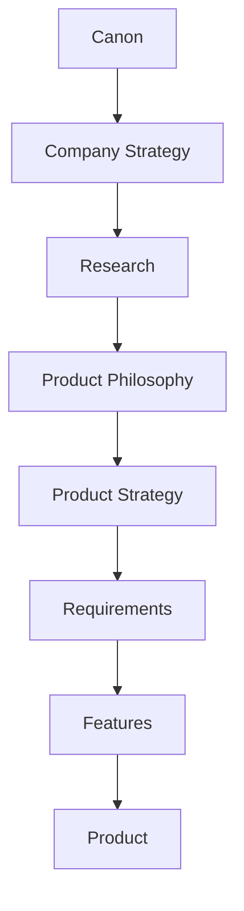
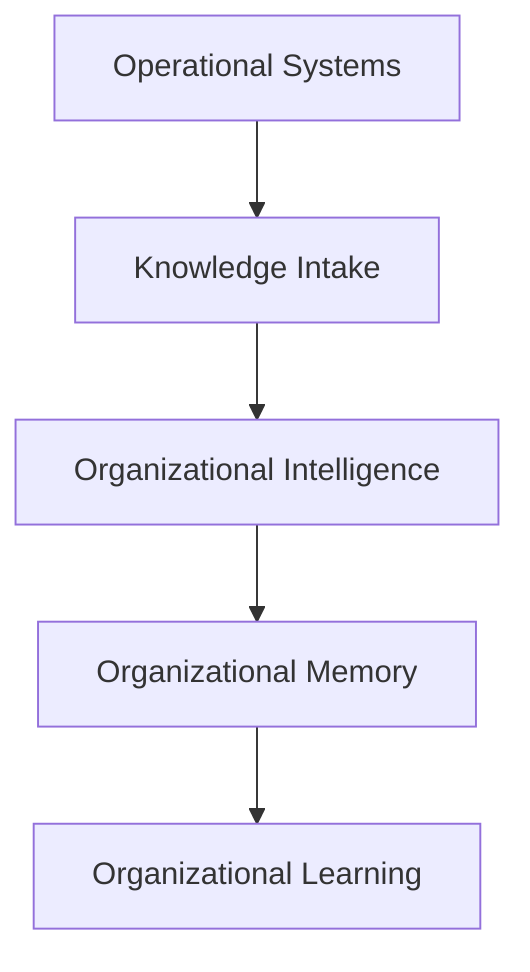
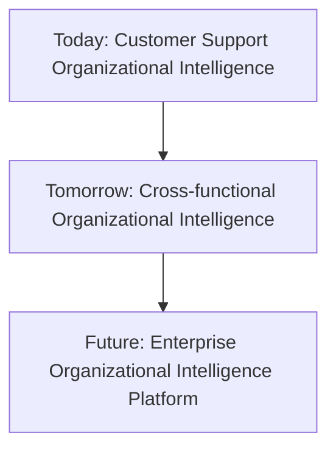
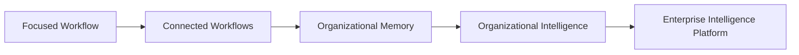
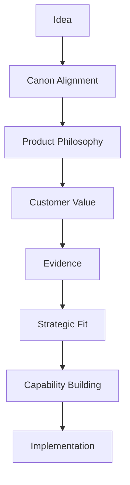
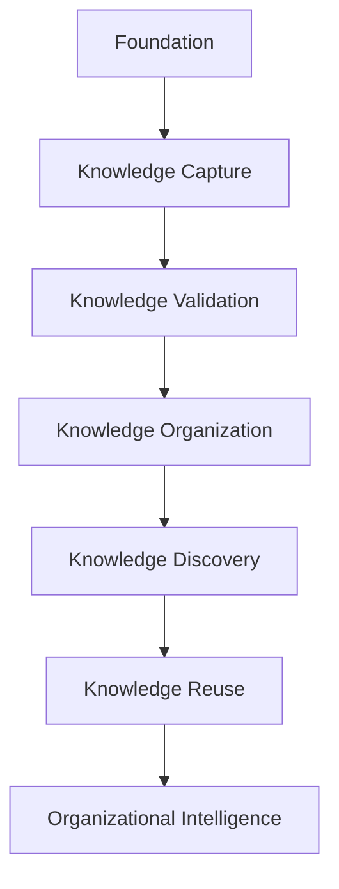

# Product Strategy

## Derived From

- Canon Version: `v1.0.0`
- Architecture Version: `v1.0.0`
- Implementation Version: `v1.0.0`
- Strategy Version: `v1.0.0`
- Research Version: `v1.0.0`
- Product Philosophy Version: `v1.0.0`

### Primary Repository Sources

- [Canon](../canon/README.md)
- [Architecture](../architecture/README.md)
- [Implementation](../implementation/README.md)
- [Strategy](../strategy/README.md)
- [Research](../research/README.md)
- [Product Philosophy](./00_PRODUCT_PHILOSOPHY.md)

---

Status: **Active**

## Primary Question

How should the Organizational Intelligence Platform evolve over time to maximize customer value while remaining faithful to the company's Canon and Product Philosophy?

This is a foundational Product document.

It defines how the Organizational Intelligence Platform evolves from an idea into a complete enterprise platform. It is not a business strategy document, roadmap, feature list, implementation plan, or UI design specification.

## 1. Executive Summary

Product Strategy transforms Product Philosophy into an evolving product portfolio.

Product Philosophy defines the enduring principles that govern product decisions. Product Strategy defines how those principles guide product evolution over time.

The Organizational Intelligence Platform should not grow by accumulating disconnected features. It should grow by developing capabilities in the right sequence:

- First, solve one workflow exceptionally.
- Then, connect related workflows.
- Then, preserve validated organizational memory.
- Then, enable organizational intelligence across departments.
- Eventually, become an enterprise intelligence platform that helps institutions learn continuously.

The strategic product goal is not to ship the largest number of capabilities. It is to build the right capabilities in the right order so that customer value compounds.

## Strategic Goals

| Goal | Meaning |
| --- | --- |
| Validate a focused workflow | Prove that OIP creates value in one real operational setting before broad expansion. |
| Build organizational memory | Ensure product use strengthens durable institutional knowledge. |
| Preserve trust | Keep human review, governance, and explainability central as capabilities expand. |
| Expand through evidence | Let research, experiments, and customer outcomes guide product growth. |
| Become a platform | Build reusable capabilities that support multiple domains without fragmenting identity. |

## Expected Outcomes

Product Strategy should help the company:

- Sequence capabilities.
- Maintain product focus.
- Avoid trend-driven expansion.
- Decide what enters or stays outside the product.
- Connect customer value to long-term platform evolution.
- Preserve Canon alignment across growth.

## The Product Strategy Solves One Core Problem

The Organizational Intelligence Platform is not a customer support platform. Customer support is the first strategic entry point. The real product is a configurable Organizational Intelligence Platform that continuously captures, validates, governs, and evolves organizational knowledge.

The product strategy is based on solving one core problem: **Organizational Entropy**.

Organizations continuously lose valuable knowledge because expertise remains trapped inside:

- People's experience.
- Support tickets.
- Chats.
- Emails.
- Documents.
- Spreadsheets.
- Disconnected systems.

Traditional software stores information. The OIP transforms organizational experience into reusable Organizational Intelligence. Every strategic decision in this document follows from that distinction.

## 2. Relationship to Other Documents

Product Strategy sits within a broader repository system.

## Responsibility of Each Layer

| Layer | Responsibility |
| --- | --- |
| Canon | Defines the company's enduring intellectual foundation. |
| Company Strategy | Defines category, positioning, ICP, GTM, pricing, business model, partnerships, growth, and long-term vision. |
| Research | Tests assumptions, gathers evidence, evaluates markets, customers, technology, AI, regulation, and experiments. |
| Product Philosophy | Defines enduring principles for product judgment. |
| Product Strategy | Defines how the product evolves over time through capability sequencing and validated expansion. |
| Requirements | Translate strategy into specific product needs and constraints. |
| Features | Define concrete product capabilities for users. |
| Product | The customer-facing expression of the company's beliefs, strategy, research, and execution. |

Product Strategy does not replace Product Philosophy. It applies it over time.

Product Strategy does not replace the roadmap. It governs how roadmap decisions should be made.

## 3. Product Thesis

Organizations already possess enormous amounts of knowledge. The problem is not creating more knowledge.

The problem is:

- Capturing it.
- Validating it.
- Organizing it.
- Governing it.
- Making it reusable.

The OIP exists to continuously transform operational experience into trusted Organizational Memory. It does not ask organizations to produce more documentation. It captures the knowledge they already generate through work, validates it, and makes it reusable so that the organization becomes more capable over time.

## 4. Knowledge Intake Strategy

Organizational knowledge enters the platform through three strategic intake paths. Each is a door into the same Organizational Intelligence architecture.

## Door 1 — Manual Knowledge Entry

Captures expertise that was never documented. Subject-matter experts and contributors record knowledge directly so that tacit experience is no longer trapped in individual memory.

## Door 2 — Historical Knowledge Import

Recovers organizational knowledge from existing archives such as documents, knowledge bases, and exports. Existing knowledge becomes reusable without being recreated.

## Door 3 — Live Workflow Capture

Captures organizational learning while work is happening, when context is richest.

## Why the MVP Focuses on Door 3

The MVP intentionally focuses on Door 3 because it provides:

- Highest context.
- Fastest learning.
- Strongest validation.
- Clearest ROI.

Future platform growth expands the number of intake doors without changing the Organizational Intelligence architecture. Doors 1 and 2 reuse the same validation, memory, trust, and learning that Door 3 proves.

## 5. Product Positioning

The OIP is not competing with operational systems such as:

- Zendesk.
- Freshdesk.
- Jira.
- Salesforce.
- HubSpot.

Those systems manage work. The OIP learns from work.

The OIP complements operational systems rather than replacing them. Operational systems remain the systems of record for work; the OIP becomes the system of record for organizational knowledge, drawing on operational systems as Sources without competing for their role. This positioning extends the existing Integrate Before Replacing principle.

## 6. Strategic Platform Layers

The platform is built from a small number of strategic layers. These layers are reusable across industries; only their configuration changes.

| Layer | Strategic role |
| --- | --- |
| Knowledge Intake | Accept organizational knowledge from any door while preserving provenance. |
| Validation | Convert candidates into trusted knowledge through human review and governance. |
| Organizational Intelligence | Understand, organize, and reason over validated knowledge. |
| Organizational Memory | Preserve trusted, governed knowledge for reuse. |
| Trust | Evolve confidence in knowledge through validation, reuse, and outcomes. |
| Learning | Continuously improve memory through reuse and pattern discovery. |
| AI Advisory | Assist understanding, drafting, and enrichment without owning truth. |

Because these layers are reusable, the same platform serves many industries and workflows. Expansion adds knowledge sources and configuration, not new architectures.

## 7. Why Customer Support First?

Customer support is the strategic beachhead because it is the fastest environment in which to prove the Organizational Intelligence architecture.

| Reason | Strategic meaning |
| --- | --- |
| Frequent repetition | Recurring problems make reuse and learning observable quickly. |
| Existing validation loops | Support teams already review and correct answers. |
| Measurable outcomes | Resolution, escalation, reuse, and onboarding can be measured. |
| High organizational knowledge loss | Support generates valuable knowledge that is routinely lost. |
| Easy demonstration | The Knowledge Flywheel is concrete and visible in support work. |

Customer support validates the architecture, not the market size. It is chosen because it proves the platform fastest, not because the platform is a support tool. The fuller beachhead discipline is defined in the Beachhead Product Strategy section.

## 8. AI Strategy

AI has a clear and bounded strategic role.

AI is:

- An advisor.
- An accelerator.
- A reasoning assistant.
- A drafting assistant.

AI is not:

- The source of truth.
- Organizational Memory.
- Governance.
- Trust.
- Organizational policy.

The OIP owns Organizational Intelligence. AI enhances it. AI providers can change, improve, or be disabled without changing what the organization knows or how it governs that knowledge. The product's durable value is the validated, governed Organizational Memory, not the model that assists it.

## 9. Organization Profile Strategy

The platform is configured through Organization Profiles. An Organization Profile defines an organization's vocabulary, domains, tone, policies, relevance, and trust expectations.

The same intelligence architecture adapts to:

- Software companies.
- Logistics.
- Legal firms.
- Healthcare.
- Manufacturing.
- Education.
- Government.

No architecture changes are required. Only organizational configuration changes. This is what allows one platform to serve many industries without fragmenting into separate products.

## 10. Long-Term Platform Vision

The strategy evolves through widening scope while preserving one architecture and one shared memory.

- **Today** — Customer Support Organizational Intelligence.
- **Tomorrow** — Cross-functional Organizational Intelligence across related workflows.
- **Future** — an Enterprise Organizational Intelligence Platform supporting every operational workflow through one shared Organizational Memory.

Each stage widens scope without changing the architecture. The platform becomes more valuable as more workflows contribute to and draw from the same trusted memory. This vision is consistent with the staged Product Evolution Strategy defined later.

## 11. Product Strategy Principles

## Principle Summary

| Principle | Summary |
| --- | --- |
| Solve One Workflow Exceptionally Before Expanding | Product credibility begins with depth, not breadth. |
| Build Organizational Capability Rather Than Isolated Features | Capabilities should compound into institutional learning. |
| Product Growth Follows Validated Evidence | Expansion should be earned through research, experiments, and customer outcomes. |
| Integrate Before Replacing | Work with existing enterprise systems whenever practical. |
| AI Amplifies Existing Workflows | AI should improve real work, not create disconnected experiences. |
| Enterprise Trust Precedes Automation | Governance, review, and explainability come before autonomy. |
| Knowledge Compounds Across Every Release | Each release should strengthen memory and reuse. |
| Prefer Platform Capabilities Over Point Solutions | Build reusable capabilities that support multiple domains. |
| Design for Long-Term Extensibility | Product architecture should support evolution without fragmentation. |
| Maintain Architectural Consistency | Product expansion should preserve domain, data, AI, and governance coherence. |

## Solve One Workflow Exceptionally Before Expanding

The product should begin with a narrow workflow where the problem is painful, measurable, and repeatable.

Depth creates credibility. Breadth without proof creates confusion.

Before expanding, the company should prove:

- The customer problem is real.
- The workflow can be improved.
- AI assistance is trusted.
- Human review works.
- Knowledge reuse produces measurable value.
- Customers want continued use.

## Build Organizational Capability Rather Than Isolated Features

Features are useful only when they strengthen a larger capability.

The product should not become a catalog of disconnected tools. Every major capability should support:

- Evidence capture.
- Knowledge validation.
- Organizational memory.
- Governance.
- Human review.
- Future reuse.

The unit of strategy is capability, not feature count.

## Product Growth Follows Validated Evidence

Product expansion should follow evidence, not internal excitement.

Evidence may come from:

- Customer discovery.
- Workflow observation.
- Design partner pilots.
- Usage data.
- AI evaluations.
- Retrieval evaluations.
- Knowledge reuse metrics.
- Sales and pricing experiments.

When evidence is weak, the strategy should define what must be learned before expansion.

## Integrate Before Replacing

Customers already use systems of record, engagement, workflow, documentation, identity, and communication.

The product should integrate with these systems before asking customers to replace them.

Replacement may happen later in specific contexts, but it should never be the default growth assumption.

## AI Amplifies Existing Workflows

AI should improve real customer workflows.

The platform should avoid AI experiences that are impressive in demos but disconnected from operational work.

AI should help:

- Understand evidence.
- Summarize cases.
- Detect patterns.
- Draft knowledge candidates.
- Recommend next steps.
- Support review.
- Improve reuse.

AI should remain connected to work, evidence, governance, and memory.

## Enterprise Trust Precedes Automation

Automation should follow trust.

The platform should not automate important work before customers trust:

- Data access.
- AI outputs.
- Review workflows.
- Audit history.
- Permissions.
- Governance.
- Error correction.

Trust is the foundation on which safe automation can later grow.

## Knowledge Compounds Across Every Release

Every release should strengthen the organization's ability to learn.

A release should ideally improve:

- What can be captured.
- What can be validated.
- What can be found.
- What can be reused.
- What can be governed.
- What can be measured.

If a release adds capability but not learning, its strategic value should be questioned.

## Prefer Platform Capabilities Over Point Solutions

Point solutions solve a narrow problem once.

Platform capabilities solve a class of problems repeatedly.

The product should prefer capabilities such as:

- Review.
- Evidence.
- Memory.
- Retrieval.
- Governance.
- Integration.
- Workflow.
- Analytics.

These can support multiple domains over time.

## Design for Long-Term Extensibility

The product should evolve without forcing customers to restart.

It should support:

- New workflows.
- New knowledge types.
- New AI models.
- New integrations.
- New regulations.
- New customer segments.
- New departments.

Extensibility should preserve coherence rather than create uncontrolled flexibility.

## Maintain Architectural Consistency

Product strategy must remain aligned with architecture.

Expansion should not create:

- Conflicting domain concepts.
- Inconsistent data models.
- Ungoverned AI behavior.
- Fragmented permissions.
- Duplicate memory systems.
- Isolated workflows.

The product should grow as one platform, not as unrelated modules.

## Knowledge Intake Strategic Principles

The following principles extend the principle summary above to reflect the Knowledge Intake Architecture:

1. Capture organizational knowledge before it becomes Organizational Entropy.
2. Every knowledge source should converge into one Organizational Intelligence architecture.
3. Knowledge must be validated before becoming Organizational Memory.
4. Organizational Memory should continuously evolve through reuse.
5. AI enhances organizational reasoning but never governs it.
6. Organization Profiles enable one platform to serve many industries.
7. Build one intake door exceptionally well before expanding to additional knowledge sources.
8. The OIP complements operational systems instead of replacing them.

## 12. Product Evolution Strategy

The product should evolve through stages.

## Stage 1: Focused Workflow

The product begins by solving one workflow exceptionally.

The purpose is to validate:

- Customer pain.
- Workflow fit.
- Data availability.
- AI usefulness.
- Human review.
- Knowledge reuse.
- Measurable value.

The focused workflow should be narrow enough to learn quickly and meaningful enough to prove the category thesis.

## Stage 2: Connected Workflows

After one workflow is validated, the product connects adjacent workflows.

For Customer Support, this may involve relationships among:

- Cases.
- Knowledge articles.
- Escalations.
- Reviews.
- Documentation.
- Product feedback.
- Internal experts.

The goal is not to add more workflow for its own sake. The goal is to understand how knowledge moves across work.

## Stage 3: Organizational Memory

The product then strengthens durable memory.

Organizational Memory requires:

- Evidence.
- Validation.
- Versioning.
- Search.
- Reuse.
- Governance.
- Review history.
- Deprecation.

At this stage, the product becomes more than a workflow assistant. It becomes the place where validated learning accumulates.

## Stage 4: Organizational Intelligence

Organizational Intelligence emerges when memory improves future work.

The product should help customers:

- Make better decisions.
- Reduce repeated investigation.
- Improve consistency.
- Lower expert dependency.
- Accelerate onboarding.
- Detect knowledge gaps.
- Govern AI-assisted knowledge.

## Stage 5: Enterprise Intelligence Platform

Over time, the product can expand across enterprise domains.

At this stage, OIP becomes a platform layer that helps departments learn from work and share trusted knowledge across the organization.

This stage should be earned. It should not be assumed from the beginning.

## 13. Beachhead Product Strategy

The company begins with Customer Support because it is one of the clearest environments for validating the OIP thesis.

## Why Customer Support

| Reason | Product Strategy Implication |
| --- | --- |
| Customer pain | Support teams repeatedly solve similar problems and struggle with knowledge fragmentation. |
| Knowledge density | Tickets, escalations, resolutions, notes, articles, and customer conversations contain rich operational knowledge. |
| Measurable ROI | Resolution time, escalation rate, knowledge reuse, onboarding, and support quality can be measured. |
| Validation speed | Support workflows often produce frequent cases and observable outcomes. |
| Enterprise adoption | Support leaders already use software and may have budget for service improvement. |
| Learning opportunities | Support work reveals product gaps, documentation issues, customer language, and recurring patterns. |

## Customer Support as Initial Domain

Customer Support is the entry point, not the destination.

The company should use Customer Support to validate:

- Organizational Entropy.
- Knowledge Flywheel.
- Human-reviewed AI.
- Case-to-knowledge transformation.
- Organizational Memory.
- Measurable customer value.

Once validated, the same product logic can expand into other domains where operational work creates reusable knowledge.

## Beachhead Discipline

The product should resist expanding before the beachhead proves:

- Users understand the value.
- Review workflows are accepted.
- AI outputs are trusted enough when reviewed.
- Knowledge reuse improves outcomes.
- Integration requirements are manageable.
- Buyers see strategic value.

## 14. Capability Expansion Strategy

Capability expansion should follow validated organizational learning.

## Single Team

The product first proves value for one team.

The goal is to understand:

- Workflow.
- Language.
- Trust.
- Data quality.
- User behavior.
- Knowledge reuse.

## Department

After one team succeeds, the product expands within a department.

The goal is to create consistency:

- Shared knowledge.
- Common review practices.
- Reusable patterns.
- Department-level memory.
- Operational metrics.

## Cross-Department

The product then connects departments where knowledge flows across boundaries.

Examples:

- Support to Product.
- Support to Engineering.
- IT to Operations.
- HR to Legal.
- Compliance to Finance.

The goal is to reduce knowledge silos.

## Organization

At organization level, the product becomes a shared memory and intelligence layer.

The product should support:

- Cross-domain knowledge.
- Governance.
- Executive visibility.
- Reuse metrics.
- Consistent domain language.
- Organizational learning patterns.

## Multi-Organization Ecosystem

Only after strong organizational validation should the product consider ecosystem-level capabilities.

This may include benchmarks, partner workflows, anonymized learning patterns, or multi-organization knowledge networks, but only if privacy, security, and governance allow it.

## 15. Product Scope Philosophy

Product scope is a strategic discipline.

The company must decide what enters the product and what stays outside it.

## What Enters the Product

| Area | Why It Belongs |
| --- | --- |
| Organizational learning | Core purpose of the platform. |
| Knowledge governance | Required for trust and enterprise adoption. |
| Human-AI collaboration | Central to responsible intelligence. |
| Institutional memory | Core asset created by the platform. |
| Decision support | Helps users apply validated knowledge to future work. |
| Evidence management | Supports explainability and review. |
| Knowledge validation | Converts candidates into trusted memory. |
| Cross-system intelligence | Allows the platform to learn across existing tools. |

## What Stays Outside the Product

| Area | Why It Stays Outside |
| --- | --- |
| Generic productivity tools | They do not necessarily strengthen Organizational Intelligence. |
| Consumer AI features | They distract from enterprise trust and governance. |
| Unrelated workflow software | OIP should not become every workflow product. |
| Feature parity for its own sake | Copying competitors can dilute product identity. |
| Trend-driven functionality | Fashionable capabilities may not support the Canon. |
| Unreviewed autonomous decisioning | Violates trust, governance, and Human Review principles. |
| Standalone chatbot experiences | Conversation alone is not organizational learning. |

## Scope Discipline

The product should ask:

- Does this strengthen Organizational Intelligence?
- Does this improve memory, review, governance, or reuse?
- Does this support the beachhead or validated expansion?
- Does this create durable capability?
- Does this preserve product coherence?

If not, it likely belongs outside the product.

## 16. Product Prioritization Framework

Product prioritization should combine philosophy, customer value, evidence, and strategic fit.

## Evaluation Stages

| Stage | Question |
| --- | --- |
| Idea | What is being proposed? |
| Canon Alignment | Does it support or contradict the company's foundation? |
| Product Philosophy | Does it follow product principles? |
| Customer Value | What customer pain or opportunity does it address? |
| Evidence | What research, experiment, or customer signal supports it? |
| Strategic Fit | Does it support beachhead, expansion, differentiation, or trust? |
| Capability Building | Does it strengthen reusable platform capability? |
| Implementation | Can it be built responsibly, securely, and coherently? |

## Prioritization Matrix

| Priority | Characteristics | Action |
| --- | --- | --- |
| Strategic Core | Strong Canon alignment, high customer value, strong evidence, builds platform capability. | Prioritize. |
| Validation Needed | Strong potential, but evidence is incomplete. | Research or experiment first. |
| Useful but Non-Core | Customer value exists, but strategic capability is limited. | Defer or narrow. |
| Risky Expansion | Interesting, but weak alignment or premature scope expansion. | Avoid until stronger evidence exists. |
| Reject | Contradicts Canon, weakens trust, or adds disconnected complexity. | Do not pursue. |

## 17. Product Capability Layers

The product should build capability in layers.

## Layer Descriptions

| Layer | Purpose | Dependency |
| --- | --- | --- |
| Foundation | Establish identity, permissions, evidence model, domain concepts, and governance basis. | None. |
| Knowledge Capture | Capture evidence, cases, decisions, conversations, and work outputs. | Requires foundation. |
| Knowledge Validation | Allow humans to review, approve, reject, revise, and govern knowledge candidates. | Requires captured evidence. |
| Knowledge Organization | Structure knowledge through concepts, relationships, versions, status, and metadata. | Requires validated knowledge. |
| Knowledge Discovery | Make trusted knowledge findable through search, retrieval, context, and relationships. | Requires organized knowledge. |
| Knowledge Reuse | Apply validated knowledge to future work. | Requires discovery and trust. |
| Organizational Intelligence | Improve future decisions and organizational capability through accumulated learning. | Requires reuse and feedback. |

## Layering Principle

Each layer depends on the previous one.

The product should avoid building advanced intelligence experiences on weak foundations.

For example:

- AI recommendations without evidence create trust risk.
- Search without validation retrieves uncertainty.
- Automation without governance increases risk.
- Memory without review becomes noise.

## 18. Platform Expansion Strategy

The platform may expand into multiple enterprise domains, but expansion should follow validation.

## Expansion Domains

| Domain | Why It May Fit | Expansion Condition |
| --- | --- | --- |
| Customer Support | Repeated cases, knowledge gaps, measurable outcomes, human review. | Initial beachhead. |
| IT Operations | Incident resolution, service requests, runbooks, repeated troubleshooting. | After support workflow learning validates. |
| HR | Employee questions, policy knowledge, onboarding, case workflows. | Requires privacy and sensitivity controls. |
| Sales | Customer objections, competitive knowledge, enablement, account learning. | Requires CRM integration and careful scope. |
| Compliance | Policy interpretation, evidence, audits, controls, obligations. | Requires strong governance and traceability. |
| Finance | Recurring analysis, approvals, policy, reporting, decision support. | Requires high trust and data controls. |
| Legal | Matter knowledge, precedents, contracts, risk reasoning. | Requires confidentiality and expert review. |
| Executive Decision Support | Cross-functional memory, prior decisions, evidence, strategic context. | Requires mature organizational memory. |

## Expansion Rule

Do not expand into a new domain merely because it is adjacent.

Expand when:

- The current domain is validated.
- The new domain exhibits Organizational Entropy.
- Work creates reusable knowledge.
- Human review exists or can be introduced.
- Value can be measured.
- Governance can be maintained.
- Product capabilities transfer without distortion.

## 19. Product Differentiation Strategy

Product differentiation should come from enduring platform capabilities.

## Differentiation Sources

| Differentiator | Product Meaning |
| --- | --- |
| Organizational Memory | The product accumulates validated knowledge that becomes more valuable over time. |
| Human Review | The product builds trust through accountable approval, correction, and judgment. |
| Knowledge Flywheel | The product turns work into reusable knowledge that improves future work. |
| Governance | The product makes trust, access, audit, and policy part of everyday use. |
| Cross-System Intelligence | The product learns across existing tools rather than living in one silo. |
| Explainability | Users can understand evidence, source, reasoning, and validation. |
| Evidence-Based Learning | Product behavior and evolution are grounded in evidence and experiments. |

## Differentiation Principle

The product should not differentiate by claiming to have AI.

AI will become common.

The product should differentiate by what it does with AI-assisted work:

- Captures evidence.
- Preserves reasoning.
- Supports human review.
- Validates knowledge.
- Updates organizational memory.
- Improves future decisions.

## 20. Product Success Criteria

Long-term product success should be measured by capability growth rather than feature count.

## Success Indicators

| Indicator | Meaning |
| --- | --- |
| Knowledge reuse increases | Customers apply validated knowledge more often. |
| Organizational Entropy decreases | Repeated investigations, duplicated work, and knowledge loss decline. |
| Trust in AI recommendations improves | Users understand and accept AI assistance when evidence and review are present. |
| Human review becomes more effective | Reviewers approve, correct, and improve knowledge efficiently. |
| Organizational Memory compounds | The platform becomes more valuable as validated knowledge accumulates. |
| Customers expand platform adoption | Customers move from one team to department and cross-department use. |
| Expert dependency decreases | Senior experts spend less time repeating known answers. |
| Onboarding improves | New employees reach competence faster using trusted memory. |
| Decisions become more explainable | Users can trace outcomes to evidence and prior knowledge. |
| Product scope remains coherent | Expansion strengthens the platform rather than fragments it. |

## Capability Growth Over Feature Count

Feature count can increase while product value decreases.

The product should evaluate success by whether customers become:

- More consistent.
- More knowledgeable.
- More trusted.
- More adaptive.
- More capable.

## 21. Product Governance

Product strategy should evolve through evidence while preserving stable principles.

## Governance Inputs

| Input | Role |
| --- | --- |
| Research | Identifies market, customer, technology, AI, and regulatory evidence. |
| Experiments | Tests assumptions and validates product direction. |
| Customer Discovery | Reveals real workflows, pains, objections, and adoption patterns. |
| Architecture | Ensures product direction is technically coherent and scalable. |
| Canon | Protects foundational consistency. |
| Product Philosophy | Protects product judgment and experience principles. |

## Decisions That May Change

- Capability sequencing.
- Target segment.
- Use case priority.
- Pilot design.
- Integration priority.
- Packaging.
- Release scope.
- Expansion timing.
- AI model approach.

## Principles That Should Remain Stable

- Organizational Intelligence before AI novelty.
- Human Review as trust mechanism.
- Organizational Memory as enduring asset.
- Governance as part of the product.
- Evidence-based product decisions.
- Long-term capability over short-term productivity.

## Product Strategy Review

Product Strategy should be reviewed when:

- Customer evidence contradicts assumptions.
- Beachhead validation succeeds or fails.
- New regulatory constraints emerge.
- AI capabilities materially change.
- Architecture reveals major constraints.
- Strategy documents change.
- Market conditions shift.

## 22. Repository Integration

Product Strategy guides execution but does not replace detailed planning documents.

## Influenced Documents

| Document Type | Product Strategy Influence |
| --- | --- |
| Product Requirements | Defines which capabilities requirements should support. |
| Personas | Identifies which users matter at each evolution stage. |
| User Journeys | Shapes how workflows express learning, review, memory, and reuse. |
| User Stories | Ensures stories connect to capability strategy. |
| Workflows | Sequences work around evidence, validation, and reuse. |
| Feature Catalog | Helps classify features by strategic capability. |
| MVP Scope | Keeps MVP focused on validating the beachhead and core learning loop. |
| Roadmap | Guides sequencing without defining release dates. |

## Repository Rule

Every future product planning document should state:

- Which Product Strategy principles it applies.
- Which capability layer it supports.
- Which evidence justifies the decision.
- Which scope boundaries it respects.
- Which repository documents it may affect.

## 23. Traceability Matrix

| Canon Concept | Product Strategy Expression |
| --- | --- |
| Organizational Intelligence | Expand capabilities through validated organizational learning. |
| Human Review | Product growth never removes human accountability. |
| Organizational Memory | Every capability should strengthen institutional knowledge. |
| Governance | Expansion preserves trust, permissions, auditability, and explainability. |
| Knowledge Flywheel | Every release should compound organizational capability. |
| AI as Amplifier, Not Authority | AI supports workflows but does not define the product's identity. |
| Organizational Entropy | Beachhead and expansion domains should exhibit repeated knowledge loss or duplicated work. |
| Explainability | Product expansion should preserve evidence, reasoning, and traceability. |
| Domain Model | Capability expansion should maintain consistent concepts across domains. |
| Evidence-Based Learning | Product growth follows research, experiments, and customer outcomes. |
| Knowledge Intake | Organizational knowledge enters through strategic intake doors that converge into one Organizational Intelligence architecture. |
| Organization Profile | One configurable platform serves many industries through configuration, not architectural change. |
| Trust | Knowledge earns and evolves trust through validation, reuse, and outcomes before guiding work. |

## 24. Limitations

This Product Strategy intentionally avoids:

- Feature specifications.
- Technical architecture.
- UI design.
- Implementation details.
- Sprint planning.
- Release schedules.
- Pricing.
- Sales execution.
- Detailed roadmap commitments.
- Vendor decisions.

Those belong in later Product, Architecture, Implementation, Strategy, and Roadmap documents.

This document defines strategic product evolution. It does not define the exact sequence of shipping work.

## 25. Closing

Product Strategy is not about shipping the largest number of features.

It is about building the right capabilities in the right sequence.

The Organizational Intelligence Platform should evolve in a disciplined manner:

- Validate one workflow.
- Strengthen Organizational Memory.
- Expand organizational capability.
- Preserve trust.
- Continuously learn.

The product should grow because the organization's understanding grows, not because technology trends demand more functionality.

Every future capability should answer one strategic question:

> Does this strengthen the organization's ability to create, govern, and continuously improve Organizational Intelligence?

If the answer is no, the capability should be reconsidered regardless of market trends or competitive pressure.

The best product strategy is not the broadest product. It is the product that compounds customer capability over time.
