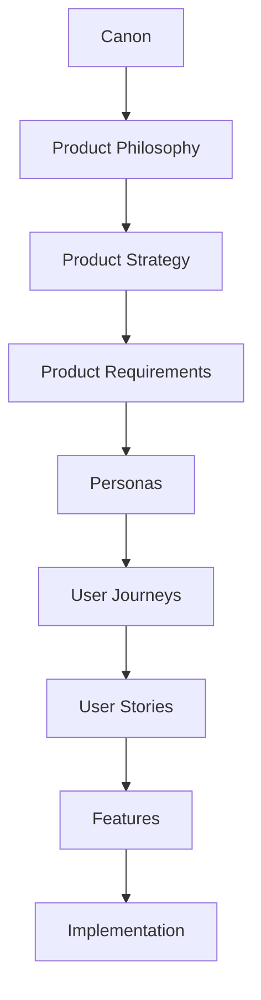
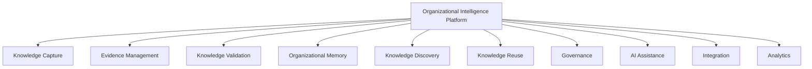
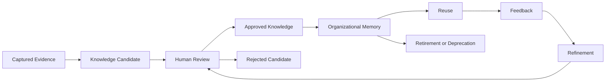
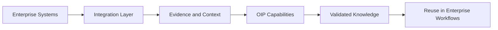

# Product Requirements

## Derived From

- Canon Version: `v1.0.0`
- Architecture Version: `v1.0.0`
- Implementation Version: `v1.0.0`
- Strategy Version: `v1.0.0`
- Research Version: `v1.0.0`
- Product Philosophy Version: `v1.0.0`
- Product Strategy Version: `v1.0.0`

### Primary Repository Sources

- [Canon](../canon/README.md)
- [Architecture](../architecture/README.md)
- [Implementation](../implementation/README.md)
- [Strategy](../strategy/README.md)
- [Research](../research/README.md)
- [Product Philosophy](./00_PRODUCT_PHILOSOPHY.md)
- [Product Strategy](./01_PRODUCT_STRATEGY.md)

---

Status: **Active**

## Primary Question

What core product capabilities are required for the Organizational Intelligence Platform to fulfill its Product Strategy while remaining aligned with the Canon and Product Philosophy?

This document is one of the most important Product documents.

It translates Product Strategy into the enduring capabilities the Organizational Intelligence Platform must provide. It is not a feature list, UI specification, engineering specification, or sprint backlog.

It defines what the product must be capable of, regardless of implementation.

## 1. Executive Summary

Product Requirements translate Product Strategy into concrete platform capabilities.

Product Philosophy defines how product decisions should be made. Product Strategy defines how the platform should evolve over time. Product Requirements define the enduring capabilities the platform must provide throughout that evolution.

The Organizational Intelligence Platform must be capable of:

- Capturing operational knowledge from work.
- Preserving evidence.
- Supporting human validation.
- Maintaining durable Organizational Memory.
- Enabling trusted discovery and reuse.
- Governing access, lifecycle, and accountability.
- Providing reviewable AI assistance.
- Integrating with enterprise systems.
- Measuring knowledge quality and organizational learning.

These requirements should remain valid even as interfaces, AI models, infrastructure, and implementation technologies change.

## Scope

This document defines:

- Product capabilities.
- Functional requirement categories.
- Non-functional requirements.
- Enterprise expectations.
- AI requirements.
- Knowledge requirements.
- Integration requirements.
- Product constraints.
- Product quality attributes.
- Success conditions.

## Philosophy

Requirements should describe what the platform must be capable of, not how those capabilities are implemented.

A requirement is durable when it remains true across:

- Different user interfaces.
- Different AI models.
- Different databases.
- Different cloud providers.
- Different customer segments.
- Different release schedules.

## Expected Outcomes

This document should help future teams:

- Distinguish capabilities from features.
- Translate strategy into product planning.
- Preserve Canon alignment.
- Guide personas, journeys, stories, workflows, and feature catalogs.
- Avoid premature implementation assumptions.
- Evaluate product completeness at the capability level.

## 2. Relationship to Repository

Product Requirements sit between Product Strategy and downstream product planning.

## Responsibility of Each Layer

| Layer | Responsibility |
| --- | --- |
| Canon | Defines the company's enduring foundation and source of truth. |
| Product Philosophy | Defines enduring product judgment and product principles. |
| Product Strategy | Defines product evolution, capability sequencing, and expansion logic. |
| Product Requirements | Defines enduring capabilities and quality expectations. |
| Personas | Define the people and roles the product serves. |
| User Journeys | Define how people move through workflows over time. |
| User Stories | Define user-centered needs in actionable form. |
| Features | Define concrete product functionality. |
| Implementation | Defines how capabilities are built, deployed, and operated. |

Product Requirements do not replace downstream planning. They constrain and guide it.

Every later product artifact should be able to trace back to these requirements.

## 3. Product Requirement Principles

## Principle Summary

| Principle | Requirement Meaning |
| --- | --- |
| Capability Before Feature | Define what the platform must enable before deciding how it appears. |
| Evidence Before Automation | The platform must preserve evidence before automating conclusions. |
| Human Review Before Autonomy | Governed knowledge must remain reviewable before autonomous use. |
| Governance by Design | Permissions, auditability, lifecycle, and policy must be built into product capability. |
| Reusable Capabilities | Requirements should produce platform capabilities that work across domains. |
| Platform Consistency | Concepts, workflows, and governance should remain coherent across the product. |
| Explainability | Users must understand source, reasoning, status, and confidence. |
| Long-Term Maintainability | Requirements should support product evolution without knowledge loss. |
| Evolution Without Disruption | Customers should keep their memory and governance as the product changes. |

## Capability Before Feature

The product should define required capabilities before defining features.

Feature thinking asks:

> What screen, button, or tool should exist?

Capability thinking asks:

> What must the platform enable the organization to do?

This document stays at the capability level so future features can evolve without weakening the product foundation.

## Evidence Before Automation

Automation is only responsible when the platform understands the evidence behind an action or recommendation.

The product must be capable of preserving:

- Source data.
- Context.
- Reasoning.
- Reviewer decisions.
- Confidence.
- Version history.

Without evidence, automation risks becoming untrusted speed.

## Human Review Before Autonomy

The platform may support increasingly automated workflows over time, but governed knowledge must remain reviewable.

Human Review is required because the platform deals with organizational truth, customer-facing knowledge, and enterprise trust.

Autonomy can grow only where:

- Risk is low.
- Evidence is strong.
- Governance is clear.
- Review history supports confidence.
- Customers explicitly accept the behavior.

## Governance by Design

Governance must be a core product capability.

It cannot be added later as a separate administrative layer.

The product must be capable of enforcing:

- Access permissions.
- Approval requirements.
- Audit trails.
- Version control.
- Retention rules.
- Knowledge status.
- AI transparency.

## Reusable Capabilities

The platform should build capabilities that can serve multiple domains.

For example, review, evidence, memory, governance, retrieval, and analytics should not be rebuilt separately for each use case.

Reusable capabilities preserve platform coherence and reduce long-term complexity.

## Platform Consistency

The product must preserve consistent concepts across workflows.

A case, evidence item, knowledge candidate, review, memory artifact, user, organization, agent, and workflow should not mean different things in different parts of the platform.

Consistency protects the Domain Model and makes the product easier to understand and extend.

## Explainability

The product must support explanation.

Users should be able to understand:

- Where knowledge came from.
- Why a recommendation exists.
- What evidence supports it.
- Who reviewed it.
- Whether it is approved.
- When it changed.
- Where it has been reused.

## Long-Term Maintainability

Product requirements should support durable ownership, maintenance, and evolution.

The platform must avoid creating knowledge systems that become opaque, stale, or impossible to govern.

## Evolution Without Disruption

The product must evolve without forcing customers to restart their organizational knowledge.

New capabilities, models, integrations, and workflows should preserve:

- Existing memory.
- Review history.
- Evidence lineage.
- Permissions.
- Knowledge status.
- Customer trust.

## 4. Core Product Capabilities

The Organizational Intelligence Platform requires a set of core capability domains.

## Knowledge Capture

The platform must capture operational knowledge from enterprise workflows.

It must be capable of recognizing that knowledge can appear in:

- Support cases.
- Conversations.
- Escalations.
- Decisions.
- Documents.
- Reviews.
- Workflows.
- Exceptions.
- Human explanations.
- AI-assisted outputs.

Knowledge capture should not require every user to become a document author. The product should help identify when work contains reusable learning.

## Evidence Management

The platform must preserve supporting evidence.

Evidence is what allows knowledge to be trusted, reviewed, challenged, corrected, and reused.

The platform must distinguish:

- Raw evidence.
- Interpreted evidence.
- AI-generated outputs.
- Human-reviewed conclusions.
- Validated knowledge.

Evidence management is foundational to explainability.

## Knowledge Validation

The platform must support Human Review.

Knowledge should not become governed Organizational Memory merely because AI generated it or a workflow completed.

The platform must support:

- Review.
- Approval.
- Rejection.
- Revision.
- Escalation.
- Reviewer attribution.
- Review history.
- Confidence updates.

## Organizational Memory

The platform must maintain trusted institutional knowledge.

Organizational Memory should be:

- Durable.
- Versioned.
- Governed.
- Searchable.
- Reusable.
- Correctable.
- Traceable.
- Owned.
- Lifecycle-managed.

Memory is not storage alone. It is validated knowledge that improves future work.

## Knowledge Discovery

The platform must enable trusted retrieval.

Users should be able to find relevant knowledge through:

- Search.
- Context.
- Relationships.
- Workflows.
- Prior cases.
- Evidence.
- Domain concepts.

Discovery should surface not only content, but also trust signals such as status, source, review, freshness, and reuse.

## Knowledge Reuse

The platform must encourage reuse of validated knowledge.

Reuse should help users:

- Resolve future work faster.
- Avoid repeated investigation.
- Apply prior decisions responsibly.
- Learn from previous cases.
- Understand when prior knowledge does or does not apply.

Reuse must remain contextual. The product should not encourage blind copying.

## Governance

The platform must enforce permissions, policies, auditability, and lifecycle management.

Governance capability must apply to:

- Users.
- Teams.
- Organizations.
- Knowledge artifacts.
- Evidence.
- AI outputs.
- Reviews.
- Integrations.
- Analytics.

Governance is required for enterprise trust.

## AI Assistance

The platform must provide AI-assisted reasoning while remaining reviewable.

AI should help users:

- Summarize.
- Classify.
- Detect patterns.
- Link evidence.
- Draft knowledge candidates.
- Recommend related knowledge.
- Identify gaps.
- Support review.

AI outputs must remain distinguishable from validated knowledge.

## Integration

The platform must integrate with enterprise systems.

OIP should learn from work already happening across existing tools rather than requiring customers to abandon their systems.

Integration capability should support:

- Data intake.
- Context retrieval.
- Identity.
- Events.
- APIs.
- Import and export.
- External knowledge sources.
- AI provider abstraction.

## Analytics

The platform must measure organizational learning and knowledge quality.

Analytics should help customers understand:

- Knowledge reuse.
- Review effectiveness.
- Knowledge gaps.
- Repeated work.
- AI recommendation quality.
- Memory growth.
- Stale knowledge.
- Organizational learning over time.

Analytics should measure capability growth, not vanity usage alone.

## 5. Functional Requirements

Functional requirements describe what the product must accomplish.

## Functional Requirement Matrix

| Requirement Category | The Product Must Accomplish |
| --- | --- |
| Capture Knowledge | Identify and preserve reusable knowledge from operational workflows. |
| Organize Knowledge | Structure knowledge by concepts, relationships, status, ownership, and lifecycle. |
| Search Knowledge | Enable users and systems to find relevant, authorized, and trusted knowledge. |
| Validate Knowledge | Support human review, approval, rejection, revision, and escalation. |
| Review Knowledge | Provide accountable review workflows for knowledge candidates and AI outputs. |
| Govern Knowledge | Enforce permissions, policies, auditability, retention, and lifecycle rules. |
| Trace Knowledge | Preserve source, evidence, reasoning, reviewer, version, and reuse history. |
| Integrate Knowledge | Connect knowledge flows across enterprise systems and external sources. |
| Analyze Knowledge | Measure quality, reuse, gaps, freshness, trust, and organizational learning. |
| Improve Knowledge | Support correction, refinement, revalidation, deprecation, and continuous improvement. |

## Capture Knowledge

The product must capture knowledge from work as it happens.

It should support capture from structured and unstructured sources while preserving source context.

Capture should result in candidates for review, not automatic truth.

## Organize Knowledge

The product must organize knowledge so it can be governed and reused.

Organization should include:

- Concepts.
- Categories.
- Relationships.
- Ownership.
- Status.
- Version.
- Source.
- Confidence.
- Lifecycle.

## Search Knowledge

The product must support trusted search and retrieval.

Search must respect:

- Permissions.
- Relevance.
- Freshness.
- Validation status.
- Evidence.
- Context.

## Validate Knowledge

The product must support validation workflows that turn candidates into trusted memory.

Validation must make the distinction between proposed, reviewed, approved, rejected, deprecated, and current knowledge visible.

## Review Knowledge

The product must enable accountable review.

Review should preserve:

- Reviewer identity.
- Decision.
- Reason.
- Time.
- Changes made.
- Follow-up requirements.

## Govern Knowledge

The product must govern knowledge across its lifecycle.

Governance should apply before and after publication, including access, retention, ownership, and retirement.

## Trace Knowledge

The product must preserve lineage.

Users should be able to trace knowledge from current use back to source evidence and validation.

## Integrate Knowledge

The product must connect with systems where work and knowledge already live.

Integration should support interoperability without making external systems the source of product identity.

## Analyze Knowledge

The product must provide insight into organizational learning.

Analysis should support both operational improvement and strategic understanding.

## Improve Knowledge

The product must support continuous improvement.

Knowledge should be correctable, refinable, and retireable as evidence changes.

## 6. Non-Functional Requirements

Non-functional requirements define the qualities the platform must exhibit.

## Non-Functional Requirement Matrix

| Quality | Why It Matters |
| --- | --- |
| Reliability | Users must trust that memory, review, and retrieval work consistently. |
| Availability | Enterprise workflows may depend on access to trusted knowledge. |
| Scalability | The platform must support growing teams, knowledge, events, integrations, and AI usage. |
| Security | The platform handles sensitive organizational and customer knowledge. |
| Performance | Slow retrieval or review workflows reduce adoption and trust. |
| Explainability | Users must understand knowledge provenance, AI suggestions, and decisions. |
| Auditability | Enterprises require evidence of access, changes, review, and governance. |
| Extensibility | The platform must evolve across domains, models, and integrations. |
| Accessibility | Users with diverse needs should be able to use the product effectively. |
| Maintainability | The product must be sustainable for teams to operate and improve. |
| Observability | Teams must understand system behavior, failures, quality, and AI performance. |
| Interoperability | The product must work across existing enterprise environments. |

## Reliability

Organizational Memory loses value if users cannot rely on it.

The platform must be dependable enough for users to trust it as part of daily work.

## Availability

The platform should support availability expectations appropriate to enterprise workflows.

When knowledge is operationally important, downtime directly affects decision quality and productivity.

## Scalability

The platform must scale across:

- Users.
- Teams.
- Organizations.
- Cases.
- Knowledge artifacts.
- Evidence.
- Reviews.
- Events.
- Integrations.
- AI requests.

## Security

Security is fundamental because OIP handles customer data, internal expertise, business knowledge, and AI-assisted outputs.

Security must protect confidentiality, integrity, and availability.

## Performance

The platform must support timely work.

If search, review, or knowledge reuse feels slow, users may return to informal channels.

## Explainability

The platform must make knowledge and AI understandable.

Explainability is required for trust, governance, review, and enterprise adoption.

## Auditability

The platform must preserve evidence of important actions.

Auditability supports compliance, customer trust, debugging, and organizational learning.

## Extensibility

The platform must evolve across new workflows, domains, and technologies without losing coherence.

## Accessibility

The platform should be usable by diverse enterprise users.

Accessibility supports inclusion, adoption, and professional product maturity.

## Maintainability

The product must be maintainable by future teams.

Maintainability protects long-term product velocity and trust.

## Observability

The platform must allow teams to observe system behavior, AI behavior, workflow health, and knowledge quality.

## Interoperability

The product must operate within heterogeneous enterprise environments.

No customer should need to make OIP their only system before receiving value.

## 7. Enterprise Requirements

Enterprise customers expect trust, control, scale, and governance.

## Enterprise Requirement Matrix

| Requirement | Product Expectation |
| --- | --- |
| Role-Based Access | Access should reflect user role, team, organization, and purpose. |
| Audit Trails | Important actions should be logged and reviewable. |
| Compliance Support | The platform should support customer compliance obligations through controls and evidence. |
| Multi-Team Collaboration | Multiple teams should be able to contribute to and reuse knowledge responsibly. |
| Version Control | Knowledge should support history, comparison, rollback, and current-state clarity. |
| Data Governance | Customers should understand and control how data is processed and retained. |
| AI Transparency | Customers should know when AI is used and what evidence supports outputs. |
| Tenant Isolation | Customer data and memory should remain isolated. |
| Administrative Controls | Authorized administrators should manage users, policies, integrations, and governance settings. |

## Enterprise Trust Expectations

The platform must help customers answer:

- Who can access this knowledge?
- Who changed it?
- Who approved it?
- What evidence supports it?
- Which AI system assisted?
- Where did the data come from?
- Can it be corrected?
- Can it be retired?
- Can it be exported?
- Can it be audited?

Enterprise readiness is not an afterthought. It is a product requirement.

## 8. AI Requirements

AI must support Organizational Intelligence without becoming the source of authority.

## AI Must Provide

| AI Capability | Product Requirement |
| --- | --- |
| Summarization | Condense cases, evidence, conversations, and documents while preserving source context. |
| Classification | Identify topics, issue types, knowledge categories, risk levels, or workflow states. |
| Knowledge Candidate Generation | Draft candidate knowledge from operational evidence for human review. |
| Recommendation | Suggest related knowledge, prior cases, reviewers, or next actions. |
| Pattern Detection | Identify repeated issues, contradictions, gaps, and emerging themes. |
| Evidence Linking | Connect AI outputs to source evidence. |
| Context Awareness | Use authorized organizational context to improve relevance. |
| Review Support | Help reviewers compare, correct, approve, or reject AI-assisted outputs. |

## AI Must Not Do Without Human Oversight

| AI Must Not... | Reason |
| --- | --- |
| Promote unreviewed output into governed knowledge. | Violates Human Review and trust principles. |
| Override human accountability. | Organizations remain responsible for decisions. |
| Access unauthorized data. | Violates governance and security. |
| Hide evidence or uncertainty. | Weakens explainability. |
| Make high-impact decisions autonomously. | Creates trust, compliance, and ethical risk. |
| Update Organizational Memory without appropriate validation. | Risks memory pollution. |
| Become the product identity. | OIP is broader than AI capability. |

## AI Requirement Principle

AI outputs are candidates until validated.

The platform must keep visible distinctions among:

- Retrieved evidence.
- AI-generated output.
- Human-reviewed knowledge.
- Approved Organizational Memory.

## 9. Knowledge Requirements

Knowledge is the central product object of the Organizational Intelligence Platform.

## Knowledge Lifecycle

## Knowledge Requirement Matrix

| Requirement | Description |
| --- | --- |
| Lifecycle | Knowledge must move through clear states from capture to retirement. |
| Versioning | Changes should preserve history and current status. |
| Ownership | Knowledge should have responsible owners or stewardship. |
| Evidence | Knowledge should remain linked to supporting evidence. |
| Approval | Governed knowledge should require appropriate validation. |
| Retirement | Stale or invalid knowledge should be deprecated or removed from active use. |
| Traceability | Users should trace knowledge to source, review, version, and reuse. |
| Quality | Knowledge should be evaluated for accuracy, freshness, usefulness, and trust. |

## Supporting Organizational Memory

Organizational Memory requires knowledge that is:

- Trusted.
- Discoverable.
- Reusable.
- Current.
- Governed.
- Explainable.
- Correctable.

The platform must support each of these qualities.

## 10. Integration Requirements

OIP must interoperate with enterprise systems.

## Integration Capability Matrix

| Integration Area | Requirement |
| --- | --- |
| APIs | Provide stable contracts for connecting systems and exposing platform capabilities. |
| Events | Support event-driven communication where workflows, updates, or integrations require it. |
| Import / Export | Allow customers to bring data in and take data out in governed ways. |
| Authentication | Support enterprise identity and secure access patterns. |
| Existing Enterprise Systems | Connect with systems of record, workflow, collaboration, documentation, and support. |
| Identity Providers | Integrate with enterprise identity and access management. |
| AI Providers | Support replaceable AI providers and model abstraction. |
| External Knowledge Sources | Retrieve and reference knowledge from authorized external systems. |

## Interoperability Principles

- Integrations should respect permissions.
- External data should retain source context.
- Imported data should not automatically become validated knowledge.
- Export should preserve customer ownership and portability.
- AI providers should be replaceable.
- Integration failures should be observable and recoverable.

## Integration Flow

## 11. Product Constraints

Product constraints protect the platform's identity and trust.

## Constraint Matrix

| Constraint | Why It Exists |
| --- | --- |
| Human Review cannot be bypassed for governed knowledge. | Protects trust, accountability, and Canon alignment. |
| Organizational Memory must remain durable. | Prevents knowledge loss as interfaces, models, or systems change. |
| AI models must remain replaceable. | Protects model agnosticism and long-term adaptability. |
| Governance cannot be optional. | Enterprise trust requires permissions, auditability, and policy enforcement. |
| Product identity must remain focused. | Prevents drift into generic AI, productivity, or workflow tools. |
| Customer knowledge remains customer-owned. | Protects trust, portability, and enterprise adoption. |
| Evidence must remain distinguishable from interpretation. | Protects explainability and review quality. |
| Automation must respect risk. | Prevents unsafe or untrusted autonomous behavior. |

## Constraint Interpretation

Constraints are not limitations on imagination.

They are boundaries that keep the product coherent.

The platform should be ambitious, but ambition must remain aligned with Organizational Intelligence.

## 12. Product Quality Attributes

Product quality determines whether customers will trust and adopt the platform.

## Quality Attribute Model

| Attribute | Product Meaning |
| --- | --- |
| Trustworthiness | Users believe knowledge, AI assistance, and governance can be relied upon. |
| Predictability | The product behaves consistently across workflows and contexts. |
| Consistency | Concepts, patterns, states, and interactions remain coherent. |
| Transparency | Users can understand evidence, decisions, AI use, and review status. |
| Recoverability | Mistakes, failures, incorrect knowledge, or bad outputs can be corrected. |
| Simplicity | The product reduces complexity rather than adding unnecessary burden. |
| Learnability | Users can understand and adopt the product without excessive training. |
| Evolvability | The product can change without breaking memory or trust. |

## Contribution to Enterprise Adoption

| Attribute | Enterprise Adoption Contribution |
| --- | --- |
| Trustworthiness | Makes the product safe for important work. |
| Predictability | Reduces operational risk. |
| Consistency | Improves training and adoption. |
| Transparency | Supports review and governance. |
| Recoverability | Makes customers more willing to adopt AI-assisted workflows. |
| Simplicity | Reduces change management burden. |
| Learnability | Accelerates onboarding. |
| Evolvability | Protects long-term customer investment. |

## 13. Product Success Conditions

The product fulfills its requirements when customer capability improves.

## Success Condition Matrix

| Success Condition | What It Indicates |
| --- | --- |
| Knowledge quality improves. | Captured and validated knowledge becomes more accurate, useful, and trusted. |
| Reuse increases. | Customers apply validated knowledge to future work. |
| Organizational Entropy decreases. | Repeated investigation, duplicated work, and knowledge loss decline. |
| Human review becomes efficient. | Reviewers can validate knowledge without excessive burden. |
| AI recommendations become more trusted. | Users accept AI assistance because it is evidence-based and reviewable. |
| Customers expand usage. | The platform creates enough value to move across teams or departments. |
| Knowledge gaps become visible. | The organization can identify missing, stale, or conflicting knowledge. |
| Future work improves. | Prior learning measurably improves later decisions or workflows. |

## Capability-Based Success

The product should not be judged primarily by feature count.

It should be judged by whether it helps customers:

- Learn from work.
- Preserve knowledge.
- Trust AI assistance.
- Govern memory.
- Reuse validated insight.
- Improve future outcomes.

## 14. Repository Integration

Product Requirements influence all future Product documents.

## Downstream Influence

| Future Document | How Requirements Influence It |
| --- | --- |
| Personas | Identify users who create, review, govern, discover, and reuse knowledge. |
| User Journeys | Define journeys around capture, validation, memory, discovery, and reuse. |
| User Stories | Translate capabilities into user-centered needs. |
| Workflows | Structure work around evidence, review, governance, and learning. |
| Information Architecture | Organize product concepts around capability domains and knowledge lifecycle. |
| Feature Catalog | Map features to enduring requirements. |
| MVP Features | Select the smallest set of features required to validate core capabilities. |
| Engineering Implementation | Build capabilities while preserving constraints and quality attributes. |

## Derivation Rule

Every future Product document should state:

- Which Product Requirements it derives from.
- Which capability domain it supports.
- Which constraints it respects.
- Which success conditions it advances.
- Which requirements it intentionally excludes.

## 15. Traceability Matrix

| Canon Concept | Product Requirement |
| --- | --- |
| Organizational Memory | Durable validated knowledge lifecycle. |
| Human Review | Mandatory review workflows for governed knowledge. |
| Governance | Enterprise policy enforcement, access control, auditability, and lifecycle management. |
| Knowledge Flywheel | Continuous capture, validation, reuse, and improvement. |
| Organizational Intelligence | Knowledge improves future work and institutional capability. |
| AI as Amplifier, Not Authority | AI provides reviewable assistance but does not replace accountability. |
| Explainability | Evidence, source, reasoning, status, and review history remain visible. |
| Organizational Entropy | Product capabilities reduce repeated work, knowledge loss, and duplicated investigation. |
| Domain Model | Product concepts remain consistent across workflows and capabilities. |
| Product Philosophy | Requirements prioritize capability, trust, governance, and long-term learning over feature count. |

## 16. Limitations

This document intentionally avoids:

- UI design.
- Engineering architecture.
- Technology selection.
- Feature prioritization.
- Release planning.
- Roadmap sequencing.
- Sprint planning.
- Vendor decisions.
- Detailed API specifications.
- Database design.

Those belong in later Product, Architecture, Implementation, Roadmap, and Engineering documents.

This document defines enduring requirements. It does not decide how those requirements are implemented or when specific features ship.

## 17. Closing

Product Requirements define capabilities, not features.

Features may evolve.

Interfaces may change.

AI models will improve.

Technologies will be replaced.

Customer workflows will mature.

However, the underlying capabilities required to create Organizational Intelligence remain stable.

The platform must continue to capture knowledge, preserve evidence, enable human review, maintain Organizational Memory, support discovery and reuse, govern enterprise knowledge, integrate with existing systems, provide responsible AI assistance, and measure learning.

The purpose of Product Requirements is therefore not to prescribe implementation.

It is to preserve the enduring responsibilities the platform must fulfill throughout its evolution.

Every future product decision should ask:

> Which enduring capability does this strengthen?

If the answer is unclear, the decision should be reconsidered.
