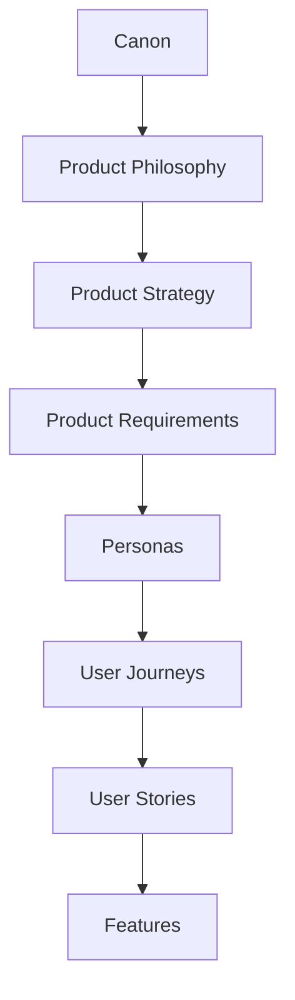
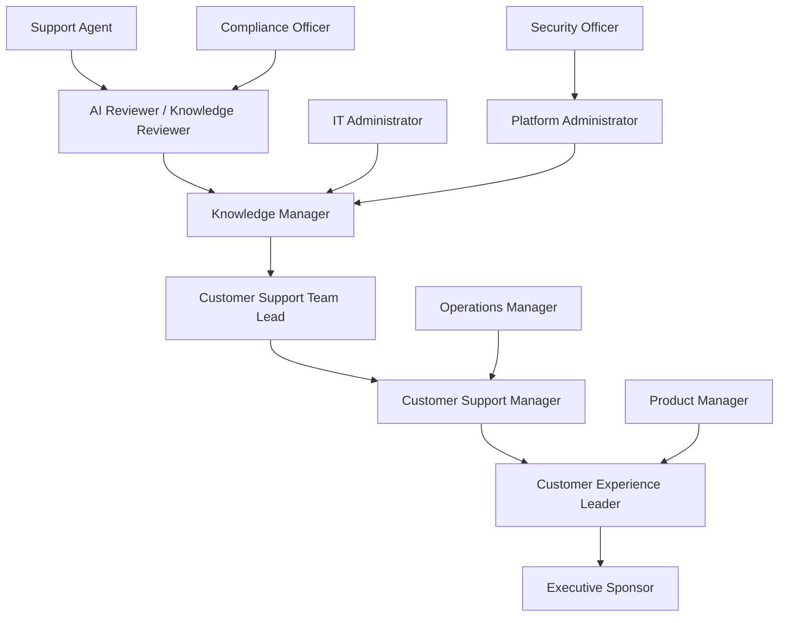

# Personas

## Derived From

- Canon Version: `v1.0.0`
- Architecture Version: `v1.0.0`
- Implementation Version: `v1.0.0`
- Strategy Version: `v1.0.0`
- Research Version: `v1.0.0`
- Product Philosophy Version: `v1.0.0`
- Product Strategy Version: `v1.0.0`
- Product Requirements Version: `v1.0.0`

### Primary Repository Sources

- [Canon](../canon/README.md)
- [Architecture](../architecture/README.md)
- [Implementation](../implementation/README.md)
- [Strategy](../strategy/README.md)
- [Research](../research/README.md)
- [Product Philosophy](./00_PRODUCT_PHILOSOPHY.md)
- [Product Strategy](./01_PRODUCT_STRATEGY.md)
- [Product Requirements](./02_PRODUCT_REQUIREMENTS.md)

---

Status: **Active**

## Primary Question

Who are the people the Organizational Intelligence Platform is designed to serve, and what responsibilities, goals, and challenges shape their interaction with the platform?

This document defines enduring user personas for the Organizational Intelligence Platform.

It is not a UX marketing exercise. It does not define fictional biographies, demographic stories, UI behavior, or feature design. It defines enterprise roles, responsibilities, goals, behaviors, pain points, decision-making patterns, and relationships to Organizational Intelligence.

## 1. Executive Summary

Personas represent organizational roles rather than fictional individuals.

The Organizational Intelligence Platform is designed around work, responsibilities, and decision-making. It is not designed around age, gender, lifestyle, personality archetypes, or invented biographies.

The product serves people who participate in organizational learning:

- People who encounter problems.
- People who resolve work.
- People who create knowledge.
- People who review knowledge.
- People who govern knowledge.
- People who manage teams.
- People who sponsor organizational improvement.

Personas help product teams translate platform capabilities into human needs.

They answer:

- Who creates Organizational Memory?
- Who validates it?
- Who governs it?
- Who uses it?
- Who depends on it?
- Who is accountable for it?
- Who benefits when the organization learns?

These personas should remain useful regardless of interface redesigns, AI model changes, or feature evolution.

## 2. Relationship to Repository

Personas translate product capabilities into human needs.

## Repository Responsibilities

| Layer | Responsibility |
| --- | --- |
| Canon | Defines enduring company truth and platform concepts. |
| Product Philosophy | Defines product principles and judgment. |
| Product Strategy | Defines product evolution and capability sequencing. |
| Product Requirements | Defines enduring platform capabilities. |
| Personas | Define who uses, governs, contributes to, and benefits from those capabilities. |
| User Journeys | Define how personas move through work over time. |
| User Stories | Define specific needs from persona perspectives. |
| Features | Define concrete product functionality. |

Personas do not create new strategy. They humanize the existing strategy.

## 3. Persona Design Principles

## Roles Before Identities

Personas should represent enterprise responsibilities.

The platform is not designed for fictional individuals. It is designed for roles that exist inside organizations.

## Goals Before Demographics

Demographics rarely explain how enterprise users interact with knowledge, AI, review, governance, or memory.

Goals matter more:

- Resolve issues.
- Improve quality.
- Reduce repeated work.
- Govern risk.
- Preserve knowledge.
- Make better decisions.

## Responsibilities Before Preferences

Preferences change. Responsibilities are more durable.

The personas should focus on what each role is accountable for, not what interface style they might prefer.

## Enterprise Context Matters

Enterprise users operate inside constraints:

- Policies.
- Permissions.
- Escalations.
- SLAs.
- Compliance.
- Budgets.
- Security reviews.
- Team structures.

Personas must reflect these constraints.

## Knowledge Work Is Collaborative

Organizational Intelligence is not created by one person.

Knowledge moves across roles:

- Agents notice patterns.
- Reviewers validate knowledge.
- Managers prioritize improvement.
- Administrators enforce governance.
- Executives sponsor capability growth.

## AI Supports Rather Than Replaces People

AI should assist personas with work, but it should not erase their accountability.

Each persona needs AI to behave differently depending on responsibility, risk, and decision authority.

## Personas Evolve Through Research

These personas are durable starting models.

They should be refined through:

- Customer interviews.
- Workflow observation.
- Pilot feedback.
- Usability testing.
- Support industry research.
- Experiment outcomes.

## One Person May Perform Multiple Roles

In smaller organizations, one person may act as support manager, knowledge manager, reviewer, and administrator.

The product should model responsibilities, not assume every role maps to a separate employee.

## 4. Persona Framework

Every persona should use a consistent structure.

## Standard Persona Template

| Field | Description |
| --- | --- |
| Persona Name | Role-based name. |
| Organizational Role | Position or responsibility in the enterprise. |
| Responsibilities | What the persona is accountable for. |
| Primary Goals | Outcomes the persona wants to achieve. |
| Success Measures | How success is evaluated. |
| Daily Activities | Common work patterns and tasks. |
| Knowledge Needs | Knowledge the persona needs to do the work well. |
| Collaboration Patterns | Other roles this persona works with. |
| Decision Authority | What decisions the persona can make or influence. |
| AI Expectations | How the persona expects AI to help. |
| Governance Responsibilities | How the persona participates in trust, policy, review, or control. |
| Major Pain Points | Problems the persona experiences. |
| Product Opportunities | Ways OIP can help the persona fulfill responsibilities. |

## Persona Comparison Dimensions

| Dimension | Why It Matters |
| --- | --- |
| Knowledge Creation | Determines who contributes new learning. |
| Knowledge Validation | Determines who approves or corrects knowledge. |
| Knowledge Governance | Determines who manages policy, access, and quality. |
| Knowledge Use | Determines who depends on Organizational Memory. |
| AI Trust | Determines how AI should be presented. |
| Decision Authority | Determines which workflows require approval. |

## 5. Primary Personas

Primary personas are daily or frequent users who directly create, validate, govern, or use Organizational Memory.

## Customer Support Agent

| Field | Description |
| --- | --- |
| Persona Name | Customer Support Agent |
| Organizational Role | Frontline or specialist support professional responsible for resolving customer issues. |
| Responsibilities | Interpret customer issues, investigate problems, search knowledge, communicate answers, escalate when necessary, document resolution context. |
| Primary Goals | Resolve customer issues accurately and efficiently while maintaining customer trust. |
| Success Measures | Resolution quality, response time, customer satisfaction, escalation appropriateness, consistency of answers. |
| Daily Activities | Reading cases, asking clarifying questions, searching documentation, consulting colleagues, drafting responses, applying prior knowledge. |
| Knowledge Needs | Product guidance, prior resolutions, policy answers, troubleshooting steps, escalation rules, customer context. |
| Collaboration Patterns | Works with team leads, knowledge reviewers, specialists, product managers, and managers. |
| Decision Authority | Can resolve routine cases and suggest knowledge candidates; may require approval for official knowledge. |
| AI Expectations | Summarization, response drafting, recommended knowledge, similar cases, classification, next-step suggestions. |
| Governance Responsibilities | Use approved knowledge, flag gaps, avoid publishing unreviewed AI output, preserve relevant evidence. |
| Major Pain Points | Poor search, repeated investigations, outdated docs, inconsistent answers, expert dependency, time pressure. |
| Product Opportunities | Reduce investigation time, surface trusted knowledge, capture reusable learning, support reviewed AI assistance. |

### Relationship With AI

The Support Agent needs AI to reduce cognitive load without taking away judgment.

AI should help the agent find, summarize, and draft. It should not pressure the agent to send unverified answers.

### Relationship With Organizational Memory

The Support Agent both uses and contributes to Organizational Memory.

Every resolved case may contain a lesson that future agents can reuse.

## Customer Support Team Lead

| Field | Description |
| --- | --- |
| Persona Name | Customer Support Team Lead |
| Organizational Role | Operational lead responsible for agent coaching, case quality, escalations, and team consistency. |
| Responsibilities | Monitor team work, support agents, handle escalations, identify recurring issues, maintain quality standards. |
| Primary Goals | Improve team performance, reduce repeated problems, ensure consistent support quality. |
| Success Measures | Team resolution quality, escalation rate, agent productivity, training effectiveness, knowledge reuse. |
| Daily Activities | Reviewing cases, coaching agents, triaging escalations, identifying knowledge gaps, coordinating with managers. |
| Knowledge Needs | Team performance patterns, repeated issue categories, review outcomes, agent knowledge gaps, escalation history. |
| Collaboration Patterns | Works with agents, knowledge managers, reviewers, support managers, and product/engineering partners. |
| Decision Authority | Can prioritize knowledge gaps, recommend process changes, and approve some team-level practices. |
| AI Expectations | Pattern detection, escalation summaries, coaching insights, knowledge gap identification, repeated issue alerts. |
| Governance Responsibilities | Ensure team uses trusted knowledge and follows review requirements. |
| Major Pain Points | Inconsistent agent behavior, repeated escalations, hidden knowledge gaps, overloaded experts. |
| Product Opportunities | Make team learning visible, reduce repeated escalations, improve coaching and knowledge reuse. |

### Relationship With AI

The Team Lead needs AI to reveal patterns across cases and agents.

AI should support coaching and improvement, not become surveillance without context.

### Relationship With Organizational Memory

The Team Lead turns frontline work into team-level learning.

## Knowledge Manager

| Field | Description |
| --- | --- |
| Persona Name | Knowledge Manager |
| Organizational Role | Owner or steward of knowledge quality, lifecycle, structure, and governance. |
| Responsibilities | Maintain knowledge base quality, reduce duplication, manage lifecycle, coordinate reviews, monitor reuse and freshness. |
| Primary Goals | Ensure organizational knowledge is accurate, discoverable, reusable, current, and trusted. |
| Success Measures | Knowledge quality, reuse rate, freshness, reduced duplication, lower search failure, review throughput. |
| Daily Activities | Reviewing knowledge candidates, updating articles, resolving conflicts, monitoring gaps, managing taxonomy or structure. |
| Knowledge Needs | Evidence, usage data, review history, stale knowledge signals, duplicate candidates, domain relationships. |
| Collaboration Patterns | Works with support agents, reviewers, managers, product teams, compliance, and administrators. |
| Decision Authority | Can approve, revise, retire, organize, or escalate knowledge depending on governance rules. |
| AI Expectations | Gap detection, duplicate detection, candidate drafting, quality scoring, reuse analysis, contradiction detection. |
| Governance Responsibilities | Maintain knowledge lifecycle, ownership, review standards, versioning, and retirement. |
| Major Pain Points | Documentation decay, duplication, low trust, poor metadata, hard-to-find evidence, manual review burden. |
| Product Opportunities | Make knowledge quality manageable, prioritize review work, improve discoverability and lifecycle governance. |

### Relationship With AI

The Knowledge Manager needs AI to reduce maintenance burden and detect patterns.

AI should provide candidates and signals, not silently rewrite organizational truth.

### Relationship With Organizational Memory

The Knowledge Manager is a primary steward of Organizational Memory.

## Customer Support Manager

| Field | Description |
| --- | --- |
| Persona Name | Customer Support Manager |
| Organizational Role | Manager responsible for support operations, performance, staffing, process, and outcomes. |
| Responsibilities | Improve support efficiency, quality, staffing, escalation management, service metrics, and process discipline. |
| Primary Goals | Deliver reliable support at scale while reducing cost, repeated work, and quality variation. |
| Success Measures | Resolution time, customer satisfaction, escalation rate, agent productivity, onboarding time, operational consistency. |
| Daily Activities | Reviewing metrics, managing capacity, addressing escalations, improving processes, coordinating with leadership. |
| Knowledge Needs | Operational trends, repeated issue causes, knowledge gaps, agent performance, customer pain patterns. |
| Collaboration Patterns | Works with team leads, knowledge managers, customer experience leaders, operations, product, and executives. |
| Decision Authority | Can prioritize operational improvements, staffing, processes, and support initiatives. |
| AI Expectations | Insights, trend summaries, operational recommendations, knowledge reuse metrics, risk flags. |
| Governance Responsibilities | Ensure support processes align with approved knowledge and organizational policy. |
| Major Pain Points | Scaling support, inconsistent quality, onboarding delays, expert bottlenecks, unclear ROI from AI. |
| Product Opportunities | Connect knowledge quality to operational outcomes and support performance. |

### Relationship With AI

The Support Manager needs AI to reveal operational patterns and improvement opportunities.

AI should support management decisions with evidence, not hide uncertainty.

### Relationship With Organizational Memory

The Support Manager benefits when Organizational Memory reduces repeated work and improves team consistency.

## Customer Experience Leader

| Field | Description |
| --- | --- |
| Persona Name | Customer Experience Leader |
| Organizational Role | Executive or senior leader responsible for customer experience quality across support, success, and service. |
| Responsibilities | Improve customer trust, service consistency, customer satisfaction, retention, and cross-functional learning. |
| Primary Goals | Ensure customer-facing teams learn from customer interactions and improve over time. |
| Success Measures | Customer satisfaction, retention, service quality, customer effort, support consistency, experience trends. |
| Daily Activities | Reviewing experience metrics, prioritizing initiatives, aligning teams, sponsoring transformation. |
| Knowledge Needs | Customer pain trends, support themes, knowledge gaps, systemic issues, cross-functional insights. |
| Collaboration Patterns | Works with support managers, product leaders, operations, executives, and digital transformation teams. |
| Decision Authority | Can sponsor programs, allocate resources, prioritize strategic initiatives, and influence executive decisions. |
| AI Expectations | Strategic insights, trend detection, summary of organizational learning, confidence indicators. |
| Governance Responsibilities | Ensure customer-facing AI and knowledge practices preserve trust and brand quality. |
| Major Pain Points | Fragmented customer insight, repeated issues, inconsistent customer experience, lack of learning across teams. |
| Product Opportunities | Turn customer interactions into strategic organizational intelligence. |

### Relationship With AI

The Customer Experience Leader needs AI to surface patterns and trends, not produce unreviewed strategy.

### Relationship With Organizational Memory

This persona sees Organizational Memory as a strategic asset for improving customer experience.

## AI Reviewer / Knowledge Reviewer

| Field | Description |
| --- | --- |
| Persona Name | AI Reviewer / Knowledge Reviewer |
| Organizational Role | Specialist responsible for validating AI-generated or human-proposed knowledge before it becomes trusted memory. |
| Responsibilities | Review AI outputs, verify evidence, approve or reject candidates, correct errors, identify uncertainty, enforce standards. |
| Primary Goals | Ensure only accurate, trustworthy, evidence-supported knowledge enters Organizational Memory. |
| Success Measures | Review accuracy, agreement rate, correction quality, false approval reduction, review throughput, trust improvement. |
| Daily Activities | Inspecting AI-generated candidates, comparing evidence, revising wording, approving or rejecting knowledge. |
| Knowledge Needs | Source evidence, AI output, prior knowledge, review criteria, policy, domain expertise. |
| Collaboration Patterns | Works with support agents, knowledge managers, team leads, compliance, and domain experts. |
| Decision Authority | Can validate or reject knowledge within assigned scope. |
| AI Expectations | Evidence highlighting, contradiction detection, uncertainty indicators, review assistance, comparison support. |
| Governance Responsibilities | Prevent unreviewed or incorrect knowledge from becoming official. |
| Major Pain Points | High review volume, unclear evidence, AI hallucination, inconsistent standards, pressure to approve quickly. |
| Product Opportunities | Make review efficient, evidence-rich, and accountable. |

### Relationship With AI

The Reviewer is the human trust boundary for AI-assisted knowledge.

AI should help the reviewer inspect, compare, and decide. It should not replace the reviewer's accountability.

### Relationship With Organizational Memory

The Reviewer determines whether candidates deserve to become memory.

## 6. Secondary Personas

Secondary personas may not be daily users, but they influence adoption, governance, deployment, trust, and expansion.

## IT Administrator

| Field | Description |
| --- | --- |
| Persona Name | IT Administrator |
| Organizational Role | Technical operator responsible for systems access, integrations, identity, and support. |
| Responsibilities | Manage technical configuration, integrations, access, system health, and user provisioning. |
| Primary Goals | Ensure the platform operates securely and integrates cleanly with enterprise systems. |
| Success Measures | Integration reliability, access correctness, support ticket reduction, system uptime, administrative efficiency. |
| Knowledge Needs | System status, integration logs, identity mappings, access policies, error reports. |
| AI Expectations | Diagnostics, configuration guidance, integration issue summaries. |
| Governance Responsibilities | Enforce access, identity, and system administration controls. |
| Product Opportunities | Reduce setup burden and make system behavior transparent. |

## Platform Administrator

| Field | Description |
| --- | --- |
| Persona Name | Platform Administrator |
| Organizational Role | Business or technical administrator responsible for platform configuration, policies, users, and governance settings. |
| Responsibilities | Manage workspaces, roles, permissions, policy settings, review configuration, and operational controls. |
| Primary Goals | Ensure the platform reflects organizational structure and governance needs. |
| Success Measures | Correct access, clear policies, manageable administration, successful adoption. |
| AI Expectations | Policy configuration assistance, anomaly detection, administrative summaries. |
| Governance Responsibilities | Own day-to-day platform governance configuration. |
| Product Opportunities | Make governance manageable without requiring technical depth for every action. |

## Compliance Officer

| Field | Description |
| --- | --- |
| Persona Name | Compliance Officer |
| Organizational Role | Risk or compliance professional responsible for policy, audit, regulatory readiness, and control evidence. |
| Responsibilities | Ensure knowledge, AI, and data practices align with policy and regulatory expectations. |
| Primary Goals | Reduce compliance risk and preserve auditability. |
| Success Measures | Audit readiness, policy adherence, incident reduction, evidence completeness. |
| AI Expectations | AI usage visibility, audit summaries, policy violation signals, explainability. |
| Governance Responsibilities | Define or review policy requirements and audit evidence. |
| Product Opportunities | Provide clear traceability, access records, AI transparency, and review history. |

## Security Officer

| Field | Description |
| --- | --- |
| Persona Name | Security Officer |
| Organizational Role | Security professional responsible for protecting data, access, systems, and trust boundaries. |
| Responsibilities | Assess vendor risk, monitor access, evaluate controls, review incidents, enforce security posture. |
| Primary Goals | Protect sensitive organizational and customer data. |
| Success Measures | Reduced risk, strong access controls, incident readiness, successful security review. |
| AI Expectations | Security visibility, access anomaly detection, AI tool-use transparency. |
| Governance Responsibilities | Enforce security policy and review data protection controls. |
| Product Opportunities | Make AI and knowledge access auditable, permissioned, and explainable. |

## Product Manager

| Field | Description |
| --- | --- |
| Persona Name | Product Manager |
| Organizational Role | Product owner who uses customer and support knowledge to improve products and decisions. |
| Responsibilities | Understand customer pain, prioritize improvements, interpret support patterns, coordinate with teams. |
| Primary Goals | Convert customer evidence into better product decisions. |
| Success Measures | Better prioritization, fewer repeated product issues, clearer customer insights. |
| AI Expectations | Trend summaries, issue clustering, customer pain analysis, evidence retrieval. |
| Governance Responsibilities | Use validated knowledge responsibly in product decisions. |
| Product Opportunities | Connect support learning to product improvement. |

## Operations Manager

| Field | Description |
| --- | --- |
| Persona Name | Operations Manager |
| Organizational Role | Manager responsible for operational performance, process improvement, and cross-functional execution. |
| Responsibilities | Improve workflows, reduce inefficiency, coordinate teams, monitor operational outcomes. |
| Primary Goals | Make operations more consistent, efficient, and learnable. |
| Success Measures | Reduced process friction, faster resolution, better handoffs, improved consistency. |
| AI Expectations | Process insights, bottleneck detection, knowledge gap summaries. |
| Governance Responsibilities | Ensure operational knowledge is reliable and reusable. |
| Product Opportunities | Turn repeated operational work into institutional capability. |

## Executive Sponsor

| Field | Description |
| --- | --- |
| Persona Name | Executive Sponsor |
| Organizational Role | Senior leader responsible for sponsoring OIP adoption, funding, and strategic alignment. |
| Responsibilities | Approve investment, align stakeholders, evaluate outcomes, champion organizational learning. |
| Primary Goals | Improve organizational capability, customer experience, productivity, and decision quality. |
| Success Measures | Business impact, adoption expansion, risk reduction, measurable learning, executive confidence. |
| AI Expectations | Strategic insights, risk visibility, trend summaries, capability metrics. |
| Governance Responsibilities | Ensure adoption aligns with strategy, risk appetite, and organizational values. |
| Product Opportunities | Show measurable improvement in institutional capability. |

## 7. Persona Relationships

Personas collaborate through the Knowledge Flywheel.

## Knowledge Flow Between Roles

| Flow | Meaning |
| --- | --- |
| Support Agent to Reviewer | Operational work produces candidate knowledge. |
| Reviewer to Knowledge Manager | Validated or rejected candidates inform knowledge lifecycle. |
| Knowledge Manager to Team Lead | Knowledge quality and gaps inform coaching and team practices. |
| Team Lead to Support Manager | Team patterns inform operational decisions. |
| Support Manager to CX Leader | Support learning informs customer experience strategy. |
| CX Leader to Executive Sponsor | Organizational intelligence informs strategic investment. |
| Compliance and Security to Administrators | Governance and risk requirements shape platform controls. |
| Product Manager to Support Roles | Customer evidence informs product improvement. |

## Collaboration Principle

No single persona owns Organizational Intelligence alone.

Organizational Intelligence emerges when these roles cooperate around evidence, review, memory, governance, and reuse.

## 8. Knowledge Responsibilities

Each persona interacts with knowledge differently.

## Knowledge Interaction Matrix

| Persona | Capture | Validation | Governance | Discovery | Reuse | Improvement |
| --- | --- | --- | --- | --- | --- | --- |
| Customer Support Agent | High | Low to Medium | Low | High | High | Medium |
| Customer Support Team Lead | Medium | Medium | Medium | High | High | High |
| Knowledge Manager | High | High | High | High | High | High |
| Customer Support Manager | Medium | Medium | Medium | High | High | High |
| Customer Experience Leader | Low | Low | Medium | High | Medium | High |
| AI Reviewer / Knowledge Reviewer | Medium | High | High | High | Medium | High |
| IT Administrator | Low | Low | High technical governance | Medium | Low | Medium |
| Platform Administrator | Low | Low to Medium | High | Medium | Medium | Medium |
| Compliance Officer | Low | Medium | High | Medium | Low | Medium |
| Security Officer | Low | Low | High | Medium | Low | Medium |
| Product Manager | Medium | Medium | Low to Medium | High | High | High |
| Operations Manager | Medium | Medium | Medium | High | High | High |
| Executive Sponsor | Low | Low | Medium | High | Medium | Medium |

## Responsibility Interpretation

- Agents create and use knowledge during work.
- Reviewers validate knowledge before it becomes trusted.
- Knowledge Managers steward the lifecycle.
- Managers use knowledge to improve operations.
- Leaders use knowledge to make better organizational decisions.
- Administrators and officers preserve governance and trust.

## 9. AI Interaction Model

Different personas need AI to help in different ways.

## AI Interaction Table

| Persona | AI Should Help With | Human Review Boundary |
| --- | --- | --- |
| Customer Support Agent | Drafting, summarization, recommendations, similar cases, classification. | Agent verifies before customer-facing use. |
| Customer Support Team Lead | Pattern detection, coaching insights, escalation summaries, gap detection. | Team Lead interprets patterns before acting. |
| Knowledge Manager | Gap detection, duplicate detection, quality monitoring, reuse analysis. | Manager validates lifecycle decisions. |
| Customer Support Manager | Operational trends, ROI signals, repeated issue analysis, team-level insights. | Manager decides operational changes. |
| Customer Experience Leader | Strategic trends, customer pain themes, organizational learning indicators. | Leader interprets business meaning. |
| AI Reviewer / Knowledge Reviewer | Evidence highlighting, contradiction detection, uncertainty signals, candidate comparison. | Reviewer approves or rejects knowledge. |
| IT Administrator | Diagnostics, configuration guidance, integration summaries. | Admin approves system changes. |
| Platform Administrator | Policy setup assistance, governance summaries, admin alerts. | Admin controls platform policy. |
| Compliance Officer | Audit summaries, AI use visibility, policy conflict detection. | Officer interprets compliance obligations. |
| Security Officer | Access anomaly summaries, tool-use visibility, risk signals. | Officer determines security response. |
| Product Manager | Support trend summaries, customer issue clustering, evidence retrieval. | PM makes product decisions. |
| Operations Manager | Bottleneck detection, process insights, repeated work analysis. | Manager changes processes. |
| Executive Sponsor | Executive summaries, strategic trends, capability metrics. | Executive owns strategic decisions. |

## AI Principle by Persona

AI should adapt to responsibility level.

The more consequential the decision, the more visible evidence, review, and governance must become.

## Human Review Remains Essential

Human Review remains essential when:

- Knowledge becomes official.
- Customers may rely on output.
- Policies are interpreted.
- Sensitive data is involved.
- Strategic decisions are made.
- AI confidence is uncertain.
- Evidence conflicts.

## 10. Pain Point Analysis

Many pain points are shared across personas, but they appear differently by role.

## Pain Point Matrix

| Pain Point | Most Affected Personas | Product Relevance |
| --- | --- | --- |
| Repeated investigations | Support Agent, Team Lead, Support Manager | Indicates Organizational Entropy and knowledge reuse opportunity. |
| Fragmented documentation | Support Agent, Knowledge Manager, Product Manager | Requires discovery, evidence, and governance. |
| Inconsistent answers | Support Agent, Team Lead, CX Leader, Compliance Officer | Requires validated knowledge and review. |
| Tribal knowledge | Support Agent, Team Lead, Knowledge Manager, Operations Manager | Requires capture and Organizational Memory. |
| Onboarding delays | Support Manager, Team Lead, Support Agent | Requires reusable trusted knowledge. |
| Poor search | Support Agent, Knowledge Manager, Product Manager | Requires trusted discovery and context. |
| AI trust | Reviewer, Support Agent, Compliance Officer, Security Officer, Executive Sponsor | Requires explainability and Human Review. |
| Governance burden | Knowledge Manager, Platform Administrator, Compliance Officer | Requires governance as natural workflow. |
| Expert dependency | Team Lead, Support Manager, Knowledge Manager | Requires knowledge capture and reuse. |
| Stale knowledge | Knowledge Manager, Support Agent, Compliance Officer | Requires lifecycle and revalidation. |
| Weak operational insight | Support Manager, CX Leader, Executive Sponsor | Requires analytics and learning measurement. |

## Cross-Persona Pain Pattern

The same underlying problem often appears differently:

- Agents experience poor knowledge as slow resolution.
- Managers experience it as inconsistent performance.
- Knowledge Managers experience it as maintenance burden.
- Executives experience it as organizational inefficiency.
- Compliance teams experience it as risk.

OIP must connect these perspectives without flattening them.

## 11. Success Definition by Persona

Success differs by responsibility.

## Success Matrix

| Persona | Success Means |
| --- | --- |
| Customer Support Agent | Resolves issues faster, trusts recommendations, avoids repeated investigation, contributes learning without heavy burden. |
| Customer Support Team Lead | Coaches more effectively, reduces escalations, sees repeated issues, improves team consistency. |
| Knowledge Manager | Improves knowledge quality, reduces duplication, manages lifecycle, increases reuse and trust. |
| Customer Support Manager | Improves resolution quality, lowers repeated work, shortens onboarding, connects knowledge to operational outcomes. |
| Customer Experience Leader | Sees customer pain trends, improves consistency, turns service interactions into organizational learning. |
| AI Reviewer / Knowledge Reviewer | Validates knowledge efficiently, reduces AI risk, improves trust, prevents memory pollution. |
| IT Administrator | Maintains reliable integrations, correct access, and manageable operations. |
| Platform Administrator | Keeps platform governance clear, consistent, and manageable. |
| Compliance Officer | Gains auditability, policy alignment, and confidence in AI and knowledge practices. |
| Security Officer | Maintains data protection, access visibility, and secure AI/tool boundaries. |
| Product Manager | Uses support and customer knowledge to make better product decisions. |
| Operations Manager | Reduces repeated operational work and improves cross-team learning. |
| Executive Sponsor | Sees measurable capability improvement and expanding organizational intelligence. |

## Success Principle

Persona success should not be defined by feature usage alone.

Success means the persona can fulfill responsibilities more effectively while contributing to Organizational Intelligence.

## 12. Persona Evolution

Personas evolve as the platform expands beyond Customer Support.

## Expansion Domains

| Domain | Persona Evolution |
| --- | --- |
| IT | Support Agent maps to Service Desk Analyst; Knowledge Manager maps to Runbook or IT Knowledge Owner. |
| HR | Support Agent maps to HR Service Representative; Reviewer maps to Policy Reviewer. |
| Sales | Support Agent maps to Sales or Revenue Operations contributor; Knowledge Manager maps to Enablement Owner. |
| Finance | Reviewer and Compliance personas become more central due to control and accuracy requirements. |
| Compliance | Compliance Officer becomes a primary daily persona rather than secondary. |
| Legal | Reviewer role becomes expert-heavy; evidence, confidentiality, and versioning become more important. |

## Universal Needs

Across domains, users still need to:

- Create knowledge.
- Validate knowledge.
- Govern knowledge.
- Discover knowledge.
- Reuse knowledge.
- Improve knowledge.
- Understand AI assistance.
- Preserve accountability.

## Persona Stability

Job titles may change by domain.

Responsibilities remain stable.

The product should therefore design for responsibility patterns rather than title-specific assumptions.

## 13. Repository Integration

Personas influence downstream product documents.

## Persona Influence Matrix

| Repository Area | Persona Influence |
| --- | --- |
| User Journeys | Define how each role moves through capture, review, governance, discovery, and reuse. |
| User Stories | Provide role-specific needs and success criteria. |
| Workflow Design | Clarify collaboration, handoffs, review points, and authority. |
| Information Architecture | Organize concepts around responsibilities and knowledge lifecycle. |
| Feature Catalog | Map features to persona responsibilities and value. |
| MVP Scope | Identify which roles must be supported first. |
| Product Metrics | Define success by persona outcomes, not feature count. |

## Derivation Rule

Future User Journey and User Story documents should state:

- Which personas they serve.
- Which responsibilities they support.
- Which knowledge interactions they involve.
- Which AI and governance boundaries apply.
- Which Product Requirements they derive from.

## 14. Traceability Matrix

| Canon Concept | Persona Expression |
| --- | --- |
| Organizational Memory | Knowledge Manager preserves institutional knowledge. |
| Human Review | AI Reviewer / Knowledge Reviewer validates AI-generated and human-proposed knowledge. |
| Governance | Compliance Officer, Security Officer, IT Administrator, and Platform Administrator enforce policy and trust. |
| Knowledge Flywheel | Support Agents continuously contribute new learning from operational work. |
| Organizational Intelligence | Executives and managers use organizational insights for better decisions. |
| AI as Amplifier, Not Authority | AI assists each persona according to responsibility while humans remain accountable. |
| Organizational Entropy | Support and operations personas experience repeated work, fragmented knowledge, and expert dependency. |
| Explainability | Reviewers, managers, compliance officers, and users require evidence and traceability. |
| Domain Language | Personas express platform concepts through enterprise roles and responsibilities. |
| Product Requirements | Personas map human responsibilities to capture, validation, memory, governance, discovery, reuse, integration, and analytics. |

## 15. Limitations

This document intentionally avoids:

- UI behavior.
- Workflow specifications.
- Feature design.
- Implementation details.
- Demographic assumptions.
- Fictional biographies.
- Marketing personas.
- Individual personality types.
- Hiring profiles.
- Org chart prescriptions.

Personas represent organizational responsibilities rather than individuals.

They should be refined through research and customer discovery.

## 16. Closing

Personas are the human expression of Organizational Intelligence.

The platform is not built for job titles alone.

It is built for the responsibilities people carry within an organization.

As the platform evolves, technologies, interfaces, and workflows may change, but the fundamental human needs remain remarkably stable:

- Creating knowledge.
- Validating knowledge.
- Governing knowledge.
- Discovering knowledge.
- Reusing knowledge.
- Improving knowledge.
- Helping organizations continuously learn.

Understanding these enduring responsibilities ensures that every future product decision remains centered on people rather than technology.

The product should not ask only:

> What can AI do?

It should ask:

> What responsibility is this person carrying, and how can the platform help them strengthen Organizational Intelligence?
