# User Journeys

## Derived From

- Canon Version: `v1.0.0`
- Architecture Version: `v1.0.0`
- Implementation Version: `v1.0.0`
- Strategy Version: `v1.0.0`
- Research Version: `v1.0.0`
- Product Philosophy Version: `v1.0.0`
- Product Strategy Version: `v1.0.0`
- Product Requirements Version: `v1.0.0`
- Personas Version: `v1.0.0`

### Primary Repository Sources

- [Canon](../canon/README.md)
- [Architecture](../architecture/README.md)
- [Implementation](../implementation/README.md)
- [Strategy](../strategy/README.md)
- [Research](../research/README.md)
- [Product Philosophy](./00_PRODUCT_PHILOSOPHY.md)
- [Product Strategy](./01_PRODUCT_STRATEGY.md)
- [Product Requirements](./02_PRODUCT_REQUIREMENTS.md)
- [Personas](./03_PERSONAS.md)

---

Status: **Active**

## Primary Question

How do the platform's personas accomplish meaningful organizational work from beginning to end while strengthening Organizational Memory and Organizational Intelligence?

This document defines the enduring user journeys of the Organizational Intelligence Platform.

It is not a UI flow document. It is not a screen navigation document. It defines how enterprise personas accomplish meaningful work while contributing to Organizational Intelligence.

## 1. Executive Summary

User Journeys describe complete business workflows rather than interface interactions.

They show how personas move from a trigger to an outcome:

- A customer issue is resolved.
- New knowledge is created.
- A knowledge candidate is validated.
- Existing knowledge is improved.
- Trusted knowledge is discovered.
- Organizational learning is monitored.

For the Organizational Intelligence Platform, every meaningful journey should accomplish two outcomes at once:

1. Complete today's work successfully.
2. Strengthen Organizational Memory and future capability.

This second outcome is what distinguishes OIP from traditional enterprise software.

Traditional systems help organizations execute work. OIP should help organizations execute work while learning from it.

## Journey Philosophy

User Journeys should remain valid regardless of:

- Interface redesigns.
- AI model changes.
- Implementation patterns.
- Customer size.
- Release sequencing.
- Specific feature packaging.

They describe enduring business activities and organizational learning patterns.

## 2. Relationship to Repository

User Journeys translate personas and requirements into end-to-end work.

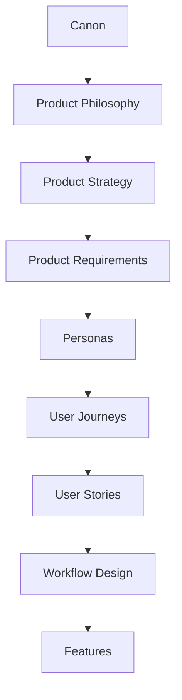

## Responsibility of Each Layer

| Layer | Responsibility |
| --- | --- |
| Canon | Defines the company's enduring source of truth. |
| Product Philosophy | Defines product principles and judgment. |
| Product Strategy | Defines product evolution and capability sequencing. |
| Product Requirements | Defines enduring product capabilities. |
| Personas | Define the roles, responsibilities, and goals the platform serves. |
| User Journeys | Define how personas accomplish meaningful work over time. |
| User Stories | Translate journeys into role-specific needs. |
| Workflow Design | Defines operational sequences, states, and handoffs. |
| Features | Define concrete product functionality. |

User Journeys do not define screens. They define business motion.

## 3. User Journey Principles

## Work Before Interface

The journey should describe the work being done, not the interface used to do it.

Interfaces will change. The underlying work of resolving, validating, governing, discovering, reusing, and improving knowledge remains more durable.

## Outcomes Before Clicks

The journey should focus on organizational outcomes.

The important question is not:

> What does the user click?

It is:

> What work is completed, what knowledge is created, and how does the organization become more capable?

## Collaboration Over Isolation

Organizational Intelligence is collaborative.

Support Agents, Reviewers, Knowledge Managers, Managers, Administrators, Compliance Officers, Security Officers, Product Managers, and Executives each participate in different parts of learning.

Journeys should show where responsibility moves between personas.

## Knowledge Compounds

Every journey should create the possibility of future improvement.

A resolved issue, reviewed candidate, corrected article, or discovered trend should not disappear after immediate use. It should become part of the organization's learning system when appropriate.

## AI Assists Responsibly

AI can summarize, classify, recommend, draft, detect patterns, and surface gaps.

AI should not become the unreviewed source of organizational truth.

Journeys should show where AI contributes and where human judgment remains accountable.

## Human Review Protects Trust

Human Review is essential when knowledge becomes official, evidence conflicts, policies are interpreted, customer-facing guidance is created, or decisions carry meaningful risk.

Journeys should make these review boundaries explicit.

## Governance Is Continuous

Governance is not a final approval step.

It appears throughout the journey:

- Permission checks.
- Evidence preservation.
- Source visibility.
- Version awareness.
- Review requirements.
- Audit logging.
- Policy enforcement.

## Every Journey Contributes Learning

Every journey should ask:

- What did this work teach the organization?
- Should that learning be preserved?
- Who must review it?
- How will it be reused?
- What should change next time?

## 4. Journey Framework

Future user journeys should use a consistent template.

## Reusable Journey Template

| Field | Description |
| --- | --- |
| Journey Name | Descriptive name of the end-to-end business journey. |
| Primary Persona | Role primarily responsible for the journey. |
| Supporting Personas | Roles that contribute, review, govern, or consume the journey outcome. |
| Business Goal | Organizational outcome the journey should accomplish. |
| Trigger | Event or condition that starts the journey. |
| Preconditions | What must be true before the journey can begin. |
| Major Activities | Main business activities in sequence. |
| AI Assistance Points | Where AI may assist through summarization, recommendation, detection, or drafting. |
| Human Review Points | Where accountable human judgment is required. |
| Governance Checkpoints | Permission, policy, audit, evidence, lifecycle, and approval controls. |
| Knowledge Created | New or refined knowledge produced by the journey. |
| Organizational Memory Updated | How validated knowledge changes memory. |
| Success Criteria | Organizational outcomes indicating the journey worked. |
| Risks | Trust, accuracy, privacy, governance, adoption, or operational risks. |
| Repository Links | Related personas, requirements, strategy, research, and future stories. |

## Template Usage Rule

Every future journey should identify:

- The business work being accomplished.
- The personas involved.
- Where knowledge enters the system.
- Where AI assists.
- Where humans review.
- Where governance applies.
- What memory is updated.
- How success is measured.

## 5. Core User Journeys

The following journeys define enduring patterns for the platform.

## Resolve a Customer Issue

This is the beachhead journey for Customer Support.

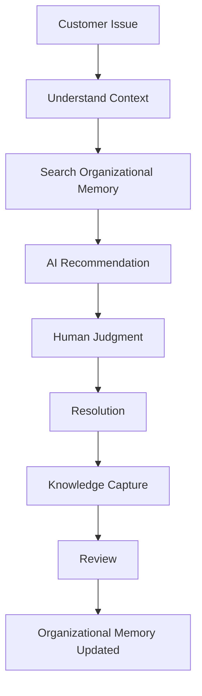

### Journey Summary

| Field | Description |
| --- | --- |
| Primary Persona | Customer Support Agent |
| Supporting Personas | Knowledge Reviewer, Knowledge Manager, Team Lead, Support Manager |
| Business Goal | Resolve the customer issue accurately while preserving reusable learning. |
| Trigger | Customer submits an issue, question, complaint, or request. |
| Preconditions | Customer context, issue evidence, and relevant permissions are available. |
| Knowledge Created | Resolution context, troubleshooting steps, customer language, evidence, reusable lesson. |
| Organizational Memory Updated | Validated knowledge candidate may become reusable memory. |

### Stage Explanation

| Stage | Description |
| --- | --- |
| Customer Issue | A customer problem enters the organization through a support channel. |
| Understand Context | The agent interprets the issue, account context, prior history, symptoms, and constraints. |
| Search Organizational Memory | The agent searches trusted memory, prior cases, validated knowledge, and relevant evidence. |
| AI Recommendation | AI may summarize context, suggest similar cases, recommend knowledge, or draft candidate responses. |
| Human Judgment | The agent evaluates whether AI recommendations and existing knowledge apply. |
| Resolution | The customer receives an answer, workaround, explanation, escalation, or resolution. |
| Knowledge Capture | The platform identifies whether the work contains reusable learning. |
| Review | A reviewer or knowledge steward validates whether captured learning should become memory. |
| Organizational Memory Updated | Approved knowledge becomes part of trusted institutional memory. |

### Success Criteria

- Issue is resolved accurately.
- Agent uses trusted knowledge when available.
- AI assistance is explainable and reviewable.
- Reusable learning is captured.
- Governed knowledge is reviewed before becoming official.
- Future similar issues become easier to resolve.

## Create New Organizational Knowledge

This journey describes how new knowledge becomes trusted knowledge.

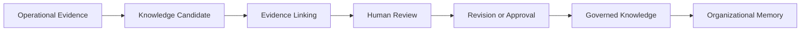

### Journey Summary

| Field | Description |
| --- | --- |
| Primary Persona | Knowledge Manager |
| Supporting Personas | Support Agent, AI Reviewer / Knowledge Reviewer, Team Lead |
| Business Goal | Convert operational learning into trusted organizational knowledge. |
| Trigger | New pattern, issue, resolution, policy clarification, or repeated question emerges. |
| Preconditions | Evidence exists and the knowledge candidate is within scope. |
| Knowledge Created | A reviewed knowledge artifact with evidence, ownership, status, and version. |
| Organizational Memory Updated | New validated knowledge becomes discoverable and reusable. |

### Major Activities

1. Identify a reusable learning opportunity.
2. Assemble supporting evidence.
3. Draft or generate a knowledge candidate.
4. Link sources, constraints, and context.
5. Review for accuracy, clarity, and applicability.
6. Approve, revise, reject, or escalate.
7. Publish into Organizational Memory with governance metadata.
8. Monitor reuse and feedback.

## Validate Knowledge

This journey describes reviewer work.

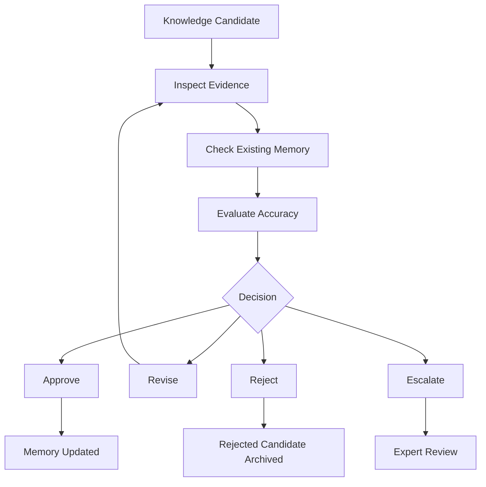

### Journey Summary

| Field | Description |
| --- | --- |
| Primary Persona | AI Reviewer / Knowledge Reviewer |
| Supporting Personas | Knowledge Manager, Domain Expert, Compliance Officer |
| Business Goal | Ensure knowledge entering memory is accurate, evidence-supported, and governed. |
| Trigger | Candidate knowledge requires validation. |
| Preconditions | Candidate, evidence, policy context, and reviewer authority are available. |
| Knowledge Created | Approved, revised, rejected, or escalated review decision. |
| Organizational Memory Updated | Only approved or revised knowledge becomes trusted memory. |

### Reviewer Responsibilities

- Inspect source evidence.
- Compare with existing memory.
- Identify contradictions.
- Validate accuracy.
- Check scope and applicability.
- Approve, revise, reject, or escalate.
- Preserve review rationale.

## Improve Existing Knowledge

This journey describes lifecycle refinement.

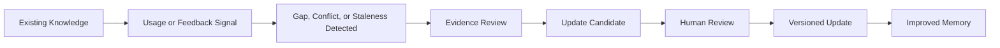

### Journey Summary

| Field | Description |
| --- | --- |
| Primary Persona | Knowledge Manager |
| Supporting Personas | Support Agent, Reviewer, Team Lead, Product Manager |
| Business Goal | Keep Organizational Memory accurate, useful, and current. |
| Trigger | Feedback, failed reuse, new evidence, contradiction, stale signal, or policy change. |
| Preconditions | Existing knowledge and update evidence are available. |
| Knowledge Created | Improved version, retired guidance, or clarified knowledge. |
| Organizational Memory Updated | Memory becomes more accurate and trustworthy. |

### Major Activities

1. Detect quality issue or improvement opportunity.
2. Gather new evidence.
3. Compare against existing knowledge.
4. Draft update or retirement candidate.
5. Review change.
6. Version the update.
7. Preserve history.
8. Monitor future reuse.

## Discover Organizational Knowledge

This journey describes trusted retrieval.

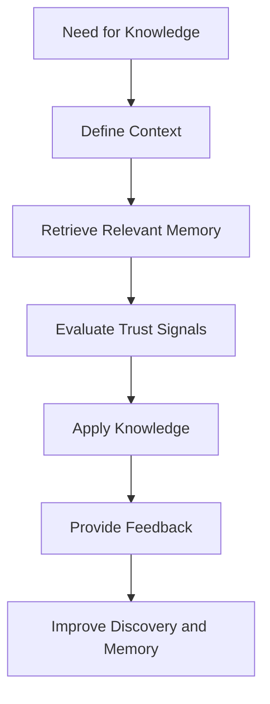

### Journey Summary

| Field | Description |
| --- | --- |
| Primary Persona | Customer Support Agent |
| Supporting Personas | Knowledge Manager, Product Manager, Operations Manager |
| Business Goal | Find and apply trusted knowledge in context. |
| Trigger | User needs guidance, precedent, explanation, or decision support. |
| Preconditions | Relevant knowledge exists or the absence of knowledge can be detected. |
| Knowledge Created | Feedback on usefulness, relevance, gap, or applicability. |
| Organizational Memory Updated | Feedback may improve ranking, metadata, content, or lifecycle status. |

### Trust Signals

Users should be able to evaluate:

- Source.
- Review status.
- Last updated date.
- Owner.
- Evidence.
- Version.
- Reuse history.
- Conflicts or warnings.

## Monitor Organizational Learning

This journey describes manager and executive workflows.

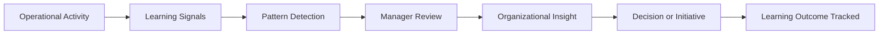

### Journey Summary

| Field | Description |
| --- | --- |
| Primary Persona | Customer Support Manager |
| Supporting Personas | Team Lead, Knowledge Manager, Customer Experience Leader, Executive Sponsor |
| Business Goal | Understand whether the organization is becoming more capable through work. |
| Trigger | Periodic review, operational concern, executive question, or performance signal. |
| Preconditions | Learning metrics, knowledge activity, and operational context are available. |
| Knowledge Created | Organizational insight, improvement priority, or strategic learning. |
| Organizational Memory Updated | Insights may create new research, process, product, or knowledge initiatives. |

### Learning Signals

- Knowledge reuse rate.
- Repeated issue frequency.
- Knowledge gap trends.
- Review backlog.
- AI recommendation acceptance.
- Escalation patterns.
- Stale knowledge.
- Onboarding friction.
- Cross-team learning.

## 6. Cross-Persona Collaboration

Journeys move across roles as knowledge becomes more trusted and more strategic.

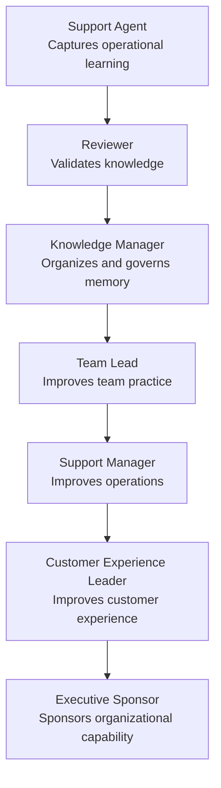

## Transition Responsibilities

| Transition | Responsibility |
| --- | --- |
| Agent to Reviewer | Operational evidence becomes a knowledge candidate. |
| Reviewer to Knowledge Manager | Validated or rejected knowledge enters lifecycle management. |
| Knowledge Manager to Team Lead | Knowledge gaps and quality patterns inform team coaching. |
| Team Lead to Support Manager | Team-level patterns inform operational priorities. |
| Support Manager to CX Leader | Operational learning informs customer experience strategy. |
| CX Leader to Executive Sponsor | Organizational learning informs strategic investment. |

## Governance Collaboration

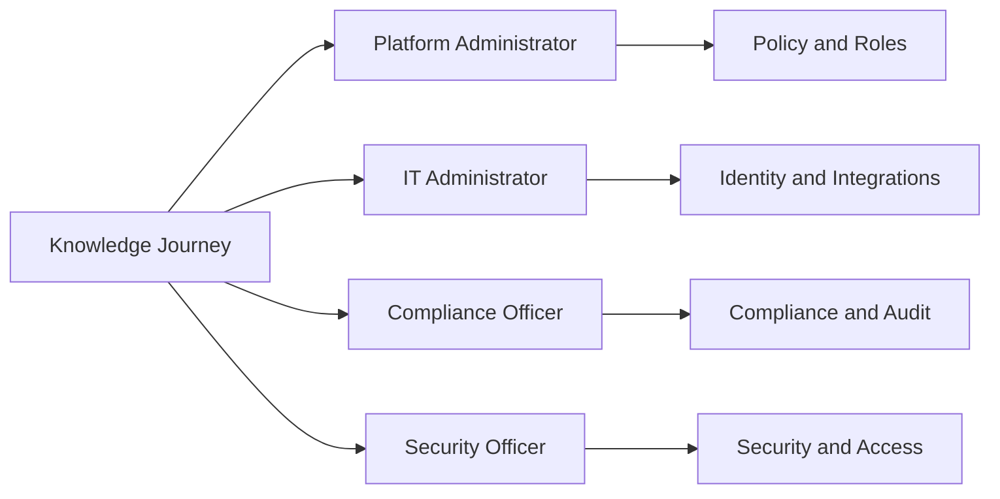

Governance personas may not own daily support work, but they shape the trust boundaries around every journey.

## 7. Knowledge Lifecycle Within Journeys

Every journey participates in the Knowledge Flywheel.

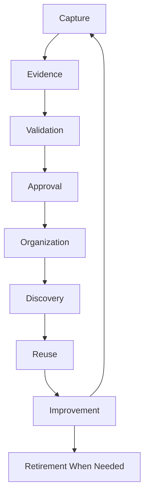

## Lifecycle Stages

| Stage | Journey Role |
| --- | --- |
| Capture | Work produces potential learning. |
| Evidence | Source context is preserved. |
| Validation | Human judgment determines whether knowledge is trustworthy. |
| Approval | Governed knowledge becomes official within scope. |
| Organization | Knowledge is structured with concepts, status, ownership, and relationships. |
| Discovery | Users find trusted knowledge when needed. |
| Reuse | Validated knowledge improves future work. |
| Improvement | Feedback, new evidence, and usage refine knowledge. |
| Retirement | Stale or invalid knowledge leaves active use. |

## Knowledge Flywheel Principle

A journey is incomplete if it resolves work but preserves no learning when learning is available.

The journey should always ask:

- Was new knowledge created?
- Was evidence preserved?
- Should it be reviewed?
- Can it improve memory?
- Can it help future work?

## 8. AI Interaction Throughout Journeys

AI contributes throughout journeys, but it does not own the journey.

## AI Contribution Matrix

| AI Contribution | Journey Context | Human Boundary |
| --- | --- | --- |
| Context Summarization | Support issue, escalation, review, manager insight. | Human verifies summary before relying on it. |
| Recommendation | Similar knowledge, prior cases, next steps, reviewers. | Human decides whether recommendation applies. |
| Draft Generation | Response drafts, knowledge candidates, summaries. | Human reviews before publication or customer use. |
| Similar Case Discovery | Resolve issue, validate knowledge, improve knowledge. | Human checks relevance and applicability. |
| Pattern Detection | Monitor learning, detect gaps, repeated issues. | Manager or Knowledge Manager interprets significance. |
| Gap Detection | Knowledge lifecycle, support operations, documentation quality. | Human prioritizes action. |
| Trend Analysis | Manager and executive learning journeys. | Leaders interpret business implications. |
| Evidence Linking | Review and validation workflows. | Reviewer confirms evidence supports the claim. |

## Where AI Stops

AI should stop before:

- Official knowledge publication.
- High-impact customer-facing commitments.
- Policy interpretation without review.
- Compliance-sensitive approval.
- Memory updates requiring governance.
- Executive decisions.
- Conflict resolution where evidence is ambiguous.

## AI Journey Principle

AI should help the journey move from evidence to candidate understanding.

Human Review determines what becomes trusted organizational knowledge.

## 9. Human Review Boundaries

Human judgment is mandatory at critical trust boundaries.

## Mandatory Review Stages

| Stage | Why Review Is Mandatory |
| --- | --- |
| Official Knowledge Publication | Published knowledge may guide future work and customer communication. |
| Policy Interpretation | Policies require accountable judgment and may have compliance impact. |
| Compliance-Sensitive Content | Regulated or sensitive topics require human accountability. |
| Customer-Facing Recommendations | Incorrect guidance may damage trust or create harm. |
| Executive Decisions | AI can inform but not own strategic accountability. |
| Conflicting Evidence | Human judgment is needed to resolve ambiguity. |
| Memory Updates | Organizational Memory must not be polluted by unvalidated outputs. |
| High-Risk Automation | Autonomy must be bounded by review, policy, and evidence. |

## Review Boundary Principle

Review should be proportional to risk.

Low-risk operational suggestions may require lighter review. Governed knowledge, customer-facing content, compliance-sensitive content, and strategic decisions require stronger review.

## Human Review Outcomes

Human Review may result in:

- Approval.
- Rejection.
- Revision.
- Escalation.
- Request for more evidence.
- Deprecation of existing knowledge.
- Creation of a new knowledge item.

## 10. Governance Checkpoints

Governance is continuous throughout every journey.

## Governance Checkpoint Matrix

| Checkpoint | Journey Role |
| --- | --- |
| Permission Validation | Ensures users and AI only access authorized data and knowledge. |
| Evidence Verification | Ensures claims remain connected to supporting sources. |
| Version Awareness | Ensures users know whether knowledge is current, prior, or deprecated. |
| Audit Logging | Preserves actions, decisions, review, and memory updates. |
| Policy Enforcement | Applies organizational rules to knowledge, access, AI, and workflow. |
| Approval Workflows | Ensures governed knowledge receives appropriate human validation. |
| Traceability | Connects knowledge to source, reviewer, version, and reuse. |
| Lifecycle Management | Supports update, retirement, and revalidation. |

## Continuous Governance Flow

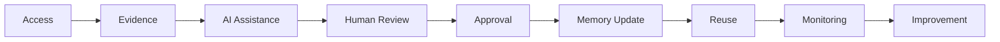

Governance should be present at each stage, not only at the end.

## 11. Success Definition

Journey success should be measured by organizational outcomes.

## Success Outcome Matrix

| Success Outcome | What It Means |
| --- | --- |
| Faster Issue Resolution | Users resolve work with less repeated investigation. |
| Increased Knowledge Reuse | Validated memory is applied to future work. |
| Higher Knowledge Quality | Knowledge becomes more accurate, current, and trusted. |
| Reduced Repeated Investigations | Organizational Entropy decreases. |
| Stronger Organizational Memory | More validated learning is preserved and reused. |
| Lower Organizational Entropy | Less knowledge loss, duplication, and expert dependency. |
| Greater AI Trust | Users trust AI because outputs are grounded, visible, and reviewable. |
| Better Cross-Team Learning | Lessons from one team improve work in another. |
| More Effective Human Review | Review protects trust without excessive burden. |
| Improved Decision Quality | Managers and executives act from better organizational insight. |

## Success Principle

A journey is successful when it improves both immediate work and future capability.

Feature usage alone is not enough.

## 12. Journey Evolution

These journeys remain applicable as OIP expands beyond Customer Support.

## Domain Evolution Matrix

| Domain | Journey Pattern |
| --- | --- |
| IT | Resolve incident, capture runbook knowledge, validate technical guidance, reuse prior resolutions. |
| HR | Resolve employee question, validate policy interpretation, improve onboarding and employee service knowledge. |
| Sales | Capture objection handling, validate enablement knowledge, reuse customer and market insights. |
| Finance | Preserve recurring analysis, validate policy or reporting knowledge, improve decision support. |
| Compliance | Capture control evidence, validate obligations, monitor regulatory learning, retire outdated guidance. |
| Legal | Capture matter learning, validate precedent or contract guidance, preserve evidence and confidentiality. |

## Universal Workflow Patterns

Across domains, the same patterns remain:

- Work creates evidence.
- Evidence may reveal reusable knowledge.
- AI may assist interpretation.
- Human Review validates trust.
- Governance controls risk.
- Memory preserves learning.
- Reuse improves future work.
- Feedback improves knowledge.

The job titles change. The journey logic remains.

## 13. Repository Integration

User Journeys guide downstream product work.

## Influence Matrix

| Repository Area | Journey Influence |
| --- | --- |
| User Stories | Convert journey stages into persona-specific needs. |
| Workflow Design | Define states, handoffs, reviews, and governance points. |
| Information Architecture | Organize product concepts around journey activities and lifecycle states. |
| Feature Catalog | Map features to journey stages and outcomes. |
| MVP Definition | Select the smallest journeys required to validate OIP. |
| Product Metrics | Measure journey outcomes and organizational learning. |
| Future Experiments | Test assumptions in journey stages, AI points, and review boundaries. |

## Feature Support Rule

Every future feature should support one or more documented journeys.

If a feature cannot be mapped to a journey, it may be:

- Premature.
- Misaligned.
- Too disconnected.
- Better suited for another product.
- In need of further research.

## Derivation Rule

Future user stories and workflow documents should state:

- Which journey they derive from.
- Which personas they serve.
- Which knowledge lifecycle stage they support.
- Where AI assists.
- Where Human Review applies.
- Which governance checkpoints are required.

## 14. Traceability Matrix

| Canon Concept | User Journey Expression |
| --- | --- |
| Organizational Memory | Every completed journey can enrich institutional knowledge when reusable learning exists. |
| Human Review | Critical decisions require accountable human validation. |
| Governance | Policy enforcement, permissions, auditability, and lifecycle controls occur throughout the journey. |
| Knowledge Flywheel | Journeys capture, validate, organize, discover, reuse, and improve knowledge. |
| Organizational Intelligence | Organizational capability improves after completed workflows. |
| AI as Amplifier, Not Authority | AI supports summarization, recommendation, drafting, and detection while humans remain accountable. |
| Organizational Entropy | Journeys reduce repeated investigation, fragmented knowledge, and duplicated work. |
| Explainability | Evidence, review, status, and provenance remain visible across journeys. |
| Domain Model | Journeys express platform concepts such as evidence, review, memory, agent, workflow, and knowledge. |
| Product Requirements | Journeys operationalize capture, validation, memory, discovery, reuse, governance, AI assistance, integration, and analytics. |

## 15. Limitations

User Journeys intentionally avoid:

- UI layouts.
- Screen flows.
- Wireframes.
- Button interactions.
- Engineering implementation.
- Release sequencing.
- Specific feature definitions.
- Database design.
- API behavior.
- Sprint planning.

They describe business journeys rather than interface journeys.

Detailed workflows, user stories, interaction patterns, and implementation specifications belong in later documents.

## 16. Closing

User Journeys are the operational expression of Organizational Intelligence.

Every journey should accomplish two goals simultaneously:

1. Complete today's work successfully.
2. Leave the organization wiser than before.

That second outcome distinguishes the Organizational Intelligence Platform from traditional enterprise software.

Traditional systems complete work.

The Organizational Intelligence Platform completes work while continuously improving the organization's ability to solve future work.

Every journey should therefore strengthen Organizational Memory, increase knowledge reuse, preserve evidence, reinforce governance, and expand Organizational Intelligence.

The product should ask after every journey:

> What did the organization learn, and how will that learning improve future work?
