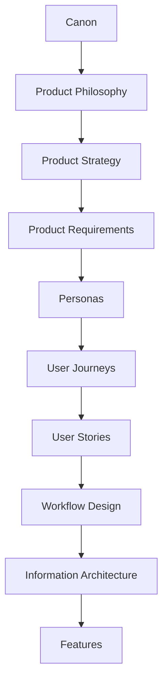
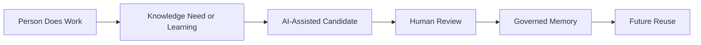

# User Stories

## Derived From

- Canon Version: `v1.0.0`
- Architecture Version: `v1.0.0`
- Implementation Version: `v1.0.0`
- Strategy Version: `v1.0.0`
- Research Version: `v1.0.0`
- Product Philosophy Version: `v1.0.0`
- Product Strategy Version: `v1.0.0`
- Product Requirements Version: `v1.0.0`
- Personas Version: `v1.0.0`
- User Journeys Version: `v1.0.0`

### Primary Repository Sources

- [Canon](../canon/README.md)
- [Architecture](../architecture/README.md)
- [Implementation](../implementation/README.md)
- [Strategy](../strategy/README.md)
- [Research](../research/README.md)
- [Product Philosophy](./00_PRODUCT_PHILOSOPHY.md)
- [Product Strategy](./01_PRODUCT_STRATEGY.md)
- [Product Requirements](./02_PRODUCT_REQUIREMENTS.md)
- [Personas](./03_PERSONAS.md)
- [User Journeys](./04_USER_JOURNEYS.md)

---

Status: **Active**

## Primary Question

What enduring user needs must the Organizational Intelligence Platform satisfy in order for each persona to accomplish meaningful work while strengthening Organizational Memory and Organizational Intelligence?

This document translates User Journeys into structured user stories.

It is not a sprint backlog, engineering task list, acceptance-criteria document, or implementation plan. It defines enduring user needs that remain valid even as implementation evolves.

## 1. Executive Summary

User Stories describe enduring user needs rather than temporary interface behavior.

For the Organizational Intelligence Platform, a user story is not merely a statement about what a user wants to do. It is a statement about how a person accomplishes meaningful work while strengthening organizational learning.

Every story should contribute to Organizational Intelligence by connecting:

- A persona.
- A meaningful business goal.
- A knowledge outcome.
- AI assistance where appropriate.
- Human Review where trust requires it.
- Governance expectations.
- Related product requirements.
- Related Canon principles.

The story format in this document intentionally includes a second outcome:

> And so that the organization learns, remembers, governs, or improves.

That second outcome distinguishes OIP user stories from conventional enterprise software stories.

## 2. Relationship to Repository

User Stories bridge business journeys and product capabilities.



## Repository Responsibilities

| Layer | Responsibility |
| --- | --- |
| Canon | Defines enduring company and platform truth. |
| Product Philosophy | Defines how product decisions should be judged. |
| Product Strategy | Defines capability sequencing and product evolution. |
| Product Requirements | Defines enduring product capabilities and constraints. |
| Personas | Define the roles, responsibilities, and goals the platform serves. |
| User Journeys | Define end-to-end business workflows. |
| User Stories | Define persona-specific needs within those journeys. |
| Workflow Design | Defines detailed operational states, handoffs, and sequences. |
| Information Architecture | Defines organization of product concepts and content. |
| Features | Define concrete product functionality. |

User Stories should never float independently. Every story should support at least one documented User Journey.

## 3. User Story Principles

## Outcomes Before Actions

Stories should describe outcomes, not mechanical actions.

The important question is not what a user clicks. It is what the user must accomplish and how that work improves the organization.

## Responsibilities Before Screens

Stories should be grounded in persona responsibilities.

A Support Agent needs to resolve issues consistently. A Knowledge Manager needs to preserve trustworthy knowledge. A Reviewer needs to validate candidates. These responsibilities outlast screen designs.

## Knowledge Before Automation

Automation is valuable only when it supports knowledge, trust, and future reuse.

Stories should avoid framing speed as the only outcome. The platform should help users complete work while preserving what the organization learns.

## Human Review Before Autonomy

Stories involving governed knowledge, customer-facing recommendations, policy interpretation, or sensitive decisions must preserve Human Review.

AI can propose, draft, summarize, and recommend. Humans remain accountable for what becomes trusted.

## AI Assists Responsibly

AI should appear in stories as assistance, not authority.

Stories should clarify whether AI:

- Summarizes.
- Recommends.
- Drafts.
- Detects patterns.
- Links evidence.
- Supports review.

## Governance Is Continuous

Governance is part of user need, not an implementation afterthought.

Stories should consider:

- Permissions.
- Evidence.
- Traceability.
- Version awareness.
- Policy enforcement.
- Auditability.

## Stories Support Journeys

Every story should map to one or more journeys.

If a story cannot be linked to a journey, it may be premature, misaligned, or in need of further research.

## Stories Build Organizational Memory

Every story should ask:

- What knowledge is created?
- What evidence is preserved?
- What gets reviewed?
- What becomes reusable?
- How does future work improve?

## 4. User Story Framework

## Enhanced OIP Story Format

```text
As a [Persona],
I need to [Enduring capability],
So that [Business outcome],
And so that [Organizational learning outcome].
```

The second outcome is required because OIP must improve future organizational capability, not only complete today's work.

## Reusable Story Template

| Field | Description |
| --- | --- |
| Story ID | Stable identifier for the story. |
| Persona | Primary persona served by the story. |
| Related Journey | User Journey supported by the story. |
| Business Goal | Immediate work outcome. |
| User Story | Enhanced OIP story statement. |
| Organizational Outcome | How the story improves the organization. |
| Knowledge Outcome | What knowledge is created, validated, reused, or improved. |
| AI Assistance | How AI may assist responsibly. |
| Human Review Requirement | Where accountable human judgment is required. |
| Governance Requirement | Permissions, auditability, traceability, policy, or lifecycle needs. |
| Related Product Requirements | Capability requirements supported by the story. |
| Related Canon Principles | Canon concepts expressed by the story. |
| Priority | Foundational, Core, Expansion, or Strategic. |
| Future Metrics | Possible future measures of success. |

## Story Quality Checklist

| Question | Required |
| --- | --- |
| Is the story tied to a persona? | Yes |
| Is the story tied to a documented journey? | Yes |
| Does the story describe an enduring need? | Yes |
| Does the story include a business outcome? | Yes |
| Does the story include an organizational learning outcome? | Yes |
| Are AI and Human Review boundaries clear where relevant? | Yes |
| Are governance expectations visible where relevant? | Yes |

## 5. Stories by Persona

The stories below define enduring needs by persona. They are not implementation tasks.

## Customer Support Agent

| Story ID | Story | Related Journey | Priority |
| --- | --- | --- | --- |
| CSA-01 | As a Customer Support Agent, I need to discover trusted knowledge, so that I can resolve customer issues accurately, and so that validated organizational knowledge is reused rather than recreated. | Resolve a Customer Issue; Discover Organizational Knowledge | Foundational |
| CSA-02 | As a Customer Support Agent, I need to understand the context of a customer issue, so that I can respond appropriately, and so that the organization preserves meaningful evidence for future learning. | Resolve a Customer Issue | Foundational |
| CSA-03 | As a Customer Support Agent, I need to evaluate AI recommendations with visible evidence, so that I can use assistance responsibly, and so that unverified AI output does not become organizational truth. | Resolve a Customer Issue | Foundational |
| CSA-04 | As a Customer Support Agent, I need to capture reusable learning from resolved work, so that future agents do not repeat the same investigation, and so that Organizational Memory compounds. | Resolve a Customer Issue; Create New Organizational Knowledge | Core |
| CSA-05 | As a Customer Support Agent, I need to contribute operational knowledge without excessive burden, so that I can continue serving customers effectively, and so that frontline learning enters the Knowledge Flywheel. | Create New Organizational Knowledge | Core |
| CSA-06 | As a Customer Support Agent, I need to recognize when existing knowledge does not apply, so that I avoid incorrect responses, and so that gaps or conflicts can improve future knowledge quality. | Discover Organizational Knowledge; Improve Existing Knowledge | Core |

## Knowledge Manager

| Story ID | Story | Related Journey | Priority |
| --- | --- | --- | --- |
| KM-01 | As a Knowledge Manager, I need to govern organizational knowledge, so that users can trust what they find, and so that Organizational Memory remains accurate, current, and accountable. | Create New Organizational Knowledge; Improve Existing Knowledge | Foundational |
| KM-02 | As a Knowledge Manager, I need to improve knowledge quality, so that support teams use reliable guidance, and so that the organization reduces duplicated or stale knowledge. | Improve Existing Knowledge | Foundational |
| KM-03 | As a Knowledge Manager, I need to detect knowledge gaps, so that missing guidance can be prioritized, and so that repeated work becomes visible organizational learning. | Monitor Organizational Learning; Improve Existing Knowledge | Core |
| KM-04 | As a Knowledge Manager, I need to monitor knowledge reuse, so that I can understand which knowledge creates value, and so that the organization learns which memory assets matter most. | Monitor Organizational Learning | Core |
| KM-05 | As a Knowledge Manager, I need to organize institutional memory, so that knowledge can be discovered and reused, and so that future work benefits from structured learning. | Create New Organizational Knowledge; Discover Organizational Knowledge | Foundational |
| KM-06 | As a Knowledge Manager, I need to retire outdated knowledge, so that users are not misled, and so that Organizational Memory remains trustworthy over time. | Improve Existing Knowledge | Core |

## AI Reviewer / Knowledge Reviewer

| Story ID | Story | Related Journey | Priority |
| --- | --- | --- | --- |
| KR-01 | As an AI Reviewer / Knowledge Reviewer, I need to validate AI-generated knowledge, so that only accurate guidance becomes trusted, and so that AI assistance strengthens rather than pollutes Organizational Memory. | Validate Knowledge | Foundational |
| KR-02 | As an AI Reviewer / Knowledge Reviewer, I need to preserve evidence during review, so that review decisions are explainable, and so that future users can trace knowledge to its source. | Validate Knowledge | Foundational |
| KR-03 | As an AI Reviewer / Knowledge Reviewer, I need to resolve conflicting information, so that users receive coherent guidance, and so that contradictions become opportunities for improved knowledge quality. | Validate Knowledge; Improve Existing Knowledge | Core |
| KR-04 | As an AI Reviewer / Knowledge Reviewer, I need to approve trusted knowledge within clear boundaries, so that teams can reuse it confidently, and so that organizational learning remains governed. | Validate Knowledge | Foundational |
| KR-05 | As an AI Reviewer / Knowledge Reviewer, I need to reject or revise weak candidates, so that unreliable knowledge does not enter active use, and so that review outcomes improve future AI and knowledge practices. | Validate Knowledge | Core |

## Customer Support Manager

| Story ID | Story | Related Journey | Priority |
| --- | --- | --- | --- |
| CSM-01 | As a Customer Support Manager, I need to measure organizational learning, so that I can understand whether support capability is improving, and so that investment decisions are based on evidence. | Monitor Organizational Learning | Foundational |
| CSM-02 | As a Customer Support Manager, I need to improve support capability, so that teams resolve issues more consistently, and so that organizational knowledge becomes a scalable operational asset. | Monitor Organizational Learning; Resolve a Customer Issue | Core |
| CSM-03 | As a Customer Support Manager, I need to reduce repeated investigations, so that agent effort is used on novel problems, and so that Organizational Entropy decreases over time. | Monitor Organizational Learning | Core |
| CSM-04 | As a Customer Support Manager, I need to identify improvement opportunities, so that support operations can evolve, and so that frontline work becomes strategic organizational learning. | Monitor Organizational Learning; Improve Existing Knowledge | Core |
| CSM-05 | As a Customer Support Manager, I need to understand AI trust and review effectiveness, so that adoption remains responsible, and so that human-AI collaboration improves over time. | Monitor Organizational Learning; Validate Knowledge | Strategic |

## Executive Sponsor

| Story ID | Story | Related Journey | Priority |
| --- | --- | --- | --- |
| ES-01 | As an Executive Sponsor, I need to understand organizational capability, so that I can evaluate whether the platform improves the institution, and so that strategy is guided by evidence rather than anecdotes. | Monitor Organizational Learning | Strategic |
| ES-02 | As an Executive Sponsor, I need to monitor Organizational Intelligence growth, so that I can see whether work is producing durable learning, and so that the organization invests in compounding capability. | Monitor Organizational Learning | Strategic |
| ES-03 | As an Executive Sponsor, I need to evaluate strategic outcomes, so that platform adoption can be expanded or refined responsibly, and so that organizational learning remains tied to business value. | Monitor Organizational Learning | Strategic |
| ES-04 | As an Executive Sponsor, I need to see where governance protects trust, so that AI adoption is accountable, and so that enterprise confidence grows alongside product usage. | Monitor Organizational Learning; Validate Knowledge | Strategic |

## 6. Story Categories

Stories should be grouped into capability categories so teams can understand which product capabilities they support.

## Capability Category Table

| Category | Purpose |
| --- | --- |
| Knowledge Capture | Ensure work can produce reusable learning. |
| Knowledge Discovery | Help users find trusted knowledge in context. |
| Knowledge Validation | Ensure candidates are reviewed before becoming governed knowledge. |
| Knowledge Governance | Preserve permissions, lifecycle, accountability, and policy. |
| Organizational Memory | Maintain durable, trusted, reusable institutional knowledge. |
| AI Assistance | Help users summarize, classify, detect patterns, draft candidates, and link evidence responsibly. |
| Collaboration | Support handoffs across personas and responsibilities. |
| Analytics | Measure learning, reuse, quality, trust, and Organizational Entropy. |
| Administration | Support roles, policies, integrations, identity, and governance configuration. |

## Persona-to-Category Matrix

| Persona | Capture | Discovery | Validation | Governance | Memory | AI Assistance | Collaboration | Analytics | Administration |
| --- | --- | --- | --- | --- | --- | --- | --- | --- | --- |
| Customer Support Agent | High | High | Low | Low | Medium | High | Medium | Low | Low |
| Knowledge Manager | High | High | High | High | High | High | High | High | Medium |
| AI Reviewer / Knowledge Reviewer | Medium | Medium | High | High | High | High | Medium | Medium | Low |
| Customer Support Manager | Medium | Medium | Medium | Medium | Medium | Medium | High | High | Low |
| Executive Sponsor | Low | Medium | Low | Medium | Medium | Medium | Medium | High | Low |

## Category Principle

Story categories should map back to Product Requirements.

If a story category does not support a durable product capability, it should be questioned.

## 7. AI Expectations

AI expectations differ by story category.

## AI Expectation Matrix

| Story Category | Where AI Assists | Where Human Review Is Mandatory |
| --- | --- | --- |
| Knowledge Capture | Summarizes work, detects reusable learning, extracts candidate concepts. | Before captured learning becomes governed knowledge. |
| Knowledge Discovery | Recommends related knowledge, similar cases, and relevant evidence. | When applying knowledge to sensitive or customer-facing situations. |
| Knowledge Validation | Highlights evidence, contradictions, uncertainty, and suggested revisions. | All approval, rejection, revision, and escalation decisions. |
| Knowledge Governance | Detects policy gaps, stale content, access anomalies, and lifecycle issues. | Policy interpretation, permissions decisions, and compliance-sensitive actions. |
| Organizational Memory | Suggests relationships, duplicates, versions, and reuse opportunities. | Memory updates that affect trusted knowledge. |
| AI Assistance | Drafts, classifies, recommends, and summarizes. | Any action that would make output official or externally relied upon. |
| Collaboration | Summarizes handoffs and recommends responsible reviewers. | Assignment or escalation decisions in high-impact contexts. |
| Analytics | Detects trends, patterns, and anomalies. | Strategic interpretation and organizational decisions. |
| Administration | Suggests configurations, flags issues, and explains system state. | Security, access, and policy changes. |

## AI Boundary Rule

AI may produce candidates. Humans determine trust.

Stories should never imply that AI output becomes Organizational Memory without appropriate review and governance.

## 8. Governance Expectations

Governance applies across user stories.

## Governance Requirement Table

| Governance Expectation | Story Implication |
| --- | --- |
| Permissions | Stories must respect who can access, create, review, approve, or govern knowledge. |
| Auditability | Important actions and decisions should be traceable. |
| Traceability | Knowledge should connect to evidence, source, reviewer, version, and reuse. |
| Evidence | Stories should preserve evidence when knowledge is created or applied. |
| Version Awareness | Users should understand whether knowledge is current, outdated, or superseded. |
| Policy Enforcement | Stories should operate within organizational rules. |
| Lifecycle Control | Knowledge should be created, reviewed, updated, deprecated, and retired responsibly. |
| Tenant and Customer Boundaries | Customer-owned knowledge should remain protected and separated. |

## Governance as User Need

Governance is not only an administrator concern.

It helps every persona trust the platform:

- Agents trust recommendations.
- Reviewers trust evidence.
- Managers trust metrics.
- Compliance teams trust controls.
- Executives trust outcomes.

## 9. Story Prioritization

Story prioritization reflects organizational capability, not feature popularity.

## Priority Levels

| Priority | Meaning |
| --- | --- |
| Foundational | Required for the platform to express core OIP responsibilities. Without these stories, trust, memory, or governance fails. |
| Core | Required to deliver strong value in the beachhead workflow and support repeated use. |
| Expansion | Important for broader adoption across teams, departments, or domains after foundational value is validated. |
| Strategic | Important for executive visibility, long-term differentiation, and platform-wide capability growth. |

## Priority Matrix

| Priority | Typical Story Characteristics | Examples |
| --- | --- | --- |
| Foundational | Supports capture, evidence, review, memory, governance, or trusted discovery. | Discover trusted knowledge; validate AI-generated knowledge. |
| Core | Improves workflow efficiency, reuse, quality, and operational learning. | Capture reusable learning; detect knowledge gaps. |
| Expansion | Extends value across teams, domains, or integrations. | Organize institutional memory across departments. |
| Strategic | Supports leadership insight, category differentiation, and enterprise expansion. | Monitor Organizational Intelligence growth. |

## Prioritization Principle

A popular story is not automatically a high-priority story.

Priority depends on whether the story strengthens:

- Organizational Memory.
- Human Review.
- Governance.
- Knowledge Flywheel.
- Customer value.
- Product strategy.

## 10. Story Evolution

Stories evolve as OIP expands beyond Customer Support, but the underlying organizational needs remain stable.

## Domain Evolution Table

| Domain | Persona Translation | Stable Story Need |
| --- | --- | --- |
| IT | Support Agent becomes Service Desk Analyst; Knowledge Manager becomes Runbook Owner. | Discover trusted guidance, capture reusable resolution, validate operational knowledge. |
| HR | Support Agent becomes HR Service Representative; Reviewer becomes Policy Reviewer. | Resolve employee questions, preserve policy evidence, validate sensitive knowledge. |
| Sales | Support Agent becomes Revenue or Sales Enablement contributor. | Reuse customer insight, capture objection knowledge, validate enablement guidance. |
| Finance | Reviewer and governance roles become more central. | Preserve evidence, validate recurring decisions, govern sensitive knowledge. |
| Compliance | Compliance Officer becomes a primary persona. | Trace obligations, validate policies, preserve audit-ready knowledge. |
| Legal | Reviewer becomes legal expert or matter specialist. | Preserve precedent, validate sensitive guidance, maintain confidentiality and versioning. |

## Universal Story Pattern

Across domains, the pattern remains:



Job titles change. The story logic remains.

## 11. Repository Integration

User Stories influence downstream product work.

## Repository Influence Table

| Repository Area | Story Influence |
| --- | --- |
| Workflow Design | Stories identify role needs, handoffs, review points, and governance boundaries. |
| Information Architecture | Stories clarify which concepts users need to find, understand, and relate. |
| Feature Catalog | Features should map to one or more stories. |
| MVP Features | MVP should include the smallest feature set required to satisfy foundational stories. |
| Product Metrics | Metrics should measure story outcomes, not interface activity alone. |
| Future Experiments | Stories become hypotheses for usability, workflow, AI, and value experiments. |

## Feature Traceability Rule

Every future feature should trace back to one or more User Stories.

If a feature cannot be traced to a story, the product team should ask:

- Which persona needs this?
- Which journey does it support?
- Which product requirement does it satisfy?
- Which organizational learning outcome does it create?
- Is this feature premature or misaligned?

## 12. Traceability Matrix

| Canon Concept | User Story Expression |
| --- | --- |
| Organizational Memory | Users preserve reusable organizational knowledge through capture, validation, and reuse stories. |
| Human Review | Users validate AI-generated and human-proposed knowledge before trust. |
| Governance | Users operate within accountable governance boundaries including permissions, auditability, and traceability. |
| Knowledge Flywheel | Users contribute to continuous organizational learning through repeated capture, review, reuse, and improvement. |
| Organizational Intelligence | Users improve future organizational capability through today's work. |
| AI as Amplifier, Not Authority | Stories position AI as assistant, recommender, summarizer, and drafter, not final authority. |
| Organizational Entropy | Stories reduce repeated investigation, fragmented knowledge, stale guidance, and expert dependency. |
| Explainability | Stories require evidence, status, source, and review visibility. |
| Product Requirements | Stories operationalize capture, discovery, validation, governance, memory, AI assistance, collaboration, analytics, and administration. |
| Personas | Stories translate enterprise responsibilities into enduring product needs. |

## 13. Limitations

User Stories intentionally avoid:

- UI behavior.
- Screen design.
- Implementation details.
- API behavior.
- Sprint planning.
- Engineering tasks.
- Acceptance criteria.
- Release sequencing.
- Database design.
- Test cases.

These belong in later engineering, design, and delivery documents.

This document defines enduring organizational user needs, not delivery tasks.

## 14. Closing

User Stories are not simply descriptions of user actions.

They describe how people create, validate, govern, discover, reuse, and improve organizational knowledge.

Every completed story should achieve two outcomes:

1. Help a person accomplish meaningful work.
2. Leave the organization more capable than before.

That second outcome is what distinguishes the Organizational Intelligence Platform from conventional enterprise software.

Every story should therefore strengthen Organizational Memory, reinforce governance, improve knowledge quality, and contribute to the continuous growth of Organizational Intelligence.

The question for every future story should be:

> Does this help a person do meaningful work while making the organization smarter?

If the answer is no, the story should be reconsidered.
