# Workflow Design

## Derived From

- Canon Version: `v1.0.0`
- Architecture Version: `v1.0.0`
- Implementation Version: `v1.0.0`
- Strategy Version: `v1.0.0`
- Research Version: `v1.0.0`
- Product Philosophy Version: `v1.0.0`
- Product Strategy Version: `v1.0.0`
- Product Requirements Version: `v1.0.0`
- Personas Version: `v1.0.0`
- User Journeys Version: `v1.0.0`
- User Stories Version: `v1.0.0`

### Primary Repository Sources

- [Canon](../canon/README.md)
- [Architecture](../architecture/README.md)
- [Implementation](../implementation/README.md)
- [Strategy](../strategy/README.md)
- [Research](../research/README.md)
- [Product Philosophy](./00_PRODUCT_PHILOSOPHY.md)
- [Product Strategy](./01_PRODUCT_STRATEGY.md)
- [Product Requirements](./02_PRODUCT_REQUIREMENTS.md)
- [Personas](./03_PERSONAS.md)
- [User Journeys](./04_USER_JOURNEYS.md)
- [User Stories](./05_USER_STORIES.md)

---

Status: **Active**

## Primary Question

How should work flow through the Organizational Intelligence Platform so that organizations consistently create, validate, govern, reuse, and improve knowledge while maintaining trust and accountability?

This document defines the operational workflow model of the Organizational Intelligence Platform.

It is not a UI flow, BPMN specification, engineering state machine, or screen navigation document. It defines how organizational work moves through people, AI, governance, and Organizational Memory.

## 1. Executive Summary

Workflow Design defines how organizational work progresses through the platform.

The Organizational Intelligence Platform must coordinate four forces:

- People who perform, interpret, review, and govern work.
- AI that assists with summarization, classification, recommendation, drafting, and pattern detection.
- Governance that protects trust, permissions, auditability, and lifecycle control.
- Organizational Memory that preserves validated learning for future use.

Traditional enterprise workflows often move work from one operational state to another. OIP workflows must do more. They must complete work while creating the conditions for organizational learning.

Every workflow should answer:

- What work is being done?
- Which personas participate?
- Where does knowledge appear?
- What evidence supports it?
- Where can AI assist?
- Where must humans review?
- Which governance controls apply?
- What memory is updated?
- How does future work improve?

## Workflow Philosophy

Workflow Design should remain valid regardless of:

- Interface redesigns.
- AI model changes.
- Database choices.
- Engineering implementation.
- Customer size.
- Release sequencing.

It defines enduring organizational behavior, not implementation mechanics.

## 2. Relationship to Repository

Workflow Design sits between User Stories and the structures that support execution.

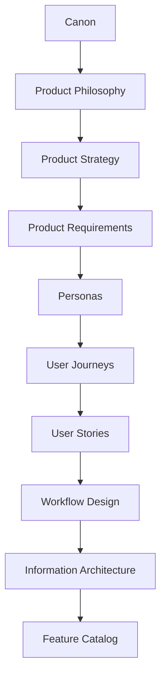

## Responsibility of Each Layer

| Layer | Responsibility |
| --- | --- |
| Canon | Defines enduring company truth and platform concepts. |
| Product Philosophy | Defines product judgment and principles. |
| Product Strategy | Defines capability sequencing and platform evolution. |
| Product Requirements | Defines enduring product capabilities and quality expectations. |
| Personas | Define roles and responsibilities. |
| User Journeys | Define end-to-end business journeys. |
| User Stories | Define persona-specific needs. |
| Workflow Design | Defines operational movement, states, handoffs, decisions, review, and governance. |
| Information Architecture | Defines how product concepts and knowledge structures are organized. |
| Feature Catalog | Defines concrete product capabilities that support workflows. |

Workflow Design does not replace Information Architecture or Feature Catalog work. It defines the operational behavior those later documents must support.

## 3. Workflow Design Principles

## Work Before Interface

Workflows should describe organizational work, not screens.

The platform may later express workflows through many interfaces, but the underlying work patterns should remain stable.

## Explicit Workflow States

Work should have understandable states.

Explicit states help users know:

- What has happened.
- What is waiting.
- Who is responsible.
- What evidence exists.
- What decision comes next.
- Whether knowledge is trusted.

## AI Assists Workflows

AI should help workflows move responsibly by:

- Summarizing context.
- Classifying work.
- Recommending knowledge.
- Drafting candidates.
- Detecting duplicates.
- Detecting gaps.
- Identifying patterns.

AI should not become the workflow authority.

## Human Review Preserves Trust

Human Review protects the transition from candidate output to trusted organizational knowledge.

Workflows should make review boundaries explicit wherever trust, policy, customer impact, or governance requires human judgment.

## Governance Is Continuous

Governance accompanies the workflow from initiation to completion.

It is not only a final approval step. Permissions, evidence, policy, audit, version, and lifecycle controls should appear throughout the workflow.

## Knowledge Compounds Through Workflows

Workflows are the mechanism by which knowledge compounds.

Each completed workflow should create the opportunity to improve Organizational Memory when reusable learning exists.

## Every Workflow Leaves Organizational Memory Stronger

A workflow should ideally leave behind:

- Better evidence.
- Better knowledge.
- Better review history.
- Better trust.
- Better reuse.
- Better understanding of gaps.

When a workflow cannot update memory, it should still preserve enough context to explain why.

## Workflows Evolve Through Evidence

Workflow design should be refined through:

- Customer discovery.
- Workflow observation.
- Experiments.
- Usage evidence.
- Review outcomes.
- Knowledge reuse metrics.
- Operational feedback.

Workflows are durable, but they are not frozen.

## 4. Workflow Framework

Future workflow documents should use a consistent template.

## Reusable Workflow Template

| Field | Description |
| --- | --- |
| Workflow Name | Clear name for the operational workflow. |
| Business Purpose | Organizational purpose the workflow serves. |
| Trigger | Event or condition that starts the workflow. |
| Preconditions | What must be true before work can proceed. |
| Participants | Personas involved in the workflow. |
| Workflow States | Major states the work moves through. |
| Decision Points | Questions that determine the next transition. |
| AI Participation | Where AI assists and what it may produce. |
| Human Review Points | Where accountable human judgment is required. |
| Governance Checkpoints | Permissions, audit, policy, evidence, version, and lifecycle controls. |
| Knowledge Created | Knowledge, evidence, or learning produced by the workflow. |
| Organizational Memory Impact | How memory is updated, improved, or protected. |
| Completion Criteria | Conditions that indicate the workflow is complete. |
| Failure Conditions | Conditions that indicate workflow failure, pause, escalation, or retry. |
| Related Journeys | User Journeys supported by the workflow. |
| Related Stories | User Stories supported by the workflow. |

## Workflow Quality Checklist

| Question | Required |
| --- | --- |
| Is the business purpose clear? | Yes |
| Are participants and responsibilities clear? | Yes |
| Are workflow states understandable? | Yes |
| Are decision points explicit? | Yes |
| Are AI boundaries defined? | Yes |
| Are Human Review points defined? | Yes |
| Are governance checkpoints present? | Yes |
| Is Organizational Memory impact stated? | Yes |

## 5. Core Operational Workflows

The following workflows define the core operational model of OIP.

## Customer Issue Resolution Workflow

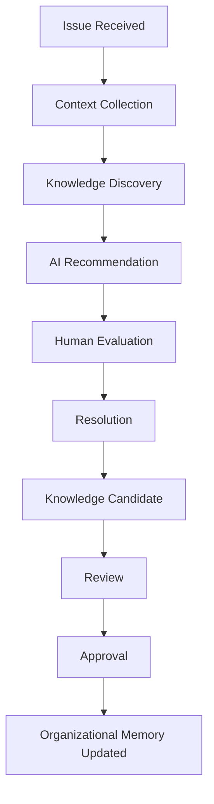

### Purpose

Resolve a customer issue while identifying whether the work contains reusable learning.

### States and Transitions

| State | Transition | Responsibility |
| --- | --- | --- |
| Issue Received | Customer issue enters support workflow. | Customer Support Agent |
| Context Collection | Agent gathers customer, issue, account, and evidence context. | Customer Support Agent |
| Knowledge Discovery | Agent searches trusted Organizational Memory and related evidence. | Customer Support Agent |
| AI Recommendation | AI may summarize context, recommend knowledge, or suggest next steps. | AI assists; Agent evaluates |
| Human Evaluation | Agent determines whether recommendations and knowledge apply. | Customer Support Agent |
| Resolution | Customer receives answer, workaround, fix, explanation, or escalation. | Customer Support Agent |
| Knowledge Candidate | Reusable learning is captured when present. | Agent and AI assist |
| Review | Reviewer evaluates candidate and evidence. | Knowledge Reviewer |
| Approval | Candidate is approved, revised, rejected, or escalated. | Reviewer / Knowledge Manager |
| Organizational Memory Updated | Approved knowledge becomes reusable memory. | Knowledge Manager |

### Governance

- Access must respect customer and organizational permissions.
- AI recommendations must remain evidence-linked.
- Customer-facing recommendations require human evaluation.
- Memory updates require review.
- Resolution and knowledge decisions should be auditable.

### Learning Outcome

Future similar issues become easier to resolve because validated learning enters Organizational Memory.

## Knowledge Creation Workflow

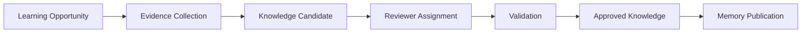

### Purpose

Convert operational learning into trusted organizational knowledge.

### States and Transitions

| State | Transition | Responsibility |
| --- | --- | --- |
| Learning Opportunity | A repeated issue, new resolution, policy clarification, or insight is identified. | Agent, Team Lead, AI, Knowledge Manager |
| Evidence Collection | Supporting cases, documents, conversations, and decisions are gathered. | Knowledge Manager |
| Knowledge Candidate | Candidate knowledge is drafted or generated. | Knowledge Manager with AI assistance |
| Reviewer Assignment | Appropriate reviewer is identified. | Knowledge Manager |
| Validation | Reviewer checks evidence, accuracy, and applicability. | Knowledge Reviewer |
| Approved Knowledge | Candidate is approved or revised into trusted knowledge. | Reviewer |
| Memory Publication | Knowledge enters governed Organizational Memory. | Knowledge Manager |

### Governance

- Candidate must retain source evidence.
- Reviewer authority must match the knowledge scope.
- Approval must be attributable.
- Publication must preserve version, owner, and lifecycle status.

### Learning Outcome

New institutional knowledge becomes available for future discovery and reuse.

## Knowledge Review Workflow

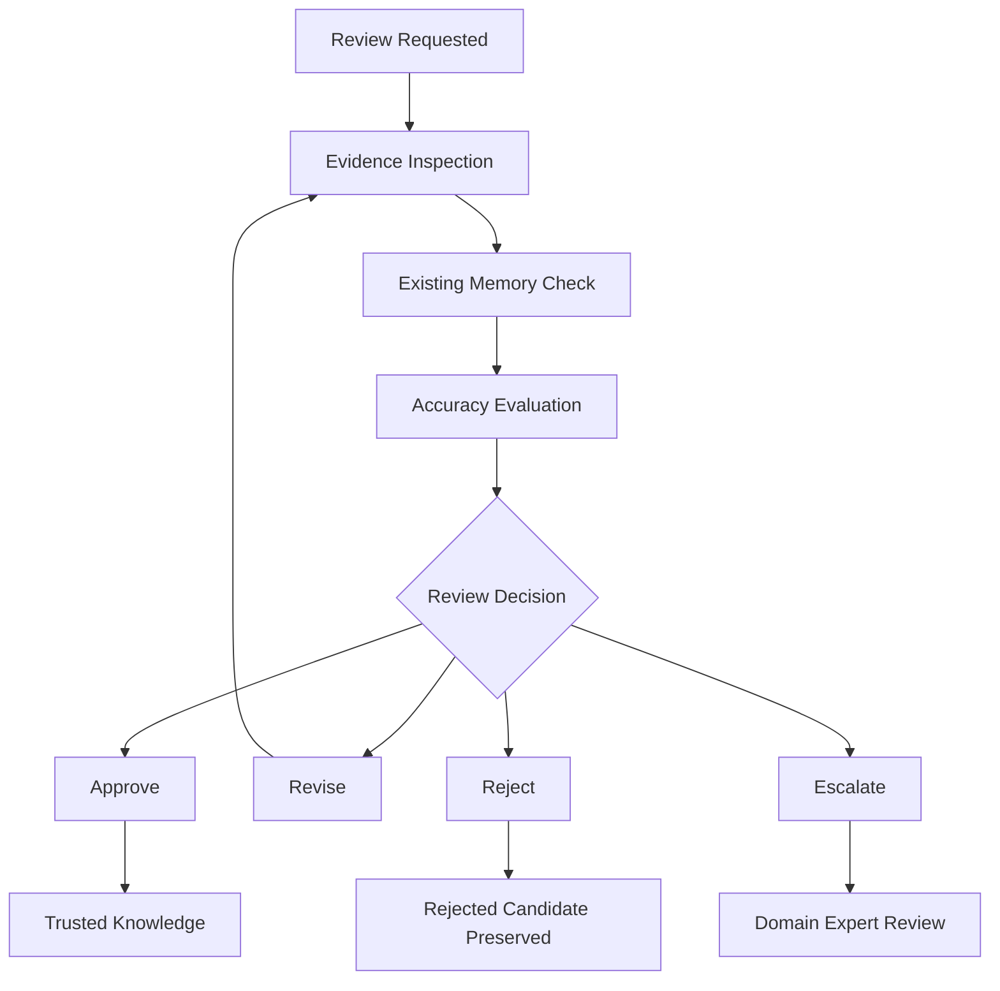

### Purpose

Determine whether knowledge candidates deserve to become trusted Organizational Memory.

### States and Transitions

| State | Transition | Responsibility |
| --- | --- | --- |
| Review Requested | Candidate requires human validation. | Knowledge Manager |
| Evidence Inspection | Reviewer inspects supporting evidence. | Knowledge Reviewer |
| Existing Memory Check | Reviewer compares candidate against current knowledge. | Knowledge Reviewer |
| Accuracy Evaluation | Reviewer evaluates correctness, clarity, and applicability. | Knowledge Reviewer |
| Review Decision | Reviewer approves, revises, rejects, or escalates. | Knowledge Reviewer |
| Trusted Knowledge | Approved knowledge becomes usable memory. | Knowledge Manager |
| Rejected Candidate Preserved | Rejected candidate remains traceable as learning. | Knowledge Manager |
| Domain Expert Review | Escalated candidate receives specialist judgment. | Domain Expert |

### Governance

- Review must preserve decision rationale.
- Rejected candidates should not disappear without trace.
- Escalation should identify the required expertise.
- Approval must update memory status.

### Learning Outcome

Review prevents memory pollution and improves trust in AI-assisted and human-proposed knowledge.

## Knowledge Improvement Workflow

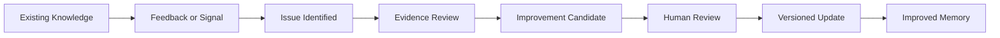

### Purpose

Keep Organizational Memory accurate, current, and useful over time.

### States and Transitions

| State | Transition | Responsibility |
| --- | --- | --- |
| Existing Knowledge | A memory artifact is in active or governed use. | Knowledge Manager |
| Feedback or Signal | Reuse failure, user feedback, conflict, new evidence, or stale signal appears. | Users, AI, Analytics |
| Issue Identified | Knowledge gap, conflict, or outdated guidance is confirmed. | Knowledge Manager |
| Evidence Review | New and old evidence are compared. | Knowledge Manager / Reviewer |
| Improvement Candidate | Update, clarification, merge, split, or retirement is proposed. | Knowledge Manager |
| Human Review | Candidate change is validated. | Reviewer |
| Versioned Update | Approved change becomes new version. | Knowledge Manager |
| Improved Memory | Users discover and reuse improved knowledge. | All users |

### Governance

- Old versions must remain traceable.
- Deprecated guidance must not appear as current.
- Updates require appropriate review.
- Quality signals should be auditable.

### Learning Outcome

Memory improves through use rather than decays after publication.

## Knowledge Discovery Workflow

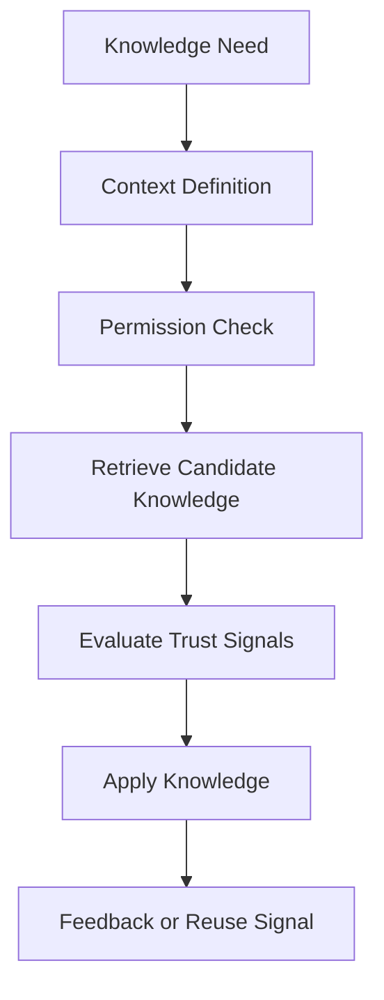

### Purpose

Help users find and apply trusted organizational knowledge.

### States and Transitions

| State | Transition | Responsibility |
| --- | --- | --- |
| Knowledge Need | User needs guidance, precedent, or decision support. | Any user |
| Context Definition | User or system clarifies task context. | User with AI assistance |
| Permission Check | Platform filters accessible knowledge. | Platform governance |
| Retrieve Candidate Knowledge | Relevant knowledge and evidence are surfaced. | Platform with AI assistance |
| Evaluate Trust Signals | User inspects status, evidence, freshness, and review history. | User |
| Apply Knowledge | User applies knowledge to current work. | User |
| Feedback or Reuse Signal | Usefulness, gap, or conflict is recorded. | User / Platform |

### Governance

- Retrieval must be permission-aware.
- Trust signals must be visible.
- Sensitive knowledge must respect policy.
- Feedback should contribute to improvement.

### Learning Outcome

Discovery creates reuse signals that help the organization understand what knowledge is valuable or missing.

## Organizational Learning Workflow

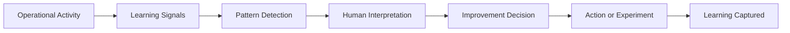

### Purpose

Help managers and leaders understand whether work is improving organizational capability.

### States and Transitions

| State | Transition | Responsibility |
| --- | --- | --- |
| Operational Activity | Support, knowledge, review, and reuse workflows generate signals. | Organization |
| Learning Signals | Metrics and patterns emerge. | Platform analytics |
| Pattern Detection | AI or analytics detects trends, gaps, repeated work, or improvement opportunities. | AI assists |
| Human Interpretation | Managers interpret the meaning and business context. | Support Manager / CX Leader |
| Improvement Decision | Organization decides whether to improve knowledge, workflow, training, or product. | Manager / Executive |
| Action or Experiment | Team acts or runs an experiment. | Responsible owner |
| Learning Captured | Outcome becomes part of organizational learning. | Research / Product / Knowledge Owner |

### Governance

- Analytics must respect permissions and privacy.
- AI-generated trends require human interpretation.
- Executive decisions must remain accountable.
- Improvement actions should be traceable.

### Learning Outcome

The organization turns operational signals into strategic learning and continuous improvement.

## 6. Workflow State Model

Different workflows reuse common state concepts.

## Generic Workflow States

| State | Meaning |
| --- | --- |
| Initiated | Work has started because a trigger occurred. |
| In Progress | Work is actively being handled by a person, AI-assisted process, or workflow participant. |
| Awaiting Evidence | More context, source material, or supporting information is required. |
| Awaiting Review | Work requires accountable human validation before continuing. |
| Approved | A human reviewer or authorized role has accepted the item within scope. |
| Published | Approved knowledge is available for governed discovery and reuse. |
| Reused | Knowledge has been applied to future work. |
| Improved | Knowledge or workflow has been refined based on evidence or feedback. |
| Archived | Work, candidate, or knowledge is no longer active but remains preserved for traceability. |

## Generic State Flow

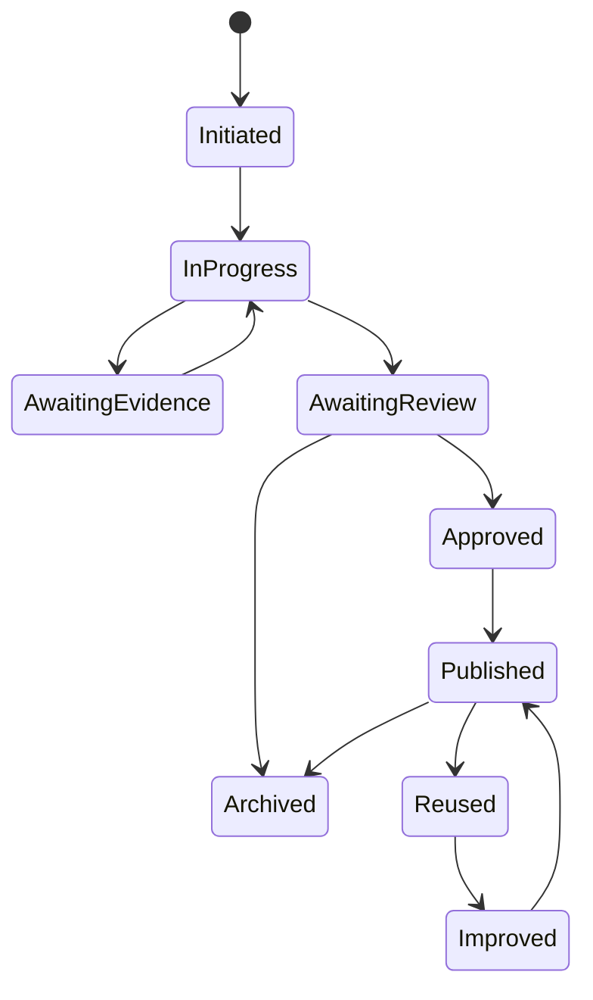

## State Reuse Principle

Common state concepts help users understand work across different workflows.

They do not require every workflow to follow the exact same sequence. They provide shared language for operational behavior.

## 7. Decision Points

Decision points determine workflow transitions.

## Decision Matrix

| Decision Point | Why It Exists | Possible Outcomes |
| --- | --- | --- |
| Existing knowledge sufficient? | Determines whether work can reuse memory or requires new learning. | Reuse, search further, capture gap. |
| AI confidence acceptable? | Determines whether AI output is useful enough for human evaluation. | Use as candidate, request more evidence, ignore. |
| Human Review required? | Determines whether trust boundary has been reached. | Proceed, send to review, escalate. |
| Evidence adequate? | Determines whether conclusion or candidate can be trusted. | Continue, request evidence, reject. |
| Publish? | Determines whether knowledge becomes governed memory. | Approve, revise, reject, escalate. |
| Revise? | Determines whether candidate needs improvement before approval. | Revise, approve, reject. |
| Escalate? | Determines whether expert judgment is needed. | Escalate, continue, pause. |
| Archive? | Determines whether work or knowledge should leave active use. | Archive, retire, preserve, restore. |

## Decision Principles

- Decisions should be explicit.
- High-risk decisions should be reviewable.
- AI may recommend but should not own major decisions.
- Decision rationale should be preserved when it affects knowledge or governance.
- Decisions should improve future workflow design.

## 8. Cross-Persona Handoffs

Workflow value depends on responsible handoffs.

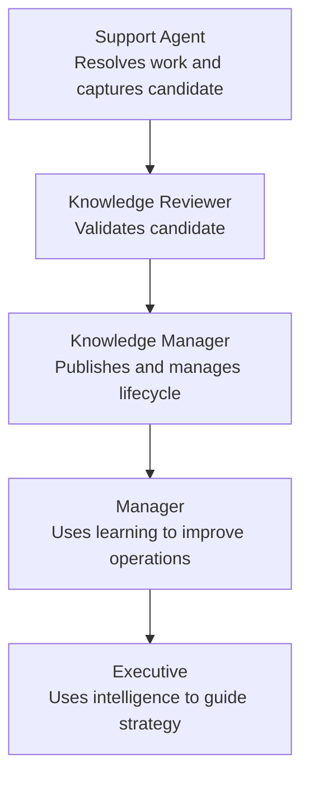

## Handoff Accountability

| Handoff | Sender Accountability | Receiver Accountability |
| --- | --- | --- |
| Support Agent to Knowledge Reviewer | Preserve evidence and context. | Validate accuracy, applicability, and trust. |
| Knowledge Reviewer to Knowledge Manager | Provide decision and rationale. | Manage lifecycle, version, and publication. |
| Knowledge Manager to Manager | Surface quality, gaps, and reuse signals. | Prioritize operational improvements. |
| Manager to Executive | Summarize organizational learning and impact. | Make strategic decisions and allocate support. |

## Governance Handoffs

| Handoff | Accountability |
| --- | --- |
| Platform Administrator to Users | Roles, permissions, and workflow policies are correctly configured. |
| IT Administrator to Platform | Integrations and identity are reliable and secure. |
| Compliance Officer to Workflow Owners | Policy and audit expectations are understood. |
| Security Officer to Administrators | Access and data boundaries are protected. |

## Handoff Principle

Every handoff should preserve:

- Context.
- Evidence.
- Responsibility.
- Status.
- Next decision.
- Governance requirements.

## 9. AI Participation Model

AI participates as an assistant within workflows.

## AI Participation Matrix

| AI Activity | Workflow Use | Boundary |
| --- | --- | --- |
| Summarize | Condense issue context, evidence, review history, or trends. | Human verifies before reliance. |
| Classify | Identify issue type, knowledge category, risk, or workflow state. | Human can correct classification. |
| Recommend | Suggest related knowledge, prior cases, next actions, or reviewers. | Human decides applicability. |
| Draft | Generate response, summary, or knowledge candidate. | Human reviews before publication or customer use. |
| Detect Duplicates | Identify similar knowledge, repeated cases, or overlapping candidates. | Human confirms duplicate or relationship. |
| Detect Gaps | Identify missing or weak knowledge. | Human prioritizes action. |
| Identify Patterns | Surface repeated issues, trends, or learning opportunities. | Human interprets business meaning. |

## AI Boundary Principle

AI never becomes workflow authority.

AI may:

- Assist.
- Propose.
- Detect.
- Summarize.
- Recommend.
- Draft.

Humans and governance determine:

- Approval.
- Publication.
- Policy interpretation.
- Customer-facing trust.
- Strategic action.
- Memory updates.

## 10. Human Review Boundaries

Certain workflow stages require human judgment.

## Mandatory Review Boundaries

| Boundary | Reason |
| --- | --- |
| Policy Interpretation | Policies require accountable judgment and may affect compliance. |
| Governed Knowledge Publication | Official knowledge influences future work and customer guidance. |
| Executive Decisions | AI can inform strategy but cannot own accountability. |
| Conflicting Evidence | Ambiguity requires human reasoning and context. |
| Compliance-Sensitive Knowledge | Regulated or sensitive content requires human oversight. |
| Customer-Facing Recommendations | Incorrect guidance can harm trust or outcomes. |
| Memory Updates | Organizational Memory must not be polluted by unvalidated outputs. |
| High-Risk Automation | Risk requires explicit approval and oversight. |

## Review Boundary Model

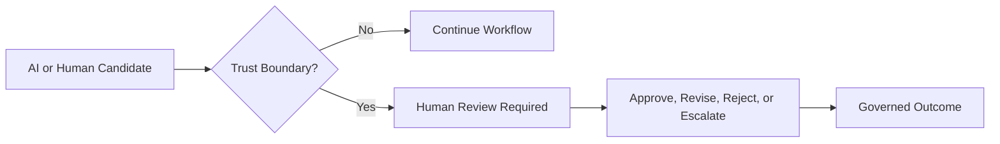

## Review Principle

Review should be proportional to risk, but governed knowledge always requires accountability.

## 11. Governance Throughout Workflows

Governance accompanies every workflow.

## Governance Checkpoint Matrix

| Checkpoint | Workflow Role |
| --- | --- |
| Permissions | Determines who can view, create, review, approve, publish, or administer. |
| Audit Logging | Records important actions, decisions, approvals, and memory updates. |
| Traceability | Connects outputs to source, evidence, reviewer, and version. |
| Version Awareness | Prevents outdated knowledge from appearing as current. |
| Policy Validation | Ensures workflow behavior respects organizational rules. |
| Evidence Verification | Ensures claims have sufficient support. |
| Lifecycle Enforcement | Ensures knowledge can be updated, retired, or archived. |

## Continuous Governance Flow

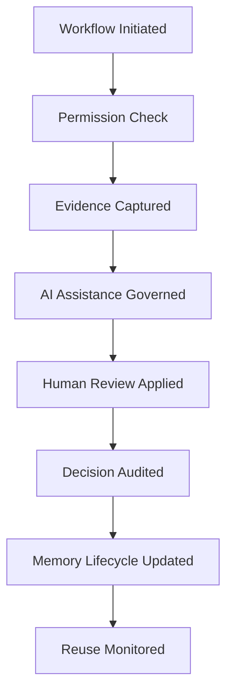

## Governance Principle

Governance should feel like part of responsible work, not a separate bureaucratic layer.

## 12. Knowledge Lifecycle Integration

Workflows move knowledge through the lifecycle.

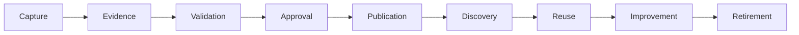

## Lifecycle Integration Matrix

| Lifecycle Stage | Workflow Expression |
| --- | --- |
| Capture | Work produces potential reusable learning. |
| Evidence | Source context is preserved for review and explanation. |
| Validation | Human judgment evaluates correctness and applicability. |
| Approval | Knowledge is accepted into governed use. |
| Publication | Approved knowledge becomes available for discovery. |
| Discovery | Users find trusted knowledge in future work. |
| Reuse | Knowledge improves future outcomes. |
| Improvement | Feedback and new evidence refine memory. |
| Retirement | Outdated or invalid knowledge leaves active use. |

## Lifecycle Principle

The knowledge lifecycle is not separate from work. It is embedded in work.

The best workflows make learning a natural byproduct of operational activity.

## 13. Workflow Success Measures

Workflow success should be measured by organizational outcomes.

## Success Measure Matrix

| Measure | Meaning |
| --- | --- |
| Reduced Repeated Work | Workflows help users avoid solving the same problem repeatedly. |
| Improved Knowledge Quality | Knowledge becomes more accurate, current, useful, and trusted. |
| Increased Reuse | Validated knowledge is applied to future work. |
| Lower Organizational Entropy | Knowledge loss, duplication, and fragmentation decline. |
| Faster Trusted Decisions | Users make decisions faster without sacrificing review or evidence. |
| Stronger Human Review | Review becomes more effective, evidence-rich, and efficient. |
| Higher Organizational Memory Quality | Memory becomes more complete, governed, and reusable. |
| Better Cross-Team Learning | Insights move across teams instead of staying local. |
| Greater AI Trust | AI becomes trusted because it is explainable and bounded. |

## Success Principle

The ultimate workflow metric is not only efficiency.

It is whether the workflow leaves the organization more capable.

## 14. Workflow Evolution

Workflow logic remains stable as OIP expands into new domains.

## Domain Evolution Matrix

| Domain | Workflow Translation |
| --- | --- |
| IT | Customer issue resolution becomes incident or service request resolution; knowledge becomes runbooks and troubleshooting memory. |
| HR | Customer issue becomes employee question; knowledge becomes policy guidance and onboarding memory. |
| Sales | Customer issue becomes buyer question or objection; knowledge becomes enablement memory and account learning. |
| Finance | Workflows involve recurring analysis, approvals, reporting, and policy interpretation. |
| Compliance | Workflows involve obligation tracking, control evidence, audit readiness, and policy validation. |
| Legal | Workflows involve matters, precedents, contract knowledge, confidentiality, and expert review. |

## Stable Workflow Pattern

Across domains, work still moves through:

- Trigger.
- Context.
- Evidence.
- AI assistance.
- Human judgment.
- Resolution or decision.
- Knowledge capture.
- Review.
- Memory update.
- Reuse.

The terms change. The logic remains.

## 15. Repository Integration

Workflow Design influences later product and engineering documents.

## Influence Matrix

| Repository Area | Workflow Design Influence |
| --- | --- |
| Information Architecture | Defines operational concepts, states, relationships, and lifecycle structures. |
| Feature Catalog | Maps features to workflow stages, decisions, and responsibilities. |
| MVP Features | Identifies the minimum workflow support required to validate OIP. |
| Product Metrics | Defines success through workflow outcomes and organizational learning. |
| Engineering Implementation | Provides operational behavior that implementation must support without prescribing how. |
| Future Experiments | Identifies workflow assumptions that require validation. |

## Repository Rule

Later documents should state:

- Which workflows they support.
- Which states they represent.
- Which handoffs they enable.
- Which review boundaries they preserve.
- Which governance checkpoints they enforce.
- Which memory outcomes they create.

## 16. Traceability Matrix

| Canon Concept | Workflow Expression |
| --- | --- |
| Organizational Memory | Every completed workflow can enrich trusted institutional knowledge. |
| Human Review | Critical transitions require accountable human judgment. |
| Governance | Policy, permissions, evidence, auditability, and lifecycle controls accompany every workflow stage. |
| Knowledge Flywheel | Workflows continuously capture, validate, reuse, and improve knowledge. |
| Organizational Intelligence | Every workflow should leave the organization more capable than before. |
| AI as Amplifier, Not Authority | AI assists workflows but does not own decisions or trust boundaries. |
| Organizational Entropy | Workflows reduce repeated work, fragmented knowledge, and knowledge loss. |
| Explainability | Workflow decisions remain connected to evidence, review, and version history. |
| Product Requirements | Workflows operationalize capture, evidence, validation, memory, discovery, reuse, governance, AI assistance, and analytics. |
| User Journeys | Workflows provide operational structure beneath enduring business journeys. |

## 17. Limitations

Workflow Design intentionally avoids:

- UI navigation.
- Screen layouts.
- Wireframes.
- Implementation logic.
- API contracts.
- Engineering state machines.
- Sprint planning.
- Engineering task decomposition.
- Database schema.
- Release sequencing.

Those belong in later engineering, design, and delivery documentation.

This document defines organizational workflow behavior, not implementation detail.

## 18. Closing

Workflow Design is the operational expression of Organizational Intelligence.

Traditional enterprise software moves work from one state to another.

The Organizational Intelligence Platform moves work while simultaneously increasing organizational capability.

Every workflow should therefore accomplish two objectives:

1. Successfully complete today's work.
2. Leave behind trusted knowledge that improves tomorrow's work.

The workflow itself becomes a continuous contributor to Organizational Memory, Human Review, Governance, and the Knowledge Flywheel.

The ultimate measure of a workflow is not simply operational efficiency.

It is whether the organization becomes measurably wiser after every completed cycle.
