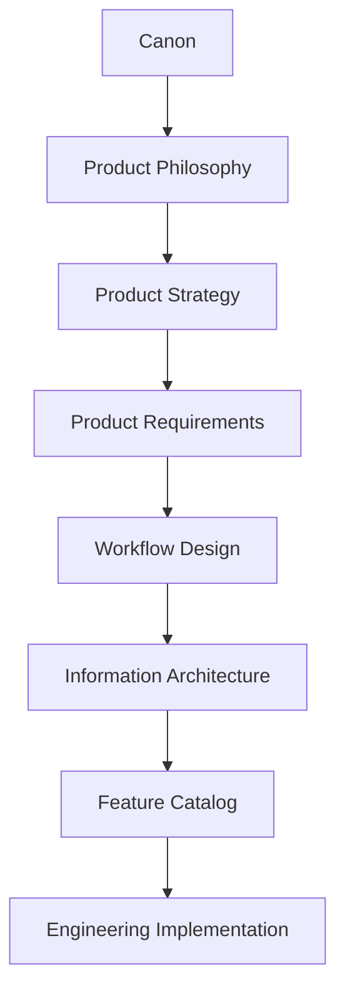
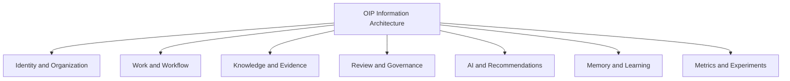
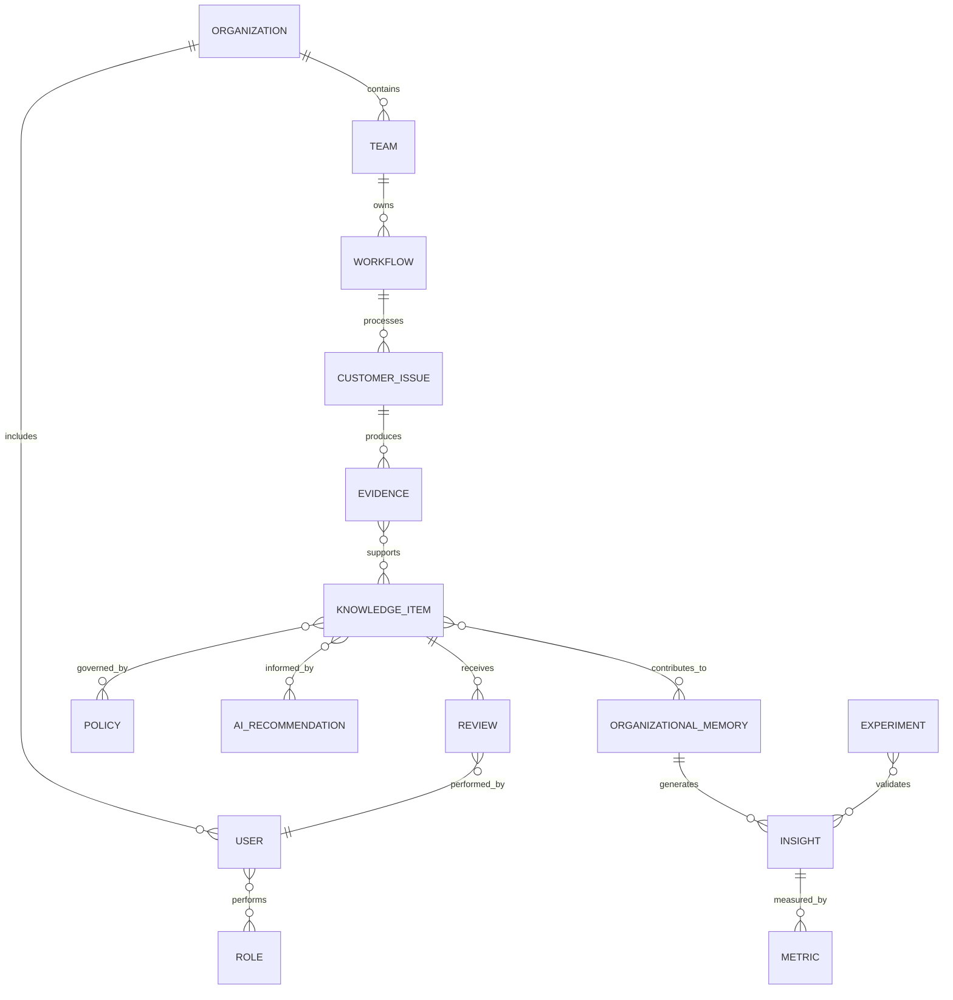
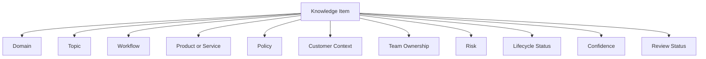
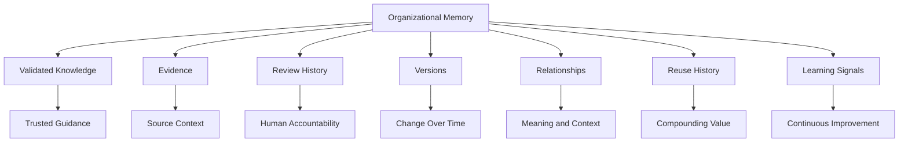
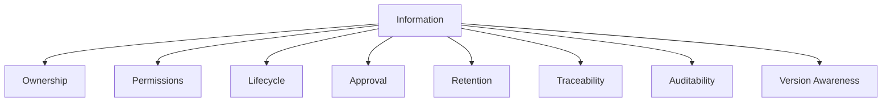
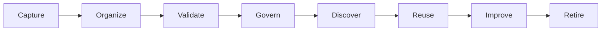
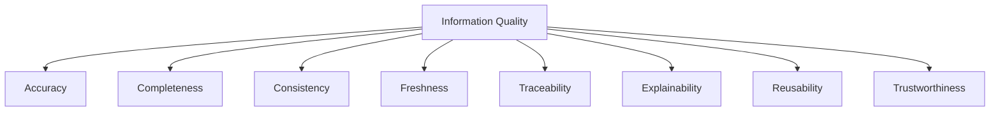

# Information Architecture

## Derived From

- Canon Version: `v1.0.0`
- Architecture Version: `v1.0.0`
- Implementation Version: `v1.0.0`
- Strategy Version: `v1.0.0`
- Research Version: `v1.0.0`
- Product Philosophy Version: `v1.0.0`
- Product Strategy Version: `v1.0.0`
- Product Requirements Version: `v1.0.0`
- Personas Version: `v1.0.0`
- User Journeys Version: `v1.0.0`
- User Stories Version: `v1.0.0`
- Workflow Design Version: `v1.0.0`

### Primary Repository Sources

- [Canon](../canon/README.md)
- [Architecture](../architecture/README.md)
- [Implementation](../implementation/README.md)
- [Strategy](../strategy/README.md)
- [Research](../research/README.md)
- [Product Philosophy](./00_PRODUCT_PHILOSOPHY.md)
- [Product Strategy](./01_PRODUCT_STRATEGY.md)
- [Product Requirements](./02_PRODUCT_REQUIREMENTS.md)
- [Personas](./03_PERSONAS.md)
- [User Journeys](./04_USER_JOURNEYS.md)
- [User Stories](./05_USER_STORIES.md)
- [Workflow Design](./06_WORKFLOW_DESIGN.md)

---

Status: **Active**

## Primary Question

How should information be organized so that people, AI, and workflows can consistently discover, understand, govern, reuse, and improve organizational knowledge?

This document defines the conceptual Information Architecture of the Organizational Intelligence Platform.

It is not a database schema, API specification, folder structure, UI navigation tree, or search index implementation. It defines how organizational knowledge, concepts, relationships, and metadata are structured to support Organizational Intelligence.

## 1. Executive Summary

Information Architecture defines how knowledge is organized rather than how it is stored.

Storage technologies may change. Search implementations may change. AI models may change. Interface patterns may change. But the conceptual organization of information must remain stable enough for people, AI, and workflows to understand the same organizational reality.

Good Information Architecture enables Organizational Intelligence by making knowledge:

- Discoverable.
- Understandable.
- Governable.
- Reviewable.
- Reusable.
- Traceable.
- Improveable.

The Organizational Intelligence Platform does not merely store information. It organizes knowledge, evidence, relationships, governance, and learning into a coherent Organizational Memory.

## Conceptual Purpose

Information Architecture should help the platform answer:

- What is this information?
- Where did it come from?
- What does it relate to?
- Who owns it?
- Who reviewed it?
- How trusted is it?
- Who can access it?
- When did it change?
- Where has it been reused?
- Should it be improved or retired?

Without strong Information Architecture, AI recommendations become opaque, search becomes noisy, governance becomes fragile, and Organizational Memory becomes another archive.

## 2. Relationship to Repository

Information Architecture sits between workflow behavior and concrete product capabilities.

## Responsibility of Each Layer

| Layer | Responsibility |
| --- | --- |
| Canon | Defines enduring company truth and platform concepts. |
| Product Philosophy | Defines product judgment and product principles. |
| Product Strategy | Defines product evolution and capability sequencing. |
| Product Requirements | Defines enduring capabilities and quality expectations. |
| Workflow Design | Defines how work moves through people, AI, governance, and memory. |
| Information Architecture | Defines how information, knowledge, concepts, relationships, and metadata are organized. |
| Feature Catalog | Defines concrete product capabilities that operate on the information model. |
| Engineering Implementation | Defines technical systems that store, process, retrieve, and serve information. |

Information Architecture does not decide implementation. It defines the conceptual structure that implementation must preserve.

## 3. Information Architecture Principles

## Information Before Interface

The structure of information should not be determined by a single interface.

Interfaces are temporary expressions. Information relationships must remain stable across dashboards, assistants, workflows, reports, APIs, and future interaction patterns.

## Knowledge Before Documents

Documents may contain knowledge, but knowledge is not the same as a document.

The platform should organize knowledge by meaning, evidence, review, ownership, lifecycle, and reuse rather than by document container alone.

## Relationships Before Hierarchy

Organizational knowledge is rarely a simple tree.

Issues relate to evidence, users, customers, products, policies, workflows, decisions, reviews, and prior knowledge. Relationships often matter more than folder-like hierarchy.

## Metadata Enables Intelligence

Metadata is not administrative decoration.

It enables:

- Search.
- Trust.
- Governance.
- AI context.
- Review.
- Lifecycle management.
- Analytics.
- Organizational learning.

## Governance Accompanies Information

Information must carry governance context.

Ownership, permissions, review status, version, lifecycle, auditability, and retention are part of how information becomes trustworthy.

## Information Evolves

Knowledge changes as new evidence appears.

The Information Architecture must support update, refinement, deprecation, conflict, and retirement without losing history.

## Discoverability Over Storage

The purpose of information organization is not simply to store more content.

It is to make the right knowledge discoverable at the right time, with the right trust signals, to the right authorized person or workflow.

## Explainability by Design

Information should be organized so that recommendations, decisions, and knowledge can be explained.

Users should be able to see source, evidence, reasoning context, review status, ownership, and version history.

## Organizational Memory Is Structured Knowledge

Organizational Memory is not a pile of documents.

It is structured, governed, validated, traceable knowledge that improves future work.

## 4. Information Model

The OIP information model is conceptual. It defines major entities and their meaning, not database tables.

## Conceptual Entity Matrix

| Entity | Purpose |
| --- | --- |
| Organization | The enterprise, customer, or institution whose knowledge and memory are governed. |
| Team | A group within an organization responsible for work, knowledge, review, or governance. |
| User | A person participating in workflows, review, governance, discovery, or administration. |
| Role | A responsibility boundary that determines permissions, authority, and workflow participation. |
| Customer Issue | A problem, request, question, or case that initiates operational work. |
| Knowledge Item | A reusable unit of validated or candidate organizational knowledge. |
| Evidence | Source material supporting knowledge, decisions, recommendations, or reviews. |
| Decision | A judgment or outcome made by a person, team, workflow, or governed process. |
| Workflow | A structured progression of work through states, handoffs, decisions, and governance. |
| Review | A human validation act that approves, rejects, revises, or escalates knowledge. |
| Policy | A rule, constraint, standard, or organizational requirement that governs behavior. |
| AI Recommendation | An AI-generated candidate suggestion, summary, classification, or insight. |
| Organizational Memory | The governed body of validated knowledge, evidence, relationships, and learning history. |
| Insight | A higher-level interpretation derived from patterns, reuse, gaps, trends, or outcomes. |
| Metric | A measurable signal about knowledge quality, reuse, workflow performance, or learning. |
| Experiment | A structured investigation used to reduce uncertainty and update organizational understanding. |

## Information Domains

## Entity Principle

Entities should represent meaningful organizational concepts.

They should not be created merely because a database, API, vendor, or interface happens to expose a data shape.

## 5. Entity Relationships

Relationships turn isolated information into organizational understanding.

## Core Knowledge Relationship Flow

## Conceptual Relationship Diagram

This diagram expresses conceptual relationships, not a database design.

## Relationship Semantics

| Relationship | Meaning |
| --- | --- |
| Organization contains Team | Knowledge and governance are scoped to organizational structures. |
| User performs Role | A person may hold multiple responsibilities. |
| Workflow processes Customer Issue | Work moves through states and responsibilities. |
| Customer Issue produces Evidence | Operational work creates source material. |
| Evidence supports Knowledge Item | Knowledge should remain grounded in source context. |
| Knowledge Item receives Review | Human validation creates trust. |
| Knowledge Item is governed by Policy | Knowledge exists within rules, permissions, and lifecycle constraints. |
| AI Recommendation is informed by Knowledge Item | AI uses existing knowledge and evidence to produce candidates. |
| Knowledge Item contributes to Organizational Memory | Validated knowledge becomes institutional memory. |
| Organizational Memory generates Insight | Reuse, gaps, and patterns create higher-level understanding. |
| Experiment validates Insight | Research and experiments test or refine organizational understanding. |

## 6. Knowledge Taxonomy

Taxonomy helps people and AI understand what knowledge is about, where it belongs, and how it should be governed.

## Taxonomy Dimensions

| Dimension | Purpose |
| --- | --- |
| Domain | Identifies functional area such as Customer Support, IT, HR, Finance, Legal, Compliance, or Sales. |
| Topic | Groups knowledge by subject matter or recurring issue area. |
| Workflow | Connects knowledge to the work process where it is created or reused. |
| Product | Associates knowledge with a product, service, module, or offering. |
| Policy | Connects knowledge to applicable rules, standards, or organizational obligations. |
| Customer | Associates knowledge with customer segment, account context, or customer type where appropriate. |
| Team | Identifies ownership, stewardship, or primary user group. |
| Risk | Indicates sensitivity, compliance impact, or potential harm if misused. |
| Lifecycle Status | Indicates draft, candidate, approved, published, deprecated, retired, or archived status. |
| Confidence | Indicates the strength of evidence and review supporting the knowledge. |
| Review Status | Indicates whether knowledge is unreviewed, pending review, approved, rejected, or needs revalidation. |

## Taxonomy Model

## Why Taxonomy Matters

Taxonomy enables:

- Better discovery.
- Better governance.
- Better AI context.
- Better ownership.
- Better analytics.
- Better lifecycle management.
- Better cross-team learning.

Without taxonomy, knowledge becomes searchable but not truly understandable.

## 7. Metadata Philosophy

Metadata is the connective tissue of Organizational Intelligence.

## Metadata Categories

| Metadata Category | Purpose |
| --- | --- |
| Ownership | Identifies who is responsible for knowledge stewardship. |
| Author | Identifies who created or contributed knowledge. |
| Reviewer | Identifies who validated the knowledge. |
| Evidence | Links knowledge to supporting source material. |
| Source | Identifies where the knowledge originated. |
| Confidence | Describes strength of evidence and validation. |
| Freshness | Indicates age, recency, review date, and stale risk. |
| Version | Preserves history and current state. |
| Lifecycle | Tracks draft, candidate, approved, published, deprecated, retired, or archived state. |
| Permissions | Defines who can view, edit, review, approve, or administer. |
| Usage | Tracks discovery, reuse, feedback, and value signals. |
| Relationships | Connects knowledge to issues, policies, workflows, teams, products, and insights. |

## Metadata Matrix

| Metadata Enables | Example Metadata |
| --- | --- |
| Governance | Owner, permissions, policy, lifecycle, reviewer. |
| AI Context | Evidence, relationships, confidence, workflow, taxonomy. |
| Discovery | Topic, domain, product, source, usage, relationships. |
| Trust | Reviewer, approval, evidence, confidence, freshness. |
| Analytics | Reuse, gaps, feedback, status, lifecycle, metrics. |
| Explainability | Source, evidence, decision history, version, review rationale. |

## Metadata Principle

Metadata should be meaningful, not ornamental.

If metadata does not help discovery, governance, AI, review, lifecycle, analytics, or explainability, it should be reconsidered.

## 8. Organizational Memory Structure

Organizational Memory is a conceptual system, not a document repository.

## Memory Contains

| Memory Component | Purpose |
| --- | --- |
| Validated Knowledge | Trusted reusable knowledge approved through governance. |
| Evidence | Source material supporting memory. |
| Review History | Human validation decisions and rationale. |
| Versions | Historical and current forms of knowledge. |
| Relationships | Connections among issues, policies, workflows, teams, and concepts. |
| Reuse History | Records of where memory improved future work. |
| Learning Signals | Metrics, feedback, gaps, contradictions, and improvement opportunities. |

## Memory Structure Diagram

## Memory Principle

Organizational Memory should preserve not only what the organization knows, but why it trusts that knowledge and how it has been used.

## 9. Discoverability Model

Discoverability means authorized users and workflows can find knowledge that is relevant, trusted, and understandable.

## Discoverability Dimensions

| Dimension | Meaning |
| --- | --- |
| Semantic Relationships | Knowledge can be discovered through meaning and conceptual similarity. |
| Contextual Relevance | Knowledge appears in relation to the user's workflow, role, issue, or decision. |
| Evidence Visibility | Users can inspect supporting source material. |
| Trust Indicators | Review status, freshness, confidence, ownership, and usage inform trust. |
| Permissions | Users only discover what they are authorized to access. |
| Workflow Context | Knowledge is surfaced where it helps complete work. |
| Knowledge Reuse | Prior use helps indicate practical value. |

## Discoverability Flow

## Discoverability Principle

The platform should not merely return information.

It should help users understand whether retrieved knowledge is relevant, trusted, current, and applicable.

## 10. Information Governance

Governance is part of Information Architecture because information without governance cannot become trusted organizational knowledge.

## Governance Dimensions

| Dimension | Information Architecture Responsibility |
| --- | --- |
| Ownership | Information should identify responsible stewards. |
| Lifecycle | Information should have states and transition rules. |
| Retention | Information should support appropriate preservation or deletion. |
| Approval | Governed knowledge should identify review and approval status. |
| Permissions | Access and modification should be controlled by role, scope, and policy. |
| Traceability | Information should remain connected to source, reviewer, version, and usage. |
| Auditability | Important changes and decisions should be recordable and inspectable. |
| Version Awareness | Users should know whether information is current, superseded, or retired. |

## Governance Model

## Governance Principle

The platform should make governance visible enough to create trust, but not so burdensome that users avoid contributing knowledge.

## 11. AI Information Model

AI consumes and produces information, but it never becomes the source of truth.

## AI Consumes

| Information Type | AI Use |
| --- | --- |
| Knowledge | Provides context for recommendations, summaries, and candidates. |
| Evidence | Grounds outputs in source material. |
| Metadata | Helps AI understand status, confidence, freshness, and permissions. |
| Relationships | Enables contextual reasoning across issues, policies, workflows, and knowledge. |
| Workflows | Helps AI understand the user's current task and next possible steps. |
| History | Supports pattern detection, similar-case retrieval, and learning signals. |

## AI Produces

| AI Output | Information Architecture Treatment |
| --- | --- |
| Summaries | Candidate interpretations that should retain source links. |
| Recommendations | Suggested actions or knowledge, not authoritative decisions. |
| Classifications | Candidate labels that can be corrected or reviewed. |
| Candidates | Draft knowledge, responses, or insights requiring validation. |
| Insights | Pattern-based interpretations requiring human review for strategic use. |

## AI Information Flow

## AI Principle

AI output should be treated as a candidate until reviewed, validated, and governed.

The Information Architecture must preserve the distinction between:

- Evidence.
- AI output.
- Human review.
- Validated knowledge.
- Organizational Memory.

## 12. Information Lifecycle

Information evolves throughout its lifecycle.

## Lifecycle Stages

| Stage | Meaning |
| --- | --- |
| Capture | Information enters the platform from work, evidence, user input, integration, or AI-assisted processing. |
| Organize | Information receives concepts, relationships, metadata, and structure. |
| Validate | Human review determines accuracy, applicability, and trust. |
| Govern | Ownership, permissions, lifecycle, version, and policy are applied. |
| Discover | Users and workflows find information in context. |
| Reuse | Validated knowledge improves future work. |
| Improve | Feedback, new evidence, reuse, and review refine information. |
| Retire | Outdated, invalid, or superseded information leaves active use while preserving traceability where appropriate. |

## Lifecycle Principle

Information should not be considered complete at creation.

It becomes more valuable as it is validated, governed, reused, and improved.

## 13. Information Quality

Information quality matters more than information volume.

## Quality Dimensions

| Quality Dimension | Meaning |
| --- | --- |
| Accuracy | Information reflects reality and has been validated appropriately. |
| Completeness | Information contains enough context to be useful and understandable. |
| Consistency | Information uses stable concepts, language, and structure. |
| Freshness | Information is current enough for its intended use. |
| Traceability | Information can be connected to source, evidence, review, version, and usage. |
| Explainability | Users can understand why the information exists and why it is trusted. |
| Reusability | Information can improve future work beyond its original context. |
| Trustworthiness | Information has sufficient governance, evidence, and review to support use. |

## Quality Model

## Quality Principle

More information can make an organization less intelligent if the information is untrusted, duplicated, stale, inaccessible, or disconnected.

OIP should optimize for trusted, reusable knowledge rather than volume.

## 14. Repository Integration

Information Architecture influences downstream product and engineering work.

## Influence Matrix

| Repository Area | Information Architecture Influence |
| --- | --- |
| Feature Catalog | Features should operate on clear conceptual entities and relationships. |
| MVP Features | MVP should support the minimum information model required for capture, review, memory, discovery, and reuse. |
| Product Metrics | Metrics should reflect information quality, reuse, trust, and learning. |
| Engineering Architecture | Implementation should preserve conceptual entities, relationships, metadata, and governance. |
| Search | Search should reflect discoverability, trust indicators, permissions, and context. |
| AI | AI should consume governed context and produce reviewable candidates. |
| Workflow Design | Workflows should move information through lifecycle states and governance checkpoints. |

## Feature Rule

Every future feature should operate on a well-defined information model.

If a feature cannot identify which information entities, relationships, metadata, and lifecycle states it touches, it is not ready for detailed design.

## 15. Traceability Matrix

| Canon Concept | Information Architecture Expression |
| --- | --- |
| Organizational Memory | Structured, governed organizational knowledge. |
| Human Review | Review metadata accompanies information. |
| Governance | Information carries ownership, lifecycle, permissions, and auditability. |
| Knowledge Flywheel | Information continuously improves through reuse and validation. |
| Organizational Intelligence | Relationships transform isolated information into organizational understanding. |
| AI as Amplifier, Not Authority | AI consumes governed context and produces reviewable candidates. |
| Explainability | Information remains connected to evidence, source, review, and version. |
| Organizational Entropy | Strong structure reduces fragmentation, duplication, and knowledge loss. |
| Domain Model | Conceptual entities preserve stable platform language. |
| Product Requirements | Information Architecture supports capture, evidence, validation, memory, discovery, reuse, governance, AI assistance, and analytics. |

## 16. Limitations

Information Architecture intentionally avoids:

- Database schema.
- API contracts.
- Search implementation.
- UI navigation.
- Storage technologies.
- Engineering implementation.
- Data migration plans.
- Index design.
- Permission implementation.
- Analytics implementation.

Those belong in Architecture, Implementation, and Engineering documentation.

This document defines the enduring conceptual organization of information, not the technical representation.

## 17. Closing

Information Architecture is the conceptual foundation of Organizational Intelligence.

Traditional enterprise software organizes data.

The Organizational Intelligence Platform organizes knowledge, evidence, relationships, governance, and learning into a coherent Organizational Memory.

As technologies evolve, storage systems change, and AI models improve, the conceptual structure of organizational knowledge should remain stable.

A strong Information Architecture ensures that every workflow, every AI recommendation, every review, and every decision contributes to a continuously improving Organizational Memory.

The ultimate goal is not to store more information.

It is to organize information so effectively that organizations continuously become wiser.
