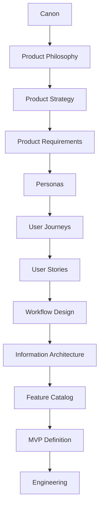
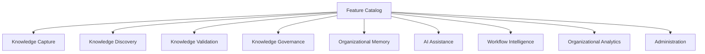
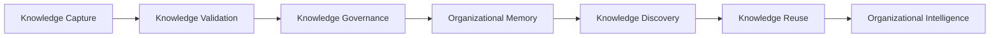
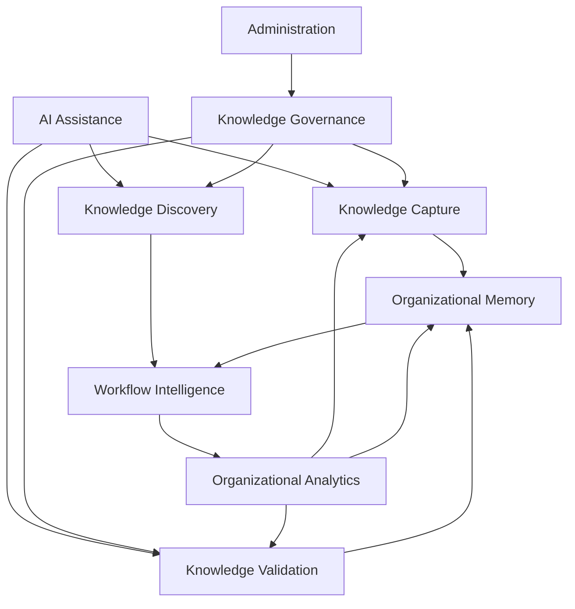
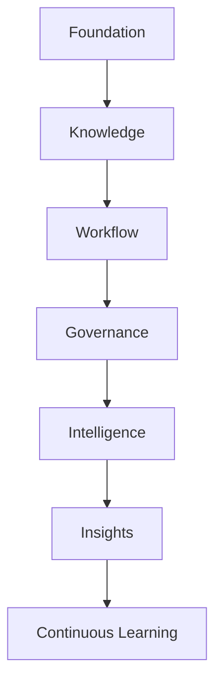
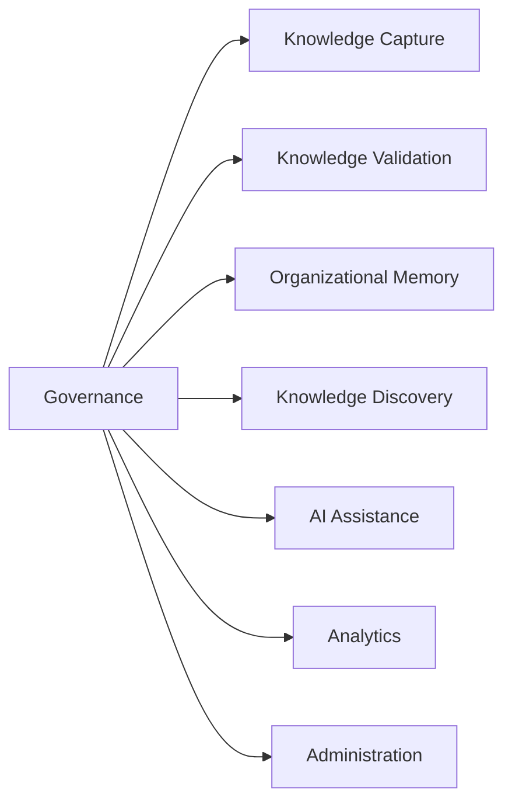
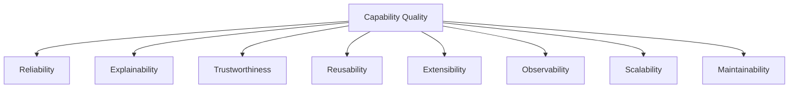
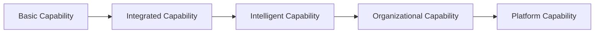

# Feature Catalog

## Derived From

- Canon Version: `v1.0.0`
- Architecture Version: `v1.0.0`
- Implementation Version: `v1.0.0`
- Strategy Version: `v1.0.0`
- Research Version: `v1.0.0`
- Product Philosophy Version: `v1.0.0`
- Product Strategy Version: `v1.0.0`
- Product Requirements Version: `v1.0.0`
- Personas Version: `v1.0.0`
- User Journeys Version: `v1.0.0`
- User Stories Version: `v1.0.0`
- Workflow Design Version: `v1.0.0`
- Information Architecture Version: `v1.0.0`

### Primary Repository Sources

- [Canon](../canon/README.md)
- [Architecture](../architecture/README.md)
- [Implementation](../implementation/README.md)
- [Strategy](../strategy/README.md)
- [Research](../research/README.md)
- [Product Philosophy](./00_PRODUCT_PHILOSOPHY.md)
- [Product Strategy](./01_PRODUCT_STRATEGY.md)
- [Product Requirements](./02_PRODUCT_REQUIREMENTS.md)
- [Personas](./03_PERSONAS.md)
- [User Journeys](./04_USER_JOURNEYS.md)
- [User Stories](./05_USER_STORIES.md)
- [Workflow Design](./06_WORKFLOW_DESIGN.md)
- [Information Architecture](./07_INFORMATION_ARCHITECTURE.md)

---

Status: **Active**

## Primary Question

What enduring capabilities should the Organizational Intelligence Platform provide to enable Organizational Intelligence across people, workflows, governance, AI, and Organizational Memory?

This document defines the complete capability catalog of the Organizational Intelligence Platform.

It is not a UI sitemap, release plan, MVP scope, sprint backlog, or technical specification. It is the company's authoritative catalog of product capabilities.

## 1. Executive Summary

The Feature Catalog is the complete inventory of platform capabilities.

In this document, a feature is not a screen, button, endpoint, or implementation task. A feature is a product capability that enables people, AI, workflows, governance, and Organizational Memory to work together.

Features exist to support organizational capability rather than individual screens.

The Organizational Intelligence Platform must provide capabilities that allow organizations to:

- Capture knowledge from work.
- Preserve evidence.
- Validate knowledge through Human Review.
- Govern access, lifecycle, and accountability.
- Maintain Organizational Memory.
- Discover and reuse trusted knowledge.
- Use AI responsibly.
- Understand workflow and learning signals.
- Administer the platform safely.

The Feature Catalog should remain valid even as interfaces, implementation technologies, AI models, and release plans change.

## Catalog Philosophy

The catalog should answer:

- What capability does the platform need?
- Why does it matter?
- Which personas use it?
- Which journeys and workflows does it support?
- Which information entities does it operate on?
- Where does AI participate?
- Where is Human Review required?
- Which governance expectations apply?
- How does the capability strengthen Organizational Intelligence?

## 2. Relationship to Repository

The Feature Catalog translates information and workflow models into durable product capabilities.

## Responsibility of Each Layer

| Layer | Responsibility |
| --- | --- |
| Canon | Defines enduring company truth and platform concepts. |
| Product Philosophy | Defines product judgment and product principles. |
| Product Strategy | Defines product evolution and capability sequencing. |
| Product Requirements | Defines enduring capability requirements and quality expectations. |
| Personas | Define enterprise roles and responsibilities. |
| User Journeys | Define end-to-end business journeys. |
| User Stories | Define persona-specific needs. |
| Workflow Design | Defines operational states, handoffs, decisions, and governance. |
| Information Architecture | Defines conceptual entities, relationships, taxonomy, metadata, and memory structure. |
| Feature Catalog | Defines the authoritative inventory of product capabilities. |
| MVP Definition | Selects the smallest validated subset of capabilities for initial delivery. |
| Engineering | Implements capabilities through technology choices and delivery plans. |

The Feature Catalog does not define release order. It defines what capabilities exist in the product universe.

## 3. Feature Catalog Principles

## Capabilities Before Screens

The catalog defines what the product must enable, not how it appears.

Screens, flows, assistants, dashboards, APIs, and automations are expressions of capabilities. They may change while the underlying capability remains.

## Reuse Before Duplication

The platform should avoid duplicating similar capabilities across domains.

Review, governance, evidence, memory, retrieval, analytics, and administration should be reusable platform capabilities whenever possible.

## Organizational Outcomes Before Convenience

A capability should not exist only because it is convenient to add.

It should improve organizational outcomes such as knowledge quality, trust, reuse, accountability, learning, or reduced Organizational Entropy.

## AI Augments Capabilities

AI should enhance capabilities rather than become a separate product identity.

AI may summarize, classify, recommend, draft, detect, and assemble context, but capabilities remain grounded in human accountability and governance.

## Governance Accompanies Capabilities

Every capability should consider permissions, auditability, traceability, lifecycle, policy, ownership, and review.

Governance is not a separate afterthought.

## Features Strengthen Organizational Memory

Capabilities should ideally make Organizational Memory more complete, trusted, discoverable, or reusable.

If a capability creates activity without improving memory or future work, its strategic value should be questioned.

## Every Feature Has Traceability

Every capability should trace back to:

- Canon.
- Product Requirements.
- Personas.
- Journeys.
- Workflows.
- Information entities.

Traceability prevents product drift.

## Features Evolve Through Evidence

Capabilities should mature through:

- Customer discovery.
- Experiments.
- Workflow observation.
- Usage evidence.
- AI evaluation.
- Knowledge quality signals.
- Customer outcomes.

## 4. Capability Domain Model

The Feature Catalog is organized into capability domains.

## Capability Domains

| Domain | Purpose |
| --- | --- |
| Knowledge Capture | Identify and preserve reusable learning from operational work. |
| Knowledge Discovery | Help users find trusted, relevant, authorized knowledge in context. |
| Knowledge Validation | Support Human Review of AI-generated and human-proposed knowledge. |
| Knowledge Governance | Apply permissions, policies, lifecycle, auditability, and accountability. |
| Organizational Memory | Maintain the governed body of validated knowledge, evidence, relationships, and reuse history. |
| AI Assistance | Provide bounded AI support for summarization, classification, recommendation, drafting, detection, and insight. |
| Workflow Intelligence | Coordinate and improve work across states, decisions, handoffs, and learning loops. |
| Organizational Analytics | Measure knowledge quality, reuse, review effectiveness, entropy reduction, and learning outcomes. |
| Administration | Configure roles, permissions, integrations, policies, identity, and operational controls. |

## Domain Principle

Domains organize capabilities by product responsibility.

They are not release phases, teams, modules, or technical services.

## 5. Capability Catalog

Every capability should use a consistent template.

## Reusable Capability Template

| Field | Description |
| --- | --- |
| Capability ID | Stable identifier for traceability. |
| Capability Name | Human-readable capability name. |
| Capability Domain | Domain the capability belongs to. |
| Purpose | Why the capability exists. |
| Business Value | Immediate customer or organizational value. |
| Organizational Outcome | How it strengthens Organizational Intelligence. |
| Primary Personas | Personas served by the capability. |
| Related Journeys | User Journeys supported. |
| Related Stories | User Stories supported. |
| Related Workflows | Operational workflows supported. |
| Related Information Entities | Information model entities involved. |
| AI Participation | How AI may assist. |
| Human Review | Where human judgment is required. |
| Governance Requirements | Permissions, audit, lifecycle, policy, or traceability needs. |
| Dependencies | Capabilities or conditions required. |
| Future Evolution | How the capability may mature over time. |

## Representative Capability Catalog

### Knowledge Capture

| Capability ID | Capability Name | Purpose | Primary Personas | Organizational Outcome |
| --- | --- | --- | --- | --- |
| KC-01 | Operational Knowledge Capture | Capture reusable learning from cases, conversations, decisions, and workflows. | Support Agent, Knowledge Manager | Work becomes institutional knowledge instead of disappearing after completion. |
| KC-02 | Evidence Preservation | Preserve source material that supports knowledge, decisions, and recommendations. | Support Agent, Reviewer, Knowledge Manager | Knowledge remains explainable and reviewable. |
| KC-03 | Knowledge Candidate Creation | Create candidate knowledge from operational evidence for review. | Support Agent, Knowledge Manager, Reviewer | Reusable learning enters the Knowledge Flywheel. |
| KC-04 | Gap Capture | Identify missing, weak, or contradictory knowledge during work. | Support Agent, Team Lead, Knowledge Manager | Organizational Entropy becomes visible. |

### Knowledge Discovery

| Capability ID | Capability Name | Purpose | Primary Personas | Organizational Outcome |
| --- | --- | --- | --- | --- |
| KD-01 | Trusted Knowledge Retrieval | Help users find relevant, authorized, validated knowledge. | Support Agent, Knowledge Manager, Product Manager | Future work benefits from prior learning. |
| KD-02 | Similar Case Discovery | Surface related cases, issues, or resolutions. | Support Agent, Reviewer | Repeated investigation decreases. |
| KD-03 | Trust Signal Display | Communicate review status, freshness, evidence, ownership, and confidence. | All knowledge users | Users know whether knowledge is safe to use. |
| KD-04 | Contextual Knowledge Surfacing | Present knowledge in relation to workflow context. | Support Agent, Team Lead | Knowledge appears where work happens. |

### Knowledge Validation

| Capability ID | Capability Name | Purpose | Primary Personas | Organizational Outcome |
| --- | --- | --- | --- | --- |
| KV-01 | Human Review Workflow | Allow accountable humans to approve, revise, reject, or escalate knowledge. | Reviewer, Knowledge Manager | Trust boundary is preserved. |
| KV-02 | Evidence-Based Review | Support review using visible source evidence and context. | Reviewer | Knowledge validation becomes explainable. |
| KV-03 | Conflict Resolution | Identify and resolve conflicting knowledge or evidence. | Reviewer, Knowledge Manager | Memory becomes more coherent. |
| KV-04 | Review History Preservation | Preserve reviewer decisions, rationale, and outcomes. | Reviewer, Compliance Officer | Accountability and auditability improve. |

### Knowledge Governance

| Capability ID | Capability Name | Purpose | Primary Personas | Organizational Outcome |
| --- | --- | --- | --- | --- |
| KG-01 | Ownership Management | Assign stewardship for knowledge and memory assets. | Knowledge Manager, Platform Administrator | Knowledge has accountable owners. |
| KG-02 | Permission Governance | Control who can view, edit, review, approve, or administer knowledge. | Platform Administrator, Security Officer | Trust and security are preserved. |
| KG-03 | Lifecycle Management | Manage candidate, approved, published, deprecated, retired, and archived states. | Knowledge Manager | Knowledge remains current and controlled. |
| KG-04 | Auditability | Preserve important actions, changes, approvals, and access events. | Compliance Officer, Security Officer | Enterprise trust and accountability improve. |
| KG-05 | Policy Enforcement | Apply organizational policies to knowledge and workflow behavior. | Compliance Officer, Platform Administrator | Governance becomes operational. |

### Organizational Memory

| Capability ID | Capability Name | Purpose | Primary Personas | Organizational Outcome |
| --- | --- | --- | --- | --- |
| OM-01 | Validated Memory Repository | Maintain governed, validated, reusable organizational knowledge. | Knowledge Manager, Support Agent | Organizational learning becomes durable. |
| OM-02 | Versioned Knowledge Memory | Preserve knowledge changes over time. | Knowledge Manager, Reviewer | Users can understand current and historical truth. |
| OM-03 | Relationship Mapping | Connect issues, evidence, knowledge, policies, workflows, teams, and insights. | Knowledge Manager, Product Manager | Isolated information becomes organizational understanding. |
| OM-04 | Reuse History | Track where and how knowledge improves future work. | Knowledge Manager, Support Manager | Memory value becomes measurable. |

### AI Assistance

| Capability ID | Capability Name | Purpose | Primary Personas | Organizational Outcome |
| --- | --- | --- | --- | --- |
| AI-01 | Context Summarization | Summarize cases, evidence, reviews, and trends. | Support Agent, Reviewer, Manager | Users understand work faster without losing context. |
| AI-02 | Recommendation Assistance | Suggest related knowledge, cases, next steps, or reviewers. | Support Agent, Reviewer | AI accelerates work while humans decide. |
| AI-03 | Classification Assistance | Suggest topics, domains, risks, lifecycle states, or issue categories. | Support Agent, Knowledge Manager | Information becomes easier to organize. |
| AI-04 | Draft Knowledge Assistance | Draft candidate knowledge from evidence. | Knowledge Manager, Reviewer | Knowledge creation becomes faster but remains reviewed. |
| AI-05 | Pattern and Gap Detection | Identify repeated issues, duplicates, contradictions, and gaps. | Team Lead, Knowledge Manager, Manager | Organizational Entropy becomes actionable. |

### Workflow Intelligence

| Capability ID | Capability Name | Purpose | Primary Personas | Organizational Outcome |
| --- | --- | --- | --- | --- |
| WI-01 | Workflow State Awareness | Track work through meaningful operational states. | Support Agent, Reviewer, Manager | Work is understandable and accountable. |
| WI-02 | Handoff Coordination | Preserve context across persona transitions. | Support Agent, Reviewer, Knowledge Manager | Knowledge and responsibility do not get lost. |
| WI-03 | Review Boundary Detection | Identify moments where Human Review is required. | Reviewer, Platform Administrator | Trust is preserved at critical transitions. |
| WI-04 | Learning Loop Support | Ensure workflows capture and reuse learning. | Knowledge Manager, Manager | Work improves future work. |

### Organizational Analytics

| Capability ID | Capability Name | Purpose | Primary Personas | Organizational Outcome |
| --- | --- | --- | --- | --- |
| OA-01 | Knowledge Quality Analytics | Measure accuracy, freshness, completeness, reuse, and trust signals. | Knowledge Manager | Knowledge improvement becomes measurable. |
| OA-02 | Reuse Analytics | Measure how validated knowledge is applied to future work. | Support Manager, Knowledge Manager | Memory value becomes visible. |
| OA-03 | Entropy Signal Analytics | Identify repeated work, duplicated investigation, stale knowledge, and gaps. | Support Manager, CX Leader | Organizational Entropy can be reduced. |
| OA-04 | AI Trust Analytics | Measure AI recommendation usefulness, review outcomes, and correction patterns. | Reviewer, Manager | Human-AI collaboration improves. |
| OA-05 | Organizational Learning Analytics | Show whether capability is improving over time. | Executive Sponsor, CX Leader | Strategic outcomes become evidence-based. |

### Administration

| Capability ID | Capability Name | Purpose | Primary Personas | Organizational Outcome |
| --- | --- | --- | --- | --- |
| AD-01 | Role and Access Administration | Manage users, roles, teams, and access boundaries. | Platform Administrator, IT Administrator | Governance can be enforced. |
| AD-02 | Integration Administration | Configure and monitor connections to enterprise systems. | IT Administrator | OIP can learn from existing work systems. |
| AD-03 | Policy Configuration | Define rules for review, lifecycle, permissions, and AI use. | Platform Administrator, Compliance Officer | Governance becomes configurable. |
| AD-04 | AI Provider and Model Controls | Govern model/provider use, constraints, and transparency. | Platform Administrator, Security Officer | AI remains controlled and replaceable. |
| AD-05 | Operational Monitoring | Observe platform health, workflow issues, and governance exceptions. | IT Administrator, Platform Administrator | Enterprise reliability improves. |

## 6. Capability Relationships

Capabilities support one another.

## Dependency Relationships

| Capability Relationship | Meaning |
| --- | --- |
| Capture before Validation | Knowledge must be captured before it can be reviewed. |
| Evidence before Trust | Review requires evidence and context. |
| Validation before Governed Memory | Knowledge should not become trusted memory without human validation. |
| Governance before Enterprise Reuse | Enterprise reuse requires permissions, lifecycle, and accountability. |
| Memory before Discovery | Trusted discovery depends on governed memory. |
| Discovery before Reuse | Users must find knowledge before they can apply it. |
| Reuse before Organizational Intelligence | Intelligence compounds when knowledge improves future work. |

## Capability Network

No capability domain should operate in isolation.

## 7. Capability Layers

Capabilities mature in layers.

## Layer Model

| Layer | Purpose | Dependency |
| --- | --- | --- |
| Foundation | Identity, roles, permissions, administration, integration basics. | None. |
| Knowledge | Capture, evidence, candidates, knowledge items, taxonomy, metadata. | Requires foundation. |
| Workflow | States, transitions, handoffs, review requests, reuse loops. | Requires knowledge capability. |
| Governance | Ownership, approval, lifecycle, audit, policy enforcement. | Requires workflow and knowledge. |
| Intelligence | AI assistance, discovery, recommendations, pattern detection. | Requires governed knowledge and context. |
| Insights | Analytics, learning signals, entropy detection, executive understanding. | Requires intelligence and usage data. |
| Continuous Learning | Research, experiments, improvement loops, cross-domain learning. | Requires measured insights. |

## Layer Principle

Higher layers depend on lower layers.

The platform should not build advanced intelligence experiences on weak foundations.

## 8. AI Capability Model

AI-enabled capabilities augment the catalog.

## AI Capability Matrix

| AI Capability | Purpose | Human Review Required? |
| --- | --- | --- |
| Summarization | Condense cases, evidence, reviews, or trends. | Required before relying in high-impact contexts. |
| Recommendation | Suggest knowledge, cases, next steps, or reviewers. | Required before action when risk exists. |
| Classification | Suggest categories, domains, topics, risks, or lifecycle states. | Required when classification affects governance or customer outcomes. |
| Similar Case Discovery | Find related issues, evidence, or resolutions. | Required to confirm applicability. |
| Knowledge Gap Detection | Identify missing or weak knowledge. | Required to prioritize and act. |
| Pattern Recognition | Surface repeated issues, trends, or contradictions. | Required for interpretation. |
| Insight Generation | Produce higher-level interpretations from signals. | Required for strategic decisions. |
| Draft Knowledge | Draft candidate knowledge from evidence. | Always required before publication. |
| Context Assembly | Gather relevant evidence and knowledge for a task. | Required before high-impact use. |

## AI Capability Principle

AI participates inside capabilities. It does not define product authority.

AI output remains a candidate until reviewed, governed, and validated.

## 9. Governance Capability Model

Governance spans every capability domain.

## Governance Capability Matrix

| Governance Capability | Purpose | Applies To |
| --- | --- | --- |
| Ownership | Assign stewardship and accountability. | Knowledge, workflows, policies, memory. |
| Approval | Ensure governed knowledge receives human validation. | Knowledge candidates, policy-sensitive content, memory updates. |
| Versioning | Preserve current and historical forms. | Knowledge, policies, reviews, memory. |
| Audit Trails | Record important actions and decisions. | Access, review, approval, publication, reuse. |
| Permissions | Control who can view, change, review, approve, or administer. | All information and workflows. |
| Lifecycle Management | Move knowledge through candidate, approved, published, deprecated, retired, and archived states. | Knowledge and memory artifacts. |
| Evidence Management | Preserve supporting evidence and source context. | Reviews, recommendations, decisions, insights. |
| Policy Enforcement | Apply organizational rules to workflow and knowledge behavior. | Users, AI, workflows, publication, access. |

## Governance Spanning Model

Governance is not one capability among others. It is also a property of every capability.

## 10. Capability Quality Attributes

Every capability should be evaluated by quality attributes.

## Quality Attribute Matrix

| Quality Attribute | Why It Matters |
| --- | --- |
| Reliability | Users must trust that capabilities behave consistently. |
| Explainability | Users must understand why knowledge, recommendations, and decisions exist. |
| Trustworthiness | Capabilities must preserve evidence, review, and governance. |
| Reusability | Capabilities should support multiple workflows and domains where appropriate. |
| Extensibility | Capabilities should evolve as domains, AI models, and integrations change. |
| Observability | Product teams and customers should understand capability health and outcomes. |
| Scalability | Capabilities must support growing users, knowledge, workflows, and organizations. |
| Maintainability | Capabilities should remain understandable and sustainable for future teams. |

## Capability Quality Model

Quality attributes ensure capabilities are enterprise-ready rather than merely present.

## 11. Capability Evolution

Capabilities mature over time.

## Evolution Stages

| Stage | Meaning |
| --- | --- |
| Basic Capability | Capability exists in a narrow, manual, or limited form. |
| Integrated Capability | Capability connects to workflows, personas, and information entities. |
| Intelligent Capability | Capability uses AI, analytics, or context to assist work. |
| Organizational Capability | Capability improves memory, governance, reuse, or organizational outcomes. |
| Platform Capability | Capability becomes reusable across domains, teams, and workflows. |

## Evolution Drivers

Capabilities evolve through:

- Research.
- Experiments.
- Customer feedback.
- Workflow observation.
- Knowledge quality signals.
- AI evaluation.
- Governance needs.
- Enterprise adoption patterns.

Capability maturity should be earned through evidence.

## 12. Repository Integration

The Feature Catalog influences downstream execution.

## Influence Matrix

| Repository Area | Feature Catalog Influence |
| --- | --- |
| MVP Features | Selects the minimum capabilities required to validate the beachhead and Knowledge Flywheel. |
| Future Releases | Provides capability inventory for expansion without creating product drift. |
| Product Metrics | Defines what capability outcomes should be measured. |
| Engineering Architecture | Provides stable product capability boundaries for implementation planning. |
| Testing Strategy | Identifies capability behavior, quality attributes, and governance expectations to verify. |
| Roadmap | Helps sequence capability maturation without defining schedule. |
| Customer Validation | Connects customer feedback to capability gaps or maturity needs. |

## Derivation Rule

All future implementations should derive from the Feature Catalog.

Implementation may change how a capability is delivered, but should not invent capabilities without catalog governance.

## 13. Traceability Matrix

| Capability | Canon | Requirement | Persona | Journey | Workflow | Information Entity |
| --- | --- | --- | --- | --- | --- | --- |
| Operational Knowledge Capture | Knowledge Flywheel | Capture Knowledge | Support Agent | Resolve a Customer Issue | Customer Issue Resolution | Customer Issue, Evidence |
| Evidence Preservation | Explainability | Evidence Management | Reviewer | Validate Knowledge | Knowledge Review | Evidence, Review |
| Human Review Workflow | Human Review | Knowledge Validation | AI Reviewer / Knowledge Reviewer | Validate Knowledge | Knowledge Review | Review, Decision |
| Lifecycle Management | Governance | Govern Knowledge | Knowledge Manager | Improve Existing Knowledge | Knowledge Improvement | Knowledge Item, Policy |
| Validated Memory Repository | Organizational Memory | Organizational Memory | Knowledge Manager | Create New Organizational Knowledge | Knowledge Creation | Organizational Memory, Knowledge Item |
| Trusted Knowledge Retrieval | Organizational Intelligence | Search Knowledge | Support Agent | Discover Organizational Knowledge | Knowledge Discovery | Knowledge Item, Metadata |
| Context Summarization | AI as Amplifier | AI Assistance | Support Agent | Resolve a Customer Issue | Customer Issue Resolution | Evidence, AI Recommendation |
| Pattern and Gap Detection | Organizational Entropy | Analyze Knowledge | Support Manager | Monitor Organizational Learning | Organizational Learning | Insight, Metric |
| Role and Access Administration | Governance | Enterprise Requirements | Platform Administrator | All Governed Journeys | Governance Checkpoints | User, Role, Organization |

## Traceability Principle

Every capability should be traceable across the repository.

Capabilities without traceability should be reviewed before inclusion.

## 14. Capability Prioritization Model

Prioritization describes strategic importance, not implementation schedule.

## Priority Levels

| Priority | Meaning |
| --- | --- |
| Foundational | Required for trust, memory, governance, identity, evidence, or core platform coherence. |
| Core | Required to deliver strong value in the beachhead workflow. |
| Expansion | Important for broader workflows, teams, integrations, and domains after validation. |
| Strategic | Important for differentiation, executive value, and long-term platform maturity. |
| Future Vision | Plausible long-term capability requiring further evidence, scale, or governance maturity. |

## Priority Matrix

| Priority | Capability Examples |
| --- | --- |
| Foundational | Evidence Preservation, Human Review Workflow, Permission Governance, Validated Memory Repository. |
| Core | Trusted Knowledge Retrieval, Knowledge Candidate Creation, Similar Case Discovery, Review History Preservation. |
| Expansion | Relationship Mapping, Handoff Coordination, Policy Configuration, Integration Administration. |
| Strategic | Organizational Learning Analytics, AI Trust Analytics, Entropy Signal Analytics. |
| Future Vision | Multi-organization learning networks, advanced benchmarking, ecosystem intelligence. |

## Prioritization Principle

A capability is not higher priority because it is impressive.

It is higher priority when it is necessary for trust, memory, governance, customer value, or validated learning.

## 15. Feature Catalog Governance

The Feature Catalog is the single source of truth for product capabilities.

## Capability Proposal Process

New capabilities should be proposed with:

- Capability name.
- Domain.
- Purpose.
- Business value.
- Organizational outcome.
- Related personas.
- Related journeys and stories.
- Related workflows.
- Related information entities.
- Governance expectations.
- Dependencies.
- Evidence or validation plan.

## Capability Approval Criteria

| Criterion | Question |
| --- | --- |
| Canon Alignment | Does the capability strengthen Organizational Intelligence? |
| Product Philosophy Alignment | Does it preserve trust, memory, review, and governance? |
| Requirement Fit | Which Product Requirement does it satisfy? |
| Persona Need | Which persona responsibility does it support? |
| Journey Support | Which business journey does it improve? |
| Information Model Fit | Which entities and relationships does it operate on? |
| Governance | Does it preserve permissions, audit, lifecycle, and review? |
| Evidence | Is there research, experiment, or customer signal supporting it? |

## Deprecation Criteria

A capability may be deprecated when:

- It no longer supports product strategy.
- It duplicates another capability.
- It weakens governance or trust.
- Evidence shows it does not create value.
- It belongs to a different product category.
- It has been superseded by a better capability.

## Avoiding Duplicate Capabilities

Duplicate capabilities are avoided by checking:

- Domain overlap.
- Persona overlap.
- Journey overlap.
- Workflow overlap.
- Information entity overlap.
- Governance responsibility.

If two proposed capabilities solve the same enduring need, they should be merged or clearly differentiated.

## 16. Limitations

The Feature Catalog intentionally avoids:

- UI design.
- Screen definitions.
- Implementation details.
- API contracts.
- Engineering architecture.
- Sprint planning.
- Release sequencing.
- MVP scope.
- Database schema.
- Vendor decisions.

Those belong in later Product, Architecture, Implementation, Roadmap, and Engineering documents.

This document defines enduring product capabilities, not delivery details.

## 17. Closing

The Feature Catalog is not simply a list of features.

It is the structured inventory of organizational capabilities that collectively enable Organizational Intelligence.

Individual features may evolve.

Interfaces may change.

AI models will improve.

Technologies will be replaced.

However, the underlying capabilities required to create, govern, discover, validate, reuse, and continuously improve organizational knowledge remain remarkably stable.

The Feature Catalog therefore serves as the enduring bridge between Product Design and Product Delivery.

Every capability should strengthen Organizational Memory, reinforce governance, support Human Review, improve knowledge quality, and contribute to the continuous growth of Organizational Intelligence.

The catalog should always ask:

> Does this capability help organizations become wiser through the work they already perform?

If not, it should not belong in the Organizational Intelligence Platform.
