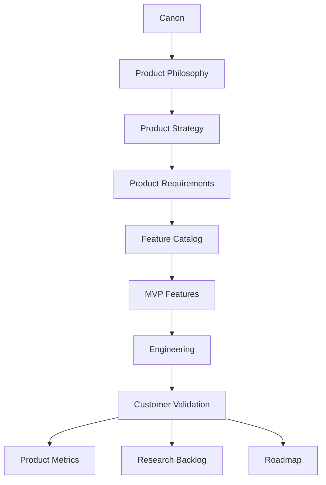
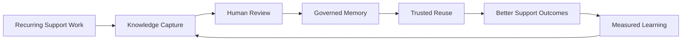
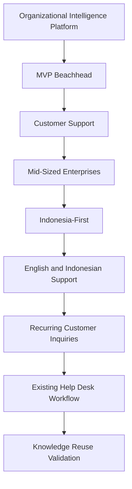
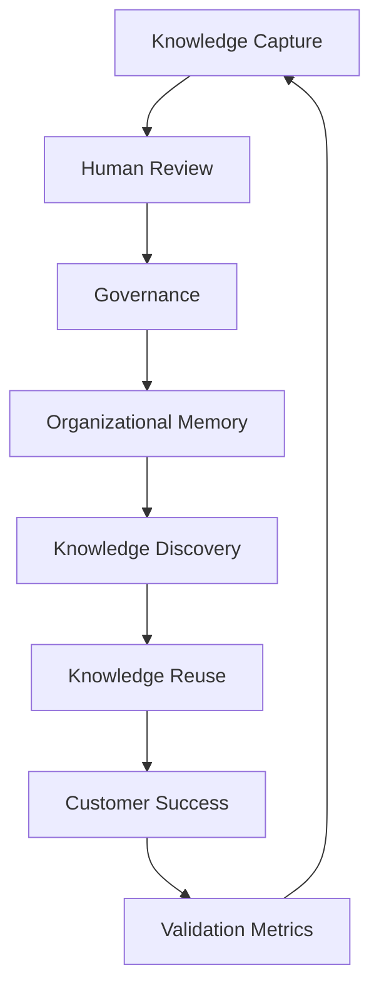
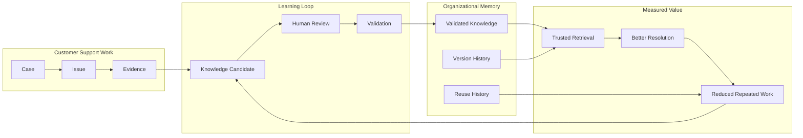
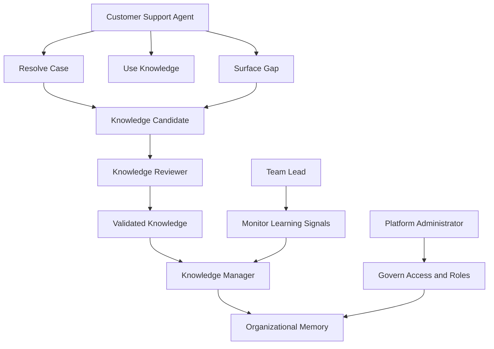
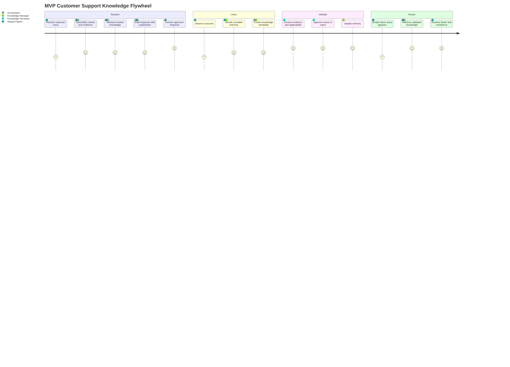
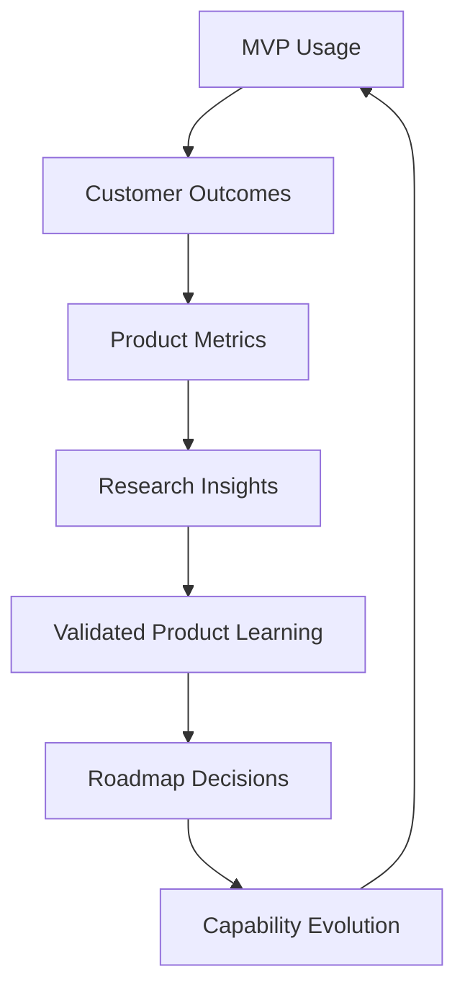
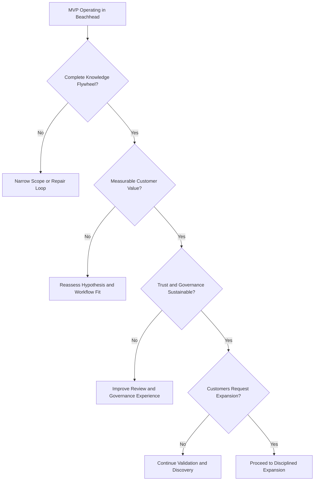

# MVP Features

## Derived From

- Canon Version: `v1.0.0`
- Architecture Version: `v1.0.0`
- Implementation Version: `v1.0.0`
- Strategy Version: `v1.0.0`
- Research Version: `v1.0.0`
- Product Philosophy Version: `v1.0.0`
- Product Strategy Version: `v1.0.0`
- Product Requirements Version: `v1.0.0`
- Personas Version: `v1.0.0`
- User Journeys Version: `v1.0.0`
- User Stories Version: `v1.0.0`
- Workflow Design Version: `v1.0.0`
- Information Architecture Version: `v1.0.0`
- Feature Catalog Version: `v1.0.0`

### Primary Repository Sources

- [Canon](../canon/README.md)
- [Architecture](../architecture/README.md)
- [Implementation](../implementation/README.md)
- [Strategy](../strategy/README.md)
- [Research](../research/README.md)
- [Product Philosophy](./00_PRODUCT_PHILOSOPHY.md)
- [Product Strategy](./01_PRODUCT_STRATEGY.md)
- [Product Requirements](./02_PRODUCT_REQUIREMENTS.md)
- [Personas](./03_PERSONAS.md)
- [User Journeys](./04_USER_JOURNEYS.md)
- [User Stories](./05_USER_STORIES.md)
- [Workflow Design](./06_WORKFLOW_DESIGN.md)
- [Information Architecture](./07_INFORMATION_ARCHITECTURE.md)
- [Feature Catalog](./08_FEATURE_CATALOG.md)

---

Status: **Active**

## Primary Question

What is the smallest complete set of capabilities required to prove that Organizational Intelligence creates measurable customer value?

This document defines the Minimum Viable Product features of the Organizational Intelligence Platform.

It is not a sprint backlog, release plan, technical roadmap, or complete product specification. It defines the smallest complete product capable of validating the company's core hypothesis.

## 1. Executive Summary

The MVP is not the smallest application that can be shipped.

The MVP is the smallest complete Organizational Intelligence system capable of demonstrating measurable customer value.

This distinction matters. A narrow chatbot, a searchable knowledge base, or a ticket summarizer may be smaller than the MVP, but each would fail to test the product thesis if it cannot complete the Knowledge Flywheel:

1. Operational work produces evidence.
2. Evidence supports reasoning.
3. Humans review consequential recommendations and knowledge changes.
4. Validated learning becomes Organizational Memory.
5. Future work reuses that memory.
6. Customer and organizational outcomes improve measurably.

The MVP therefore selects the minimum set of capabilities required to prove that an organization can become more capable through the work it already performs. It narrows breadth rather than cutting through the trust boundaries that define the platform.

The MVP focuses on Customer Support teams in mid-sized enterprises, beginning Indonesia-first and supporting English and Indonesian work where relevant. It targets organizations with recurring customer inquiries, existing help desk workflows, and enough historical or ongoing support activity to observe knowledge reuse.

The MVP should validate whether governed knowledge, Human Review, AI assistance, and Organizational Memory together reduce Organizational Entropy. It should not attempt to demonstrate every future capability of the platform.

## MVP Implementation Philosophy

The MVP is intentionally focused. Its purpose is to validate the Organizational Intelligence architecture rather than to build every future capability.

The current MVP is the first production-quality implementation of the Organizational Intelligence Platform, delivered through the **Live Workflow Knowledge Intake Door**. It demonstrates one complete organizational learning loop from live customer support interactions: knowledge is captured during work, validated before reuse, and continuously improved as Organizational Memory.

The fuller product judgment behind the MVP is defined in the MVP Philosophy section; this section frames how that philosophy maps to what is actually implemented.

## Feature Status Legend

The feature tables in this document use a consistent status legend.

| Status | Meaning |
| --- | --- |
| ✅ Implemented | Available in the MVP. |
| 🚧 Planned | Designed but intentionally deferred. |
| 🔮 Future | Long-term platform capability. |

## 2. Relationship to Repository

MVP Features translate the Feature Catalog into the smallest validated subset needed for initial customer learning.

## Responsibility of Each Layer

| Layer | Responsibility |
| --- | --- |
| Canon | Defines the enduring concepts, philosophy, trust boundaries, and language of the platform. |
| Product Philosophy | Defines product judgment: learning over automation, governance over convenience, and memory over conversation. |
| Product Strategy | Defines the sequencing logic for market entry, beachhead validation, and expansion. |
| Product Requirements | Defines enduring capabilities and quality expectations independent of implementation. |
| Feature Catalog | Defines the complete capability universe available for product planning. |
| MVP Features | Selects the minimum complete capability set required to validate the core hypothesis. |
| Engineering | Implements the selected capabilities through delivery choices that preserve product meaning. |
| Customer Validation | Tests whether the selected capabilities create measurable customer and organizational value. |

MVP Features do not replace the Feature Catalog. They are a disciplined subset of it.

The MVP should be narrow enough to learn quickly and complete enough to preserve the platform's identity.

## 3. MVP Philosophy

## Complete Learning Loops Before Feature Breadth

The MVP must prove one complete Knowledge Flywheel before expanding into many workflows.

A broad product with disconnected features can create activity without Organizational Intelligence. A narrow product with a complete loop can prove that work becomes memory, memory improves future work, and outcomes improve over time.

## Validate Organizational Intelligence

The MVP exists to test whether Organizational Intelligence creates measurable customer value.

It should not optimize for the number of shipped features, the breadth of integrations, or the appearance of AI sophistication. It should validate whether governed learning reduces repeated work, improves consistency, increases knowledge reuse, and strengthens institutional capability.

## Solve One Workflow Exceptionally Well

The MVP should focus on one high-repetition, knowledge-rich Customer Support workflow.

The selected workflow must be common enough to generate repeated cases, complex enough to require judgment, and bounded enough to evaluate clearly. Customer Support is the beachhead because the problem is visible, measurable, and strongly connected to Organizational Memory.

## Quality Over Quantity

The MVP should include fewer capabilities with stronger trust, traceability, and workflow coherence.

Weak knowledge capture, superficial review, or unreliable retrieval would undermine the platform thesis even if many features existed. The MVP must be good enough for real teams to use on real work within the selected scope.

## Human Review Remains Essential

Human Review is not an optional enterprise feature deferred until later.

It is part of the MVP because trust, authority, and validation are central to Organizational Intelligence. AI may assist with summaries, recommendations, and drafts, but governed knowledge must be reviewed before becoming trusted Organizational Memory.

## Governance Is Never Optional

The MVP may use a simple governance model, but it cannot operate without governance.

At minimum, the product must preserve ownership, permissions, lifecycle state, review history, auditability, and organization boundaries. Without governance, the MVP becomes an uncontrolled AI assistant rather than an Organizational Intelligence Platform.

## Evidence Before Expansion

The MVP should earn expansion through evidence.

New departments, advanced analytics, more integrations, deeper automation, and broader AI capabilities should follow only after the core learning loop demonstrates customer value.

## Build Platform Foundations First

The MVP should establish foundations that can evolve into a platform.

Even when operational scope is small, the underlying product concepts should remain stable: Case, Issue, Evidence, Knowledge Candidate, Review, Validation, Organizational Memory, Workflow, User, Agent, and Governance. The MVP should not take shortcuts that later require conceptual reversal.

## 4. MVP Success Hypothesis

## Primary Hypothesis

If organizations capture operational knowledge, validate it through Human Review, govern it appropriately, and continuously reuse it, Organizational Intelligence will measurably improve Customer Support outcomes.

This hypothesis is the reason the MVP exists. The MVP is successful only if customers become more capable, not merely if the product is used.

## Secondary Hypotheses

| Hypothesis | What the MVP Must Test |
| --- | --- |
| Support work contains reusable knowledge | Recurring cases should generate lessons that can become validated knowledge. |
| Human Review increases trust | Reviewers should be able to inspect evidence, revise AI-assisted drafts, and approve knowledge with confidence. |
| Organizational Memory improves future work | Later cases should reuse validated knowledge and require less repeated investigation. |
| AI assistance accelerates but does not replace expertise | AI should help summarize, recommend, draft, and detect patterns while humans retain authority. |
| Governance enables enterprise adoption | Permissions, ownership, lifecycle, and auditability should make the system safer to trust. |
| Knowledge reuse is measurable | The product should show whether validated knowledge is applied to future cases and improves outcomes. |
| Customer Support is the right beachhead | Support teams should experience immediate value from repeated issue reduction and knowledge quality improvement. |

## Hypothesis Validation Model

The MVP should produce enough evidence to confirm, refine, or reject these hypotheses before the company invests in broader platform expansion.

## 5. Beachhead Scope

The MVP begins with a deliberately narrow customer and workflow boundary.

## Initial Customer Profile

| Dimension | MVP Scope |
| --- | --- |
| Primary function | Customer Support teams. |
| Company size | Mid-sized enterprises with enough recurring support volume to observe reuse. |
| Geographic focus | Indonesia-first, with future expansion beyond the initial geography. |
| Language context | English and Indonesian support where relevant to customer operations. |
| Digital maturity | Teams already using help desk software or structured support tools. |
| Inquiry pattern | Recurring customer questions, repeated investigations, and known documentation gaps. |
| Knowledge maturity | Some existing documentation or expert knowledge, but inconsistent reuse and maintenance. |
| Human process | Existing escalation, review, or expert involvement in support resolution. |

## Why This Scope Was Selected

Customer Support is the best beachhead because it contains the conditions required to validate Organizational Intelligence:

- High case volume creates enough operational signal.
- Repeated issues create opportunities for knowledge reuse.
- Existing experts reveal the cost of trapped institutional knowledge.
- Documentation gaps are painful and visible.
- Human review already exists in many support workflows.
- Support outcomes can be measured through resolution quality, speed, consistency, escalation, and reuse.
- The workflow naturally produces evidence, corrections, outcomes, and learning candidates.

## MVP Scope Diagram

The MVP should not attempt to serve every department, every geography, every language, or every support workflow at once. It should prove one high-value loop deeply.

## 6. Included MVP Capabilities

The following capabilities are the minimum complete set required to validate the MVP hypothesis.

They are organized by capability domain and expressed as product capabilities rather than implementation tasks.

## Capability Selection Table

| Domain | Included Capability | Why Included | Hypothesis Validated | Personas | Journeys Enabled |
| --- | --- | --- | --- | --- | --- |
| Knowledge Capture | Operational Knowledge Capture | Captures reusable learning from customer support work. | Support work contains reusable knowledge. | Customer Support Agent, Knowledge Manager | Resolve Customer Issue, Create Knowledge |
| Knowledge Capture | Evidence Preservation | Keeps source context attached to claims and decisions. | Trust requires evidence. | Support Agent, Knowledge Reviewer | Resolve Customer Issue, Validate Knowledge |
| Knowledge Capture | Knowledge Candidate Creation | Converts reusable lessons into reviewable knowledge proposals. | Work can become Organizational Memory. | Support Agent, Knowledge Manager | Create Knowledge, Improve Knowledge |
| Knowledge Validation | Human Review Workflow | Ensures proposed knowledge is reviewed before becoming trusted. | Human Review increases trust. | Knowledge Reviewer, Knowledge Manager | Review Knowledge, Validate Knowledge |
| Knowledge Validation | Review History | Preserves reviewer decisions, rationale, and outcomes. | Governance enables trust and accountability. | Knowledge Reviewer, Team Lead | Validate Knowledge, Improve Knowledge |
| Organizational Memory | Validated Memory Repository | Stores trusted knowledge for future reuse. | Organizational Memory improves future work. | Knowledge Manager, Support Agent | Discover Knowledge, Resolve Customer Issue |
| Organizational Memory | Versioned Knowledge | Preserves current and historical knowledge states. | Memory must evolve without losing history. | Knowledge Manager, Reviewer | Improve Knowledge |
| Knowledge Discovery | Trusted Knowledge Retrieval | Helps users find validated, relevant, authorized knowledge. | Reuse can improve support outcomes. | Support Agent, Knowledge Manager | Discover Knowledge, Resolve Customer Issue |
| Knowledge Discovery | Similar Case Discovery | Surfaces prior related cases and resolutions. | Repeated investigation can decline. | Support Agent, Team Lead | Resolve Customer Issue |
| AI Assistance | Context Summarization | Helps users understand cases, evidence, and prior context faster. | AI can reduce cognitive load. | Support Agent, Reviewer | Resolve Customer Issue, Review Knowledge |
| AI Assistance | Recommendation Assistance | Suggests relevant knowledge, cases, and next steps. | AI can accelerate responsible reuse. | Support Agent, Reviewer | Resolve Customer Issue, Discover Knowledge |
| AI Assistance | Draft Knowledge Assistance | Drafts candidate knowledge from evidence for human review. | AI can assist capture without becoming authority. | Knowledge Manager, Reviewer | Create Knowledge, Improve Knowledge |
| Governance | Ownership | Assigns accountability for knowledge and memory assets. | Governance enables enterprise trust. | Knowledge Manager, Platform Administrator | Validate Knowledge, Improve Knowledge |
| Governance | Permissions | Controls who can view, change, review, approve, and administer. | Secure governance is required for adoption. | Platform Administrator, Knowledge Manager | All governed journeys |
| Governance | Lifecycle | Manages candidate, approved, active, deprecated, retired, and archived states. | Knowledge quality requires lifecycle control. | Knowledge Manager, Reviewer | Validate Knowledge, Improve Knowledge |
| Governance | Auditability | Preserves key actions, approvals, changes, and reuse events. | Trust requires traceability. | Reviewer, Team Lead, Administrator | All governed journeys |
| Analytics | MVP Validation Metrics | Measures knowledge reuse, review, quality, trust, and outcome improvement. | Product value must be measurable. | Team Lead, Knowledge Manager, Founder | Monitor Organizational Learning |

## Knowledge Capture

### Operational Knowledge Capture

The platform must capture reusable learning from customer support cases, conversations, decisions, corrections, and outcomes.

It is included because the MVP must prove that work can become institutional knowledge. Without capture, the platform cannot reduce Organizational Entropy.

This capability validates whether support agents and knowledge managers can identify meaningful lessons without turning every case into noisy documentation.

### Evidence Preservation

The platform must preserve the evidence supporting knowledge candidates, recommendations, reviews, and memory changes.

It is included because explainability depends on evidence. Reviewers should know why a knowledge candidate exists, where it came from, what it applies to, and what limits it has.

Evidence Preservation supports Customer Support Agents, Knowledge Reviewers, Knowledge Managers, and Team Leads across resolution, review, and improvement journeys.

### Knowledge Candidate Creation

The platform must allow reusable lessons to become Knowledge Candidates before they become trusted Organizational Memory.

It is included because the MVP must separate proposed learning from validated knowledge. AI and humans may suggest candidates, but candidates remain untrusted until reviewed.

This capability enables Create Knowledge and Improve Knowledge journeys while preserving Human Review.

## Knowledge Validation

### Human Review Workflow

The platform must provide a workflow where accountable humans can approve, revise, reject, narrow, or escalate Knowledge Candidates.

It is included because Organizational Intelligence depends on validated learning. The MVP cannot allow AI-generated or unreviewed content to become authoritative memory.

This capability directly serves Knowledge Reviewers and Knowledge Managers.

### Review History

The platform must preserve review decisions, reviewer identity, rationale, evidence considered, and outcome.

It is included because enterprise trust requires accountability. Review History also allows the organization to learn from reviewer corrections and understand how knowledge quality evolves.

## Organizational Memory

### Validated Memory Repository

The platform must maintain a governed repository of validated knowledge, evidence, relationships, review outcomes, and reuse history.

It is included because the product thesis depends on durable memory. A system that only answers cases without improving memory does not validate Organizational Intelligence.

### Versioned Knowledge

The platform must preserve knowledge changes over time.

It is included because customer support policies, product behavior, and operational guidance change. The MVP must distinguish current truth from prior truth and preserve why changes occurred.

## Knowledge Discovery

### Trusted Knowledge Retrieval

The platform must help authorized users find relevant, validated knowledge in the context of support work.

It is included because memory has value only when it improves future work. Discovery must expose trust signals such as review status, evidence, freshness, ownership, and applicability.

### Similar Case Discovery

The platform must help users identify related cases, recurring issues, and prior resolutions.

It is included because the MVP must test whether repeated work can be reduced. Similar case discovery should help support teams avoid re-solving the same problem from scratch.

## AI Assistance

### Context Summarization

The platform must use AI to help summarize cases, evidence, prior interactions, and review context.

It is included because Customer Support workflows often contain more context than humans can efficiently parse. Summarization accelerates understanding but does not replace review.

### Recommendation Assistance

The platform must use AI to recommend relevant knowledge, similar cases, possible next steps, and likely knowledge gaps.

It is included because AI can help connect work to memory. Recommendations remain suggestions; humans decide whether they apply.

### Draft Knowledge Assistance

The platform must use AI to draft candidate knowledge from resolved cases, corrections, evidence, or repeated patterns.

It is included because knowledge creation is often too costly when done entirely manually. Drafting reduces friction while preserving Human Review and validation.

## Governance

### Ownership

The platform must assign accountable ownership for knowledge, candidates, reviews, and memory assets.

It is included because knowledge without stewardship decays. Ownership makes maintenance, review, and improvement operational.

### Permissions

The platform must control who can view, create, edit, review, approve, retire, and administer knowledge.

It is included because enterprise teams will not trust a memory system without access boundaries.

### Lifecycle

The platform must manage knowledge through explicit lifecycle states.

It is included because trusted memory is not static. Knowledge may be candidate, active, challenged, deprecated, retired, replaced, or archived.

### Auditability

The platform must preserve meaningful actions, approvals, changes, and reuse events.

It is included because organizations need to understand who changed knowledge, why it changed, and where it was reused.

## Analytics

### MVP Validation Metrics

The platform must measure the outcomes required to validate the MVP hypothesis.

It is included because shipping features is not proof. The MVP must measure reuse, review, quality, trust, repeated work, onboarding, and Organizational Entropy reduction.

## 7. Implemented Feature Status

This section inventories the MVP feature set by category using the Feature Status Legend. It complements the conceptual capability list in Included MVP Capabilities by recording what is actually implemented in the current prototype.

## Knowledge Intake

| Feature | Status |
| --- | --- |
| Live Workflow Intake (Customer Support) | ✅ Implemented |
| Manual Knowledge Entry | 🚧 Planned |
| Historical Knowledge Import | 🚧 Planned |
| Multi-source Knowledge Intake Architecture | ✅ Implemented |

Only the Live Workflow Door is implemented. The architecture already supports additional intake doors, so Manual Entry and Historical Import can be added without changing the downstream Organizational Intelligence pipeline.

## Organization Profile

| Feature | Status |
| --- | --- |
| Organization Profiles | ✅ Implemented |
| Industry-specific behavior | ✅ Implemented |
| Configurable terminology | ✅ Implemented |
| Configurable trust policies | ✅ Implemented |
| Multi-tenant organization management | 🚧 Planned |

## Organizational Intelligence

| Feature | Status |
| --- | --- |
| Business Relevance Guardrail | ✅ Implemented |
| Ticket Understanding | ✅ Implemented |
| Canonical Problem Engine | ✅ Implemented |
| Organizational Memory | ✅ Implemented |
| Memory Retrieval | ✅ Implemented |
| Knowledge Reuse | ✅ Implemented |
| Trust Engine | ✅ Implemented |
| Pattern Discovery | ✅ Implemented |
| Organizational Learning | ✅ Implemented |
| Auto Resolution Eligibility | ✅ Implemented |

## AI Advisory

| Feature | Status |
| --- | --- |
| AI Provider Interface | ✅ Implemented |
| LM Studio (Gemma) Provider | ✅ Implemented |
| AI Advisory Panel | ✅ Implemented |
| Deterministic Fallback | ✅ Implemented |
| AMD Cloud Provider | 🚧 Planned |
| Multiple AI Provider Support | 🚧 Planned |

AI is advisory only. The OIP remains authoritative: AI assists understanding, drafting, and enrichment, but validation, trust, governance, and memory remain owned by the platform.

## Governance

| Feature | Status |
| --- | --- |
| Human Review | ✅ Implemented |
| Validation Gate | ✅ Implemented |
| Provenance Tracking | ✅ Implemented |
| Trust Evolution | ✅ Implemented |
| Organizational Policies | ✅ Implemented |

## Organizational Learning

| Feature | Status |
| --- | --- |
| Knowledge Growth | ✅ Implemented |
| Canonical Problem Evolution | ✅ Implemented |
| Emerging Pattern Detection | ✅ Implemented |
| Pattern Promotion | ✅ Implemented |
| Trust Improvement | ✅ Implemented |
| Knowledge Versioning | ✅ Implemented |

## User Experience

| Feature | Status |
| --- | --- |
| Demo Workflow | ✅ Implemented |
| Session Reset | ✅ Implemented |
| Organization Reset | ✅ Implemented |
| Metrics Dashboard | ✅ Implemented |
| Organization Metrics | ✅ Implemented |
| AI Advisory Panel | ✅ Implemented |
| Knowledge Browser | ✅ Implemented |
| Similar Knowledge View | ✅ Implemented |

## 8. What the MVP Demonstrates

The MVP successfully demonstrates:

- Knowledge captured during live work.
- Knowledge validated before reuse.
- Organizational Memory improving over time.
- Canonical Problems evolving.
- Pattern Discovery identifying recurring issues.
- Trust influencing automation.
- AI assisting without replacing organizational governance.
- Organization Profiles changing system behavior through configuration.

Together these demonstrate one complete organizational learning loop through the Live Workflow Knowledge Intake Door.

## 9. Intentionally Deferred Features

These features are designed but intentionally outside MVP scope (🚧 Planned). They are deferred because they do not change the core Organizational Intelligence architecture being validated; each can be added later as an extension of the same pipeline.

- Manual Knowledge Entry workflow.
- Historical Bulk Import workflow.
- Enterprise authentication.
- Production database.
- Cloud-native storage.
- Enterprise connector marketplace.
- Role-based administration.
- Multi-organization SaaS management.
- AMD Cloud AI deployment.
- Enterprise analytics.
- Production security controls.

This list is implementation-focused. The strategic capability deferrals are described in the Excluded Capabilities and Limitations sections.

## 10. Future Platform Features

These are long-term platform capabilities (🔮 Future). They extend the existing architecture rather than replacing it: each becomes another Knowledge Intake Door or another configuration of the same Organizational Intelligence pipeline.

- HR Knowledge Intake.
- IT Service Desk.
- Legal Operations.
- Sales Enablement.
- Manufacturing Operations.
- Healthcare Workflows.
- Enterprise Knowledge Graph.
- Cross-organization benchmarking.
- Advanced AI providers.
- Enterprise workflow automation.

Each future capability reuses the validated Knowledge Intake, Validation, Organizational Intelligence, Memory, Trust, Learning, and AI Advisory layers.

## 11. Excluded Capabilities

The MVP intentionally postpones capabilities that may be valuable but are not required to validate the core hypothesis.

| Deferred Capability | Why Deferred |
| --- | --- |
| Cross-department intelligence | The MVP must first prove one complete Customer Support learning loop before expanding to IT, HR, Legal, Finance, or Operations. |
| Executive analytics | Leadership dashboards are valuable later, but the MVP should prioritize operational proof of knowledge reuse and outcome improvement. |
| Advanced benchmarking | Benchmarking requires larger datasets, mature metrics, and comparable customer populations. |
| Multi-organization learning | Cross-customer learning introduces privacy, governance, permission, and trust complexity beyond the MVP. |
| Predictive optimization | Prediction should follow demonstrated capture, validation, reuse, and outcome measurement. |
| Ecosystem intelligence | Partner, supplier, market, and ecosystem-level learning belongs to later platform expansion. |
| Extensive customization | The MVP should use opinionated workflows to preserve learning speed and product coherence. |
| Broad departmental coverage | Expanding too early would dilute evidence and make validation ambiguous. |
| Autonomous customer-facing action | Human approval remains required for customer-facing decisions and governed knowledge changes. |
| Advanced AI autonomy | AI should assist, not act as authority. Higher autonomy requires stronger evidence, governance, and trust maturity. |
| Full enterprise policy engines | The MVP needs essential governance, not every possible enterprise policy configuration. |
| Deep integration marketplace | Initial integration should be sufficient to observe support work and knowledge reuse, not maximize connector breadth. |

Deferred does not mean rejected.

These capabilities may become important after the MVP proves that governed Organizational Memory improves real support outcomes.

## 12. MVP Capability Dependency Model

The MVP capabilities form a dependent learning system.

## Dependency Explanation

| Dependency | Why It Matters |
| --- | --- |
| Knowledge Capture before Human Review | Reviewers need candidate knowledge, evidence, and context to evaluate. |
| Human Review before Governed Memory | Proposed knowledge should not become trusted memory without accountable validation. |
| Governance before Organizational Memory | Memory must preserve permissions, ownership, lifecycle, and auditability. |
| Organizational Memory before Discovery | Users can only discover reusable knowledge if validated memory exists. |
| Discovery before Reuse | Knowledge must be findable in context before it can improve future work. |
| Reuse before Customer Success | Organizational Intelligence is proven when validated memory improves real outcomes. |
| Metrics before Expansion | Expansion should follow evidence, not optimism. |

## MVP Capability System

Removing any major capability breaks the learning system:

- Without capture, work does not become learning.
- Without Human Review, learning does not become trusted.
- Without governance, memory is unsafe to rely on.
- Without Organizational Memory, learning is not durable.
- Without discovery, memory is unused.
- Without reuse, value does not compound.
- Without metrics, the company cannot know whether the hypothesis is true.

## 13. MVP Personas

The MVP includes only the personas required to operate, validate, and measure the first Customer Support learning loop.

## Persona Participation Matrix

| Persona | MVP Participation | Why Included or Deferred |
| --- | --- | --- |
| Customer Support Agent | Primary | Resolves cases, uses trusted knowledge, identifies gaps, and contributes operational learning. |
| Knowledge Reviewer / AI Reviewer | Primary | Reviews AI-assisted drafts and Knowledge Candidates before trust is granted. |
| Knowledge Manager | Primary | Maintains knowledge quality, ownership, lifecycle, and Organizational Memory. |
| Customer Support Team Lead | Supporting | Monitors repeated issues, review friction, knowledge reuse, and team outcomes. |
| Platform Administrator | Supporting | Configures users, roles, permissions, and essential governance boundaries. |
| Customer Support Manager | Supporting / observational | Evaluates operational outcomes and adoption signals without requiring executive analytics. |
| Executive Sponsor | Deferred / observational | Important for buying and expansion, but not required for daily MVP workflow. |
| Compliance Officer | Deferred | Formal compliance workflows are deferred unless required by the pilot customer. |
| Security Officer | Deferred | Security expectations remain present, but specialized security workflows are not central to MVP validation. |
| Cross-functional Leaders | Deferred | Expansion beyond support follows after proof in the beachhead. |

## Persona Role Model

The MVP is intentionally role-complete but persona-limited.

It includes enough human responsibility to test trust, review, governance, and memory without requiring every future enterprise stakeholder.

## 14. MVP User Journeys

The MVP implements the minimum journeys required to validate the Knowledge Flywheel in Customer Support.

## Journey Coverage Matrix

| Journey | MVP Coverage | Why It Is Sufficient for Validation |
| --- | --- | --- |
| Resolve Customer Issue | Included | Proves that support work can use memory, AI assistance, evidence, and human judgment to improve outcomes. |
| Create Knowledge | Included | Proves that resolved work can become a Knowledge Candidate. |
| Review Knowledge | Included | Proves that Human Review can validate, revise, reject, or narrow candidate knowledge. |
| Discover Knowledge | Included | Proves that future cases can find and reuse validated memory. |
| Improve Knowledge | Included | Proves that corrections, new evidence, and outcomes can evolve existing knowledge. |
| Monitor Organizational Learning | Minimal | Proves that reuse, review, quality, and repeated work can be measured without building full executive analytics. |

## MVP Journey Flow

These journeys are sufficient because they cover the full cycle from work to memory to improved future work.

They do not cover every future product journey. They cover the minimum set needed to prove that Organizational Intelligence is more than information storage or AI response generation.

## 15. MVP Validation Metrics

MVP metrics should validate Organizational Intelligence rather than feature usage alone.

## Validation Matrix

| Metric | Definition | Validates | Interpretation |
| --- | --- | --- | --- |
| Resolution time | Time required to resolve comparable recurring cases. | Reuse reduces repeated investigation. | Improvement matters only if quality and trust remain stable or improve. |
| Knowledge reuse rate | Percentage of eligible cases using validated knowledge. | Organizational Memory is discoverable and useful. | High reuse is good only when applicability is correct. |
| Successful reuse rate | Percentage of reuse events leading to accepted, uncorrected, appropriate outcomes. | Reused knowledge improves work. | More important than raw retrieval frequency. |
| Human Review completion | Percentage of Knowledge Candidates receiving clear review outcomes. | Review workflow is sustainable. | Bottlenecks reveal process or trust problems. |
| AI recommendation acceptance | Percentage of AI recommendations accepted, revised, or rejected by humans. | AI assistance is useful and bounded. | Revisions are valuable learning signals, not failures alone. |
| Knowledge quality | Accuracy, completeness, freshness, applicability, evidence quality, and reviewer confidence. | Memory is becoming trustworthy. | Quality should improve over time, not merely volume. |
| Duplicate investigation reduction | Reduction in repeated diagnostic work for similar issues. | Organizational Entropy is decreasing. | Must be evaluated by issue family and context. |
| Organizational Entropy reduction | Decrease in repeated questions, stale knowledge, undocumented exceptions, and expert interruptions. | Core category problem is being solved. | Composite signal, not a single magic score. |
| Time to onboard new agents | Time required for new support agents to resolve in-scope issues competently. | Memory reduces dependence on informal expertise. | Must preserve quality and escalation behavior. |
| Knowledge Candidate conversion | Percentage of candidates becoming validated knowledge, updates, gaps, or explicit no-learning outcomes. | Capture is selective and useful. | Too many low-quality candidates signal capture noise. |
| Review correction patterns | Common reasons reviewers revise or reject AI drafts or candidate knowledge. | AI and workflow improve through feedback. | Corrections should become less repetitive over time. |
| Knowledge gap closure | Confirmed gaps resolved through validated knowledge and later successful reuse. | Learning loop repairs memory insufficiency. | Gap closure is stronger than gap detection alone. |

## Metric Quality Rules

- Metrics must compare similar issue groups, not unrelated support work.
- Faster resolution is positive only if customer outcome, trust, and review quality remain strong.
- More knowledge is not automatically better; validated, reused, current knowledge matters.
- Human Review is not waste; it is a trust mechanism.
- AI acceptance is not the same as AI correctness.
- Organizational Entropy reduction should be evaluated through repeated work, duplicate investigation, stale knowledge, and expert dependency.

## 16. MVP Learning Objectives

The MVP exists to produce learning for the company as much as value for customers.

## Learning Objective Matrix

| Learning Objective | Key Question | Evidence Needed |
| --- | --- | --- |
| Agent contribution | Will support agents contribute useful operational knowledge during or after real work? | Candidate creation patterns, contribution frequency, quality, and friction. |
| Reviewer trust | Do reviewers trust AI drafts when evidence, applicability, and uncertainty are visible? | Review decisions, revisions, acceptance rates, rationale, and survey feedback. |
| Memory improvement | Does Organizational Memory improve in quality and usefulness over time? | Knowledge quality, reuse success, freshness, version history, and gap closure. |
| Repeated work reduction | Does reuse reduce repeated investigation and expert interruption? | Case comparisons, escalation patterns, duplicate work reduction, and time savings. |
| Governance friction | Which governance rules protect trust and which create unnecessary drag? | Review cycle time, permission issues, audit exceptions, and user feedback. |
| AI usefulness | Which AI assistance capabilities create value without reducing accountability? | Summarization, recommendation, and draft acceptance or revision patterns. |
| Scope fit | Is the selected support workflow repetitive and knowledge-rich enough to validate the hypothesis? | Volume, recurrence, reuse opportunities, and learning conversion. |
| Next capability demand | Which expansion capabilities do customers request after successful use? | Customer interviews, support team feedback, roadmap requests, and usage gaps. |

## Learning Loop for the Company

The company should treat weak signals honestly.

If agents do not contribute knowledge, reviewers distrust the evidence, or reuse does not improve outcomes, the answer should not be to add more features. The first response should be to understand which part of the learning system is incomplete.

## 17. Exit Criteria

Shipping software is not the success criterion.

Validated learning is.

The MVP should be considered successful when the following conditions are demonstrated within the beachhead scope.

## Exit Criteria Matrix

| Exit Criterion | Required Evidence |
| --- | --- |
| Customers repeatedly reuse knowledge | Validated knowledge is retrieved and applied across multiple later cases. |
| Human Review is sustainable | Reviewers complete reviews with acceptable effort, clear rationale, and manageable backlog. |
| Organizational Memory grows in quality | Knowledge becomes more accurate, complete, current, applicable, and trusted over time. |
| AI recommendations become increasingly trusted | AI suggestions are accepted or constructively revised more often as memory improves. |
| Customer outcomes measurably improve | Comparable support cases show better resolution quality, consistency, speed, or reduced escalation. |
| Repeated work declines | Similar cases require less duplicate investigation and fewer repeated expert interruptions. |
| Governance protects trust | Permissions, ownership, lifecycle, and auditability operate without blocking ordinary work unnecessarily. |
| Customers request expansion rather than replacement | Customers ask to expand to more issues, teams, languages, or workflows because the core loop is valuable. |
| Product learning is specific | The company can identify which MVP capabilities created value, friction, or expansion demand. |

## Exit Decision Model

The MVP exits successfully when it proves that customers become more capable after using the platform.

## 18. Repository Integration

MVP results influence downstream product and company planning.

## Influence Matrix

| Repository Area | How MVP Results Influence It |
| --- | --- |
| Product Metrics | MVP validation metrics become the first tested measurement model for Organizational Intelligence. |
| Roadmap | Proven capabilities earn expansion; weak capabilities require refinement before sequencing. |
| Feature Evolution | The Feature Catalog receives evidence about which capabilities are foundational, core, expansion, or future. |
| Research Backlog | Unanswered assumptions become research questions and experiments. |
| Future Experiments | MVP learnings define what to test next: languages, issue families, workflows, integrations, or roles. |
| Capability Maturity | Capabilities evolve from basic to integrated to intelligent based on observed customer value. |
| Product Strategy | The beachhead strategy is confirmed, refined, or narrowed based on actual learning. |
| Implementation Planning | Engineering decisions should support the validated capability boundaries and avoid premature expansion. |

## Repository Rule

Every future Product document that expands MVP scope should state:

- Which MVP hypothesis it extends.
- Which MVP metric or learning objective supports expansion.
- Which Feature Catalog capability it matures.
- Which personas and journeys it adds or changes.
- Which governance and Human Review boundaries remain intact.

The MVP is not a permanent limitation. It is the evidence boundary for responsible expansion.

## 19. Traceability Matrix

| MVP Capability | Feature Catalog | Requirement | Persona | Journey | Validation Goal |
| --- | --- | --- | --- | --- | --- |
| Operational Knowledge Capture | KC-01 | Capture Knowledge | Customer Support Agent | Resolve Customer Issue | Determine whether support work produces reusable learning. |
| Evidence Preservation | KC-02 | Evidence Management | Support Agent, Knowledge Reviewer | Validate Knowledge | Ensure knowledge and recommendations remain explainable. |
| Knowledge Candidate Creation | KC-03 | Knowledge Validation | Knowledge Manager | Create Knowledge | Convert operational learning into reviewable proposals. |
| Human Review Workflow | KV-01 | Review Knowledge | Knowledge Reviewer | Review Knowledge | Prove that humans can validate knowledge sustainably. |
| Review History | KV-04 | Trace Knowledge | Knowledge Reviewer, Team Lead | Validate Knowledge | Preserve accountability and review rationale. |
| Validated Memory Repository | OM-01 | Organizational Memory | Knowledge Manager | Discover Knowledge | Prove that validated knowledge becomes durable memory. |
| Versioned Knowledge | OM-02 | Knowledge Lifecycle | Knowledge Manager | Improve Knowledge | Preserve memory evolution and historical context. |
| Trusted Knowledge Retrieval | KD-01 | Search Knowledge | Customer Support Agent | Discover Knowledge | Prove that future work can use trusted memory. |
| Similar Case Discovery | KD-02 | Knowledge Reuse | Customer Support Agent | Resolve Customer Issue | Reduce repeated investigation for recurring issues. |
| Context Summarization | AI-01 | AI Assistance | Support Agent, Reviewer | Resolve Customer Issue | Reduce cognitive load while preserving review. |
| Recommendation Assistance | AI-02 | AI Assistance | Support Agent, Reviewer | Discover Knowledge | Connect users to relevant memory and next actions. |
| Draft Knowledge Assistance | AI-04 | Improve Knowledge | Knowledge Manager, Reviewer | Create Knowledge | Reduce knowledge creation friction without bypassing validation. |
| Ownership Management | KG-01 | Govern Knowledge | Knowledge Manager | Improve Knowledge | Ensure knowledge has accountable stewardship. |
| Permission Governance | KG-02 | Enterprise Requirements | Platform Administrator | All Governed Journeys | Preserve secure and appropriate access. |
| Lifecycle Management | KG-03 | Knowledge Lifecycle | Knowledge Manager | Improve Knowledge | Keep knowledge current, retired, or replaced as needed. |
| Auditability | KG-04 | Auditability | Reviewer, Administrator | All Governed Journeys | Preserve traceability for trust and enterprise adoption. |
| MVP Validation Metrics | OA-01, OA-02, OA-03, OA-04 | Analyze Knowledge | Team Lead, Knowledge Manager | Monitor Organizational Learning | Measure whether Organizational Intelligence creates value. |

## Canon Traceability

| Canon Concept | MVP Expression |
| --- | --- |
| Organizational Intelligence | Measured improvement in future support work through validated memory. |
| Knowledge Flywheel | Case resolution creates learning, learning becomes memory, memory improves future cases. |
| Organizational Memory | Validated repository with evidence, versioning, lifecycle, ownership, and reuse history. |
| Human Review | Mandatory review of governed knowledge and consequential AI-assisted outputs. |
| Governance | Permissions, ownership, lifecycle, auditability, and traceability in the MVP core. |
| AI as Amplifier, Not Authority | AI summarizes, recommends, and drafts while humans validate and decide. |
| Organizational Entropy | Repeated work, stale knowledge, duplicate investigation, and expert dependency become measurable. |
| Evidence and Explainability | Knowledge and recommendations preserve sources, rationale, uncertainty, and review history. |

## 20. MVP Risks

| Risk | How It Threatens the MVP | Conceptual Mitigation |
| --- | --- | --- |
| Low knowledge contribution | The platform cannot prove that work becomes memory if users do not contribute reusable learning. | Embed capture into support workflows, keep candidate creation lightweight, and measure contribution friction. |
| AI trust issues | Users may reject AI assistance if outputs are opaque, overconfident, or poorly grounded. | Show evidence, uncertainty, sources, applicability, and reviewer control. |
| Governance friction | Review, permissions, or lifecycle may slow work enough to reduce adoption. | Start with essential governance, clear roles, and measurable review throughput. |
| Poor reuse | Memory may exist but fail to improve future work. | Select recurring issue families, expose trust signals, and measure successful reuse rather than retrieval alone. |
| Weak adoption | Support teams may treat the platform as extra work. | Focus on reducing repeated investigation, expert interruptions, and onboarding effort. |
| Integration challenges | Help desk and knowledge context may be difficult to connect cleanly. | Keep integration scope narrow and prioritize evidence continuity over connector breadth. |
| Organizational change resistance | Experts may fear loss of control or added review burden. | Position the platform as preserving expertise, reducing repeated interruptions, and maintaining human authority. |
| Knowledge noise | Too many low-quality candidates may overwhelm reviewers. | Use selective capture, duplicate detection, no-learning outcomes, and quality thresholds. |
| Review bottlenecks | Human Review may become the limiting factor. | Measure review throughput, prioritize high-value candidates, and improve evidence packaging. |
| False confidence | AI recommendations may appear more certain than evidence permits. | Require visible uncertainty, human approval, and correction tracking. |
| Narrow scope underfits value | The selected issue family may not produce enough recurrence or pain. | Use research and pilot criteria to choose issue families with sufficient volume and knowledge complexity. |
| Broad scope dilutes learning | Too many workflows may make results ambiguous. | Preserve beachhead focus until the core loop is proven. |

## Risk Governance Principle

Risks should be addressed by strengthening the learning system, not by bypassing it.

If the MVP struggles, the answer should usually be narrower scope, clearer evidence, better review, or stronger workflow integration before adding advanced features.

## 21. Limitations

The MVP intentionally excludes:

- Enterprise-wide optimization.
- Advanced AI autonomy.
- Predictive intelligence.
- Cross-company learning.
- Broad departmental coverage.
- Extensive customization.
- Executive-level analytics suites.
- Complex policy engines.
- Full integration marketplaces.
- Release sequencing.
- Sprint planning.
- Technical implementation details.
- UI specifications.
- Pricing and packaging.

These exclusions preserve focus.

The MVP is not a statement that these capabilities are unimportant. It is a statement that they are not required to validate the first complete Organizational Intelligence loop.

## 22. Closing

The MVP is not intended to demonstrate every capability of the Organizational Intelligence Platform.

It is intended to validate one fundamental belief:

> Organizations become more capable when operational work continuously strengthens Organizational Memory through governed knowledge, Human Review, and responsible AI assistance.

If that belief is validated, future capabilities become disciplined expansion rather than speculative invention.

The success of the MVP should therefore be measured not by how many features are delivered, but by whether customers genuinely become more capable after using the platform.

The MVP should be small in breadth and complete in meaning.

It should preserve the Knowledge Flywheel, Human Review, Governance, Organizational Memory, AI assistance, evidence, and measurable learning.

It should prove that repeated support work can become durable organizational capability.

## MVP Success Statement

The MVP is considered successful if it proves:

1. Organizational knowledge can be captured during work.
2. Knowledge becomes reusable only after validation.
3. Organizational Memory improves through continuous reuse.
4. Canonical Problems evolve over time.
5. AI improves understanding without controlling decisions.
6. Organization Profiles allow one architecture to adapt across industries.
7. Future Knowledge Intake Doors can reuse the existing Organizational Intelligence pipeline.

If it does, the company has not merely shipped a first product. It has validated the smallest working expression of the Organizational Intelligence Platform.
