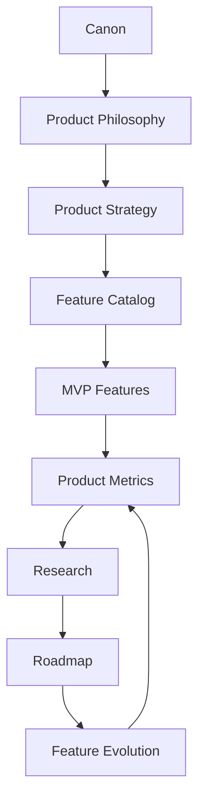
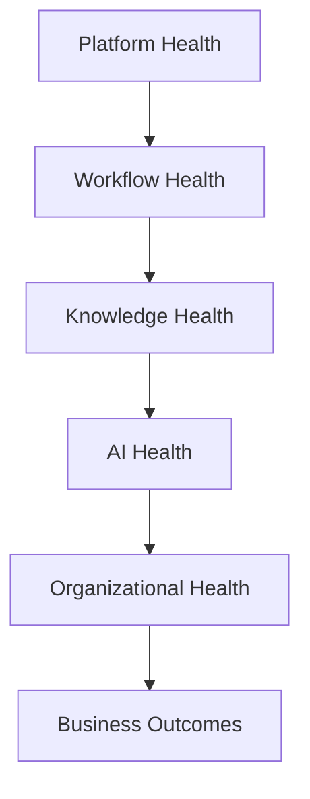
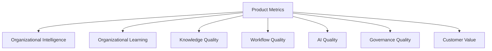
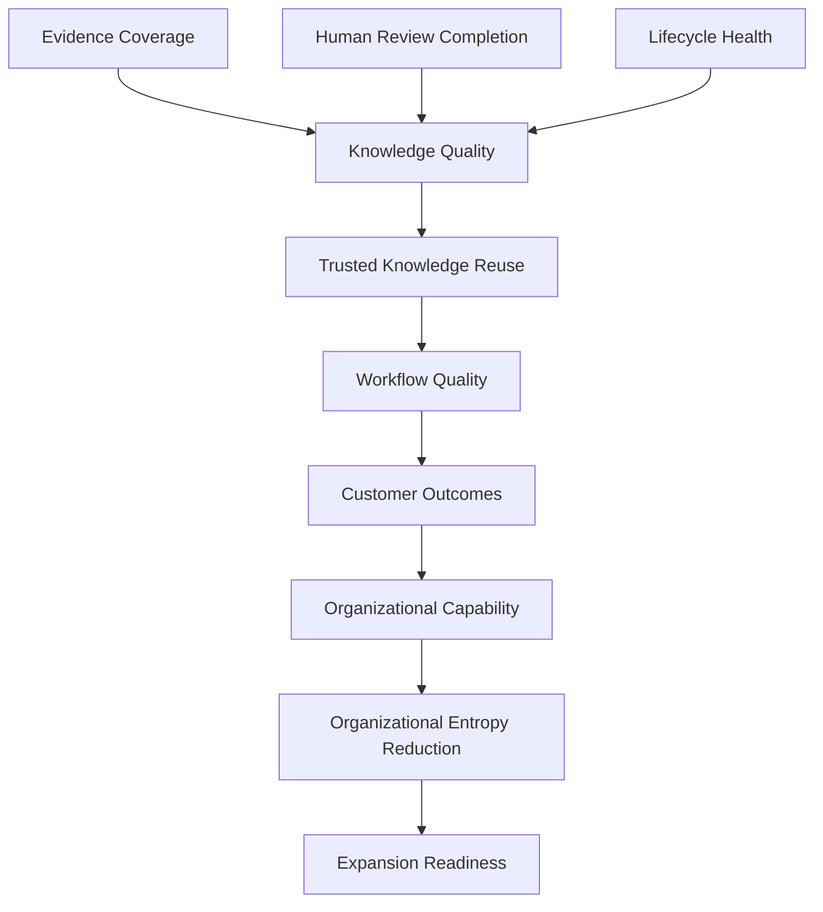
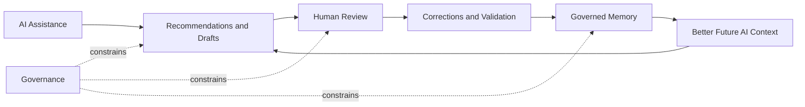
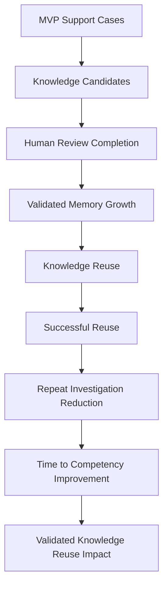

# Product Metrics

## Derived From

- Canon Version: `v1.0.0`
- Architecture Version: `v1.0.0`
- Implementation Version: `v1.0.0`
- Strategy Version: `v1.0.0`
- Research Version: `v1.0.0`
- Product Philosophy Version: `v1.0.0`
- Product Strategy Version: `v1.0.0`
- Product Requirements Version: `v1.0.0`
- Personas Version: `v1.0.0`
- User Journeys Version: `v1.0.0`
- User Stories Version: `v1.0.0`
- Workflow Design Version: `v1.0.0`
- Information Architecture Version: `v1.0.0`
- Feature Catalog Version: `v1.0.0`
- MVP Features Version: `v1.0.0`

### Primary Repository Sources

- [Canon](../canon/README.md)
- [Architecture](../architecture/README.md)
- [Implementation](../implementation/README.md)
- [Strategy](../strategy/README.md)
- [Research](../research/README.md)
- [Product Philosophy](./00_PRODUCT_PHILOSOPHY.md)
- [Product Strategy](./01_PRODUCT_STRATEGY.md)
- [Product Requirements](./02_PRODUCT_REQUIREMENTS.md)
- [Personas](./03_PERSONAS.md)
- [User Journeys](./04_USER_JOURNEYS.md)
- [User Stories](./05_USER_STORIES.md)
- [Workflow Design](./06_WORKFLOW_DESIGN.md)
- [Information Architecture](./07_INFORMATION_ARCHITECTURE.md)
- [Feature Catalog](./08_FEATURE_CATALOG.md)
- [MVP Features](./09_MVP_FEATURES.md)

---

Status: **Active**

## Primary Question

How should the Organizational Intelligence Platform measure whether organizations are becoming more capable through Organizational Memory, Human Review, Governance, and responsible AI assistance?

This document defines the enduring product measurement model of the Organizational Intelligence Platform.

It is not an analytics implementation guide, dashboard specification, KPI spreadsheet, or business intelligence report.

## 1. Executive Summary

Product Metrics for the Organizational Intelligence Platform measure organizational improvement rather than software activity.

Traditional product analytics often ask whether people are using software: logins, clicks, sessions, screen views, active users, and feature engagement. Those signals may be useful operational context, but they are insufficient for this platform.

The Organizational Intelligence Platform exists to help organizations become more capable through work. Therefore, product success must be measured by whether:

- Operational work becomes validated knowledge.
- Validated knowledge becomes durable Organizational Memory.
- Organizational Memory is reused in future work.
- Human Review improves trust and quality.
- Governance preserves accountability.
- AI assistance improves work without becoming unreviewed authority.
- Repeated investigation, knowledge loss, and Organizational Entropy decrease.
- Customer and employee outcomes improve over time.

Usage alone is not success if the organization is not becoming more capable.

A team can use an AI assistant heavily and still relearn the same lessons every week. A knowledge base can grow in volume while becoming stale and contradictory. A workflow can be completed quickly while hiding poor evidence, weak review, or unsafe automation.

Product Metrics must therefore measure the Knowledge Flywheel:

1. Work creates evidence.
2. Evidence supports knowledge candidates.
3. Humans review and validate.
4. Governed knowledge enters Organizational Memory.
5. Future work reuses memory.
6. Outcomes improve.
7. The organization learns what to improve next.

The purpose of measurement is not to prove that the product is busy. It is to determine whether the platform is creating Organizational Intelligence.

## 2. Relationship to Repository

Product Metrics translate product philosophy, strategy, features, and MVP validation into a durable measurement framework.

## Responsibility of Each Layer

| Layer | Responsibility |
| --- | --- |
| Canon | Defines what must be true: Organizational Intelligence, Organizational Memory, Governance, Human Review, and Knowledge Flywheel. |
| Product Philosophy | Defines how product judgment should prioritize learning, trust, explainability, and durable capability. |
| Product Strategy | Defines where value should be validated first and how capability expansion should proceed. |
| Feature Catalog | Defines the complete product capability universe that may need measurement. |
| MVP Features | Defines the first selected capability set and the first validation boundary. |
| Product Metrics | Defines how product success, customer value, knowledge quality, governance, AI quality, workflow quality, and capability maturity are measured. |
| Research | Investigates metric signals, customer behavior, assumptions, and unexplained outcomes. |
| Roadmap | Uses evidence from metrics and research to sequence capability maturity and expansion. |

Product Metrics sit between delivery and learning.

They convert usage, workflow, knowledge, review, governance, and outcome signals into product judgment.

## 3. Measurement Principles

## Outcomes Before Activity

Activity is not the same as value.

The platform should not consider itself successful because users clicked, searched, generated, or viewed more. Those behaviors matter only when they contribute to better knowledge, better decisions, better workflows, and better organizational outcomes.

Outcome metrics ask whether work improved, knowledge became more trustworthy, and future teams became more capable.

## Learning Before Usage

High usage may indicate value, habit, confusion, dependency, or friction.

The platform should prioritize learning signals: what users discovered, corrected, validated, reused, retired, escalated, or improved. Usage should be interpreted through the lens of organizational learning.

## Trust Before Automation

Automation without trust is not progress.

Metrics should measure whether AI assistance is reviewable, evidence-backed, accepted responsibly, corrected when needed, and governed appropriately. A lower automation rate may be healthier than a high automation rate when uncertainty, risk, or weak evidence exists.

## Quality Before Volume

More knowledge is not automatically better.

Knowledge volume can create noise, duplication, contradiction, and maintenance burden. Metrics should prioritize accuracy, evidence coverage, freshness, applicability, validation, reuse success, and lifecycle health over raw content counts.

## Reuse Before Creation

Creation matters because it enables reuse.

The platform should measure whether knowledge actually improves future work. Knowledge that is never reused, cannot be found, lacks evidence, or fails in application does not yet prove Organizational Intelligence.

## Governance Before Scale

The platform should not scale ungoverned intelligence.

Metrics should show whether ownership, permissions, lifecycle rules, review obligations, audit trails, and policy boundaries are working before expanding autonomy, domains, integrations, or organizational scope.

## Organizational Capability Before Engagement

Engagement metrics may help diagnose usability, but they are not the product's highest truth.

The product exists to increase institutional capability: faster onboarding, less repeated investigation, more consistent decisions, better knowledge quality, reduced expert dependency, and stronger memory.

## Metrics Drive Learning, Not Vanity

Metrics should guide product learning and customer improvement.

They should not become vanity numbers used to decorate reporting, pressure teams, or reward behavior that weakens trust. A good metric changes decisions. A bad metric creates performance theater.

## 4. Product Measurement Framework

Product Metrics operate across six measurement layers.

## Measurement Layers

| Layer | Measures | Why It Matters |
| --- | --- | --- |
| Platform Health | Reliability, availability, access, latency, observability, and baseline operational trust. | Users cannot build Organizational Intelligence on an unreliable platform. |
| Workflow Health | Case flow, review cycle time, completion, escalation, handoff quality, and repeated investigation. | Organizational learning depends on work moving through meaningful states. |
| Knowledge Health | Accuracy, freshness, evidence, validation, reuse, lifecycle, duplication, and ownership. | Organizational Memory is valuable only when it is trustworthy and reusable. |
| AI Health | Recommendation quality, draft quality, revision patterns, hallucination detection, override, and review outcomes. | AI must assist responsibly without becoming unaccountable authority. |
| Organizational Health | Capability growth, entropy reduction, learning velocity, expert dependency, consistency, and onboarding. | The platform's central promise is that organizations become more capable. |
| Business Outcomes | Customer resolution quality, productivity, satisfaction impact, cost-to-serve, retention support, and expansion readiness. | Organizational Intelligence must ultimately create customer and business value. |

## Layer Interpretation

No layer is sufficient alone.

Strong Platform Health without Knowledge Health produces reliable software that may not create intelligence. Strong AI Health without Governance Quality can create unsafe confidence. Strong Workflow Health without Organizational Health can make teams faster at repeating old mistakes.

The measurement framework must preserve the full stack from operational reliability to organizational capability.

## Operational Metrics vs. Organizational Intelligence Metrics

Not every number the platform can produce answers the same question, and the two should never be treated as interchangeable evidence of success.

**Operational Metrics** describe whether the platform is functioning: whether work is flowing, the system is available, cases are progressing, and people can do their jobs without friction. They answer *"Is the platform working?"* Operational Metrics correspond to Platform Health and Workflow Health in the measurement layers above: reliability, latency, case flow, cycle time, completion, and escalation.

**Organizational Intelligence Metrics** describe whether the organization is becoming more capable because of that work: whether knowledge is being captured, validated, trusted, reused, and improved. They answer *"Is the organization learning?"* Organizational Intelligence Metrics correspond to Knowledge Health and Organizational Health in the measurement layers above: validation, memory growth, trust growth, reuse impact, and entropy reduction.

Operational Metrics can look healthy while Organizational Intelligence Metrics stagnate. A team can resolve cases quickly, keep queues short, and maintain high platform uptime while no reusable knowledge is created, validated knowledge decays untouched, and the same problems are solved from scratch every time. Operational health is necessary but never sufficient.

The reverse should not be treated as acceptable either. Strong Organizational Intelligence Metrics do not excuse a platform that is unreliable, slow, or difficult to use. The two categories are complementary, not substitutable.

| Question | Operational Metrics | Organizational Intelligence Metrics |
| --- | --- | --- |
| What they answer | Is the platform working? | Is the organization learning? |
| Measurement layers | Platform Health, Workflow Health | Knowledge Health, Organizational Health |
| Example metrics | Resolution Time, Review Cycle Time, Workflow Completion, Escalation Reduction | Validation Rate, Organizational Memory Growth, Trust Growth, Organizational Entropy Reduction |
| Failure mode if used alone | Rewards fast, busy work even if nothing is learned | Cannot show whether the platform is usable enough to sustain that learning |

Every metric introduced in this document should be understood as belonging primarily to one side of this distinction, even where a single number can inform both.

## 5. Core Product Metrics

Product Metrics are organized into seven domains:

- Organizational Intelligence.
- Organizational Learning.
- Knowledge Quality.
- Workflow Quality.
- AI Quality.
- Governance Quality.
- Customer Value.

## Metric Taxonomy

## Organizational Intelligence Metrics

| Metric | Definition | Why It Matters |
| --- | --- | --- |
| Organizational Capability Growth | Improvement in the organization's ability to resolve recurring problems using validated knowledge and repeatable workflows. | Measures the core promise of the platform. |
| Organizational Entropy Reduction | Reduction in repeated questions, duplicated investigation, stale knowledge, undocumented exceptions, contradictory guidance, and avoidable expert interruption. | Measures whether the platform fights institutional forgetting. |
| Organizational Memory Growth | Growth in validated, evidence-backed, owned, versioned, and reusable knowledge. | Distinguishes durable memory from raw content accumulation. |
| Organizational Learning Velocity | Rate at which operational learning becomes validated knowledge and later successful reuse. | Measures how quickly work becomes future capability. |
| Expert Dependency Reduction | Reduction in repeated reliance on the same experts for issues that should be reusable knowledge. | Shows whether expertise is becoming institutional rather than trapped. |
| Decision Consistency | Degree to which similar cases receive aligned guidance with justified exceptions. | Indicates whether memory is improving organizational coherence. |

## Organizational Learning Metrics

Organizational Intelligence Metrics show whether the organization is becoming more capable. Organizational Learning Metrics show how that capability is produced: the mechanics by which raw work becomes a Knowledge Candidate, earns validation, matures into durable organizational understanding, and improves the platform's ongoing assistance.

| Metric | Definition | Why It Matters |
| --- | --- | --- |
| Knowledge Candidates Created | Number of Knowledge Candidates produced from any Knowledge Intake Door in a given period. | Shows whether real work is being converted into reviewable proposals rather than disappearing after use. |
| Validation Rate | Percentage of Knowledge Candidates reviewed into approved, revised, rejected, disputed, deprecated, or no-learning outcomes. | Measures whether capture becomes governed learning rather than an unreviewed backlog. |
| Candidate Approval Rate | Percentage of reviewed Knowledge Candidates approved as validated knowledge. | Distinguishes healthy capture from noisy or low-quality candidate generation. |
| Promotion Rate | Percentage of validated knowledge that advances to a higher-trust or more durable state, such as an active Knowledge Item or a recognized Canonical Problem. | Shows whether validated knowledge continues to mature rather than stalling once approved. |
| Intake by Door | Distribution of Knowledge Candidates by originating Knowledge Intake Door, such as manual entry, historical import, or live workflow capture. | Reveals which intake paths are producing usable knowledge and where intake capability should expand. |
| Canonical Problems Created | Number of Canonical Problems established or meaningfully updated from validated knowledge in a given period. | Shows whether individual pieces of knowledge are organizing into durable, reusable organizational concepts. |
| Pattern Promotions | Number of Emerging Patterns that advance into a Canonical Problem or validated knowledge after review. | Measures whether recurring signals are recognized and converted into trusted understanding rather than staying anecdotal. |
| Trust Growth | Change in trust associated with validated knowledge over time, based on continued validation, successful reuse, and outcomes. | Shows whether confidence in organizational knowledge is strengthening or eroding through use. |
| Organizational Memory Growth | Growth in validated, evidence-backed, owned, versioned, and reusable knowledge held in Organizational Memory. | Distinguishes durable memory from raw content accumulation. |
| AI Advisory Agreement Rate | Percentage of AI Advisory suggestions that a human reviewer accepts without material correction during Validation or Human Review. | Measures whether AI assistance is calibrated and useful without becoming an unreviewed authority. |

Several of these metrics also appear within Organizational Intelligence Metrics or Knowledge Quality Metrics. That overlap is intentional: Organizational Learning Metrics view the same underlying signals through the lens of the intake-to-memory pipeline, while the other domains view them through the lens of organizational capability and knowledge state.

## Knowledge Quality Metrics

| Metric | Definition | Why It Matters |
| --- | --- | --- |
| Knowledge Accuracy | Degree to which validated knowledge is correct for its stated scope and context. | Incorrect memory compounds harm. |
| Freshness | Degree to which knowledge remains current relative to policy, product, process, and evidence changes. | Stale knowledge silently increases entropy. |
| Reuse Rate | Percentage of eligible workflows or cases that use validated knowledge. | Measures whether memory is discoverable and useful. |
| Successful Reuse Rate | Percentage of reuse events that lead to appropriate, accepted, or uncorrected outcomes. | Measures whether reuse creates value rather than merely activity. |
| Validation Rate | Percentage of Knowledge Candidates reviewed into approved, revised, rejected, disputed, deprecated, or no-learning outcomes. | Measures whether capture becomes governed learning. |
| Evidence Coverage | Percentage of knowledge items with sufficient source evidence, context, applicability, and rationale. | Supports explainability and review quality. |
| Review Completion | Percentage of required reviews completed with clear decision and rationale. | Shows whether Human Review is operationally sustainable. |
| Duplicate Knowledge Reduction | Reduction in overlapping or conflicting knowledge items that address the same issue without clear relationship. | Improves memory clarity and lowers maintenance cost. |
| Ownership Coverage | Percentage of active knowledge with accountable owners or stewards. | Prevents knowledge decay. |
| Lifecycle Health | Distribution and movement of knowledge across candidate, active, challenged, deprecated, retired, and archived states. | Shows whether memory is alive and governed. |

## Workflow Quality Metrics

| Metric | Definition | Why It Matters |
| --- | --- | --- |
| Resolution Time | Time required to resolve comparable in-scope customer issues. | Indicates whether knowledge and workflow improve execution. |
| Review Cycle Time | Time from review request to review outcome. | Measures whether Human Review protects trust without creating unsustainable delay. |
| Workflow Completion | Percentage of workflows that reach a clear terminal state such as resolved, escalated, deferred, rejected, or no-learning. | Prevents hidden work and incomplete learning loops. |
| Escalation Reduction | Reduction in avoidable escalations for recurring issues with validated knowledge. | Shows whether memory reduces unnecessary expert dependency. |
| Repeat Investigation Reduction | Reduction in repeated diagnostic steps for similar issues. | Directly measures entropy reduction. |
| Handoff Quality | Degree to which context, evidence, and responsibility survive transitions between personas. | Prevents knowledge loss during workflow movement. |
| Reopen Rate | Frequency with which resolved cases reopen due to incorrect, incomplete, or poorly applied knowledge. | Detects weak resolution quality. |
| Learning Loop Completion | Percentage of eligible resolved cases that receive reflection and learning determination. | Ensures outcomes feed future capability. |

## AI Quality Metrics

| Metric | Definition | Why It Matters |
| --- | --- | --- |
| Recommendation Acceptance | Percentage of AI recommendations accepted by humans after review. | Indicates usefulness, but must be interpreted with quality and outcome. |
| Recommendation Revision Rate | Percentage of recommendations materially revised before use. | Reveals where AI is helpful but incomplete. |
| AI Assistance Usage | Frequency with which users invoke or receive AI assistance in supported workflows. | Useful context, but not success by itself. |
| Draft Acceptance | Percentage of AI-generated drafts approved with minor or no changes. | Measures drafting usefulness when paired with review quality. |
| Hallucination Detection Rate | Frequency of unsupported, fabricated, or materially false AI outputs detected during review. | Measures safety and evidence discipline. |
| Human Override Rate | Frequency with which humans reject, override, or escalate AI suggestions. | Measures human authority and exposes model or context gaps. |
| Evidence Alignment | Degree to which AI recommendations cite and align with relevant evidence and validated knowledge. | Protects explainability and trust. |
| Uncertainty Calibration | Degree to which AI confidence, uncertainty, and escalation recommendations align with human review and outcomes. | Prevents unsafe overconfidence. |
| Correction Learning Rate | Degree to which repeated AI mistakes decline after review feedback and memory improvement. | Measures whether the system learns from human correction. |

## Governance Quality Metrics

| Metric | Definition | Why It Matters |
| --- | --- | --- |
| Audit Completeness | Percentage of material actions, approvals, changes, and reuse events with sufficient audit trail. | Enables accountability and enterprise trust. |
| Policy Compliance | Degree to which workflows, AI assistance, access, and knowledge changes follow defined policies. | Ensures governance is operational rather than decorative. |
| Lifecycle Compliance | Percentage of knowledge items in appropriate lifecycle states with required review and ownership. | Prevents stale or unapproved knowledge from becoming trusted. |
| Ownership Coverage | Percentage of governed assets with responsible owners. | Supports maintenance and accountability. |
| Permission Accuracy | Degree to which users have appropriate access for their role and no inappropriate access. | Protects sensitive knowledge and customer trust. |
| Review Boundary Compliance | Percentage of governed decisions and knowledge changes receiving required Human Review. | Ensures trust boundaries are not bypassed. |
| Exception Resolution | Time and completeness of resolving governance exceptions, policy conflicts, or access issues. | Measures governance responsiveness. |

## Customer Value Metrics

| Metric | Definition | Why It Matters |
| --- | --- | --- |
| Time to Competency | Time required for new support agents to handle in-scope recurring issues competently using Organizational Memory. | Measures whether memory reduces onboarding burden. |
| Customer Resolution Quality | Accuracy, completeness, relevance, consistency, and clarity of customer issue resolution. | Connects Organizational Intelligence to customer outcomes. |
| Knowledge Reuse Success | Degree to which reused knowledge improves resolution quality, speed, or consistency. | Measures the business value of memory. |
| Team Productivity | Improvement in support throughput or capacity without sacrificing quality, trust, or review. | Shows operational value. |
| Customer Satisfaction Impact | Change in customer satisfaction or sentiment for in-scope issues where knowledge reuse and workflow improvement apply. | Measures customer-facing value. |
| Expert Interruption Reduction | Reduction in repeated interruptions to senior experts for known issues. | Measures reclaimed expert capacity. |
| Expansion Readiness | Evidence that the customer wants to expand to more issue types, teams, languages, or departments. | Indicates strategic value beyond initial adoption. |

## 6. North Star Metric

The North Star Metric should represent the product's central value: organizations becoming more capable through validated, governed, reusable knowledge.

It should not be DAU, MAU, search volume, messages generated, or AI usage.

## Candidate Evaluation

| Candidate Metric | Strengths | Limitations | Assessment |
| --- | --- | --- | --- |
| Organizational Capability Improvement | Best reflects the category ambition. | Too broad unless decomposed into measurable components. | Strong strategic metric, but difficult as a single operating metric. |
| Validated Knowledge Reuse Impact | Connects validation, memory, reuse, and customer outcome. | Requires disciplined definition of eligible reuse and impact. | Best North Star candidate. |
| Organizational Entropy Reduction | Captures the core enemy: repeated learning loss. | Can become abstract unless tied to concrete signals. | Excellent supporting metric. |
| Successful Knowledge Reuse Rate | Clear and measurable. | May underrepresent capability growth, onboarding, and knowledge creation. | Strong operational component. |
| Learning Loop Completion Rate | Measures whether the Knowledge Flywheel operates. | Completion alone does not prove value. | Useful leading metric, not sufficient as North Star. |
| AI Recommendation Acceptance | Easy to observe. | Can reward overtrust and does not prove organizational learning. | Not suitable as North Star. |

## Recommended North Star Metric

**Validated Knowledge Reuse Impact**

Validated Knowledge Reuse Impact measures the share and effect of eligible work that successfully reuses validated Organizational Memory to improve outcomes.

It combines four ideas:

1. The knowledge was validated.
2. The knowledge was reused in future work.
3. The reuse was appropriate to the context.
4. The reuse improved a meaningful outcome such as resolution quality, speed, consistency, reduced escalation, or reduced repeated investigation.

## Why This Metric

Validated Knowledge Reuse Impact is recommended because it directly expresses the platform thesis:

- Knowledge must be validated.
- Memory must be reusable.
- Reuse must improve work.
- Improved work must increase organizational capability.

It avoids common traps:

- It does not reward raw content creation.
- It does not reward unreviewed AI output.
- It does not reward generic engagement.
- It does not reward retrieval unless retrieval helps work.
- It does not treat automation as inherently good.

## North Star Support Metrics

| Supporting Metric | Why It Supports the North Star |
| --- | --- |
| Knowledge Accuracy | Reuse impact depends on correct knowledge. |
| Evidence Coverage | Reuse must be explainable. |
| Review Completion | Knowledge must become trusted through Human Review. |
| Successful Reuse Rate | Reuse must improve work. |
| Repeat Investigation Reduction | Reuse should reduce duplicated effort. |
| Resolution Quality | Reuse should improve customer outcomes. |
| Organizational Entropy Reduction | Reuse should reduce institutional forgetting. |

## 7. Metric Relationships

Product Metrics are causal, not isolated.

Knowledge quality enables reuse. Reuse improves workflow quality. Workflow quality improves customer outcomes. Customer outcomes and learning signals improve organizational capability.

## AI and Governance Causal Relationship

## Leading and Lagging Signals

| Relationship | Leading Indicator | Lagging Indicator |
| --- | --- | --- |
| Evidence improves knowledge | Evidence coverage | Knowledge accuracy and reviewer trust |
| Review improves memory | Review completion | Validated memory growth |
| Memory enables reuse | Trusted retrieval | Successful reuse impact |
| Reuse improves workflow | Knowledge reuse rate | Resolution time and repeat investigation reduction |
| Workflow improves outcomes | Completion and escalation quality | Customer resolution quality and satisfaction impact |
| Governance enables scale | Audit completeness and permission accuracy | Enterprise expansion readiness |

Leading indicators help teams act early. Lagging indicators show whether the action mattered.

## 8. Leading vs Lagging Metrics

Product Metrics should balance leading and lagging indicators.

Leading metrics reveal whether the platform is doing the right work now. Lagging metrics reveal whether that work created durable value.

## Leading / Lagging Matrix

| Metric Domain | Leading Metrics | Lagging Metrics |
| --- | --- | --- |
| Knowledge | Knowledge Capture, Evidence Coverage, Review Completion, Validation Rate | Knowledge Accuracy, Successful Reuse Rate, Duplicate Knowledge Reduction, Freshness |
| Workflow | Workflow Completion, Review Cycle Time, Handoff Quality, Learning Loop Completion | Faster Resolution, Escalation Reduction, Repeat Investigation Reduction, Reopen Rate |
| AI | Draft Quality, Recommendation Revision Rate, Evidence Alignment, Human Override Rate | Increased Trust, Fewer Repeated AI Errors, Better Recommendation Acceptance, Lower Hallucination Detection |
| Governance | Ownership Coverage, Audit Completeness, Permission Accuracy, Lifecycle Compliance | Fewer Governance Exceptions, Safer Expansion, Higher Enterprise Trust |
| Organizational Capability | Learning Velocity, Memory Growth, Gap Detection | Entropy Reduction, Better Onboarding, Lower Expert Dependency, Improved Decision Consistency |
| Customer Value | In-scope Reuse, Resolution Quality Review, Support Team Feedback | Customer Satisfaction Impact, Productivity Improvement, Expansion Readiness |

## Why Balance Matters

Leading metrics without lagging metrics can reward process completion without value.

Lagging metrics without leading metrics can reveal failure too late.

For example, review completion is important, but if reviewed knowledge is never reused, it does not validate Organizational Intelligence. Customer satisfaction is important, but if it improves for unrelated reasons, it may not validate the platform.

The product should use both types together:

- Leading metrics guide near-term improvement.
- Lagging metrics validate durable impact.
- Contradictions between them reveal product learning opportunities.

## 9. Capability Maturity Metrics

Capabilities mature over time.

The Product Metrics framework should measure whether each capability becomes adopted, trusted, reused, stable, and ready for expansion.

## Capability Maturity Model

## Maturity Dimensions

| Dimension | Measurement Question | Example Signals |
| --- | --- | --- |
| Adoption | Are the intended personas using the capability in real workflows? | Eligible workflow participation, role coverage, repeated use. |
| Trust | Do users rely on the capability responsibly after review and evidence inspection? | Acceptance after review, lower override due to poor quality, positive reviewer rationale. |
| Reuse | Does the capability improve future work beyond the initial event? | Successful knowledge reuse, repeated issue resolution, lower duplicate investigation. |
| Stability | Does the capability operate consistently without excessive friction or exception handling? | Completion rate, cycle time, fewer reopened issues, stable quality. |
| Expansion Readiness | Is there evidence that the capability can extend to more cases, teams, or domains without weakening governance? | Strong metrics, low unresolved risk, customer demand, governance compliance. |

## Capability Maturity Matrix

| Capability | Adoption | Trust | Reuse | Stability | Expansion Readiness |
| --- | --- | --- | --- | --- | --- |
| Operational Knowledge Capture | Agents contribute candidates from real work. | Candidates preserve evidence and context. | Captured lessons become future memory. | Capture does not disrupt support flow. | More issue families can be added. |
| Human Review Workflow | Reviewers regularly process candidates. | Reviews include rationale and evidence. | Review outcomes improve future quality. | Review backlog remains manageable. | Additional reviewers or domains can participate. |
| Validated Memory Repository | Users consult memory during work. | Memory shows evidence, status, and ownership. | Memory improves future cases. | Lifecycle remains current. | More knowledge domains can be added. |
| Trusted Knowledge Retrieval | Agents retrieve relevant items in context. | Users understand applicability and trust signals. | Retrieved knowledge improves outcomes. | Retrieval quality remains consistent. | Additional sources and workflows can be connected. |
| AI Recommendation Assistance | Users receive recommendations in supported workflows. | Recommendations are reviewed and appropriately accepted. | Recommendations improve reuse and reduce effort. | Revision and hallucination rates are controlled. | AI can assist more journeys safely. |
| Governance | Roles and policies are applied in daily work. | Users understand and accept governance boundaries. | Governance improves trust and reduces risk. | Exceptions are rare and resolved. | More teams can be governed without redesign. |

Capability maturity should be earned through evidence rather than assumed because a feature exists.

## 10. MVP Success Metrics

During the MVP, metrics should focus on validating the smallest complete Organizational Intelligence system.

The MVP should not measure everything equally. It should prioritize the metrics that prove or disprove the core hypothesis.

## MVP Metric Priorities

| MVP Metric | Why It Matters First |
| --- | --- |
| Knowledge Reuse | The MVP must show that validated memory is used in future support work. |
| Successful Knowledge Reuse | Reuse must improve outcomes, not merely appear in workflow records. |
| Human Review Completion | The MVP must prove review is sustainable and creates trust. |
| AI Trust | The MVP must show that AI assistance is useful, reviewable, and appropriately bounded. |
| Organizational Memory Growth | The MVP must show that operational work becomes durable, validated knowledge. |
| Repeat Investigation Reduction | The MVP must show that the organization stops re-solving the same problems. |
| Time to Competency | The MVP should show that memory helps newer agents become capable faster. |
| Evidence Coverage | The MVP must preserve explainability and reviewer confidence. |
| Knowledge Candidate Conversion | The MVP must show that capture becomes meaningful learning rather than noise. |
| Governance Compliance | The MVP must prove that trust boundaries remain intact. |

## MVP Measurement Model

## MVP Interpretation Rules

- If knowledge is created but not reused, the MVP has not proven the Knowledge Flywheel.
- If AI is used but heavily corrected without improvement, AI assistance needs refinement.
- If review is skipped to increase speed, the MVP has violated the trust model.
- If governance blocks ordinary work, governance needs simplification, not removal.
- If support outcomes improve only through manual heroics, the platform has not yet created durable Organizational Intelligence.

## 11. Metric Governance

Metrics require governance because they shape behavior.

Poorly governed metrics can create incentives that damage trust, learning, and customer outcomes.

## Metric Governance Rules

| Governance Area | Rule |
| --- | --- |
| Metric Ownership | Every major metric should have an accountable owner who understands its definition, purpose, and misuse risks. |
| Review Cadence | Metrics should be reviewed regularly in product, research, customer success, and leadership forums. |
| Metric Evolution | Metrics may evolve as capabilities mature, but changes should preserve historical interpretation where possible. |
| Metric Retirement | Metrics should be retired when they no longer inform decisions or create harmful incentives. |
| Metric Validation | Metrics should be validated against qualitative research, customer interviews, workflow observation, and outcome evidence. |
| Misuse Prevention | Metrics should not be used to punish users for appropriate review, escalation, uncertainty, or refusal. |
| Definition Clarity | Each metric should have a stable definition, scope, and interpretation rule before being used for major decisions. |
| Context Preservation | Metrics should be segmented by workflow, issue type, team, language, maturity, and customer context where relevant. |

## Metrics Should Support Learning

Metrics should help teams ask better questions:

- Why is reuse low?
- Why are reviewers revising AI drafts?
- Why is a knowledge item frequently retrieved but rarely applied?
- Why are similar cases still escalating?
- Why is knowledge growing faster than review capacity?
- Why do users bypass available memory?

Metrics should not be used to punish responsible behavior.

Escalation may be good when uncertainty is high. Human override may be good when AI is wrong. Lower automation may be good when evidence is weak. Fewer knowledge items may be good when quality improves.

## 12. Repository Integration

Product Metrics influence multiple repository areas.

## Influence Matrix

| Repository Area | Product Metrics Influence |
| --- | --- |
| Research | Metrics reveal assumptions, contradictions, unexplained patterns, and qualitative research priorities. |
| Experiments | Metrics define hypotheses, success conditions, and interpretation boundaries for product experiments. |
| Roadmap | Metrics indicate which capabilities are ready for expansion and which need refinement. |
| Feature Evolution | Metrics show which Feature Catalog capabilities are adopted, trusted, reused, stable, or immature. |
| Capability Maturity | Metrics provide evidence for moving capabilities from available to expansion-ready. |
| Product Strategy | Metrics validate or challenge beachhead, expansion, and positioning assumptions. |
| Customer Success | Metrics help customers understand whether Organizational Intelligence is improving their teams. |
| Implementation | Metrics inform instrumentation needs without defining implementation details. |
| Governance | Metrics reveal policy compliance, lifecycle health, review boundaries, and audit completeness. |

## Repository Rule

Every future Product, Roadmap, Research, or Experiment document should identify:

- Which Product Metrics it expects to influence.
- Which leading indicators will be observed.
- Which lagging outcomes will validate success.
- Which metric misuse risks must be avoided.
- Which Canon concepts the metrics support.

Metrics are part of the product's learning system, not a reporting afterthought.

## 13. Traceability Matrix

| Metric | Capability | Journey | Workflow | Business Outcome |
| --- | --- | --- | --- | --- |
| Validated Knowledge Reuse Impact | Validated Memory Repository, Trusted Knowledge Retrieval | Resolve Customer Issue, Discover Knowledge | Customer Issue Resolution | Higher customer resolution quality and reduced repeated work. |
| Organizational Entropy Reduction | Gap Capture, Pattern Detection, Organizational Analytics | Monitor Organizational Learning | Organizational Learning | Lower duplicated investigation and reduced institutional forgetting. |
| Organizational Memory Growth | Knowledge Candidate Creation, Human Review, Lifecycle Management | Create Knowledge, Validate Knowledge | Knowledge Creation, Knowledge Review | Durable growth of trusted institutional knowledge. |
| Knowledge Accuracy | Evidence Preservation, Review Workflow | Validate Knowledge | Knowledge Review | More reliable guidance and fewer customer-impacting errors. |
| Evidence Coverage | Evidence Management | Validate Knowledge, Resolve Customer Issue | Customer Issue Resolution | Greater explainability and reviewer confidence. |
| Review Completion | Human Review Workflow | Review Knowledge | Knowledge Review | Sustainable trust and governed learning. |
| Resolution Time | Trusted Retrieval, Similar Case Discovery | Resolve Customer Issue | Customer Issue Resolution | Faster support resolution without quality loss. |
| Repeat Investigation Reduction | Similar Case Discovery, Reuse History | Resolve Customer Issue | Customer Issue Resolution | Less duplicated work and better team productivity. |
| Recommendation Acceptance | Recommendation Assistance | Resolve Customer Issue, Discover Knowledge | Customer Issue Resolution | Useful AI assistance under human authority. |
| Hallucination Detection Rate | AI Assistance, Evidence Alignment | Review Knowledge, Resolve Customer Issue | Knowledge Review | Safer AI behavior and better trust calibration. |
| Audit Completeness | Auditability | All Governed Journeys | Governance Checkpoints | Enterprise accountability and risk reduction. |
| Permission Accuracy | Permission Governance | All Governed Journeys | Governance Checkpoints | Secure access and customer trust. |
| Time to Competency | Organizational Memory, Trusted Retrieval | Discover Knowledge, Resolve Customer Issue | Onboarding and Support Resolution | Faster agent enablement and lower expert dependency. |
| Expansion Readiness | Capability Maturity | Monitor Organizational Learning | Organizational Learning | Evidence-based roadmap and account expansion. |

## Canon Traceability

| Canon Concept | Metric Expression |
| --- | --- |
| Organizational Intelligence | Organizational Capability Growth, Validated Knowledge Reuse Impact. |
| Knowledge Flywheel | Learning Loop Completion, Knowledge Candidate Conversion, Successful Reuse Rate. |
| Organizational Memory | Memory Growth, Freshness, Lifecycle Health, Reuse History. |
| Human Review | Review Completion, Review Cycle Time, Review Boundary Compliance. |
| Governance | Audit Completeness, Policy Compliance, Permission Accuracy, Ownership Coverage. |
| AI as Amplifier, Not Authority | Recommendation Acceptance, Human Override Rate, Evidence Alignment, Hallucination Detection. |
| Organizational Entropy | Duplicate Knowledge Reduction, Repeat Investigation Reduction, Expert Dependency Reduction. |
| Explainability | Evidence Coverage, Review Rationale Completion, Traceability Completeness. |

## 14. Anti-Patterns

Metrics can distort behavior when they measure what is easy rather than what matters.

## Metrics to Avoid as Primary Success Measures

| Anti-Pattern | Why It Misleads |
| --- | --- |
| Feature Count | More features do not prove customer value or organizational capability. |
| Screen Views | Viewing more screens may indicate confusion, friction, or fragmented workflows. |
| Clicks | Click volume measures interaction, not learning or outcome quality. |
| Raw AI Usage | High AI usage may reflect novelty, dependency, or poor workflow design rather than value. |
| Knowledge Volume Without Quality | More documents or items can increase noise, duplication, and maintenance burden. |
| AI Acceptance Without Validation | Acceptance can reflect overtrust; it must be paired with evidence, review, and outcomes. |
| Documentation Quantity | More documentation does not equal better Organizational Memory. |
| Search Volume Alone | More search may indicate poor findability or missing knowledge. |
| Deflection Rate Alone | Deflecting cases can hide poor customer outcomes or unsafe automation. |
| Review Reduction Alone | Fewer reviews can indicate efficiency, but also bypassed trust boundaries. |
| Speed Alone | Faster workflows can be worse if quality, explainability, or governance decline. |
| Active Users Alone | Activity does not prove that the organization is becoming more capable. |

## Anti-Pattern Principle

The platform should never optimize for a metric that can improve while Organizational Intelligence gets worse.

Good metrics should be hard to game without creating real value.

## 15. Limitations

Product Metrics intentionally avoid:

- BI implementation.
- Dashboard layouts.
- SQL definitions.
- Telemetry implementation.
- Vendor-specific analytics.
- Engineering instrumentation.
- Event schema design.
- Data warehouse modeling.
- Report templates.
- Customer-facing dashboard copy.
- Compensation design.
- Performance management policy.

Those belong in implementation, analytics, customer success, operations, or management artifacts.

This document defines what should be measured and why. It does not define how the measurement system is technically built.

## 16. Closing

Product Metrics are not intended to measure software popularity.

They exist to measure whether organizations continuously become more capable.

Traditional enterprise software measures activity.

The Organizational Intelligence Platform measures learning.

Every metric should therefore answer one fundamental question:

**Did today's work leave the organization more capable than yesterday?**

If the answer is consistently yes, then Organizational Intelligence is being created.

If the answer is no, no amount of engagement, feature usage, AI generation, or content volume should be considered success.

The measurement model should protect the platform's identity. It should keep the product focused on Organizational Memory, Human Review, Governance, responsible AI assistance, and the Knowledge Flywheel.

The best metrics will not merely describe the product. They will discipline it.

They will help the company learn what to build, help customers understand what is improving, and help the platform remain faithful to its purpose as it evolves.
