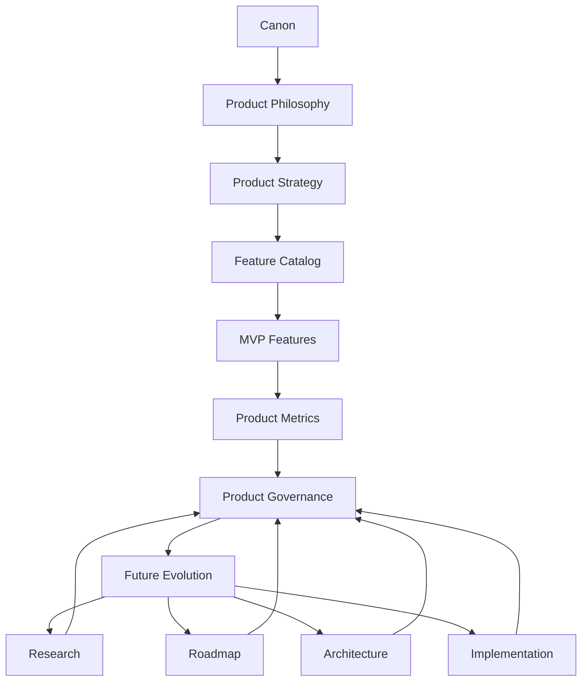
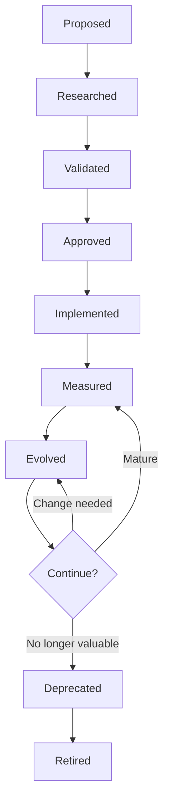
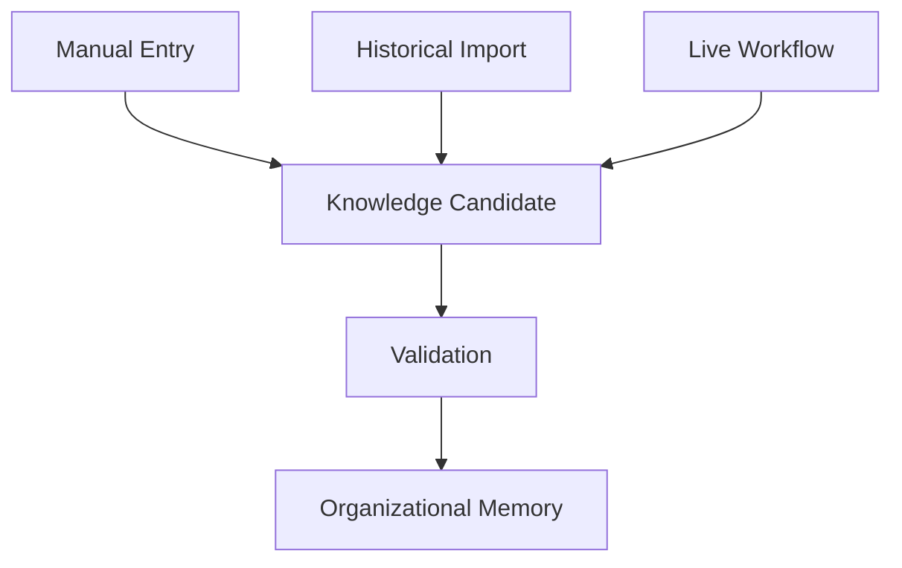
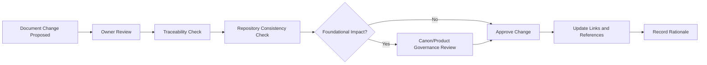
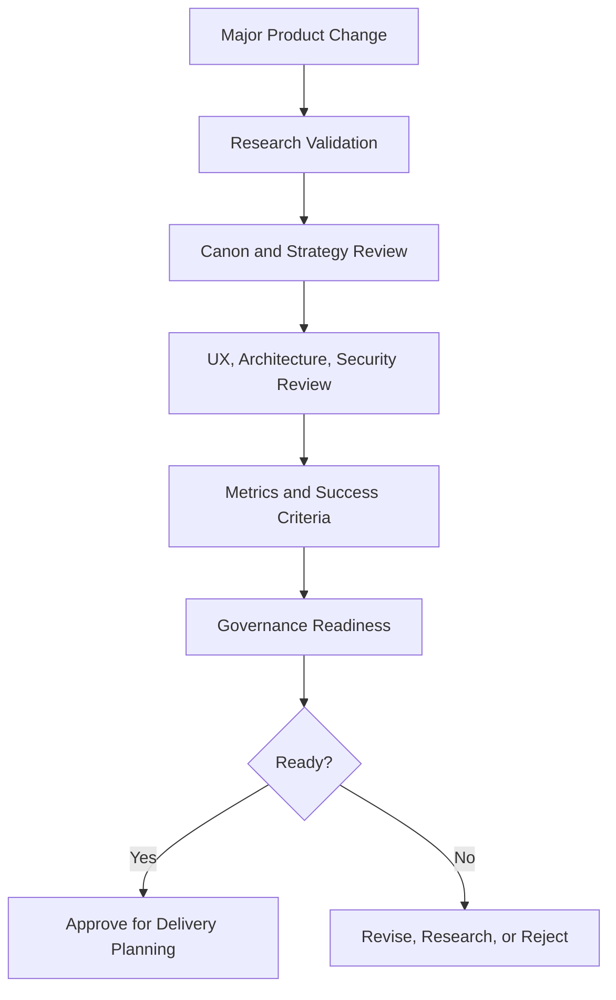
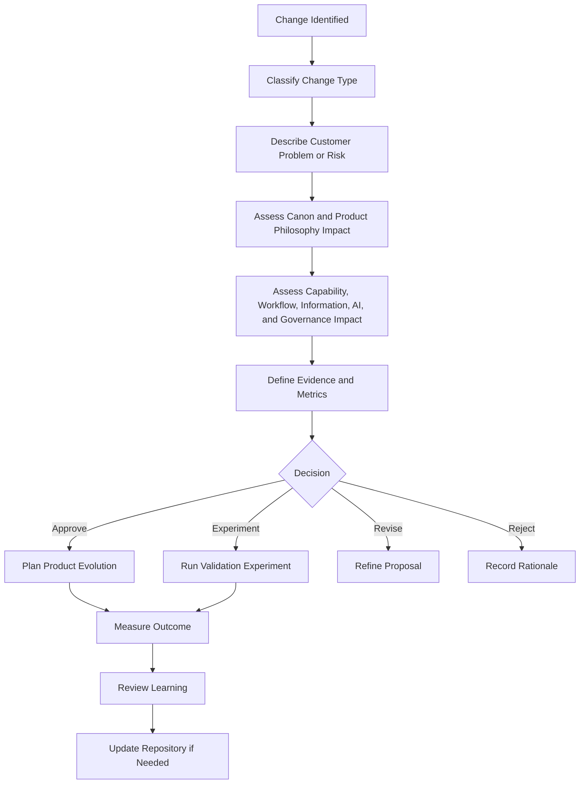
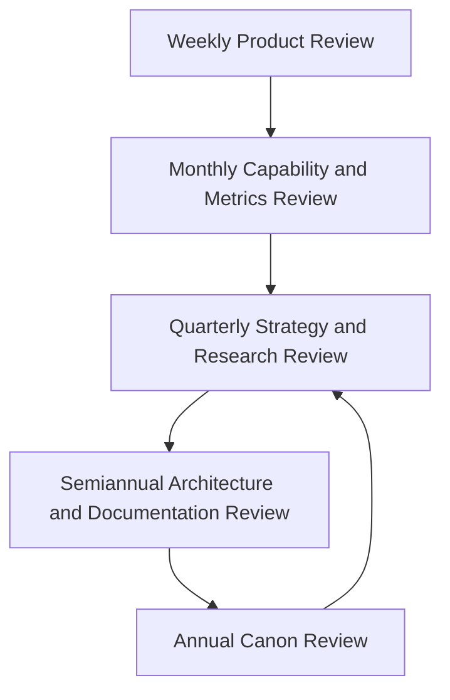
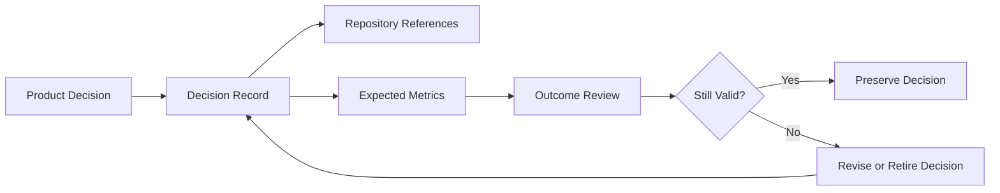
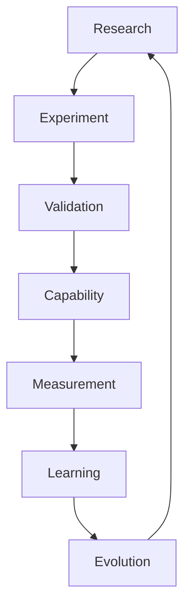
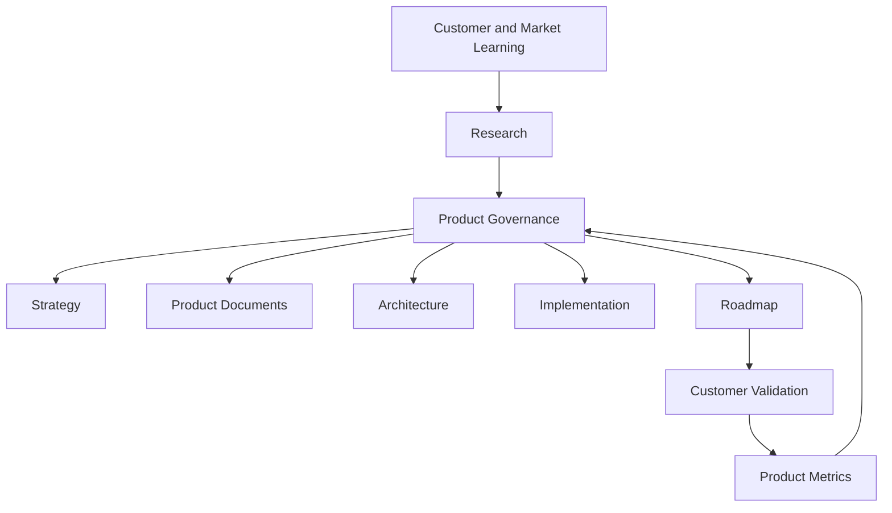

# Product Governance

## Derived From

- Canon Version: `v1.0.0`
- Architecture Version: `v1.0.0`
- Implementation Version: `v1.0.0`
- Strategy Version: `v1.0.0`
- Research Version: `v1.0.0`
- Product Philosophy Version: `v1.0.0`
- Product Strategy Version: `v1.0.0`
- Product Requirements Version: `v1.0.0`
- Personas Version: `v1.0.0`
- User Journeys Version: `v1.0.0`
- User Stories Version: `v1.0.0`
- Workflow Design Version: `v1.0.0`
- Information Architecture Version: `v1.0.0`
- Feature Catalog Version: `v1.0.0`
- MVP Features Version: `v1.0.0`
- Product Metrics Version: `v1.0.0`

### Primary Repository Sources

- [Canon](../canon/README.md)
- [Architecture](../architecture/README.md)
- [Implementation](../implementation/README.md)
- [Strategy](../strategy/README.md)
- [Research](../research/README.md)
- [Product Philosophy](./00_PRODUCT_PHILOSOPHY.md)
- [Product Strategy](./01_PRODUCT_STRATEGY.md)
- [Product Requirements](./02_PRODUCT_REQUIREMENTS.md)
- [Personas](./03_PERSONAS.md)
- [User Journeys](./04_USER_JOURNEYS.md)
- [User Stories](./05_USER_STORIES.md)
- [Workflow Design](./06_WORKFLOW_DESIGN.md)
- [Information Architecture](./07_INFORMATION_ARCHITECTURE.md)
- [Feature Catalog](./08_FEATURE_CATALOG.md)
- [MVP Features](./09_MVP_FEATURES.md)
- [Product Metrics](./10_PRODUCT_METRICS.md)

---

Status: **Active**

## Primary Question

How should the Organizational Intelligence Platform evolve over time while remaining faithful to its product philosophy, customer value, and Organizational Intelligence principles?

This document defines how the Organizational Intelligence Platform is governed as a product.

It is not corporate governance, engineering governance, security governance, compliance governance, or project management.

It defines how product decisions are proposed, evaluated, approved, evolved, and retired while preserving the long-term integrity of the Organizational Intelligence Platform.

## 1. Executive Summary

Product Governance protects the long-term integrity of the Organizational Intelligence Platform.

The platform is not simply a collection of features. It is a product expression of a larger thesis: organizations should become more capable through the work they already perform. That thesis depends on Organizational Memory, Human Review, Governance, responsible AI assistance, evidence, traceability, and the Knowledge Flywheel.

Without Product Governance, short-term pressure can gradually weaken the platform:

- Customer requests can become disconnected features.
- AI capabilities can expand faster than trust boundaries.
- Documentation can drift away from product reality.
- Metrics can reward activity instead of learning.
- Capabilities can duplicate one another.
- Roadmap decisions can lose connection to the Canon.
- The product can become useful in fragments while losing its identity as an Organizational Intelligence Platform.

Product Governance exists to prevent that drift.

It ensures that product evolution remains aligned with the Canon and Product Philosophy rather than being driven only by urgency, novelty, sales pressure, competitor imitation, or internal preference.

Good governance does not slow innovation. It makes innovation compound. It ensures that every meaningful product change strengthens customer value, Organizational Intelligence, trust, and long-term platform coherence.

## 2. Relationship to Repository

Product Governance safeguards the repository as a living system of product intent.

## Governance Role by Repository Layer

| Repository Layer | Governance Safeguard |
| --- | --- |
| Canon | Protects the enduring source of truth from casual contradiction or uncontrolled reinterpretation. |
| Product Philosophy | Ensures product judgment continues to prioritize learning, memory, evidence, review, and trust. |
| Product Strategy | Ensures expansion follows evidence, beachhead learning, and category discipline. |
| Product Requirements | Ensures features map to enduring capabilities rather than temporary implementation preferences. |
| Personas | Ensures product decisions serve accountable roles and real enterprise responsibilities. |
| User Journeys | Ensures capabilities support meaningful work, not isolated interactions. |
| User Stories | Ensures persona needs remain traceable to journeys, requirements, and Organizational Intelligence. |
| Workflow Design | Ensures changes preserve state, handoff, review, governance, and learning loops. |
| Information Architecture | Ensures product changes preserve conceptual clarity, metadata, evidence, and memory structure. |
| Feature Catalog | Ensures capabilities are proposed, approved, evolved, deprecated, and retired intentionally. |
| MVP Features | Ensures the initial product remains narrow but complete enough to validate the core hypothesis. |
| Product Metrics | Ensures success is measured by organizational capability rather than vanity activity. |
| Architecture | Ensures product evolution remains feasible, coherent, secure, explainable, and governable. |
| Implementation | Ensures delivery choices serve product meaning without redefining the product's identity. |
| Research | Ensures evidence informs product decisions and unresolved assumptions remain visible. |
| Roadmap | Ensures sequencing follows capability maturity, customer value, and strategic alignment. |

Governance is the mechanism that keeps these layers aligned over time.

## 3. Product Governance Principles

## Canon Before Convenience

Product decisions must remain faithful to the Canon even when a shortcut appears commercially or operationally attractive.

Convenience may influence sequencing, interface choices, or delivery scope. It may not override core concepts such as Organizational Memory, Human Review, Governance, explainability, evidence, or AI as amplifier rather than authority.

## Customer Value Before Feature Count

The product should not grow by accumulating features.

Every significant capability should solve a real customer problem and strengthen organizational capability. Feature count is not evidence of progress. Customer value, validated learning, and durable capability are evidence of progress.

## Evidence Before Opinion

Product decisions should be grounded in research, customer validation, product metrics, workflow observation, or explicit strategic reasoning.

Strong opinions may create hypotheses, but evidence should govern commitment. When evidence is weak, decisions should be framed as experiments rather than permanent product direction.

## Product Integrity Before Short-Term Requests

Customer requests matter, but they should be interpreted through product strategy and platform identity.

A request may reveal a real problem while the requested solution would weaken the platform. Product Governance requires teams to honor the problem, evaluate the solution, and choose the response that strengthens long-term product integrity.

## Human Review Before Uncontrolled Automation

Automation should not outrun trust.

Any product change that increases AI autonomy, reduces review, or changes authority boundaries must be evaluated against evidence quality, risk, governance, explainability, and customer impact. Human Review remains a product principle, not a temporary MVP constraint.

## Governance Enables Innovation

Governance should not exist to block change.

It exists to make change safe, coherent, and compounding. Clear decision rules allow teams to innovate faster because they know which boundaries matter and how evidence will be evaluated.

## Every Capability Requires Traceability

Every meaningful capability should trace to:

- A customer problem.
- A product requirement.
- A Feature Catalog capability.
- A persona and journey.
- A workflow or information model responsibility.
- A metric or validation goal.
- A Canon concept.

Traceability prevents product drift and makes tradeoffs explicit.

## Simplicity Before Complexity

The product should prefer the simplest capability that preserves the learning loop, trust boundary, and customer value.

Complexity should be earned through evidence. The platform should not introduce advanced configuration, autonomy, cross-domain scope, or broad customization before the simpler form proves insufficient.

## Continuous Learning

Product Governance should keep the product in a learning posture.

Decisions should be reviewed after evidence appears. Metrics should be interpreted. Research should challenge assumptions. Capabilities should evolve, merge, narrow, or retire when learning demands it.

## 4. Product Decision Framework

Every significant product decision should be evaluated through a reusable decision framework.

Significant decisions include:

- Adding a new capability.
- Expanding an existing capability.
- Removing or retiring a capability.
- Changing a workflow boundary.
- Changing AI behavior or authority.
- Changing Human Review requirements.
- Changing governance policy.
- Changing product positioning or scope.
- Introducing a major integration or product surface.

## Product Decision Evaluation Template

| Evaluation Area | Required Question |
| --- | --- |
| Customer Problem | What real customer problem is being solved? |
| Strategic Alignment | How does this support Product Strategy, beachhead validation, or disciplined expansion? |
| Canon Alignment | Which Canon concepts does this strengthen, and does it contradict any? |
| Product Philosophy Alignment | Does this preserve learning, memory, evidence, Human Review, Governance, and trust? |
| Research Evidence | What customer discovery, market research, workflow observation, or experiment supports this decision? |
| Product Metrics Impact | Which metrics should improve, and which could be harmed? |
| Organizational Intelligence Impact | How does this make the organization more capable over time? |
| Persona and Journey Fit | Which personas and journeys depend on this decision? |
| Capability Traceability | Which Feature Catalog capability does this create, mature, merge, or retire? |
| Workflow Impact | Which workflow states, handoffs, reviews, or lifecycle transitions change? |
| Information Impact | Which entities, relationships, metadata, evidence, or memory structures change? |
| AI and Human Review Impact | Does this alter AI participation, review boundaries, authority, or explainability? |
| Governance Impact | What ownership, permission, lifecycle, audit, or policy obligations apply? |
| Risks | What could weaken trust, quality, usability, governance, or long-term coherence? |
| Long-Term Maintainability | Will this decision still make sense as the platform grows? |
| Alternatives Considered | What other approaches were considered and why were they not chosen? |
| Success Criteria | What evidence will show whether the decision was correct? |

## Decision Quality Matrix

| Decision Quality | Description | Action |
| --- | --- | --- |
| Strong | Clear customer problem, strong evidence, strong Canon alignment, measurable outcome, manageable risk. | Approve or prioritize according to strategy. |
| Promising | Real problem and strategic fit, but evidence or scope requires validation. | Run experiment or limited pilot. |
| Unclear | Problem, evidence, or success criteria are not sufficiently defined. | Conduct research before commitment. |
| Risky | Potential value exists, but trust, governance, AI, or maintainability risk is material. | Require deeper review and mitigation. |
| Misaligned | Contradicts Canon, Product Philosophy, or platform identity. | Reject or redesign. |

## Product Decision Principle

The purpose of the framework is not to create paperwork.

It is to make product judgment explicit, evidence-backed, and traceable.

## 5. Product Ownership Model

Product Governance requires clear ownership.

Ownership does not mean one person makes every decision. It means each product responsibility has an accountable steward.

## Role Responsibilities

| Role | Primary Product Governance Responsibility |
| --- | --- |
| Founder | Owns company thesis, Canon integrity, category ambition, and final resolution of foundational tradeoffs. |
| Product Manager | Owns product strategy translation, prioritization, capability definition, metrics, and customer value validation. |
| Product Owner | Owns near-term product clarity, backlog interpretation, acceptance alignment, and delivery readiness without redefining strategy. |
| Research Lead | Owns customer evidence, discovery quality, experiment design, insight synthesis, and assumption validation. |
| Design Lead | Owns product experience coherence, workflow usability, information clarity, and human-AI interaction quality. |
| Engineering Lead | Owns technical feasibility input, implementation risk visibility, maintainability implications, and delivery constraints. |
| Customer Success | Owns customer adoption signals, value realization feedback, expansion evidence, and operational friction insights. |
| Executive Sponsor | Owns strategic support, resource alignment, cross-functional escalation, and long-term business alignment. |

## RACI Matrix

| Governance Activity | Founder | Product Manager | Product Owner | Research Lead | Design Lead | Engineering Lead | Customer Success | Executive Sponsor |
| --- | --- | --- | --- | --- | --- | --- | --- | --- |
| Canon alignment review | A | R | C | C | C | C | C | I |
| Product strategy decision | A | R | C | C | C | C | C | C |
| Capability proposal | C | A/R | R | C | C | C | C | I |
| Customer problem validation | C | A | C | R | C | I | R | I |
| Feature Catalog update | C | A/R | C | C | C | C | I | I |
| MVP scope change | A | R | C | C | C | C | C | C |
| Metrics definition | C | A/R | C | C | C | C | C | I |
| UX review | C | C | C | C | A/R | C | C | I |
| Architecture impact review | I | C | C | I | C | A/R | I | I |
| Customer value review | C | A | C | C | C | I | R | C |
| Capability deprecation | A/C | R | C | C | C | C | C | I |

RACI legend:

- **R:** Responsible for doing the work.
- **A:** Accountable for the decision.
- **C:** Consulted before decision.
- **I:** Informed after decision.

## Ownership Principle

Product Governance should clarify accountability without making the product rigid.

Different company stages may combine roles in one person. The responsibility still exists even when the staffing model is small.

## 6. Capability Governance

Capabilities should move through a governed lifecycle.

No capability should bypass this lifecycle simply because it is requested by a customer, easy to build, fashionable, or available through AI.

## Capability Governance Lifecycle

## Lifecycle Stages

| Stage | Governance Question | Required Evidence |
| --- | --- | --- |
| Proposed | What problem does this capability solve? | Customer problem, persona, journey, capability hypothesis. |
| Researched | Is the problem real and important? | Customer discovery, workflow observation, market insight, support evidence. |
| Validated | Does the proposed capability appear likely to create measurable value? | Experiment, prototype feedback, MVP signal, or comparable evidence. |
| Approved | Should the capability enter the product scope? | Decision framework review, Canon alignment, metric definition, risk assessment. |
| Implemented | Has the capability been expressed in product delivery without losing meaning? | Product acceptance, design coherence, architecture feasibility, governance checks. |
| Measured | Is the capability adopted, trusted, reused, stable, and valuable? | Product Metrics, customer feedback, quality signals, support evidence. |
| Evolved | What should be improved, narrowed, expanded, merged, or simplified? | Metric review, research learning, customer outcomes, capability maturity. |
| Deprecated | Is the capability no longer strategically useful or safe in its current form? | Evidence of low value, duplication, governance risk, customer confusion, or better replacement. |
| Retired | How will the capability be removed without harming customers or memory? | Migration path, communication, documentation update, historical preservation. |

## Capability Approval Criteria

| Criterion | Approval Question |
| --- | --- |
| Customer Value | Does it solve a meaningful customer problem? |
| Canon Alignment | Does it strengthen Organizational Intelligence, Memory, Review, Governance, or the Knowledge Flywheel? |
| Product Requirement Fit | Which enduring requirement does it satisfy? |
| Feature Catalog Fit | Is it a new capability, a maturity step, or a duplicate of an existing capability? |
| Persona Fit | Which personas need it and why? |
| Journey Fit | Which journeys become better because of it? |
| Workflow Fit | Which workflow states, handoffs, decisions, and outcomes does it affect? |
| Information Fit | Which entities, metadata, relationships, evidence, and lifecycle states does it require? |
| AI Boundary | How does AI participate and where does Human Review remain required? |
| Governance | What ownership, permission, lifecycle, and audit rules apply? |
| Metrics | Which Product Metrics will prove value or reveal harm? |
| Maintainability | Can the capability evolve without distorting the product? |

Capability Governance prevents uncontrolled feature growth by forcing every capability to earn its place in the platform.

## 7. Knowledge Intake Governance

Every Knowledge Intake Door is itself a capability under Capability Governance. Knowledge carries an additional governance obligation beyond the capability lifecycle: no matter how it enters the platform, it must earn trust through the same governed path before it can guide future work.

### The Governance Boundary

No intake door may write directly into Organizational Memory.

Every Knowledge Candidate, regardless of its origin, must pass governance before it can become trusted organizational knowledge. This boundary applies equally to Manual Entry, Historical Import, and Live Workflow Capture, and to any future intake door the platform adds.

### Governance Rules by Intake Door

## Manual Entry

| Rule | Requirement |
| --- | --- |
| Requires Validation | Knowledge entered directly by a person must pass through the same Validation workflow as any other Knowledge Candidate before it is trusted. |
| Preserves Contributor Identity | The identity of the person who entered the knowledge must remain attached to it through review, approval, and reuse. |

Manual Entry gives an expert a direct path to contribute knowledge. It does not give that expert the authority to bypass Validation. Confidence, seniority, or role does not substitute for governed review.

## Historical Import

| Rule | Requirement |
| --- | --- |
| Enters as Low-Trust Reference Material | Imported archives, documents, and legacy records enter the platform as reference material with no assumed trust, regardless of their age, source, or apparent authority. |
| Requires Review Before Reuse | Imported content must be reviewed and validated before it can guide future work. It may be consulted as a source during review, but it may not be treated as active Organizational Memory until then. |

Historical Import recovers knowledge the organization already possesses. It does not import the organization's past confidence in that knowledge. An old document may be stale, superseded, or wrong, and governance treats it accordingly until proven otherwise.

## Live Workflow

| Rule | Requirement |
| --- | --- |
| Creates Knowledge Candidates | Knowledge captured from live work becomes a Knowledge Candidate, not an immediate addition to Organizational Memory. |
| Follows Existing Validation Workflow | Live-captured candidates pass through the same Validation workflow, Human Review, and lifecycle governance defined for the platform, with no shortcut for speed or recency. |

Live Workflow Capture benefits from freshness and rich context. That advantage informs how quickly a candidate can be evaluated; it does not exempt the candidate from evaluation.

### Governance Consistency Across Doors

Every intake door produces the same governed object at the same governance checkpoint: a Knowledge Candidate awaiting Validation. A candidate's origin may affect how it is reviewed, but it never determines whether it is reviewed.

Adding a new Knowledge Intake Door in the future does not require new governance machinery. It requires only that the new door produce Knowledge Candidates and submit them to the Validation and Capability Governance already defined in this document.

## 8. Documentation Governance

Documentation is a product asset.

The repository is not merely a place to store notes. It is the decision memory of the company. It preserves why the product exists, what it must become, how it should evolve, and how future teams should interpret product decisions.

## Documentation Governance Areas

| Area | Governance Rule |
| --- | --- |
| Versioning | Foundational document sets should declare version assumptions and track major changes intentionally. |
| Document Ownership | Every major document should have an accountable owner or steward. |
| Review Cadence | Documents should be reviewed according to their level of stability and dependency. |
| Approval Process | Major changes to Canon, Product Philosophy, Product Strategy, Feature Catalog, MVP Features, or Product Metrics require explicit review. |
| Change Logs | Material changes should preserve rationale, date, decision owner, and downstream impact. |
| Repository Consistency | Links, terminology, derivations, and document references should remain current. |
| Traceability | New documents should state which prior documents they derive from and which concepts they extend. |
| Drift Detection | Documents should be updated when product reality changes or marked as superseded if no longer authoritative. |

## Documentation Stability Model

| Document Type | Expected Stability | Governance Expectation |
| --- | --- | --- |
| Canon | Very high stability | Rare changes, founder-level review, explicit rationale, downstream impact review. |
| Product Philosophy | High stability | Changes only when product judgment changes materially. |
| Product Strategy | Medium-high stability | Revisited as evidence, market learning, and category strategy evolve. |
| Product Requirements | Medium-high stability | Updated when enduring capability requirements change. |
| Personas and Journeys | Medium stability | Updated through research and customer validation. |
| Feature Catalog | Medium stability | Updated as capabilities are approved, merged, matured, deprecated, or retired. |
| MVP Features | Medium stability during validation | Updated when MVP scope or hypothesis changes. |
| Product Metrics | Medium stability | Updated as metrics are validated, retired, or refined. |
| Roadmap and Experiments | Lower stability | Updated frequently based on learning and prioritization. |

## Documentation Review Flow

Documentation Governance ensures the repository remains usable as organizational memory rather than becoming static documentation debt.

## 9. Product Quality Gates

Major product changes should pass quality gates before commitment.

Quality gates are not implementation procedures. They are product stewardship checks that protect customer value, product identity, and long-term coherence.

## Quality Gate Matrix

| Quality Gate | Purpose | Required Question |
| --- | --- | --- |
| Research Validation | Ensures the problem is real and understood. | What evidence shows this matters to customers? |
| Customer Validation | Ensures the proposed change creates customer value. | Which customers or users have validated the need or solution direction? |
| Canon Alignment Review | Ensures the change does not contradict foundational truth. | Which Canon concepts does this strengthen? |
| Product Strategy Review | Ensures sequencing and scope are disciplined. | Why now, and why this capability before alternatives? |
| UX Review | Ensures the change supports human work, clarity, review, and trust. | Can users understand, trust, and act responsibly? |
| Architecture Review | Ensures the change is feasible, maintainable, and coherent with platform boundaries. | Does this fit the architecture without distorting product meaning? |
| Security Review | Ensures the change does not weaken access, data protection, or trust. | What sensitive information, permissions, and risk boundaries apply? |
| Metrics Definition | Ensures success can be evaluated. | Which leading and lagging metrics will show value or risk? |
| Success Criteria Defined | Ensures the team knows what success means before delivery. | What outcome would prove this decision correct? |
| Governance Review | Ensures ownership, lifecycle, audit, permissions, and review boundaries are defined. | Who owns this and how is it governed? |

## Quality Gate Flow

Quality gates should scale with risk.

A small copy refinement should not require the same review as a new AI autonomy boundary. A change that affects Human Review, governance, memory, customer trust, or Canon interpretation requires stronger review.

## 10. Change Management

Significant product changes should follow a conceptual change workflow.

Change Management ensures that product evolution remains intentional, evidence-backed, and traceable.

## Significant Change Types

| Change Type | Governance Concern |
| --- | --- |
| New Capability | Could introduce feature creep, duplication, or strategic drift. |
| Capability Modification | Could alter expected behavior, metrics, or user trust. |
| Capability Removal | Could disrupt workflows, memory, customer expectations, or metrics. |
| Workflow Redesign | Could break handoffs, review boundaries, or learning loops. |
| AI Behavior Change | Could change confidence, explainability, risk, or authority. |
| Governance Policy Change | Could affect permissions, ownership, lifecycle, audit, or compliance expectations. |
| Information Model Change | Could affect memory structure, evidence, relationships, or traceability. |
| Metrics Change | Could change incentives, interpretation, or historical comparability. |

## Conceptual Change Workflow

## Change Management Rules

- Significant changes should have an explicit reason.
- Changes affecting Human Review or AI authority require elevated review.
- Changes affecting Organizational Memory require evidence, lifecycle, and traceability review.
- Changes affecting metrics require interpretation and misuse review.
- Changes affecting customer workflows require customer validation or careful staged rollout.
- Changes that contradict Canon should be rejected or reframed.

Change Management should preserve momentum while preventing unexamined drift.

## 11. Product Review Cadence

Product Governance requires recurring review at different levels of depth.

## Review Cadence Table

| Review | Suggested Cadence | Purpose |
| --- | --- | --- |
| Weekly Product Review | Weekly | Review active product decisions, customer signals, immediate tradeoffs, and short-term risks. |
| Monthly Capability Review | Monthly | Review capability maturity, adoption, trust, reuse, stability, and expansion readiness. |
| Monthly Metrics Review | Monthly | Interpret Product Metrics, identify learning opportunities, and detect metric misuse or blind spots. |
| Quarterly Strategy Review | Quarterly | Review Product Strategy, beachhead evidence, roadmap direction, customer value, and expansion assumptions. |
| Quarterly Research Review | Quarterly | Synthesize customer discovery, experiments, market changes, and unresolved assumptions. |
| Semiannual Architecture Review | Twice per year | Review whether product evolution remains feasible, maintainable, secure, and aligned with architecture. |
| Semiannual Documentation Review | Twice per year | Review repository consistency, outdated documents, broken traceability, and documentation drift. |
| Annual Canon Review | Annually or only when necessary | Confirm Canon remains valid; avoid casual change unless foundational learning demands it. |

## Review Cadence Model

## Review Principle

The more foundational a document or decision is, the less frequently it should change and the more carefully it should be reviewed.

The more experimental a capability or roadmap item is, the more frequently it should be inspected and adapted.

## 12. Decision Traceability

Major product decisions should remain traceable.

Decision traceability prevents decision amnesia: the common organizational failure where teams forget why a choice was made, repeat old debates, reverse important principles casually, or build on assumptions that were never validated.

## Decision Record Template

| Field | Description |
| --- | --- |
| Decision ID | Stable identifier for future reference. |
| Date | Date the decision was made or updated. |
| Decision Owner | Person or role accountable for the decision. |
| Context | Situation, customer problem, strategic need, or risk that prompted the decision. |
| Alternatives Considered | Reasonable options evaluated before deciding. |
| Evidence | Research, metrics, customer feedback, experiments, architectural input, or strategic rationale. |
| Decision | The chosen direction. |
| Expected Outcome | What the decision is expected to improve. |
| Metrics | Leading and lagging metrics that will evaluate the decision. |
| Risks | Known risks, tradeoffs, or unresolved assumptions. |
| Follow-Up Review | Date, event, or condition that should trigger reassessment. |
| Repository Impact | Documents, capabilities, journeys, metrics, or architecture artifacts affected. |

## Why Traceability Matters

Decision traceability:

- Preserves institutional memory.
- Helps future teams understand product reasoning.
- Prevents repeated debates without new evidence.
- Makes reversals deliberate rather than accidental.
- Connects customer learning to product evolution.
- Protects Canon and Product Philosophy from silent erosion.
- Allows metrics to validate or challenge prior assumptions.

## Decision Traceability Flow

Product decisions should become part of Organizational Memory for the company itself.

## 13. Product Evolution Model

Product evolution should be continuous and evidence-driven.

The product should not evolve through isolated feature requests or periodic reinvention. It should evolve through a learning cycle.

## Evolution Stages

| Stage | Product Governance Role |
| --- | --- |
| Research | Identify customer problems, workflow reality, market context, and unresolved assumptions. |
| Experiment | Test a hypothesis with limited scope and clear success criteria. |
| Validation | Determine whether evidence supports capability investment or expansion. |
| Capability | Define or mature the product capability in alignment with the Feature Catalog. |
| Measurement | Track whether the capability creates value, trust, reuse, and maturity. |
| Learning | Interpret what the evidence means for customers, strategy, and product identity. |
| Evolution | Expand, narrow, modify, merge, deprecate, or retire capabilities based on learning. |

## Continuous Evolution Rules

- Evidence should precede expansion.
- Expansion should preserve product identity.
- Metrics should inform learning, not replace judgment.
- Customer requests should be translated into underlying problems.
- Product capabilities should mature before they scale.
- AI autonomy should increase only when trust, review, and governance evidence support it.
- Documentation should evolve when product understanding evolves.

The platform should become more capable through its own governed learning process, mirroring the value it creates for customers.

## 14. Governance Anti-Patterns

Product Governance should actively guard against practices that weaken the platform.

## Anti-Pattern Matrix

| Anti-Pattern | Why It Weakens the Platform |
| --- | --- |
| Feature Creep | Adds surface area without proving customer value or Organizational Intelligence impact. |
| Roadmap by Customer Request Alone | Treats requested solutions as strategy rather than interpreting underlying problems. |
| AI-First Without Validation | Lets technology novelty outrun evidence, review, governance, and customer value. |
| Metrics Without Outcomes | Measures activity while missing whether organizations become more capable. |
| Capability Duplication | Creates multiple overlapping features that confuse users and fragment product responsibility. |
| Governance Bypass | Increases speed temporarily while weakening trust, auditability, ownership, and review. |
| Documentation Drift | Allows repository documents to stop reflecting product reality or future intent. |
| Decision Amnesia | Causes teams to forget rationale, repeat debates, and reverse important principles accidentally. |
| Short-Term Customization | Satisfies one customer while creating long-term product inconsistency and maintenance burden. |
| Automation as Success | Treats reduced human involvement as inherently good even when review is needed. |
| Knowledge Volume Worship | Rewards more content even when quality, evidence, and reuse are weak. |
| Strategy by Competitor Imitation | Copies categories the company is explicitly trying to transcend. |

## Anti-Pattern Principle

Any practice that can make the product appear more active while making Organizational Intelligence weaker should be treated as a governance risk.

## 15. Repository Integration

Product Governance influences every major repository area.

## Integration Matrix

| Repository Area | Product Governance Influence |
| --- | --- |
| Research | Ensures research questions connect to product decisions, customer problems, and unresolved assumptions. |
| Strategy | Ensures strategy remains grounded in evidence, category design, positioning, ICP, and long-term vision. |
| Product | Ensures product documents remain coherent, traceable, current, and aligned with the Canon. |
| Architecture | Ensures product decisions respect architectural boundaries and do not create unsustainable conceptual debt. |
| Implementation | Ensures implementation choices preserve product meaning, trust boundaries, and capability intent. |
| Roadmap | Ensures sequencing follows evidence, capability maturity, metrics, and strategic focus. |
| Customer Validation | Ensures customer feedback is interpreted through problems, outcomes, and product identity. |
| Product Metrics | Ensures metrics evaluate learning, value, trust, and capability rather than vanity activity. |

## Repository Alignment Flow

Product Governance is the mechanism that keeps the repository aligned over time.

When research, strategy, product, architecture, implementation, roadmap, customer validation, and metrics diverge, governance should make the divergence visible and guide resolution.

## 16. Traceability Matrix

| Governance Activity | Repository Artifact |
| --- | --- |
| Vision Review | [Product Philosophy](./00_PRODUCT_PHILOSOPHY.md), [Product Vision](../canon/01_PRODUCT_VISION.md) |
| Canon Alignment Review | [Canon README](../canon/README.md), [Canon Governance](../canon/CANON_GOVERNANCE.md) |
| Product Strategy Review | [Product Strategy](./01_PRODUCT_STRATEGY.md), [Category Design](../strategy/00_CATEGORY_DESIGN.md), [Positioning](../strategy/01_POSITIONING.md) |
| Requirement Review | [Product Requirements](./02_PRODUCT_REQUIREMENTS.md) |
| Persona and Journey Review | [Personas](./03_PERSONAS.md), [User Journeys](./04_USER_JOURNEYS.md), [User Stories](./05_USER_STORIES.md) |
| Workflow Review | [Workflow Design](./06_WORKFLOW_DESIGN.md) |
| Information Model Review | [Information Architecture](./07_INFORMATION_ARCHITECTURE.md) |
| Capability Approval | [Feature Catalog](./08_FEATURE_CATALOG.md) |
| MVP Scope Review | [MVP Features](./09_MVP_FEATURES.md), [MVP Scope](../implementation/12_MVP_SCOPE.md) |
| Success Validation | [Product Metrics](./10_PRODUCT_METRICS.md) |
| Customer Learning | [Research](../research/README.md), [Customer Discovery](../research/02_CUSTOMER_DISCOVERY.md) |
| Architecture Impact Review | [Architecture](../architecture/README.md) |
| Implementation Alignment | [Implementation](../implementation/README.md) |
| Long-Term Direction | [Long-Term Vision](../strategy/09_LONG_TERM_VISION.md), [Executive Summary](../strategy/10_EXECUTIVE_SUMMARY.md) |

## Governance Traceability Principle

Every governance activity should point to the artifact it protects or updates.

If a decision cannot be traced to the repository, it should either update the repository or be treated as an informal assumption rather than product truth.

## 17. Limitations

Product Governance intentionally avoids:

- Engineering implementation.
- Sprint management.
- Project scheduling.
- HR management.
- Financial governance.
- Legal governance.
- Corporate board governance.
- Security operations governance.
- Compliance program management.
- Procurement.
- Vendor management.
- Detailed delivery ceremonies.
- Team performance management.

Those belong in their respective disciplines.

This document defines how product decisions are governed so the Organizational Intelligence Platform evolves intentionally, consistently, and in alignment with its Canon, Product Philosophy, and long-term vision.

## 18. Closing

Product Governance is not intended to slow innovation.

It exists to ensure that innovation strengthens rather than weakens the Organizational Intelligence Platform.

Every meaningful product decision should answer four questions:

1. Does this solve a real customer problem?
2. Is it supported by evidence?
3. Does it strengthen Organizational Intelligence?
4. Will it still make sense years from now?

If those questions can consistently be answered positively, the product can evolve confidently while preserving its identity.

If those questions cannot be answered, the decision may still be worth exploring, but it should be treated as an experiment rather than a settled direction.

The Organizational Intelligence Platform should itself be governed by the principles it offers customers: memory, evidence, review, learning, and accountable evolution.

That is how the product remains coherent as it grows.

That is how innovation compounds rather than fragments.

And that is how the platform can mature over years without forgetting why it exists.
