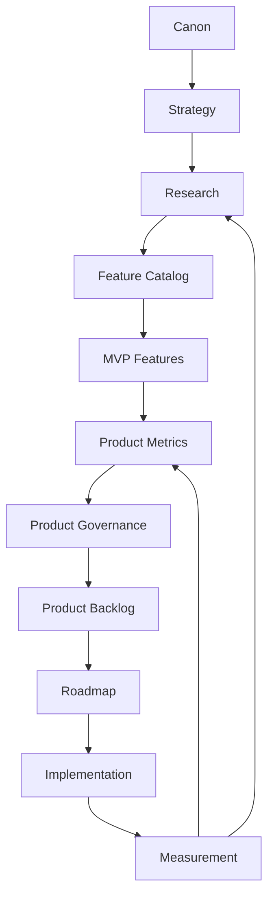
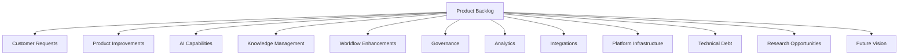
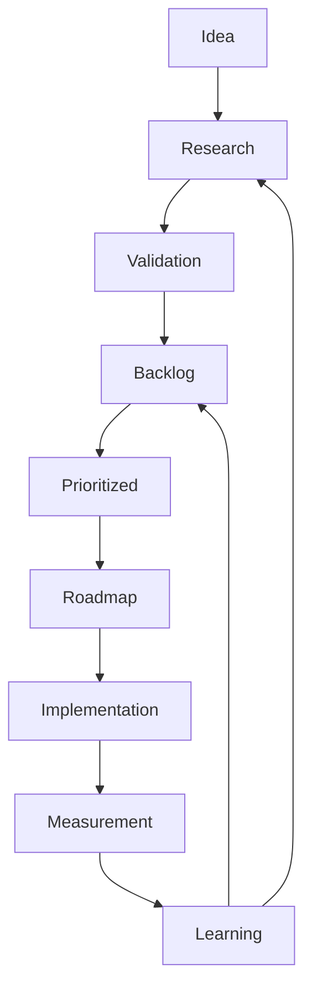
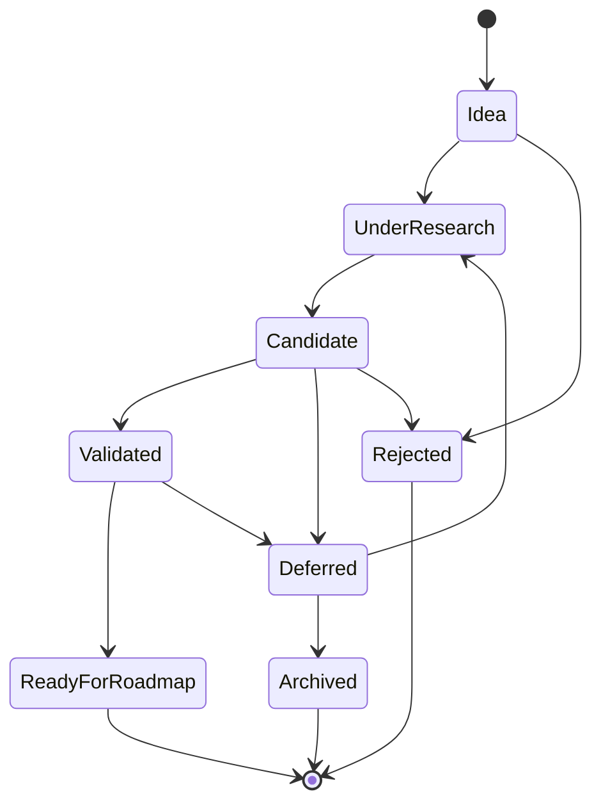
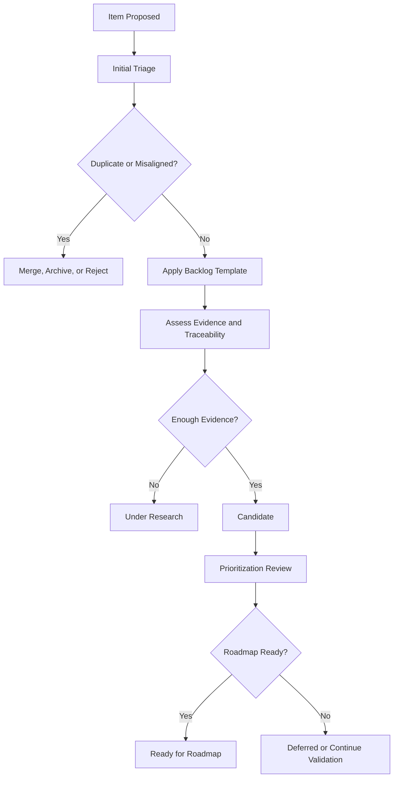
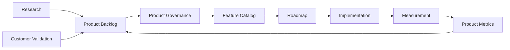

# Product Backlog

## Derived From

- Canon Version: `v1.0.0`
- Strategy Version: `v1.0.0`
- Research Version: `v1.0.0`
- Product Version: `v1.0.0`
- Architecture Version: `v1.0.0`
- Implementation Version: `v1.0.0`
- Repository Map Version: `v1.0.0`

### Primary Repository Sources

- [Repository Map](../REPOSITORY_MAP.md)
- [Canon](../canon/README.md)
- [Strategy](../strategy/README.md)
- [Research](../research/README.md)
- [Architecture](../architecture/README.md)
- [Implementation](../implementation/README.md)
- [Product Philosophy](./00_PRODUCT_PHILOSOPHY.md)
- [Product Strategy](./01_PRODUCT_STRATEGY.md)
- [Product Requirements](./02_PRODUCT_REQUIREMENTS.md)
- [Personas](./03_PERSONAS.md)
- [User Journeys](./04_USER_JOURNEYS.md)
- [User Stories](./05_USER_STORIES.md)
- [Workflow Design](./06_WORKFLOW_DESIGN.md)
- [Information Architecture](./07_INFORMATION_ARCHITECTURE.md)
- [Feature Catalog](./08_FEATURE_CATALOG.md)
- [MVP Features](./09_MVP_FEATURES.md)
- [Product Metrics](./10_PRODUCT_METRICS.md)
- [Product Governance](./11_PRODUCT_GOVERNANCE.md)

---

Status: **Active**

## Primary Question

What product opportunities should the Organizational Intelligence Platform continue exploring as it evolves over time?

This document defines the long-term Product Backlog for the Organizational Intelligence Platform.

It is not a sprint backlog, task list, roadmap, release plan, or engineering backlog. It is the governed inventory of product opportunities that may become future capabilities.

## 1. Executive Summary

The Product Backlog is not a commitment to build.

It is a structured inventory of future opportunities that may strengthen Organizational Intelligence.

The backlog exists because a category-defining product will encounter more ideas than it can responsibly build at once:

- Customer requests.
- Research findings.
- Product improvements.
- AI capability ideas.
- Workflow opportunities.
- Governance needs.
- Integration candidates.
- Platform infrastructure needs.
- Technical debt.
- Future vision concepts.

Not every idea deserves implementation. Not every good idea deserves immediate investment. Some ideas should be researched. Some should become experiments. Some should wait until the product matures. Some should be rejected because they would dilute the platform.

The Product Backlog preserves opportunity without confusing opportunity with priority.

Its purpose is to help the company maintain curiosity while preserving discipline. It should keep product evolution aligned with the Canon, Product Strategy, Product Governance, Product Metrics, and Repository Map.

## 2. Relationship to Repository

The Product Backlog sits between governed product learning and the Roadmap.

It receives opportunities from Research, Product Metrics, Product Governance, customer validation, and strategic learning. It feeds the Roadmap only after backlog items are sufficiently understood, validated, prioritized, and aligned.

## Backlog Positioning

| Layer | Responsibility |
| --- | --- |
| Canon | Defines what the product must never contradict. |
| Strategy | Defines the direction and expansion logic. |
| Research | Supplies evidence, assumptions, and opportunities. |
| Feature Catalog | Defines the authoritative capability universe. |
| MVP Features | Defines the first validation boundary. |
| Product Metrics | Shows what is working, weak, missing, or ready to mature. |
| Product Governance | Evaluates whether opportunities deserve product attention. |
| Product Backlog | Stores governed opportunities that may become future capabilities. |
| Roadmap | Sequences selected backlog items into phased execution. |

The backlog feeds the roadmap, not the other way around.

The roadmap should not invent commitments without a traceable backlog item. The backlog should not imply delivery timing until an item is selected for roadmap planning.

## 3. Backlog Principles

## Evidence Before Prioritization

Backlog items should be prioritized based on evidence, not enthusiasm.

Evidence may come from customer discovery, support patterns, Product Metrics, research, competitive analysis, experiments, implementation learning, or strategic necessity. Weak evidence does not mean an idea is bad; it means the item should remain in research or candidate status.

## Customer Value Before Novelty

Novel capabilities are not automatically valuable.

The backlog should favor opportunities that solve meaningful customer problems, improve organizational capability, reduce Organizational Entropy, or strengthen trusted knowledge reuse.

AI novelty, competitor movement, or internal excitement should not outrank customer value.

## Capability Before Feature

Backlog items should describe product opportunities and capability candidates rather than screens, tickets, or engineering tasks.

A backlog item should answer what enduring product capability or customer outcome is being explored. Implementation details belong later.

## Canon Before Convenience

Convenient ideas still need Canon alignment.

No backlog item should mature into roadmap commitment if it weakens Organizational Memory, Human Review, Governance, explainability, evidence, or AI as amplifier rather than authority.

## One Backlog, One Source of Truth

The Product Backlog should be the governed inventory of product opportunities.

Ideas may originate in research notes, customer conversations, experiments, implementation reviews, or executive discussions, but they should be consolidated into one traceable backlog when they become product opportunities.

## Every Backlog Item Must Be Traceable

Each item should connect to a customer problem, capability, persona, journey, workflow, research source, metric, or strategic goal.

Untraceable ideas are not automatically wrong, but they should not receive priority until their rationale is clear.

## Saying "Not Now" Is Not Saying "Never"

Deferral is a governance tool.

Some opportunities may be strategically sound but premature. The backlog preserves them without forcing immediate roadmap commitment.

## 4. Backlog Item Template

Every meaningful backlog item should use a consistent template.

| Field | Description |
| --- | --- |
| Backlog ID | Stable identifier for reference and traceability. |
| Title | Concise name of the opportunity. |
| Description | Short explanation of the opportunity. |
| Problem Statement | Customer, user, organizational, or product problem being addressed. |
| Opportunity | Why this could create value if pursued. |
| Related Capability | Feature Catalog capability or capability candidate. |
| Related Personas | Personas affected or served. |
| Related Journeys | User journeys improved or expanded. |
| Related Workflow | Workflow affected or enabled. |
| Related Research | Research, discovery, experiment, or evidence source. |
| Business Value | Strategic or commercial value to the company. |
| Customer Value | Value delivered to customers or users. |
| Organizational Intelligence Impact | How it strengthens memory, learning, review, governance, or capability. |
| Estimated Complexity | High, Medium, or Low based on product, design, architecture, implementation, and governance uncertainty. |
| Confidence Level | High, Medium, or Low based on available evidence. |
| Status | Current lifecycle state. |
| Priority | Relative importance after evaluation. |
| Dependencies | Required capabilities, evidence, integrations, maturity, or decisions. |
| Notes | Open questions, risks, assumptions, or context. |

## Example Template

| Field | Example |
| --- | --- |
| Backlog ID | `PB-001` |
| Title | Cross-Department Knowledge Sharing |
| Problem Statement | Valuable knowledge created in support may be useful to product, operations, or success teams but remains siloed. |
| Related Capability | Organizational Memory, Knowledge Governance, Trusted Knowledge Retrieval. |
| Status | Candidate |
| Confidence Level | Medium |
| Priority | Not yet roadmap-ready |

The template creates discipline without turning the backlog into project management.

## 5. Backlog Categories

The backlog should organize opportunities by product intent.

| Category | Purpose |
| --- | --- |
| Customer Requests | Capture recurring customer asks that may reveal product opportunities. |
| Product Improvements | Improve existing product capabilities, usability, trust, clarity, or workflow quality. |
| AI Capabilities | Explore responsible AI assistance that supports reasoning, summarization, recommendations, drafting, detection, or coaching. |
| Knowledge Management | Improve knowledge capture, validation, lifecycle, taxonomy, evidence, reuse, and memory quality. |
| Workflow Enhancements | Improve operational states, handoffs, reviews, escalations, learning loops, and cross-persona work. |
| Governance | Strengthen permissions, ownership, lifecycle, review boundaries, auditability, and product stewardship. |
| Analytics | Expand measurement of Product Metrics, learning outcomes, capability maturity, and customer value. |
| Integrations | Connect the platform to enterprise systems where work, evidence, identity, or knowledge lives. |
| Platform Infrastructure | Improve foundational platform capabilities that enable future scale, reliability, interoperability, or extensibility. |
| Technical Debt | Track product-relevant technical debt that could limit capability evolution or trust. |
| Research Opportunities | Preserve open questions that require investigation before product commitment. |
| Future Vision | Capture long-horizon ideas that may become strategic after the platform matures. |

## Category Relationship Diagram

Categories help organization, but they do not determine priority. Priority depends on evidence, value, alignment, risk, complexity, and timing.

## 6. Backlog Lifecycle

Backlog items move through a governed lifecycle.

## Lifecycle Stages

| Stage | Meaning |
| --- | --- |
| Idea | A possible opportunity has been identified but is not yet understood. |
| Research | The team is investigating the problem, customer value, evidence, risks, and alternatives. |
| Validation | The opportunity is being tested through discovery, experiment, prototype, pilot, metric review, or strategic analysis. |
| Backlog | The opportunity is documented as a governed product candidate. |
| Prioritized | The item has been evaluated against other opportunities and assigned relative importance. |
| Roadmap | The item is selected for sequencing into future execution planning. |
| Implementation | The item is translated into delivery artifacts outside this document. |
| Measurement | Product Metrics evaluate whether the item created intended value. |
| Learning | Evidence determines whether the capability should evolve, expand, narrow, defer, or retire. |

## Backlog Lifecycle Principle

An item should not jump from idea to roadmap without evidence and governance.

Urgency may accelerate review, but it should not eliminate traceability.

## 7. Prioritization Framework

Priority is determined by multiple dimensions, not a single score.

## Evaluation Dimensions

| Dimension | Evaluation Question |
| --- | --- |
| Customer Value | How much value would this create for customers or users? |
| Strategic Alignment | Does it support category, positioning, ICP, growth, or long-term strategy? |
| Canon Alignment | Does it strengthen Organizational Intelligence, Memory, Review, Governance, or Knowledge Flywheel? |
| Product Metrics Impact | Which metrics should improve if this is successful? |
| Organizational Intelligence Impact | Does it make the organization more capable over time? |
| Research Confidence | How strong is the evidence that this problem and solution direction matter? |
| Risk | What trust, governance, AI, security, usability, or product integrity risks exist? |
| Complexity | How difficult is this across product, design, architecture, implementation, operations, or governance? |
| Dependencies | What must exist before this item can succeed? |

## Prioritization Matrix

| Priority Signal | High Priority Tendency | Lower Priority Tendency |
| --- | --- | --- |
| Customer Value | Solves frequent, painful, expensive, or strategically important problems. | Solves rare, unclear, or low-impact problems. |
| Strategic Alignment | Strengthens beachhead, category, ICP, or expansion path. | Pulls product toward unrelated categories or fragmented use cases. |
| Canon Alignment | Reinforces learning, memory, review, governance, and trust. | Weakens or bypasses core principles. |
| Product Metrics Impact | Improves North Star or key leading/lagging metrics. | Has unclear measurement path or rewards vanity activity. |
| Research Confidence | Supported by strong evidence. | Mostly speculative or anecdotal. |
| Risk | Risks are understood and governable. | Risks threaten trust, compliance, or product identity. |
| Complexity | Complexity is justified by value and timing. | Complexity is high while value or evidence is weak. |
| Dependencies | Required foundations already exist or are planned. | Depends on immature capabilities or unresolved architecture. |

## Decision Matrix

| Evidence | Value | Complexity | Suggested Treatment |
| --- | --- | --- | --- |
| High | High | Low/Medium | Prioritize for roadmap consideration. |
| High | High | High | Consider phased validation or dependency planning. |
| Medium | High | Medium | Keep as candidate and validate further. |
| Low | High | Low | Run research or experiment. |
| Low | Medium | High | Defer. |
| Low | Low | Any | Archive or reject unless strategic rationale changes. |

Prioritization should remain explainable. A high-priority item should be high priority for a reason that future contributors can understand.

## 8. Status Model

Backlog status describes maturity, not delivery date.

## Status Definitions

| Status | Meaning |
| --- | --- |
| Idea | Interesting but not yet researched or structured. |
| Under Research | Being investigated for problem clarity, evidence, value, and fit. |
| Candidate | Structured as a possible product opportunity but not yet validated enough for roadmap readiness. |
| Validated | Evidence supports the opportunity and its likely value. |
| Ready for Roadmap | Sufficiently validated, governed, and scoped for roadmap sequencing. |
| Deferred | Valuable or plausible, but not appropriate for current focus, maturity, or dependencies. |
| Archived | Preserved for history but no longer active in planning. |
| Rejected | Intentionally not pursued because it is misaligned, low value, duplicative, risky, or unsupported. |

Status should be revisited as evidence changes.

## 9. Representative Backlog Items

The following examples illustrate the type of opportunities that belong in the long-term Product Backlog.

They are not roadmap commitments.

| Backlog ID | Item | Category | Status | Why It Belongs in Backlog, Not MVP |
| --- | --- | --- | --- | --- |
| PB-001 | Cross-Department Knowledge Sharing | Knowledge Management | Candidate | Valuable after Customer Support proves memory reuse; premature before one department validates the loop. |
| PB-002 | Organizational Intelligence Score | Analytics | Under Research | Potentially useful for executive value, but requires validated metric maturity to avoid oversimplification. |
| PB-003 | AI Coaching Assistant | AI Capabilities | Candidate | Could help agents improve, but requires trust signals, review history, and knowledge quality foundations. |
| PB-004 | Knowledge Gap Prediction | AI Capabilities | Candidate | Prediction should follow enough observed gaps, reuse failures, and workflow data. |
| PB-005 | Voice Support Integration | Integrations | Idea | Important for support expansion, but the MVP should first validate text-based support learning loops. |
| PB-006 | Slack / Microsoft Teams Integration | Integrations | Candidate | Useful where work happens in chat, but should follow core memory, review, and governance foundations. |
| PB-007 | Mobile Experience | Product Improvements | Deferred | Useful for distributed teams, but not necessary to validate the first complete OIP workflow. |
| PB-008 | Knowledge Recommendation Engine | Knowledge Management | Candidate | Strategic for reuse, but should mature from MVP retrieval and recommendation evidence. |
| PB-009 | Organizational Benchmarking | Analytics | Future Vision | Requires multi-customer maturity, privacy controls, comparable data models, and governance. |
| PB-010 | Industry Knowledge Packs | Future Vision | Under Research | Could accelerate onboarding by vertical, but requires category learning and domain validation. |
| PB-011 | Advanced Governance Policy Builder | Governance | Deferred | Valuable for enterprise maturity, but MVP requires simpler governance first. |
| PB-012 | Multilingual Knowledge Lifecycle | Knowledge Management | Candidate | Important for Indonesia-first expansion, but should be validated through real bilingual support workflows. |
| PB-013 | Integration Marketplace | Integrations | Future Vision | Connector breadth should follow proof of core value and repeatable integration patterns. |
| PB-014 | Executive Learning Dashboard | Analytics | Deferred | Executive visibility matters after operational learning metrics are proven. |
| PB-015 | Knowledge Conflict Resolution Assistant | AI Capabilities | Candidate | Valuable for memory quality, but depends on relationship mapping, evidence coverage, and review workflows. |

## Representative Item Detail

| Backlog ID | Problem Statement | Organizational Intelligence Impact | Key Dependency |
| --- | --- | --- | --- |
| PB-001 | Knowledge created in support may remain unavailable to product, operations, or success teams. | Extends Organizational Memory across departments while preserving governance. | Proven support memory reuse and permission model. |
| PB-004 | Teams discover gaps only after repeated failures. | Helps organizations detect entropy earlier. | Enough gap and outcome data to support prediction. |
| PB-008 | Users may not know which validated knowledge applies to a current case. | Improves reuse and decision consistency. | High-quality metadata, evidence, and retrieval signals. |
| PB-010 | Customers in similar industries may need repeated foundational knowledge structures. | Accelerates capability formation without replacing customer-owned memory. | Mature domain models and governance boundaries. |

Representative backlog items should be expanded, revised, or archived as evidence grows.

## 10. Backlog Governance

Backlog Governance keeps the backlog useful, current, and aligned with Product Governance.

## Governance Rules

| Governance Area | Rule |
| --- | --- |
| Who Can Propose Items | Founders, product managers, researchers, designers, engineers, customer success, customers, and implementation teams may propose items. |
| Who Reviews Items | Product Management owns review, with input from Research, Design, Architecture, Engineering, Customer Success, and Founder as appropriate. |
| Required Evidence | Items should include at least a problem statement, source, related capability, expected value, and confidence level. |
| Review Cadence | Backlog review should occur regularly, with deeper reviews before roadmap planning. |
| Archival Process | Items with weak evidence, low value, duplication, or misalignment should be archived or rejected with rationale. |
| Duplication Prevention | New items should be compared against existing backlog items, Feature Catalog capabilities, and Product Governance records. |
| Status Hygiene | Status should reflect maturity; items should not stay indefinitely in vague candidate states. |
| Traceability | Items should maintain links to research, metrics, personas, journeys, capabilities, or strategy. |

## Governance Workflow

Backlog Governance should protect both sides of product development:

- Good ideas should not be lost.
- Weak ideas should not become commitments by inertia.

## 11. Repository Integration

The Product Backlog interacts with the repository but should not bypass it.

| Repository Area | Backlog Interaction |
| --- | --- |
| Research | Supplies evidence, unanswered questions, and validation needs for backlog items. |
| Product Metrics | Reveals weak signals, maturity gaps, and improvement opportunities. |
| Feature Catalog | Provides capability mapping and detects duplication or missing capability candidates. |
| Product Governance | Defines how items are evaluated, approved, deferred, deprecated, or rejected. |
| Roadmap | Receives validated, prioritized items for sequencing; does not pull ungoverned ideas directly into execution. |
| Experiments | Test uncertain backlog items before roadmap commitment. |
| Customer Validation | Confirms whether opportunities solve real problems and create value. |
| Architecture | Identifies feasibility, conceptual fit, and structural dependencies. |
| Implementation | Provides delivery learning, constraints, and technical debt signals. |

## Repository Integration Flow

## Integration Rule

Backlog items should never bypass these layers.

An item that goes directly from customer request to implementation without research, capability mapping, governance, and metrics risks becoming feature creep rather than product evolution.

## 12. Traceability Matrix

| Backlog Item | Research | Capability | Metric | Strategic Goal |
| --- | --- | --- | --- | --- |
| Cross-Department Knowledge Sharing | Customer Discovery, Support Industry Research | Organizational Memory, Permission Governance, Trusted Retrieval | Knowledge Reuse Success, Expansion Readiness | Expand from Customer Support into adjacent departments. |
| Organizational Intelligence Score | Product Metrics, Experiments | Organizational Analytics | Organizational Capability Growth, Entropy Reduction | Communicate enterprise value without reducing it to vanity. |
| AI Coaching Assistant | AI Research, Customer Discovery | AI Assistance, Workflow Intelligence | Time to Competency, AI Trust, Resolution Quality | Help teams become more capable through guided learning. |
| Knowledge Gap Prediction | Experiments, AI Research | Gap Capture, Pattern Detection | Knowledge Gap Closure, Repeat Investigation Reduction | Detect entropy earlier and prioritize learning. |
| Voice Support Integration | Market Research, Customer Discovery | Integration, Evidence Preservation | Knowledge Capture, Resolution Quality | Expand capture to voice-heavy support workflows. |
| Slack / Microsoft Teams Integration | Customer Discovery, Technology Research | Integration Administration, Contextual Knowledge Surfacing | Reuse Rate, Workflow Completion | Bring Organizational Memory into daily collaboration channels. |
| Mobile Experience | Customer Discovery | Product Experience, Trusted Retrieval | Adoption, Time to Resolution | Support work and knowledge access outside desktop workflows. |
| Knowledge Recommendation Engine | MVP Metrics, AI Research | Recommendation Assistance, Trusted Retrieval | Validated Knowledge Reuse Impact | Increase successful knowledge reuse in context. |
| Organizational Benchmarking | Market Research, Product Metrics | Organizational Analytics | Expansion Readiness, Customer Value | Create strategic executive insight after maturity. |
| Industry Knowledge Packs | Market Research, Competitor Research | Knowledge Management, Domain Models | Time to Competency, Onboarding | Accelerate vertical adoption while preserving customer-specific memory. |

## Traceability Principle

Backlog traceability should show why an item exists, what it affects, and how it will be evaluated.

If traceability cannot be established, the item should remain an idea or research opportunity rather than a roadmap candidate.

## 13. Anti-Patterns

The backlog can become harmful if it loses governance.

| Anti-Pattern | Why It Weakens Product Quality |
| --- | --- |
| Feature Dumping | Turns the backlog into an unprioritized list of wishes, making product judgment harder. |
| Roadmap Disguised as Backlog | Creates false commitments and confuses opportunity inventory with execution sequencing. |
| Building Because Competitors Have It | Pulls the platform toward imitation rather than category leadership and customer evidence. |
| Customer-Request-Only Prioritization | Treats requested solutions as strategy and may fragment the product. |
| Untraceable Ideas | Makes it impossible to evaluate alignment, value, or evidence. |
| Duplicate Backlog Items | Splits attention and creates conflicting product definitions. |
| Permanent Backlog Stagnation | Preserves ideas forever without research, decision, archival, or learning. |
| AI Novelty Bias | Prioritizes AI capabilities because they are exciting rather than because they strengthen Organizational Intelligence. |
| Complexity Accumulation | Adds enterprise configurability or advanced features before foundations are proven. |
| Metrics-Free Opportunities | Creates items without any way to know whether they worked. |

## Anti-Pattern Principle

A healthy backlog should increase clarity.

If the backlog makes decisions harder, hides priorities, or encourages uncontrolled growth, it is no longer serving product governance.

## 14. Limitations

The Product Backlog intentionally avoids:

- Sprint planning.
- Engineering tasks.
- UI specifications.
- Implementation design.
- Release commitments.
- Delivery timelines.
- Story point estimates.
- Staffing plans.
- Vendor selection.
- Detailed technical architecture.
- Customer-specific statements of work.
- Contractual commitments.

Those belong elsewhere.

This document defines how product opportunities are captured, evaluated, governed, and prepared for possible roadmap consideration.

## 15. Closing

The Product Backlog is the company's inventory of future possibilities.

Not every idea deserves implementation.

Not every opportunity deserves immediate investment.

The backlog exists to preserve good ideas, evaluate them with evidence, and ensure that future capabilities strengthen rather than dilute the Organizational Intelligence Platform.

A healthy backlog reflects curiosity without sacrificing discipline.

It allows the company to keep listening without becoming reactive.

It allows future ideas to wait until the platform is ready for them.

It allows roadmap decisions to emerge from evidence, strategy, governance, and product metrics rather than urgency alone.

The Product Backlog should therefore remain dynamic, traceable, and governed.

It should help the platform evolve with imagination and restraint.
