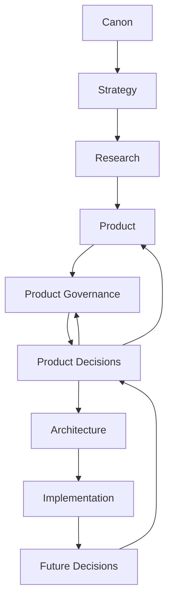
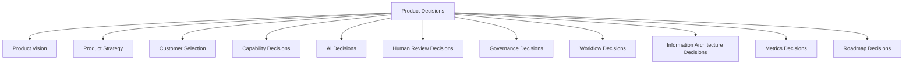
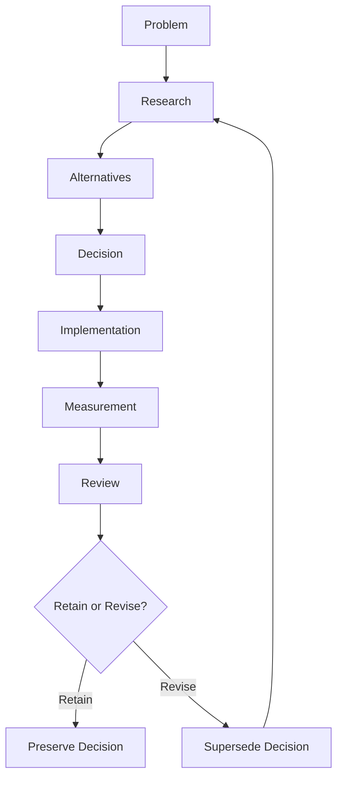
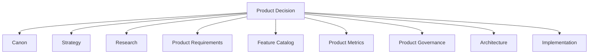
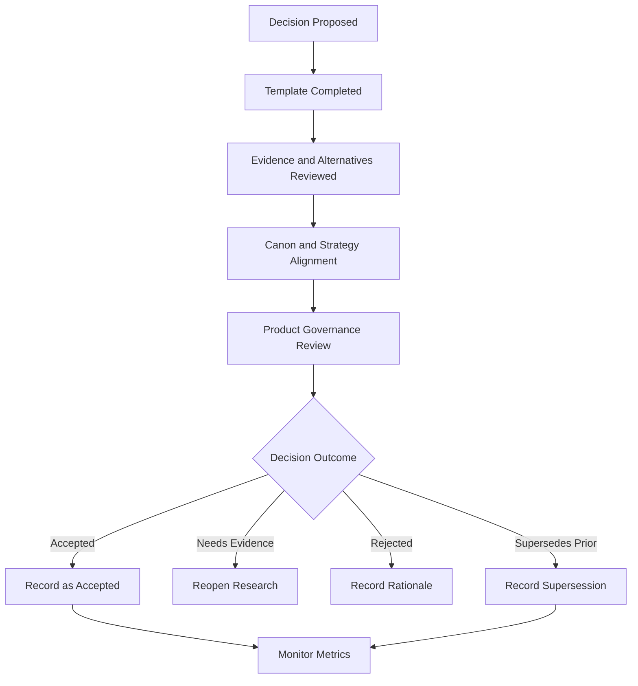
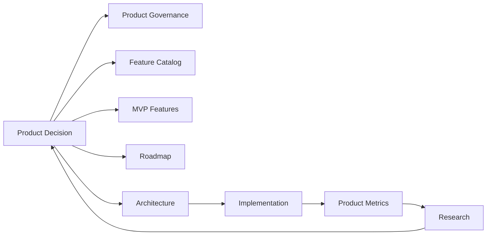

# Product Decisions

## Derived From

- Canon Version: `v1.0.0`
- Strategy Version: `v1.0.0`
- Research Version: `v1.0.0`
- Product Version: `v1.0.0`
- Architecture Version: `v1.0.0`
- Implementation Version: `v1.0.0`
- Repository Map Version: `v1.0.0`

### Primary Repository Sources

- [Repository Map](../REPOSITORY_MAP.md)
- [Canon](../canon/README.md)
- [Strategy](../strategy/README.md)
- [Research](../research/README.md)
- [Architecture](../architecture/README.md)
- [Implementation](../implementation/README.md)
- [Product Philosophy](./00_PRODUCT_PHILOSOPHY.md)
- [Product Strategy](./01_PRODUCT_STRATEGY.md)
- [Product Requirements](./02_PRODUCT_REQUIREMENTS.md)
- [Personas](./03_PERSONAS.md)
- [User Journeys](./04_USER_JOURNEYS.md)
- [User Stories](./05_USER_STORIES.md)
- [Workflow Design](./06_WORKFLOW_DESIGN.md)
- [Information Architecture](./07_INFORMATION_ARCHITECTURE.md)
- [Feature Catalog](./08_FEATURE_CATALOG.md)
- [MVP Features](./09_MVP_FEATURES.md)
- [Product Metrics](./10_PRODUCT_METRICS.md)
- [Product Governance](./11_PRODUCT_GOVERNANCE.md)
- [Product Backlog](./12_PRODUCT_BACKLOG.md)

---

Status: **Active**

## Primary Question

Why does the Organizational Intelligence Platform exist in its current form, and how should future contributors understand the reasoning behind major product decisions?

This document defines the permanent Product Decision Log for the Organizational Intelligence Platform.

It is not meeting minutes, sprint notes, release notes, an engineering change log, or an architecture decision record.

It records the major product decisions that define the long-term evolution of the platform.

## 1. Executive Summary

Product Decisions preserve the reasoning behind major product choices.

The Organizational Intelligence Platform is built around the idea that organizations should preserve knowledge, reasoning, evidence, review, and learning so future work becomes better. That same principle applies to the product itself.

Organizational memory includes decisions as well as knowledge.

If future contributors know only what was decided, but not why, the product becomes vulnerable to repeated debates, accidental reversals, feature drift, and short-term reinterpretation. A decision log prevents this by preserving context, alternatives, evidence, trade-offs, risks, and expected outcomes.

The Product Decision Log should help future contributors understand:

- Why the company chose Organizational Intelligence as the category.
- Why the product begins with Customer Support.
- Why Human Review is mandatory.
- Why AI assists rather than replaces humans.
- Why Organizational Memory is the core asset.
- Why capabilities are governed rather than simply shipped.
- Why the MVP is a complete learning system rather than the smallest possible app.

This document is a living institutional memory for product reasoning.

## 2. Relationship to Repository

Product Decisions connect intent with execution.

They preserve why repository documents exist in their current form and how future choices should interpret prior reasoning.

## Decision Role by Repository Layer

| Repository Layer | Role of Product Decisions |
| --- | --- |
| Canon | Preserves why foundational principles are treated as non-negotiable. |
| Strategy | Preserves why specific markets, positions, categories, and expansion paths were chosen. |
| Research | Connects evidence to product conclusions. |
| Product | Explains the rationale behind requirements, personas, journeys, features, MVP, metrics, governance, and backlog. |
| Product Governance | Defines how decisions are proposed, reviewed, accepted, superseded, or retired. |
| Architecture | Receives product rationale so structural choices serve product meaning. |
| Implementation | Receives product rationale so delivery choices do not silently redefine the product. |
| Future Decisions | Build on prior reasoning rather than restarting from memory loss. |

Product Decisions are not a substitute for other documents. They are the reasoning layer that explains how major product choices were made.

## 3. Decision Principles

## Evidence Before Opinion

Decisions should be informed by research, customer discovery, Product Metrics, market analysis, workflow observation, or explicit strategic reasoning.

Opinion can form a hypothesis. Evidence should support commitment.

## Canon Before Convenience

Product decisions should not contradict Canon for the sake of speed, novelty, customer pressure, or implementation convenience.

Convenience may influence sequencing. It should not redefine Organizational Intelligence, Human Review, Governance, Organizational Memory, or AI authority.

## Customer Value Before Novelty

New product directions should be justified by customer value and organizational capability, not by novelty alone.

AI novelty, market hype, and competitor imitation should be translated into customer problems before becoming product decisions.

## Long-Term Thinking Before Short-Term Optimization

The platform should avoid decisions that create near-term wins while damaging long-term coherence.

A product decision should still make sense as the platform grows, integrates, scales, and matures.

## Document Reasoning, Not Just Outcomes

The decision log should preserve context, alternatives, evidence, trade-offs, and risks.

The conclusion alone is insufficient because future contributors need to understand how the conclusion was reached.

## Every Significant Decision Is Reviewable

Major product decisions should remain open to future review when new evidence appears.

Reviewability does not mean instability. It means the product can learn without forgetting.

## Decisions Should Remain Traceable

Each major decision should reference the repository documents, metrics, research, personas, capabilities, or strategic goals it affects.

Traceability prevents isolated decisions from becoming hidden product policy.

## Decisions May Evolve With New Evidence

Changing a decision because new evidence emerged is not failure.

Failure is changing direction without rationale, forgetting why the prior decision existed, or repeating a rejected idea without new evidence.

## 4. Decision Record Template

Every major product decision should use a consistent template.

| Field | Purpose |
| --- | --- |
| Decision ID | Stable identifier for future reference. |
| Title | Concise name of the decision. |
| Date | Date the decision was accepted, superseded, or retired. |
| Status | Proposed, Accepted, Superseded, or Retired. |
| Context | Background that made the decision necessary. |
| Problem Statement | The product, customer, strategic, or organizational problem being addressed. |
| Alternatives Considered | Meaningful options evaluated before deciding. |
| Research Evidence | Evidence from research, customer discovery, metrics, market analysis, or strategic reasoning. |
| Decision | The chosen direction. |
| Expected Benefits | Benefits expected if the decision is correct. |
| Trade-offs | What the decision sacrifices, postpones, or complicates. |
| Risks | What could go wrong or require future review. |
| Related Repository Documents | Documents that informed or are affected by the decision. |
| Success Metrics | Metrics that should validate or challenge the decision. |
| Review Date | Date, event, or condition for reconsideration. |
| Notes | Additional context, open questions, or follow-up actions. |

## Decision Record Format

| Field | Value |
| --- | --- |
| Decision ID | `PD-000` |
| Title | Short decision title |
| Date | `YYYY-MM-DD` |
| Status | Proposed / Accepted / Superseded / Retired |
| Context | Why this decision matters. |
| Problem Statement | What problem this decision addresses. |
| Alternatives Considered | Option A, Option B, Option C. |
| Research Evidence | Evidence and assumptions supporting the decision. |
| Decision | What was decided. |
| Expected Benefits | What should improve. |
| Trade-offs | What is deferred or made harder. |
| Risks | What should be monitored. |
| Related Repository Documents | Links to relevant repository artifacts. |
| Success Metrics | Product Metrics or validation criteria. |
| Review Date | Trigger for future review. |
| Notes | Additional context. |

The template creates durable reasoning without becoming meeting minutes.

## 5. Decision Categories

Product decisions should be organized by category.

| Category | Purpose |
| --- | --- |
| Product Vision | Decisions about what the product is and why it exists. |
| Product Strategy | Decisions about sequencing, market entry, expansion, and product focus. |
| Customer Selection | Decisions about ICP, beachhead customers, geography, and adoption order. |
| Capability Decisions | Decisions about which capabilities belong in the platform and when they mature. |
| AI Decisions | Decisions about AI participation, boundaries, reviewability, and authority. |
| Human Review Decisions | Decisions about where human judgment is required and why. |
| Governance Decisions | Decisions about ownership, permissions, lifecycle, auditability, and policy. |
| Workflow Decisions | Decisions about how work moves through states, roles, handoffs, and learning loops. |
| Information Architecture Decisions | Decisions about entities, relationships, metadata, evidence, taxonomy, and Organizational Memory. |
| Metrics Decisions | Decisions about how success, trust, learning, and customer value are measured. |
| Roadmap Decisions | Decisions about sequencing, dependency, expansion, and timing. |

## Decision Category Diagram

Categories make reasoning easier to find. A single decision may belong to multiple categories.

## 6. Initial Foundational Decisions

The following representative decisions capture the foundational product reasoning at the current repository stage.

They are not exhaustive. They establish the first permanent product decision memory.

## PD-001: Organizational Intelligence Instead of Knowledge Management

| Field | Value |
| --- | --- |
| Decision ID | `PD-001` |
| Title | Define the category as Organizational Intelligence rather than Knowledge Management. |
| Status | Accepted |
| Context | Traditional knowledge systems often store information but do not reliably convert work into improved organizational capability. |
| Problem Statement | The company needs a product identity that captures learning, memory, governance, review, and capability growth rather than documentation alone. |
| Alternatives Considered | Knowledge Management Platform, AI Knowledge Base, Enterprise Search, AI Agent Platform, Workflow Automation Platform. |
| Decision | The product category is Organizational Intelligence Platform. |
| Reasoning | The platform's core value is not storing knowledge. It is helping organizations become measurably more capable through validated learning from operational work. |
| Expected Long-Term Impact | Positions the company around organizational capability rather than content storage or AI interaction. |

## PD-002: Customer Support as the Beachhead Market

| Field | Value |
| --- | --- |
| Decision ID | `PD-002` |
| Title | Begin with Customer Support as the first market. |
| Status | Accepted |
| Context | The platform needs a high-signal environment where repeated work, knowledge gaps, expert dependency, and customer outcomes are visible. |
| Problem Statement | The company must validate Organizational Intelligence in a focused domain before expanding. |
| Alternatives Considered | IT Service Management, HR, Legal, Finance, Operations, Engineering, general enterprise knowledge. |
| Decision | Customer Support is the beachhead market. |
| Reasoning | Customer Support has recurring inquiries, existing workflows, measurable outcomes, human escalation, rich historical data, and immediate ROI from knowledge reuse. |
| Expected Long-Term Impact | Provides a focused validation path while preserving expansion potential into other knowledge-intensive domains. |

## PD-003: Indonesia as the First Target Market

| Field | Value |
| --- | --- |
| Decision ID | `PD-003` |
| Title | Prioritize Indonesia-first market entry. |
| Status | Accepted |
| Context | The company requires a focused initial market where customer discovery, support operations, language needs, and market positioning can be tested. |
| Problem Statement | Early market focus is necessary to avoid overgeneralizing before Product-Market Fit. |
| Alternatives Considered | Global-first, United States-first, Southeast Asia-wide, vertical-first without geographic focus. |
| Decision | The initial target market is Indonesia-first. |
| Reasoning | Indonesia-first focus supports localized discovery, bilingual support realities, regional market learning, and disciplined early adoption. |
| Expected Long-Term Impact | Enables focused validation before broader geographic expansion. |

## PD-004: Human Review Is Mandatory

| Field | Value |
| --- | --- |
| Decision ID | `PD-004` |
| Title | Require Human Review for governed knowledge and consequential AI-assisted outputs. |
| Status | Accepted |
| Context | AI may generate summaries, recommendations, and drafts, but unreviewed automation can damage trust and organizational memory. |
| Problem Statement | The product must preserve accountability and prevent unvalidated AI output from becoming organizational truth. |
| Alternatives Considered | Full automation, optional review, review only after errors, risk-based review without initial mandatory review. |
| Decision | Human Review is mandatory for governed knowledge and consequential decisions. |
| Reasoning | Human expertise is a source of authority. Review turns AI output and operational learning into trusted organizational knowledge. |
| Expected Long-Term Impact | Builds enterprise trust, improves knowledge quality, and prevents authority drift. |

## PD-005: AI Assists Rather Than Replaces Humans

| Field | Value |
| --- | --- |
| Decision ID | `PD-005` |
| Title | Treat AI as amplifier, not authority. |
| Status | Accepted |
| Context | AI is powerful for summarization, recommendation, drafting, classification, and pattern detection, but it does not own organizational judgment. |
| Problem Statement | The product needs AI without letting AI define truth, authority, or accountability. |
| Alternatives Considered | Autonomous AI agent platform, chatbot-first product, human-only workflow tooling. |
| Decision | AI assists humans and workflows; humans and governance retain authority. |
| Reasoning | Organizational Intelligence emerges from AI, humans, memory, governance, evidence, and workflows working together. |
| Expected Long-Term Impact | Differentiates the platform from AI chatbots and preserves trust as AI capabilities evolve. |

## PD-006: Organizational Memory Is the Core Asset

| Field | Value |
| --- | --- |
| Decision ID | `PD-006` |
| Title | Make Organizational Memory the platform's core asset. |
| Status | Accepted |
| Context | Many tools create activity but fail to preserve reusable institutional knowledge. |
| Problem Statement | The platform must ensure that solved problems improve future work. |
| Alternatives Considered | Conversation history, document repository, ticket archive, AI model memory. |
| Decision | Governed, validated, evidence-backed Organizational Memory is the core asset. |
| Reasoning | Organizational Memory enables compounding capability; without it, work remains transient. |
| Expected Long-Term Impact | Creates durable value and defensibility through customer-specific validated knowledge. |

## PD-007: Capabilities Instead of UI Features

| Field | Value |
| --- | --- |
| Decision ID | `PD-007` |
| Title | Organize product planning around capabilities rather than UI features. |
| Status | Accepted |
| Context | UI features change over time, while product capabilities remain more durable. |
| Problem Statement | The company needs stable product planning that can survive interface and implementation evolution. |
| Alternatives Considered | Screen-based roadmap, feature checklist, engineering-task backlog. |
| Decision | Product documents define capabilities before screens or implementation tasks. |
| Reasoning | Capabilities preserve what the product must enable regardless of UI, technology, or release sequencing. |
| Expected Long-Term Impact | Reduces product drift and improves traceability from Canon to implementation. |

## PD-008: Knowledge Reuse as a Strategic Objective

| Field | Value |
| --- | --- |
| Decision ID | `PD-008` |
| Title | Treat knowledge reuse as a strategic product objective. |
| Status | Accepted |
| Context | Knowledge creation alone does not prove value if future work does not improve. |
| Problem Statement | The platform needs a measurable way to show that Organizational Memory creates capability. |
| Alternatives Considered | Knowledge volume, search activity, AI usage, documentation completeness. |
| Decision | Knowledge reuse, especially validated knowledge reuse impact, is a strategic objective. |
| Reasoning | Reuse connects past learning to future outcomes and directly tests the Knowledge Flywheel. |
| Expected Long-Term Impact | Keeps measurement focused on capability improvement rather than activity. |

## PD-009: Governance Embedded Across the Platform

| Field | Value |
| --- | --- |
| Decision ID | `PD-009` |
| Title | Embed governance across product capabilities rather than treating it as an add-on. |
| Status | Accepted |
| Context | Enterprise trust requires ownership, permissions, lifecycle, auditability, review, and policy boundaries. |
| Problem Statement | Governance cannot be postponed without weakening the identity of the platform. |
| Alternatives Considered | Governance as later enterprise feature, admin-only governance, policy-by-documentation. |
| Decision | Governance is embedded across knowledge, workflow, AI, memory, analytics, and administration capabilities. |
| Reasoning | Organizational Intelligence must be trusted before it can scale. Governance makes knowledge operational and accountable. |
| Expected Long-Term Impact | Supports enterprise adoption and prevents uncontrolled AI or knowledge drift. |

## PD-010: MVP as Complete Learning System

| Field | Value |
| --- | --- |
| Decision ID | `PD-010` |
| Title | Define the MVP as the smallest complete learning system rather than the smallest application. |
| Status | Accepted |
| Context | A minimal app could be easier to build but fail to validate Organizational Intelligence. |
| Problem Statement | The MVP must test the full Knowledge Flywheel, not isolated features. |
| Alternatives Considered | Chatbot MVP, search MVP, knowledge base MVP, ticket summarizer MVP. |
| Decision | The MVP includes the minimum complete set of capabilities required to capture, review, validate, govern, reuse, and measure knowledge. |
| Reasoning | Organizational Intelligence requires a full loop from work to memory to improved future work. |
| Expected Long-Term Impact | Ensures initial validation tests the company's core hypothesis rather than a narrower software utility. |

## PD-011: Why the Three Knowledge Intake Door Architecture Was Chosen

| Field | Value |
| --- | --- |
| Decision ID | `PD-011` |
| Title | Separate organizational knowledge intake into three doors: Manual Entry, Historical Import, and Live Workflow. |
| Status | Accepted |
| Context | Organizational knowledge does not arrive in one form. Some knowledge exists only in an expert's experience, some already sits in historical archives and documents, and some is created while real work is happening. |
| Problem Statement | The platform needs a way to accept organizational knowledge from fundamentally different sources without building a separate intelligence engine for each one or forcing every source through a single ill-fitting importer. |
| Alternatives Considered | One universal importer for all knowledge sources, a Live Workflow-only intake with no path for manual or historical knowledge, source-specific point products that each maintain their own validation and memory. |
| Decision | The platform intentionally separates organizational knowledge intake into three doors — Manual Entry, Historical Import, and Live Workflow — that all converge into one Knowledge Candidate pipeline, one Validation process, and one Organizational Memory. |
| Reasoning | Supports multiple knowledge sources: experts, archives, and live work each need an intake experience suited to how that knowledge actually exists, rather than one generic form that fits none of them well. Avoids duplicate intelligence engines: because every door produces the same Knowledge Candidate, the platform needs only one validation, trust, memory, and learning system regardless of how many doors exist. Enables one validation pipeline: knowledge from any door earns trust through the same governed review, so trust standards cannot drift between sources. Enables one Organizational Memory: knowledge from every door lands in the same connected memory, so the organization never has to reconcile separate, competing knowledge stores. Keeps the architecture extensible: adding a future door requires only a new adapter that produces Knowledge Candidates, not a new architecture. |
| Expected Long-Term Impact | Preserves one coherent Organizational Intelligence architecture as the platform expands to new knowledge sources and domains. The MVP proves the architecture through Live Workflow alone; Manual Entry and Historical Import can be added later without redesigning validation, trust, or memory. Prevents the platform from fragmenting into disconnected knowledge silos as intake sources multiply over time. |

## 7. Decision Lifecycle

Decisions evolve through evidence.

## Lifecycle Stages

| Stage | Meaning |
| --- | --- |
| Problem | A customer, product, strategic, or governance issue requires a decision. |
| Research | Evidence is gathered from customers, market, metrics, experiments, or repository analysis. |
| Alternatives | Meaningful options are considered rather than assuming the first solution is correct. |
| Decision | A direction is accepted, rejected, deferred, or framed as an experiment. |
| Implementation | The decision influences product, architecture, implementation, roadmap, or operations. |
| Measurement | Product Metrics, research, and customer validation test whether the decision worked. |
| Review | New evidence determines whether the decision should be retained, revised, superseded, or retired. |

Decisions should not be treated as eternal just because they were documented. They should remain stable by default and revisitable with evidence.

## 8. Decision Review Process

Revisiting a decision is a sign of learning, not failure.

Decisions should be reviewed when meaningful new evidence appears.

## Review Triggers

| Trigger | Why It Matters |
| --- | --- |
| New Customer Evidence | Customers may reveal that a problem, workflow, persona, or value assumption was incomplete. |
| Significant Technology Changes | New capabilities may change feasibility, risk, or product expectations without changing Canon. |
| Major Market Shifts | Category, competitor, buyer, or budget changes may affect strategy or sequencing. |
| Regulatory Changes | New obligations may affect governance, data, AI behavior, review, or regional strategy. |
| Product Metrics Indicate Poor Outcomes | Metrics may reveal that a decision is not creating expected value. |
| Strategic Repositioning | Company direction may require revisiting customer selection, product focus, or category narrative. |
| Architecture or Implementation Constraints | Delivery learning may reveal maintainability, scalability, or feasibility issues. |
| Repeated Customer Requests | Patterns in customer demand may challenge backlog priority or product assumptions. |

## Review Outcomes

| Outcome | Meaning |
| --- | --- |
| Retain | Decision remains valid with no material change. |
| Refine | Decision remains valid but needs clearer scope, language, or conditions. |
| Supersede | New decision replaces the prior decision while preserving history. |
| Retire | Decision no longer applies and should not guide future work. |
| Reopen Research | Evidence is insufficient; the decision requires further investigation. |

Decision review should preserve history. A superseded decision should remain visible so future contributors understand what changed and why.

## 9. Decision Traceability

Every major product decision should reference the repository artifacts it derives from or affects.

## Traceability Requirements

| Reference Area | Why It Should Be Included |
| --- | --- |
| Canon | Shows which foundational concepts the decision preserves. |
| Strategy | Shows market, category, ICP, GTM, business, or long-term strategic alignment. |
| Research | Shows evidence or assumptions supporting the decision. |
| Product Requirements | Shows enduring capability requirements affected by the decision. |
| Feature Catalog | Shows which capability or capability domain is involved. |
| Product Metrics | Shows how the decision will be validated. |
| Product Governance | Shows how the decision was reviewed and accepted. |

## Traceability Example

| Decision | Canon | Strategy | Research | Product | Metric |
| --- | --- | --- | --- | --- | --- |
| Human Review is mandatory. | Human Review, Governance, AI as Amplifier | Enterprise trust and category differentiation | Customer discovery and AI trust research | Product Requirements, Workflow Design, Feature Catalog | Review Completion, AI Trust, Knowledge Accuracy, Audit Completeness |
| Customer Support beachhead. | Knowledge Flywheel, Organizational Memory | ICP, GTM, Category Design | Support industry and customer discovery | Personas, User Journeys, MVP Features | Knowledge Reuse, Resolution Quality, Repeat Investigation Reduction |
| Organizational Memory as core asset. | Organizational Memory, Knowledge Flywheel | Defensibility and category design | Market and competitor research | Information Architecture, Feature Catalog | Validated Knowledge Reuse Impact, Memory Growth |

## Decision Traceability Diagram

Traceability ensures decisions remain understandable and reviewable as the repository grows.

## 10. Decision Governance

Product Decisions should align with Product Governance.

## Governance Responsibilities

| Governance Area | Rule |
| --- | --- |
| Who Can Propose Decisions | Founders, Product Managers, Product Owners, Researchers, Designers, Architects, Engineering Leaders, Customer Success, and Executive Sponsors may propose major decisions. |
| Who Reviews Decisions | Product Management coordinates review with Research, Design, Architecture, Engineering, Customer Success, and Founder as appropriate. |
| Who Approves Strategic Decisions | Foundational or strategic product decisions require Founder and Product leadership approval. |
| Documentation Requirements | Major decisions should use the decision template and reference evidence, trade-offs, metrics, and affected documents. |
| Review Cadence | Decisions should be reviewed during Product Governance, Strategy, Metrics, or Roadmap reviews when triggers emerge. |
| Superseding Previous Decisions | A new decision may supersede an old decision, but it must preserve the old rationale and explain the new evidence. |
| Archival | Retired decisions should remain accessible for history unless they contain sensitive information that requires separate handling. |

## Decision Governance Flow

Decision Governance should be lightweight enough to use and strong enough to preserve institutional memory.

## 11. Repository Integration

Product Decisions influence future repository evolution.

| Repository Area | Product Decision Influence |
| --- | --- |
| Product Governance | Decision records provide the rationale and evidence behind governed product choices. |
| Feature Catalog | Capability decisions determine whether new capabilities are added, matured, merged, or retired. |
| MVP | Foundational decisions explain why the MVP includes a complete learning loop and not just a smaller app. |
| Roadmap | Decisions inform sequencing, dependencies, and expansion readiness. |
| Architecture | Product rationale shapes system boundaries, agent responsibilities, data models, knowledge representation, and integration priorities. |
| Implementation | Product decisions constrain implementation choices so delivery preserves product identity. |
| Research | Decisions create hypotheses and review triggers for future research. |
| Product Metrics | Decisions define what should be measured to validate or challenge assumptions. |

## Integration Flow

Product Decisions provide the reasoning behind future evolution.

They help future contributors understand not only what to do, but why the platform developed in this direction.

## 12. Anti-Patterns

Decision memory weakens when product choices are made or changed without durable reasoning.

| Anti-Pattern | Why It Weakens Organizational Memory |
| --- | --- |
| Undocumented Decisions | Future teams cannot understand why the product changed. |
| Decisions Without Evidence | Product direction becomes opinion-driven and difficult to validate. |
| Repeating Previously Rejected Ideas | Teams waste effort because historical rationale is lost. |
| Forgetting Historical Context | Future contributors may misinterpret old decisions or reverse them accidentally. |
| Changing Direction Without Rationale | The product becomes reactive and incoherent. |
| Decision by Opinion Alone | Strong voices override customer evidence, metrics, and Canon alignment. |
| Decision Drift | Small undocumented changes gradually redefine product behavior. |
| Treating Decisions as Permanent Dogma | Prevents learning when new evidence genuinely matters. |
| Confusing Product Decisions with ADRs | Mixes product reasoning with technical implementation records. |
| Hiding Trade-offs | Creates false certainty and makes future review harder. |

## Anti-Pattern Principle

The product should not forget why it became itself.

Decision memory protects future contributors from repeating old debates and helps them evolve the product with context.

## 13. Limitations

This document intentionally avoids:

- Meeting transcripts.
- Engineering implementation.
- Daily operational decisions.
- Project management notes.
- Sprint planning.
- Release notes.
- Architecture decision records.
- Detailed technical trade-offs.
- Customer-specific contract decisions.
- Staffing decisions.
- Financial approvals.

Only strategic product decisions belong here.

Implementation details and architecture-specific trade-offs should be documented in their respective artifacts.

## 14. Closing

Product Decisions are the institutional memory of the product itself.

Features may change.

Architecture may evolve.

Technologies will be replaced.

Markets will shift.

But understanding why previous decisions were made enables future teams to evolve the platform intelligently instead of repeating old debates.

The Product Decision Log therefore preserves not only what the company believes today, but how those beliefs were formed, challenged, and refined over time.

It becomes a living history of Organizational Intelligence applied to the product itself.

When future contributors ask why the platform works this way, this document should give them more than an answer.

It should give them the reasoning.
