# Product Lifecycle

## Derived From

- Canon Version: `v1.0.0`
- Strategy Version: `v1.0.0`
- Research Version: `v1.0.0`
- Product Version: `v1.0.0`
- Architecture Version: `v1.0.0`
- Implementation Version: `v1.0.0`
- Repository Map Version: `v1.0.0`

### Primary Repository Sources

- [Repository Map](../REPOSITORY_MAP.md)
- [Canon](../canon/README.md)
- [Strategy](../strategy/README.md)
- [Research](../research/README.md)
- [Architecture](../architecture/README.md)
- [Implementation](../implementation/README.md)
- [Product Philosophy](./00_PRODUCT_PHILOSOPHY.md)
- [Product Strategy](./01_PRODUCT_STRATEGY.md)
- [Product Requirements](./02_PRODUCT_REQUIREMENTS.md)
- [Personas](./03_PERSONAS.md)
- [User Journeys](./04_USER_JOURNEYS.md)
- [User Stories](./05_USER_STORIES.md)
- [Workflow Design](./06_WORKFLOW_DESIGN.md)
- [Information Architecture](./07_INFORMATION_ARCHITECTURE.md)
- [Feature Catalog](./08_FEATURE_CATALOG.md)
- [MVP Features](./09_MVP_FEATURES.md)
- [Product Metrics](./10_PRODUCT_METRICS.md)
- [Product Governance](./11_PRODUCT_GOVERNANCE.md)
- [Product Backlog](./12_PRODUCT_BACKLOG.md)
- [Product Decisions](./13_PRODUCT_DECISIONS.md)

---

Status: **Active**

## Primary Question

How does the Organizational Intelligence Platform continuously evolve from customer problems into mature product capabilities while preserving Organizational Intelligence, Governance, Human Review, and long-term product integrity?

This document defines the Product Lifecycle of the Organizational Intelligence Platform.

It is not a software development lifecycle, project management process, Scrum guide, release management process, or engineering workflow.

It defines how product ideas evolve into validated, governed, measurable organizational capabilities.

## 1. Executive Summary

The Product Lifecycle describes the evolution of product knowledge rather than software releases.

The Organizational Intelligence Platform should not evolve by simply collecting requests, shipping features, and moving on. It should evolve the same way it expects customers to evolve: through evidence, memory, review, governance, measurement, and learning.

Every product capability should mature through a disciplined path:

1. A real customer problem is discovered.
2. Research clarifies the problem and its importance.
3. An opportunity is defined.
4. A product decision records the reasoning.
5. The opportunity enters the governed backlog.
6. Prioritization evaluates value, evidence, risk, and timing.
7. Roadmap planning sequences selected work.
8. Design, architecture, and implementation express the capability.
9. Customer validation tests whether it works.
10. Product Metrics measure value and maturity.
11. Learning updates future decisions.
12. The capability evolves, expands, narrows, or retires.

The lifecycle is successful when every cycle leaves the company with better customer understanding, stronger product judgment, more coherent capabilities, and richer Organizational Memory.

The lifecycle should measure progress not by how quickly software ships, but by whether the product and its customers become more capable over time.

## 2. Relationship to Repository

The Product Lifecycle is the operating model connecting every major repository layer.

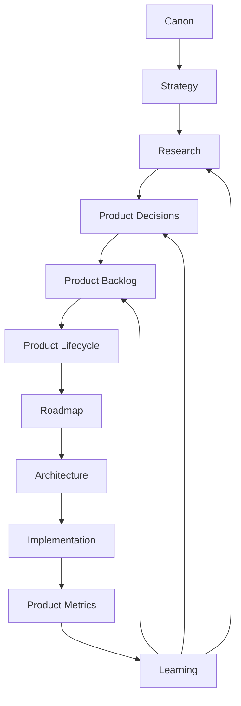

## Lifecycle Role by Repository Layer

| Repository Layer | Lifecycle Role |
| --- | --- |
| Canon | Defines permanent constraints and product identity. |
| Strategy | Defines direction, sequencing logic, market focus, and expansion intent. |
| Research | Discovers problems, evidence, assumptions, risks, and validation signals. |
| Product Decisions | Records why major product choices were made. |
| Product Backlog | Stores governed opportunities that may become capabilities. |
| Product Lifecycle | Defines how opportunities mature into validated capabilities. |
| Roadmap | Sequences selected lifecycle outputs into execution phases. |
| Architecture | Structures the capability so it remains coherent, governable, and scalable. |
| Implementation | Realizes the capability in working software without redefining product meaning. |
| Product Metrics | Measures whether the capability creates customer value and Organizational Intelligence. |
| Learning | Feeds evidence back into research, decisions, backlog, roadmap, and future evolution. |

The lifecycle is not another repository section competing with the others. It is the connective operating model that explains how the repository learns.

## 3. Lifecycle Principles

## Customer Problems Before Solutions

The lifecycle begins with problems, not features.

A customer request may suggest a possible solution, but the product team must understand the underlying problem before committing. Building the requested surface without understanding the problem can create feature growth without capability growth.

## Research Before Commitment

Research should precede major product commitment.

Research does not need to become slow or academic. It should create enough confidence to decide whether an opportunity is real, important, aligned, and worth pursuing.

## Capabilities Before Features

The lifecycle matures capabilities rather than isolated UI features.

Screens, workflows, AI prompts, APIs, dashboards, and integrations are expressions of capabilities. The lifecycle should preserve the deeper capability even as interface and implementation choices change.

## Human Review Before Automation

Automation should not outrun trust.

Any lifecycle stage that increases AI participation, workflow automation, or customer-facing action must preserve review boundaries, evidence, explainability, and governance.

## Governance Throughout the Lifecycle

Governance is not a final approval step.

Canon alignment, strategy review, evidence validation, product review, architecture review, metrics definition, and learning review should accompany the lifecycle from discovery to evolution.

## Continuous Learning

The lifecycle should never end at delivery.

Implementation creates new evidence. Customer validation creates new evidence. Metrics create new evidence. Every evidence source should feed future research, decisions, backlog refinement, and capability evolution.

## Evidence-Driven Evolution

Capabilities should expand, narrow, merge, mature, or retire based on evidence.

Evidence may confirm a direction, reveal friction, expose weak assumptions, or show that a capability is premature.

## Product Integrity Over Feature Velocity

Fast shipping is useful only when it strengthens the platform.

Velocity that bypasses Canon, Product Governance, Human Review, evidence, or measurement creates future product debt. The lifecycle should protect long-term integrity even when short-term pressure is high.

## 4. Product Lifecycle Overview

The complete Product Lifecycle moves from customer problem to capability evolution.

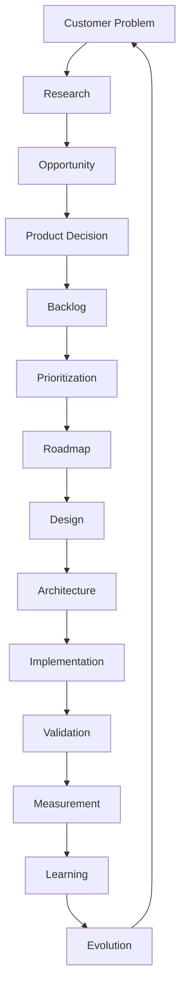

## Lifecycle Stage Summary

| Stage | Purpose |
| --- | --- |
| Customer Problem | Identify a real pain, need, gap, risk, or opportunity. |
| Research | Understand evidence, context, personas, workflows, market, and assumptions. |
| Opportunity | Define the product opportunity and its relationship to Organizational Intelligence. |
| Product Decision | Record the reasoning, alternatives, evidence, trade-offs, and expected outcomes. |
| Backlog | Store the opportunity as a governed product candidate. |
| Prioritization | Evaluate value, alignment, evidence, risk, complexity, and timing. |
| Roadmap | Sequence selected opportunities into future execution. |
| Design | Shape the user, workflow, information, and human-AI experience. |
| Architecture | Define conceptual structure, responsibility boundaries, and integration with platform systems. |
| Implementation | Build the capability while preserving product meaning and architectural intent. |
| Validation | Test the capability with customers, workflows, and real or representative use. |
| Measurement | Use Product Metrics to evaluate value, quality, trust, maturity, and risk. |
| Learning | Interpret evidence and update decisions, backlog, research, strategy, or product artifacts. |
| Evolution | Mature, expand, narrow, merge, deprecate, or retire the capability. |

The lifecycle should be continuous. A capability may move through the loop many times as it matures.

## 5. Lifecycle Stages

Each lifecycle stage has objectives, inputs, outputs, responsible roles, entry criteria, exit criteria, and success indicators.

## Stage Matrix

| Stage | Objective | Inputs | Outputs | Responsible Roles | Entry Criteria | Exit Criteria | Success Indicators |
| --- | --- | --- | --- | --- | --- | --- | --- |
| Customer Problem Discovery | Identify a meaningful customer, user, market, or organizational problem. | Customer conversations, support signals, sales feedback, research findings, metrics, implementation learning. | Problem statement, affected personas, initial context. | Product Manager, Research Lead, Customer Success, Founder. | A signal suggests a problem worth understanding. | Problem is articulated clearly enough for research. | Problem is specific, observable, and connected to customer value. |
| Research | Understand the problem, context, evidence, alternatives, and uncertainty. | Problem statement, repository context, customer access, market data, usage signals. | Research findings, assumptions, confidence level, open questions. | Research Lead, Product Manager, Designer, Customer Success. | Problem is clear enough to investigate. | Evidence supports, refines, or rejects the opportunity. | Team understands problem importance and risk. |
| Opportunity Definition | Translate research into a product opportunity. | Research findings, personas, journeys, metrics, strategy, Feature Catalog. | Opportunity brief, capability candidate, validation hypothesis. | Product Manager, Research Lead, Design Lead. | Evidence suggests meaningful product potential. | Opportunity is connected to capability, persona, journey, and metric. | Opportunity can be evaluated without implementation detail. |
| Product Decision | Record the product reasoning behind a major direction. | Opportunity brief, alternatives, evidence, risks, metrics, Canon and Strategy context. | Product decision record. | Product Manager, Founder, Product Governance reviewers. | Opportunity requires a significant product choice. | Decision is accepted, rejected, deferred, or sent back to research. | Future contributors can understand why the decision was made. |
| Product Backlog | Store the opportunity as a governed candidate. | Product decision, opportunity brief, related research, capability mapping. | Backlog item with status, priority, confidence, dependencies. | Product Manager, Product Owner. | Opportunity is structured enough to track. | Item is accepted, researched, prioritized, deferred, archived, or rejected. | Backlog remains traceable and current. |
| Prioritization | Compare opportunities and determine relative importance. | Backlog items, metrics, strategy, research confidence, customer value, dependencies. | Priority recommendation and rationale. | Product Manager, Founder, Customer Success, Engineering Lead, Design Lead. | Backlog item has enough information for comparison. | Priority and treatment are documented. | Priority is explainable and evidence-based. |
| Roadmap Planning | Sequence selected items into future execution. | Prioritized backlog, dependencies, strategy, capability maturity, architecture input. | Roadmap candidate, sequencing rationale, dependency map. | Product Manager, Founder, Engineering Lead, Design Lead. | Item is ready for roadmap consideration. | Item is sequenced, deferred, or returned to backlog. | Roadmap reflects evidence and strategy, not impulse. |
| Product Design | Define the product experience, workflow, information, and human-AI interaction. | Roadmap item, personas, journeys, workflow design, information architecture, governance needs. | Product design direction, experience principles, workflow expectations. | Design Lead, Product Manager, Research Lead. | Roadmap item is ready for design exploration. | Design direction satisfies user, workflow, trust, and governance needs. | Users can understand, trust, and responsibly use the capability. |
| Architecture | Define conceptual structure and system responsibility. | Product design, product requirements, Feature Catalog, architecture documents, constraints. | Architecture impact assessment, responsibility boundaries, conceptual design. | Architect, Engineering Lead, Product Manager. | Product intent is clear enough to structure. | Architecture supports product meaning and governance. | Capability is feasible, maintainable, secure, and coherent. |
| Implementation | Realize the capability in working software. | Product direction, architecture guidance, implementation constraints, quality expectations. | Working capability, implementation artifacts, operational readiness evidence. | Engineering Lead, Product Owner, Product Manager. | Product and architecture intent are sufficiently clear. | Capability is ready for customer validation. | Implementation preserves product meaning and trust boundaries. |
| Customer Validation | Test whether the capability solves the intended problem. | Working capability, customer context, validation plan, success criteria. | Validation findings, adoption signals, qualitative feedback, outcome evidence. | Product Manager, Research Lead, Customer Success. | Capability can be used in real or representative conditions. | Evidence indicates value, friction, risk, or need for change. | Customer problem is solved or learning is clear. |
| Product Metrics | Measure value, quality, trust, governance, maturity, and outcomes. | Usage signals, workflow data, review records, customer outcomes, knowledge signals. | Metric interpretation, capability maturity assessment, risk signals. | Product Manager, Data/Analytics, Customer Success, Research Lead. | Metrics are defined and observable. | Evidence informs product learning. | Metrics show whether capability improved Organizational Intelligence. |
| Learning | Interpret evidence and update product understanding. | Validation findings, Product Metrics, customer feedback, implementation learning. | Learning summary, decision review, backlog update, research questions. | Product Manager, Research Lead, Founder, Product Governance reviewers. | Evidence is available. | Learning is documented and routed to the right repository artifacts. | Future decisions improve because of prior evidence. |
| Evolution | Mature, expand, narrow, merge, deprecate, or retire the capability. | Learning summary, metrics, strategy, governance review, customer demand. | Updated capability status, roadmap direction, decision record, document updates. | Product Manager, Founder, Product Governance reviewers. | Learning indicates change is needed or justified. | Capability path is decided and documented. | Product becomes more coherent and capable over time. |

## Stage Principle

Stages may overlap in real work, but the responsibilities should not disappear.

Fast product teams may compress steps. They should not skip understanding, evidence, governance, design, architecture, validation, measurement, or learning.

## 6. Governance Across the Lifecycle

Governance accompanies every lifecycle stage.

It ensures that product evolution remains aligned with Canon, Strategy, Product Governance, Product Metrics, Architecture, and long-term platform integrity.

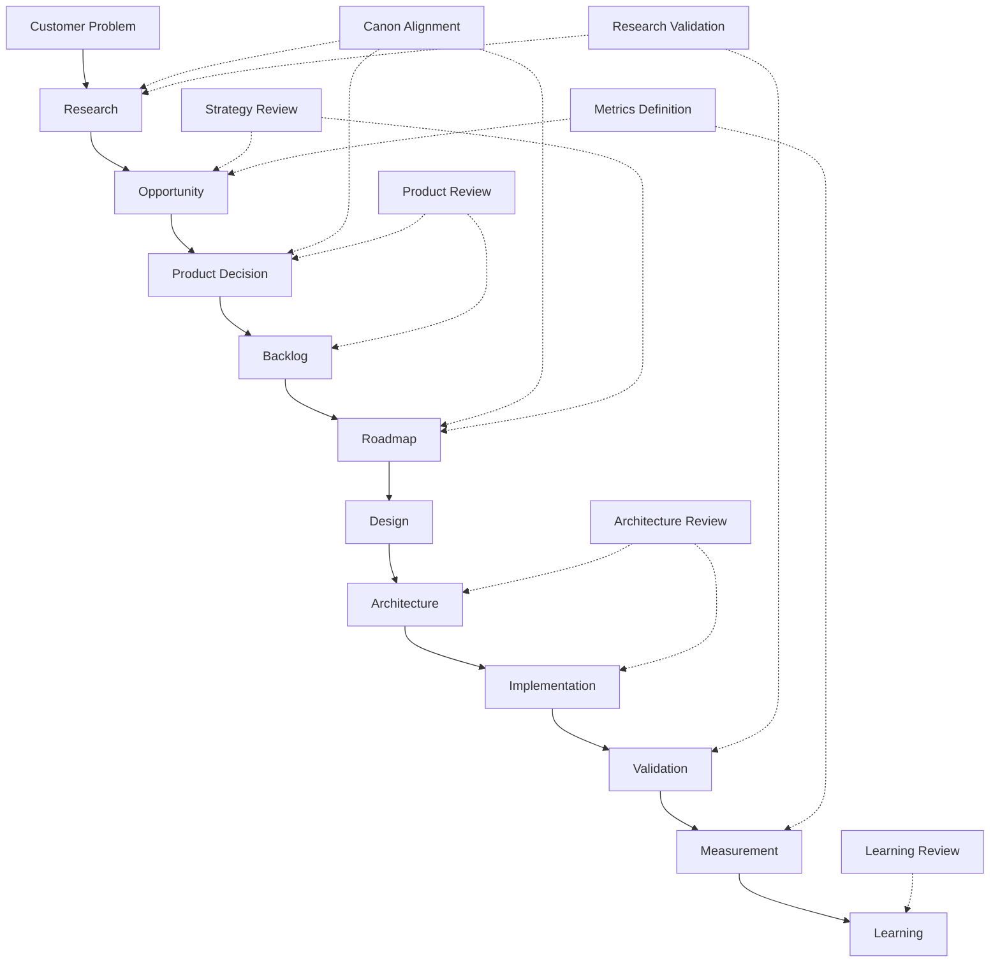

## Governance Checkpoints

| Checkpoint | Applies To | Evaluates |
| --- | --- | --- |
| Canon Alignment | Research, Product Decision, Roadmap, Evolution | Does this preserve Organizational Intelligence, Human Review, Governance, Memory, and AI boundaries? |
| Strategy Review | Opportunity, Prioritization, Roadmap | Does this support category, ICP, positioning, growth, and long-term direction? |
| Research Validation | Research, Customer Validation | Is the problem real, important, and understood? |
| Product Review | Product Decision, Backlog, Design | Does the opportunity fit requirements, personas, journeys, workflows, and capabilities? |
| Architecture Review | Architecture, Implementation | Does the structure preserve product meaning and platform boundaries? |
| Metrics Definition | Opportunity, Validation, Measurement | How will success, failure, quality, trust, and maturity be measured? |
| Learning Review | Measurement, Evolution | What should change based on evidence? |

Governance should scale with risk.

A minor product refinement may require lightweight review. A change to AI authority, Human Review, Organizational Memory, or governance policy requires deeper review.

## 7. Learning Loops

The Product Lifecycle contains multiple feedback loops.

These loops allow the product to learn from customers, implementation, architecture, metrics, and its own decisions.

## Customer Learning Loop

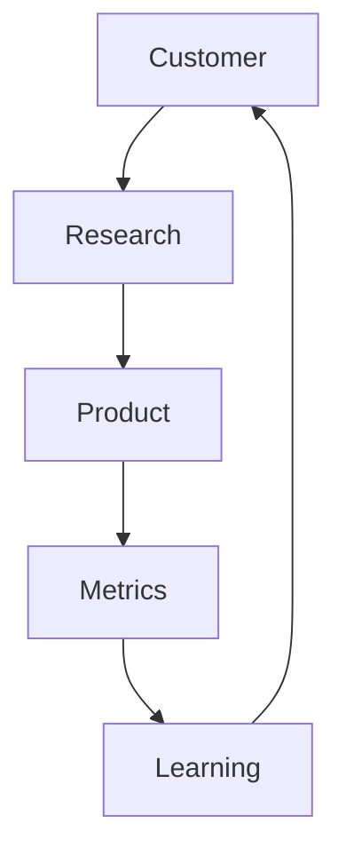

This loop ensures that customer problems remain the source of product evolution.

## Implementation Learning Loop

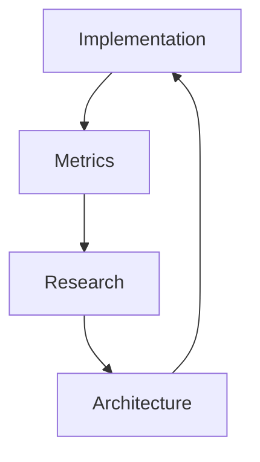

This loop ensures that delivery evidence, operational constraints, and technical learning improve future architecture and product choices.

## Governance Learning Loop

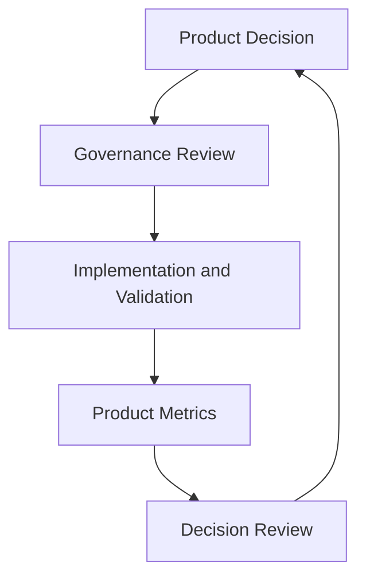

This loop ensures that decisions remain reviewable and evolve with new evidence.

## Knowledge Flywheel Loop

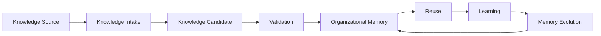

The loop now conceptually begins before any answer is produced. A Knowledge Source—customer work, an expert contribution, or an existing archive—enters the platform through Knowledge Intake, and only then becomes something the organization can evaluate.

Every reusable knowledge object begins as a Knowledge Candidate. Capture alone does not create trust: a Candidate is a proposal, not organizational truth, regardless of how it was produced or how confident its source appears.

Knowledge does not become trusted simply because it has been captured. Validation is the transition between captured knowledge and trusted Organizational Memory. Only after Validation does knowledge enter Organizational Memory, where it can be reused, generate Learning, and drive Memory Evolution, which feeds improved knowledge back into memory rather than restarting the loop from nothing.

Multiple feedback loops are essential because no single signal is sufficient.

Customer feedback may reveal desirability. Implementation may reveal feasibility. Metrics may reveal value. Governance may reveal risk. Together, they create responsible product learning.

## 8. Decision Gates

Decision gates evaluate whether an opportunity is ready to move forward.

They are not project management ceremonies. They are product quality checks.

## Decision Gate Model

| Gate | Evaluates | Typical Outcome |
| --- | --- | --- |
| Problem Validation Gate | Is the problem real, specific, important, and connected to customer value? | Continue research, refine problem, or reject. |
| Research Gate | Is there enough evidence to define an opportunity? | Define opportunity, continue research, or archive. |
| Product Decision Gate | Is a product direction justified by evidence, alternatives, and Canon alignment? | Accept, defer, reject, or experiment. |
| Backlog Acceptance Gate | Is the item structured, traceable, and governed enough for the backlog? | Accept into backlog, return for detail, merge, or reject. |
| Roadmap Gate | Is the item ready for sequencing based on value, maturity, dependencies, and strategy? | Move to roadmap, defer, or continue validation. |
| Design Gate | Does the product expression support user work, trust, review, and clarity? | Proceed, refine, or return to research/design. |
| Architecture Gate | Does the conceptual structure preserve product meaning and system integrity? | Proceed, revise architecture, or change scope. |
| MVP Validation Gate | Does the capability validate the MVP hypothesis or a defined extension of it? | Expand, refine, narrow, or pause. |
| Capability Maturity Gate | Has the capability reached adoption, trust, reuse, stability, and expansion readiness? | Mature, expand, merge, deprecate, or retire. |

## Gate Flow

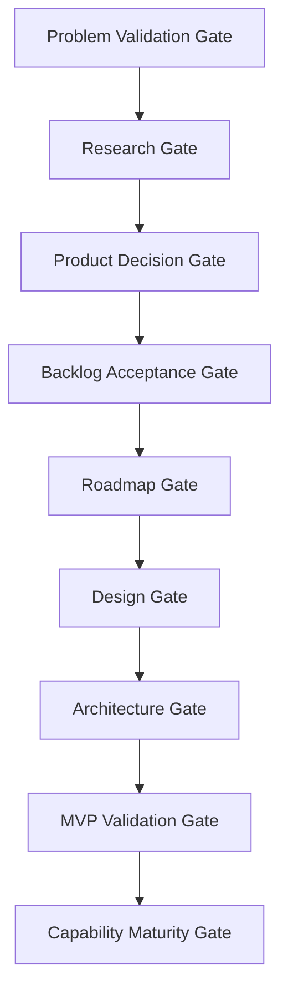

## Gate Principle

Gates should prevent weak ideas from becoming expensive commitments.

They should also prevent strong ideas from being lost because the organization lacks a disciplined path to maturity.

## 9. Capability Evolution

Capabilities mature over time.

The Product Lifecycle should help each capability move from idea to strategic capability through evidence and measured maturity.

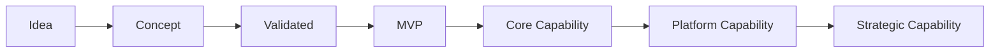

## Capability Maturity Stages

| Stage | Meaning | Evidence Required |
| --- | --- | --- |
| Idea | A possible capability has been noticed. | Initial signal or hypothesis. |
| Concept | The capability is described and connected to a problem. | Problem statement, persona, journey, and opportunity definition. |
| Validated | Research or experiment supports the capability. | Customer evidence, metric signal, or strategic validation. |
| MVP | The capability is included in the smallest complete system needed for validation. | MVP hypothesis alignment and success criteria. |
| Core Capability | The capability proves recurring value in the beachhead workflow. | Adoption, trust, reuse, stability, and customer value. |
| Platform Capability | The capability becomes reusable across domains, teams, or workflows. | Governance maturity, architecture fit, and repeatable value. |
| Strategic Capability | The capability becomes a source of differentiation, defensibility, or category leadership. | Sustained impact on Organizational Intelligence and business outcomes. |

## Measuring Capability Maturity

Product Metrics should evaluate maturity through:

- Adoption.
- Trust.
- Reuse.
- Stability.
- Governance compliance.
- Customer value.
- Organizational Intelligence impact.
- Expansion readiness.

Capability evolution should not be assumed because the software exists. It should be earned through evidence.

## 10. Organizational Learning

Organizational Memory improves the Product Lifecycle.

The company should use the repository as its own Organizational Memory. Every cycle should strengthen future decisions by preserving what was learned.

## Product Organizational Memory Sources

| Memory Source | What It Preserves |
| --- | --- |
| Customer Knowledge | Problems, workflows, buying triggers, adoption friction, success criteria, and unmet needs. |
| Product Knowledge | Requirements, personas, journeys, stories, workflows, features, metrics, governance, and lifecycle rules. |
| Decision History | Rationale, alternatives, trade-offs, risks, and review triggers behind major choices. |
| Research Evidence | Market analysis, customer discovery, experiments, assumptions, and open questions. |
| Implementation Learning | Feasibility, constraints, delivery risks, technical debt, and operational lessons. |
| Metrics | Leading and lagging indicators of value, trust, learning, maturity, and customer outcomes. |
| Capability Maturity | Evidence about which capabilities are adopted, trusted, reused, stable, and expansion-ready. |

## Organizational Learning Loop

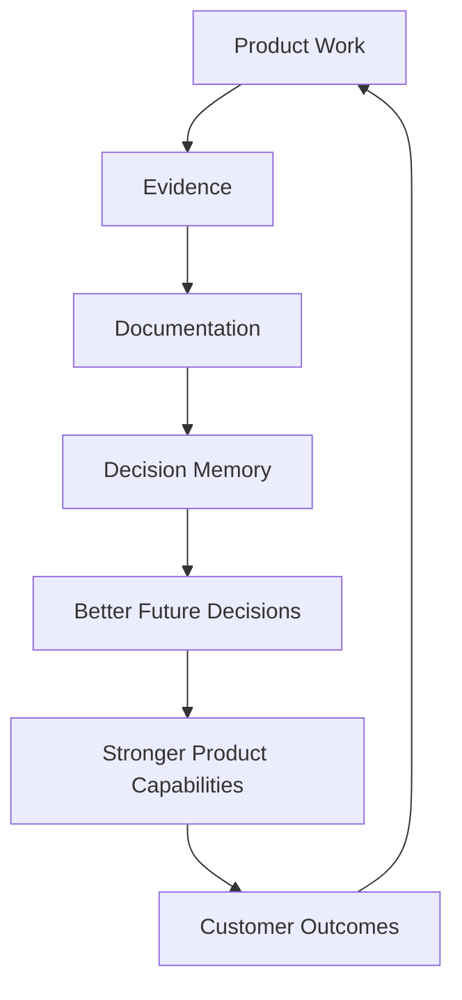

Every cycle should make future product work easier, clearer, and more trustworthy.

Learning without documentation becomes memory loss. Documentation without learning becomes archive clutter. The lifecycle needs both.

## 11. Repository Integration

The Product Lifecycle connects all major repository areas.

| Repository Area | Lifecycle Integration |
| --- | --- |
| Canon | Sets non-negotiable product identity and constraints throughout the lifecycle. |
| Strategy | Guides which problems, customers, capabilities, and expansions matter most. |
| Research | Supplies evidence for discovery, validation, learning, and future decisions. |
| Product | Defines requirements, personas, journeys, workflows, capabilities, metrics, governance, backlog, and decisions. |
| Architecture | Converts product intent into coherent conceptual structure. |
| Implementation | Realizes capabilities and produces evidence about feasibility and operation. |
| Roadmap | Sequences lifecycle outputs into phased execution. |
| Product Metrics | Measures whether lifecycle outputs create value and maturity. |
| Product Governance | Protects alignment, traceability, quality gates, and decision discipline. |
| Product Decisions | Preserve reasoning behind major lifecycle choices. |
| Product Backlog | Stores opportunities until evidence and priority justify roadmap movement. |

## Repository Integration Diagram

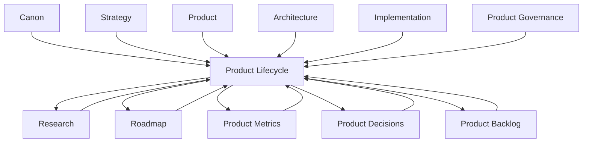

The lifecycle is the operating model for the entire repository.

It explains how documents become action, how action becomes evidence, and how evidence becomes better documents.

## 12. Anti-Patterns

The lifecycle should prevent practices that weaken Organizational Intelligence.

| Anti-Pattern | Why It Weakens Organizational Intelligence |
| --- | --- |
| Building Before Understanding the Problem | Creates features that may not solve real customer needs. |
| Shipping Without Validation | Treats delivery as success without proving value. |
| Ignoring Product Metrics | Prevents the product from learning whether capabilities work. |
| Skipping Human Review | Allows AI output or product decisions to bypass trust and authority. |
| Bypassing Governance | Creates short-term speed and long-term incoherence. |
| Roadmap-Driven Thinking Instead of Evidence-Driven Thinking | Treats planned work as truth even when learning changes priorities. |
| Feature-First Development | Accumulates surfaces without strengthening durable capabilities. |
| Learning Without Documentation | Causes the organization to forget what it learned. |
| Documentation Without Decision Impact | Creates archives that do not improve future work. |
| Architecture Afterthought | Lets implementation choices distort product meaning. |
| Metrics as Vanity Reporting | Rewards activity without measuring capability or customer value. |
| Treating MVP as a Tiny App | Fails to validate the complete Organizational Intelligence system. |

## Anti-Pattern Principle

The product should not move faster by becoming less intelligent.

Speed is valuable when the organization preserves learning, evidence, traceability, and governance.

## 13. Traceability Matrix

| Lifecycle Stage | Primary Repository Artifact | Validation Mechanism |
| --- | --- | --- |
| Customer Problem Discovery | Research, Customer Discovery, Product Backlog | Customer interviews, support signals, workflow observation. |
| Research | Research | Customer interviews, market analysis, competitor research, experiments. |
| Opportunity Definition | Product Backlog, Feature Catalog | Capability mapping, persona and journey alignment. |
| Product Decision | Product Decisions | Evidence review, alternatives analysis, governance review. |
| Backlog | Product Backlog | Strategic prioritization, traceability, confidence assessment. |
| Prioritization | Product Governance, Product Backlog | Customer value, Canon alignment, metrics impact, risk, complexity. |
| Roadmap | Roadmap | Sequencing, dependency review, capability maturity. |
| Product Design | Product, Personas, User Journeys, Workflow Design | UX validation, workflow review, human-AI trust review. |
| Architecture | Architecture | Architecture review, responsibility boundary review. |
| Implementation | Implementation | Engineering standards, implementation validation, operational readiness. |
| Customer Validation | Research, MVP Features | Customer testing, pilot feedback, qualitative validation. |
| Measurement | Product Metrics | KPI validation, North Star support metrics, capability maturity metrics. |
| Learning | Research, Product Decisions, Product Metrics | Continuous improvement, decision review, repository updates. |
| Evolution | Product Governance, Feature Catalog, Product Backlog | Capability maturity gate, deprecation or expansion review. |

## Traceability Principle

Every lifecycle stage should leave behind enough memory for future contributors to understand what happened, why it happened, and what should happen next.

If the lifecycle produces action without traceability, the organization is not learning.

## 14. Limitations

This document intentionally avoids:

- Scrum ceremonies.
- Sprint planning.
- Agile estimation.
- Engineering task management.
- CI/CD workflows.
- Release engineering.
- Deployment pipelines.
- Branching strategy.
- QA automation details.
- Incident response procedures.
- Staffing plans.
- Project scheduling.
- Vendor-specific development processes.

Those belong in Engineering documentation or operational process documents.

This document defines product evolution, not software delivery mechanics.

## 15. Closing

The Product Lifecycle is not a process for producing software.

It is a process for producing Organizational Intelligence.

Every cycle should leave the company with:

- Better customer understanding.
- Stronger product decisions.
- Higher-quality capabilities.
- Richer Organizational Memory.
- More trustworthy AI.
- Improved governance.
- Measurable customer outcomes.

The lifecycle therefore measures success not by how quickly features are delivered, but by how consistently every iteration makes both the product and its customers more capable.

A mature Organizational Intelligence Platform continuously learns from its customers, its product, its metrics, and its own decisions.

The Product Lifecycle is the mechanism that makes that continuous learning possible.

It keeps the product curious without becoming chaotic.

It keeps the company disciplined without becoming rigid.

It ensures that every capability is not merely built, but understood, validated, governed, measured, and improved.
